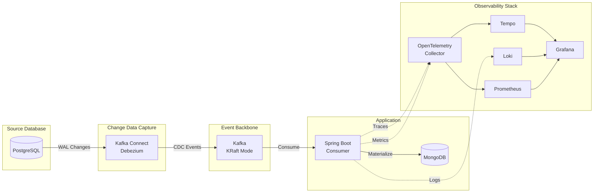
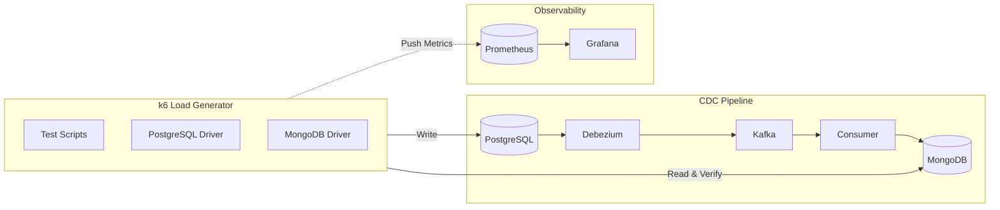

# CDC Debezium Spike

A Spring Boot 4.x spike project demonstrating Change Data Capture (CDC) using Debezium with PostgreSQL and Kafka (KRaft
mode).

## Overview

This project implements a CDC pipeline that:

1. Captures row-level changes from PostgreSQL using logical replication
2. Streams changes to Kafka via Debezium PostgreSQL connector
3. Consumes CDC events in a Spring Boot application with idempotent processing
4. Provides observability through OpenTelemetry (traces, metrics, logs)

**Acceptance tests are the primary means for verifying the entire CDC pipeline.** The Cucumber-based acceptance tests
exercise the complete end-to-end flow, ensuring all components work together correctly.



## What is Change Data Capture (CDC)?

**Change Data Capture (CDC)** is a pattern for tracking row-level changes in a database and propagating those changes to
downstream systems in real-time. This project uses [Debezium](https://debezium.io/) to capture changes from PostgreSQL's
Write-Ahead Log (WAL) and stream them to Kafka.

For detailed information about CDC concepts, Debezium operation, and event formats, see the
[CDC Concepts documentation](docs/documentation/cdc-concepts.md).

## Technology Stack

| Component     | Technology                                      |
|---------------|-------------------------------------------------|
| Language      | Kotlin 2.2                                      |
| Framework     | Spring Boot 4.0, Spring WebFlux                 |
| Database      | PostgreSQL 16 (R2DBC), MongoDB 8.x              |
| Messaging     | Apache Kafka (KRaft mode)                       |
| CDC           | Debezium PostgreSQL Connector                   |
| Observability | OpenTelemetry, Grafana LGTM (Loki, Tempo, Prometheus) |
| Build         | Gradle 9.2 (Kotlin DSL)                         |
| Runtime       | Java 24                                         |
| Testing       | JUnit 5, MockK, Cucumber JVM                    |

## Prerequisites

- [SDKMAN](https://sdkman.io/) for managing Java and Gradle versions
- Docker and Docker Compose

This project includes a `.sdkmanrc` file that specifies the required SDK versions:

```properties
java=24.0.2-amzn
gradle=9.2.1
```

To set up your environment:

```bash
# Navigate to the project directory and activate the SDKs
cd cdc-debezium
sdk env install  # Install required versions (first time only)
sdk env          # Activate the correct Java and Gradle versions

# Verify versions
java -version    # Should show Java 24
gradle -version  # Should show Gradle 9.2.1
```

> **Tip**: Enable SDKMAN auto-env to automatically switch versions when entering the directory.
> Edit `~/.sdkman/etc/config` and set:
> ```properties
> sdkman_auto_env=true
> ```

## Quick Start

### 1. Start Infrastructure

```bash
# Start all services (PostgreSQL, Kafka, MongoDB, Grafana LGTM stack, etc.)
docker compose up -d

# Wait for services to be healthy
docker compose ps

# Verify Kafka Connect is ready
curl -s http://localhost:8083/ | jq

# Open Grafana to view dashboards
open http://localhost:3000  # admin / admin
```

### 2. Deploy Debezium Connector

```bash
# Register the PostgreSQL CDC connector
curl -X POST http://localhost:8083/connectors \
  -H "Content-Type: application/json" \
  -d @docker/debezium/connector-config.json

# Verify connector status
curl -s http://localhost:8083/connectors/postgres-cdc-connector/status | jq
```

### 3. Build and Run Application

```bash
./gradlew clean build bootRun
```

### 4. Test CDC Pipeline

```bash
# Insert a test record
docker compose exec postgres psql -U postgres -c \
  "INSERT INTO customer (id, email, status) VALUES (gen_random_uuid(), 'test@example.com', 'active');"

# Check application logs for CDC event processing
# You should see: "Processing UPSERT for customer: id=..."

# Update the record
docker compose exec postgres psql -U postgres -c \
  "UPDATE customer SET status = 'inactive' WHERE email = 'test@example.com';"

# Delete the record
docker compose exec postgres psql -U postgres -c \
  "DELETE FROM customer WHERE email = 'test@example.com';"
```

## Project Structure

```
cdc-debezium/
├── src/
│   ├── main/
│   │   ├── kotlin/com/pintailconsultingllc/cdcdebezium/
│   │   │   ├── config/          # Jackson, OTel configuration
│   │   │   ├── consumer/        # Kafka CDC consumer
│   │   │   ├── dto/             # Data transfer objects
│   │   │   ├── metrics/         # OpenTelemetry metrics
│   │   │   └── tracing/         # OpenTelemetry tracing
│   │   └── resources/
│   │       ├── application.yml  # Application configuration
│   │       └── logback-spring.xml # Structured logging config
│   ├── test/                    # Unit tests
│   └── acceptanceTest/          # Cucumber acceptance tests
│       ├── kotlin/.../steps/    # Step definitions
│       └── resources/features/  # Gherkin feature files
├── docker/
│   ├── debezium/               # Debezium connector config
│   ├── grafana/                # Grafana dashboards and datasources
│   │   └── provisioning/       # Auto-provisioned dashboards
│   ├── loki/                   # Loki log aggregation config
│   ├── mongodb/init/           # MongoDB initialization scripts
│   ├── otel/                   # OpenTelemetry Collector config
│   ├── postgres/init/          # Database initialization scripts
│   ├── prometheus/             # Prometheus scrape config
│   └── tempo/                  # Tempo tracing config
├── docs/
│   ├── documentation/          # User documentation
│   ├── features/               # Feature specifications
│   └── implementation-plans/   # Implementation task breakdowns
└── docker-compose.yml          # Infrastructure services
```

## Build Commands

```bash
# Build the project
./gradlew build

# Run unit tests only
./gradlew test

# Run acceptance tests only
./gradlew acceptanceTest

# Run MongoDB acceptance tests only
./gradlew mongoDbTest

# Run observability acceptance tests only
./gradlew observabilityTest

# Run all tests
./gradlew check

# Run the application
./gradlew bootRun

# Clean build
./gradlew clean build
```

## Testing

### Acceptance Tests (Primary Verification)

**Acceptance tests are the authoritative way to verify the CDC pipeline works correctly.** They validate the complete
end-to-end flow from database changes through Kafka to the Spring Boot consumer.

The tests use Cucumber JVM with Gherkin feature files located in `src/acceptanceTest/resources/features/`. This approach
ensures:

- All infrastructure components integrate correctly
- CDC events flow through the entire pipeline
- The consumer processes events with correct semantics (upsert/delete)
- Error handling and edge cases are validated

```bash
# Run acceptance tests (requires Docker infrastructure running)
./gradlew clean build acceptanceTest

# View Cucumber HTML report
open build/reports/cucumber/cucumber.html
```

- [Cucumber run report](build/reports/cucumber/cucumber.html)

### Unit Tests

Unit tests validate individual components in isolation using JUnit 5 with MockK:

```bash
# Run all unit tests
./gradlew test

# Run a specific test class
./gradlew test --tests "com.pintailconsultingllc.cdcdebezium.dto.CustomerCdcEventTest"
```

## Infrastructure Services

| Service        | Port        | Description                              |
|----------------|-------------|------------------------------------------|
| PostgreSQL     | 5432        | Source database with logical replication |
| Kafka          | 9092, 29092 | Event backbone (KRaft mode)              |
| Kafka Connect  | 8083        | Debezium connector runtime               |
| Kafka UI       | 8081        | Web UI for Kafka management              |
| MongoDB        | 27017       | Target materialized store                |
| OTel Collector | 4317, 4318  | OpenTelemetry receiver (gRPC/HTTP)       |
| Grafana        | 3000        | Unified observability UI and dashboards  |
| Tempo          | 3200        | Distributed tracing backend              |
| Loki           | 3100        | Log aggregation backend                  |
| Prometheus     | 9090        | Metrics storage and querying             |
| Jaeger         | 16686       | Distributed tracing UI (legacy)          |

### Useful Commands

```bash
# View Kafka topics
docker compose exec kafka kafka-topics --bootstrap-server localhost:9092 --list

# Consume CDC messages
docker compose exec kafka kafka-console-consumer \
  --bootstrap-server localhost:9092 \
  --topic cdc.public.customer \
  --from-beginning

# Check consumer group status
docker compose exec kafka kafka-consumer-groups \
  --bootstrap-server localhost:9092 \
  --describe --group cdc-consumer-group

# View connector status
curl -s http://localhost:8083/connectors/postgres-cdc-connector/status | jq

# Restart connector
curl -X POST http://localhost:8083/connectors/postgres-cdc-connector/restart

# Delete connector
curl -X DELETE http://localhost:8083/connectors/postgres-cdc-connector
```

## Configuration

### Application Configuration

Key settings in `src/main/resources/application.yml`:

```yaml
spring:
  kafka:
    bootstrap-servers: localhost:29092
    consumer:
      group-id: cdc-consumer-group
      auto-offset-reset: earliest
      enable-auto-commit: false
    listener:
      ack-mode: manual
      concurrency: 1
```

### Debezium Connector Configuration

Key settings in `docker/debezium/connector-config.json`:

- **Topic prefix**: `cdc` (topics named `cdc.public.customer`)
- **Snapshot mode**: `initial` (snapshot existing data on first run)
- **Delete handling**: `rewrite` (adds `__deleted` field)
- **Tombstones**: Enabled for Kafka log compaction

## Observability

This project includes a complete Grafana LGTM observability stack with distributed tracing, metrics, log aggregation,
and pre-built dashboards.

### Grafana Dashboards

The project includes 5 pre-provisioned Grafana dashboards for monitoring the CDC pipeline:

| Dashboard | Purpose |
|-----------|---------|
| **CDC Overview** | High-level pipeline health, throughput, and error rates |
| **Consumer Performance** | Kafka consumer metrics, processing latency, and lag |
| **MongoDB Operations** | Database operation metrics, query performance |
| **Service Map** | Distributed trace visualization and service dependencies |
| **Logs Explorer** | Centralized log search and correlation with traces |

### Observability Stack

| Component | Port | Purpose |
|-----------|------|---------|
| Grafana | 3000 | Unified observability UI with dashboards |
| Tempo | 3200 | Distributed tracing backend |
| Loki | 3100 | Log aggregation and querying |
| Prometheus | 9090 | Metrics storage and querying |
| OTel Collector | 4317, 4318 | OTLP receiver (gRPC/HTTP) |

```bash
# Open Grafana UI (dashboards, traces, logs, metrics)
open http://localhost:3000
# Default credentials: admin / admin

# Open Prometheus UI (direct metrics queries)
open http://localhost:9090

# Open Jaeger UI (legacy tracing)
open http://localhost:16686
```

For detailed information about tracing, metrics, Prometheus queries, and structured logging, see the
[Observability documentation](docs/documentation/observability.md).

## Load Testing

This project includes a k6 load testing infrastructure for performance testing the CDC pipeline end-to-end.

### Quick Start

```bash
# 1. Ensure the CDC infrastructure is running
docker compose up -d

# 2. Build the custom k6 image (first time only)
docker compose -f k6/docker-compose.k6.yml build k6

# 3. Run the health check to verify connectivity
docker compose -f k6/docker-compose.k6.yml run --rm k6 run /scripts/health-check.js

# 4. Run load tests with Prometheus metrics export
docker compose -f k6/docker-compose.k6.yml run --rm k6 run \
  --out experimental-prometheus-rw \
  /scripts/health-check.js
```

### k6 Extensions

The custom k6 build includes:

| Extension | Purpose |
|-----------|---------|
| `xk6-sql` | PostgreSQL write operations |
| `xk6-mongo` | MongoDB read verification |
| `xk6-output-prometheus-remote` | Prometheus metrics export |

### Load Test Architecture



For detailed usage, see the [k6 Load Testing README](k6/README.md).

## Troubleshooting

For common issues and solutions, see the [Troubleshooting Guide](docs/documentation/troubleshooting.md).

Quick diagnostics:

```bash
# Check all service health
docker compose ps

# Check connector status
curl -s http://localhost:8083/connectors/postgres-cdc-connector/status | jq

# Check consumer group lag
docker compose exec kafka kafka-consumer-groups \
  --bootstrap-server localhost:9092 \
  --describe --group cdc-consumer-group
```

## Documentation

- [CDC Concepts](docs/documentation/cdc-concepts.md) - Change Data Capture and Debezium fundamentals
- [MongoDB Infrastructure](docs/documentation/nosql-mongodb.md) - Target materialized store setup and usage
- [Observability](docs/documentation/observability.md) - Tracing, metrics, and structured logging
- [Troubleshooting](docs/documentation/troubleshooting.md) - Common issues and solutions
- [Feature Specification](docs/features/FEATURE-001.md) - Complete CDC spike specification
- [Implementation Plans](docs/implementation-plans/) - Task breakdowns for each component

## License

This project is licensed under the MIT License - see the [LICENSE](LICENSE) file for details.
