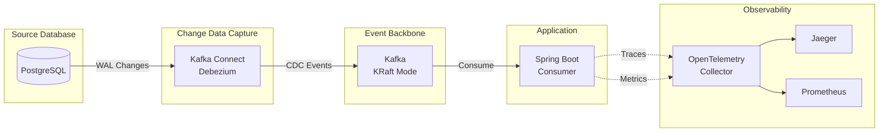

# CDC Debezium Spike

A Spring Boot 4.x spike project demonstrating Change Data Capture (CDC) using Debezium with PostgreSQL and Kafka (KRaft mode).

## Overview

This project implements a CDC pipeline that:

1. Captures row-level changes from PostgreSQL using logical replication
2. Streams changes to Kafka via Debezium PostgreSQL connector
3. Consumes CDC events in a Spring Boot application with idempotent processing
4. Provides observability through OpenTelemetry (traces, metrics, logs)

**Acceptance tests are the primary means for verifying the entire CDC pipeline.** The Cucumber-based acceptance tests exercise the complete end-to-end flow, ensuring all components work together correctly.



## Technology Stack

| Component | Technology |
|-----------|------------|
| Language | Kotlin 2.2 |
| Framework | Spring Boot 4.0, Spring WebFlux |
| Database | PostgreSQL 16 (R2DBC) |
| Messaging | Apache Kafka (KRaft mode) |
| CDC | Debezium PostgreSQL Connector |
| Observability | OpenTelemetry, Jaeger, Prometheus |
| Build | Gradle 9.2 (Kotlin DSL) |
| Runtime | Java 24 |
| Testing | JUnit 5, MockK, Cucumber JVM |

## Prerequisites

- [SDKMAN](https://sdkman.io/) for managing Java and Gradle versions
- Docker and Docker Compose

This project includes a `.sdkmanrc` file that specifies the required SDK versions:

```properties
java=24.0.2-amzn
gradle=9.2.1
```

To set up your environment:

```bash
# Navigate to the project directory and activate the SDKs
cd cdc-debezium
sdk env install  # Install required versions (first time only)
sdk env          # Activate the correct Java and Gradle versions

# Verify versions
java -version    # Should show Java 24
gradle -version  # Should show Gradle 9.2.1
```

> **Tip**: Enable SDKMAN auto-env to automatically switch versions when entering the directory.
> Edit `~/.sdkman/etc/config` and set:
> ```properties
> sdkman_auto_env=true
> ```

## Quick Start

### 1. Start Infrastructure

```bash
# Start PostgreSQL, Kafka, Kafka Connect, and Kafka UI
docker compose up -d

# Wait for services to be healthy
docker compose ps

# Verify Kafka Connect is ready
curl -s http://localhost:8083/ | jq
```

### 2. Deploy Debezium Connector

```bash
# Register the PostgreSQL CDC connector
curl -X POST http://localhost:8083/connectors \
  -H "Content-Type: application/json" \
  -d @docker/debezium/connector-config.json

# Verify connector status
curl -s http://localhost:8083/connectors/postgres-cdc-connector/status | jq
```

### 3. Build and Run Application

```bash
./gradlew clean build bootRun
```

### 4. Test CDC Pipeline

```bash
# Insert a test record
docker compose exec postgres psql -U postgres -c \
  "INSERT INTO customer (id, email, status) VALUES (gen_random_uuid(), 'test@example.com', 'active');"

# Check application logs for CDC event processing
# You should see: "Processing UPSERT for customer: id=..."

# Update the record
docker compose exec postgres psql -U postgres -c \
  "UPDATE customer SET status = 'inactive' WHERE email = 'test@example.com';"

# Delete the record
docker compose exec postgres psql -U postgres -c \
  "DELETE FROM customer WHERE email = 'test@example.com';"
```

## Project Structure

```
cdc-debezium/
├── src/
│   ├── main/
│   │   ├── kotlin/com/pintailconsultingllc/cdcdebezium/
│   │   │   ├── config/          # Jackson configuration
│   │   │   ├── consumer/        # Kafka CDC consumer
│   │   │   └── dto/             # Data transfer objects
│   │   └── resources/
│   │       └── application.yml  # Application configuration
│   ├── test/                    # Unit tests
│   └── acceptanceTest/          # Cucumber acceptance tests
│       ├── kotlin/.../steps/    # Step definitions
│       └── resources/features/  # Gherkin feature files
├── docker/
│   ├── debezium/               # Debezium connector config
│   └── postgres/init/          # Database initialization scripts
├── docs/
│   ├── features/               # Feature specifications
│   └── implementation-plans/   # Implementation task breakdowns
└── docker-compose.yml          # Infrastructure services
```

## Build Commands

```bash
# Build the project
./gradlew build

# Run unit tests only
./gradlew test

# Run acceptance tests only
./gradlew acceptanceTest

# Run all tests
./gradlew check

# Run the application
./gradlew bootRun

# Clean build
./gradlew clean build
```

## Testing

### Acceptance Tests (Primary Verification)

**Acceptance tests are the authoritative way to verify the CDC pipeline works correctly.** They validate the complete end-to-end flow from database changes through Kafka to the Spring Boot consumer.

The tests use Cucumber JVM with Gherkin feature files located in `src/acceptanceTest/resources/features/`. This approach ensures:

- All infrastructure components integrate correctly
- CDC events flow through the entire pipeline
- The consumer processes events with correct semantics (upsert/delete)
- Error handling and edge cases are validated

```bash
# Run acceptance tests (requires Docker infrastructure running)
./gradlew acceptanceTest

# View Cucumber HTML report
open build/reports/cucumber/cucumber.html
```

### Unit Tests

Unit tests validate individual components in isolation using JUnit 5 with MockK:

```bash
# Run all unit tests
./gradlew test

# Run a specific test class
./gradlew test --tests "com.pintailconsultingllc.cdcdebezium.dto.CustomerCdcEventTest"
```

## Infrastructure Services

| Service | Port | Description |
|---------|------|-------------|
| PostgreSQL | 5432 | Source database with logical replication |
| Kafka | 9092, 29092 | Event backbone (KRaft mode) |
| Kafka Connect | 8083 | Debezium connector runtime |
| Kafka UI | 8081 | Web UI for Kafka management |

### Useful Commands

```bash
# View Kafka topics
docker compose exec kafka kafka-topics --bootstrap-server localhost:9092 --list

# Consume CDC messages
docker compose exec kafka kafka-console-consumer \
  --bootstrap-server localhost:9092 \
  --topic cdc.public.customer \
  --from-beginning

# Check consumer group status
docker compose exec kafka kafka-consumer-groups \
  --bootstrap-server localhost:9092 \
  --describe --group cdc-consumer-group

# View connector status
curl -s http://localhost:8083/connectors/postgres-cdc-connector/status | jq

# Restart connector
curl -X POST http://localhost:8083/connectors/postgres-cdc-connector/restart

# Delete connector
curl -X DELETE http://localhost:8083/connectors/postgres-cdc-connector
```

## Configuration

### Application Configuration

Key settings in `src/main/resources/application.yml`:

```yaml
spring:
  kafka:
    bootstrap-servers: localhost:29092
    consumer:
      group-id: cdc-consumer-group
      auto-offset-reset: earliest
      enable-auto-commit: false
    listener:
      ack-mode: manual
      concurrency: 1
```

### Debezium Connector Configuration

Key settings in `docker/debezium/connector-config.json`:

- **Topic prefix**: `cdc` (topics named `cdc.public.customer`)
- **Snapshot mode**: `initial` (snapshot existing data on first run)
- **Delete handling**: `rewrite` (adds `__deleted` field)
- **Tombstones**: Enabled for Kafka log compaction

## CDC Event Format

### Insert/Update Event

```json
{
  "id": "550e8400-e29b-41d4-a716-446655440000",
  "email": "user@example.com",
  "status": "active",
  "updated_at": "2024-01-15T10:30:00Z",
  "__op": "c",
  "__source_ts_ms": 1705315800000
}
```

### Delete Event (Rewrite Mode)

```json
{
  "id": "550e8400-e29b-41d4-a716-446655440000",
  "email": "user@example.com",
  "status": "active",
  "updated_at": "2024-01-15T10:30:00Z",
  "__deleted": "true",
  "__op": "d",
  "__source_ts_ms": 1705315800000
}
```

### Operation Codes

| Code | Meaning |
|------|---------|
| `c` | Create (INSERT) |
| `u` | Update |
| `d` | Delete |
| `r` | Read (snapshot) |

## Troubleshooting

### Connector Not Starting

```bash
# Check connector logs
docker compose logs kafka-connect

# Verify PostgreSQL replication settings
docker compose exec postgres psql -U postgres -c "SHOW wal_level;"
# Should return: logical
```

### No CDC Events

```bash
# Verify connector is running
curl -s http://localhost:8083/connectors/postgres-cdc-connector/status | jq '.connector.state'
# Should return: "RUNNING"

# Check for replication slot
docker compose exec postgres psql -U postgres -c "SELECT * FROM pg_replication_slots;"
```

### Consumer Not Receiving Messages

```bash
# Check if topic exists
docker compose exec kafka kafka-topics --bootstrap-server localhost:9092 --list

# Check consumer group lag
docker compose exec kafka kafka-consumer-groups \
  --bootstrap-server localhost:9092 \
  --describe --group cdc-consumer-group
```

## Documentation

- [Feature Specification](docs/features/FEATURE-001.md) - Complete CDC spike specification
- [Implementation Plans](docs/implementation-plans/) - Task breakdowns for each component

## License

This project is a spike/proof-of-concept for educational purposes.
