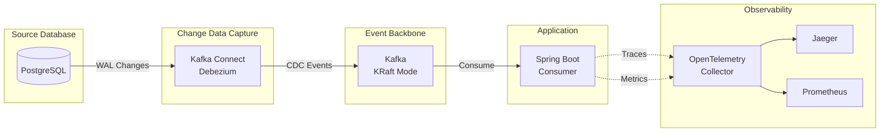
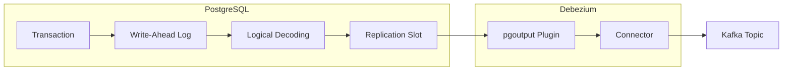

# CDC Debezium Spike

A Spring Boot 4.x spike project demonstrating Change Data Capture (CDC) using Debezium with PostgreSQL and Kafka (KRaft
mode).

## Overview

This project implements a CDC pipeline that:

1. Captures row-level changes from PostgreSQL using logical replication
2. Streams changes to Kafka via Debezium PostgreSQL connector
3. Consumes CDC events in a Spring Boot application with idempotent processing
4. Provides observability through OpenTelemetry (traces, metrics, logs)

**Acceptance tests are the primary means for verifying the entire CDC pipeline.** The Cucumber-based acceptance tests
exercise the complete end-to-end flow, ensuring all components work together correctly.



## What is Change Data Capture (CDC)?

**Change Data Capture (CDC)** is a pattern for tracking row-level changes in a database and propagating those changes to
downstream systems in real-time. Instead of polling for changes or relying on application-level events, CDC captures
changes directly from the database's transaction log.

### Why CDC?

| Approach           | Drawbacks                                           |
|--------------------|-----------------------------------------------------|
| Polling            | Inefficient, delayed, misses intermediate states    |
| Application events | Requires code changes, can miss direct DB updates   |
| Triggers           | Performance impact, tight coupling                  |
| **CDC**            | Non-invasive, captures all changes, preserves order |

### How Debezium Works

[Debezium](https://debezium.io/) is an open-source CDC platform that captures changes from various databases and streams
them to Kafka. For PostgreSQL, Debezium leverages **logical decoding**—a mechanism that extracts committed changes from
the Write-Ahead Log (WAL) in a consumable format.



**Key components:**

- **Write-Ahead Log (WAL)**: PostgreSQL's transaction log where all changes are recorded before being applied to tables
- **Logical Decoding**: PostgreSQL feature that transforms WAL entries into a logical change stream
- **pgoutput Plugin**: PostgreSQL's native output plugin (v10+) that formats changes for replication
- **Replication Slot**: Maintains the connector's read position, preventing WAL cleanup until changes are consumed
- **Log Sequence Number (LSN)**: Unique position in the WAL, used to track progress and enable exactly-once delivery

### Debezium Connector Operation

The connector operates in two phases:

1. **Initial Snapshot**: On first start, captures a consistent snapshot of all existing data as READ events
2. **Continuous Streaming**: After snapshot completion, monitors the WAL for INSERT, UPDATE, and DELETE operations

This ensures consumers receive a complete picture of the data, followed by real-time updates.

For more details, see
the [Debezium PostgreSQL Connector documentation](https://debezium.io/documentation/reference/stable/connectors/postgresql.html).

## Technology Stack

| Component     | Technology                        |
|---------------|-----------------------------------|
| Language      | Kotlin 2.2                        |
| Framework     | Spring Boot 4.0, Spring WebFlux   |
| Database      | PostgreSQL 16 (R2DBC)             |
| Messaging     | Apache Kafka (KRaft mode)         |
| CDC           | Debezium PostgreSQL Connector     |
| Observability | OpenTelemetry, Jaeger, Prometheus |
| Build         | Gradle 9.2 (Kotlin DSL)           |
| Runtime       | Java 24                           |
| Testing       | JUnit 5, MockK, Cucumber JVM      |

## Prerequisites

- [SDKMAN](https://sdkman.io/) for managing Java and Gradle versions
- Docker and Docker Compose

This project includes a `.sdkmanrc` file that specifies the required SDK versions:

```properties
java=24.0.2-amzn
gradle=9.2.1
```

To set up your environment:

```bash
# Navigate to the project directory and activate the SDKs
cd cdc-debezium
sdk env install  # Install required versions (first time only)
sdk env          # Activate the correct Java and Gradle versions

# Verify versions
java -version    # Should show Java 24
gradle -version  # Should show Gradle 9.2.1
```

> **Tip**: Enable SDKMAN auto-env to automatically switch versions when entering the directory.
> Edit `~/.sdkman/etc/config` and set:
> ```properties
> sdkman_auto_env=true
> ```

## Quick Start

### 1. Start Infrastructure

```bash
# Start PostgreSQL, Kafka, Kafka Connect, and Kafka UI
docker compose up -d

# Wait for services to be healthy
docker compose ps

# Verify Kafka Connect is ready
curl -s http://localhost:8083/ | jq
```

### 2. Deploy Debezium Connector

```bash
# Register the PostgreSQL CDC connector
curl -X POST http://localhost:8083/connectors \
  -H "Content-Type: application/json" \
  -d @docker/debezium/connector-config.json

# Verify connector status
curl -s http://localhost:8083/connectors/postgres-cdc-connector/status | jq
```

### 3. Build and Run Application

```bash
./gradlew clean build bootRun
```

### 4. Test CDC Pipeline

```bash
# Insert a test record
docker compose exec postgres psql -U postgres -c \
  "INSERT INTO customer (id, email, status) VALUES (gen_random_uuid(), 'test@example.com', 'active');"

# Check application logs for CDC event processing
# You should see: "Processing UPSERT for customer: id=..."

# Update the record
docker compose exec postgres psql -U postgres -c \
  "UPDATE customer SET status = 'inactive' WHERE email = 'test@example.com';"

# Delete the record
docker compose exec postgres psql -U postgres -c \
  "DELETE FROM customer WHERE email = 'test@example.com';"
```

## Project Structure

```
cdc-debezium/
├── src/
│   ├── main/
│   │   ├── kotlin/com/pintailconsultingllc/cdcdebezium/
│   │   │   ├── config/          # Jackson, OTel configuration
│   │   │   ├── consumer/        # Kafka CDC consumer
│   │   │   ├── dto/             # Data transfer objects
│   │   │   ├── metrics/         # OpenTelemetry metrics
│   │   │   └── tracing/         # OpenTelemetry tracing
│   │   └── resources/
│   │       ├── application.yml  # Application configuration
│   │       └── logback-spring.xml # Structured logging config
│   ├── test/                    # Unit tests
│   └── acceptanceTest/          # Cucumber acceptance tests
│       ├── kotlin/.../steps/    # Step definitions
│       └── resources/features/  # Gherkin feature files
├── docker/
│   ├── debezium/               # Debezium connector config
│   ├── otel/                   # OpenTelemetry Collector config
│   ├── postgres/init/          # Database initialization scripts
│   └── prometheus/             # Prometheus scrape config
├── docs/
│   ├── features/               # Feature specifications
│   └── implementation-plans/   # Implementation task breakdowns
└── docker-compose.yml          # Infrastructure services
```

## Build Commands

```bash
# Build the project
./gradlew build

# Run unit tests only
./gradlew test

# Run acceptance tests only
./gradlew acceptanceTest

# Run all tests
./gradlew check

# Run the application
./gradlew bootRun

# Clean build
./gradlew clean build
```

## Testing

### Acceptance Tests (Primary Verification)

**Acceptance tests are the authoritative way to verify the CDC pipeline works correctly.** They validate the complete
end-to-end flow from database changes through Kafka to the Spring Boot consumer.

The tests use Cucumber JVM with Gherkin feature files located in `src/acceptanceTest/resources/features/`. This approach
ensures:

- All infrastructure components integrate correctly
- CDC events flow through the entire pipeline
- The consumer processes events with correct semantics (upsert/delete)
- Error handling and edge cases are validated

```bash
# Run acceptance tests (requires Docker infrastructure running)
./gradlew clean build acceptanceTest

# View Cucumber HTML report
open build/reports/cucumber/cucumber.html
```

- [Cucumber run report](build/reports/cucumber/cucumber.html)

### Unit Tests

Unit tests validate individual components in isolation using JUnit 5 with MockK:

```bash
# Run all unit tests
./gradlew test

# Run a specific test class
./gradlew test --tests "com.pintailconsultingllc.cdcdebezium.dto.CustomerCdcEventTest"
```

## Infrastructure Services

| Service       | Port        | Description                              |
|---------------|-------------|------------------------------------------|
| PostgreSQL    | 5432        | Source database with logical replication |
| Kafka         | 9092, 29092 | Event backbone (KRaft mode)              |
| Kafka Connect | 8083        | Debezium connector runtime               |
| Kafka UI      | 8081        | Web UI for Kafka management              |
| OTel Collector| 4317, 4318  | OpenTelemetry receiver (gRPC/HTTP)       |
| Jaeger        | 16686       | Distributed tracing UI                   |
| Prometheus    | 9090        | Metrics storage and UI                   |

### Useful Commands

```bash
# View Kafka topics
docker compose exec kafka kafka-topics --bootstrap-server localhost:9092 --list

# Consume CDC messages
docker compose exec kafka kafka-console-consumer \
  --bootstrap-server localhost:9092 \
  --topic cdc.public.customer \
  --from-beginning

# Check consumer group status
docker compose exec kafka kafka-consumer-groups \
  --bootstrap-server localhost:9092 \
  --describe --group cdc-consumer-group

# View connector status
curl -s http://localhost:8083/connectors/postgres-cdc-connector/status | jq

# Restart connector
curl -X POST http://localhost:8083/connectors/postgres-cdc-connector/restart

# Delete connector
curl -X DELETE http://localhost:8083/connectors/postgres-cdc-connector
```

## Configuration

### Application Configuration

Key settings in `src/main/resources/application.yml`:

```yaml
spring:
  kafka:
    bootstrap-servers: localhost:29092
    consumer:
      group-id: cdc-consumer-group
      auto-offset-reset: earliest
      enable-auto-commit: false
    listener:
      ack-mode: manual
      concurrency: 1
```

### Debezium Connector Configuration

Key settings in `docker/debezium/connector-config.json`:

- **Topic prefix**: `cdc` (topics named `cdc.public.customer`)
- **Snapshot mode**: `initial` (snapshot existing data on first run)
- **Delete handling**: `rewrite` (adds `__deleted` field)
- **Tombstones**: Enabled for Kafka log compaction

## Observability

This project includes full OpenTelemetry observability with distributed tracing, metrics, and structured logging.

### Observability Stack

| Component | Port | Purpose |
|-----------|------|---------|
| OpenTelemetry Collector | 4317, 4318 | OTLP receiver (gRPC/HTTP) |
| Jaeger | 16686 | Distributed tracing UI |
| Prometheus | 9090 | Metrics storage and querying |

### Accessing Observability UIs

```bash
# Open Jaeger UI (traces)
open http://localhost:16686

# Open Prometheus UI (metrics)
open http://localhost:9090

# Check OTel Collector health
curl -s http://localhost:8888/metrics | head -20
```

### Tracing

The CDC consumer emits spans for each message processed with the following attributes:

- `messaging.system`: kafka
- `messaging.destination.name`: cdc.public.customer
- `messaging.kafka.consumer.group`: cdc-consumer-group
- `messaging.kafka.partition`: partition number
- `messaging.kafka.message.offset`: message offset
- `db.operation`: upsert, delete, or ignore

To find traces in Jaeger:
1. Open http://localhost:16686
2. Select service: `cdc-consumer`
3. Search for operations: `cdc.public.customer process`

### Metrics

The application exposes the following custom metrics via OpenTelemetry:

| Metric | Type | Description |
|--------|------|-------------|
| `cdc_messages_processed_total` | Counter | Total CDC messages processed |
| `cdc_messages_errors_total` | Counter | Processing errors |
| `cdc_processing_latency` | Histogram | Processing latency (ms) |
| `cdc_db_upserts_total` | Counter | Database upsert operations |
| `cdc_db_deletes_total` | Counter | Database delete operations |

### Prometheus Queries

```promql
# Throughput (messages/sec)
rate(cdc_messages_processed_total[1m])

# Error rate
rate(cdc_messages_errors_total[1m]) / rate(cdc_messages_processed_total[1m])

# P95 latency
histogram_quantile(0.95, rate(cdc_processing_latency_bucket[5m]))

# Consumer lag
kafka_consumer_records_lag_max
```

### Structured Logging

Logs are output in JSON format with trace correlation:

```json
{
  "@timestamp": "2024-01-15T10:30:00.123+0000",
  "level": "INFO",
  "message": "CDC event processed successfully",
  "service": "cdc-consumer",
  "trace_id": "abc123def456",
  "span_id": "789xyz",
  "kafka_topic": "cdc.public.customer",
  "kafka_partition": "0",
  "kafka_offset": "42",
  "db_operation": "upsert"
}
```

Use the `trace_id` from logs to find the corresponding trace in Jaeger.

## CDC Event Format

### Insert/Update Event

```json
{
  "id": "550e8400-e29b-41d4-a716-446655440000",
  "email": "user@example.com",
  "status": "active",
  "updated_at": "2024-01-15T10:30:00Z",
  "__op": "c",
  "__source_ts_ms": 1705315800000
}
```

### Delete Event (Rewrite Mode)

```json
{
  "id": "550e8400-e29b-41d4-a716-446655440000",
  "email": "user@example.com",
  "status": "active",
  "updated_at": "2024-01-15T10:30:00Z",
  "__deleted": "true",
  "__op": "d",
  "__source_ts_ms": 1705315800000
}
```

### Operation Codes

| Code | Meaning         |
|------|-----------------|
| `c`  | Create (INSERT) |
| `u`  | Update          |
| `d`  | Delete          |
| `r`  | Read (snapshot) |

## Troubleshooting

### Connector Not Starting

```bash
# Check connector logs
docker compose logs kafka-connect

# Verify PostgreSQL replication settings
docker compose exec postgres psql -U postgres -c "SHOW wal_level;"
# Should return: logical
```

### No CDC Events

```bash
# Verify connector is running
curl -s http://localhost:8083/connectors/postgres-cdc-connector/status | jq '.connector.state'
# Should return: "RUNNING"

# Check for replication slot
docker compose exec postgres psql -U postgres -c "SELECT * FROM pg_replication_slots;"
```

### Consumer Not Receiving Messages

```bash
# Check if topic exists
docker compose exec kafka kafka-topics --bootstrap-server localhost:9092 --list

# Check consumer group lag
docker compose exec kafka kafka-consumer-groups \
  --bootstrap-server localhost:9092 \
  --describe --group cdc-consumer-group
```

### No Traces in Jaeger

```bash
# Verify OTel Collector is running
docker compose ps otel-collector

# Check OTel Collector logs
docker compose logs otel-collector

# Verify OTLP endpoint is receiving data
curl -s http://localhost:8888/metrics | grep otel

# Test OTLP connectivity
curl -X POST http://localhost:4318/v1/traces \
  -H "Content-Type: application/json" \
  -d '{"resourceSpans":[]}'
```

### No Metrics in Prometheus

```bash
# Verify Prometheus targets are UP
open http://localhost:9090/targets

# Check OTel Collector Prometheus exporter
curl -s http://localhost:8889/metrics | head -50

# Verify application is exporting metrics
curl -s http://localhost:8080/actuator/prometheus 2>/dev/null || echo "App not running"
```

### Correlating Logs with Traces

1. Find a `trace_id` in application logs
2. Open Jaeger: http://localhost:16686
3. Use "Search by Trace ID" with the trace ID
4. View the complete trace with all spans

## Documentation

- [Feature Specification](docs/features/FEATURE-001.md) - Complete CDC spike specification
- [Implementation Plans](docs/implementation-plans/) - Task breakdowns for each component

## License

This project is licensed under the MIT License - see the [LICENSE](LICENSE) file for details.
