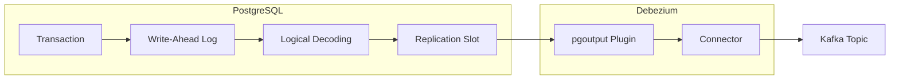

# Change Data Capture (CDC) Concepts

**Change Data Capture (CDC)** is a pattern for tracking row-level changes in a database and propagating those changes to
downstream systems in real-time. Instead of polling for changes or relying on application-level events, CDC captures
changes directly from the database's transaction log.

## Why CDC?

| Approach           | Drawbacks                                           |
|--------------------|-----------------------------------------------------|
| Polling            | Inefficient, delayed, misses intermediate states    |
| Application events | Requires code changes, can miss direct DB updates   |
| Triggers           | Performance impact, tight coupling                  |
| **CDC**            | Non-invasive, captures all changes, preserves order |

## How Debezium Works

[Debezium](https://debezium.io/) is an open-source CDC platform that captures changes from various databases and streams
them to Kafka. For PostgreSQL, Debezium leverages **logical decoding**—a mechanism that extracts committed changes from
the Write-Ahead Log (WAL) in a consumable format.



## Key Components

- **Write-Ahead Log (WAL)**: PostgreSQL's transaction log where all changes are recorded before being applied to tables
- **Logical Decoding**: PostgreSQL feature that transforms WAL entries into a logical change stream
- **pgoutput Plugin**: PostgreSQL's native output plugin (v10+) that formats changes for replication
- **Replication Slot**: Maintains the connector's read position, preventing WAL cleanup until changes are consumed
- **Log Sequence Number (LSN)**: Unique position in the WAL, used to track progress and enable exactly-once delivery

## Debezium Connector Operation

The connector operates in two phases:

1. **Initial Snapshot**: On first start, captures a consistent snapshot of all existing data as READ events
2. **Continuous Streaming**: After snapshot completion, monitors the WAL for INSERT, UPDATE, and DELETE operations

This ensures consumers receive a complete picture of the data, followed by real-time updates.

## CDC Event Format

### Insert/Update Event

```json
{
  "id": "550e8400-e29b-41d4-a716-446655440000",
  "email": "user@example.com",
  "status": "active",
  "updated_at": "2024-01-15T10:30:00Z",
  "__op": "c",
  "__source_ts_ms": 1705315800000
}
```

### Delete Event (Rewrite Mode)

```json
{
  "id": "550e8400-e29b-41d4-a716-446655440000",
  "email": "user@example.com",
  "status": "active",
  "updated_at": "2024-01-15T10:30:00Z",
  "__deleted": "true",
  "__op": "d",
  "__source_ts_ms": 1705315800000
}
```

### Operation Codes

| Code | Meaning         |
|------|-----------------|
| `c`  | Create (INSERT) |
| `u`  | Update          |
| `d`  | Delete          |
| `r`  | Read (snapshot) |

## Further Reading

- [Debezium PostgreSQL Connector documentation](https://debezium.io/documentation/reference/stable/connectors/postgresql.html)
- [PostgreSQL Logical Replication](https://www.postgresql.org/docs/current/logical-replication.html)
