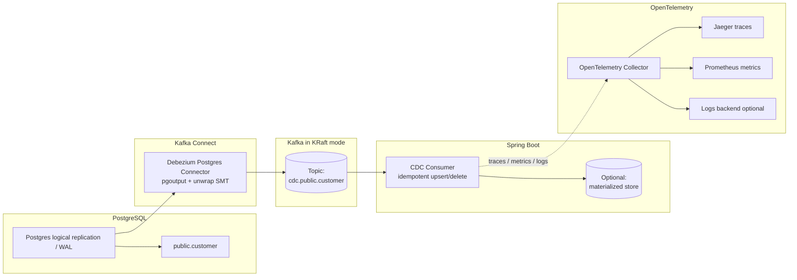

# Feature Specification: Postgres → Kafka CDC Spike (KRaft, Docker Compose, OpenTelemetry)

## Feature Name
**Postgres Change Data Capture (CDC) Spike via Debezium + Kafka (KRaft) with OpenTelemetry Observability**

---

## Objective
Evaluate a production-viable CDC pipeline using:

- **PostgreSQL** as the source database
- **Kafka (KRaft mode, no ZooKeeper)** as the event backbone
- **Debezium PostgreSQL connector** running in Kafka Connect
- **Spring Boot consumer** that materializes state from CDC events
- **OpenTelemetry** for traces, metrics, and log correlation

Primary outcome: validate correctness and operability, including visibility into lag, throughput, and failures across the pipeline.

---

## Goals
- Capture **INSERT / UPDATE / DELETE** operations from Postgres using **log-based CDC**
- Emit changes into Kafka topics with stable naming and keys
- Consume CDC events in Spring Boot using **idempotent upsert/delete semantics**
- Instrument the consumer with **OpenTelemetry**:
  - traces for message processing
  - metrics for throughput, latency, errors, lag
  - structured logs correlated with trace context
- Run **entirely locally** using **Docker Compose**

---

## Non-Goals
- High availability or multi-node Kafka
- Security hardening (TLS, SASL, ACLs)
- Full schema governance (Avro/Protobuf + Schema Registry)
- Distributed tracing inside Postgres WAL internals
- Production-grade dashboards

---

## High-Level Architecture



---

## Technology Stack
- PostgreSQL (Debezium-compatible image, logical replication enabled)
- Kafka (single-node **KRaft** mode)
- Kafka Connect (Debezium Connect image)
- Debezium PostgreSQL Connector
- Spring Boot (Kafka consumer)
- OpenTelemetry Java (SDK or agent)
- OpenTelemetry Collector
- Jaeger (traces)
- Prometheus (metrics)
- Docker Compose
- JSON serialization (schemas disabled)

---

## Source Data Model

### Table: `public.customer`

```sql
id           UUID PRIMARY KEY
email        TEXT NOT NULL
status       TEXT NOT NULL
updated_at   TIMESTAMPTZ NOT NULL DEFAULT now()
```

### Supported Operations
- INSERT
- UPDATE
- DELETE

---

## CDC Behavior Requirements

### Snapshot
- Debezium must emit an **initial snapshot** of existing rows exactly once
- After snapshot completion, CDC switches to streaming mode

### Streaming
- INSERT / UPDATE / DELETE events are emitted to Kafka
- Ordering is preserved **per primary key**
- Deletes are observable by the consumer

### Deletes
- Debezium configuration must:
  - rewrite deletes (`delete.handling.mode=rewrite`)
  - emit Kafka tombstones (`tombstones.on.delete=true`)
- Consumer must handle rewritten deletes and tolerate tombstones

---

## Kafka Topic Requirements
- Topic name format: `cdc.<schema>.<table>`  
  Example: `cdc.public.customer`
- Message key: primary key (`id`)
- Default partitioning acceptable for spike
- Consumer concurrency = 1

---

## Kafka Connect Requirements
- Compatible with Kafka in KRaft mode
- JSON converters:
  - `schemas.enable=false`
- Debezium SMTs:
  - `ExtractNewRecordState` (unwrap)
  - delete rewrite enabled
  - tombstones preserved
- Stable replication slot name
- Filtered publication for target table only

---

## Spring Boot Consumer Requirements

### Consumption Model
- Single consumer group
- Concurrency = 1
- Manual acknowledgements
- Explicit error handling strategy (log + skip acceptable for spike)

### Message Handling Rules

| Condition | Behavior |
|---------|----------|
| Normal row payload | Upsert record by primary key |
| Delete rewrite payload | Delete record by primary key |
| Kafka tombstone (`null` value) | Ignore or log |

### Idempotency
- Upserts must be idempotent
- Deletes must succeed even if record is missing

---

## OpenTelemetry Observability Requirements

### Scope
- Required instrumentation: **Spring Boot CDC consumer**
- Kafka Connect instrumentation optional

---

### Tracing
- Emit a span per message (or per batch)
- Required attributes:
  - `messaging.system = kafka`
  - `messaging.destination.name`
  - `messaging.kafka.consumer.group`
  - `messaging.kafka.partition`
  - `messaging.kafka.message.offset`
  - `messaging.operation = process`
  - `db.operation = upsert | delete | ignore`
- Continue trace from Kafka headers if present; otherwise start new trace

---

### Metrics
Expose metrics via OTel → Prometheus:
- messages processed / second
- processing latency (histogram)
- error counts
- consumer lag (Kafka client metrics or derived)
- DB write counts (upserts, deletes)

---

### Logging
- Structured logs must include:
  - `trace_id`, `span_id`
  - topic / partition / offset
  - message key (safe/truncated)
  - processing outcome
- Logs must correlate with traces via context propagation

---

### Collector & Backends
- OpenTelemetry Collector included in Docker Compose
- Traces exported to **Jaeger**
- Metrics exported to **Prometheus**
- Logs backend optional

---

## Failure & Recovery Scenarios (Must Be Tested)
1. Kafka Connect restart with DB changes applied during downtime
2. Consumer restart with backlog of CDC events
3. Kafka restart and recovery
4. Forced consumer processing error and observability verification

---

## Schema Evolution Scenario
- Add a nullable column to `customer`
- CDC continues without failure
- Consumer tolerates additional fields

---

## Success Criteria
The spike is successful when:
1. End-to-end CDC works locally via Docker Compose
2. Snapshot and streaming behavior is correct
3. Consumer applies idempotent upsert/delete correctly
4. Restart scenarios do not lose or duplicate data
5. Schema changes do not break the pipeline
6. OpenTelemetry provides:
   - visible traces in Jaeger
   - queryable metrics in Prometheus
   - logs correlated with trace IDs

---

## Deliverables
- `docker-compose.yml` (Kafka KRaft, Postgres, Connect, OTel, Jaeger, Prometheus)
- SQL schema + seed data
- Debezium connector configuration (JSON)
- Spring Boot consumer implementation
- OpenTelemetry configuration
- README with startup, verification, and observability instructions

---

## Claude Code Prompt
> Break this feature specification into small, independently testable implementation tasks.  
> For each task: describe changes, file names, commands to run, and acceptance criteria.  
> Optimize for fast feedback and local validation.
