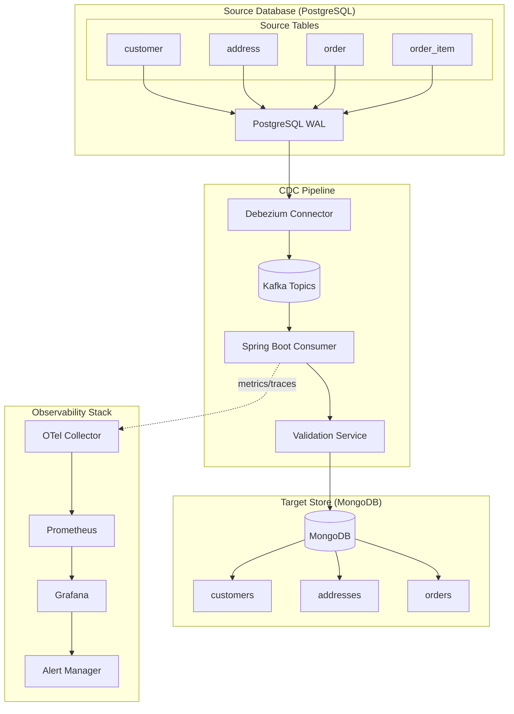
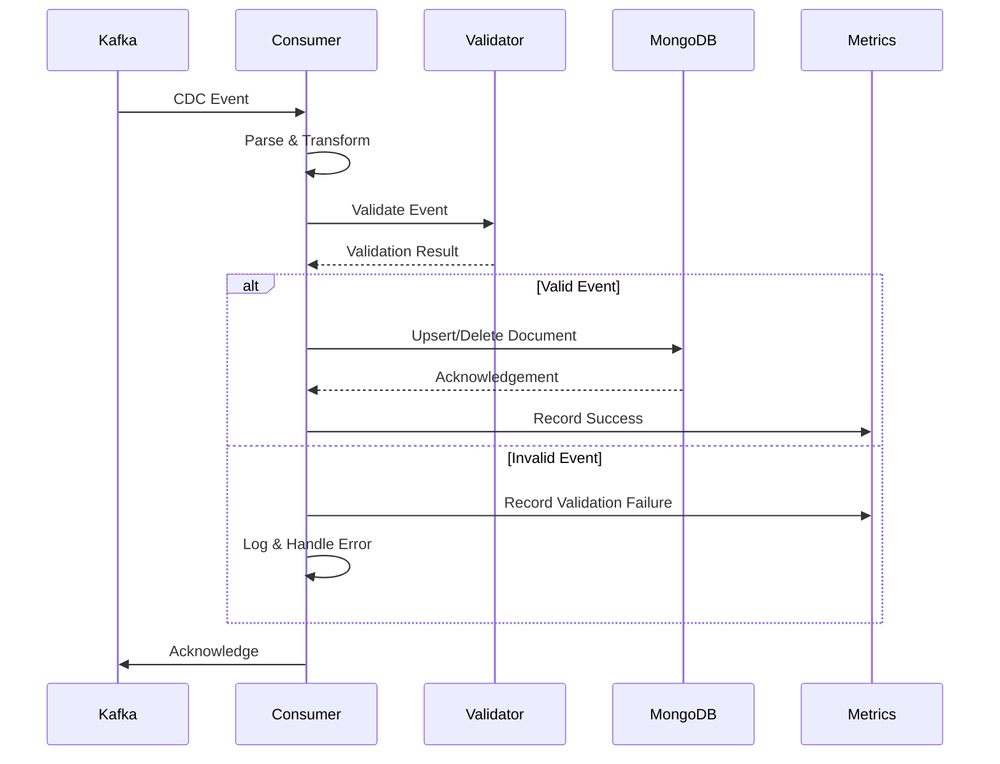
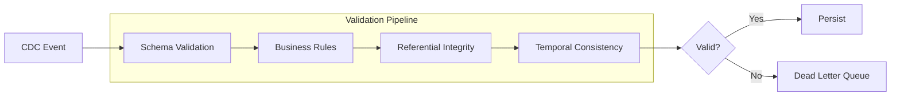
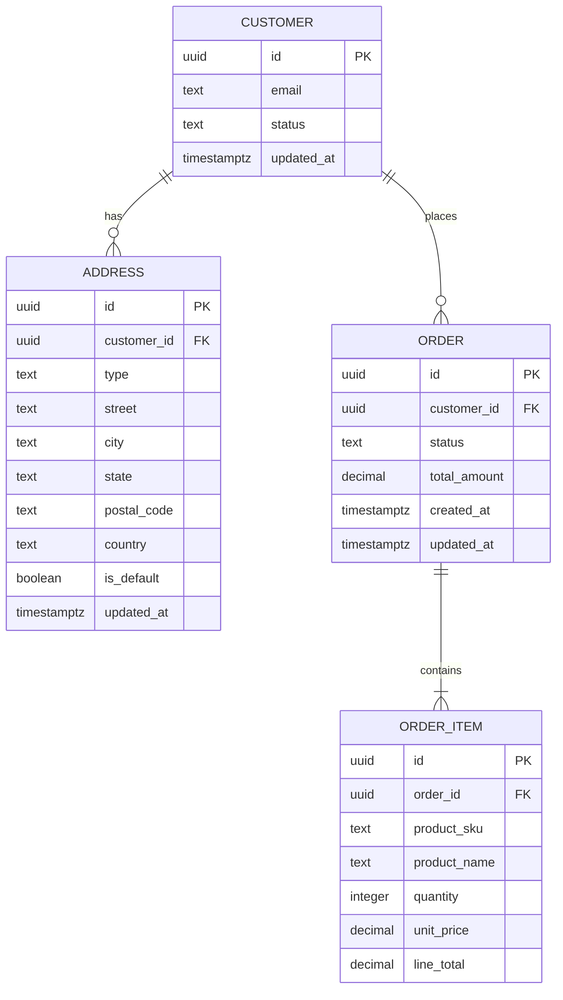
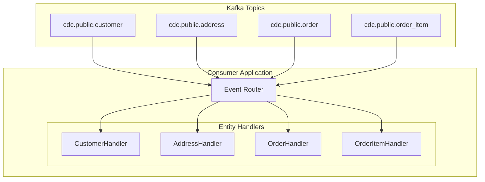
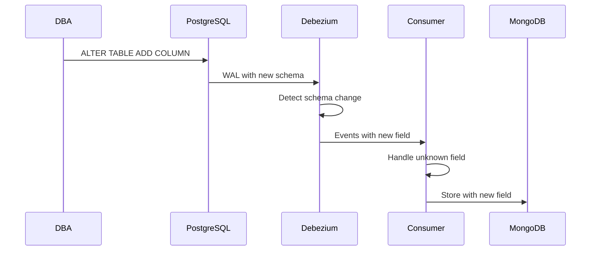
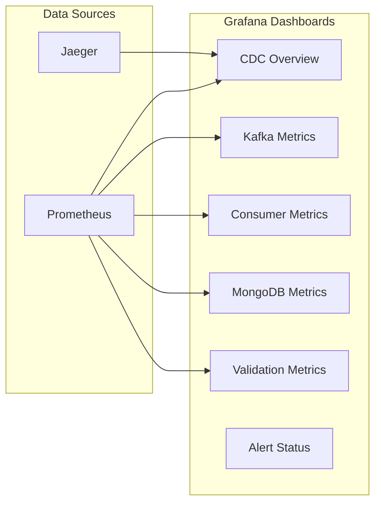
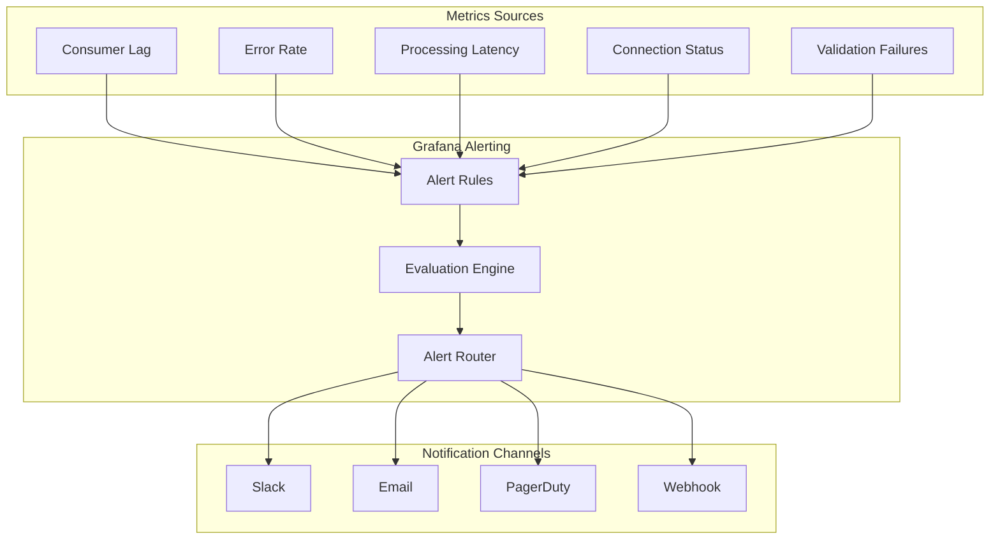

# Feature Specification: CDC Platform Enhancement Suite

## Feature Name

**CDC Platform Enhancement Suite: MongoDB Migration, Data Validation, Schema Expansion, Schema Change Handling, and Grafana Observability**

---

## Objective

Extend the existing CDC pipeline with production-ready capabilities:

- **MongoDB as materialized store** replacing PostgreSQL for eventual consistency patterns
- **Data validation framework** ensuring data integrity after CDC operations
- **Extended source schema** with related entities (orders, addresses, etc.)
- **Schema change handling** for graceful evolution of source database schemas
- **Grafana dashboards** for comprehensive CDC monitoring
- **Grafana alerting** for proactive issue detection

Primary outcome: Transform the CDC spike into a robust, observable, production-viable data synchronization platform.

---

## High-Level Architecture



---

## Feature Breakdown

This enhancement suite is organized into six major features, each with sub-features for incremental implementation.

---

# Feature 2.1: MongoDB Migration

## Overview

Migrate the materialized store from PostgreSQL (R2DBC) to MongoDB, leveraging MongoDB's document model for flexible schema handling and eventual consistency patterns.

## Sub-Features

### 2.1.1: MongoDB Infrastructure Setup

**Description:** Add MongoDB to the Docker Compose infrastructure with proper health checks and persistence.

**Changes Required:**
- Add MongoDB service to `docker-compose.yml`
- Configure MongoDB with authentication
- Add persistent volume for data durability
- Configure health checks

**Acceptance Criteria:**
- MongoDB starts successfully in Docker Compose
- Data persists across container restarts
- Health checks pass reliably

### 2.1.2: Spring Data MongoDB Configuration

**Description:** Configure Spring Boot for reactive MongoDB access.

**Changes Required:**
- Add Spring Data MongoDB Reactive dependency
- Configure connection properties
- Remove R2DBC PostgreSQL dependency for materialized store

**Acceptance Criteria:**
- Application connects to MongoDB on startup
- Connection pooling is properly configured

### 2.1.3: Document Model Design

**Description:** Design MongoDB document models that optimize for CDC event patterns.

**Changes Required:**
- Create `CustomerDocument` replacing `CustomerEntity`
- Design document structure with embedded metadata
- Include CDC metadata (source timestamp, operation type)

**Document Model:**

```kotlin
@Document(collection = "customers")
data class CustomerDocument(
    @Id
    val id: String,  // UUID as string
    val email: String,
    val status: String,
    val updatedAt: Instant,
    val cdcMetadata: CdcMetadata
)

data class CdcMetadata(
    val sourceTimestamp: Long,
    val operation: String,  // INSERT, UPDATE, DELETE
    val kafkaOffset: Long,
    val kafkaPartition: Int,
    val processedAt: Instant
)
```

**Acceptance Criteria:**
- Documents include CDC audit trail
- Model supports idempotent operations

### 2.1.4: Repository Migration

**Description:** Migrate from R2DBC repository to reactive MongoDB repository.

**Changes Required:**
- Create `CustomerMongoRepository` interface
- Implement custom queries for idempotent operations
- Add index definitions for query optimization

**Acceptance Criteria:**
- All existing queries work against MongoDB
- Idempotent upsert/delete operations function correctly

### 2.1.5: Consumer Service Update

**Description:** Update the CDC consumer service to use MongoDB operations.

**Changes Required:**
- Modify `CustomerService` to use MongoDB repository
- Update metrics and tracing for MongoDB operations
- Handle MongoDB-specific error scenarios

**Acceptance Criteria:**
- CDC events are materialized in MongoDB
- Existing observability continues to work



---

# Feature 2.2: Data Validation Framework

## Overview

Implement a comprehensive data validation framework that ensures data integrity after each CDC operation, detecting anomalies, data corruption, and synchronization issues.

## Sub-Features

### 2.2.1: Validation Service Foundation

**Description:** Create a validation service that runs after each CDC operation.

**Changes Required:**
- Create `ValidationService` interface and implementation
- Define validation rule abstractions
- Integrate with CDC consumer pipeline

**Acceptance Criteria:**
- Validation runs after each CDC operation
- Validation results are logged and metriced

### 2.2.2: Schema Validation Rules

**Description:** Validate that incoming CDC events conform to expected schema.

**Validation Rules:**
- Required fields present
- Field types match expectations
- Enum values are valid
- UUID format validation

**Acceptance Criteria:**
- Invalid schema events are detected
- Schema violations are logged with details

### 2.2.3: Business Logic Validation

**Description:** Validate business constraints on CDC data.

**Validation Rules:**
- Email format validation
- Status transitions are valid
- Timestamps are reasonable (not in future, not too old)



**Acceptance Criteria:**
- Business rule violations are detected
- Invalid records are routed appropriately

### 2.2.4: Referential Integrity Checks

**Description:** Validate that foreign key relationships are maintained (for extended schema).

**Changes Required:**
- Check that referenced entities exist
- Handle eventual consistency (grace period for related records)
- Queue events with unresolved references for retry

**Acceptance Criteria:**
- Orphaned records are detected
- Retry mechanism handles eventual consistency

### 2.2.5: Temporal Consistency Validation

**Description:** Ensure events are processed in correct temporal order.

**Validation Rules:**
- Detect out-of-order events
- Validate source timestamps against processing timestamps
- Flag significant time drift

**Acceptance Criteria:**
- Out-of-order events are detected
- Time drift is logged and metriced

### 2.2.6: Validation Metrics and Alerting

**Description:** Expose validation metrics for monitoring.

**Metrics:**
- `cdc.validation.passed` - Counter
- `cdc.validation.failed` - Counter by rule
- `cdc.validation.latency` - Histogram

**Acceptance Criteria:**
- Validation metrics visible in Prometheus
- Metrics include dimensional labels for rule type

---

# Feature 2.3: Extended Source Schema

## Overview

Expand the source PostgreSQL schema to include related entities, demonstrating CDC across a realistic domain model with foreign key relationships.

## Entity Relationship Model



## Sub-Features

### 2.3.1: Address Entity Implementation

**Description:** Add address entity with one-to-many relationship to customer.

**Changes Required:**
- PostgreSQL table creation script
- Debezium connector configuration for `address` table
- Kafka consumer for address CDC events
- MongoDB document model for addresses

**Acceptance Criteria:**
- Address changes are captured via CDC
- Addresses are materialized in MongoDB
- Customer-address relationship is maintained

### 2.3.2: Order Entity Implementation

**Description:** Add order entity with customer relationship.

**Changes Required:**
- PostgreSQL table creation script
- Debezium connector configuration for `order` table
- Kafka consumer for order CDC events
- MongoDB document model for orders

**Acceptance Criteria:**
- Order changes are captured via CDC
- Orders are materialized in MongoDB
- Order status changes are tracked

### 2.3.3: Order Item Entity Implementation

**Description:** Add order item entity with order relationship.

**Changes Required:**
- PostgreSQL table creation script
- Debezium connector configuration for `order_item` table
- Kafka consumer for order item CDC events
- MongoDB embedded document or reference strategy

**Acceptance Criteria:**
- Order item changes are captured via CDC
- Order items are properly associated with orders

### 2.3.4: Multi-Table CDC Consumer Architecture

**Description:** Refactor consumer to handle multiple entity types efficiently.



**Changes Required:**
- Create generic CDC event handler interface
- Implement event router based on topic/entity type
- Configure multiple Kafka listeners

**Acceptance Criteria:**
- Single application handles all entity types
- Each entity type has isolated processing
- Failures in one entity don't affect others

### 2.3.5: Aggregation Strategies

**Description:** Implement MongoDB document aggregation patterns.

**Strategies:**
- Embedded documents for order items within orders
- References for customer relationships
- Denormalization for query optimization

**Acceptance Criteria:**
- Document structure optimized for read patterns
- Aggregation maintains consistency

---

# Feature 2.4: Schema Change Handling

## Overview

Implement robust handling of schema changes in the source PostgreSQL database, ensuring the CDC pipeline gracefully handles additions, modifications, and compatible changes.

## Sub-Features

### 2.4.1: Schema Registry Integration (Optional)

**Description:** Evaluate and optionally integrate Confluent Schema Registry for schema governance.

**Considerations:**
- Avro vs JSON with schema validation
- Backward/forward compatibility rules
- Schema evolution strategies

**Acceptance Criteria:**
- Decision documented on schema registry adoption
- If adopted, registry integrated with Debezium

### 2.4.2: Nullable Column Addition Handling

**Description:** Handle addition of new nullable columns to source tables.



**Changes Required:**
- Configure Jackson to ignore unknown properties
- Document handling behavior
- Add tests for schema addition scenarios

**Acceptance Criteria:**
- New nullable columns don't break consumer
- New fields are stored if present

### 2.4.3: Column Type Change Handling

**Description:** Handle compatible type changes (e.g., VARCHAR length increase).

**Changes Required:**
- Identify compatible vs breaking changes
- Implement type coercion where safe
- Log warnings for potential issues

**Acceptance Criteria:**
- Compatible type changes are handled
- Incompatible changes are logged as errors

### 2.4.4: Column Removal Handling

**Description:** Handle removal of columns from source tables.

**Changes Required:**
- Consumer tolerates missing fields
- MongoDB documents retain historical data
- Alerts on unexpected missing fields

**Acceptance Criteria:**
- Removed columns don't break consumer
- Historical data is preserved

### 2.4.5: Table Addition Handling

**Description:** Handle addition of new tables to CDC pipeline.

**Changes Required:**
- Dynamic connector configuration updates
- Consumer hot-reload for new entity types
- Documentation for adding new tables

**Acceptance Criteria:**
- New tables can be added without restart
- Documentation covers addition process

### 2.4.6: Schema Change Alerting

**Description:** Alert operators when schema changes are detected.

**Changes Required:**
- Detect schema changes in consumer
- Emit metrics for schema version changes
- Configure Grafana alerts for schema events

**Acceptance Criteria:**
- Schema changes trigger alerts
- Change details are logged

---

# Feature 2.5: Grafana Dashboards

## Overview

Create comprehensive Grafana dashboards for monitoring CDC pipeline health, performance, and data flow metrics.

## Dashboard Architecture



## Sub-Features

### 2.5.1: Grafana Infrastructure Setup

**Description:** Add Grafana to Docker Compose with proper configuration.

**Changes Required:**
- Add Grafana service to `docker-compose.yml`
- Configure Prometheus data source
- Configure Jaeger data source
- Set up dashboard provisioning

**Acceptance Criteria:**
- Grafana accessible at configured port
- Data sources pre-configured
- Dashboards auto-provisioned

### 2.5.2: CDC Overview Dashboard

**Description:** High-level dashboard showing CDC pipeline health.

**Panels:**
- Pipeline status (healthy/degraded/down)
- Events processed (total and per entity)
- Processing latency (p50, p95, p99)
- Error rate
- Consumer lag
- Active connections

**Acceptance Criteria:**
- Single pane of glass for CDC health
- Key metrics visible at a glance

### 2.5.3: Kafka Metrics Dashboard

**Description:** Detailed Kafka metrics for CDC topics.

**Panels:**
- Topic throughput (messages/sec)
- Partition distribution
- Consumer group lag per partition
- Replication status
- Broker health

**Acceptance Criteria:**
- Kafka-specific metrics visualized
- Partition-level visibility

### 2.5.4: Consumer Performance Dashboard

**Description:** Spring Boot consumer performance metrics.

**Panels:**
- Message processing rate
- Processing time histogram
- Batch size distribution
- Retry counts
- Dead letter queue size
- JVM metrics (heap, GC)

**Acceptance Criteria:**
- Consumer performance visible
- JVM health tracked

### 2.5.5: MongoDB Operations Dashboard

**Description:** MongoDB write operations and performance.

**Panels:**
- Write operations per second
- Write latency histogram
- Document counts per collection
- Connection pool usage
- Index usage statistics

**Acceptance Criteria:**
- MongoDB performance visible
- Collection-level metrics

### 2.5.6: Validation Metrics Dashboard

**Description:** Data validation metrics and trends.

**Panels:**
- Validation pass/fail rates
- Failures by rule type
- Validation latency
- Trend analysis

**Acceptance Criteria:**
- Validation health visible
- Failure patterns identifiable

---

# Feature 2.6: Grafana Alerting

## Overview

Configure Grafana alerts for critical issues in the CDC pipeline, enabling proactive issue detection and notification.

## Alert Architecture



## Sub-Features

### 2.6.1: Alert Manager Configuration

**Description:** Configure Grafana's built-in alerting or integrate Alertmanager.

**Changes Required:**
- Enable Grafana unified alerting
- Configure contact points (notification channels)
- Set up notification policies

**Acceptance Criteria:**
- Alerting system functional
- Test alert can be sent and received

### 2.6.2: Consumer Lag Alerts

**Description:** Alert when consumer lag exceeds thresholds.

**Alert Rules:**
- **Warning:** Lag > 1000 messages for 5 minutes
- **Critical:** Lag > 10000 messages for 5 minutes
- **Critical:** Lag increasing for 15 minutes

**Acceptance Criteria:**
- Lag alerts fire appropriately
- Alert includes topic and partition context

### 2.6.3: Error Rate Alerts

**Description:** Alert on elevated error rates.

**Alert Rules:**
- **Warning:** Error rate > 1% for 5 minutes
- **Critical:** Error rate > 5% for 5 minutes
- **Critical:** Any processing errors for 1 minute (zero-tolerance mode)

**Acceptance Criteria:**
- Error spikes trigger alerts
- Alert includes error type context

### 2.6.4: Latency Alerts

**Description:** Alert on processing latency degradation.

**Alert Rules:**
- **Warning:** p95 latency > 500ms for 5 minutes
- **Critical:** p95 latency > 2000ms for 5 minutes
- **Critical:** p99 latency > 5000ms for 1 minute

**Acceptance Criteria:**
- Latency degradation triggers alerts
- Alert includes latency percentiles

### 2.6.5: Connection Health Alerts

**Description:** Alert on connection failures.

**Alert Rules:**
- **Critical:** PostgreSQL connection lost
- **Critical:** MongoDB connection lost
- **Critical:** Kafka broker connection lost
- **Warning:** Connection pool exhaustion > 80%

**Acceptance Criteria:**
- Connection failures trigger immediate alerts
- Alert identifies affected component

### 2.6.6: Validation Failure Alerts

**Description:** Alert on data validation issues.

**Alert Rules:**
- **Warning:** Validation failure rate > 1% for 5 minutes
- **Critical:** Validation failure rate > 5% for 5 minutes
- **Critical:** Specific validation rule failures (referential integrity)

**Acceptance Criteria:**
- Validation issues trigger alerts
- Alert includes failing rule type

### 2.6.7: Schema Change Alerts

**Description:** Alert when schema changes are detected.

**Alert Rules:**
- **Info:** New column detected
- **Warning:** Column removed
- **Critical:** Incompatible type change

**Acceptance Criteria:**
- Schema changes are detected and alerted
- Alert includes change details

### 2.6.8: Dead Letter Queue Alerts

**Description:** Alert when messages are routed to DLQ.

**Alert Rules:**
- **Warning:** Any message in DLQ
- **Critical:** DLQ size > 100 messages
- **Critical:** DLQ growing for 30 minutes

**Acceptance Criteria:**
- DLQ activity triggers alerts
- Alert includes message count

---

## Technology Stack Additions

| Component | Technology | Purpose |
|-----------|------------|---------|
| Document Store | MongoDB 7.x | Materialized view storage |
| Visualization | Grafana 10.x | Dashboards and alerting |
| Alerting | Grafana Unified Alerting | Alert management |
| Schema Registry | Confluent Schema Registry (optional) | Schema governance |

---

## Success Criteria

The feature suite is successful when:

1. **MongoDB Migration**
   - CDC events materialize correctly in MongoDB
   - Document model supports all entity types
   - Idempotent operations function correctly
   - Performance meets or exceeds PostgreSQL baseline

2. **Data Validation**
   - All validation rules execute on each event
   - Invalid events are detected and handled
   - Validation metrics are visible
   - No false positives in production scenarios

3. **Extended Schema**
   - All four entity types (customer, address, order, order_item) are captured
   - Relationships are maintained in MongoDB
   - Multi-table CDC performs efficiently

4. **Schema Change Handling**
   - Nullable column additions don't break pipeline
   - Type changes are handled gracefully
   - Schema changes trigger appropriate alerts
   - Documentation covers all scenarios

5. **Grafana Dashboards**
   - All dashboards load correctly
   - Metrics populate in real-time
   - Dashboards provide actionable insights

6. **Grafana Alerting**
   - All alert rules are configured
   - Test alerts fire correctly
   - Alert routing works as configured
   - No alert fatigue (appropriate thresholds)

---

## Implementation Order

Recommended implementation sequence for incremental delivery:

```mermaid
gantt
    title FEATURE-002 Implementation Phases
    dateFormat X
    axisFormat %s

    section Phase 1
    2.5.1 Grafana Infrastructure    :p1a, 0, 1
    2.1.1 MongoDB Infrastructure    :p1b, 0, 1

    section Phase 2
    2.1.2 MongoDB Configuration     :p2a, after p1b, 1
    2.1.3 Document Model            :p2b, after p2a, 1
    2.5.2 CDC Overview Dashboard    :p2c, after p1a, 1

    section Phase 3
    2.1.4 Repository Migration      :p3a, after p2b, 1
    2.1.5 Consumer Update           :p3b, after p3a, 1
    2.6.1 Alert Manager Config      :p3c, after p2c, 1

    section Phase 4
    2.2.1 Validation Foundation     :p4a, after p3b, 1
    2.2.2-2.2.6 Validation Rules    :p4b, after p4a, 2
    2.5.3-2.5.6 Dashboards          :p4c, after p3c, 2

    section Phase 5
    2.3.1-2.3.5 Extended Schema     :p5a, after p4b, 3
    2.6.2-2.6.8 Alert Rules         :p5b, after p4c, 2

    section Phase 6
    2.4.1-2.4.6 Schema Handling     :p6a, after p5a, 2
```



---

## Deliverables

- Updated `docker-compose.yml` with MongoDB and Grafana
- MongoDB document models and repositories
- Validation service implementation
- Extended PostgreSQL schema scripts
- Extended Debezium connector configuration
- Multi-entity CDC consumer implementation
- Grafana dashboard JSON definitions
- Grafana alert rule configurations
- Updated documentation and README

---

## Claude Code Prompt

> Break this feature specification into small, independently testable implementation plans.
> For each plan: describe changes, file names, commands to run, and acceptance criteria.
> Prioritize infrastructure setup (MongoDB, Grafana) first, then migrate existing functionality,
> then add new capabilities. Optimize for fast feedback and local validation.
