# Feature Specification: CDC Platform Enhancement Suite

## Feature Name

**CDC Platform Enhancement Suite: MongoDB Migration, Data Validation, Schema Expansion, Schema Change Handling, Grafana Observability, and Load Testing**

---

## Objective

Extend the existing CDC pipeline with production-ready capabilities:

- **MongoDB as materialized store** replacing PostgreSQL for eventual consistency patterns
- **Data validation framework** ensuring data integrity after CDC operations
- **Extended source schema** with related entities (orders, addresses, etc.)
- **Schema change handling** for graceful evolution of source database schemas
- **Grafana dashboards** for comprehensive CDC monitoring
- **Grafana alerting** for proactive issue detection
- **Load testing with k6** validating performance under realistic workloads

Primary outcome: Transform the CDC spike into a robust, observable, performance-validated, production-viable data synchronization platform.

---

## High-Level Architecture

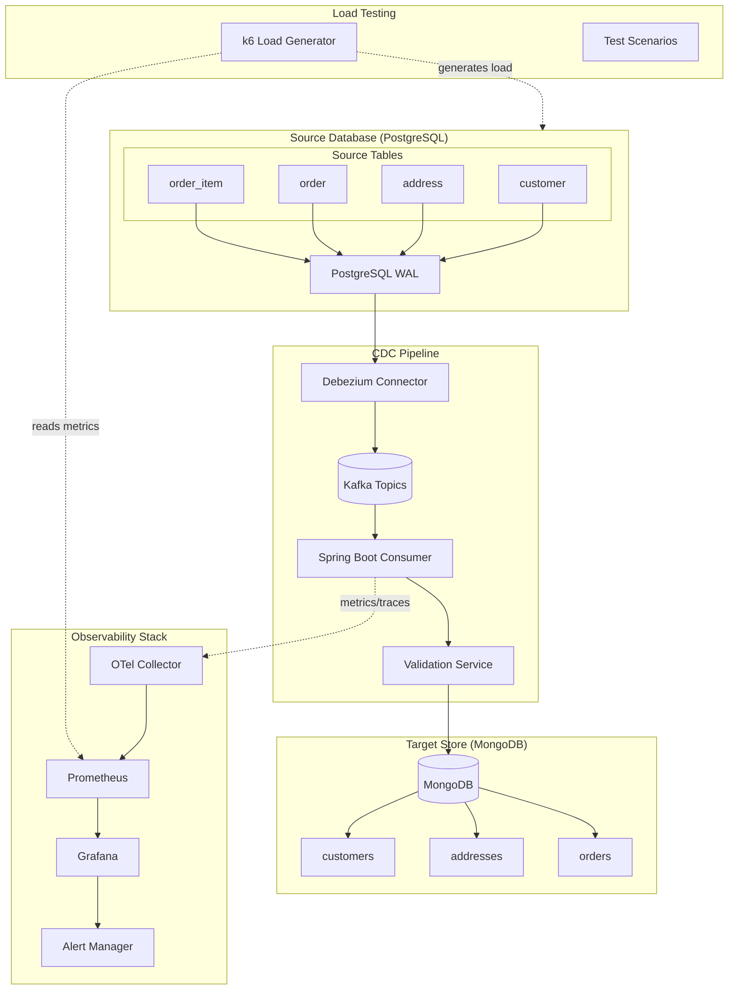

---

## Feature Breakdown

This enhancement suite is organized into seven major features, each with sub-features for incremental implementation.

---

# Feature 2.1: MongoDB Migration

## Overview

Migrate the materialized store from PostgreSQL (R2DBC) to MongoDB, leveraging MongoDB's document model for flexible schema handling and eventual consistency patterns.

## Sub-Features

### 2.1.1: MongoDB Infrastructure Setup

**Description:** Add MongoDB to the Docker Compose infrastructure with proper health checks and persistence.

**Changes Required:**
- Add MongoDB service to `docker-compose.yml`
- Configure MongoDB with authentication
- Add persistent volume for data durability
- Configure health checks

**Acceptance Criteria:**
- MongoDB starts successfully in Docker Compose
- Data persists across container restarts
- Health checks pass reliably

### 2.1.2: Spring Data MongoDB Configuration

**Description:** Configure Spring Boot for reactive MongoDB access.

**Changes Required:**
- Add Spring Data MongoDB Reactive dependency
- Configure connection properties
- Remove R2DBC PostgreSQL dependency for materialized store

**Acceptance Criteria:**
- Application connects to MongoDB on startup
- Connection pooling is properly configured

### 2.1.3: Document Model Design

**Description:** Design MongoDB document models that optimize for CDC event patterns.

**Changes Required:**
- Create `CustomerDocument` replacing `CustomerEntity`
- Design document structure with embedded metadata
- Include CDC metadata (source timestamp, operation type)

**Document Model:**

```kotlin
@Document(collection = "customers")
data class CustomerDocument(
    @Id
    val id: String,  // UUID as string
    val email: String,
    val status: String,
    val updatedAt: Instant,
    val cdcMetadata: CdcMetadata
)

data class CdcMetadata(
    val sourceTimestamp: Long,
    val operation: String,  // INSERT, UPDATE, DELETE
    val kafkaOffset: Long,
    val kafkaPartition: Int,
    val processedAt: Instant
)
```

**Acceptance Criteria:**
- Documents include CDC audit trail
- Model supports idempotent operations

### 2.1.4: Repository Migration

**Description:** Migrate from R2DBC repository to reactive MongoDB repository.

**Changes Required:**
- Create `CustomerMongoRepository` interface
- Implement custom queries for idempotent operations
- Add index definitions for query optimization

**Acceptance Criteria:**
- All existing queries work against MongoDB
- Idempotent upsert/delete operations function correctly

### 2.1.5: Consumer Service Update

**Description:** Update the CDC consumer service to use MongoDB operations.

**Changes Required:**
- Modify `CustomerService` to use MongoDB repository
- Update metrics and tracing for MongoDB operations
- Handle MongoDB-specific error scenarios

**Acceptance Criteria:**
- CDC events are materialized in MongoDB
- Existing observability continues to work

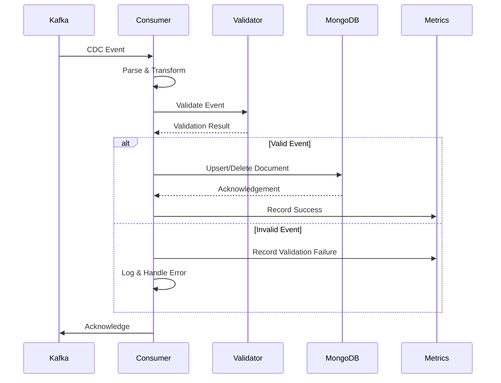

---

# Feature 2.2: Data Validation Framework

## Overview

Implement a comprehensive data validation framework that ensures data integrity after each CDC operation, detecting anomalies, data corruption, and synchronization issues.

## Sub-Features

### 2.2.1: Validation Service Foundation

**Description:** Create a validation service that runs after each CDC operation.

**Changes Required:**
- Create `ValidationService` interface and implementation
- Define validation rule abstractions
- Integrate with CDC consumer pipeline

**Acceptance Criteria:**
- Validation runs after each CDC operation
- Validation results are logged and metriced

### 2.2.2: Schema Validation Rules

**Description:** Validate that incoming CDC events conform to expected schema.

**Validation Rules:**
- Required fields present
- Field types match expectations
- Enum values are valid
- UUID format validation

**Acceptance Criteria:**
- Invalid schema events are detected
- Schema violations are logged with details

### 2.2.3: Business Logic Validation

**Description:** Validate business constraints on CDC data.

**Validation Rules:**
- Email format validation
- Status transitions are valid
- Timestamps are reasonable (not in future, not too old)

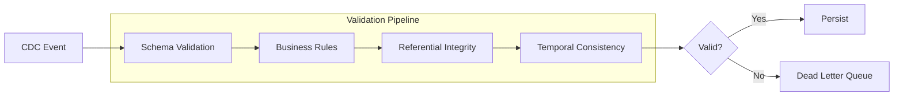

**Acceptance Criteria:**
- Business rule violations are detected
- Invalid records are routed appropriately

### 2.2.4: Referential Integrity Checks

**Description:** Validate that foreign key relationships are maintained (for extended schema).

**Changes Required:**
- Check that referenced entities exist
- Handle eventual consistency (grace period for related records)
- Queue events with unresolved references for retry

**Acceptance Criteria:**
- Orphaned records are detected
- Retry mechanism handles eventual consistency

### 2.2.5: Temporal Consistency Validation

**Description:** Ensure events are processed in correct temporal order.

**Validation Rules:**
- Detect out-of-order events
- Validate source timestamps against processing timestamps
- Flag significant time drift

**Acceptance Criteria:**
- Out-of-order events are detected
- Time drift is logged and metriced

### 2.2.6: Validation Metrics and Alerting

**Description:** Expose validation metrics for monitoring.

**Metrics:**
- `cdc.validation.passed` - Counter
- `cdc.validation.failed` - Counter by rule
- `cdc.validation.latency` - Histogram

**Acceptance Criteria:**
- Validation metrics visible in Prometheus
- Metrics include dimensional labels for rule type

---

# Feature 2.3: Extended Source Schema

## Overview

Expand the source PostgreSQL schema to include related entities, demonstrating CDC across a realistic domain model with foreign key relationships.

## Entity Relationship Model

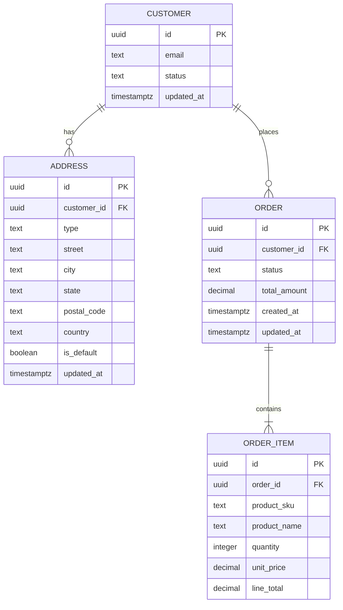

## Sub-Features

### 2.3.1: Address Entity Implementation

**Description:** Add address entity with one-to-many relationship to customer.

**Changes Required:**
- PostgreSQL table creation script
- Debezium connector configuration for `address` table
- Kafka consumer for address CDC events
- MongoDB document model for addresses

**Acceptance Criteria:**
- Address changes are captured via CDC
- Addresses are materialized in MongoDB
- Customer-address relationship is maintained

### 2.3.2: Order Entity Implementation

**Description:** Add order entity with customer relationship.

**Changes Required:**
- PostgreSQL table creation script
- Debezium connector configuration for `order` table
- Kafka consumer for order CDC events
- MongoDB document model for orders

**Acceptance Criteria:**
- Order changes are captured via CDC
- Orders are materialized in MongoDB
- Order status changes are tracked

### 2.3.3: Order Item Entity Implementation

**Description:** Add order item entity with order relationship.

**Changes Required:**
- PostgreSQL table creation script
- Debezium connector configuration for `order_item` table
- Kafka consumer for order item CDC events
- MongoDB embedded document or reference strategy

**Acceptance Criteria:**
- Order item changes are captured via CDC
- Order items are properly associated with orders

### 2.3.4: Multi-Table CDC Consumer Architecture

**Description:** Refactor consumer to handle multiple entity types efficiently.

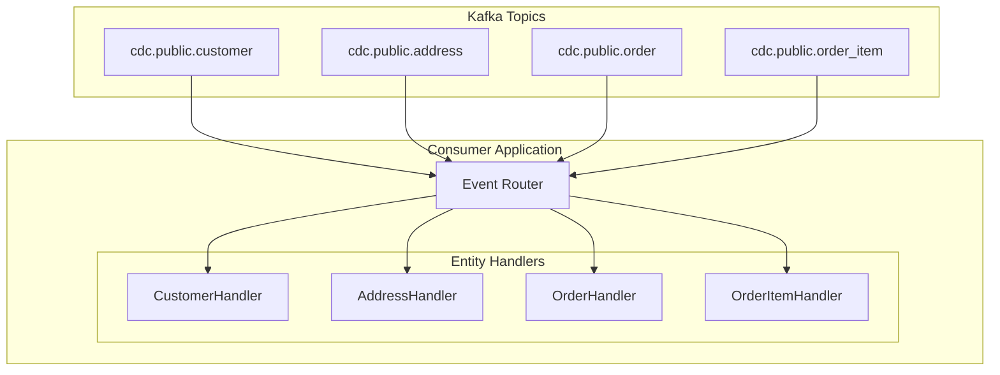

**Changes Required:**
- Create generic CDC event handler interface
- Implement event router based on topic/entity type
- Configure multiple Kafka listeners

**Acceptance Criteria:**
- Single application handles all entity types
- Each entity type has isolated processing
- Failures in one entity don't affect others

### 2.3.5: Aggregation Strategies

**Description:** Implement MongoDB document aggregation patterns.

**Strategies:**
- Embedded documents for order items within orders
- References for customer relationships
- Denormalization for query optimization

**Acceptance Criteria:**
- Document structure optimized for read patterns
- Aggregation maintains consistency

---

# Feature 2.4: Schema Change Handling

## Overview

Implement robust handling of schema changes in the source PostgreSQL database, ensuring the CDC pipeline gracefully handles additions, modifications, and compatible changes.

## Sub-Features

### 2.4.1: Schema Registry Integration (Optional)

**Description:** Evaluate and optionally integrate Confluent Schema Registry for schema governance.

**Considerations:**
- Avro vs JSON with schema validation
- Backward/forward compatibility rules
- Schema evolution strategies

**Acceptance Criteria:**
- Decision documented on schema registry adoption
- If adopted, registry integrated with Debezium

### 2.4.2: Nullable Column Addition Handling

**Description:** Handle addition of new nullable columns to source tables.

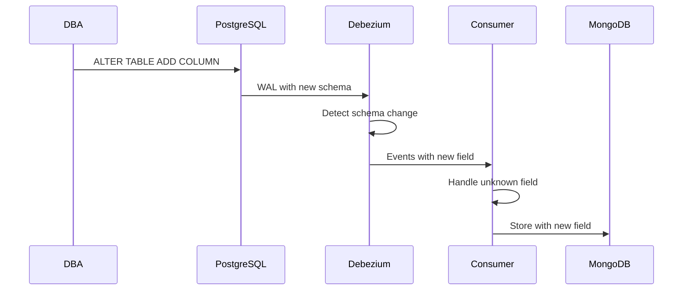

**Changes Required:**
- Configure Jackson to ignore unknown properties
- Document handling behavior
- Add tests for schema addition scenarios

**Acceptance Criteria:**
- New nullable columns don't break consumer
- New fields are stored if present

### 2.4.3: Column Type Change Handling

**Description:** Handle compatible type changes (e.g., VARCHAR length increase).

**Changes Required:**
- Identify compatible vs breaking changes
- Implement type coercion where safe
- Log warnings for potential issues

**Acceptance Criteria:**
- Compatible type changes are handled
- Incompatible changes are logged as errors

### 2.4.4: Column Removal Handling

**Description:** Handle removal of columns from source tables.

**Changes Required:**
- Consumer tolerates missing fields
- MongoDB documents retain historical data
- Alerts on unexpected missing fields

**Acceptance Criteria:**
- Removed columns don't break consumer
- Historical data is preserved

### 2.4.5: Table Addition Handling

**Description:** Handle addition of new tables to CDC pipeline.

**Changes Required:**
- Dynamic connector configuration updates
- Consumer hot-reload for new entity types
- Documentation for adding new tables

**Acceptance Criteria:**
- New tables can be added without restart
- Documentation covers addition process

### 2.4.6: Schema Change Alerting

**Description:** Alert operators when schema changes are detected.

**Changes Required:**
- Detect schema changes in consumer
- Emit metrics for schema version changes
- Configure Grafana alerts for schema events

**Acceptance Criteria:**
- Schema changes trigger alerts
- Change details are logged

---

# Feature 2.5: Grafana Observability Stack (LGTM)

## Overview

Create a comprehensive observability platform using the Grafana LGTM stack (Grafana + Loki + Tempo + Mimir/Prometheus) for full-signal visibility into the CDC pipeline.

## Justification

For a Spring Boot application paired with a Debezium CDC pipeline, an OpenTelemetry-based observability stack running entirely in Docker Compose provides **full-signal visibility** (traces, metrics, and logs) with minimal coupling and maximum portability.

### Why This Architecture?

**Spring Boot Integration:**
- Spring Boot integrates cleanly with OpenTelemetry via the Java agent, emitting traces and metrics without invasive code changes
- Auto-instrumentation captures HTTP requests, Kafka consumer operations, and database calls
- Custom spans and metrics can be added declaratively where needed

**Debezium/Kafka Connect Observability:**
- Debezium and Kafka Connect expose rich operational metrics via JMX
- The OpenTelemetry Collector captures these metrics and normalizes them alongside application telemetry
- Connector status, lag, and throughput become first-class observability signals

**Centralized Telemetry Processing:**
- The OpenTelemetry Collector acts as a normalization and routing layer
- Enrichment (adding service names, environment tags) happens in one place
- Backend-agnostic: switch from Prometheus to Mimir, or Jaeger to Tempo, without application changes

**Production Alignment:**
- This architecture mirrors modern cloud observability patterns (Grafana Cloud, AWS, GCP)
- Skills and configurations transfer directly to production environments
- Vendor-neutral approach avoids lock-in

**End-to-End Correlation:**
- Trace context propagates from HTTP requests through Kafka messages to CDC event processing
- A single trace ID connects the entire request lifecycle
- Debugging complex event-driven flows becomes tractable

**Developer Experience:**
- Lightweight and reproducible for local development
- `docker compose up` provides full observability immediately
- Iterative debugging with systems-level reasoning
- No external dependencies or cloud accounts required

## LGTM Stack Components

| Component | Purpose | Data Type |
|-----------|---------|-----------|
| **Grafana** | Unified visualization and alerting | Dashboards |
| **Loki** | Log aggregation with label-based indexing | Logs |
| **Tempo** | Distributed tracing backend | Traces |
| **Mimir/Prometheus** | Metrics storage and querying | Metrics |
| **OTel Collector** | Telemetry collection, processing, routing | All signals |

## Observability Architecture

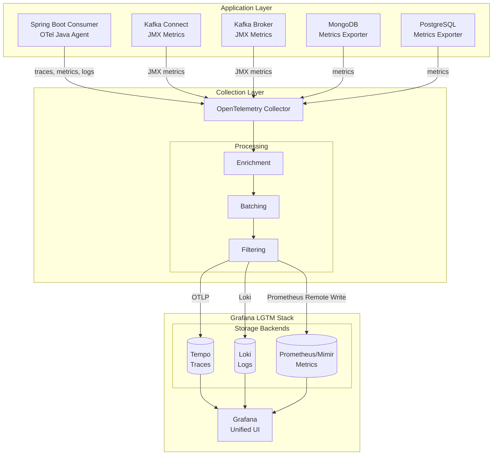

## Signal Correlation Flow

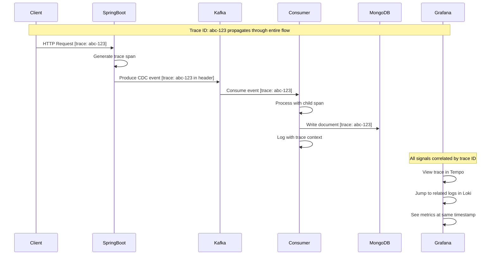

## Sub-Features

### 2.5.1: Grafana LGTM Infrastructure Setup

**Description:** Deploy the complete Grafana LGTM stack in Docker Compose with OpenTelemetry Collector as the ingestion layer.

**Changes Required:**
- Add Grafana service to `docker-compose.yml`
- Add Tempo service for distributed tracing
- Add Loki service for log aggregation
- Configure Prometheus/Mimir for metrics (extend existing Prometheus)
- Update OpenTelemetry Collector configuration for multi-backend export
- Configure all data sources in Grafana provisioning
- Set up dashboard and alerting provisioning

**Docker Compose Services:**

```yaml
services:
  grafana:
    image: grafana/grafana:11.0.0
    ports:
      - "3000:3000"
    volumes:
      - ./docker/grafana/provisioning:/etc/grafana/provisioning
      - grafana_data:/var/lib/grafana
    environment:
      GF_AUTH_ANONYMOUS_ENABLED: "true"
      GF_AUTH_ANONYMOUS_ORG_ROLE: Admin

  tempo:
    image: grafana/tempo:2.4.0
    command: ["-config.file=/etc/tempo/tempo.yaml"]
    volumes:
      - ./docker/tempo/tempo.yaml:/etc/tempo/tempo.yaml
      - tempo_data:/var/tempo

  loki:
    image: grafana/loki:2.9.0
    command: ["-config.file=/etc/loki/loki.yaml"]
    volumes:
      - ./docker/loki/loki.yaml:/etc/loki/loki.yaml
      - loki_data:/var/loki
```

**Acceptance Criteria:**
- All LGTM components start successfully
- Grafana accessible at port 3000
- All data sources (Tempo, Loki, Prometheus) pre-configured
- Explore view shows data from all three backends
- Dashboards auto-provisioned on startup

### 2.5.2: CDC Overview Dashboard

**Description:** High-level dashboard showing CDC pipeline health.

**Panels:**
- Pipeline status (healthy/degraded/down)
- Events processed (total and per entity)
- Processing latency (p50, p95, p99)
- Error rate
- Consumer lag
- Active connections

**Acceptance Criteria:**
- Single pane of glass for CDC health
- Key metrics visible at a glance

### 2.5.3: Kafka Metrics Dashboard

**Description:** Detailed Kafka metrics for CDC topics.

**Panels:**
- Topic throughput (messages/sec)
- Partition distribution
- Consumer group lag per partition
- Replication status
- Broker health

**Acceptance Criteria:**
- Kafka-specific metrics visualized
- Partition-level visibility

### 2.5.4: Consumer Performance Dashboard

**Description:** Spring Boot consumer performance metrics.

**Panels:**
- Message processing rate
- Processing time histogram
- Batch size distribution
- Retry counts
- Dead letter queue size
- JVM metrics (heap, GC)

**Acceptance Criteria:**
- Consumer performance visible
- JVM health tracked

### 2.5.5: MongoDB Operations Dashboard

**Description:** MongoDB write operations and performance.

**Panels:**
- Write operations per second
- Write latency histogram
- Document counts per collection
- Connection pool usage
- Index usage statistics

**Acceptance Criteria:**
- MongoDB performance visible
- Collection-level metrics

### 2.5.6: Validation Metrics Dashboard

**Description:** Data validation metrics and trends.

**Panels:**
- Validation pass/fail rates
- Failures by rule type
- Validation latency
- Trend analysis

**Acceptance Criteria:**
- Validation health visible
- Failure patterns identifiable

### 2.5.7: Distributed Tracing Dashboard

**Description:** Trace visualization and analysis using Tempo.

**Panels:**
- Trace search by service, operation, duration
- Service graph visualization
- Trace-to-logs correlation
- Span duration histograms
- Error trace highlighting
- CDC event flow visualization

**Trace Attributes:**
- `messaging.system = kafka`
- `messaging.destination.name` (topic)
- `messaging.kafka.consumer.group`
- `db.operation` (upsert, delete)
- `cdc.entity.type` (customer, order, etc.)

**Acceptance Criteria:**
- Traces visible from HTTP request to MongoDB write
- Kafka message propagation visible in trace
- Click-through from trace to related logs
- Service dependency graph renders correctly

### 2.5.8: Centralized Logs Dashboard

**Description:** Log aggregation and analysis using Loki.

**Panels:**
- Log stream by service
- Error log filtering
- Log volume over time
- Structured field extraction
- Trace ID correlation links

**Log Labels:**
- `service_name`
- `level` (INFO, WARN, ERROR)
- `trace_id`, `span_id`
- `kafka_topic`, `kafka_partition`
- `entity_type`, `operation`

**LogQL Query Examples:**

```logql
# Find all error logs for CDC consumer
{service_name="cdc-consumer"} |= "ERROR"

# Find logs for a specific trace
{service_name=~".+"} |= "trace_id=abc123"

# Find logs with high processing latency
{service_name="cdc-consumer"} | json | processing_time_ms > 1000
```

**Acceptance Criteria:**
- Logs from all services aggregated
- Structured log fields queryable
- Direct link from trace span to logs
- Log-based alerting functional

### 2.5.9: OpenTelemetry Collector Dashboard

**Description:** Monitor the health and performance of the OTel Collector itself.

**Panels:**
- Received vs exported telemetry counts
- Queue depths by signal type
- Dropped data points
- Exporter latency and errors
- Memory and CPU usage

**Acceptance Criteria:**
- Collector health visible
- Pipeline bottlenecks identifiable
- Data loss alerting enabled

---

# Feature 2.6: Grafana Alerting

## Overview

Configure Grafana alerts for critical issues in the CDC pipeline, enabling proactive issue detection and notification.

## Alert Architecture

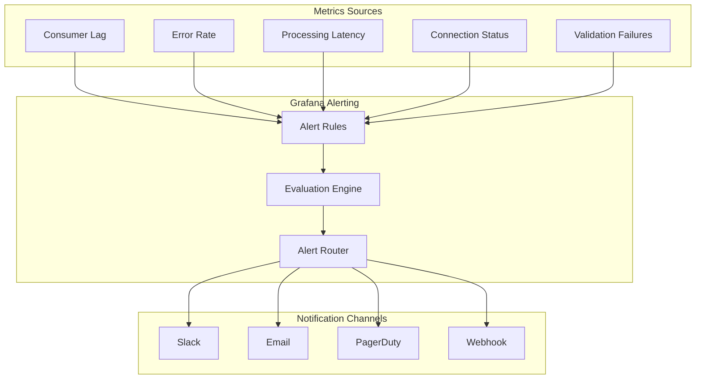

## Sub-Features

### 2.6.1: Alert Manager Configuration

**Description:** Configure Grafana's built-in alerting or integrate Alertmanager.

**Changes Required:**
- Enable Grafana unified alerting
- Configure contact points (notification channels)
- Set up notification policies

**Acceptance Criteria:**
- Alerting system functional
- Test alert can be sent and received

### 2.6.2: Consumer Lag Alerts

**Description:** Alert when consumer lag exceeds thresholds.

**Alert Rules:**
- **Warning:** Lag > 1000 messages for 5 minutes
- **Critical:** Lag > 10000 messages for 5 minutes
- **Critical:** Lag increasing for 15 minutes

**Acceptance Criteria:**
- Lag alerts fire appropriately
- Alert includes topic and partition context

### 2.6.3: Error Rate Alerts

**Description:** Alert on elevated error rates.

**Alert Rules:**
- **Warning:** Error rate > 1% for 5 minutes
- **Critical:** Error rate > 5% for 5 minutes
- **Critical:** Any processing errors for 1 minute (zero-tolerance mode)

**Acceptance Criteria:**
- Error spikes trigger alerts
- Alert includes error type context

### 2.6.4: Latency Alerts

**Description:** Alert on processing latency degradation.

**Alert Rules:**
- **Warning:** p95 latency > 500ms for 5 minutes
- **Critical:** p95 latency > 2000ms for 5 minutes
- **Critical:** p99 latency > 5000ms for 1 minute

**Acceptance Criteria:**
- Latency degradation triggers alerts
- Alert includes latency percentiles

### 2.6.5: Connection Health Alerts

**Description:** Alert on connection failures.

**Alert Rules:**
- **Critical:** PostgreSQL connection lost
- **Critical:** MongoDB connection lost
- **Critical:** Kafka broker connection lost
- **Warning:** Connection pool exhaustion > 80%

**Acceptance Criteria:**
- Connection failures trigger immediate alerts
- Alert identifies affected component

### 2.6.6: Validation Failure Alerts

**Description:** Alert on data validation issues.

**Alert Rules:**
- **Warning:** Validation failure rate > 1% for 5 minutes
- **Critical:** Validation failure rate > 5% for 5 minutes
- **Critical:** Specific validation rule failures (referential integrity)

**Acceptance Criteria:**
- Validation issues trigger alerts
- Alert includes failing rule type

### 2.6.7: Schema Change Alerts

**Description:** Alert when schema changes are detected.

**Alert Rules:**
- **Info:** New column detected
- **Warning:** Column removed
- **Critical:** Incompatible type change

**Acceptance Criteria:**
- Schema changes are detected and alerted
- Alert includes change details

### 2.6.8: Dead Letter Queue Alerts

**Description:** Alert when messages are routed to DLQ.

**Alert Rules:**
- **Warning:** Any message in DLQ
- **Critical:** DLQ size > 100 messages
- **Critical:** DLQ growing for 30 minutes

**Acceptance Criteria:**
- DLQ activity triggers alerts
- Alert includes message count

---

# Feature 2.7: Load Testing with k6

## Overview

Implement comprehensive load testing for the CDC pipeline using k6, validating system performance, identifying bottlenecks, and establishing baseline metrics under various load conditions.

## Load Testing Architecture

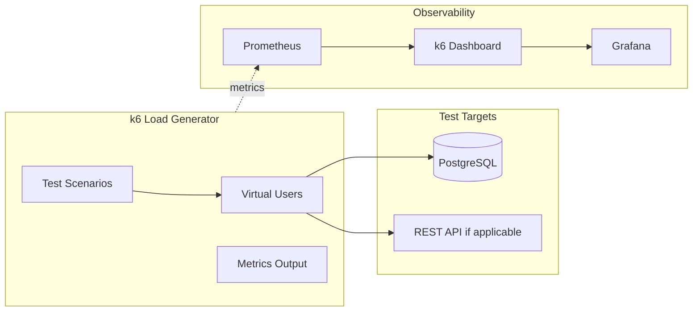

## Load Test Workflow

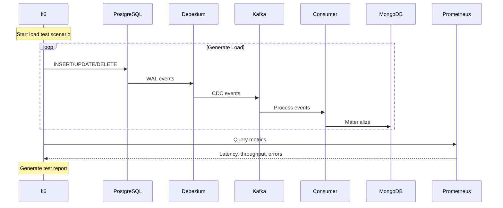

## Sub-Features

### 2.7.1: k6 Infrastructure Setup

**Description:** Set up k6 for local and CI/CD load testing.

**Changes Required:**
- Add k6 Docker image to `docker-compose.yml` (optional, for containerized runs)
- Create `load-tests/` directory structure
- Configure k6 to output metrics to Prometheus
- Set up Grafana k6 dashboard

**Directory Structure:**
```
load-tests/
├── scenarios/
│   ├── baseline.js
│   ├── stress.js
│   ├── spike.js
│   ├── soak.js
│   └── breakpoint.js
├── lib/
│   ├── config.js
│   ├── data-generators.js
│   └── helpers.js
├── thresholds/
│   └── default-thresholds.json
└── README.md
```

**Acceptance Criteria:**
- k6 can be run locally via CLI or Docker
- Metrics flow to Prometheus
- k6 dashboard visible in Grafana

### 2.7.2: Database Load Generation Scripts

**Description:** Create k6 scripts that generate realistic database load patterns.

**Changes Required:**
- Implement PostgreSQL connection via k6 SQL extension
- Create data generation functions for each entity type
- Implement realistic distribution of operations (INSERT/UPDATE/DELETE ratios)

**Example Script Structure:**

```javascript
// load-tests/scenarios/baseline.js
import sql from 'k6/x/sql';
import { randomUUID } from 'k6/crypto';
import { check, sleep } from 'k6';

const db = sql.open('postgres', __ENV.PG_CONNECTION_STRING);

export const options = {
    scenarios: {
        constant_load: {
            executor: 'constant-arrival-rate',
            rate: 100,
            timeUnit: '1s',
            duration: '5m',
            preAllocatedVUs: 50,
            maxVUs: 100,
        },
    },
    thresholds: {
        'db_query_duration': ['p(95)<100', 'p(99)<200'],
        'iteration_duration': ['p(95)<500'],
        'checks': ['rate>0.99'],
    },
};

export default function () {
    // Generate and execute database operations
    const operation = selectOperation(); // 70% INSERT, 20% UPDATE, 10% DELETE

    switch (operation) {
        case 'INSERT':
            insertCustomer(db);
            break;
        case 'UPDATE':
            updateCustomer(db);
            break;
        case 'DELETE':
            deleteCustomer(db);
            break;
    }

    sleep(0.01); // Small delay between operations
}
```

**Acceptance Criteria:**
- Scripts generate realistic database traffic
- Operation distribution is configurable
- Data is valid and triggers CDC events

### 2.7.3: CDC Pipeline Performance Scenarios

**Description:** Define specific test scenarios for CDC pipeline validation.

**Scenario Types:**

| Scenario | Purpose | Configuration |
|----------|---------|---------------|
| **Baseline** | Establish normal performance metrics | 100 ops/sec for 5 minutes |
| **Stress** | Find performance limits | Ramp from 100 to 1000 ops/sec |
| **Spike** | Test sudden load increases | Burst to 5x normal for 1 minute |
| **Soak** | Identify memory leaks, degradation | 100 ops/sec for 2 hours |
| **Breakpoint** | Find system breaking point | Increase until failure |

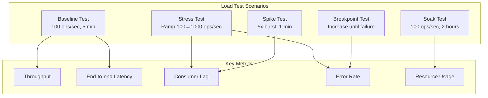

**Acceptance Criteria:**
- All five scenario types are implemented
- Each scenario has defined success thresholds
- Scenarios can run independently or in sequence

### 2.7.4: End-to-End Latency Measurement

**Description:** Measure the complete latency from database write to MongoDB materialization.

**Approach:**
- Embed unique correlation IDs in test data
- Track timestamp at PostgreSQL insert
- Query MongoDB for correlation ID with timeout
- Calculate end-to-end latency

**Implementation:**

```javascript
// Measure E2E latency
export function measureE2ELatency() {
    const correlationId = randomUUID();
    const startTime = Date.now();

    // Insert into PostgreSQL
    db.exec(`
        INSERT INTO customer (id, email, status, updated_at)
        VALUES ('${correlationId}', 'load-test-${correlationId}@test.com', 'active', NOW())
    `);

    // Poll MongoDB for the record (with timeout)
    const maxWait = 30000; // 30 seconds
    const pollInterval = 100; // 100ms
    let found = false;

    while (Date.now() - startTime < maxWait && !found) {
        const result = mongo.findOne('customers', { _id: correlationId });
        if (result) {
            found = true;
            const e2eLatency = Date.now() - startTime;
            e2eLatencyTrend.add(e2eLatency);
        } else {
            sleep(pollInterval / 1000);
        }
    }

    check(found, { 'record materialized': (f) => f === true });
}
```

**Metrics Collected:**
- `cdc_e2e_latency_ms` - End-to-end latency histogram
- `cdc_e2e_success_rate` - Percentage of records successfully materialized
- `cdc_e2e_timeout_rate` - Records not found within timeout

**Acceptance Criteria:**
- E2E latency is accurately measured
- Timeouts are properly handled
- Metrics are exported to Prometheus

### 2.7.5: Consumer Lag Correlation

**Description:** Correlate k6 load generation with Kafka consumer lag.

**Changes Required:**
- Query Prometheus for consumer lag during tests
- Correlate lag with load generation rate
- Identify lag accumulation patterns

**Metrics to Monitor:**
- `kafka_consumer_lag` - Messages behind
- `kafka_consumer_lag_rate` - Rate of lag change
- Load generation rate vs consumption rate

**Acceptance Criteria:**
- Lag is monitored during load tests
- Lag recovery time is measured
- Lag thresholds are validated

### 2.7.6: Resource Utilization Monitoring

**Description:** Monitor system resources during load tests.

**Resources to Track:**
- CPU usage (PostgreSQL, Kafka, Consumer, MongoDB)
- Memory usage (heap, native)
- Network I/O
- Disk I/O
- Connection pool usage

**Thresholds:**

| Resource | Warning | Critical |
|----------|---------|----------|
| CPU | > 70% | > 90% |
| Memory | > 70% | > 85% |
| Disk I/O | > 60% | > 80% |
| Connections | > 80% pool | > 95% pool |

**Acceptance Criteria:**
- Resource usage is captured during tests
- Thresholds trigger test warnings
- Resource data is included in reports

### 2.7.7: Performance Baseline Establishment

**Description:** Establish and document baseline performance metrics.

**Baseline Metrics:**

| Metric | Target | Measurement |
|--------|--------|-------------|
| Throughput | > 500 events/sec | Sustained for 5 minutes |
| E2E Latency (p50) | < 500ms | Under normal load |
| E2E Latency (p95) | < 2000ms | Under normal load |
| E2E Latency (p99) | < 5000ms | Under normal load |
| Error Rate | < 0.1% | Over test duration |
| Consumer Lag Recovery | < 60 seconds | After load spike |

**Acceptance Criteria:**
- Baseline metrics are documented
- Baseline test is repeatable
- Metrics are stored for trend analysis

### 2.7.8: Load Test Reporting

**Description:** Generate comprehensive load test reports.

**Report Contents:**
- Test configuration and parameters
- Summary statistics (throughput, latency, errors)
- Percentile distributions
- Time-series graphs
- Resource utilization
- Threshold violations
- Recommendations

**Report Formats:**
- JSON (machine-readable)
- HTML (human-readable dashboard)
- Grafana annotations (for correlation)

**Example Report Structure:**

```json
{
    "testRun": {
        "id": "baseline-2024-01-15-1430",
        "scenario": "baseline",
        "duration": "5m",
        "startTime": "2024-01-15T14:30:00Z"
    },
    "summary": {
        "totalOperations": 30000,
        "throughput": {
            "mean": 100,
            "max": 115
        },
        "latency": {
            "p50": 45,
            "p95": 120,
            "p99": 250
        },
        "errors": {
            "total": 3,
            "rate": 0.0001
        }
    },
    "thresholds": {
        "passed": true,
        "violations": []
    }
}
```

**Acceptance Criteria:**
- Reports are generated automatically
- Reports include all key metrics
- Historical reports can be compared

### 2.7.9: CI/CD Integration

**Description:** Integrate load tests into the CI/CD pipeline.

**Integration Points:**
- Run baseline tests on every PR (quick smoke test)
- Run full test suite on main branch merges
- Schedule nightly soak tests
- Block deployments on threshold violations

**GitHub Actions Example:**

```yaml
load-test:
  runs-on: ubuntu-latest
  steps:
    - uses: actions/checkout@v4
    - name: Start infrastructure
      run: docker compose up -d
    - name: Wait for services
      run: ./scripts/wait-for-services.sh
    - name: Run k6 baseline test
      uses: grafana/k6-action@v0.3.1
      with:
        filename: load-tests/scenarios/baseline.js
        flags: --out prometheus=remote_url=${{ secrets.PROMETHEUS_URL }}
    - name: Check thresholds
      run: ./scripts/check-thresholds.sh
```

**Acceptance Criteria:**
- Load tests run in CI/CD
- Threshold violations fail the build
- Results are archived for analysis

### 2.7.10: Chaos Engineering Integration

**Description:** Combine load testing with chaos engineering for resilience validation.

**Chaos Scenarios:**

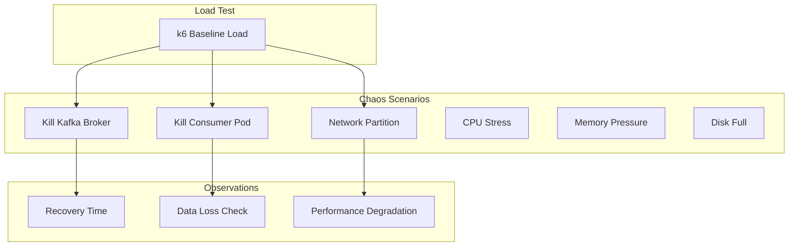

**Scenarios:**
- Consumer restart during load
- Kafka broker failure
- MongoDB connection loss
- Network latency injection
- Resource exhaustion

**Acceptance Criteria:**
- Chaos scenarios are defined
- Recovery behavior is validated
- No data loss during controlled failures

---

## Technology Stack Additions

| Component | Technology | Purpose |
|-----------|------------|---------|
| Document Store | MongoDB 7.x | Materialized view storage |
| Visualization | Grafana 11.x | Unified dashboards and alerting |
| Distributed Tracing | Grafana Tempo 2.x | Trace storage and querying |
| Log Aggregation | Grafana Loki 2.x | Log storage with label-based indexing |
| Metrics | Prometheus / Grafana Mimir | Metrics storage and PromQL querying |
| Telemetry Collection | OpenTelemetry Collector | Signal collection, processing, routing |
| Alerting | Grafana Unified Alerting | Multi-signal alert management |
| Schema Registry | Confluent Schema Registry (optional) | Schema governance |
| Load Testing | k6 | Performance and load testing |
| k6 Extensions | xk6-sql, xk6-mongo | Database connectivity for k6 |
| Chaos Engineering | Chaos Toolkit / Litmus (optional) | Resilience testing |

---

## Success Criteria

The feature suite is successful when:

1. **MongoDB Migration**
   - CDC events materialize correctly in MongoDB
   - Document model supports all entity types
   - Idempotent operations function correctly
   - Performance meets or exceeds PostgreSQL baseline

2. **Data Validation**
   - All validation rules execute on each event
   - Invalid events are detected and handled
   - Validation metrics are visible
   - No false positives in production scenarios

3. **Extended Schema**
   - All four entity types (customer, address, order, order_item) are captured
   - Relationships are maintained in MongoDB
   - Multi-table CDC performs efficiently

4. **Schema Change Handling**
   - Nullable column additions don't break pipeline
   - Type changes are handled gracefully
   - Schema changes trigger appropriate alerts
   - Documentation covers all scenarios

5. **Grafana Dashboards**
   - All dashboards load correctly
   - Metrics populate in real-time
   - Dashboards provide actionable insights

6. **Grafana Alerting**
   - All alert rules are configured
   - Test alerts fire correctly
   - Alert routing works as configured
   - No alert fatigue (appropriate thresholds)

7. **Load Testing**
   - All test scenarios execute successfully
   - Baseline performance metrics are established
   - E2E latency meets target thresholds (p95 < 2000ms)
   - Throughput exceeds 500 events/sec sustained
   - Load tests are integrated into CI/CD pipeline
   - Chaos scenarios validate resilience

---

## Implementation Order

Recommended implementation sequence for incremental delivery:

```mermaid
gantt
    title FEATURE-002 Implementation Phases
    dateFormat X
    axisFormat %s

    section Phase 1
    2.5.1 Grafana Infrastructure    :p1a, 0, 1
    2.1.1 MongoDB Infrastructure    :p1b, 0, 1

    section Phase 2
    2.1.2 MongoDB Configuration     :p2a, after p1b, 1
    2.1.3 Document Model            :p2b, after p2a, 1
    2.5.2 CDC Overview Dashboard    :p2c, after p1a, 1

    section Phase 3
    2.1.4 Repository Migration      :p3a, after p2b, 1
    2.1.5 Consumer Update           :p3b, after p3a, 1
    2.6.1 Alert Manager Config      :p3c, after p2c, 1

    section Phase 4
    2.2.1 Validation Foundation     :p4a, after p3b, 1
    2.2.2-2.2.6 Validation Rules    :p4b, after p4a, 2
    2.5.3-2.5.6 Dashboards          :p4c, after p3c, 2

    section Phase 5
    2.3.1-2.3.5 Extended Schema     :p5a, after p4b, 3
    2.6.2-2.6.8 Alert Rules         :p5b, after p4c, 2

    section Phase 6
    2.4.1-2.4.6 Schema Handling     :p6a, after p5a, 2
    2.7.1-2.7.2 k6 Infrastructure   :p6b, after p5b, 1

    section Phase 7
    2.7.3-2.7.7 Load Test Scenarios :p7a, after p6b, 2
    2.7.8-2.7.9 Reporting & CI/CD   :p7b, after p7a, 1
    2.7.10 Chaos Engineering        :p7c, after p7b, 1
```

---

## Deliverables

- Updated `docker-compose.yml` with MongoDB and Grafana LGTM stack
- MongoDB document models and repositories
- Validation service implementation
- Extended PostgreSQL schema scripts
- Extended Debezium connector configuration
- Multi-entity CDC consumer implementation
- Grafana LGTM stack configuration:
  - Tempo configuration for distributed tracing
  - Loki configuration for log aggregation
  - Updated OTel Collector config for multi-backend export
  - Grafana data source provisioning
- Grafana dashboard JSON definitions:
  - CDC Overview dashboard
  - Kafka Metrics dashboard
  - Consumer Performance dashboard
  - MongoDB Operations dashboard
  - Validation Metrics dashboard
  - Distributed Tracing dashboard
  - Centralized Logs dashboard
  - OTel Collector dashboard
- Grafana alert rule configurations
- k6 load test scripts and scenarios
- k6 Grafana dashboard for load test visualization
- Load test CI/CD pipeline configuration
- Performance baseline documentation
- Chaos engineering test scenarios
- Updated documentation and README

---

## Claude Code Prompt

> Break this feature specification into small, independently testable implementation plans.
> For each plan: describe changes, file names, commands to run, and acceptance criteria.
> Prioritize infrastructure setup (MongoDB, Grafana) first, then migrate existing functionality,
> then add new capabilities. Optimize for fast feedback and local validation.
