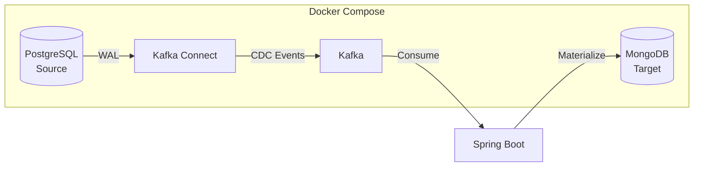

# PLAN-011: MongoDB Infrastructure Setup

## Objective

Add MongoDB to the Docker Compose infrastructure as the target materialized store, replacing PostgreSQL R2DBC for CDC event materialization.

## Parent Feature

[FEATURE-002](../features/FEATURE-002.md) - Section 2.1.1: MongoDB Infrastructure Setup

## Dependencies

- PLAN-001: Docker Compose Base Infrastructure (must exist)
- PLAN-005: Idempotent Processing (will be migrated)

## Changes

### Files to Create/Modify

| File | Purpose |
|------|---------|
| `docker-compose.yml` | Add MongoDB service |
| `docker/mongodb/init/01-init.js` | MongoDB initialization script |

### docker-compose.yml Additions

Add the following service:

```yaml
services:
  # ... existing services ...

  mongodb:
    image: mongo:7.0
    container_name: cdc-mongodb
    ports:
      - "27017:27017"
    environment:
      MONGO_INITDB_ROOT_USERNAME: admin
      MONGO_INITDB_ROOT_PASSWORD: admin
      MONGO_INITDB_DATABASE: cdc_materialized
    volumes:
      - mongodb_data:/data/db
      - ./docker/mongodb/init:/docker-entrypoint-initdb.d:ro
    healthcheck:
      test: ["CMD", "mongosh", "--eval", "db.adminCommand('ping')"]
      interval: 10s
      timeout: 5s
      retries: 5
      start_period: 30s

volumes:
  # ... existing volumes ...
  mongodb_data:
```

### MongoDB Initialization Script

Create `docker/mongodb/init/01-init.js`:

```javascript
// Switch to the application database
db = db.getSiblingDB('cdc_materialized');

// Create application user with readWrite access
db.createUser({
  user: 'cdc_app',
  pwd: 'cdc_app_password',
  roles: [
    { role: 'readWrite', db: 'cdc_materialized' }
  ]
});

// Create collections with schema validation
db.createCollection('customers', {
  validator: {
    $jsonSchema: {
      bsonType: 'object',
      required: ['_id', 'email', 'status', 'updatedAt', 'cdcMetadata'],
      properties: {
        _id: { bsonType: 'string', description: 'UUID as string' },
        email: { bsonType: 'string' },
        status: { bsonType: 'string' },
        updatedAt: { bsonType: 'date' },
        cdcMetadata: {
          bsonType: 'object',
          required: ['sourceTimestamp', 'operation', 'processedAt'],
          properties: {
            sourceTimestamp: { bsonType: 'long' },
            operation: { bsonType: 'string', enum: ['INSERT', 'UPDATE', 'DELETE'] },
            kafkaOffset: { bsonType: 'long' },
            kafkaPartition: { bsonType: 'int' },
            processedAt: { bsonType: 'date' }
          }
        }
      }
    }
  }
});

// Create indexes for query optimization
db.customers.createIndex({ 'email': 1 }, { unique: true });
db.customers.createIndex({ 'cdcMetadata.sourceTimestamp': -1 });
db.customers.createIndex({ 'cdcMetadata.processedAt': -1 });
db.customers.createIndex({ 'status': 1 });

// Create placeholder collections for future entities
db.createCollection('addresses');
db.createCollection('orders');
db.createCollection('order_items');

print('MongoDB initialization complete');
```

## Architecture



## Commands to Run

```bash
# Create MongoDB init directory
mkdir -p docker/mongodb/init

# Start MongoDB service
docker compose up -d mongodb

# Verify MongoDB is ready
docker compose exec mongodb mongosh --eval "db.adminCommand('ping')"

# Connect as application user
docker compose exec mongodb mongosh \
  -u cdc_app -p cdc_app_password \
  --authenticationDatabase cdc_materialized \
  cdc_materialized

# List collections
docker compose exec mongodb mongosh \
  -u cdc_app -p cdc_app_password \
  --authenticationDatabase cdc_materialized \
  cdc_materialized --eval "db.getCollectionNames()"

# Verify indexes on customers collection
docker compose exec mongodb mongosh \
  -u cdc_app -p cdc_app_password \
  --authenticationDatabase cdc_materialized \
  cdc_materialized --eval "db.customers.getIndexes()"

# Test write and read
docker compose exec mongodb mongosh \
  -u cdc_app -p cdc_app_password \
  --authenticationDatabase cdc_materialized \
  cdc_materialized --eval "
    db.customers.insertOne({
      _id: 'test-uuid-001',
      email: 'test@example.com',
      status: 'active',
      updatedAt: new Date(),
      cdcMetadata: {
        sourceTimestamp: NumberLong(Date.now()),
        operation: 'INSERT',
        kafkaOffset: NumberLong(0),
        kafkaPartition: 0,
        processedAt: new Date()
      }
    });
    db.customers.findOne({_id: 'test-uuid-001'});
  "

# Clean up test data
docker compose exec mongodb mongosh \
  -u cdc_app -p cdc_app_password \
  --authenticationDatabase cdc_materialized \
  cdc_materialized --eval "db.customers.deleteOne({_id: 'test-uuid-001'})"

# Verify data persistence after restart
docker compose restart mongodb
docker compose exec mongodb mongosh \
  -u cdc_app -p cdc_app_password \
  --authenticationDatabase cdc_materialized \
  cdc_materialized --eval "db.getCollectionNames()"
```

## Acceptance Criteria

The following acceptance criteria should be implemented as Cucumber acceptance tests:

```gherkin
Feature: MongoDB Infrastructure Setup
  As a developer
  I want MongoDB running in Docker Compose
  So that I can materialize CDC events to a document store

  Scenario: MongoDB container starts successfully
    Given the docker-compose.yml includes MongoDB service
    When I run "docker compose up -d mongodb"
    Then the MongoDB container should be running
    And the container health check should pass within 60 seconds

  Scenario: MongoDB accepts authenticated connections
    Given MongoDB is running
    When I connect as user "cdc_app" with password "cdc_app_password"
    Then the connection should succeed
    And I should have access to database "cdc_materialized"

  Scenario: Collections are created with proper schema
    Given MongoDB is running and initialized
    When I list collections in "cdc_materialized"
    Then collection "customers" should exist
    And collection "addresses" should exist
    And collection "orders" should exist
    And collection "order_items" should exist

  Scenario: Customer collection has required indexes
    Given MongoDB is running and initialized
    When I check indexes on "customers" collection
    Then index on "email" should exist and be unique
    And index on "cdcMetadata.sourceTimestamp" should exist
    And index on "status" should exist

  Scenario: Data persists across container restarts
    Given MongoDB is running
    And I insert a test document into "customers"
    When I restart the MongoDB container
    Then the test document should still exist

  Scenario: Schema validation rejects invalid documents
    Given MongoDB is running
    When I try to insert a document without required field "email"
    Then the insert should fail with validation error
```

## Estimated Complexity

Low - Standard MongoDB Docker setup with initialization scripts.

## Notes

- Using MongoDB 7.0 for latest features and performance
- Schema validation is advisory for development; consider strictness in production
- Indexes are created during initialization for query optimization
- Application user has limited permissions (readWrite only)
- Data volume ensures persistence across restarts
- Health check uses `mongosh` which is available in MongoDB 7.x images
