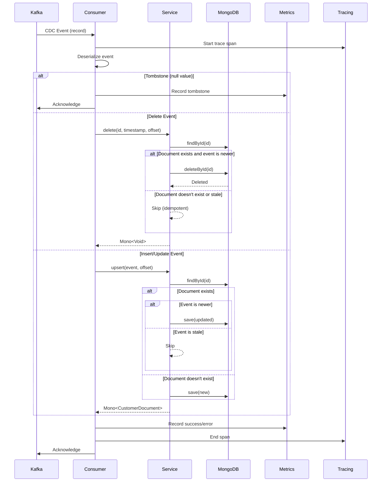

# PLAN-013: MongoDB Consumer Service Migration

## Objective

Migrate the CDC consumer service from R2DBC PostgreSQL to reactive MongoDB, implementing idempotent upsert/delete operations with CDC metadata tracking.

## Parent Feature

[FEATURE-002](../features/FEATURE-002.md) - Sections 2.1.4, 2.1.5: Repository Migration and Consumer Update

## Dependencies

- PLAN-011: MongoDB Infrastructure Setup
- PLAN-012: MongoDB Spring Data Configuration
- PLAN-005: Original idempotent processing (being replaced)

## Changes

### Files to Create/Modify

| File | Purpose |
|------|---------|
| `src/.../service/CustomerMongoService.kt` | MongoDB-based customer service |
| `src/.../consumer/CustomerCdcConsumer.kt` | Update to use MongoDB service |
| `src/.../dto/CustomerCdcEvent.kt` | Add helper methods |
| `src/test/.../service/CustomerMongoServiceTest.kt` | Unit tests |
| `src/test/.../integration/MongoIntegrationTest.kt` | Integration tests |

### CustomerMongoService.kt

```kotlin
package com.pintailconsultingllc.cdcdebezium.service

import com.pintailconsultingllc.cdcdebezium.document.CdcMetadata
import com.pintailconsultingllc.cdcdebezium.document.CdcOperation
import com.pintailconsultingllc.cdcdebezium.document.CustomerDocument
import com.pintailconsultingllc.cdcdebezium.dto.CustomerCdcEvent
import com.pintailconsultingllc.cdcdebezium.repository.CustomerMongoRepository
import io.opentelemetry.api.trace.Span
import io.opentelemetry.api.trace.Tracer
import org.slf4j.LoggerFactory
import org.springframework.data.mongodb.core.ReactiveMongoTemplate
import org.springframework.data.mongodb.core.query.Criteria
import org.springframework.data.mongodb.core.query.Query
import org.springframework.data.mongodb.core.query.Update
import org.springframework.stereotype.Service
import reactor.core.publisher.Mono
import java.time.Instant

@Service
class CustomerMongoService(
    private val customerRepository: CustomerMongoRepository,
    private val mongoTemplate: ReactiveMongoTemplate,
    private val tracer: Tracer
) {
    private val logger = LoggerFactory.getLogger(javaClass)

    /**
     * Idempotent upsert: insert or update based on primary key.
     * Uses source timestamp for optimistic concurrency - only applies
     * updates if the incoming event is newer than existing data.
     */
    fun upsert(
        event: CustomerCdcEvent,
        kafkaOffset: Long,
        kafkaPartition: Int
    ): Mono<CustomerDocument> {
        val span = tracer.spanBuilder("mongodb.upsert")
            .setAttribute("db.operation", "upsert")
            .setAttribute("customer.id", event.id.toString())
            .startSpan()

        val document = CustomerDocument.fromCdcEvent(
            id = event.id.toString(),
            email = event.email ?: "",
            status = event.status ?: "",
            updatedAt = event.updatedAt ?: Instant.now(),
            sourceTimestamp = event.sourceTimestamp ?: System.currentTimeMillis(),
            operation = if (event.isDelete()) CdcOperation.DELETE else CdcOperation.UPDATE,
            kafkaOffset = kafkaOffset,
            kafkaPartition = kafkaPartition
        )

        return customerRepository.findById(event.id.toString())
            .flatMap { existing ->
                if (document.isNewerThan(existing)) {
                    logger.debug(
                        "Updating customer: id={}, sourceTs={} > existingTs={}",
                        event.id,
                        document.cdcMetadata.sourceTimestamp,
                        existing.cdcMetadata.sourceTimestamp
                    )
                    span.setAttribute("db.operation.result", "updated")
                    customerRepository.save(document)
                } else {
                    logger.debug(
                        "Skipping stale update for customer: id={}, sourceTs={} <= existingTs={}",
                        event.id,
                        document.cdcMetadata.sourceTimestamp,
                        existing.cdcMetadata.sourceTimestamp
                    )
                    span.setAttribute("db.operation.result", "skipped_stale")
                    Mono.just(existing)
                }
            }
            .switchIfEmpty(
                Mono.defer {
                    logger.debug("Inserting new customer: id={}", event.id)
                    span.setAttribute("db.operation.result", "inserted")
                    customerRepository.save(document.copy(
                        cdcMetadata = document.cdcMetadata.copy(operation = CdcOperation.INSERT)
                    ))
                }
            )
            .doFinally { span.end() }
    }

    /**
     * Idempotent delete: succeeds even if record doesn't exist.
     * Optionally soft-deletes by updating status instead of removing.
     */
    fun delete(
        id: String,
        sourceTimestamp: Long,
        kafkaOffset: Long,
        kafkaPartition: Int,
        softDelete: Boolean = false
    ): Mono<Void> {
        val span = tracer.spanBuilder("mongodb.delete")
            .setAttribute("db.operation", "delete")
            .setAttribute("customer.id", id)
            .setAttribute("soft_delete", softDelete)
            .startSpan()

        return customerRepository.findById(id)
            .flatMap { existing ->
                // Only delete if this event is newer
                if (sourceTimestamp >= existing.cdcMetadata.sourceTimestamp) {
                    if (softDelete) {
                        logger.debug("Soft-deleting customer: id={}", id)
                        span.setAttribute("db.operation.result", "soft_deleted")
                        val updated = existing.copy(
                            status = "DELETED",
                            cdcMetadata = CdcMetadata(
                                sourceTimestamp = sourceTimestamp,
                                operation = CdcOperation.DELETE,
                                kafkaOffset = kafkaOffset,
                                kafkaPartition = kafkaPartition
                            )
                        )
                        customerRepository.save(updated).then()
                    } else {
                        logger.debug("Hard-deleting customer: id={}", id)
                        span.setAttribute("db.operation.result", "hard_deleted")
                        customerRepository.deleteById(id)
                    }
                } else {
                    logger.debug(
                        "Skipping stale delete for customer: id={}, sourceTs={} < existingTs={}",
                        id, sourceTimestamp, existing.cdcMetadata.sourceTimestamp
                    )
                    span.setAttribute("db.operation.result", "skipped_stale")
                    Mono.empty()
                }
            }
            .switchIfEmpty(
                Mono.defer {
                    logger.debug("Customer already deleted or never existed: id={}", id)
                    span.setAttribute("db.operation.result", "not_found")
                    Mono.empty()
                }
            )
            .doFinally { span.end() }
    }

    /**
     * Atomic upsert using MongoDB's native upsert capability.
     * More efficient than find-then-save for high-throughput scenarios.
     */
    fun atomicUpsert(
        event: CustomerCdcEvent,
        kafkaOffset: Long,
        kafkaPartition: Int
    ): Mono<CustomerDocument> {
        val query = Query(
            Criteria.where("_id").`is`(event.id.toString())
                .and("cdcMetadata.sourceTimestamp").lt(event.sourceTimestamp ?: 0)
        )

        val update = Update()
            .set("email", event.email ?: "")
            .set("status", event.status ?: "")
            .set("updatedAt", event.updatedAt ?: Instant.now())
            .set("cdcMetadata.sourceTimestamp", event.sourceTimestamp ?: System.currentTimeMillis())
            .set("cdcMetadata.operation", CdcOperation.UPDATE.name)
            .set("cdcMetadata.kafkaOffset", kafkaOffset)
            .set("cdcMetadata.kafkaPartition", kafkaPartition)
            .set("cdcMetadata.processedAt", Instant.now())

        return mongoTemplate.findAndModify(
            query,
            update,
            CustomerDocument::class.java
        ).switchIfEmpty(
            // Document doesn't exist or timestamp check failed, try insert
            customerRepository.findById(event.id.toString())
                .switchIfEmpty(
                    Mono.defer {
                        val doc = CustomerDocument.fromCdcEvent(
                            id = event.id.toString(),
                            email = event.email ?: "",
                            status = event.status ?: "",
                            updatedAt = event.updatedAt ?: Instant.now(),
                            sourceTimestamp = event.sourceTimestamp ?: System.currentTimeMillis(),
                            operation = CdcOperation.INSERT,
                            kafkaOffset = kafkaOffset,
                            kafkaPartition = kafkaPartition
                        )
                        customerRepository.save(doc)
                    }
                )
        )
    }
}
```

### Updated CustomerCdcConsumer.kt

```kotlin
package com.pintailconsultingllc.cdcdebezium.consumer

import com.fasterxml.jackson.databind.ObjectMapper
import com.pintailconsultingllc.cdcdebezium.dto.CustomerCdcEvent
import com.pintailconsultingllc.cdcdebezium.metrics.CdcMetricsService
import com.pintailconsultingllc.cdcdebezium.service.CustomerMongoService
import com.pintailconsultingllc.cdcdebezium.tracing.CdcTracingService
import org.apache.kafka.clients.consumer.ConsumerRecord
import org.slf4j.LoggerFactory
import org.springframework.kafka.annotation.KafkaListener
import org.springframework.kafka.support.Acknowledgment
import org.springframework.stereotype.Component
import reactor.core.publisher.Mono

@Component
class CustomerCdcConsumer(
    private val objectMapper: ObjectMapper,
    private val customerMongoService: CustomerMongoService,
    private val metricsService: CdcMetricsService,
    private val tracingService: CdcTracingService
) {
    private val logger = LoggerFactory.getLogger(javaClass)

    @KafkaListener(
        topics = ["cdc.public.customer"],
        groupId = "\${spring.kafka.consumer.group-id}",
        containerFactory = "kafkaListenerContainerFactory"
    )
    fun consume(
        record: ConsumerRecord<String, String?>,
        acknowledgment: Acknowledgment
    ) {
        val key = record.key()
        val value = record.value()
        val startTime = System.currentTimeMillis()

        // Handle Kafka tombstones (null value = delete confirmation)
        if (value == null) {
            logger.debug("Received tombstone for key={}, ignoring", key)
            metricsService.recordTombstone()
            acknowledgment.acknowledge()
            return
        }

        tracingService.withTrace(record) { span ->
            try {
                val event = objectMapper.readValue(value, CustomerCdcEvent::class.java)

                span.setAttribute("cdc.entity.id", event.id.toString())
                span.setAttribute("cdc.operation", if (event.isDelete()) "DELETE" else "UPSERT")

                processEvent(event, record.offset(), record.partition())
                    .doOnSuccess {
                        val duration = System.currentTimeMillis() - startTime
                        metricsService.recordSuccess(duration, event.isDelete())
                        logger.info(
                            "Processed CDC event: id={}, operation={}, duration={}ms",
                            event.id,
                            if (event.isDelete()) "DELETE" else "UPSERT",
                            duration
                        )
                        acknowledgment.acknowledge()
                    }
                    .doOnError { e ->
                        metricsService.recordError(e)
                        logger.error("Error processing CDC event: key={}", key, e)
                        span.recordException(e)
                        // Acknowledge to skip bad messages (consider DLQ in production)
                        acknowledgment.acknowledge()
                    }
                    .block()
            } catch (e: Exception) {
                metricsService.recordError(e)
                logger.error("Error deserializing CDC event: key={}", key, e)
                span.recordException(e)
                acknowledgment.acknowledge()
            }
        }
    }

    private fun processEvent(
        event: CustomerCdcEvent,
        offset: Long,
        partition: Int
    ): Mono<Void> {
        return if (event.isDelete()) {
            logger.info("Processing DELETE for customer: id={}", event.id)
            customerMongoService.delete(
                id = event.id.toString(),
                sourceTimestamp = event.sourceTimestamp ?: System.currentTimeMillis(),
                kafkaOffset = offset,
                kafkaPartition = partition
            )
        } else {
            logger.info(
                "Processing UPSERT for customer: id={}, email={}, status={}",
                event.id, event.email, event.status
            )
            customerMongoService.upsert(event, offset, partition).then()
        }
    }
}
```

## Processing Flow



## Commands to Run

```bash
# Ensure infrastructure is running
docker compose up -d postgres kafka mongodb kafka-connect

# Deploy Debezium connector (if not already deployed)
curl -X POST http://localhost:8083/connectors \
  -H "Content-Type: application/json" \
  -d @docker/debezium/connector-config.json

# Build and run application
./gradlew clean build
./gradlew bootRun

# Insert test data into source PostgreSQL
docker compose exec postgres psql -U postgres -c \
  "INSERT INTO customer (id, email, status) VALUES
   ('550e8400-e29b-41d4-a716-446655440001', 'mongo-test@example.com', 'active');"

# Verify data in MongoDB
docker compose exec mongodb mongosh \
  -u cdc_app -p cdc_app_password \
  --authenticationDatabase cdc_materialized \
  cdc_materialized --eval "db.customers.find().pretty()"

# Test update
docker compose exec postgres psql -U postgres -c \
  "UPDATE customer SET status = 'inactive'
   WHERE email = 'mongo-test@example.com';"

# Verify update propagated
docker compose exec mongodb mongosh \
  -u cdc_app -p cdc_app_password \
  --authenticationDatabase cdc_materialized \
  cdc_materialized --eval "db.customers.findOne({email: 'mongo-test@example.com'})"

# Test delete
docker compose exec postgres psql -U postgres -c \
  "DELETE FROM customer WHERE email = 'mongo-test@example.com';"

# Verify delete propagated
docker compose exec mongodb mongosh \
  -u cdc_app -p cdc_app_password \
  --authenticationDatabase cdc_materialized \
  cdc_materialized --eval "db.customers.findOne({email: 'mongo-test@example.com'})"
# Should return null
```

## Acceptance Criteria

- [x] INSERT event creates new document in MongoDB with cdcMetadata.operation "INSERT"
- [x] UPDATE event modifies existing document with updated status and cdcMetadata
- [x] DELETE event removes document from MongoDB
- [x] Duplicate INSERT is handled idempotently (no error, single document)
- [x] Out-of-order events are handled correctly (older events skipped)
- [x] Delete on non-existent document succeeds without error
- [x] CDC metadata is properly recorded (sourceTimestamp, operation, kafkaOffset, kafkaPartition, processedAt)

### Automated Acceptance Tests

See `src/test/kotlin/com/pintailconsultingllc/cdcdebezium/acceptance/MongoDbConsumerMigrationAcceptanceTest.kt`

Run with: `./gradlew acceptanceTest --tests "*.MongoDbConsumerMigrationAcceptanceTest"`

## Estimated Complexity

Medium-High - Requires careful handling of idempotency, timestamp comparisons, and reactive patterns with MongoDB.

## Notes

- Two upsert strategies provided: standard (find-then-save) and atomic (using MongoDB's findAndModify)
- Atomic upsert is more efficient but requires careful query construction
- Source timestamp comparison prevents out-of-order processing
- Soft delete option available for audit trail requirements
- Tracing integrated at service level for granular visibility
- Consider implementing retry logic for transient MongoDB failures
- Dead Letter Queue (DLQ) should be added for production error handling
