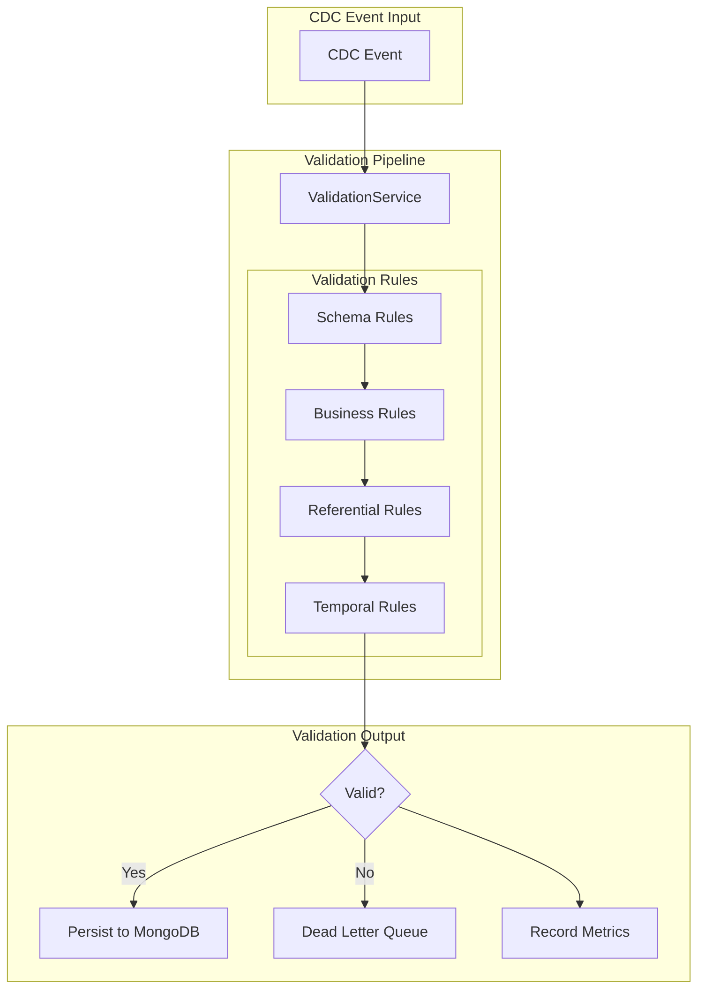

# PLAN-014: Data Validation Framework

## Objective

Implement a comprehensive data validation framework that ensures data integrity after each CDC operation, detecting anomalies, data corruption, and synchronization issues.

## Parent Feature

[FEATURE-002](../features/FEATURE-002.md) - Section 2.2: Data Validation Framework (2.2.1-2.2.6)

## Dependencies

- PLAN-013: MongoDB Consumer Service Migration

## Changes

### Files to Create/Modify

| File | Purpose |
|------|---------|
| `src/.../validation/ValidationRule.kt` | Validation rule interface |
| `src/.../validation/ValidationResult.kt` | Validation result model |
| `src/.../validation/ValidationService.kt` | Orchestrates validation |
| `src/.../validation/rules/SchemaValidationRule.kt` | Schema validation |
| `src/.../validation/rules/BusinessValidationRule.kt` | Business logic validation |
| `src/.../validation/rules/ReferentialIntegrityRule.kt` | FK relationship checks |
| `src/.../validation/rules/TemporalConsistencyRule.kt` | Timestamp validation |
| `src/.../metrics/ValidationMetricsService.kt` | Validation metrics |
| `src/.../consumer/CustomerCdcConsumer.kt` | Integrate validation |

### Validation Architecture



### ValidationRule.kt

```kotlin
package com.pintailconsultingllc.cdcdebezium.validation

import reactor.core.publisher.Mono

/**
 * Interface for CDC event validation rules.
 * Rules are executed in order and can short-circuit on failure.
 */
interface ValidationRule<T> {
    /**
     * Unique identifier for this rule.
     */
    val ruleId: String

    /**
     * Human-readable description of what this rule validates.
     */
    val description: String

    /**
     * Validate the event and return a result.
     * Should not throw exceptions; instead return ValidationResult.failure()
     */
    fun validate(event: T): Mono<ValidationResult>

    /**
     * Whether validation should continue if this rule fails.
     * Default is false (stop on first failure).
     */
    val continueOnFailure: Boolean get() = false
}
```

### ValidationResult.kt

```kotlin
package com.pintailconsultingllc.cdcdebezium.validation

import java.time.Instant

data class ValidationResult(
    val valid: Boolean,
    val ruleId: String,
    val message: String? = null,
    val details: Map<String, Any> = emptyMap(),
    val timestamp: Instant = Instant.now()
) {
    companion object {
        fun success(ruleId: String, message: String? = null): ValidationResult =
            ValidationResult(valid = true, ruleId = ruleId, message = message)

        fun failure(
            ruleId: String,
            message: String,
            details: Map<String, Any> = emptyMap()
        ): ValidationResult =
            ValidationResult(
                valid = false,
                ruleId = ruleId,
                message = message,
                details = details
            )
    }
}

data class AggregatedValidationResult(
    val valid: Boolean,
    val results: List<ValidationResult>,
    val eventId: String,
    val entityType: String,
    val timestamp: Instant = Instant.now()
) {
    val failures: List<ValidationResult>
        get() = results.filter { !it.valid }

    val failureCount: Int
        get() = failures.size

    companion object {
        fun fromResults(
            results: List<ValidationResult>,
            eventId: String,
            entityType: String
        ): AggregatedValidationResult =
            AggregatedValidationResult(
                valid = results.all { it.valid },
                results = results,
                eventId = eventId,
                entityType = entityType
            )
    }
}
```

### ValidationService.kt

```kotlin
package com.pintailconsultingllc.cdcdebezium.validation

import com.pintailconsultingllc.cdcdebezium.dto.CustomerCdcEvent
import com.pintailconsultingllc.cdcdebezium.metrics.ValidationMetricsService
import org.slf4j.LoggerFactory
import org.springframework.stereotype.Service
import reactor.core.publisher.Flux
import reactor.core.publisher.Mono
import java.time.Duration

@Service
class ValidationService(
    private val rules: List<ValidationRule<CustomerCdcEvent>>,
    private val metricsService: ValidationMetricsService
) {
    private val logger = LoggerFactory.getLogger(javaClass)

    /**
     * Validate a CDC event against all registered rules.
     * Returns aggregated results with pass/fail for each rule.
     */
    fun validate(event: CustomerCdcEvent): Mono<AggregatedValidationResult> {
        val startTime = System.currentTimeMillis()

        return Flux.fromIterable(rules)
            .concatMap { rule ->
                rule.validate(event)
                    .timeout(Duration.ofSeconds(5))
                    .onErrorResume { e ->
                        logger.error("Validation rule {} threw exception", rule.ruleId, e)
                        Mono.just(ValidationResult.failure(
                            ruleId = rule.ruleId,
                            message = "Rule execution failed: ${e.message}",
                            details = mapOf("exception" to e.javaClass.simpleName)
                        ))
                    }
                    .flatMap { result ->
                        if (!result.valid && !rule.continueOnFailure) {
                            // Short-circuit: stop processing remaining rules
                            Mono.just(result to true)
                        } else {
                            Mono.just(result to false)
                        }
                    }
            }
            .takeUntil { (_, shouldStop) -> shouldStop }
            .map { (result, _) -> result }
            .collectList()
            .map { results ->
                AggregatedValidationResult.fromResults(
                    results = results,
                    eventId = event.id.toString(),
                    entityType = "customer"
                )
            }
            .doOnNext { result ->
                val duration = System.currentTimeMillis() - startTime
                metricsService.recordValidation(result, duration)

                if (!result.valid) {
                    logger.warn(
                        "Validation failed for event {}: {} failures - {}",
                        event.id,
                        result.failureCount,
                        result.failures.map { it.ruleId }
                    )
                }
            }
    }

    /**
     * Quick validation check - returns true/false without full results.
     */
    fun isValid(event: CustomerCdcEvent): Mono<Boolean> =
        validate(event).map { it.valid }
}
```

### SchemaValidationRule.kt

```kotlin
package com.pintailconsultingllc.cdcdebezium.validation.rules

import com.pintailconsultingllc.cdcdebezium.dto.CustomerCdcEvent
import com.pintailconsultingllc.cdcdebezium.validation.ValidationResult
import com.pintailconsultingllc.cdcdebezium.validation.ValidationRule
import org.springframework.core.annotation.Order
import org.springframework.stereotype.Component
import reactor.core.publisher.Mono
import java.util.UUID

@Component
@Order(1)
class SchemaValidationRule : ValidationRule<CustomerCdcEvent> {

    override val ruleId = "SCHEMA_001"
    override val description = "Validates event conforms to expected schema"

    override fun validate(event: CustomerCdcEvent): Mono<ValidationResult> {
        val errors = mutableListOf<String>()

        // Required fields check
        if (event.id == null) {
            errors.add("id is required")
        }

        // UUID format validation (if not null)
        event.id?.let {
            try {
                UUID.fromString(it.toString())
            } catch (e: IllegalArgumentException) {
                errors.add("id must be valid UUID format")
            }
        }

        // Email format validation (if not delete event)
        if (!event.isDelete()) {
            if (event.email.isNullOrBlank()) {
                errors.add("email is required for non-delete events")
            } else if (!isValidEmail(event.email)) {
                errors.add("email format is invalid: ${event.email}")
            }

            if (event.status.isNullOrBlank()) {
                errors.add("status is required for non-delete events")
            }
        }

        return if (errors.isEmpty()) {
            Mono.just(ValidationResult.success(ruleId, "Schema validation passed"))
        } else {
            Mono.just(ValidationResult.failure(
                ruleId = ruleId,
                message = "Schema validation failed",
                details = mapOf("errors" to errors)
            ))
        }
    }

    private fun isValidEmail(email: String): Boolean {
        val emailRegex = "^[A-Za-z0-9+_.-]+@[A-Za-z0-9.-]+\\.[A-Za-z]{2,}$".toRegex()
        return email.matches(emailRegex)
    }
}
```

### BusinessValidationRule.kt

```kotlin
package com.pintailconsultingllc.cdcdebezium.validation.rules

import com.pintailconsultingllc.cdcdebezium.dto.CustomerCdcEvent
import com.pintailconsultingllc.cdcdebezium.validation.ValidationResult
import com.pintailconsultingllc.cdcdebezium.validation.ValidationRule
import org.springframework.core.annotation.Order
import org.springframework.stereotype.Component
import reactor.core.publisher.Mono

@Component
@Order(2)
class BusinessValidationRule : ValidationRule<CustomerCdcEvent> {

    override val ruleId = "BUSINESS_001"
    override val description = "Validates business constraints"
    override val continueOnFailure = true  // Don't block on business rule failures

    companion object {
        val VALID_STATUSES = setOf("active", "inactive", "pending", "suspended", "DELETED")
        val VALID_STATUS_TRANSITIONS = mapOf(
            "pending" to setOf("active", "suspended"),
            "active" to setOf("inactive", "suspended"),
            "inactive" to setOf("active"),
            "suspended" to setOf("active", "inactive")
        )
    }

    override fun validate(event: CustomerCdcEvent): Mono<ValidationResult> {
        if (event.isDelete()) {
            return Mono.just(ValidationResult.success(ruleId, "Delete events bypass business rules"))
        }

        val errors = mutableListOf<String>()
        val warnings = mutableListOf<String>()

        // Status validation
        event.status?.let { status ->
            if (status !in VALID_STATUSES) {
                errors.add("Invalid status: $status. Must be one of: $VALID_STATUSES")
            }
        }

        // Email domain validation (example business rule)
        event.email?.let { email ->
            if (email.endsWith("@test.com") || email.endsWith("@example.com")) {
                warnings.add("Email appears to be a test address: $email")
            }
        }

        return if (errors.isEmpty()) {
            val message = if (warnings.isEmpty()) {
                "Business validation passed"
            } else {
                "Business validation passed with warnings: ${warnings.joinToString()}"
            }
            Mono.just(ValidationResult.success(ruleId, message))
        } else {
            Mono.just(ValidationResult.failure(
                ruleId = ruleId,
                message = "Business validation failed",
                details = mapOf("errors" to errors, "warnings" to warnings)
            ))
        }
    }
}
```

### TemporalConsistencyRule.kt

```kotlin
package com.pintailconsultingllc.cdcdebezium.validation.rules

import com.pintailconsultingllc.cdcdebezium.dto.CustomerCdcEvent
import com.pintailconsultingllc.cdcdebezium.validation.ValidationResult
import com.pintailconsultingllc.cdcdebezium.validation.ValidationRule
import org.springframework.core.annotation.Order
import org.springframework.stereotype.Component
import reactor.core.publisher.Mono
import java.time.Duration
import java.time.Instant

@Component
@Order(3)
class TemporalConsistencyRule : ValidationRule<CustomerCdcEvent> {

    override val ruleId = "TEMPORAL_001"
    override val description = "Validates timestamp consistency"
    override val continueOnFailure = true  // Log but don't block

    companion object {
        val MAX_CLOCK_DRIFT = Duration.ofMinutes(5)
        val MAX_EVENT_AGE = Duration.ofHours(24)
    }

    override fun validate(event: CustomerCdcEvent): Mono<ValidationResult> {
        val now = Instant.now()
        val warnings = mutableListOf<String>()
        val errors = mutableListOf<String>()

        // Check source timestamp
        event.sourceTimestamp?.let { ts ->
            val eventTime = Instant.ofEpochMilli(ts)

            // Future timestamp check
            if (eventTime.isAfter(now.plus(MAX_CLOCK_DRIFT))) {
                errors.add("Source timestamp is in the future: $eventTime (now: $now)")
            }

            // Very old event check
            if (eventTime.isBefore(now.minus(MAX_EVENT_AGE))) {
                warnings.add("Event is older than ${MAX_EVENT_AGE.toHours()} hours: $eventTime")
            }
        } ?: run {
            warnings.add("Source timestamp is missing, using current time")
        }

        // Check updatedAt timestamp
        event.updatedAt?.let { updatedAt ->
            if (updatedAt.isAfter(now.plus(MAX_CLOCK_DRIFT))) {
                errors.add("updatedAt timestamp is in the future: $updatedAt")
            }
        }

        return if (errors.isEmpty()) {
            Mono.just(ValidationResult.success(
                ruleId = ruleId,
                message = if (warnings.isEmpty()) "Temporal validation passed"
                         else "Temporal validation passed with warnings"
            ))
        } else {
            Mono.just(ValidationResult.failure(
                ruleId = ruleId,
                message = "Temporal validation failed",
                details = mapOf("errors" to errors, "warnings" to warnings)
            ))
        }
    }
}
```

### ValidationMetricsService.kt

```kotlin
package com.pintailconsultingllc.cdcdebezium.metrics

import com.pintailconsultingllc.cdcdebezium.validation.AggregatedValidationResult
import io.micrometer.core.instrument.Counter
import io.micrometer.core.instrument.MeterRegistry
import io.micrometer.core.instrument.Timer
import org.springframework.stereotype.Service
import java.util.concurrent.TimeUnit

@Service
class ValidationMetricsService(private val meterRegistry: MeterRegistry) {

    private val validationTimer: Timer = Timer.builder("cdc.validation.latency")
        .description("Time taken to validate CDC events")
        .register(meterRegistry)

    private val passedCounter: Counter = Counter.builder("cdc.validation.passed")
        .description("Number of events passing validation")
        .register(meterRegistry)

    private val failedCounter: Counter = Counter.builder("cdc.validation.failed")
        .description("Number of events failing validation")
        .register(meterRegistry)

    fun recordValidation(result: AggregatedValidationResult, durationMs: Long) {
        validationTimer.record(durationMs, TimeUnit.MILLISECONDS)

        if (result.valid) {
            passedCounter.increment()
        } else {
            failedCounter.increment()

            // Record per-rule failures
            result.failures.forEach { failure ->
                Counter.builder("cdc.validation.failed.by_rule")
                    .tag("rule_id", failure.ruleId)
                    .tag("entity_type", result.entityType)
                    .register(meterRegistry)
                    .increment()
            }
        }
    }
}
```

### Updated Consumer with Validation

```kotlin
// In CustomerCdcConsumer.kt, add validation step:

private fun processEvent(
    event: CustomerCdcEvent,
    offset: Long,
    partition: Int
): Mono<Void> {
    return validationService.validate(event)
        .flatMap { validationResult ->
            if (!validationResult.valid) {
                logger.warn("Validation failed for event {}: {}", event.id, validationResult.failures)
                // Route to DLQ or log and skip
                handleValidationFailure(event, validationResult)
            } else {
                // Proceed with normal processing
                if (event.isDelete()) {
                    customerMongoService.delete(
                        id = event.id.toString(),
                        sourceTimestamp = event.sourceTimestamp ?: System.currentTimeMillis(),
                        kafkaOffset = offset,
                        kafkaPartition = partition
                    )
                } else {
                    customerMongoService.upsert(event, offset, partition).then()
                }
            }
        }
}

private fun handleValidationFailure(
    event: CustomerCdcEvent,
    result: AggregatedValidationResult
): Mono<Void> {
    // Log detailed failure information
    logger.error(
        "Validation failed - eventId={}, entityType={}, failures={}",
        result.eventId,
        result.entityType,
        result.failures.map { "${it.ruleId}: ${it.message}" }
    )

    // TODO: Route to Dead Letter Queue
    // dlqProducer.send(event, result)

    return Mono.empty()
}
```

## Commands to Run

```bash
# Build and run tests
./gradlew clean build
./gradlew test --tests "*Validation*"

# Start application with validation enabled
./gradlew bootRun

# Insert valid data
docker compose exec postgres psql -U postgres -c \
  "INSERT INTO customer (id, email, status) VALUES
   ('550e8400-e29b-41d4-a716-446655440010', 'valid@company.com', 'active');"

# Insert data with invalid email (should fail schema validation)
docker compose exec postgres psql -U postgres -c \
  "INSERT INTO customer (id, email, status) VALUES
   ('550e8400-e29b-41d4-a716-446655440011', 'invalid-email', 'active');"

# Insert data with invalid status (should fail business validation)
docker compose exec postgres psql -U postgres -c \
  "INSERT INTO customer (id, email, status) VALUES
   ('550e8400-e29b-41d4-a716-446655440012', 'test@company.com', 'unknown-status');"

# Check validation metrics
curl http://localhost:8080/actuator/prometheus | grep cdc.validation

# Check logs for validation failures
docker compose logs cdc-consumer | grep -i "validation failed"
```

## Acceptance Criteria

- [x] Valid event passes all validation rules and is persisted to MongoDB
- [x] Event with missing required field fails schema validation with appropriate message
- [x] Event with invalid email format fails schema validation
- [x] Event with invalid status fails business validation with valid status list
- [x] Event with future timestamp fails temporal validation
- [x] Validation metrics are recorded (cdc.validation.passed, cdc.validation.failed)
- [x] Validation latency is tracked with count and timing data

### Automated Acceptance Tests

See `src/test/kotlin/com/pintailconsultingllc/cdcdebezium/acceptance/DataValidationFrameworkAcceptanceTest.kt`

Run with: `./gradlew acceptanceTest --tests "*.DataValidationFrameworkAcceptanceTest"`

## Estimated Complexity

Medium - Requires careful rule design and integration with existing consumer pipeline.

## Notes

- Rules are executed in order (controlled by `@Order` annotation)
- Short-circuiting available: if a rule fails and `continueOnFailure=false`, remaining rules are skipped
- Validation is non-blocking using reactive patterns
- Each rule has a 5-second timeout to prevent hangs
- Metrics are recorded per-rule for granular alerting
- Consider adding a Dead Letter Queue for failed events in production
