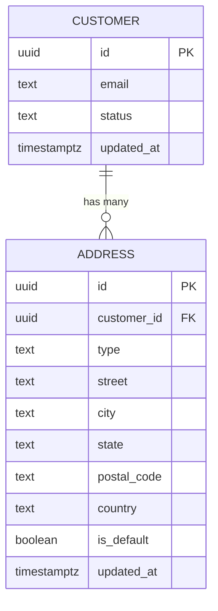
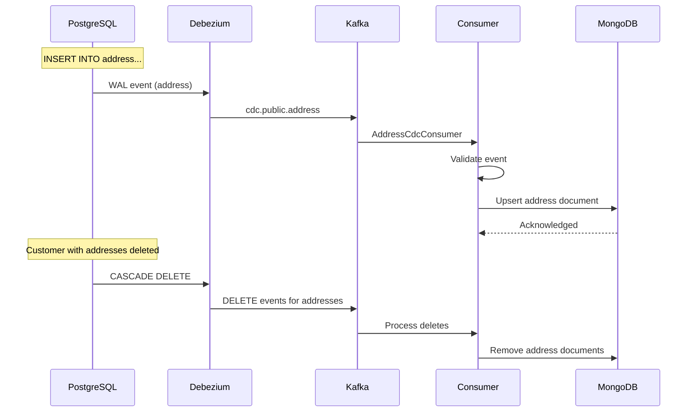

# PLAN-015: Extended Schema - Address Entity

## Objective

Add the address entity to the CDC pipeline, demonstrating one-to-many relationship handling between customer and address in both source PostgreSQL and target MongoDB.

## Parent Feature

[FEATURE-002](../features/FEATURE-002.md) - Section 2.3.1: Address Entity Implementation

## Dependencies

- PLAN-013: MongoDB Consumer Service Migration
- PLAN-014: Data Validation Framework

## Changes

### Files to Create/Modify

| File | Purpose |
|------|---------|
| `docker/postgres/init/02-address-schema.sql` | Address table schema |
| `docker/debezium/connector-config.json` | Update for address table |
| `docker/mongodb/init/02-address-collection.js` | Address collection setup |
| `src/.../dto/AddressCdcEvent.kt` | Address CDC event DTO |
| `src/.../document/AddressDocument.kt` | MongoDB document model |
| `src/.../repository/AddressMongoRepository.kt` | Repository interface |
| `src/.../service/AddressMongoService.kt` | Business logic |
| `src/.../consumer/AddressCdcConsumer.kt` | Kafka consumer |
| `src/.../validation/rules/AddressValidationRule.kt` | Address validation |

### Entity Relationship



### PostgreSQL Schema (02-address-schema.sql)

```sql
-- Address entity with foreign key to customer
CREATE TABLE public.address
(
    id          UUID PRIMARY KEY DEFAULT gen_random_uuid(),
    customer_id UUID        NOT NULL REFERENCES public.customer (id) ON DELETE CASCADE,
    type        TEXT        NOT NULL CHECK (type IN ('billing', 'shipping', 'home', 'work')),
    street      TEXT        NOT NULL,
    city        TEXT        NOT NULL,
    state       TEXT,
    postal_code TEXT        NOT NULL,
    country     TEXT        NOT NULL DEFAULT 'USA',
    is_default  BOOLEAN     NOT NULL DEFAULT false,
    updated_at  TIMESTAMPTZ NOT NULL DEFAULT now(),

    -- Ensure only one default address per type per customer
    CONSTRAINT unique_default_per_type
        UNIQUE (customer_id, type, is_default)
        DEFERRABLE INITIALLY DEFERRED
);

-- Indexes for query optimization
CREATE INDEX idx_address_customer_id ON public.address (customer_id);
CREATE INDEX idx_address_type ON public.address (type);
CREATE INDEX idx_address_postal_code ON public.address (postal_code);

-- Trigger to update updated_at
CREATE TRIGGER address_updated_at
    BEFORE UPDATE ON public.address
    FOR EACH ROW
    EXECUTE FUNCTION update_updated_at_column();

-- Seed data
INSERT INTO public.address (id, customer_id, type, street, city, state, postal_code, country, is_default)
SELECT
    gen_random_uuid(),
    c.id,
    'shipping',
    '123 Main Street',
    'Minneapolis',
    'MN',
    '55401',
    'USA',
    true
FROM public.customer c
WHERE c.email = 'alice@example.com';

INSERT INTO public.address (id, customer_id, type, street, city, state, postal_code, country, is_default)
SELECT
    gen_random_uuid(),
    c.id,
    'billing',
    '456 Commerce Ave',
    'Minneapolis',
    'MN',
    '55402',
    'USA',
    true
FROM public.customer c
WHERE c.email = 'alice@example.com';
```

### Updated Debezium Connector Config

```json
{
  "name": "postgres-cdc-connector",
  "config": {
    "connector.class": "io.debezium.connector.postgresql.PostgresConnector",
    "database.hostname": "postgres",
    "database.port": "5432",
    "database.user": "postgres",
    "database.password": "postgres",
    "database.dbname": "postgres",
    "topic.prefix": "cdc",
    "table.include.list": "public.customer,public.address",
    "publication.name": "cdc_publication",
    "slot.name": "cdc_slot",
    "plugin.name": "pgoutput",
    "transforms": "unwrap",
    "transforms.unwrap.type": "io.debezium.transforms.ExtractNewRecordState",
    "transforms.unwrap.delete.handling.mode": "rewrite",
    "transforms.unwrap.drop.tombstones": "false",
    "key.converter": "org.apache.kafka.connect.json.JsonConverter",
    "key.converter.schemas.enable": "false",
    "value.converter": "org.apache.kafka.connect.json.JsonConverter",
    "value.converter.schemas.enable": "false"
  }
}
```

### MongoDB Address Collection (02-address-collection.js)

```javascript
db = db.getSiblingDB('cdc_materialized');

db.createCollection('addresses', {
  validator: {
    $jsonSchema: {
      bsonType: 'object',
      required: ['_id', 'customerId', 'type', 'street', 'city', 'postalCode', 'country'],
      properties: {
        _id: { bsonType: 'string' },
        customerId: { bsonType: 'string' },
        type: { bsonType: 'string', enum: ['billing', 'shipping', 'home', 'work'] },
        street: { bsonType: 'string' },
        city: { bsonType: 'string' },
        state: { bsonType: ['string', 'null'] },
        postalCode: { bsonType: 'string' },
        country: { bsonType: 'string' },
        isDefault: { bsonType: 'bool' },
        updatedAt: { bsonType: 'date' },
        cdcMetadata: { bsonType: 'object' }
      }
    }
  }
});

// Indexes
db.addresses.createIndex({ 'customerId': 1 });
db.addresses.createIndex({ 'customerId': 1, 'type': 1 });
db.addresses.createIndex({ 'postalCode': 1 });
db.addresses.createIndex({ 'cdcMetadata.sourceTimestamp': -1 });

print('Address collection initialized');
```

### AddressCdcEvent.kt

```kotlin
package com.pintailconsultingllc.cdcdebezium.dto

import com.fasterxml.jackson.annotation.JsonIgnoreProperties
import com.fasterxml.jackson.annotation.JsonProperty
import java.time.Instant
import java.util.UUID

@JsonIgnoreProperties(ignoreUnknown = true)
data class AddressCdcEvent(
    val id: UUID,

    @JsonProperty("customer_id")
    val customerId: UUID,

    val type: String?,
    val street: String?,
    val city: String?,
    val state: String?,

    @JsonProperty("postal_code")
    val postalCode: String?,

    val country: String?,

    @JsonProperty("is_default")
    val isDefault: Boolean?,

    @JsonProperty("updated_at")
    val updatedAt: Instant?,

    @JsonProperty("__deleted")
    val deleted: Boolean? = false,

    @JsonProperty("__source_ts_ms")
    val sourceTimestamp: Long? = null
) {
    fun isDelete(): Boolean = deleted == true
}
```

### AddressDocument.kt

```kotlin
package com.pintailconsultingllc.cdcdebezium.document

import org.springframework.data.annotation.Id
import org.springframework.data.mongodb.core.index.CompoundIndex
import org.springframework.data.mongodb.core.index.Indexed
import org.springframework.data.mongodb.core.mapping.Document
import java.time.Instant

@Document(collection = "addresses")
@CompoundIndex(name = "idx_customer_type", def = "{'customerId': 1, 'type': 1}")
data class AddressDocument(
    @Id
    val id: String,

    @Indexed
    val customerId: String,

    val type: AddressType,
    val street: String,
    val city: String,
    val state: String?,
    val postalCode: String,
    val country: String,
    val isDefault: Boolean,
    val updatedAt: Instant,
    val cdcMetadata: CdcMetadata
) {
    fun isNewerThan(other: AddressDocument): Boolean =
        this.cdcMetadata.sourceTimestamp > other.cdcMetadata.sourceTimestamp

    companion object {
        fun fromCdcEvent(
            event: AddressCdcEvent,
            operation: CdcOperation,
            kafkaOffset: Long,
            kafkaPartition: Int
        ): AddressDocument = AddressDocument(
            id = event.id.toString(),
            customerId = event.customerId.toString(),
            type = AddressType.valueOf(event.type?.uppercase() ?: "SHIPPING"),
            street = event.street ?: "",
            city = event.city ?: "",
            state = event.state,
            postalCode = event.postalCode ?: "",
            country = event.country ?: "USA",
            isDefault = event.isDefault ?: false,
            updatedAt = event.updatedAt ?: Instant.now(),
            cdcMetadata = CdcMetadata(
                sourceTimestamp = event.sourceTimestamp ?: System.currentTimeMillis(),
                operation = operation,
                kafkaOffset = kafkaOffset,
                kafkaPartition = kafkaPartition
            )
        )
    }
}

enum class AddressType {
    BILLING, SHIPPING, HOME, WORK
}
```

### AddressMongoRepository.kt

```kotlin
package com.pintailconsultingllc.cdcdebezium.repository

import com.pintailconsultingllc.cdcdebezium.document.AddressDocument
import com.pintailconsultingllc.cdcdebezium.document.AddressType
import org.springframework.data.mongodb.repository.ReactiveMongoRepository
import org.springframework.stereotype.Repository
import reactor.core.publisher.Flux
import reactor.core.publisher.Mono

@Repository
interface AddressMongoRepository : ReactiveMongoRepository<AddressDocument, String> {

    fun findByCustomerId(customerId: String): Flux<AddressDocument>

    fun findByCustomerIdAndType(customerId: String, type: AddressType): Mono<AddressDocument>

    fun findByCustomerIdAndIsDefaultTrue(customerId: String): Flux<AddressDocument>

    fun deleteByCustomerId(customerId: String): Mono<Long>
}
```

### AddressMongoService.kt

```kotlin
package com.pintailconsultingllc.cdcdebezium.service

import com.pintailconsultingllc.cdcdebezium.document.AddressDocument
import com.pintailconsultingllc.cdcdebezium.document.CdcOperation
import com.pintailconsultingllc.cdcdebezium.dto.AddressCdcEvent
import com.pintailconsultingllc.cdcdebezium.repository.AddressMongoRepository
import org.slf4j.LoggerFactory
import org.springframework.stereotype.Service
import reactor.core.publisher.Mono

@Service
class AddressMongoService(
    private val addressRepository: AddressMongoRepository
) {
    private val logger = LoggerFactory.getLogger(javaClass)

    fun upsert(
        event: AddressCdcEvent,
        kafkaOffset: Long,
        kafkaPartition: Int
    ): Mono<AddressDocument> {
        val document = AddressDocument.fromCdcEvent(
            event = event,
            operation = CdcOperation.UPDATE,
            kafkaOffset = kafkaOffset,
            kafkaPartition = kafkaPartition
        )

        return addressRepository.findById(event.id.toString())
            .flatMap { existing ->
                if (document.isNewerThan(existing)) {
                    logger.debug("Updating address: id={}", event.id)
                    addressRepository.save(document)
                } else {
                    logger.debug("Skipping stale update for address: id={}", event.id)
                    Mono.just(existing)
                }
            }
            .switchIfEmpty(
                Mono.defer {
                    logger.debug("Inserting new address: id={}", event.id)
                    addressRepository.save(document.copy(
                        cdcMetadata = document.cdcMetadata.copy(operation = CdcOperation.INSERT)
                    ))
                }
            )
    }

    fun delete(
        id: String,
        sourceTimestamp: Long
    ): Mono<Void> {
        return addressRepository.findById(id)
            .flatMap { existing ->
                if (sourceTimestamp >= existing.cdcMetadata.sourceTimestamp) {
                    logger.debug("Deleting address: id={}", id)
                    addressRepository.deleteById(id)
                } else {
                    logger.debug("Skipping stale delete for address: id={}", id)
                    Mono.empty()
                }
            }
            .switchIfEmpty(
                Mono.defer {
                    logger.debug("Address already deleted or never existed: id={}", id)
                    Mono.empty()
                }
            )
    }
}
```

### AddressCdcConsumer.kt

```kotlin
package com.pintailconsultingllc.cdcdebezium.consumer

import com.fasterxml.jackson.databind.ObjectMapper
import com.pintailconsultingllc.cdcdebezium.dto.AddressCdcEvent
import com.pintailconsultingllc.cdcdebezium.metrics.CdcMetricsService
import com.pintailconsultingllc.cdcdebezium.service.AddressMongoService
import org.apache.kafka.clients.consumer.ConsumerRecord
import org.slf4j.LoggerFactory
import org.springframework.kafka.annotation.KafkaListener
import org.springframework.kafka.support.Acknowledgment
import org.springframework.stereotype.Component
import reactor.core.publisher.Mono

@Component
class AddressCdcConsumer(
    private val objectMapper: ObjectMapper,
    private val addressMongoService: AddressMongoService,
    private val metricsService: CdcMetricsService
) {
    private val logger = LoggerFactory.getLogger(javaClass)

    @KafkaListener(
        topics = ["cdc.public.address"],
        groupId = "\${spring.kafka.consumer.group-id}",
        containerFactory = "kafkaListenerContainerFactory"
    )
    fun consume(
        record: ConsumerRecord<String, String?>,
        acknowledgment: Acknowledgment
    ) {
        val key = record.key()
        val value = record.value()
        val startTime = System.currentTimeMillis()

        if (value == null) {
            logger.debug("Received tombstone for address key={}", key)
            metricsService.recordTombstone()
            acknowledgment.acknowledge()
            return
        }

        try {
            val event = objectMapper.readValue(value, AddressCdcEvent::class.java)

            processEvent(event, record.offset(), record.partition())
                .doOnSuccess {
                    val duration = System.currentTimeMillis() - startTime
                    metricsService.recordSuccess(duration, event.isDelete())
                    logger.info(
                        "Processed address CDC event: id={}, customerId={}, operation={}, duration={}ms",
                        event.id, event.customerId,
                        if (event.isDelete()) "DELETE" else "UPSERT",
                        duration
                    )
                    acknowledgment.acknowledge()
                }
                .doOnError { e ->
                    metricsService.recordError(e)
                    logger.error("Error processing address CDC event: key={}", key, e)
                    acknowledgment.acknowledge()
                }
                .block()
        } catch (e: Exception) {
            metricsService.recordError(e)
            logger.error("Error deserializing address CDC event: key={}", key, e)
            acknowledgment.acknowledge()
        }
    }

    private fun processEvent(
        event: AddressCdcEvent,
        offset: Long,
        partition: Int
    ): Mono<Void> {
        return if (event.isDelete()) {
            addressMongoService.delete(
                id = event.id.toString(),
                sourceTimestamp = event.sourceTimestamp ?: System.currentTimeMillis()
            )
        } else {
            addressMongoService.upsert(event, offset, partition).then()
        }
    }
}
```

## CDC Flow



## Commands to Run

```bash
# Recreate PostgreSQL with new schema
docker compose down postgres
docker volume rm cdc-debezium_postgres_data || true
docker compose up -d postgres

# Wait for PostgreSQL to be ready
until docker compose exec postgres pg_isready; do sleep 1; done

# Update Debezium connector
curl -X DELETE http://localhost:8083/connectors/postgres-cdc-connector
curl -X POST http://localhost:8083/connectors \
  -H "Content-Type: application/json" \
  -d @docker/debezium/connector-config.json

# Verify new topic exists
docker compose exec kafka kafka-topics \
  --bootstrap-server localhost:9092 --list | grep address

# Start application
./gradlew bootRun

# Verify addresses materialized in MongoDB
docker compose exec mongodb mongosh \
  -u cdc_app -p cdc_app_password \
  --authenticationDatabase cdc_materialized \
  cdc_materialized --eval "db.addresses.find().pretty()"

# Insert new address
docker compose exec postgres psql -U postgres -c \
  "INSERT INTO address (customer_id, type, street, city, postal_code)
   SELECT id, 'work', '789 Office Park', 'St. Paul', '55101'
   FROM customer WHERE email = 'bob@example.com';"

# Verify in MongoDB
docker compose exec mongodb mongosh \
  -u cdc_app -p cdc_app_password \
  --authenticationDatabase cdc_materialized \
  cdc_materialized --eval "db.addresses.find({city: 'St. Paul'}).pretty()"
```

## Acceptance Criteria

- [x] New address is captured via CDC and exists in MongoDB within 5 seconds
- [x] Address update propagates to MongoDB correctly
- [x] Address delete propagates to MongoDB correctly
- [x] Customer deletion cascades to addresses (no orphaned addresses in MongoDB)
- [x] Address type is validated (billing, shipping, home, work only)
- [x] Customer-address relationship is maintained (queries by customerId return correct addresses)

### Automated Acceptance Tests

See `src/test/kotlin/com/pintailconsultingllc/cdcdebezium/acceptance/ExtendedSchemaAddressAcceptanceTest.kt`

Run with: `./gradlew acceptanceTest --tests "*.ExtendedSchemaAddressAcceptanceTest"`

## Estimated Complexity

Medium - Extends existing patterns to new entity type with foreign key relationship.

## Notes

- Uses PostgreSQL CASCADE DELETE - address rows are automatically deleted when customer is deleted
- Debezium captures the cascade deletes as separate events
- MongoDB indexes optimize queries by customerId
- Consider denormalizing customer email into address document for query convenience
- Address type uses enum for type safety
