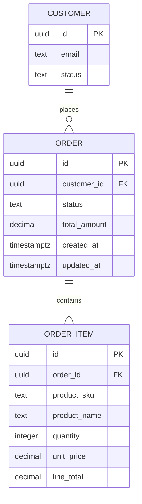
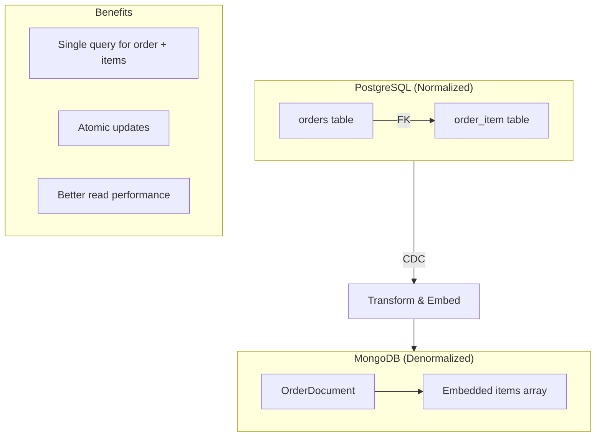

# PLAN-016: Extended Schema - Order Entities

## Objective

Add order and order_item entities to the CDC pipeline, demonstrating parent-child relationship handling and MongoDB document embedding strategies.

## Parent Feature

[FEATURE-002](../features/FEATURE-002.md) - Sections 2.3.2, 2.3.3: Order and Order Item Implementation

## Dependencies

- PLAN-015: Extended Schema - Address Entity
- PLAN-013: MongoDB Consumer Service Migration

## Changes

### Files to Create/Modify

| File | Purpose |
|------|---------|
| `docker/postgres/init/03-order-schema.sql` | Order tables schema |
| `docker/debezium/connector-config.json` | Add order tables |
| `docker/mongodb/init/03-order-collections.js` | Order collections |
| `src/.../dto/OrderCdcEvent.kt` | Order CDC event DTO |
| `src/.../dto/OrderItemCdcEvent.kt` | Order item CDC event DTO |
| `src/.../document/OrderDocument.kt` | MongoDB order document |
| `src/.../document/OrderItemDocument.kt` | Embedded order item |
| `src/.../repository/OrderMongoRepository.kt` | Order repository |
| `src/.../service/OrderMongoService.kt` | Order service |
| `src/.../consumer/OrderCdcConsumer.kt` | Order consumer |
| `src/.../consumer/OrderItemCdcConsumer.kt` | Order item consumer |

### Entity Relationships



### PostgreSQL Schema (03-order-schema.sql)

```sql
-- Order status enum
CREATE TYPE order_status AS ENUM (
    'pending', 'confirmed', 'processing', 'shipped', 'delivered', 'cancelled'
);

-- Order entity
CREATE TABLE public.orders
(
    id           UUID PRIMARY KEY DEFAULT gen_random_uuid(),
    customer_id  UUID         NOT NULL REFERENCES public.customer (id),
    status       order_status NOT NULL DEFAULT 'pending',
    total_amount DECIMAL(12, 2) NOT NULL DEFAULT 0.00,
    created_at   TIMESTAMPTZ  NOT NULL DEFAULT now(),
    updated_at   TIMESTAMPTZ  NOT NULL DEFAULT now()
);

CREATE INDEX idx_orders_customer_id ON public.orders (customer_id);
CREATE INDEX idx_orders_status ON public.orders (status);
CREATE INDEX idx_orders_created_at ON public.orders (created_at DESC);

-- Order item entity
CREATE TABLE public.order_item
(
    id           UUID PRIMARY KEY DEFAULT gen_random_uuid(),
    order_id     UUID           NOT NULL REFERENCES public.orders (id) ON DELETE CASCADE,
    product_sku  TEXT           NOT NULL,
    product_name TEXT           NOT NULL,
    quantity     INTEGER        NOT NULL CHECK (quantity > 0),
    unit_price   DECIMAL(10, 2) NOT NULL CHECK (unit_price >= 0),
    line_total   DECIMAL(12, 2) NOT NULL GENERATED ALWAYS AS (quantity * unit_price) STORED
);

CREATE INDEX idx_order_item_order_id ON public.order_item (order_id);
CREATE INDEX idx_order_item_sku ON public.order_item (product_sku);

-- Trigger to update order updated_at
CREATE TRIGGER orders_updated_at
    BEFORE UPDATE ON public.orders
    FOR EACH ROW
    EXECUTE FUNCTION update_updated_at_column();

-- Function to recalculate order total
CREATE OR REPLACE FUNCTION recalculate_order_total()
RETURNS TRIGGER AS $$
BEGIN
    UPDATE public.orders
    SET total_amount = (
        SELECT COALESCE(SUM(line_total), 0)
        FROM public.order_item
        WHERE order_id = COALESCE(NEW.order_id, OLD.order_id)
    )
    WHERE id = COALESCE(NEW.order_id, OLD.order_id);
    RETURN NULL;
END;
$$ LANGUAGE plpgsql;

CREATE TRIGGER order_item_total_trigger
    AFTER INSERT OR UPDATE OR DELETE ON public.order_item
    FOR EACH ROW
    EXECUTE FUNCTION recalculate_order_total();

-- Seed data
INSERT INTO public.orders (id, customer_id, status)
SELECT
    '11111111-1111-1111-1111-111111111111'::uuid,
    id,
    'confirmed'
FROM public.customer
WHERE email = 'alice@example.com';

INSERT INTO public.order_item (order_id, product_sku, product_name, quantity, unit_price)
VALUES
    ('11111111-1111-1111-1111-111111111111', 'PROD-001', 'Widget Pro', 2, 29.99),
    ('11111111-1111-1111-1111-111111111111', 'PROD-002', 'Gadget Plus', 1, 49.99);
```

### MongoDB Collections (03-order-collections.js)

```javascript
db = db.getSiblingDB('cdc_materialized');

// Orders collection - stores order with embedded items
db.createCollection('orders', {
  validator: {
    $jsonSchema: {
      bsonType: 'object',
      required: ['_id', 'customerId', 'status', 'totalAmount', 'createdAt'],
      properties: {
        _id: { bsonType: 'string' },
        customerId: { bsonType: 'string' },
        status: {
          bsonType: 'string',
          enum: ['pending', 'confirmed', 'processing', 'shipped', 'delivered', 'cancelled']
        },
        totalAmount: { bsonType: 'decimal' },
        items: {
          bsonType: 'array',
          items: {
            bsonType: 'object',
            required: ['id', 'productSku', 'productName', 'quantity', 'unitPrice'],
            properties: {
              id: { bsonType: 'string' },
              productSku: { bsonType: 'string' },
              productName: { bsonType: 'string' },
              quantity: { bsonType: 'int' },
              unitPrice: { bsonType: 'decimal' },
              lineTotal: { bsonType: 'decimal' }
            }
          }
        },
        createdAt: { bsonType: 'date' },
        updatedAt: { bsonType: 'date' },
        cdcMetadata: { bsonType: 'object' }
      }
    }
  }
});

// Indexes
db.orders.createIndex({ 'customerId': 1 });
db.orders.createIndex({ 'status': 1 });
db.orders.createIndex({ 'createdAt': -1 });
db.orders.createIndex({ 'customerId': 1, 'status': 1 });
db.orders.createIndex({ 'items.productSku': 1 });

print('Order collections initialized');
```

### OrderCdcEvent.kt

```kotlin
package com.pintailconsultingllc.cdcdebezium.dto

import com.fasterxml.jackson.annotation.JsonIgnoreProperties
import com.fasterxml.jackson.annotation.JsonProperty
import java.math.BigDecimal
import java.time.Instant
import java.util.UUID

@JsonIgnoreProperties(ignoreUnknown = true)
data class OrderCdcEvent(
    val id: UUID,

    @JsonProperty("customer_id")
    val customerId: UUID,

    val status: String?,

    @JsonProperty("total_amount")
    val totalAmount: BigDecimal?,

    @JsonProperty("created_at")
    val createdAt: Instant?,

    @JsonProperty("updated_at")
    val updatedAt: Instant?,

    @JsonProperty("__deleted")
    val deleted: Boolean? = false,

    @JsonProperty("__source_ts_ms")
    val sourceTimestamp: Long? = null
) {
    fun isDelete(): Boolean = deleted == true
}

@JsonIgnoreProperties(ignoreUnknown = true)
data class OrderItemCdcEvent(
    val id: UUID,

    @JsonProperty("order_id")
    val orderId: UUID,

    @JsonProperty("product_sku")
    val productSku: String?,

    @JsonProperty("product_name")
    val productName: String?,

    val quantity: Int?,

    @JsonProperty("unit_price")
    val unitPrice: BigDecimal?,

    @JsonProperty("line_total")
    val lineTotal: BigDecimal?,

    @JsonProperty("__deleted")
    val deleted: Boolean? = false,

    @JsonProperty("__source_ts_ms")
    val sourceTimestamp: Long? = null
) {
    fun isDelete(): Boolean = deleted == true
}
```

### OrderDocument.kt

```kotlin
package com.pintailconsultingllc.cdcdebezium.document

import org.springframework.data.annotation.Id
import org.springframework.data.mongodb.core.index.CompoundIndex
import org.springframework.data.mongodb.core.index.Indexed
import org.springframework.data.mongodb.core.mapping.Document
import java.math.BigDecimal
import java.time.Instant

@Document(collection = "orders")
@CompoundIndex(name = "idx_customer_status", def = "{'customerId': 1, 'status': 1}")
data class OrderDocument(
    @Id
    val id: String,

    @Indexed
    val customerId: String,

    @Indexed
    val status: OrderStatus,

    val totalAmount: BigDecimal,

    val items: List<OrderItemEmbedded> = emptyList(),

    val createdAt: Instant,
    val updatedAt: Instant,
    val cdcMetadata: CdcMetadata
) {
    fun isNewerThan(other: OrderDocument): Boolean =
        this.cdcMetadata.sourceTimestamp > other.cdcMetadata.sourceTimestamp

    fun withItem(item: OrderItemEmbedded): OrderDocument {
        val existingIndex = items.indexOfFirst { it.id == item.id }
        val newItems = if (existingIndex >= 0) {
            items.toMutableList().apply { this[existingIndex] = item }
        } else {
            items + item
        }
        return copy(items = newItems)
    }

    fun withoutItem(itemId: String): OrderDocument =
        copy(items = items.filter { it.id != itemId })
}

data class OrderItemEmbedded(
    val id: String,
    val productSku: String,
    val productName: String,
    val quantity: Int,
    val unitPrice: BigDecimal,
    val lineTotal: BigDecimal,
    val cdcMetadata: CdcMetadata
)

enum class OrderStatus {
    PENDING, CONFIRMED, PROCESSING, SHIPPED, DELIVERED, CANCELLED
}
```

### OrderMongoService.kt

```kotlin
package com.pintailconsultingllc.cdcdebezium.service

import com.pintailconsultingllc.cdcdebezium.document.*
import com.pintailconsultingllc.cdcdebezium.dto.OrderCdcEvent
import com.pintailconsultingllc.cdcdebezium.dto.OrderItemCdcEvent
import com.pintailconsultingllc.cdcdebezium.repository.OrderMongoRepository
import org.slf4j.LoggerFactory
import org.springframework.data.mongodb.core.ReactiveMongoTemplate
import org.springframework.data.mongodb.core.query.Criteria
import org.springframework.data.mongodb.core.query.Query
import org.springframework.data.mongodb.core.query.Update
import org.springframework.stereotype.Service
import reactor.core.publisher.Mono
import java.math.BigDecimal
import java.time.Instant

@Service
class OrderMongoService(
    private val orderRepository: OrderMongoRepository,
    private val mongoTemplate: ReactiveMongoTemplate
) {
    private val logger = LoggerFactory.getLogger(javaClass)

    fun upsertOrder(
        event: OrderCdcEvent,
        kafkaOffset: Long,
        kafkaPartition: Int
    ): Mono<OrderDocument> {
        val document = OrderDocument(
            id = event.id.toString(),
            customerId = event.customerId.toString(),
            status = OrderStatus.valueOf(event.status?.uppercase() ?: "PENDING"),
            totalAmount = event.totalAmount ?: BigDecimal.ZERO,
            items = emptyList(),
            createdAt = event.createdAt ?: Instant.now(),
            updatedAt = event.updatedAt ?: Instant.now(),
            cdcMetadata = CdcMetadata(
                sourceTimestamp = event.sourceTimestamp ?: System.currentTimeMillis(),
                operation = CdcOperation.UPDATE,
                kafkaOffset = kafkaOffset,
                kafkaPartition = kafkaPartition
            )
        )

        return orderRepository.findById(event.id.toString())
            .flatMap { existing ->
                if (document.isNewerThan(existing)) {
                    logger.debug("Updating order: id={}", event.id)
                    // Preserve existing items when updating order
                    orderRepository.save(document.copy(items = existing.items))
                } else {
                    logger.debug("Skipping stale update for order: id={}", event.id)
                    Mono.just(existing)
                }
            }
            .switchIfEmpty(
                Mono.defer {
                    logger.debug("Inserting new order: id={}", event.id)
                    orderRepository.save(document.copy(
                        cdcMetadata = document.cdcMetadata.copy(operation = CdcOperation.INSERT)
                    ))
                }
            )
    }

    fun deleteOrder(id: String, sourceTimestamp: Long): Mono<Void> {
        return orderRepository.findById(id)
            .flatMap { existing ->
                if (sourceTimestamp >= existing.cdcMetadata.sourceTimestamp) {
                    logger.debug("Deleting order: id={}", id)
                    orderRepository.deleteById(id)
                } else {
                    Mono.empty()
                }
            }
            .switchIfEmpty(Mono.empty())
    }

    /**
     * Handle order item changes by embedding in parent order document.
     * This denormalization optimizes read performance.
     */
    fun upsertOrderItem(
        event: OrderItemCdcEvent,
        kafkaOffset: Long,
        kafkaPartition: Int
    ): Mono<OrderDocument> {
        val itemEmbedded = OrderItemEmbedded(
            id = event.id.toString(),
            productSku = event.productSku ?: "",
            productName = event.productName ?: "",
            quantity = event.quantity ?: 0,
            unitPrice = event.unitPrice ?: BigDecimal.ZERO,
            lineTotal = event.lineTotal ?: BigDecimal.ZERO,
            cdcMetadata = CdcMetadata(
                sourceTimestamp = event.sourceTimestamp ?: System.currentTimeMillis(),
                operation = CdcOperation.UPDATE,
                kafkaOffset = kafkaOffset,
                kafkaPartition = kafkaPartition
            )
        )

        return orderRepository.findById(event.orderId.toString())
            .flatMap { order ->
                val existingItem = order.items.find { it.id == event.id.toString() }

                // Only update if this event is newer
                val shouldUpdate = existingItem == null ||
                    itemEmbedded.cdcMetadata.sourceTimestamp > existingItem.cdcMetadata.sourceTimestamp

                if (shouldUpdate) {
                    logger.debug("Updating order item: orderId={}, itemId={}", event.orderId, event.id)
                    orderRepository.save(order.withItem(itemEmbedded))
                } else {
                    logger.debug("Skipping stale item update: itemId={}", event.id)
                    Mono.just(order)
                }
            }
            .switchIfEmpty(
                Mono.defer {
                    // Order doesn't exist yet - this can happen with out-of-order events
                    // Queue for retry or create placeholder order
                    logger.warn("Order not found for item: orderId={}, itemId={}", event.orderId, event.id)
                    Mono.empty()
                }
            )
    }

    fun deleteOrderItem(
        orderId: String,
        itemId: String,
        sourceTimestamp: Long
    ): Mono<OrderDocument> {
        return orderRepository.findById(orderId)
            .flatMap { order ->
                val existingItem = order.items.find { it.id == itemId }

                if (existingItem != null && sourceTimestamp >= existingItem.cdcMetadata.sourceTimestamp) {
                    logger.debug("Removing order item: orderId={}, itemId={}", orderId, itemId)
                    orderRepository.save(order.withoutItem(itemId))
                } else {
                    Mono.just(order)
                }
            }
            .switchIfEmpty(Mono.empty())
    }
}
```

### MongoDB Document Strategy



## Commands to Run

```bash
# Recreate PostgreSQL with order schema
docker compose down postgres
docker volume rm cdc-debezium_postgres_data || true
docker compose up -d postgres

# Update Debezium connector for new tables
curl -X DELETE http://localhost:8083/connectors/postgres-cdc-connector
# Update connector-config.json to include:
# "table.include.list": "public.customer,public.address,public.orders,public.order_item"
curl -X POST http://localhost:8083/connectors \
  -H "Content-Type: application/json" \
  -d @docker/debezium/connector-config.json

# Verify topics
docker compose exec kafka kafka-topics --bootstrap-server localhost:9092 --list

# Start application
./gradlew bootRun

# Verify orders materialized
docker compose exec mongodb mongosh \
  -u cdc_app -p cdc_app_password \
  --authenticationDatabase cdc_materialized \
  cdc_materialized --eval "db.orders.find().pretty()"

# Create new order
docker compose exec postgres psql -U postgres -c \
  "INSERT INTO orders (customer_id, status)
   SELECT id, 'pending' FROM customer WHERE email = 'bob@example.com'
   RETURNING id;"

# Add items to order (use returned order id)
docker compose exec postgres psql -U postgres -c \
  "INSERT INTO order_item (order_id, product_sku, product_name, quantity, unit_price)
   VALUES
     ('<order-id>', 'SKU-100', 'Test Product', 3, 19.99);"

# Verify embedded item in MongoDB
docker compose exec mongodb mongosh \
  -u cdc_app -p cdc_app_password \
  --authenticationDatabase cdc_materialized \
  cdc_materialized --eval "db.orders.findOne({'items.productSku': 'SKU-100'})"
```

## Acceptance Criteria

- [ ] New order is captured via CDC and exists in MongoDB within 5 seconds
- [ ] Order item is embedded in order document with productSku and quantity
- [ ] Multiple items are properly embedded with correct lineTotal values
- [ ] Order item update updates embedded document and recalculates lineTotal
- [ ] Order item delete removes from embedded array
- [ ] Order total is synchronized when PostgreSQL trigger updates total_amount
- [ ] Out-of-order item events are handled correctly (older events skipped)

## Estimated Complexity

Medium-High - Embedding strategy requires careful handling of parent-child relationships and out-of-order events.

## Notes

- Order items are embedded in order documents for query optimization
- PostgreSQL uses trigger to recalculate order total when items change
- Out-of-order events (item arrives before order) require retry logic or placeholder orders
- Consider using Change Streams for real-time order updates in production
- Line total is computed in PostgreSQL using GENERATED ALWAYS AS
