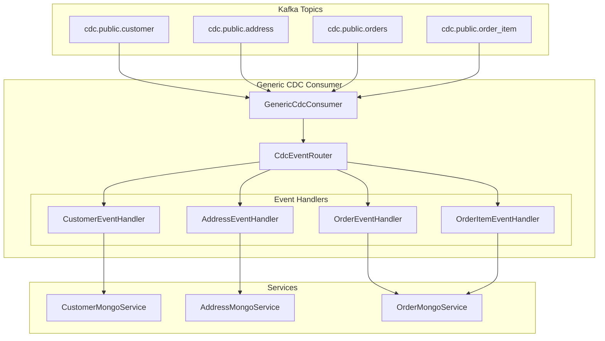
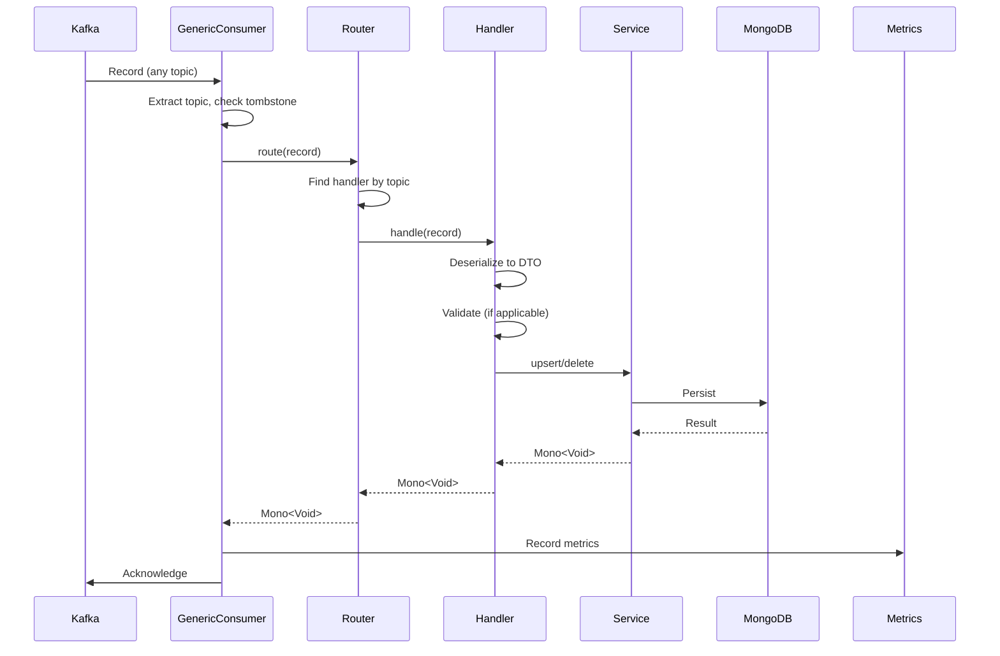

# PLAN-017: Multi-Table CDC Consumer Architecture

## Objective

Refactor the CDC consumer architecture to handle multiple entity types efficiently with a generic event router, isolated handlers, and shared infrastructure.

## Parent Feature

[FEATURE-002](../features/FEATURE-002.md) - Sections 2.3.4, 2.3.5: Multi-Table Consumer Architecture and Aggregation Strategies

## Dependencies

- PLAN-015: Extended Schema - Address Entity
- PLAN-016: Extended Schema - Order Entities

## Changes

### Files to Create/Modify

| File | Purpose |
|------|---------|
| `src/.../consumer/CdcEventRouter.kt` | Routes events to appropriate handlers |
| `src/.../consumer/CdcEventHandler.kt` | Generic handler interface |
| `src/.../consumer/GenericCdcConsumer.kt` | Unified consumer for all topics |
| `src/.../consumer/handlers/CustomerEventHandler.kt` | Customer-specific handler |
| `src/.../consumer/handlers/AddressEventHandler.kt` | Address-specific handler |
| `src/.../consumer/handlers/OrderEventHandler.kt` | Order-specific handler |
| `src/.../consumer/handlers/OrderItemEventHandler.kt` | Order item handler |
| `src/.../config/KafkaConsumerConfig.kt` | Multi-topic configuration |

### Architecture Overview



### CdcEventHandler.kt

```kotlin
package com.pintailconsultingllc.cdcdebezium.consumer

import org.apache.kafka.clients.consumer.ConsumerRecord
import reactor.core.publisher.Mono

/**
 * Generic interface for CDC event handlers.
 * Each entity type implements this interface.
 */
interface CdcEventHandler {
    /**
     * The Kafka topic this handler processes.
     */
    val topic: String

    /**
     * The entity type name for metrics and logging.
     */
    val entityType: String

    /**
     * Process a single CDC event.
     * @return Mono that completes when processing is done
     */
    fun handle(record: ConsumerRecord<String, String>): Mono<Void>

    /**
     * Check if this handler can process the given topic.
     */
    fun canHandle(topic: String): Boolean = this.topic == topic
}
```

### CdcEventRouter.kt

```kotlin
package com.pintailconsultingllc.cdcdebezium.consumer

import org.apache.kafka.clients.consumer.ConsumerRecord
import org.slf4j.LoggerFactory
import org.springframework.stereotype.Component
import reactor.core.publisher.Mono

/**
 * Routes CDC events to the appropriate handler based on topic.
 */
@Component
class CdcEventRouter(
    private val handlers: List<CdcEventHandler>
) {
    private val logger = LoggerFactory.getLogger(javaClass)
    private val handlerMap: Map<String, CdcEventHandler> by lazy {
        handlers.associateBy { it.topic }
    }

    init {
        logger.info(
            "Initialized CdcEventRouter with handlers for topics: {}",
            handlers.map { it.topic }
        )
    }

    /**
     * Route an event to the appropriate handler.
     */
    fun route(record: ConsumerRecord<String, String>): Mono<Void> {
        val handler = handlerMap[record.topic()]

        return if (handler != null) {
            logger.debug(
                "Routing event to {}: topic={}, key={}",
                handler.entityType, record.topic(), record.key()
            )
            handler.handle(record)
        } else {
            logger.warn("No handler found for topic: {}", record.topic())
            Mono.empty()
        }
    }

    /**
     * Get all registered topics.
     */
    fun getRegisteredTopics(): Set<String> = handlerMap.keys
}
```

### GenericCdcConsumer.kt

```kotlin
package com.pintailconsultingllc.cdcdebezium.consumer

import com.pintailconsultingllc.cdcdebezium.metrics.CdcMetricsService
import com.pintailconsultingllc.cdcdebezium.tracing.CdcTracingService
import org.apache.kafka.clients.consumer.ConsumerRecord
import org.slf4j.LoggerFactory
import org.springframework.kafka.annotation.KafkaListener
import org.springframework.kafka.support.Acknowledgment
import org.springframework.stereotype.Component

/**
 * Unified CDC consumer that handles all entity types via the router.
 */
@Component
class GenericCdcConsumer(
    private val router: CdcEventRouter,
    private val metricsService: CdcMetricsService,
    private val tracingService: CdcTracingService
) {
    private val logger = LoggerFactory.getLogger(javaClass)

    @KafkaListener(
        topics = [
            "cdc.public.customer",
            "cdc.public.address",
            "cdc.public.orders",
            "cdc.public.order_item"
        ],
        groupId = "\${spring.kafka.consumer.group-id}",
        containerFactory = "kafkaListenerContainerFactory"
    )
    fun consume(
        record: ConsumerRecord<String, String?>,
        acknowledgment: Acknowledgment
    ) {
        val topic = record.topic()
        val key = record.key()
        val value = record.value()
        val startTime = System.currentTimeMillis()

        // Handle tombstones
        if (value == null) {
            logger.debug("Received tombstone: topic={}, key={}", topic, key)
            metricsService.recordTombstone(topic)
            acknowledgment.acknowledge()
            return
        }

        tracingService.withTrace(record) { span ->
            span.setAttribute("cdc.topic", topic)
            span.setAttribute("cdc.key", key ?: "null")

            try {
                @Suppress("UNCHECKED_CAST")
                router.route(record as ConsumerRecord<String, String>)
                    .doOnSuccess {
                        val duration = System.currentTimeMillis() - startTime
                        metricsService.recordSuccess(topic, duration)
                        logger.info(
                            "Processed CDC event: topic={}, key={}, duration={}ms",
                            topic, key, duration
                        )
                        acknowledgment.acknowledge()
                    }
                    .doOnError { e ->
                        metricsService.recordError(topic, e)
                        logger.error("Error processing CDC event: topic={}, key={}", topic, key, e)
                        span.recordException(e)
                        acknowledgment.acknowledge()  // Skip bad messages
                    }
                    .block()
            } catch (e: Exception) {
                metricsService.recordError(topic, e)
                logger.error("Unexpected error: topic={}, key={}", topic, key, e)
                span.recordException(e)
                acknowledgment.acknowledge()
            }
        }
    }
}
```

### CustomerEventHandler.kt

```kotlin
package com.pintailconsultingllc.cdcdebezium.consumer.handlers

import com.fasterxml.jackson.databind.ObjectMapper
import com.pintailconsultingllc.cdcdebezium.consumer.CdcEventHandler
import com.pintailconsultingllc.cdcdebezium.dto.CustomerCdcEvent
import com.pintailconsultingllc.cdcdebezium.service.CustomerMongoService
import com.pintailconsultingllc.cdcdebezium.validation.ValidationService
import org.apache.kafka.clients.consumer.ConsumerRecord
import org.slf4j.LoggerFactory
import org.springframework.stereotype.Component
import reactor.core.publisher.Mono

@Component
class CustomerEventHandler(
    private val objectMapper: ObjectMapper,
    private val customerService: CustomerMongoService,
    private val validationService: ValidationService
) : CdcEventHandler {

    private val logger = LoggerFactory.getLogger(javaClass)

    override val topic = "cdc.public.customer"
    override val entityType = "customer"

    override fun handle(record: ConsumerRecord<String, String>): Mono<Void> {
        val event = objectMapper.readValue(record.value(), CustomerCdcEvent::class.java)

        return validationService.validate(event)
            .flatMap { result ->
                if (!result.valid) {
                    logger.warn("Validation failed for customer {}: {}", event.id, result.failures)
                    Mono.empty()
                } else if (event.isDelete()) {
                    customerService.delete(
                        id = event.id.toString(),
                        sourceTimestamp = event.sourceTimestamp ?: System.currentTimeMillis(),
                        kafkaOffset = record.offset(),
                        kafkaPartition = record.partition()
                    )
                } else {
                    customerService.upsert(event, record.offset(), record.partition()).then()
                }
            }
    }
}
```

### AddressEventHandler.kt

```kotlin
package com.pintailconsultingllc.cdcdebezium.consumer.handlers

import com.fasterxml.jackson.databind.ObjectMapper
import com.pintailconsultingllc.cdcdebezium.consumer.CdcEventHandler
import com.pintailconsultingllc.cdcdebezium.dto.AddressCdcEvent
import com.pintailconsultingllc.cdcdebezium.service.AddressMongoService
import org.apache.kafka.clients.consumer.ConsumerRecord
import org.slf4j.LoggerFactory
import org.springframework.stereotype.Component
import reactor.core.publisher.Mono

@Component
class AddressEventHandler(
    private val objectMapper: ObjectMapper,
    private val addressService: AddressMongoService
) : CdcEventHandler {

    private val logger = LoggerFactory.getLogger(javaClass)

    override val topic = "cdc.public.address"
    override val entityType = "address"

    override fun handle(record: ConsumerRecord<String, String>): Mono<Void> {
        val event = objectMapper.readValue(record.value(), AddressCdcEvent::class.java)

        return if (event.isDelete()) {
            addressService.delete(
                id = event.id.toString(),
                sourceTimestamp = event.sourceTimestamp ?: System.currentTimeMillis()
            )
        } else {
            addressService.upsert(event, record.offset(), record.partition()).then()
        }
    }
}
```

### OrderEventHandler.kt

```kotlin
package com.pintailconsultingllc.cdcdebezium.consumer.handlers

import com.fasterxml.jackson.databind.ObjectMapper
import com.pintailconsultingllc.cdcdebezium.consumer.CdcEventHandler
import com.pintailconsultingllc.cdcdebezium.dto.OrderCdcEvent
import com.pintailconsultingllc.cdcdebezium.service.OrderMongoService
import org.apache.kafka.clients.consumer.ConsumerRecord
import org.slf4j.LoggerFactory
import org.springframework.stereotype.Component
import reactor.core.publisher.Mono

@Component
class OrderEventHandler(
    private val objectMapper: ObjectMapper,
    private val orderService: OrderMongoService
) : CdcEventHandler {

    private val logger = LoggerFactory.getLogger(javaClass)

    override val topic = "cdc.public.orders"
    override val entityType = "order"

    override fun handle(record: ConsumerRecord<String, String>): Mono<Void> {
        val event = objectMapper.readValue(record.value(), OrderCdcEvent::class.java)

        return if (event.isDelete()) {
            orderService.deleteOrder(
                id = event.id.toString(),
                sourceTimestamp = event.sourceTimestamp ?: System.currentTimeMillis()
            )
        } else {
            orderService.upsertOrder(event, record.offset(), record.partition()).then()
        }
    }
}
```

### OrderItemEventHandler.kt

```kotlin
package com.pintailconsultingllc.cdcdebezium.consumer.handlers

import com.fasterxml.jackson.databind.ObjectMapper
import com.pintailconsultingllc.cdcdebezium.consumer.CdcEventHandler
import com.pintailconsultingllc.cdcdebezium.dto.OrderItemCdcEvent
import com.pintailconsultingllc.cdcdebezium.service.OrderMongoService
import org.apache.kafka.clients.consumer.ConsumerRecord
import org.slf4j.LoggerFactory
import org.springframework.stereotype.Component
import reactor.core.publisher.Mono

@Component
class OrderItemEventHandler(
    private val objectMapper: ObjectMapper,
    private val orderService: OrderMongoService
) : CdcEventHandler {

    private val logger = LoggerFactory.getLogger(javaClass)

    override val topic = "cdc.public.order_item"
    override val entityType = "order_item"

    override fun handle(record: ConsumerRecord<String, String>): Mono<Void> {
        val event = objectMapper.readValue(record.value(), OrderItemCdcEvent::class.java)

        return if (event.isDelete()) {
            orderService.deleteOrderItem(
                orderId = event.orderId.toString(),
                itemId = event.id.toString(),
                sourceTimestamp = event.sourceTimestamp ?: System.currentTimeMillis()
            ).then()
        } else {
            orderService.upsertOrderItem(event, record.offset(), record.partition()).then()
        }
    }
}
```

### Updated CdcMetricsService

```kotlin
// Add topic-specific metrics
fun recordSuccess(topic: String, durationMs: Long) {
    Counter.builder("cdc.events.processed")
        .tag("topic", topic)
        .tag("status", "success")
        .register(meterRegistry)
        .increment()

    Timer.builder("cdc.processing.duration")
        .tag("topic", topic)
        .register(meterRegistry)
        .record(durationMs, TimeUnit.MILLISECONDS)
}

fun recordError(topic: String, error: Throwable) {
    Counter.builder("cdc.events.processed")
        .tag("topic", topic)
        .tag("status", "error")
        .tag("error_type", error.javaClass.simpleName)
        .register(meterRegistry)
        .increment()
}

fun recordTombstone(topic: String) {
    Counter.builder("cdc.events.tombstones")
        .tag("topic", topic)
        .register(meterRegistry)
        .increment()
}
```

## Event Flow



## Commands to Run

```bash
# Build application
./gradlew clean build

# Run tests for handlers
./gradlew test --tests "*EventHandler*"
./gradlew test --tests "*Router*"

# Start all infrastructure
docker compose up -d

# Deploy Debezium connector with all tables
curl -X DELETE http://localhost:8083/connectors/postgres-cdc-connector
curl -X POST http://localhost:8083/connectors \
  -H "Content-Type: application/json" \
  -d @docker/debezium/connector-config.json

# Start application
./gradlew bootRun

# Verify all topics are being consumed
# Check logs for "Routing event to" messages

# Generate test data across all entity types
docker compose exec postgres psql -U postgres -c \
  "INSERT INTO customer (id, email, status) VALUES
   (gen_random_uuid(), 'multi-test@example.com', 'active');"

# Check metrics for all topics
curl http://localhost:8080/actuator/prometheus | grep cdc.events.processed
```

## Acceptance Criteria

```gherkin
Feature: Multi-Table CDC Consumer Architecture
  As a CDC pipeline
  I want to process multiple entity types efficiently
  So that the codebase is maintainable and scalable

  Scenario: Router discovers all handlers on startup
    Given handlers exist for customer, address, orders, order_item
    When the application starts
    Then the router should have 4 registered handlers
    And logs should show "Initialized CdcEventRouter with handlers"

  Scenario: Events are routed to correct handler
    Given the generic consumer is running
    When a customer event arrives on cdc.public.customer
    Then the CustomerEventHandler should process it
    And metrics should show topic "cdc.public.customer"

  Scenario: Unknown topic is handled gracefully
    Given a topic "cdc.public.unknown" has no handler
    When an event arrives on that topic
    Then a warning should be logged
    And the event should be acknowledged without error

  Scenario: Handler failure is isolated
    Given CustomerEventHandler throws an exception
    When events arrive for customer and address
    Then the address event should still be processed
    And error metrics should only increment for customer

  Scenario: Metrics are recorded per topic
    Given events are processed for all entity types
    When I query Prometheus metrics
    Then cdc.events.processed should have labels for each topic
    And cdc.processing.duration should have per-topic timing

  Scenario: Adding new entity type
    Given a new entity "product" needs CDC support
    When I create ProductEventHandler implementing CdcEventHandler
    And I add the topic to @KafkaListener
    Then the router should automatically include the new handler
    And no changes to GenericCdcConsumer are needed
```

## Estimated Complexity

Medium - Refactoring existing code into modular architecture with proper abstraction.

## Notes

- Single `@KafkaListener` annotation handles all topics for simplicity
- Alternative: Use `@KafkaListener` per handler with `ConcurrentKafkaListenerContainerFactory`
- Handler discovery via Spring's dependency injection (List<CdcEventHandler>)
- Consider adding `@Order` annotation for handler priority if needed
- Future enhancement: Dynamic handler registration via classpath scanning
- Metrics are now topic-aware for granular monitoring
