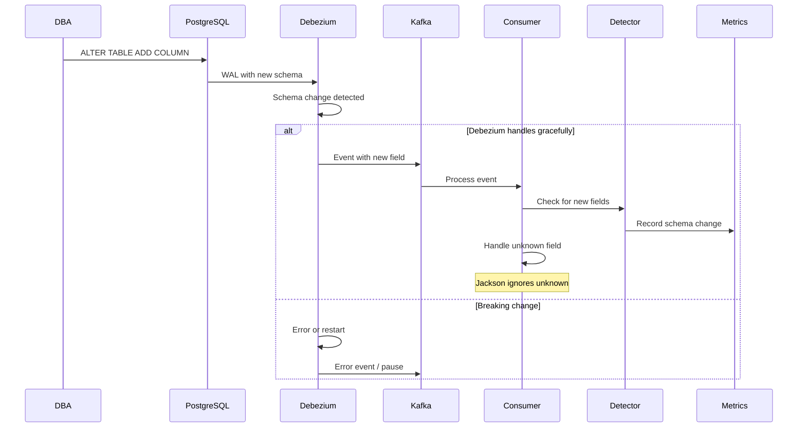
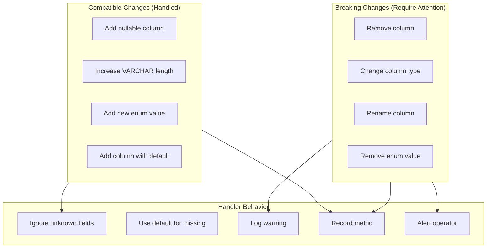

# PLAN-018: Schema Change Handling

## Objective

Implement robust handling of schema changes in the source PostgreSQL database, ensuring the CDC pipeline gracefully handles additions, modifications, and compatible changes.

## Parent Feature

[FEATURE-002](../features/FEATURE-002.md) - Section 2.4: Schema Change Handling (2.4.1-2.4.6)

## Dependencies

- PLAN-017: Multi-Table CDC Consumer Architecture
- PLAN-014: Data Validation Framework

## Changes

### Files to Create/Modify

| File | Purpose |
|------|---------|
| `src/.../config/JacksonConfig.kt` | Configure unknown property handling |
| `src/.../schema/SchemaChangeDetector.kt` | Detect schema changes |
| `src/.../schema/SchemaVersionTracker.kt` | Track schema versions |
| `src/.../schema/SchemaChangeEvent.kt` | Schema change event model |
| `src/.../metrics/SchemaMetricsService.kt` | Schema-related metrics |
| `src/test/.../schema/SchemaChangeTest.kt` | Schema evolution tests |

### Schema Change Flow



### JacksonConfig.kt

```kotlin
package com.pintailconsultingllc.cdcdebezium.config

import com.fasterxml.jackson.databind.DeserializationFeature
import com.fasterxml.jackson.databind.ObjectMapper
import com.fasterxml.jackson.databind.SerializationFeature
import com.fasterxml.jackson.datatype.jsr310.JavaTimeModule
import com.fasterxml.jackson.module.kotlin.KotlinModule
import org.springframework.context.annotation.Bean
import org.springframework.context.annotation.Configuration
import org.springframework.context.annotation.Primary

@Configuration
class JacksonConfig {

    @Bean
    @Primary
    fun objectMapper(): ObjectMapper = ObjectMapper().apply {
        // Register modules
        registerModule(KotlinModule.Builder().build())
        registerModule(JavaTimeModule())

        // Handle schema evolution gracefully
        configure(DeserializationFeature.FAIL_ON_UNKNOWN_PROPERTIES, false)
        configure(DeserializationFeature.FAIL_ON_NULL_FOR_PRIMITIVES, false)
        configure(DeserializationFeature.READ_UNKNOWN_ENUM_VALUES_AS_NULL, true)

        // Timestamp handling
        configure(SerializationFeature.WRITE_DATES_AS_TIMESTAMPS, false)
    }
}
```

### SchemaChangeEvent.kt

```kotlin
package com.pintailconsultingllc.cdcdebezium.schema

import java.time.Instant

data class SchemaChangeEvent(
    val entityType: String,
    val changeType: SchemaChangeType,
    val fieldName: String?,
    val oldValue: Any?,
    val newValue: Any?,
    val detectedAt: Instant = Instant.now(),
    val kafkaOffset: Long,
    val kafkaPartition: Int
)

enum class SchemaChangeType {
    NEW_FIELD,
    REMOVED_FIELD,
    TYPE_CHANGE,
    NEW_ENUM_VALUE,
    UNKNOWN
}

data class SchemaVersion(
    val entityType: String,
    val version: Int,
    val fields: Set<String>,
    val detectedAt: Instant = Instant.now()
)
```

### SchemaChangeDetector.kt

```kotlin
package com.pintailconsultingllc.cdcdebezium.schema

import com.fasterxml.jackson.databind.JsonNode
import com.fasterxml.jackson.databind.ObjectMapper
import org.slf4j.LoggerFactory
import org.springframework.stereotype.Component
import java.util.concurrent.ConcurrentHashMap

@Component
class SchemaChangeDetector(
    private val objectMapper: ObjectMapper,
    private val schemaMetrics: SchemaMetricsService
) {
    private val logger = LoggerFactory.getLogger(javaClass)

    // Track known fields per entity type
    private val knownFields = ConcurrentHashMap<String, MutableSet<String>>()

    // Known field definitions (configure per entity)
    private val expectedFields = mapOf(
        "customer" to setOf("id", "email", "status", "updated_at", "__deleted", "__source_ts_ms"),
        "address" to setOf("id", "customer_id", "type", "street", "city", "state", "postal_code", "country", "is_default", "updated_at", "__deleted", "__source_ts_ms"),
        "orders" to setOf("id", "customer_id", "status", "total_amount", "created_at", "updated_at", "__deleted", "__source_ts_ms"),
        "order_item" to setOf("id", "order_id", "product_sku", "product_name", "quantity", "unit_price", "line_total", "__deleted", "__source_ts_ms")
    )

    /**
     * Analyze a raw JSON event for schema changes.
     * Returns list of detected changes.
     */
    fun detectChanges(
        entityType: String,
        rawJson: String,
        kafkaOffset: Long,
        kafkaPartition: Int
    ): List<SchemaChangeEvent> {
        val changes = mutableListOf<SchemaChangeEvent>()

        try {
            val jsonNode = objectMapper.readTree(rawJson)
            val currentFields = extractFields(jsonNode)

            // Initialize known fields if first time seeing this entity
            val known = knownFields.computeIfAbsent(entityType) {
                expectedFields[entityType]?.toMutableSet() ?: mutableSetOf()
            }

            // Detect new fields
            val newFields = currentFields - known
            newFields.forEach { field ->
                logger.info("Schema change detected: new field '{}' in entity '{}'", field, entityType)
                changes.add(SchemaChangeEvent(
                    entityType = entityType,
                    changeType = SchemaChangeType.NEW_FIELD,
                    fieldName = field,
                    oldValue = null,
                    newValue = "detected",
                    kafkaOffset = kafkaOffset,
                    kafkaPartition = kafkaPartition
                ))

                // Update known fields
                known.add(field)
                schemaMetrics.recordSchemaChange(entityType, SchemaChangeType.NEW_FIELD, field)
            }

            // Detect potentially removed fields (field in known but not in current)
            // Note: This is tricky because null fields may not be serialized
            // Only flag if field was expected and consistently missing
            val expected = expectedFields[entityType] ?: emptySet()
            val missingExpected = expected - currentFields - setOf("__deleted", "__source_ts_ms")

            missingExpected.forEach { field ->
                // Only warn, don't track as definite removal
                if (jsonNode.has(field) && jsonNode.get(field).isNull) {
                    // Field is present but null - OK
                } else if (!jsonNode.has(field)) {
                    logger.debug("Expected field '{}' not present in {} event", field, entityType)
                }
            }

        } catch (e: Exception) {
            logger.error("Error detecting schema changes for {}", entityType, e)
            changes.add(SchemaChangeEvent(
                entityType = entityType,
                changeType = SchemaChangeType.UNKNOWN,
                fieldName = null,
                oldValue = null,
                newValue = "Error: ${e.message}",
                kafkaOffset = kafkaOffset,
                kafkaPartition = kafkaPartition
            ))
        }

        return changes
    }

    private fun extractFields(node: JsonNode): Set<String> {
        return node.fieldNames().asSequence().toSet()
    }

    /**
     * Get current schema version for an entity type.
     */
    fun getCurrentSchema(entityType: String): SchemaVersion {
        val fields = knownFields[entityType] ?: expectedFields[entityType] ?: emptySet()
        return SchemaVersion(
            entityType = entityType,
            version = fields.size,  // Simple version based on field count
            fields = fields.toSet()
        )
    }

    /**
     * Reset schema tracking (useful for testing).
     */
    fun resetTracking() {
        knownFields.clear()
    }
}
```

### SchemaVersionTracker.kt

```kotlin
package com.pintailconsultingllc.cdcdebezium.schema

import org.slf4j.LoggerFactory
import org.springframework.data.mongodb.core.ReactiveMongoTemplate
import org.springframework.data.mongodb.core.query.Criteria
import org.springframework.data.mongodb.core.query.Query
import org.springframework.data.mongodb.core.query.Update
import org.springframework.stereotype.Component
import reactor.core.publisher.Mono
import java.time.Instant

/**
 * Persists schema version information to MongoDB for historical tracking.
 */
@Component
class SchemaVersionTracker(
    private val mongoTemplate: ReactiveMongoTemplate
) {
    private val logger = LoggerFactory.getLogger(javaClass)

    data class SchemaHistoryDocument(
        val entityType: String,
        val fieldName: String,
        val changeType: String,
        val detectedAt: Instant,
        val kafkaOffset: Long
    )

    fun recordSchemaChange(event: SchemaChangeEvent): Mono<Void> {
        val document = SchemaHistoryDocument(
            entityType = event.entityType,
            fieldName = event.fieldName ?: "unknown",
            changeType = event.changeType.name,
            detectedAt = event.detectedAt,
            kafkaOffset = event.kafkaOffset
        )

        return mongoTemplate.save(document, "schema_history")
            .doOnSuccess {
                logger.info(
                    "Recorded schema change: entity={}, field={}, type={}",
                    event.entityType, event.fieldName, event.changeType
                )
            }
            .then()
    }

    fun getSchemaHistory(entityType: String): Mono<List<SchemaHistoryDocument>> {
        val query = Query(Criteria.where("entityType").`is`(entityType))
            .with(org.springframework.data.domain.Sort.by(
                org.springframework.data.domain.Sort.Direction.DESC, "detectedAt"
            ))

        return mongoTemplate.find(query, SchemaHistoryDocument::class.java, "schema_history")
            .collectList()
    }
}
```

### SchemaMetricsService.kt

```kotlin
package com.pintailconsultingllc.cdcdebezium.metrics

import com.pintailconsultingllc.cdcdebezium.schema.SchemaChangeType
import io.micrometer.core.instrument.Counter
import io.micrometer.core.instrument.MeterRegistry
import org.springframework.stereotype.Service

@Service
class SchemaMetricsService(private val meterRegistry: MeterRegistry) {

    fun recordSchemaChange(
        entityType: String,
        changeType: SchemaChangeType,
        fieldName: String?
    ) {
        Counter.builder("cdc.schema.changes")
            .tag("entity_type", entityType)
            .tag("change_type", changeType.name)
            .tag("field_name", fieldName ?: "unknown")
            .description("Schema changes detected in CDC events")
            .register(meterRegistry)
            .increment()
    }

    fun recordSchemaValidationError(entityType: String, error: String) {
        Counter.builder("cdc.schema.validation.errors")
            .tag("entity_type", entityType)
            .tag("error", error.take(50))  // Truncate long errors
            .register(meterRegistry)
            .increment()
    }
}
```

### Integration with Event Handlers

```kotlin
// Update CustomerEventHandler to detect schema changes
@Component
class CustomerEventHandler(
    private val objectMapper: ObjectMapper,
    private val customerService: CustomerMongoService,
    private val validationService: ValidationService,
    private val schemaDetector: SchemaChangeDetector,
    private val schemaTracker: SchemaVersionTracker
) : CdcEventHandler {

    override fun handle(record: ConsumerRecord<String, String>): Mono<Void> {
        // Detect schema changes first
        val schemaChanges = schemaDetector.detectChanges(
            entityType = entityType,
            rawJson = record.value(),
            kafkaOffset = record.offset(),
            kafkaPartition = record.partition()
        )

        // Record any schema changes
        val recordChanges = if (schemaChanges.isNotEmpty()) {
            Flux.fromIterable(schemaChanges)
                .flatMap { schemaTracker.recordSchemaChange(it) }
                .then()
        } else {
            Mono.empty()
        }

        // Then process the event normally
        val event = objectMapper.readValue(record.value(), CustomerCdcEvent::class.java)

        return recordChanges.then(
            validationService.validate(event)
                .flatMap { result ->
                    if (!result.valid) {
                        logger.warn("Validation failed for customer {}", event.id)
                        Mono.empty()
                    } else if (event.isDelete()) {
                        customerService.delete(event.id.toString(), event.sourceTimestamp ?: 0, record.offset(), record.partition())
                    } else {
                        customerService.upsert(event, record.offset(), record.partition()).then()
                    }
                }
        )
    }
}
```

## Schema Evolution Scenarios



## Commands to Run

```bash
# Build and test
./gradlew clean build
./gradlew test --tests "*SchemaChange*"

# Start application
./gradlew bootRun

# Test: Add new nullable column
docker compose exec postgres psql -U postgres -c \
  "ALTER TABLE customer ADD COLUMN phone TEXT;"

# Insert data with new column
docker compose exec postgres psql -U postgres -c \
  "INSERT INTO customer (id, email, status, phone) VALUES
   (gen_random_uuid(), 'newschema@test.com', 'active', '+1-555-1234');"

# Check logs for schema change detection
docker compose logs cdc-consumer | grep "Schema change detected"

# Check metrics
curl http://localhost:8080/actuator/prometheus | grep schema

# Check schema history in MongoDB
docker compose exec mongodb mongosh \
  -u cdc_app -p cdc_app_password \
  --authenticationDatabase cdc_materialized \
  cdc_materialized --eval "db.schema_history.find().pretty()"

# Test: Verify event still processes correctly
docker compose exec mongodb mongosh \
  -u cdc_app -p cdc_app_password \
  --authenticationDatabase cdc_materialized \
  cdc_materialized --eval "db.customers.findOne({email: 'newschema@test.com'})"
```

## Acceptance Criteria

```gherkin
Feature: Schema Change Handling
  As a CDC pipeline operator
  I want schema changes handled gracefully
  So that the pipeline doesn't break on database evolution

  Scenario: New nullable column is handled
    Given the customer table exists
    When I add a new nullable column "phone"
    And I insert a customer with the new phone field
    Then the CDC event should be processed successfully
    And a schema change should be detected
    And metric "cdc.schema.changes" should increment

  Scenario: Event with unknown field is processed
    Given a CDC event with field "unknown_field"
    When the event is deserialized
    Then no exception should be thrown
    And the known fields should be processed correctly

  Scenario: Missing optional field uses default
    Given the DTO has optional field "status"
    When a CDC event arrives without "status"
    Then deserialization should succeed
    And status should be null or default value

  Scenario: Schema change is recorded to history
    Given the schema change detector is enabled
    When a new field is detected in an event
    Then a record should be saved to schema_history collection
    And the record should include entityType and fieldName

  Scenario: Schema version is trackable
    When I query the current schema for "customer"
    Then I should receive the list of known fields
    And the version number should reflect field count

  Scenario: Alerting on schema changes
    Given Grafana alerts are configured for schema.changes metric
    When a new field is detected
    Then an INFO-level alert should fire
    And the alert should include field name and entity type
```

## Estimated Complexity

Medium - Requires careful JSON parsing and state management for field tracking.

## Notes

- Jackson configured to ignore unknown properties by default
- Schema changes are detected at runtime, not via Debezium schema history
- Consider integrating with Confluent Schema Registry for stricter governance
- Breaking changes (type changes, removals) require manual intervention
- Schema history stored in MongoDB for audit purposes
- Field tracking is in-memory; resets on application restart
- Production consideration: Use distributed cache for field tracking in multi-instance deployments
