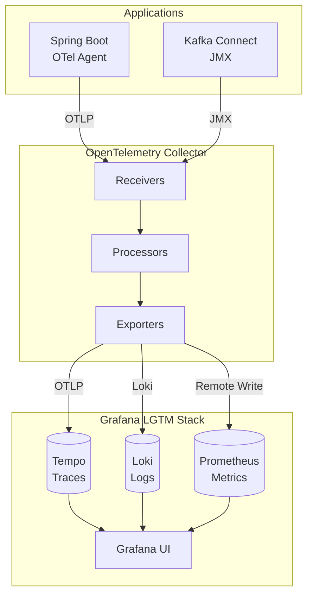

# PLAN-019: Grafana LGTM Infrastructure

## Objective

Deploy the complete Grafana LGTM stack (Grafana + Loki + Tempo + Prometheus) in Docker Compose with OpenTelemetry Collector as the unified ingestion layer.

## Parent Feature

[FEATURE-002](../features/FEATURE-002.md) - Section 2.5.1: Grafana LGTM Infrastructure Setup

## Dependencies

- PLAN-009: Observability Infrastructure (extends existing OTel/Prometheus setup)

## Changes

### Files to Create/Modify

| File | Purpose |
|------|---------|
| `docker-compose.yml` | Add Grafana, Tempo, Loki services |
| `docker/grafana/provisioning/datasources/datasources.yml` | Auto-configure data sources |
| `docker/grafana/provisioning/dashboards/dashboards.yml` | Dashboard provisioning |
| `docker/tempo/tempo.yaml` | Tempo configuration |
| `docker/loki/loki.yaml` | Loki configuration |
| `docker/otel/otel-collector-config.yaml` | Update for LGTM export |

### LGTM Architecture



### docker-compose.yml Additions

```yaml
services:
  # ... existing services ...

  grafana:
    image: grafana/grafana:11.0.0
    container_name: cdc-grafana
    ports:
      - "3000:3000"
    environment:
      GF_SECURITY_ADMIN_USER: admin
      GF_SECURITY_ADMIN_PASSWORD: admin
      GF_AUTH_ANONYMOUS_ENABLED: "true"
      GF_AUTH_ANONYMOUS_ORG_ROLE: Viewer
      GF_FEATURE_TOGGLES_ENABLE: traceqlEditor tempoSearch tempoBackendSearch
    volumes:
      - ./docker/grafana/provisioning:/etc/grafana/provisioning:ro
      - grafana_data:/var/lib/grafana
    depends_on:
      - prometheus
      - tempo
      - loki
    healthcheck:
      test: ["CMD-SHELL", "wget --no-verbose --tries=1 --spider http://localhost:3000/api/health || exit 1"]
      interval: 10s
      timeout: 5s
      retries: 5
      start_period: 30s

  tempo:
    image: grafana/tempo:2.4.1
    container_name: cdc-tempo
    command: ["-config.file=/etc/tempo/tempo.yaml"]
    ports:
      - "3200:3200"   # Tempo HTTP
      - "4317"        # OTLP gRPC (internal)
      - "4318"        # OTLP HTTP (internal)
    volumes:
      - ./docker/tempo/tempo.yaml:/etc/tempo/tempo.yaml:ro
      - tempo_data:/var/tempo
    healthcheck:
      test: ["CMD", "wget", "--no-verbose", "--tries=1", "--spider", "http://localhost:3200/ready"]
      interval: 10s
      timeout: 5s
      retries: 5
      start_period: 30s

  loki:
    image: grafana/loki:2.9.6
    container_name: cdc-loki
    command: ["-config.file=/etc/loki/loki.yaml"]
    ports:
      - "3100:3100"
    volumes:
      - ./docker/loki/loki.yaml:/etc/loki/loki.yaml:ro
      - loki_data:/var/loki
    healthcheck:
      test: ["CMD-SHELL", "wget --no-verbose --tries=1 --spider http://localhost:3100/ready || exit 1"]
      interval: 10s
      timeout: 5s
      retries: 5
      start_period: 30s

volumes:
  grafana_data:
  tempo_data:
  loki_data:
```

### Tempo Configuration (tempo.yaml)

```yaml
server:
  http_listen_port: 3200

distributor:
  receivers:
    otlp:
      protocols:
        grpc:
          endpoint: 0.0.0.0:4317
        http:
          endpoint: 0.0.0.0:4318

ingester:
  max_block_duration: 5m

compactor:
  compaction:
    block_retention: 48h

storage:
  trace:
    backend: local
    local:
      path: /var/tempo/traces
    wal:
      path: /var/tempo/wal

querier:
  frontend_worker:
    frontend_address: localhost:9095

metrics_generator:
  registry:
    external_labels:
      source: tempo
  storage:
    path: /var/tempo/generator/wal
    remote_write:
      - url: http://prometheus:9090/api/v1/write
        send_exemplars: true

overrides:
  defaults:
    metrics_generator:
      processors: [service-graphs, span-metrics]
```

### Loki Configuration (loki.yaml)

```yaml
auth_enabled: false

server:
  http_listen_port: 3100
  grpc_listen_port: 9096

common:
  instance_addr: 127.0.0.1
  path_prefix: /var/loki
  storage:
    filesystem:
      chunks_directory: /var/loki/chunks
      rules_directory: /var/loki/rules
  replication_factor: 1
  ring:
    kvstore:
      store: inmemory

query_range:
  results_cache:
    cache:
      embedded_cache:
        enabled: true
        max_size_mb: 100

schema_config:
  configs:
    - from: 2020-10-24
      store: tsdb
      object_store: filesystem
      schema: v13
      index:
        prefix: index_
        period: 24h

ruler:
  alertmanager_url: http://localhost:9093

limits_config:
  reject_old_samples: true
  reject_old_samples_max_age: 168h
  ingestion_rate_mb: 16
  ingestion_burst_size_mb: 24

analytics:
  reporting_enabled: false
```

### Grafana Data Sources (datasources.yml)

```yaml
apiVersion: 1

datasources:
  - name: Prometheus
    type: prometheus
    uid: prometheus
    access: proxy
    url: http://prometheus:9090
    isDefault: true
    jsonData:
      httpMethod: POST
      manageAlerts: true
      prometheusType: Prometheus

  - name: Tempo
    type: tempo
    uid: tempo
    access: proxy
    url: http://tempo:3200
    jsonData:
      httpMethod: GET
      tracesToLogsV2:
        datasourceUid: loki
        spanStartTimeShift: '-1h'
        spanEndTimeShift: '1h'
        tags: [{ key: 'service.name', value: 'service_name' }]
        filterByTraceID: true
        filterBySpanID: true
      tracesToMetrics:
        datasourceUid: prometheus
        spanStartTimeShift: '-1h'
        spanEndTimeShift: '1h'
        tags: [{ key: 'service.name', value: 'service_name' }]
      serviceMap:
        datasourceUid: prometheus
      nodeGraph:
        enabled: true
      lokiSearch:
        datasourceUid: loki

  - name: Loki
    type: loki
    uid: loki
    access: proxy
    url: http://loki:3100
    jsonData:
      derivedFields:
        - name: TraceID
          matcherRegex: '"trace_id":"([a-f0-9]+)"'
          url: '$${__value.raw}'
          datasourceUid: tempo
          urlDisplayLabel: 'View Trace'
```

### Dashboard Provisioning (dashboards.yml)

```yaml
apiVersion: 1

providers:
  - name: 'CDC Dashboards'
    orgId: 1
    folder: 'CDC'
    folderUid: 'cdc-dashboards'
    type: file
    disableDeletion: false
    updateIntervalSeconds: 30
    options:
      path: /etc/grafana/provisioning/dashboards/json
```

### Updated OTel Collector Config

```yaml
receivers:
  otlp:
    protocols:
      grpc:
        endpoint: 0.0.0.0:4317
      http:
        endpoint: 0.0.0.0:4318

  prometheus:
    config:
      scrape_configs:
        - job_name: 'otel-collector'
          static_configs:
            - targets: ['localhost:8888']

processors:
  batch:
    timeout: 1s
    send_batch_size: 1024

  resource:
    attributes:
      - key: service.instance.id
        from_attribute: host.name
        action: upsert

  attributes:
    actions:
      - key: environment
        value: local
        action: upsert

exporters:
  otlp/tempo:
    endpoint: tempo:4317
    tls:
      insecure: true

  loki:
    endpoint: http://loki:3100/loki/api/v1/push
    labels:
      attributes:
        service.name: service_name
        level: level
      resource:
        service.namespace: namespace

  prometheusremotewrite:
    endpoint: http://prometheus:9090/api/v1/write
    tls:
      insecure: true

  debug:
    verbosity: detailed

service:
  pipelines:
    traces:
      receivers: [otlp]
      processors: [batch, resource, attributes]
      exporters: [otlp/tempo]

    metrics:
      receivers: [otlp, prometheus]
      processors: [batch, resource]
      exporters: [prometheusremotewrite]

    logs:
      receivers: [otlp]
      processors: [batch, resource, attributes]
      exporters: [loki]

  telemetry:
    logs:
      level: info
    metrics:
      address: 0.0.0.0:8888
```

## Directory Structure

```
docker/
├── grafana/
│   └── provisioning/
│       ├── datasources/
│       │   └── datasources.yml
│       └── dashboards/
│           ├── dashboards.yml
│           └── json/
│               └── (dashboard JSON files - PLAN-020)
├── tempo/
│   └── tempo.yaml
├── loki/
│   └── loki.yaml
└── otel/
    └── otel-collector-config.yaml
```

## Commands to Run

```bash
# Create directory structure
mkdir -p docker/grafana/provisioning/datasources
mkdir -p docker/grafana/provisioning/dashboards/json
mkdir -p docker/tempo
mkdir -p docker/loki

# Start LGTM stack
docker compose up -d prometheus tempo loki grafana otel-collector

# Wait for services to be healthy
docker compose ps

# Verify Grafana is accessible
curl http://localhost:3000/api/health

# Verify Tempo is ready
curl http://localhost:3200/ready

# Verify Loki is ready
curl http://localhost:3100/ready

# Open Grafana in browser
open http://localhost:3000
# Login: admin/admin

# Verify data sources in Grafana
curl -u admin:admin http://localhost:3000/api/datasources

# Test trace ingestion
curl -X POST http://localhost:4318/v1/traces \
  -H "Content-Type: application/json" \
  -d '{
    "resourceSpans": [{
      "resource": {"attributes": [{"key": "service.name", "value": {"stringValue": "test-service"}}]},
      "scopeSpans": [{
        "spans": [{
          "traceId": "5B8EFFF798038103D269B633813FC60C",
          "spanId": "EEE19B7EC3C1B174",
          "name": "test-span",
          "startTimeUnixNano": "'$(date +%s)000000000'",
          "endTimeUnixNano": "'$(date +%s)100000000'"
        }]
      }]
    }]
  }'

# Check trace in Tempo via Grafana Explore

# Test log ingestion
curl -X POST http://localhost:3100/loki/api/v1/push \
  -H "Content-Type: application/json" \
  -d '{
    "streams": [{
      "stream": {"service_name": "test-service", "level": "info"},
      "values": [["'$(date +%s)000000000'", "Test log message from curl"]]
    }]
  }'

# Check logs in Loki via Grafana Explore
```

## Acceptance Criteria

```gherkin
Feature: Grafana LGTM Infrastructure
  As a developer
  I want a complete observability stack
  So that I can monitor traces, metrics, and logs in one place

  Scenario: All LGTM services start successfully
    When I run "docker compose up -d grafana tempo loki"
    Then all containers should be running
    And all health checks should pass

  Scenario: Grafana is accessible with pre-configured data sources
    Given the LGTM stack is running
    When I open Grafana at http://localhost:3000
    Then I should see the login page
    And after logging in, I should see 3 data sources configured

  Scenario: Prometheus data source is working
    Given Grafana is running with Prometheus data source
    When I query "up" in Explore
    Then I should see metrics results

  Scenario: Tempo data source is working
    Given Grafana is running with Tempo data source
    When I search for traces in Explore
    Then I should see the Tempo query interface
    And TraceQL should be available

  Scenario: Loki data source is working
    Given Grafana is running with Loki data source
    When I query "{service_name=~\".+\"}" in Explore
    Then I should see log results (if any logs exist)
    And LogQL should be available

  Scenario: Traces link to logs
    Given a trace exists in Tempo
    And related logs exist in Loki
    When I view the trace in Grafana
    Then I should see a "Logs for this span" link
    And clicking it should navigate to Loki with the trace_id filter

  Scenario: OTel Collector exports to all backends
    Given the OTel Collector is configured for LGTM
    When the Spring Boot app sends telemetry
    Then traces should appear in Tempo
    And metrics should appear in Prometheus
    And logs should appear in Loki
```

## Estimated Complexity

Medium - Multiple services to configure with proper networking and data source connections.

## Notes

- Tempo uses local filesystem storage - suitable for development only
- Loki uses embedded TSDB - suitable for development only
- For production, consider using object storage (S3, GCS) for Tempo and Loki
- Grafana feature toggles enable TraceQL editor and Tempo search
- Data source UIDs must match for cross-linking (traces to logs, traces to metrics)
- OTel Collector is the single ingestion point for all telemetry
- Consider memory limits for Tempo and Loki in production
