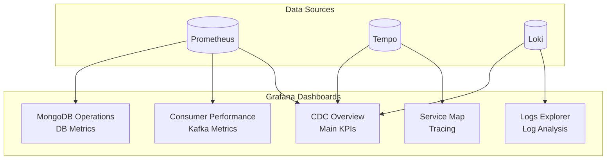
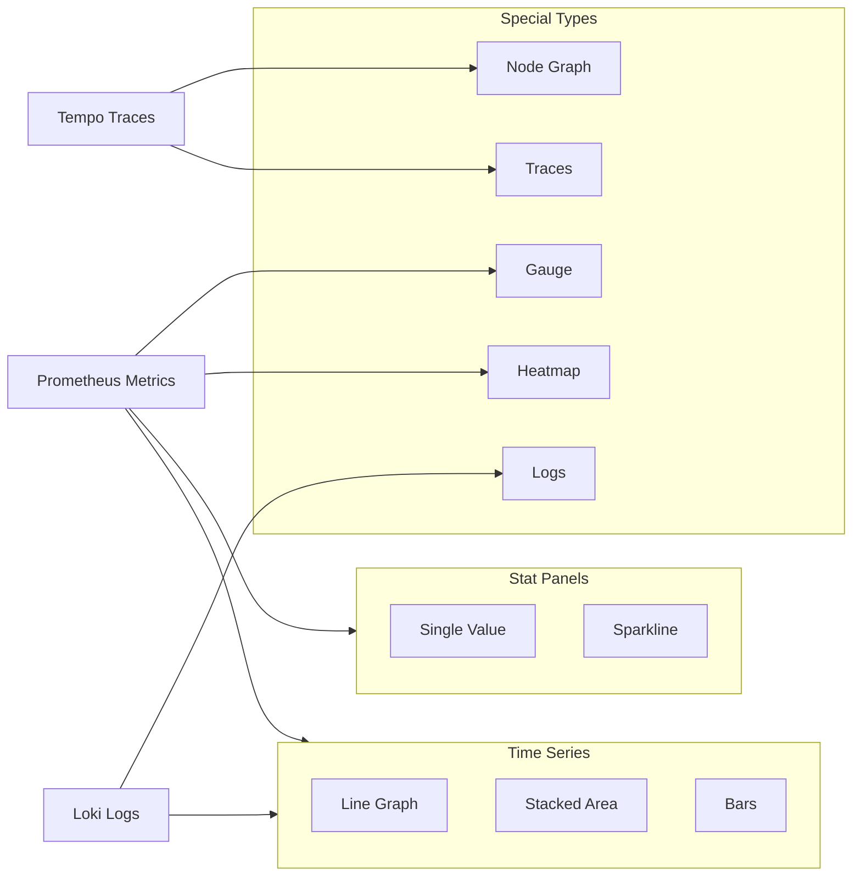

# PLAN-020: Grafana Dashboards

## Objective

Create comprehensive Grafana dashboards for monitoring the CDC pipeline, including CDC throughput, consumer performance, MongoDB operations, and system health.

## Parent Feature

[FEATURE-002](../features/FEATURE-002.md) - Section 2.5.2-2.5.6: Grafana Dashboards

## Dependencies

- PLAN-019: Grafana LGTM Infrastructure

## Changes

### Files to Create/Modify

| File | Purpose |
|------|---------|
| `docker/grafana/provisioning/dashboards/json/cdc-overview.json` | Main CDC overview dashboard |
| `docker/grafana/provisioning/dashboards/json/consumer-performance.json` | Kafka consumer metrics |
| `docker/grafana/provisioning/dashboards/json/mongodb-operations.json` | MongoDB performance dashboard |
| `docker/grafana/provisioning/dashboards/json/service-map.json` | Distributed tracing service map |
| `docker/grafana/provisioning/dashboards/json/logs-explorer.json` | Centralized logs dashboard |

### Dashboard Architecture



### CDC Overview Dashboard (cdc-overview.json)

```json
{
  "annotations": {
    "list": [
      {
        "datasource": { "type": "loki", "uid": "loki" },
        "enable": true,
        "expr": "{service_name=\"cdc-debezium\"} |~ \"ERROR|WARN\"",
        "iconColor": "red",
        "name": "Error Annotations"
      }
    ]
  },
  "dashboard": {
    "title": "CDC Pipeline Overview",
    "uid": "cdc-overview",
    "tags": ["cdc", "overview"],
    "timezone": "browser",
    "refresh": "10s",
    "panels": [
      {
        "id": 1,
        "title": "Events Processed (Rate)",
        "type": "stat",
        "gridPos": { "x": 0, "y": 0, "w": 6, "h": 4 },
        "targets": [
          {
            "expr": "sum(rate(cdc_events_processed_total[5m]))",
            "legendFormat": "events/sec"
          }
        ],
        "fieldConfig": {
          "defaults": {
            "unit": "ops",
            "thresholds": {
              "mode": "absolute",
              "steps": [
                { "color": "green", "value": null },
                { "color": "yellow", "value": 100 },
                { "color": "red", "value": 500 }
              ]
            }
          }
        }
      },
      {
        "id": 2,
        "title": "Consumer Lag",
        "type": "gauge",
        "gridPos": { "x": 6, "y": 0, "w": 6, "h": 4 },
        "targets": [
          {
            "expr": "sum(kafka_consumer_records_lag_max)",
            "legendFormat": "lag"
          }
        ],
        "fieldConfig": {
          "defaults": {
            "unit": "short",
            "min": 0,
            "max": 10000,
            "thresholds": {
              "mode": "absolute",
              "steps": [
                { "color": "green", "value": 0 },
                { "color": "yellow", "value": 1000 },
                { "color": "red", "value": 5000 }
              ]
            }
          }
        }
      },
      {
        "id": 3,
        "title": "Processing Errors",
        "type": "stat",
        "gridPos": { "x": 12, "y": 0, "w": 6, "h": 4 },
        "targets": [
          {
            "expr": "sum(rate(cdc_events_failed_total[5m]))",
            "legendFormat": "errors/sec"
          }
        ],
        "fieldConfig": {
          "defaults": {
            "unit": "ops",
            "thresholds": {
              "mode": "absolute",
              "steps": [
                { "color": "green", "value": null },
                { "color": "yellow", "value": 1 },
                { "color": "red", "value": 10 }
              ]
            }
          }
        }
      },
      {
        "id": 4,
        "title": "MongoDB Write Latency",
        "type": "stat",
        "gridPos": { "x": 18, "y": 0, "w": 6, "h": 4 },
        "targets": [
          {
            "expr": "histogram_quantile(0.99, sum(rate(cdc_mongodb_operation_duration_seconds_bucket[5m])) by (le))",
            "legendFormat": "p99"
          }
        ],
        "fieldConfig": {
          "defaults": {
            "unit": "s",
            "thresholds": {
              "mode": "absolute",
              "steps": [
                { "color": "green", "value": null },
                { "color": "yellow", "value": 0.1 },
                { "color": "red", "value": 0.5 }
              ]
            }
          }
        }
      },
      {
        "id": 5,
        "title": "Events by Entity Type",
        "type": "timeseries",
        "gridPos": { "x": 0, "y": 4, "w": 12, "h": 8 },
        "targets": [
          {
            "expr": "sum(rate(cdc_events_processed_total[5m])) by (entity_type)",
            "legendFormat": "{{entity_type}}"
          }
        ],
        "fieldConfig": {
          "defaults": {
            "unit": "ops",
            "custom": {
              "drawStyle": "line",
              "lineInterpolation": "smooth",
              "fillOpacity": 20
            }
          }
        }
      },
      {
        "id": 6,
        "title": "Event Operations Distribution",
        "type": "piechart",
        "gridPos": { "x": 12, "y": 4, "w": 6, "h": 8 },
        "targets": [
          {
            "expr": "sum(increase(cdc_events_processed_total[1h])) by (operation)",
            "legendFormat": "{{operation}}"
          }
        ]
      },
      {
        "id": 7,
        "title": "Processing Latency Distribution",
        "type": "heatmap",
        "gridPos": { "x": 18, "y": 4, "w": 6, "h": 8 },
        "targets": [
          {
            "expr": "sum(rate(cdc_event_processing_duration_seconds_bucket[5m])) by (le)",
            "format": "heatmap",
            "legendFormat": "{{le}}"
          }
        ]
      },
      {
        "id": 8,
        "title": "End-to-End Latency (CDC Pipeline)",
        "type": "timeseries",
        "gridPos": { "x": 0, "y": 12, "w": 24, "h": 6 },
        "targets": [
          {
            "expr": "histogram_quantile(0.50, sum(rate(cdc_end_to_end_latency_seconds_bucket[5m])) by (le))",
            "legendFormat": "p50"
          },
          {
            "expr": "histogram_quantile(0.95, sum(rate(cdc_end_to_end_latency_seconds_bucket[5m])) by (le))",
            "legendFormat": "p95"
          },
          {
            "expr": "histogram_quantile(0.99, sum(rate(cdc_end_to_end_latency_seconds_bucket[5m])) by (le))",
            "legendFormat": "p99"
          }
        ],
        "fieldConfig": {
          "defaults": {
            "unit": "s"
          }
        }
      },
      {
        "id": 9,
        "title": "Recent Traces",
        "type": "table",
        "gridPos": { "x": 0, "y": 18, "w": 24, "h": 6 },
        "datasource": { "type": "tempo", "uid": "tempo" },
        "targets": [
          {
            "queryType": "search",
            "limit": 20,
            "filters": [
              { "id": "service-name", "operator": "=", "value": ["cdc-debezium"] }
            ]
          }
        ]
      }
    ],
    "templating": {
      "list": [
        {
          "name": "entity_type",
          "type": "query",
          "datasource": { "type": "prometheus", "uid": "prometheus" },
          "query": "label_values(cdc_events_processed_total, entity_type)",
          "includeAll": true,
          "multi": true
        }
      ]
    }
  }
}
```

### Consumer Performance Dashboard (consumer-performance.json)

```json
{
  "dashboard": {
    "title": "Kafka Consumer Performance",
    "uid": "consumer-perf",
    "tags": ["cdc", "kafka", "consumer"],
    "refresh": "10s",
    "panels": [
      {
        "id": 1,
        "title": "Consumer Group Lag by Partition",
        "type": "timeseries",
        "gridPos": { "x": 0, "y": 0, "w": 12, "h": 8 },
        "targets": [
          {
            "expr": "kafka_consumer_records_lag{topic=~\"cdc\\\\..*\"}",
            "legendFormat": "{{topic}} - p{{partition}}"
          }
        ]
      },
      {
        "id": 2,
        "title": "Records Consumed Rate",
        "type": "timeseries",
        "gridPos": { "x": 12, "y": 0, "w": 12, "h": 8 },
        "targets": [
          {
            "expr": "sum(rate(kafka_consumer_records_consumed_total[5m])) by (topic)",
            "legendFormat": "{{topic}}"
          }
        ]
      },
      {
        "id": 3,
        "title": "Fetch Latency",
        "type": "timeseries",
        "gridPos": { "x": 0, "y": 8, "w": 8, "h": 6 },
        "targets": [
          {
            "expr": "kafka_consumer_fetch_latency_avg",
            "legendFormat": "avg"
          },
          {
            "expr": "kafka_consumer_fetch_latency_max",
            "legendFormat": "max"
          }
        ],
        "fieldConfig": {
          "defaults": { "unit": "ms" }
        }
      },
      {
        "id": 4,
        "title": "Bytes Consumed",
        "type": "timeseries",
        "gridPos": { "x": 8, "y": 8, "w": 8, "h": 6 },
        "targets": [
          {
            "expr": "sum(rate(kafka_consumer_bytes_consumed_total[5m]))",
            "legendFormat": "bytes/sec"
          }
        ],
        "fieldConfig": {
          "defaults": { "unit": "Bps" }
        }
      },
      {
        "id": 5,
        "title": "Commit Rate",
        "type": "timeseries",
        "gridPos": { "x": 16, "y": 8, "w": 8, "h": 6 },
        "targets": [
          {
            "expr": "sum(rate(kafka_consumer_commit_total[5m]))",
            "legendFormat": "commits/sec"
          }
        ]
      },
      {
        "id": 6,
        "title": "Rebalance Events",
        "type": "stat",
        "gridPos": { "x": 0, "y": 14, "w": 6, "h": 4 },
        "targets": [
          {
            "expr": "sum(increase(kafka_consumer_rebalance_total[1h]))",
            "legendFormat": "rebalances"
          }
        ]
      },
      {
        "id": 7,
        "title": "Assigned Partitions",
        "type": "stat",
        "gridPos": { "x": 6, "y": 14, "w": 6, "h": 4 },
        "targets": [
          {
            "expr": "sum(kafka_consumer_assigned_partitions)",
            "legendFormat": "partitions"
          }
        ]
      },
      {
        "id": 8,
        "title": "Poll Rate",
        "type": "timeseries",
        "gridPos": { "x": 12, "y": 14, "w": 12, "h": 4 },
        "targets": [
          {
            "expr": "rate(kafka_consumer_poll_total[5m])",
            "legendFormat": "polls/sec"
          }
        ]
      }
    ]
  }
}
```

### MongoDB Operations Dashboard (mongodb-operations.json)

```json
{
  "dashboard": {
    "title": "MongoDB Operations",
    "uid": "mongodb-ops",
    "tags": ["cdc", "mongodb"],
    "refresh": "10s",
    "panels": [
      {
        "id": 1,
        "title": "Operations by Type",
        "type": "timeseries",
        "gridPos": { "x": 0, "y": 0, "w": 12, "h": 8 },
        "targets": [
          {
            "expr": "sum(rate(cdc_mongodb_operation_duration_seconds_count[5m])) by (operation)",
            "legendFormat": "{{operation}}"
          }
        ],
        "fieldConfig": {
          "defaults": { "unit": "ops" }
        }
      },
      {
        "id": 2,
        "title": "Operation Latency (p99)",
        "type": "timeseries",
        "gridPos": { "x": 12, "y": 0, "w": 12, "h": 8 },
        "targets": [
          {
            "expr": "histogram_quantile(0.99, sum(rate(cdc_mongodb_operation_duration_seconds_bucket[5m])) by (le, operation))",
            "legendFormat": "{{operation}} p99"
          }
        ],
        "fieldConfig": {
          "defaults": { "unit": "s" }
        }
      },
      {
        "id": 3,
        "title": "Documents by Collection",
        "type": "bargauge",
        "gridPos": { "x": 0, "y": 8, "w": 8, "h": 6 },
        "targets": [
          {
            "expr": "sum(cdc_mongodb_documents_total) by (collection)",
            "legendFormat": "{{collection}}"
          }
        ]
      },
      {
        "id": 4,
        "title": "Upsert Success Rate",
        "type": "gauge",
        "gridPos": { "x": 8, "y": 8, "w": 8, "h": 6 },
        "targets": [
          {
            "expr": "sum(rate(cdc_mongodb_operation_duration_seconds_count{operation=\"upsert\"}[5m])) / (sum(rate(cdc_mongodb_operation_duration_seconds_count{operation=\"upsert\"}[5m])) + sum(rate(cdc_mongodb_errors_total{operation=\"upsert\"}[5m])))",
            "legendFormat": "success rate"
          }
        ],
        "fieldConfig": {
          "defaults": {
            "unit": "percentunit",
            "min": 0,
            "max": 1,
            "thresholds": {
              "mode": "absolute",
              "steps": [
                { "color": "red", "value": 0 },
                { "color": "yellow", "value": 0.95 },
                { "color": "green", "value": 0.99 }
              ]
            }
          }
        }
      },
      {
        "id": 5,
        "title": "Connection Pool",
        "type": "timeseries",
        "gridPos": { "x": 16, "y": 8, "w": 8, "h": 6 },
        "targets": [
          {
            "expr": "mongodb_connection_pool_size",
            "legendFormat": "pool size"
          },
          {
            "expr": "mongodb_connection_pool_checked_out",
            "legendFormat": "checked out"
          },
          {
            "expr": "mongodb_connection_pool_available",
            "legendFormat": "available"
          }
        ]
      },
      {
        "id": 6,
        "title": "Idempotent Skips (Out-of-Order Events)",
        "type": "timeseries",
        "gridPos": { "x": 0, "y": 14, "w": 12, "h": 6 },
        "targets": [
          {
            "expr": "sum(rate(cdc_mongodb_idempotent_skip_total[5m])) by (collection)",
            "legendFormat": "{{collection}}"
          }
        ]
      },
      {
        "id": 7,
        "title": "Error Rate",
        "type": "timeseries",
        "gridPos": { "x": 12, "y": 14, "w": 12, "h": 6 },
        "targets": [
          {
            "expr": "sum(rate(cdc_mongodb_errors_total[5m])) by (collection, error_type)",
            "legendFormat": "{{collection}} - {{error_type}}"
          }
        ]
      }
    ]
  }
}
```

### Service Map Dashboard (service-map.json)

```json
{
  "dashboard": {
    "title": "Service Map & Traces",
    "uid": "service-map",
    "tags": ["cdc", "tracing", "tempo"],
    "refresh": "30s",
    "panels": [
      {
        "id": 1,
        "title": "Service Dependency Graph",
        "type": "nodeGraph",
        "gridPos": { "x": 0, "y": 0, "w": 24, "h": 12 },
        "datasource": { "type": "tempo", "uid": "tempo" },
        "targets": [
          {
            "queryType": "serviceMap"
          }
        ]
      },
      {
        "id": 2,
        "title": "Trace Search",
        "type": "traces",
        "gridPos": { "x": 0, "y": 12, "w": 24, "h": 8 },
        "datasource": { "type": "tempo", "uid": "tempo" },
        "targets": [
          {
            "queryType": "traceql",
            "query": "{resource.service.name=\"cdc-debezium\"}"
          }
        ]
      },
      {
        "id": 3,
        "title": "Span Duration Histogram",
        "type": "histogram",
        "gridPos": { "x": 0, "y": 20, "w": 12, "h": 6 },
        "targets": [
          {
            "expr": "histogram_quantile(0.95, sum(rate(traces_spanmetrics_latency_bucket{service=\"cdc-debezium\"}[5m])) by (le, span_name))",
            "legendFormat": "{{span_name}}"
          }
        ]
      },
      {
        "id": 4,
        "title": "Error Traces",
        "type": "table",
        "gridPos": { "x": 12, "y": 20, "w": 12, "h": 6 },
        "datasource": { "type": "tempo", "uid": "tempo" },
        "targets": [
          {
            "queryType": "traceql",
            "query": "{resource.service.name=\"cdc-debezium\" && status=error}",
            "limit": 10
          }
        ]
      }
    ]
  }
}
```

### Logs Explorer Dashboard (logs-explorer.json)

```json
{
  "dashboard": {
    "title": "Logs Explorer",
    "uid": "logs-explorer",
    "tags": ["cdc", "logs", "loki"],
    "refresh": "10s",
    "panels": [
      {
        "id": 1,
        "title": "Log Volume by Level",
        "type": "timeseries",
        "gridPos": { "x": 0, "y": 0, "w": 24, "h": 6 },
        "datasource": { "type": "loki", "uid": "loki" },
        "targets": [
          {
            "expr": "sum(count_over_time({service_name=\"cdc-debezium\"}[1m])) by (level)",
            "legendFormat": "{{level}}"
          }
        ],
        "fieldConfig": {
          "defaults": {
            "custom": {
              "drawStyle": "bars",
              "stacking": { "mode": "normal" }
            }
          },
          "overrides": [
            { "matcher": { "id": "byName", "options": "error" }, "properties": [{ "id": "color", "value": { "fixedColor": "red", "mode": "fixed" } }] },
            { "matcher": { "id": "byName", "options": "warn" }, "properties": [{ "id": "color", "value": { "fixedColor": "yellow", "mode": "fixed" } }] },
            { "matcher": { "id": "byName", "options": "info" }, "properties": [{ "id": "color", "value": { "fixedColor": "green", "mode": "fixed" } }] }
          ]
        }
      },
      {
        "id": 2,
        "title": "Application Logs",
        "type": "logs",
        "gridPos": { "x": 0, "y": 6, "w": 24, "h": 12 },
        "datasource": { "type": "loki", "uid": "loki" },
        "targets": [
          {
            "expr": "{service_name=\"cdc-debezium\"} | json | line_format \"{{.timestamp}} [{{.level}}] {{.logger}} - {{.message}}\"",
            "legendFormat": ""
          }
        ],
        "options": {
          "showTime": true,
          "showLabels": true,
          "wrapLogMessage": true,
          "prettifyLogMessage": true,
          "enableLogDetails": true
        }
      },
      {
        "id": 3,
        "title": "Error Logs with Trace Links",
        "type": "logs",
        "gridPos": { "x": 0, "y": 18, "w": 24, "h": 8 },
        "datasource": { "type": "loki", "uid": "loki" },
        "targets": [
          {
            "expr": "{service_name=\"cdc-debezium\"} |= \"ERROR\" | json",
            "legendFormat": ""
          }
        ],
        "options": {
          "showTime": true,
          "enableLogDetails": true
        }
      }
    ],
    "templating": {
      "list": [
        {
          "name": "level",
          "type": "custom",
          "options": [
            { "text": "All", "value": "" },
            { "text": "Error", "value": "error" },
            { "text": "Warn", "value": "warn" },
            { "text": "Info", "value": "info" },
            { "text": "Debug", "value": "debug" }
          ],
          "current": { "text": "All", "value": "" }
        },
        {
          "name": "search",
          "type": "textbox",
          "label": "Search"
        }
      ]
    }
  }
}
```

## Directory Structure

```
docker/grafana/provisioning/dashboards/
├── dashboards.yml
└── json/
    ├── cdc-overview.json
    ├── consumer-performance.json
    ├── mongodb-operations.json
    ├── service-map.json
    └── logs-explorer.json
```

## Commands to Run

```bash
# Create dashboard directory
mkdir -p docker/grafana/provisioning/dashboards/json

# Start Grafana with dashboards
docker compose up -d grafana

# Wait for Grafana to be ready
until curl -sf http://localhost:3000/api/health; do sleep 2; done

# List provisioned dashboards
curl -u admin:admin http://localhost:3000/api/search?type=dash-db

# Open specific dashboard
open "http://localhost:3000/d/cdc-overview/cdc-pipeline-overview"

# Verify dashboard loading
curl -u admin:admin http://localhost:3000/api/dashboards/uid/cdc-overview | jq '.dashboard.title'

# Export dashboard (for backup)
curl -u admin:admin http://localhost:3000/api/dashboards/uid/cdc-overview | jq '.dashboard' > backup-cdc-overview.json

# Test dashboard with sample data
# Generate some CDC events first
docker compose exec postgres psql -U postgres -c \
  "INSERT INTO customer (id, email, status) VALUES
   (gen_random_uuid(), 'dash-test@example.com', 'active');"

# Wait and check dashboard
sleep 5
open "http://localhost:3000/d/cdc-overview"
```

## Acceptance Criteria

```gherkin
Feature: Grafana Dashboards
  As a CDC pipeline operator
  I want comprehensive dashboards
  So that I can monitor pipeline health and performance

  Scenario: CDC Overview dashboard loads successfully
    Given Grafana is running
    When I navigate to the CDC Overview dashboard
    Then I should see the dashboard title "CDC Pipeline Overview"
    And I should see panels for events processed, consumer lag, and errors

  Scenario: Dashboard displays real-time CDC metrics
    Given the CDC pipeline is processing events
    When I view the CDC Overview dashboard
    Then the "Events Processed (Rate)" panel should show non-zero values
    And the metrics should update every 10 seconds

  Scenario: Consumer Performance dashboard shows Kafka metrics
    Given Kafka consumer is connected
    When I view the Consumer Performance dashboard
    Then I should see consumer lag by partition
    And I should see records consumed rate

  Scenario: MongoDB Operations dashboard shows write metrics
    Given MongoDB operations are occurring
    When I view the MongoDB Operations dashboard
    Then I should see operations by type (upsert, delete)
    And I should see operation latency percentiles

  Scenario: Service Map displays trace topology
    Given traces are being collected in Tempo
    When I view the Service Map dashboard
    Then I should see the service dependency graph
    And I should be able to search for traces

  Scenario: Logs Explorer shows application logs
    Given logs are being sent to Loki
    When I view the Logs Explorer dashboard
    Then I should see logs grouped by level
    And I should be able to filter by search term

  Scenario: Dashboard variables work correctly
    Given the CDC Overview dashboard is displayed
    When I select a specific entity_type from the variable dropdown
    Then the panels should filter to show only that entity type

  Scenario: Trace links work from logs
    Given a log entry exists with trace_id
    When I click on the trace_id link in Logs Explorer
    Then I should be navigated to the trace view in Tempo

  Scenario: Dashboard panels link to each other
    Given I am viewing the CDC Overview dashboard
    When I click on an error count panel
    Then I should be able to drill down to the Logs Explorer
    And the logs should be filtered to show errors

  Scenario: Dashboards persist across restarts
    Given dashboards are provisioned
    When I restart the Grafana container
    Then all dashboards should still be available
    And dashboard configurations should be unchanged
```

## Panel Types Reference



## Estimated Complexity

Medium - Multiple dashboards with various panel types and cross-data source linking.

## Notes

- Dashboards use UID for stable referencing
- Variables enable filtering across all panels
- Refresh interval set to 10s for near-real-time monitoring
- Error annotations overlay on time series panels
- Trace-to-logs and logs-to-trace linking configured via data source settings
- Consider adding alerting rules directly in dashboards (PLAN-021)
- Dashboard JSON can be exported/imported for versioning
- Production: Consider Grafana Organizations for multi-tenant setups
