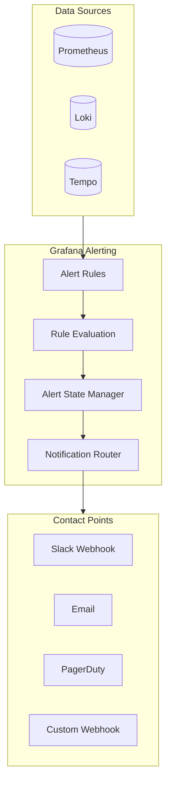
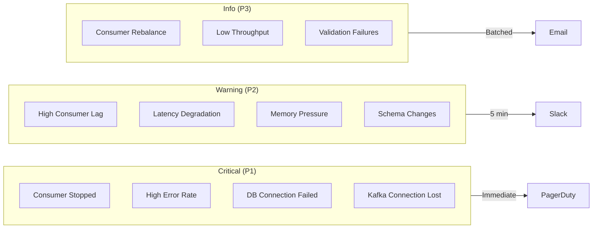
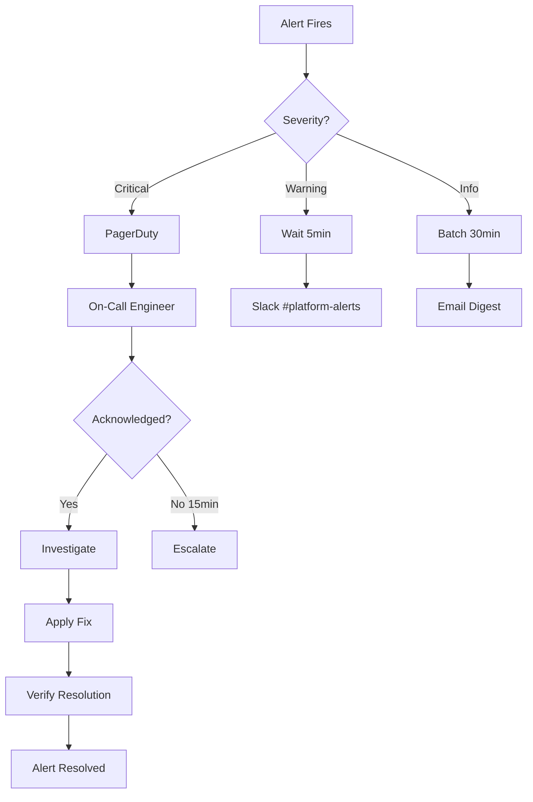

# PLAN-021: Grafana Alerting

## Objective

Configure Grafana alerting rules for critical CDC pipeline events, including consumer lag, processing errors, latency thresholds, and infrastructure health issues.

## Parent Feature

[FEATURE-002](../features/FEATURE-002.md) - Section 2.6: Grafana Alerting

## Dependencies

- PLAN-019: Grafana LGTM Infrastructure
- PLAN-020: Grafana Dashboards

## Changes

### Files to Create/Modify

| File | Purpose |
|------|---------|
| `docker/grafana/provisioning/alerting/alert-rules.yml` | Alert rule definitions |
| `docker/grafana/provisioning/alerting/contact-points.yml` | Notification destinations |
| `docker/grafana/provisioning/alerting/notification-policies.yml` | Alert routing rules |
| `docker/grafana/provisioning/alerting/mute-timings.yml` | Maintenance windows |
| `docker-compose.yml` | Mount alerting provisioning |

### Alerting Architecture



### Alert Categories



### docker-compose.yml Updates

```yaml
services:
  grafana:
    volumes:
      - ./docker/grafana/provisioning:/etc/grafana/provisioning:ro
    environment:
      GF_UNIFIED_ALERTING_ENABLED: "true"
      GF_ALERTING_ENABLED: "false"  # Disable legacy alerting
      GF_UNIFIED_ALERTING_SCREENSHOTS_CAPTURE: "true"
```

### Alert Rules (alert-rules.yml)

```yaml
apiVersion: 1

groups:
  - orgId: 1
    name: CDC Critical Alerts
    folder: CDC Alerts
    interval: 30s
    rules:
      - uid: cdc-consumer-stopped
        title: CDC Consumer Stopped Processing
        condition: A
        data:
          - refId: A
            relativeTimeRange:
              from: 300
              to: 0
            datasourceUid: prometheus
            model:
              expr: |
                absent(rate(cdc_events_processed_total[5m])) == 1
                or
                sum(rate(cdc_events_processed_total[5m])) == 0
              intervalMs: 1000
              maxDataPoints: 43200
        noDataState: Alerting
        execErrState: Alerting
        for: 2m
        annotations:
          summary: CDC Consumer has stopped processing events
          description: |
            No CDC events have been processed in the last 5 minutes.
            Consumer may be down or disconnected from Kafka.
          runbook_url: https://wiki.example.com/runbooks/cdc-consumer-stopped
        labels:
          severity: critical
          team: platform

      - uid: cdc-high-error-rate
        title: High CDC Processing Error Rate
        condition: A
        data:
          - refId: A
            relativeTimeRange:
              from: 300
              to: 0
            datasourceUid: prometheus
            model:
              expr: |
                (
                  sum(rate(cdc_events_failed_total[5m]))
                  /
                  sum(rate(cdc_events_processed_total[5m]))
                ) > 0.05
              intervalMs: 1000
              maxDataPoints: 43200
        noDataState: OK
        execErrState: Alerting
        for: 2m
        annotations:
          summary: CDC error rate exceeds 5%
          description: |
            {{ $value | printf "%.2f" }}% of CDC events are failing.
            Check application logs for error details.
        labels:
          severity: critical
          team: platform

      - uid: cdc-mongodb-connection-failed
        title: MongoDB Connection Failed
        condition: A
        data:
          - refId: A
            relativeTimeRange:
              from: 60
              to: 0
            datasourceUid: prometheus
            model:
              expr: |
                mongodb_connection_pool_available == 0
                or
                absent(mongodb_connection_pool_available) == 1
        noDataState: Alerting
        execErrState: Alerting
        for: 1m
        annotations:
          summary: MongoDB connection pool exhausted or unavailable
          description: No available MongoDB connections. Database may be down.
        labels:
          severity: critical
          team: platform

      - uid: cdc-kafka-connection-lost
        title: Kafka Consumer Connection Lost
        condition: A
        data:
          - refId: A
            relativeTimeRange:
              from: 60
              to: 0
            datasourceUid: prometheus
            model:
              expr: |
                kafka_consumer_connection_count == 0
                or
                absent(kafka_consumer_connection_count) == 1
        noDataState: Alerting
        execErrState: Alerting
        for: 1m
        annotations:
          summary: Kafka consumer lost connection
          description: CDC consumer is not connected to Kafka broker.
        labels:
          severity: critical
          team: platform

  - orgId: 1
    name: CDC Warning Alerts
    folder: CDC Alerts
    interval: 60s
    rules:
      - uid: cdc-high-consumer-lag
        title: High Consumer Lag Detected
        condition: A
        data:
          - refId: A
            relativeTimeRange:
              from: 300
              to: 0
            datasourceUid: prometheus
            model:
              expr: |
                sum(kafka_consumer_records_lag_max) > 10000
        noDataState: OK
        execErrState: Alerting
        for: 5m
        annotations:
          summary: Kafka consumer lag exceeds 10,000 records
          description: |
            Consumer lag: {{ $value }} records.
            Pipeline may be falling behind on event processing.
        labels:
          severity: warning
          team: platform

      - uid: cdc-latency-degradation
        title: CDC Processing Latency Degradation
        condition: A
        data:
          - refId: A
            relativeTimeRange:
              from: 300
              to: 0
            datasourceUid: prometheus
            model:
              expr: |
                histogram_quantile(0.99,
                  sum(rate(cdc_end_to_end_latency_seconds_bucket[5m])) by (le)
                ) > 5
        noDataState: OK
        execErrState: Alerting
        for: 5m
        annotations:
          summary: CDC end-to-end latency p99 exceeds 5 seconds
          description: |
            Current p99 latency: {{ $value | printf "%.2f" }}s
            Check for slow MongoDB writes or backpressure.
        labels:
          severity: warning
          team: platform

      - uid: cdc-memory-pressure
        title: High Memory Usage
        condition: A
        data:
          - refId: A
            relativeTimeRange:
              from: 300
              to: 0
            datasourceUid: prometheus
            model:
              expr: |
                jvm_memory_used_bytes{area="heap"}
                /
                jvm_memory_max_bytes{area="heap"} > 0.85
        noDataState: OK
        execErrState: Alerting
        for: 5m
        annotations:
          summary: JVM heap usage exceeds 85%
          description: |
            Current heap usage: {{ $value | printf "%.0f" }}%
            Consider scaling or investigating memory leaks.
        labels:
          severity: warning
          team: platform

      - uid: cdc-schema-change-detected
        title: Schema Change Detected
        condition: A
        data:
          - refId: A
            relativeTimeRange:
              from: 300
              to: 0
            datasourceUid: prometheus
            model:
              expr: |
                increase(cdc_schema_changes_total[5m]) > 0
        noDataState: OK
        execErrState: OK
        for: 0m
        annotations:
          summary: Schema change detected in CDC pipeline
          description: |
            Entity: {{ $labels.entity_type }}
            Field: {{ $labels.field_name }}
            Review for compatibility issues.
        labels:
          severity: warning
          team: platform

  - orgId: 1
    name: CDC Info Alerts
    folder: CDC Alerts
    interval: 120s
    rules:
      - uid: cdc-consumer-rebalance
        title: Consumer Rebalance Occurred
        condition: A
        data:
          - refId: A
            relativeTimeRange:
              from: 300
              to: 0
            datasourceUid: prometheus
            model:
              expr: |
                increase(kafka_consumer_rebalance_total[5m]) > 0
        noDataState: OK
        execErrState: OK
        for: 0m
        annotations:
          summary: Kafka consumer group rebalanced
          description: |
            Rebalance events in last 5 minutes: {{ $value }}
            This is normal during scaling events.
        labels:
          severity: info
          team: platform

      - uid: cdc-low-throughput
        title: Low CDC Throughput
        condition: A
        data:
          - refId: A
            relativeTimeRange:
              from: 600
              to: 0
            datasourceUid: prometheus
            model:
              expr: |
                sum(rate(cdc_events_processed_total[10m])) < 1
                and
                sum(rate(cdc_events_processed_total[10m])) > 0
        noDataState: OK
        execErrState: OK
        for: 10m
        annotations:
          summary: CDC throughput below expected rate
          description: |
            Current rate: {{ $value | printf "%.2f" }} events/sec
            Verify source database activity.
        labels:
          severity: info
          team: platform

      - uid: cdc-validation-failures
        title: Validation Failures Detected
        condition: A
        data:
          - refId: A
            relativeTimeRange:
              from: 300
              to: 0
            datasourceUid: prometheus
            model:
              expr: |
                sum(rate(cdc_validation_failures_total[5m])) > 0
        noDataState: OK
        execErrState: OK
        for: 1m
        annotations:
          summary: CDC events failing validation
          description: |
            Rule: {{ $labels.rule }}
            Entity: {{ $labels.entity_type }}
            Check data quality at source.
        labels:
          severity: info
          team: platform
```

### Contact Points (contact-points.yml)

```yaml
apiVersion: 1

contactPoints:
  - orgId: 1
    name: slack-platform
    receivers:
      - uid: slack-platform-channel
        type: slack
        settings:
          url: "${SLACK_WEBHOOK_URL}"
          recipient: "#platform-alerts"
          title: |
            {{ if eq .Status "firing" }}🔥{{ else }}✅{{ end }} {{ .CommonAnnotations.summary }}
          text: |
            {{ range .Alerts }}
            *Alert:* {{ .Annotations.summary }}
            *Severity:* {{ .Labels.severity }}
            *Description:* {{ .Annotations.description }}
            {{ if .Annotations.runbook_url }}*Runbook:* {{ .Annotations.runbook_url }}{{ end }}
            {{ end }}
        disableResolveMessage: false

  - orgId: 1
    name: pagerduty-critical
    receivers:
      - uid: pagerduty-platform
        type: pagerduty
        settings:
          integrationKey: "${PAGERDUTY_INTEGRATION_KEY}"
          severity: critical
          class: CDC Pipeline
          component: Consumer
          group: Platform

  - orgId: 1
    name: email-digest
    receivers:
      - uid: email-platform
        type: email
        settings:
          addresses: platform-team@example.com
          singleEmail: true
          message: |
            Alert Summary:
            {{ range .Alerts }}
            - {{ .Annotations.summary }}
            {{ end }}

  - orgId: 1
    name: webhook-custom
    receivers:
      - uid: custom-webhook
        type: webhook
        settings:
          url: "http://alerting-service:8080/alerts"
          httpMethod: POST
          maxAlerts: 100
```

### Notification Policies (notification-policies.yml)

```yaml
apiVersion: 1

policies:
  - orgId: 1
    receiver: slack-platform
    group_by:
      - grafana_folder
      - alertname
    group_wait: 30s
    group_interval: 5m
    repeat_interval: 4h
    routes:
      # Critical alerts go to PagerDuty immediately
      - receiver: pagerduty-critical
        matchers:
          - severity = critical
        group_wait: 0s
        group_interval: 1m
        repeat_interval: 1h
        continue: true  # Also send to Slack

      # Critical also to Slack
      - receiver: slack-platform
        matchers:
          - severity = critical
        group_wait: 0s
        group_interval: 1m
        repeat_interval: 1h

      # Warnings to Slack with 5min delay
      - receiver: slack-platform
        matchers:
          - severity = warning
        group_wait: 5m
        group_interval: 10m
        repeat_interval: 4h

      # Info alerts batched to email
      - receiver: email-digest
        matchers:
          - severity = info
        group_wait: 30m
        group_interval: 1h
        repeat_interval: 24h
```

### Mute Timings (mute-timings.yml)

```yaml
apiVersion: 1

muteTimes:
  - orgId: 1
    name: maintenance-window
    time_intervals:
      - times:
          - start_time: "02:00"
            end_time: "04:00"
        weekdays: ["sunday"]
        location: America/New_York

  - orgId: 1
    name: business-hours-only
    time_intervals:
      - times:
          - start_time: "09:00"
            end_time: "18:00"
        weekdays: ["monday:friday"]
        location: America/New_York
```

## Directory Structure

```
docker/grafana/provisioning/
├── alerting/
│   ├── alert-rules.yml
│   ├── contact-points.yml
│   ├── notification-policies.yml
│   └── mute-timings.yml
├── dashboards/
│   └── ...
└── datasources/
    └── ...
```

## Commands to Run

```bash
# Create alerting directory
mkdir -p docker/grafana/provisioning/alerting

# Set environment variables for contact points
export SLACK_WEBHOOK_URL="https://hooks.slack.com/services/xxx"
export PAGERDUTY_INTEGRATION_KEY="your-key"

# Restart Grafana to load alerting config
docker compose restart grafana

# Wait for Grafana
until curl -sf http://localhost:3000/api/health; do sleep 2; done

# List alert rules via API
curl -u admin:admin http://localhost:3000/api/v1/provisioning/alert-rules | jq '.[].title'

# Check alert rule status
curl -u admin:admin http://localhost:3000/api/v1/provisioning/alert-rules | jq '.[] | {title: .title, state: .state}'

# List contact points
curl -u admin:admin http://localhost:3000/api/v1/provisioning/contact-points | jq '.[].name'

# Test contact point (Slack)
curl -u admin:admin -X POST \
  http://localhost:3000/api/v1/provisioning/contact-points/slack-platform/test

# View alert history
curl -u admin:admin "http://localhost:3000/api/v1/alertmanager/grafana/api/v2/alerts" | jq

# Trigger test alert manually (by creating bad data)
# Stop consumer to trigger "Consumer Stopped" alert
docker compose stop cdc-consumer

# Wait for alert to fire (2 minutes)
sleep 130

# Check firing alerts
curl -u admin:admin "http://localhost:3000/api/v1/alertmanager/grafana/api/v2/alerts?active=true" | jq

# Restart consumer
docker compose start cdc-consumer

# Verify alert resolved
sleep 60
curl -u admin:admin "http://localhost:3000/api/v1/alertmanager/grafana/api/v2/alerts?active=true" | jq
```

## Acceptance Criteria

- [ ] Alert rules are provisioned on startup (Critical, Warning, Info groups visible)
- [ ] Consumer stopped alert fires when processing stops for 2 minutes (critical severity)
- [ ] Consumer stopped alert resolves when processing resumes
- [ ] High error rate alert fires when >5% of events fail for 2 minutes
- [ ] High consumer lag alert fires when lag exceeds 10000 records for 5 minutes (warning)
- [ ] Critical alerts route to PagerDuty and Slack
- [ ] Warning alerts route to Slack only (after 5 minute delay)
- [ ] Info alerts are batched and sent as email digest
- [ ] Alerts are muted during configured maintenance windows
- [ ] Alert annotations include runbook links
- [ ] Schema change alerts fire immediately with entity_type and field_name

## Alert Response Flowchart



## Estimated Complexity

Medium - Multiple alert rules with routing logic and contact point configuration.

## Notes

- Unified Alerting (Grafana 9+) is used instead of legacy alerting
- Alert rules are provisioned from YAML files (GitOps friendly)
- Contact point credentials should be injected via environment variables
- Consider using Grafana OnCall for advanced on-call management
- Mute timings prevent alert fatigue during planned maintenance
- Alert grouping reduces notification noise
- Screenshots can be captured and attached to alerts (requires rendering service)
- For production, implement alert testing as part of CI/CD
- Consider SLO-based alerting for more sophisticated monitoring
