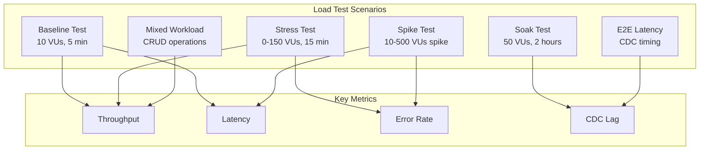

# PLAN-023: k6 Load Test Scenarios

## Objective

Implement comprehensive k6 load test scenarios covering baseline performance, stress testing, spike testing, soak testing, and end-to-end CDC latency measurement.

## Parent Feature

[FEATURE-002](../features/FEATURE-002.md) - Section 2.7.3-2.7.6: Load Test Scenarios

## Dependencies

- PLAN-022: k6 Load Testing Infrastructure

## Changes

### Files to Create/Modify

| File | Purpose |
|------|---------|
| `k6/scripts/baseline-test.js` | Baseline performance measurement |
| `k6/scripts/stress-test.js` | Stress testing with ramping VUs |
| `k6/scripts/spike-test.js` | Spike load testing |
| `k6/scripts/soak-test.js` | Long-duration stability test |
| `k6/scripts/e2e-latency-test.js` | End-to-end CDC latency measurement |
| `k6/scripts/mixed-workload-test.js` | Realistic mixed operation workload |

### Test Scenario Overview



### Baseline Test (baseline-test.js)

```javascript
// k6/scripts/baseline-test.js
import { sleep, check, group } from 'k6';
import { config, getScenarioConfig } from './lib/config.js';
import * as pg from './lib/postgres.js';
import * as mongo from './lib/mongodb.js';
import * as metrics from './lib/metrics.js';
import { uuidv4 } from 'https://jslib.k6.io/k6-utils/1.4.0/index.js';

export const options = {
  scenarios: {
    baseline: getScenarioConfig('baseline'),
  },
  thresholds: {
    'cdc_e2e_latency': ['p(95)<2000', 'p(99)<5000'],
    'pg_write_duration': ['p(95)<100'],
    'mongo_read_duration': ['p(95)<50'],
    'cdc_success_rate': ['rate>0.99'],
    'checks': ['rate>0.95'],
  },
};

export function setup() {
  console.log('Starting baseline performance test');
  pg.openConnection();
  mongo.openConnection();
  return { startTime: Date.now() };
}

export default function () {
  const customerId = uuidv4();
  const startTime = Date.now();

  group('Create Customer', function () {
    const customer = {
      id: customerId,
      email: `baseline-${customerId}@loadtest.com`,
      status: 'active',
    };

    const writeResult = pg.insertCustomer(customer);

    check(writeResult, {
      'PostgreSQL write successful': (r) => r.success === true,
    });

    if (!writeResult.success) {
      metrics.recordFailure('create');
      return;
    }

    // Wait for CDC propagation and verify in MongoDB
    sleep(1);

    const readResult = mongo.findCustomer(customerId, 15, 200);

    const success = check(readResult, {
      'Customer replicated to MongoDB': (r) => r.found === true,
      'Customer data matches': (r) =>
        r.found && r.document.email === customer.email,
    });

    if (success) {
      metrics.recordCdcLatency(startTime, Date.now());
      metrics.recordSuccess('create');
    } else {
      metrics.recordFailure('create');
    }
  });

  // Cleanup
  pg.deleteCustomer(customerId);
  sleep(0.5);
}

export function teardown(data) {
  const duration = (Date.now() - data.startTime) / 1000;
  console.log(`Baseline test completed in ${duration.toFixed(2)} seconds`);
  pg.closeConnection();
  mongo.closeConnection();
}
```

### Stress Test (stress-test.js)

```javascript
// k6/scripts/stress-test.js
import { sleep, check, group } from 'k6';
import { config, getScenarioConfig } from './lib/config.js';
import * as pg from './lib/postgres.js';
import * as mongo from './lib/mongodb.js';
import * as metrics from './lib/metrics.js';
import { uuidv4 } from 'https://jslib.k6.io/k6-utils/1.4.0/index.js';

export const options = {
  scenarios: {
    stress: getScenarioConfig('stress'),
  },
  thresholds: {
    'cdc_e2e_latency': ['p(95)<5000', 'p(99)<10000'],
    'pg_write_duration': ['p(95)<200'],
    'cdc_success_rate': ['rate>0.95'],
    'http_req_failed': ['rate<0.05'],
  },
};

export function setup() {
  console.log('Starting stress test - ramping from 0 to 150 VUs');
  pg.openConnection();
  mongo.openConnection();
  return { startTime: Date.now() };
}

export default function () {
  const customerId = uuidv4();
  const startTime = Date.now();

  // Create customer
  const customer = {
    id: customerId,
    email: `stress-${customerId}@loadtest.com`,
    status: 'active',
  };

  const writeResult = pg.insertCustomer(customer);

  if (!writeResult.success) {
    metrics.recordFailure('create');
    return;
  }

  // Poll MongoDB for replication (with increasing timeout under load)
  const maxRetries = Math.min(30, 10 + Math.floor(__VU / 10));
  const readResult = mongo.findCustomer(customerId, maxRetries, 300);

  if (readResult.found) {
    metrics.recordCdcLatency(startTime, Date.now());
    metrics.recordSuccess('create');
  } else {
    metrics.recordFailure('create');
    console.log(`Customer ${customerId} not found after ${maxRetries} retries`);
  }

  // Variable sleep based on VU count (backpressure simulation)
  sleep(Math.random() * 0.5 + 0.1);
}

export function teardown(data) {
  const duration = (Date.now() - data.startTime) / 1000;
  console.log(`Stress test completed in ${duration.toFixed(2)} seconds`);
  pg.closeConnection();
  mongo.closeConnection();
}
```

### Spike Test (spike-test.js)

```javascript
// k6/scripts/spike-test.js
import { sleep, check, group } from 'k6';
import { config, getScenarioConfig } from './lib/config.js';
import * as pg from './lib/postgres.js';
import * as mongo from './lib/mongodb.js';
import * as metrics from './lib/metrics.js';
import { uuidv4 } from 'https://jslib.k6.io/k6-utils/1.4.0/index.js';

export const options = {
  scenarios: {
    spike: getScenarioConfig('spike'),
  },
  thresholds: {
    'cdc_e2e_latency': ['p(95)<10000'],  // Relaxed during spike
    'pg_write_duration': ['p(95)<500'],
    'cdc_success_rate': ['rate>0.90'],   // Allow some failures during spike
  },
};

export function setup() {
  console.log('Starting spike test - sudden load increase to 500 VUs');
  pg.openConnection();
  mongo.openConnection();

  return {
    startTime: Date.now(),
    preSpikeCounts: {
      customers: mongo.countCustomers(),
    },
  };
}

export default function () {
  const customerId = uuidv4();
  const startTime = Date.now();

  const customer = {
    id: customerId,
    email: `spike-${__VU}-${__ITER}@loadtest.com`,
    status: 'active',
  };

  const writeResult = pg.insertCustomer(customer);

  if (!writeResult.success) {
    metrics.recordFailure('create');
    return;
  }

  // During spike, allow longer propagation time
  const readResult = mongo.findCustomer(customerId, 60, 500);

  if (readResult.found) {
    metrics.recordCdcLatency(startTime, Date.now());
    metrics.recordSuccess('create');
  } else {
    metrics.recordFailure('create');
  }

  // Minimal sleep to maximize load
  sleep(0.05);
}

export function teardown(data) {
  // Wait for pipeline to catch up after spike
  console.log('Waiting for CDC pipeline to catch up...');
  sleep(30);

  const postSpikeCounts = {
    customers: mongo.countCustomers(),
  };

  console.log(`Pre-spike customers: ${data.preSpikeCounts.customers}`);
  console.log(`Post-spike customers: ${postSpikeCounts.customers}`);

  pg.closeConnection();
  mongo.closeConnection();
}
```

### Soak Test (soak-test.js)

```javascript
// k6/scripts/soak-test.js
import { sleep, check, group } from 'k6';
import { config, getScenarioConfig } from './lib/config.js';
import * as pg from './lib/postgres.js';
import * as mongo from './lib/mongodb.js';
import * as metrics from './lib/metrics.js';
import { uuidv4 } from 'https://jslib.k6.io/k6-utils/1.4.0/index.js';
import { Trend, Counter } from 'k6/metrics';

// Soak-specific metrics
const memoryLeakIndicator = new Trend('soak_memory_indicator');
const processingStability = new Trend('soak_processing_stability');

export const options = {
  scenarios: {
    soak: getScenarioConfig('soak'),
  },
  thresholds: {
    'cdc_e2e_latency': ['p(95)<3000', 'p(99)<6000'],
    'cdc_success_rate': ['rate>0.99'],
    'pg_write_errors': ['count<100'],
    'mongo_read_errors': ['count<100'],
  },
};

const createdCustomers = [];

export function setup() {
  console.log('Starting soak test - 50 VUs for 2 hours');
  pg.openConnection();
  mongo.openConnection();

  return {
    startTime: Date.now(),
    checkpointInterval: 300000, // 5 minutes
    lastCheckpoint: Date.now(),
  };
}

export default function (data) {
  const customerId = uuidv4();
  const startTime = Date.now();
  const iterationStart = Date.now();

  // Perform CRUD cycle
  group('Create', function () {
    const customer = {
      id: customerId,
      email: `soak-${customerId}@loadtest.com`,
      status: 'pending',
    };

    const writeResult = pg.insertCustomer(customer);
    if (!writeResult.success) {
      metrics.recordFailure('create');
      return;
    }

    sleep(1);
    const readResult = mongo.findCustomer(customerId, 20, 300);

    if (readResult.found) {
      metrics.recordSuccess('create');
      createdCustomers.push(customerId);
    } else {
      metrics.recordFailure('create');
    }
  });

  group('Update', function () {
    pg.updateCustomerStatus(customerId, 'active');
    sleep(1);

    const readResult = mongo.findCustomer(customerId, 10, 200);
    if (readResult.found && readResult.document.status === 'active') {
      metrics.recordSuccess('update');
    }
  });

  // Periodic stability check
  if (Date.now() - data.lastCheckpoint > data.checkpointInterval) {
    const iterationDuration = Date.now() - iterationStart;
    processingStability.add(iterationDuration);

    // Check for consistent processing time (memory leak indicator)
    data.lastCheckpoint = Date.now();
  }

  // Cleanup older records to prevent database bloat
  if (createdCustomers.length > 100 && Math.random() < 0.1) {
    const oldCustomer = createdCustomers.shift();
    pg.deleteCustomer(oldCustomer);
    metrics.recordSuccess('delete');
  }

  metrics.recordCdcLatency(startTime, Date.now());
  sleep(Math.random() * 2 + 1);
}

export function teardown(data) {
  const totalDuration = (Date.now() - data.startTime) / 1000 / 60;
  console.log(`Soak test completed - Duration: ${totalDuration.toFixed(1)} minutes`);

  // Cleanup remaining test data
  console.log(`Cleaning up ${createdCustomers.length} remaining test customers...`);
  for (const customerId of createdCustomers) {
    pg.deleteCustomer(customerId);
  }

  pg.closeConnection();
  mongo.closeConnection();
}
```

### End-to-End Latency Test (e2e-latency-test.js)

```javascript
// k6/scripts/e2e-latency-test.js
import { sleep, check, group } from 'k6';
import { config } from './lib/config.js';
import * as pg from './lib/postgres.js';
import * as mongo from './lib/mongodb.js';
import { Trend, Counter, Rate } from 'k6/metrics';
import { uuidv4 } from 'https://jslib.k6.io/k6-utils/1.4.0/index.js';

// Precise E2E metrics
const e2eLatency = new Trend('e2e_cdc_latency_ms', true);
const e2eLatencyP50 = new Trend('e2e_cdc_latency_p50', true);
const propagationSuccess = new Rate('e2e_propagation_success');
const propagationAttempts = new Counter('e2e_propagation_attempts');

// Latency breakdown
const pgWriteLatency = new Trend('e2e_pg_write_ms', true);
const cdcPropagationLatency = new Trend('e2e_cdc_propagation_ms', true);
const mongoConfirmLatency = new Trend('e2e_mongo_confirm_ms', true);

export const options = {
  scenarios: {
    e2e_latency: {
      executor: 'constant-arrival-rate',
      rate: 10,           // 10 iterations per second
      timeUnit: '1s',
      duration: '5m',
      preAllocatedVUs: 20,
      maxVUs: 50,
    },
  },
  thresholds: {
    'e2e_cdc_latency_ms': ['p(50)<500', 'p(95)<2000', 'p(99)<5000'],
    'e2e_propagation_success': ['rate>0.99'],
    'e2e_cdc_propagation_ms': ['p(95)<1500'],
  },
};

export function setup() {
  console.log('Starting E2E latency measurement test');
  console.log('This test measures precise CDC propagation times');
  pg.openConnection();
  mongo.openConnection();
  return { startTime: Date.now() };
}

export default function () {
  const customerId = uuidv4();
  const testStartTime = Date.now();

  // Phase 1: Write to PostgreSQL
  const pgWriteStart = Date.now();
  const customer = {
    id: customerId,
    email: `e2e-${customerId}@latency.test`,
    status: 'active',
  };

  const writeResult = pg.insertCustomer(customer);
  const pgWriteEnd = Date.now();
  pgWriteLatency.add(pgWriteEnd - pgWriteStart);

  if (!writeResult.success) {
    propagationSuccess.add(false);
    return;
  }

  // Phase 2: Poll MongoDB until document appears
  const propagationStart = Date.now();
  let found = false;
  let attempts = 0;
  const maxAttempts = 100;
  const pollInterval = 50; // 50ms

  while (!found && attempts < maxAttempts) {
    attempts++;
    propagationAttempts.add(1);

    const result = mongo.findCustomer(customerId, 1, 0); // Single check, no internal retry
    if (result.found) {
      found = true;
      const propagationEnd = Date.now();

      // Record latencies
      cdcPropagationLatency.add(propagationEnd - propagationStart);
      mongoConfirmLatency.add(propagationEnd - pgWriteEnd);
      e2eLatency.add(propagationEnd - testStartTime);

      propagationSuccess.add(true);

      // Log detailed timing for debugging
      if (Math.random() < 0.01) { // Sample 1% of results
        console.log(`E2E Latency: ${propagationEnd - testStartTime}ms ` +
                    `(PG: ${pgWriteEnd - pgWriteStart}ms, ` +
                    `CDC: ${propagationEnd - propagationStart}ms, ` +
                    `Attempts: ${attempts})`);
      }
    } else {
      sleep(pollInterval / 1000);
    }
  }

  if (!found) {
    propagationSuccess.add(false);
    console.log(`TIMEOUT: Customer ${customerId} not found after ${maxAttempts} attempts (${Date.now() - testStartTime}ms)`);
  }

  // Cleanup
  pg.deleteCustomer(customerId);
}

export function teardown(data) {
  const duration = (Date.now() - data.startTime) / 1000;
  console.log(`E2E latency test completed in ${duration.toFixed(2)} seconds`);
  pg.closeConnection();
  mongo.closeConnection();
}
```

### Mixed Workload Test (mixed-workload-test.js)

```javascript
// k6/scripts/mixed-workload-test.js
import { sleep, check, group } from 'k6';
import { config } from './lib/config.js';
import * as pg from './lib/postgres.js';
import * as mongo from './lib/mongodb.js';
import * as metrics from './lib/metrics.js';
import { uuidv4 } from 'https://jslib.k6.io/k6-utils/1.4.0/index.js';
import { SharedArray } from 'k6/data';
import { randomItem } from 'https://jslib.k6.io/k6-utils/1.4.0/index.js';

// Workload distribution
const WORKLOAD = {
  CREATE_CUSTOMER: 0.30,      // 30%
  UPDATE_CUSTOMER: 0.25,      // 25%
  CREATE_ADDRESS: 0.15,       // 15%
  CREATE_ORDER: 0.20,         // 20%
  DELETE_CUSTOMER: 0.10,      // 10%
};

export const options = {
  scenarios: {
    mixed: {
      executor: 'ramping-vus',
      startVUs: 0,
      stages: [
        { duration: '1m', target: 20 },
        { duration: '3m', target: 50 },
        { duration: '3m', target: 50 },
        { duration: '1m', target: 20 },
        { duration: '1m', target: 0 },
      ],
    },
  },
  thresholds: {
    'cdc_success_rate': ['rate>0.95'],
    'cdc_e2e_latency': ['p(95)<3000'],
    'checks': ['rate>0.90'],
  },
};

// Track created entities for updates/deletes
const activeCustomers = [];
const activeAddresses = [];

export function setup() {
  console.log('Starting mixed workload test');
  pg.openConnection();
  mongo.openConnection();

  // Seed some initial customers
  for (let i = 0; i < 10; i++) {
    const id = uuidv4();
    pg.insertCustomer({
      id: id,
      email: `seed-${id}@mixed.test`,
      status: 'active',
    });
    activeCustomers.push(id);
  }

  sleep(5); // Wait for seed data to propagate
  return { startTime: Date.now() };
}

export default function () {
  const rand = Math.random();
  let cumulativeProbability = 0;

  // Select operation based on workload distribution
  for (const [operation, probability] of Object.entries(WORKLOAD)) {
    cumulativeProbability += probability;
    if (rand < cumulativeProbability) {
      executeOperation(operation);
      break;
    }
  }

  sleep(Math.random() * 0.5 + 0.1);
}

function executeOperation(operation) {
  const startTime = Date.now();

  switch (operation) {
    case 'CREATE_CUSTOMER':
      group('Create Customer', () => createCustomer(startTime));
      break;
    case 'UPDATE_CUSTOMER':
      group('Update Customer', () => updateCustomer(startTime));
      break;
    case 'CREATE_ADDRESS':
      group('Create Address', () => createAddress(startTime));
      break;
    case 'CREATE_ORDER':
      group('Create Order', () => createOrder(startTime));
      break;
    case 'DELETE_CUSTOMER':
      group('Delete Customer', () => deleteCustomer(startTime));
      break;
  }
}

function createCustomer(startTime) {
  const customerId = uuidv4();
  const customer = {
    id: customerId,
    email: `mixed-${customerId}@loadtest.com`,
    status: 'pending',
  };

  const result = pg.insertCustomer(customer);
  if (result.success) {
    activeCustomers.push(customerId);

    sleep(1);
    const found = mongo.findCustomer(customerId, 15, 200);
    if (found.found) {
      metrics.recordCdcLatency(startTime, Date.now());
      metrics.recordSuccess('create');
    } else {
      metrics.recordFailure('create');
    }
  }
}

function updateCustomer(startTime) {
  if (activeCustomers.length === 0) return;

  const customerId = randomItem(activeCustomers);
  const newStatus = randomItem(['active', 'suspended', 'pending']);

  const result = pg.updateCustomerStatus(customerId, newStatus);
  if (result.success) {
    sleep(1);
    const found = mongo.findCustomer(customerId, 10, 200);
    if (found.found && found.document.status === newStatus) {
      metrics.recordCdcLatency(startTime, Date.now());
      metrics.recordSuccess('update');
    } else {
      metrics.recordFailure('update');
    }
  }
}

function createAddress(startTime) {
  if (activeCustomers.length === 0) return;

  const addressId = uuidv4();
  const customerId = randomItem(activeCustomers);
  const address = {
    id: addressId,
    customerId: customerId,
    type: randomItem(['billing', 'shipping']),
    street: `${Math.floor(Math.random() * 9999)} Test Street`,
    city: randomItem(['New York', 'Los Angeles', 'Chicago', 'Houston']),
    state: randomItem(['NY', 'CA', 'IL', 'TX']),
    postalCode: String(Math.floor(Math.random() * 90000) + 10000),
    country: 'USA',
    isDefault: Math.random() < 0.2,
  };

  const result = pg.insertAddress(address);
  if (result.success) {
    activeAddresses.push(addressId);
    metrics.recordSuccess('create');
  }
}

function createOrder(startTime) {
  if (activeCustomers.length === 0) return;

  const orderId = uuidv4();
  const customerId = randomItem(activeCustomers);
  const order = {
    id: orderId,
    customerId: customerId,
    status: 'pending',
    totalAmount: (Math.random() * 500 + 10).toFixed(2),
  };

  const result = pg.insertOrder(order);
  if (result.success) {
    metrics.recordSuccess('create');
  }
}

function deleteCustomer(startTime) {
  if (activeCustomers.length <= 10) return; // Keep minimum pool

  const index = Math.floor(Math.random() * activeCustomers.length);
  const customerId = activeCustomers.splice(index, 1)[0];

  const result = pg.deleteCustomer(customerId);
  if (result.success) {
    metrics.recordSuccess('delete');
  }
}

export function teardown(data) {
  const duration = (Date.now() - data.startTime) / 1000;
  console.log(`Mixed workload test completed in ${duration.toFixed(2)} seconds`);

  // Cleanup
  for (const customerId of activeCustomers) {
    pg.deleteCustomer(customerId);
  }

  pg.closeConnection();
  mongo.closeConnection();
}
```

## Commands to Run

```bash
# Run baseline test
docker compose -f k6/docker-compose.k6.yml run --rm k6 run \
  --out experimental-prometheus-rw \
  /scripts/baseline-test.js

# Run stress test
docker compose -f k6/docker-compose.k6.yml run --rm k6 run \
  --out experimental-prometheus-rw \
  /scripts/stress-test.js

# Run spike test
docker compose -f k6/docker-compose.k6.yml run --rm k6 run \
  --out experimental-prometheus-rw \
  /scripts/spike-test.js

# Run soak test (long-running)
docker compose -f k6/docker-compose.k6.yml run --rm k6 run \
  --out experimental-prometheus-rw \
  /scripts/soak-test.js

# Run E2E latency test
docker compose -f k6/docker-compose.k6.yml run --rm k6 run \
  --out experimental-prometheus-rw \
  /scripts/e2e-latency-test.js

# Run mixed workload test
docker compose -f k6/docker-compose.k6.yml run --rm k6 run \
  --out experimental-prometheus-rw \
  /scripts/mixed-workload-test.js

# Run with HTML report output
docker compose -f k6/docker-compose.k6.yml run --rm k6 run \
  --out experimental-prometheus-rw \
  --out json=/results/baseline-$(date +%Y%m%d-%H%M%S).json \
  /scripts/baseline-test.js

# View results in Grafana
open http://localhost:3000/d/k6-results
```

## Acceptance Criteria

- [ ] Baseline test establishes metrics (p95 E2E latency <2s, error rate <1%)
- [ ] Stress test finds breaking points (error rate <5%, recovery after load decrease)
- [ ] Spike test validates burst handling (no crash, eventual propagation, latency recovery)
- [ ] Soak test validates long-term stability (no memory leaks, consistent processing time)
- [ ] E2E latency test measures CDC propagation (p50 <500ms, p95 <2000ms)
- [ ] Mixed workload test simulates realistic usage (>95% success rate)
- [ ] Test results are exported to Prometheus and visible in Grafana dashboards

## Estimated Complexity

High - Multiple sophisticated test scenarios with timing-sensitive assertions.

## Notes

- Constant-arrival-rate executor provides most accurate latency measurements
- E2E latency test uses fine-grained polling for precise timing
- Mixed workload test maintains entity pools for realistic operations
- Soak test includes stability indicators for memory leak detection
- All tests clean up created data in teardown
- Consider test data isolation in shared environments
- Results exported to Prometheus enable historical comparison
- Thresholds can be adjusted based on SLA requirements
