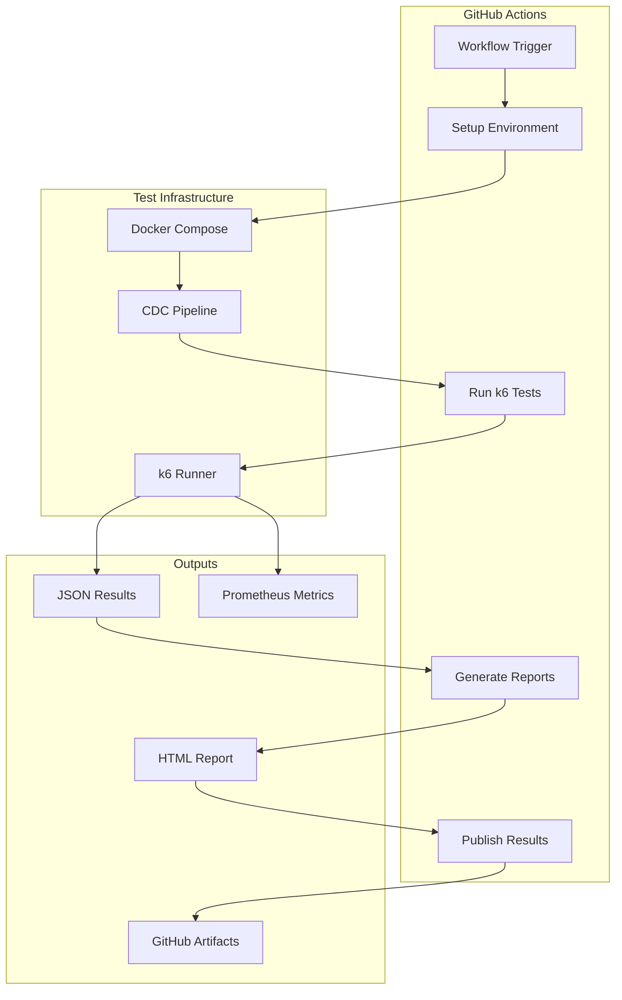
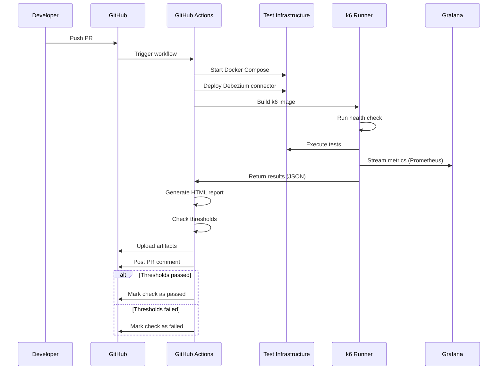

# PLAN-024: k6 Reporting and CI/CD Integration

## Objective

Implement k6 test reporting with HTML/JSON outputs, Grafana dashboards for result visualization, and GitHub Actions
integration for automated performance testing in CI/CD pipelines.

## Parent Feature

[FEATURE-002](../features/FEATURE-002.md) - Section 2.7.7-2.7.9: Reporting & CI/CD Integration

## Dependencies

- PLAN-022: k6 Load Testing Infrastructure
- PLAN-023: k6 Load Test Scenarios

## Changes

### Files to Create/Modify

| File                                                 | Purpose                     |
|------------------------------------------------------|-----------------------------|
| `.github/workflows/performance-test.yml`             | GitHub Actions workflow     |
| `k6/scripts/lib/report.js`                           | Report generation utilities |
| `k6/grafana/provisioning/dashboards/k6-results.json` | k6 results dashboard        |
| `k6/scripts/run-tests.sh`                            | Test runner script          |
| `k6/thresholds.json`                                 | Configurable threshold file |

### CI/CD Architecture



### GitHub Actions Workflow (performance-test.yml)

```yaml
# .github/workflows/performance-test.yml
name: Performance Tests

on:
  workflow_dispatch:
    inputs:
      scenario:
        description: 'Test scenario to run'
        required: true
        default: 'baseline'
        type: choice
        options:
          - baseline
          - stress
          - spike
          - e2e-latency
          - mixed-workload
          - all
      duration_override:
        description: 'Override test duration (e.g., 5m, 30m)'
        required: false
        type: string
  schedule:
    # Run baseline tests daily at 2 AM
    - cron: '0 2 * * *'
  pull_request:
    paths:
      - 'src/**'
      - 'k6/**'
      - 'docker-compose.yml'

env:
  DOCKER_BUILDKIT: 1
  COMPOSE_DOCKER_CLI_BUILD: 1

jobs:
  performance-test:
    name: Run Performance Tests
    runs-on: ubuntu-latest
    timeout-minutes: 120

    services:
    # No services defined here - we use docker compose

    steps:
      - name: Checkout repository
        uses: actions/checkout@v4

      - name: Set up Docker Buildx
        uses: docker/setup-buildx-action@v3

      - name: Cache Docker layers
        uses: actions/cache@v4
        with:
          path: /tmp/.buildx-cache
          key: ${{ runner.os }}-buildx-${{ github.sha }}
          restore-keys: |
            ${{ runner.os }}-buildx-

      - name: Create results directory
        run: mkdir -p k6/results

      - name: Start CDC infrastructure
        run: |
          docker compose up -d postgres mongodb kafka kafka-connect otel-collector prometheus
          echo "Waiting for services to be healthy..."
          sleep 30
          docker compose ps

      - name: Deploy Debezium connector
        run: |
          chmod +x scripts/deploy-connector.sh
          ./scripts/deploy-connector.sh
          sleep 10

      - name: Start CDC consumer
        run: |
          docker compose up -d cdc-consumer
          sleep 15
          docker compose logs cdc-consumer --tail 50

      - name: Build k6 image
        run: docker compose -f k6/docker-compose.k6.yml build k6

      - name: Run health check
        run: |
          docker compose -f k6/docker-compose.k6.yml run --rm k6 run /scripts/health-check.js

      - name: Determine test scenarios
        id: scenarios
        run: |
          if [ "${{ github.event.inputs.scenario }}" == "all" ] || [ -z "${{ github.event.inputs.scenario }}" ]; then
            echo "scenarios=baseline,e2e-latency" >> $GITHUB_OUTPUT
          else
            echo "scenarios=${{ github.event.inputs.scenario }}" >> $GITHUB_OUTPUT
          fi

      - name: Run baseline test
        if: contains(steps.scenarios.outputs.scenarios, 'baseline')
        run: |
          docker compose -f k6/docker-compose.k6.yml run --rm k6 run \
            --out json=/results/baseline-${{ github.run_id }}.json \
            --out experimental-prometheus-rw \
            /scripts/baseline-test.js
        continue-on-error: true

      - name: Run E2E latency test
        if: contains(steps.scenarios.outputs.scenarios, 'e2e-latency')
        run: |
          docker compose -f k6/docker-compose.k6.yml run --rm k6 run \
            --out json=/results/e2e-latency-${{ github.run_id }}.json \
            --out experimental-prometheus-rw \
            /scripts/e2e-latency-test.js
        continue-on-error: true

      - name: Run stress test
        if: contains(steps.scenarios.outputs.scenarios, 'stress')
        run: |
          docker compose -f k6/docker-compose.k6.yml run --rm k6 run \
            --out json=/results/stress-${{ github.run_id }}.json \
            --out experimental-prometheus-rw \
            /scripts/stress-test.js
        continue-on-error: true

      - name: Run spike test
        if: contains(steps.scenarios.outputs.scenarios, 'spike')
        run: |
          docker compose -f k6/docker-compose.k6.yml run --rm k6 run \
            --out json=/results/spike-${{ github.run_id }}.json \
            --out experimental-prometheus-rw \
            /scripts/spike-test.js
        continue-on-error: true

      - name: Run mixed workload test
        if: contains(steps.scenarios.outputs.scenarios, 'mixed-workload')
        run: |
          docker compose -f k6/docker-compose.k6.yml run --rm k6 run \
            --out json=/results/mixed-${{ github.run_id }}.json \
            --out experimental-prometheus-rw \
            /scripts/mixed-workload-test.js
        continue-on-error: true

      - name: Generate HTML report
        run: |
          # Install k6 reporter
          npm install -g k6-html-reporter || true

          # Generate reports for each result file
          for f in k6/results/*.json; do
            if [ -f "$f" ]; then
              filename=$(basename "$f" .json)
              k6-html-reporter --input "$f" --output "k6/results/${filename}.html" || echo "Report generation skipped for $f"
            fi
          done

      - name: Generate summary report
        run: |
          echo "## Performance Test Results" >> $GITHUB_STEP_SUMMARY
          echo "" >> $GITHUB_STEP_SUMMARY
          echo "**Run ID:** ${{ github.run_id }}" >> $GITHUB_STEP_SUMMARY
          echo "**Scenarios:** ${{ steps.scenarios.outputs.scenarios }}" >> $GITHUB_STEP_SUMMARY
          echo "" >> $GITHUB_STEP_SUMMARY

          for f in k6/results/*.json; do
            if [ -f "$f" ]; then
              filename=$(basename "$f" .json)
              echo "### ${filename}" >> $GITHUB_STEP_SUMMARY
              echo '```' >> $GITHUB_STEP_SUMMARY
              # Extract key metrics using jq
              jq -r '.metrics | to_entries[] | select(.key | test("cdc_|e2e_")) | "\(.key): \(.value.values // .value.value)"' "$f" 2>/dev/null | head -20 >> $GITHUB_STEP_SUMMARY || echo "Unable to parse metrics" >> $GITHUB_STEP_SUMMARY
              echo '```' >> $GITHUB_STEP_SUMMARY
              echo "" >> $GITHUB_STEP_SUMMARY
            fi
          done

      - name: Check threshold violations
        id: thresholds
        run: |
          violations=0
          for f in k6/results/*.json; do
            if [ -f "$f" ]; then
              # Check for threshold violations in k6 output
              if jq -e '.root_group.checks | to_entries[] | select(.value.fails > 0)' "$f" > /dev/null 2>&1; then
                violations=$((violations + 1))
              fi
            fi
          done

          if [ $violations -gt 0 ]; then
            echo "threshold_violations=true" >> $GITHUB_OUTPUT
            echo "::warning::Performance thresholds violated in $violations test(s)"
          else
            echo "threshold_violations=false" >> $GITHUB_OUTPUT
          fi

      - name: Upload test results
        uses: actions/upload-artifact@v4
        with:
          name: k6-results-${{ github.run_id }}
          path: k6/results/
          retention-days: 30

      - name: Collect docker logs
        if: always()
        run: |
          mkdir -p logs
          docker compose logs > logs/docker-compose.log 2>&1
          docker compose -f k6/docker-compose.k6.yml logs > logs/k6.log 2>&1

      - name: Upload logs
        if: always()
        uses: actions/upload-artifact@v4
        with:
          name: logs-${{ github.run_id }}
          path: logs/
          retention-days: 7

      - name: Cleanup
        if: always()
        run: |
          docker compose down -v
          docker compose -f k6/docker-compose.k6.yml down

      - name: Comment on PR
        if: github.event_name == 'pull_request'
        uses: actions/github-script@v7
        with:
          script: |
            const fs = require('fs');
            let comment = '## 📊 Performance Test Results\n\n';
            comment += `**Status:** ${{ steps.thresholds.outputs.threshold_violations == 'true' && '⚠️ Threshold violations detected' || '✅ All thresholds passed' }}\n\n`;

            // Add link to artifacts
            comment += `[Download detailed results](https://github.com/${{ github.repository }}/actions/runs/${{ github.run_id }})\n`;

            github.rest.issues.createComment({
              issue_number: context.issue.number,
              owner: context.repo.owner,
              repo: context.repo.repo,
              body: comment
            });

      - name: Fail on threshold violations
        if: steps.thresholds.outputs.threshold_violations == 'true' && github.event_name == 'pull_request'
        run: exit 1
```

### Test Runner Script (run-tests.sh)

```bash
#!/bin/bash
# k6/scripts/run-tests.sh

set -e

# Colors for output
RED='\033[0;31m'
GREEN='\033[0;32m'
YELLOW='\033[1;33m'
NC='\033[0m' # No Color

RESULTS_DIR="${RESULTS_DIR:-./k6/results}"
TIMESTAMP=$(date +%Y%m%d-%H%M%S)

# Default scenarios
SCENARIOS="${1:-baseline}"

log() {
    echo -e "${GREEN}[$(date +'%Y-%m-%d %H:%M:%S')]${NC} $1"
}

error() {
    echo -e "${RED}[ERROR]${NC} $1"
}

warn() {
    echo -e "${YELLOW}[WARN]${NC} $1"
}

# Create results directory
mkdir -p "$RESULTS_DIR"

# Start infrastructure if not running
if ! docker compose ps postgres | grep -q "healthy"; then
    log "Starting CDC infrastructure..."
    docker compose up -d
    sleep 30
fi

# Build k6 if needed
log "Building k6 image..."
docker compose -f k6/docker-compose.k6.yml build k6

# Run health check
log "Running health check..."
docker compose -f k6/docker-compose.k6.yml run --rm k6 run /scripts/health-check.js

# Run specified scenarios
IFS=',' read -ra SCENARIO_LIST <<< "$SCENARIOS"

for scenario in "${SCENARIO_LIST[@]}"; do
    log "Running $scenario test..."

    script_name="${scenario}-test.js"
    if [ "$scenario" == "e2e-latency" ]; then
        script_name="e2e-latency-test.js"
    elif [ "$scenario" == "mixed-workload" ]; then
        script_name="mixed-workload-test.js"
    fi

    docker compose -f k6/docker-compose.k6.yml run --rm k6 run \
        --out json=/results/${scenario}-${TIMESTAMP}.json \
        --out experimental-prometheus-rw \
        /scripts/${script_name} || {
            warn "Test $scenario completed with warnings"
        }

    log "Test $scenario completed. Results: $RESULTS_DIR/${scenario}-${TIMESTAMP}.json"
done

# Generate summary
log "Generating summary..."
echo ""
echo "========================================"
echo "         TEST RESULTS SUMMARY"
echo "========================================"

for result in "$RESULTS_DIR"/*-${TIMESTAMP}.json; do
    if [ -f "$result" ]; then
        scenario=$(basename "$result" -${TIMESTAMP}.json)
        echo ""
        echo "--- $scenario ---"
        jq -r '
            "Iterations: \(.root_group.iterations // "N/A")",
            "Duration: \(.state.testRunDurationMs // 0 | . / 1000 | tostring + "s")",
            "VUs: \(.vus_max // "N/A")"
        ' "$result" 2>/dev/null || echo "Unable to parse results"

        # Check for failures
        fails=$(jq -r '.root_group.checks | to_entries | map(select(.value.fails > 0)) | length' "$result" 2>/dev/null || echo "0")
        if [ "$fails" -gt 0 ]; then
            error "  Checks failed: $fails"
        else
            log "  All checks passed"
        fi
    fi
done

echo ""
echo "========================================"
log "All tests completed. Results in $RESULTS_DIR"
```

### k6 Results Grafana Dashboard (k6-results.json)

```json
{
  "dashboard": {
    "title": "k6 Load Test Results",
    "uid": "k6-results",
    "tags": [
      "k6",
      "load-testing",
      "performance"
    ],
    "timezone": "browser",
    "refresh": "10s",
    "panels": [
      {
        "id": 1,
        "title": "Virtual Users",
        "type": "timeseries",
        "gridPos": {
          "x": 0,
          "y": 0,
          "w": 12,
          "h": 6
        },
        "targets": [
          {
            "expr": "k6_vus",
            "legendFormat": "VUs"
          },
          {
            "expr": "k6_vus_max",
            "legendFormat": "Max VUs"
          }
        ]
      },
      {
        "id": 2,
        "title": "Request Rate",
        "type": "timeseries",
        "gridPos": {
          "x": 12,
          "y": 0,
          "w": 12,
          "h": 6
        },
        "targets": [
          {
            "expr": "rate(k6_iterations_total[1m])",
            "legendFormat": "Iterations/sec"
          }
        ],
        "fieldConfig": {
          "defaults": {
            "unit": "reqps"
          }
        }
      },
      {
        "id": 3,
        "title": "CDC E2E Latency",
        "type": "timeseries",
        "gridPos": {
          "x": 0,
          "y": 6,
          "w": 12,
          "h": 8
        },
        "targets": [
          {
            "expr": "histogram_quantile(0.50, rate(k6_cdc_e2e_latency_bucket[1m]))",
            "legendFormat": "p50"
          },
          {
            "expr": "histogram_quantile(0.95, rate(k6_cdc_e2e_latency_bucket[1m]))",
            "legendFormat": "p95"
          },
          {
            "expr": "histogram_quantile(0.99, rate(k6_cdc_e2e_latency_bucket[1m]))",
            "legendFormat": "p99"
          }
        ],
        "fieldConfig": {
          "defaults": {
            "unit": "ms"
          }
        }
      },
      {
        "id": 4,
        "title": "Success Rate",
        "type": "gauge",
        "gridPos": {
          "x": 12,
          "y": 6,
          "w": 6,
          "h": 4
        },
        "targets": [
          {
            "expr": "k6_cdc_success_rate",
            "legendFormat": "Success Rate"
          }
        ],
        "fieldConfig": {
          "defaults": {
            "unit": "percentunit",
            "min": 0,
            "max": 1,
            "thresholds": {
              "mode": "absolute",
              "steps": [
                {
                  "color": "red",
                  "value": 0
                },
                {
                  "color": "yellow",
                  "value": 0.95
                },
                {
                  "color": "green",
                  "value": 0.99
                }
              ]
            }
          }
        }
      },
      {
        "id": 5,
        "title": "Error Count",
        "type": "stat",
        "gridPos": {
          "x": 18,
          "y": 6,
          "w": 6,
          "h": 4
        },
        "targets": [
          {
            "expr": "sum(increase(k6_pg_write_errors[5m]))",
            "legendFormat": "PG Errors"
          },
          {
            "expr": "sum(increase(k6_mongo_read_errors[5m]))",
            "legendFormat": "Mongo Errors"
          }
        ]
      },
      {
        "id": 6,
        "title": "PostgreSQL Write Latency",
        "type": "timeseries",
        "gridPos": {
          "x": 12,
          "y": 10,
          "w": 12,
          "h": 4
        },
        "targets": [
          {
            "expr": "histogram_quantile(0.95, rate(k6_pg_write_duration_bucket[1m]))",
            "legendFormat": "p95"
          }
        ],
        "fieldConfig": {
          "defaults": {
            "unit": "ms"
          }
        }
      },
      {
        "id": 7,
        "title": "MongoDB Read Latency",
        "type": "timeseries",
        "gridPos": {
          "x": 0,
          "y": 14,
          "w": 12,
          "h": 4
        },
        "targets": [
          {
            "expr": "histogram_quantile(0.95, rate(k6_mongo_read_duration_bucket[1m]))",
            "legendFormat": "p95"
          }
        ],
        "fieldConfig": {
          "defaults": {
            "unit": "ms"
          }
        }
      },
      {
        "id": 8,
        "title": "Records Processed",
        "type": "stat",
        "gridPos": {
          "x": 12,
          "y": 14,
          "w": 6,
          "h": 4
        },
        "targets": [
          {
            "expr": "sum(k6_pg_records_inserted)",
            "legendFormat": "Inserted"
          }
        ]
      },
      {
        "id": 9,
        "title": "Documents Found",
        "type": "stat",
        "gridPos": {
          "x": 18,
          "y": 14,
          "w": 6,
          "h": 4
        },
        "targets": [
          {
            "expr": "sum(k6_mongo_documents_found)",
            "legendFormat": "Found"
          },
          {
            "expr": "sum(k6_mongo_documents_not_found)",
            "legendFormat": "Not Found"
          }
        ]
      },
      {
        "id": 10,
        "title": "Threshold Status",
        "type": "table",
        "gridPos": {
          "x": 0,
          "y": 18,
          "w": 24,
          "h": 6
        },
        "targets": [
          {
            "expr": "k6_threshold_passes",
            "format": "table"
          }
        ],
        "transformations": [
          {
            "id": "organize",
            "options": {
              "excludeByName": {},
              "indexByName": {},
              "renameByName": {
                "threshold": "Threshold",
                "Value": "Status"
              }
            }
          }
        ]
      }
    ],
    "templating": {
      "list": [
        {
          "name": "test_run",
          "type": "query",
          "datasource": {
            "type": "prometheus",
            "uid": "prometheus"
          },
          "query": "label_values(k6_vus, test_run_id)",
          "multi": false,
          "includeAll": false
        }
      ]
    }
  }
}
```

### Configurable Thresholds (thresholds.json)

```json
{
  "baseline": {
    "cdc_e2e_latency": {
      "p95": 2000,
      "p99": 5000
    },
    "pg_write_duration": {
      "p95": 100
    },
    "mongo_read_duration": {
      "p95": 50
    },
    "cdc_success_rate": {
      "rate": 0.99
    }
  },
  "stress": {
    "cdc_e2e_latency": {
      "p95": 5000,
      "p99": 10000
    },
    "cdc_success_rate": {
      "rate": 0.95
    }
  },
  "spike": {
    "cdc_e2e_latency": {
      "p95": 10000
    },
    "cdc_success_rate": {
      "rate": 0.90
    }
  },
  "soak": {
    "cdc_e2e_latency": {
      "p95": 3000,
      "p99": 6000
    },
    "cdc_success_rate": {
      "rate": 0.99
    }
  }
}
```

## Directory Structure

```
k6/
├── scripts/
│   ├── run-tests.sh
│   └── lib/
│       └── report.js
├── results/
│   └── .gitkeep
├── grafana/
│   └── provisioning/
│       └── dashboards/
│           └── k6-results.json
├── thresholds.json
└── docker-compose.k6.yml

.github/
└── workflows/
    └── performance-test.yml
```

## Commands to Run

```bash
# Make run script executable
chmod +x k6/scripts/run-tests.sh

# Run all tests locally
./k6/scripts/run-tests.sh baseline,stress,e2e-latency

# Run specific scenario
./k6/scripts/run-tests.sh baseline

# Run via docker compose directly
docker compose -f k6/docker-compose.k6.yml run --rm k6 run \
  --out json=/results/test.json \
  /scripts/baseline-test.js

# Convert JSON to HTML report (requires k6-html-reporter)
npm install -g k6-html-reporter
k6-html-reporter --input k6/results/baseline.json --output k6/results/baseline.html

# Trigger GitHub Actions manually
gh workflow run performance-test.yml -f scenario=baseline

# View workflow runs
gh run list --workflow=performance-test.yml

# Download artifacts from workflow run
gh run download <run-id> -n k6-results-<run-id>

# Compare results between runs
# Use Grafana with test_run_id variable
open http://localhost:3000/d/k6-results
```

## Acceptance Criteria

- [ ] Performance tests run automatically on pull requests with results posted as PR comment
- [ ] Performance tests run on schedule (2 AM daily) with artifacts uploaded
- [ ] Manual test execution supports scenario selection (baseline, stress, etc.)
- [ ] HTML reports are generated from JSON results and included in artifacts
- [ ] Threshold violations fail PR checks
- [ ] Grafana dashboard displays live results (VUs, latency, error rates)
- [ ] Test results are archived (JSON/HTML for 30 days, logs for 7 days)
- [ ] Runner script executes multiple scenarios and prints summary
- [ ] PR gets performance summary comment with pass/fail status and artifact links

## CI/CD Flow



## Estimated Complexity

High - Involves GitHub Actions, artifact management, report generation, and Grafana integration.

## Notes

- GitHub Actions self-hosted runners recommended for consistent results
- Consider k6 Cloud for distributed testing and advanced reporting
- Threshold configuration allows environment-specific limits
- PR comments help developers catch regressions early
- Artifact retention policies balance storage vs. historical data
- Scheduled tests establish performance baselines over time
- Manual triggers enable on-demand stress/spike testing
- JSON output enables custom analysis and historical trending
