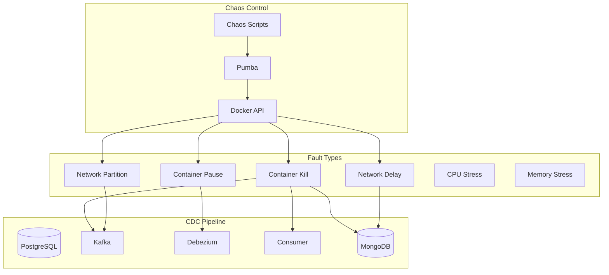
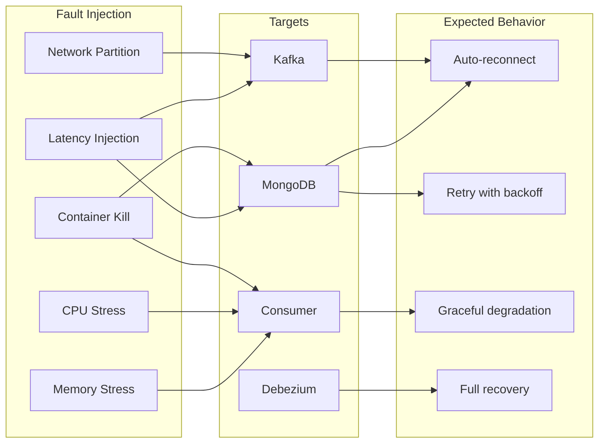

# PLAN-025: Chaos Engineering Integration

## Objective

Implement chaos engineering capabilities using Pumba and Docker container manipulation to test CDC pipeline resilience
under failure conditions including network partitions, container crashes, and resource constraints.

## Parent Feature

[FEATURE-002](../features/FEATURE-002.md) - Section 2.7.10: Chaos Engineering Integration

## Dependencies

- PLAN-022: k6 Load Testing Infrastructure
- PLAN-023: k6 Load Test Scenarios

## Changes

### Files to Create/Modify

| File                                   | Purpose                          |
|----------------------------------------|----------------------------------|
| `chaos/docker-compose.chaos.yml`       | Pumba chaos testing services     |
| `chaos/scenarios/kafka-partition.yml`  | Kafka network partition scenario |
| `chaos/scenarios/mongodb-failure.yml`  | MongoDB crash/restart scenario   |
| `chaos/scenarios/consumer-restart.yml` | Consumer crash and recovery      |
| `chaos/scenarios/network-delay.yml`    | Network latency injection        |
| `k6/scripts/chaos-resilience-test.js`  | k6 test with chaos injection     |
| `chaos/run-chaos.sh`                   | Chaos test runner script         |

### Chaos Engineering Architecture



### Docker Compose Chaos Services (docker-compose.chaos.yml)

```yaml
# chaos/docker-compose.chaos.yml
version: '3.8'

services:
  pumba:
    image: gaiaadm/pumba:latest
    container_name: cdc-pumba
    volumes:
      - /var/run/docker.sock:/var/run/docker.sock:ro
    networks:
      - cdc-network
    profiles:
      - chaos

  # Alternative: Toxiproxy for network chaos
  toxiproxy:
    image: ghcr.io/shopify/toxiproxy:2.7.0
    container_name: cdc-toxiproxy
    ports:
      - "8474:8474"   # Toxiproxy API
      - "5433:5433"   # PostgreSQL proxy
      - "9093:9093"   # Kafka proxy
      - "27018:27018" # MongoDB proxy
    networks:
      - cdc-network
    profiles:
      - chaos

networks:
  cdc-network:
    external: true
```

### Kafka Network Partition Scenario (kafka-partition.yml)

```yaml
# chaos/scenarios/kafka-partition.yml
name: Kafka Network Partition
description: Simulate network partition between consumer and Kafka

phases:
  - name: baseline
    duration: 60s
    description: Establish baseline performance

  - name: partition
    duration: 30s
    description: Create network partition
    actions:
      - type: netem
        target: cdc-kafka
        params:
          duration: 30s
          loss: 100%  # Complete packet loss
          interface: eth0

  - name: recovery
    duration: 120s
    description: Monitor recovery after partition heals

validation:
  # Consumer should reconnect within 60s
  - metric: kafka_consumer_connection_count
    condition: gt
    value: 0
    within: 60s
    after_phase: partition

  # No data loss - all events eventually propagate
  - metric: cdc_events_processed_total
    condition: increases
    after_phase: recovery
```

### MongoDB Failure Scenario (mongodb-failure.yml)

```yaml
# chaos/scenarios/mongodb-failure.yml
name: MongoDB Crash and Recovery
description: Test consumer behavior when MongoDB becomes unavailable

phases:
  - name: baseline
    duration: 60s
    description: Establish baseline with load

  - name: crash
    duration: 0s
    description: Kill MongoDB container
    actions:
      - type: kill
        target: cdc-mongodb
        params:
          signal: SIGKILL

  - name: outage
    duration: 60s
    description: Consumer operates without MongoDB

  - name: recovery
    duration: 0s
    description: Restart MongoDB
    actions:
      - type: restart
        target: cdc-mongodb

  - name: catchup
    duration: 180s
    description: Monitor consumer catch-up

validation:
  # MongoDB should be healthy within 30s of restart
  - container: cdc-mongodb
    condition: healthy
    within: 30s
    after_phase: recovery

  # Consumer should resume processing within 60s
  - metric: cdc_events_processed_total
    condition: increases
    within: 60s
    after_phase: recovery

  # No duplicate processing (idempotency check)
  - custom: verify_no_duplicates
    collection: customers
```

### Consumer Restart Scenario (consumer-restart.yml)

```yaml
# chaos/scenarios/consumer-restart.yml
name: Consumer Crash and Recovery
description: Test CDC pipeline recovery when consumer crashes

phases:
  - name: baseline
    duration: 60s
    description: Consumer processing events normally

  - name: crash
    duration: 0s
    description: Kill consumer container
    actions:
      - type: kill
        target: cdc-consumer
        params:
          signal: SIGKILL

  - name: outage
    duration: 30s
    description: Events accumulate in Kafka

  - name: restart
    duration: 0s
    description: Restart consumer
    actions:
      - type: restart
        target: cdc-consumer

  - name: catchup
    duration: 120s
    description: Consumer catches up on missed events

validation:
  # Consumer should start within 30s
  - container: cdc-consumer
    condition: healthy
    within: 30s
    after_phase: restart

  # Consumer lag should decrease
  - metric: kafka_consumer_records_lag_max
    condition: decreasing
    within: 60s
    after_phase: restart

  # All accumulated events should be processed
  - custom: verify_event_processing
    expected_count: accumulated_during_outage
```

### Network Delay Scenario (network-delay.yml)

```yaml
# chaos/scenarios/network-delay.yml
name: Network Latency Injection
description: Test CDC pipeline behavior under degraded network conditions

phases:
  - name: baseline
    duration: 60s
    description: Normal network conditions

  - name: delay_kafka
    duration: 120s
    description: Add latency to Kafka connections
    actions:
      - type: netem
        target: cdc-kafka
        params:
          duration: 120s
          delay: 200ms
          jitter: 50ms

  - name: delay_mongo
    duration: 120s
    description: Add latency to MongoDB connections
    actions:
      - type: netem
        target: cdc-mongodb
        params:
          duration: 120s
          delay: 100ms
          jitter: 25ms

  - name: combined_delay
    duration: 120s
    description: Both Kafka and MongoDB delayed
    actions:
      - type: netem
        target: cdc-kafka
        params:
          duration: 120s
          delay: 200ms
      - type: netem
        target: cdc-mongodb
        params:
          duration: 120s
          delay: 100ms

  - name: recovery
    duration: 60s
    description: Network returns to normal

validation:
  # E2E latency should increase during delay phases
  - metric: cdc_e2e_latency_p95
    condition: lt
    value: 10000  # 10s max even with delays

  # No errors despite delays
  - metric: cdc_events_failed_total
    condition: rate_lt
    value: 0.01  # <1% error rate

  # Throughput should recover after delays
  - metric: cdc_events_processed_total
    condition: rate_gt
    value: baseline_rate * 0.9  # Within 10% of baseline
    after_phase: recovery
```

### Chaos Resilience Test (chaos-resilience-test.js)

```javascript
// k6/scripts/chaos-resilience-test.js
import {sleep, check, group} from 'k6';
import {config} from './lib/config.js';
import * as pg from './lib/postgres.js';
import * as mongo from './lib/mongodb.js';
import * as metrics from './lib/metrics.js';
import {uuidv4} from 'https://jslib.k6.io/k6-utils/1.4.0/index.js';
import {Trend, Counter, Rate, Gauge} from 'k6/metrics';
import exec from 'k6/execution';
import http from 'k6/http';

// Chaos-specific metrics
const chaosPhase = new Gauge('chaos_phase');
const recoveryTime = new Trend('chaos_recovery_time', true);
const eventsLostDuringChaos = new Counter('chaos_events_lost');
const chaosResilience = new Rate('chaos_resilience_rate');

// Test phases
const PHASES = {
    BASELINE: 1,
    CHAOS: 2,
    RECOVERY: 3,
    VERIFICATION: 4,
};

export const options = {
    scenarios: {
        chaos_test: {
            executor: 'ramping-vus',
            startVUs: 0,
            stages: [
                {duration: '1m', target: 20},   // Baseline ramp-up
                {duration: '2m', target: 20},   // Baseline steady
                {duration: '1m', target: 20},   // Chaos injection (external)
                {duration: '2m', target: 20},   // Recovery
                {duration: '1m', target: 0},    // Ramp-down
            ],
        },
    },
    thresholds: {
        'chaos_resilience_rate': ['rate>0.90'],  // 90% events should succeed even with chaos
        'chaos_recovery_time': ['p(95)<30000'],  // Recovery within 30s
        'cdc_success_rate': ['rate>0.85'],       // Allow more failures during chaos
    },
};

// Track events for verification
const pendingEvents = new Map();
const verifiedEvents = new Set();

export function setup() {
    console.log('=== CHAOS RESILIENCE TEST ===');
    console.log('This test should be run with external chaos injection');
    console.log('Use run-chaos.sh to inject failures during the test');

    pg.openConnection();
    mongo.openConnection();

    return {
        startTime: Date.now(),
        baselineEvents: 0,
    };
}

export default function (data) {
    const testTime = (Date.now() - data.startTime) / 1000;
    const currentPhase = determinePhase(testTime);
    chaosPhase.add(currentPhase);

    const customerId = uuidv4();
    const startTime = Date.now();

    // Create customer
    const customer = {
        id: customerId,
        email: `chaos-${customerId}@resilience.test`,
        status: 'active',
    };

    const writeResult = pg.insertCustomer(customer);

    if (!writeResult.success) {
        chaosResilience.add(false);
        metrics.recordFailure('create');

        // Expected during chaos - don't fail immediately
        if (currentPhase === PHASES.CHAOS) {
            console.log(`Write failed during chaos phase: ${writeResult.error}`);
        }
        return;
    }

    // Track pending event
    pendingEvents.set(customerId, {startTime, customer});

    // Verification with extended timeout during recovery
    const maxRetries = currentPhase === PHASES.RECOVERY ? 60 : 30;
    const retryDelay = currentPhase === PHASES.RECOVERY ? 1000 : 200;

    const readResult = mongo.findCustomer(customerId, maxRetries, retryDelay);

    if (readResult.found) {
        chaosResilience.add(true);
        metrics.recordSuccess('create');
        metrics.recordCdcLatency(startTime, Date.now());

        // Track recovery time if we were in chaos/recovery phase
        if (currentPhase >= PHASES.CHAOS) {
            recoveryTime.add(Date.now() - startTime);
        }

        verifiedEvents.add(customerId);
        pendingEvents.delete(customerId);
    } else {
        chaosResilience.add(false);

        if (currentPhase === PHASES.VERIFICATION) {
            // Final verification phase - count as lost
            eventsLostDuringChaos.add(1);
            console.log(`Event lost: ${customerId}`);
        }
    }

    // Adaptive sleep based on phase
    const sleepTime = currentPhase === PHASES.CHAOS ? 0.5 : 0.2;
    sleep(sleepTime);
}

function determinePhase(testTimeSeconds) {
    if (testTimeSeconds < 180) return PHASES.BASELINE;      // 0-3 min
    if (testTimeSeconds < 240) return PHASES.CHAOS;         // 3-4 min
    if (testTimeSeconds < 360) return PHASES.RECOVERY;      // 4-6 min
    return PHASES.VERIFICATION;                              // 6+ min
}

export function teardown(data) {
    const duration = (Date.now() - data.startTime) / 1000;

    console.log('\n=== CHAOS TEST RESULTS ===');
    console.log(`Total duration: ${duration.toFixed(0)}s`);
    console.log(`Verified events: ${verifiedEvents.size}`);
    console.log(`Pending events: ${pendingEvents.size}`);

    // Final verification of pending events
    let recovered = 0;
    for (const [customerId, eventData] of pendingEvents) {
        const result = mongo.findCustomer(customerId, 10, 1000);
        if (result.found) {
            recovered++;
            recoveryTime.add(Date.now() - eventData.startTime);
        } else {
            eventsLostDuringChaos.add(1);
        }
    }

    console.log(`Late recovered: ${recovered}`);
    console.log(`Total lost: ${pendingEvents.size - recovered}`);

    // Cleanup test data
    for (const customerId of verifiedEvents) {
        pg.deleteCustomer(customerId);
    }
    for (const [customerId] of pendingEvents) {
        pg.deleteCustomer(customerId);
    }

    pg.closeConnection();
    mongo.closeConnection();
}
```

### Chaos Runner Script (run-chaos.sh)

```bash
#!/bin/bash
# chaos/run-chaos.sh

set -e

SCENARIO="${1:-mongodb-failure}"
CHAOS_DIR="$(dirname "$0")"

# Colors
RED='\033[0;31m'
GREEN='\033[0;32m'
YELLOW='\033[1;33m'
NC='\033[0m'

log() { echo -e "${GREEN}[CHAOS]${NC} $1"; }
warn() { echo -e "${YELLOW}[WARN]${NC} $1"; }
error() { echo -e "${RED}[ERROR]${NC} $1"; }

# Ensure network exists
docker network inspect cdc-network >/dev/null 2>&1 || {
    error "CDC network not found. Start the CDC stack first."
    exit 1
}

case "$SCENARIO" in
    "kafka-partition")
        log "Executing Kafka network partition..."
        docker run --rm -v /var/run/docker.sock:/var/run/docker.sock \
            gaiaadm/pumba netem \
            --duration 30s \
            --tc-image gaiadocker/iproute2 \
            loss --percent 100 \
            cdc-kafka
        ;;

    "mongodb-failure")
        log "Executing MongoDB crash scenario..."

        # Kill MongoDB
        log "Killing MongoDB container..."
        docker kill cdc-mongodb || true

        # Wait during outage
        log "MongoDB down for 60 seconds..."
        sleep 60

        # Restart MongoDB
        log "Restarting MongoDB..."
        docker compose up -d mongodb

        # Wait for healthy
        log "Waiting for MongoDB to be healthy..."
        until docker inspect cdc-mongodb --format='{{.State.Health.Status}}' | grep -q healthy; do
            sleep 5
        done
        log "MongoDB recovered!"
        ;;

    "consumer-restart")
        log "Executing consumer crash scenario..."

        # Kill consumer
        log "Killing consumer container..."
        docker kill cdc-consumer || true

        # Wait
        log "Consumer down for 30 seconds..."
        sleep 30

        # Restart consumer
        log "Restarting consumer..."
        docker compose up -d cdc-consumer

        # Wait for healthy
        log "Waiting for consumer to be healthy..."
        until docker inspect cdc-consumer --format='{{.State.Health.Status}}' | grep -q healthy; do
            sleep 5
        done
        log "Consumer recovered!"
        ;;

    "network-delay")
        log "Executing network delay scenario..."

        # Add delay to MongoDB
        docker run --rm -v /var/run/docker.sock:/var/run/docker.sock \
            gaiaadm/pumba netem \
            --duration 120s \
            --tc-image gaiadocker/iproute2 \
            delay --time 200 --jitter 50 \
            cdc-mongodb &

        # Add delay to Kafka
        docker run --rm -v /var/run/docker.sock:/var/run/docker.sock \
            gaiaadm/pumba netem \
            --duration 120s \
            --tc-image gaiadocker/iproute2 \
            delay --time 200 --jitter 50 \
            cdc-kafka &

        wait
        log "Network delays completed"
        ;;

    "cpu-stress")
        log "Executing CPU stress on consumer..."
        docker run --rm -v /var/run/docker.sock:/var/run/docker.sock \
            gaiaadm/pumba stress \
            --duration 60s \
            --stressors "cpu -l 80" \
            cdc-consumer
        ;;

    "memory-stress")
        log "Executing memory stress on consumer..."
        docker run --rm -v /var/run/docker.sock:/var/run/docker.sock \
            gaiaadm/pumba stress \
            --duration 60s \
            --stressors "vm 1 --vm-bytes 256M" \
            cdc-consumer
        ;;

    "all")
        log "Running all chaos scenarios sequentially..."
        for scenario in kafka-partition mongodb-failure consumer-restart network-delay; do
            log "=== Scenario: $scenario ==="
            "$0" "$scenario"
            log "Cooling down for 60 seconds..."
            sleep 60
        done
        ;;

    *)
        error "Unknown scenario: $SCENARIO"
        echo "Available scenarios:"
        echo "  - kafka-partition: Network partition to Kafka"
        echo "  - mongodb-failure: MongoDB crash and recovery"
        echo "  - consumer-restart: Consumer crash and recovery"
        echo "  - network-delay: Network latency injection"
        echo "  - cpu-stress: CPU pressure on consumer"
        echo "  - memory-stress: Memory pressure on consumer"
        echo "  - all: Run all scenarios"
        exit 1
        ;;
esac

log "Chaos scenario '$SCENARIO' completed!"
```

## Directory Structure

```
chaos/
├── docker-compose.chaos.yml
├── run-chaos.sh
└── scenarios/
    ├── kafka-partition.yml
    ├── mongodb-failure.yml
    ├── consumer-restart.yml
    └── network-delay.yml

k6/
└── scripts/
    └── chaos-resilience-test.js
```

## Commands to Run

```bash
# Make scripts executable
chmod +x chaos/run-chaos.sh

# Start CDC infrastructure
docker compose up -d

# Run k6 chaos test (in background)
docker compose -f k6/docker-compose.k6.yml run -d --rm k6 run \
  --out experimental-prometheus-rw \
  /scripts/chaos-resilience-test.js

# Inject chaos during test (in another terminal)
./chaos/run-chaos.sh mongodb-failure

# Or inject network delays
./chaos/run-chaos.sh network-delay

# Run with Pumba directly
docker run --rm \
  -v /var/run/docker.sock:/var/run/docker.sock \
  gaiaadm/pumba kill --interval 60s cdc-consumer

# Run network partition test
docker run --rm \
  -v /var/run/docker.sock:/var/run/docker.sock \
  gaiaadm/pumba netem \
  --duration 30s \
  --tc-image gaiadocker/iproute2 \
  loss --percent 100 \
  cdc-kafka

# Check container health after chaos
docker compose ps

# View consumer logs during/after chaos
docker compose logs -f cdc-consumer

# Run full chaos suite
./chaos/run-chaos.sh all
```

## Acceptance Criteria

- [ ] Pipeline recovers from MongoDB crash (reconnect within 30s, no data loss)
- [ ] Pipeline handles Kafka network partition (reconnect after heal, all events processed)
- [ ] Consumer crash and recovery works (resume from last offset, no duplicates)
- [ ] Network latency injection handled gracefully (error rate <1%, throughput reduced but not stopped)
- [ ] Recovery time meets SLA (system recovers within 60 seconds)
- [ ] No data loss during chaos (PostgreSQL events equal MongoDB events)
- [ ] Alerts fire during chaos and resolve after recovery
- [ ] Chaos scenarios are reproducible (consistent results across runs)

## Chaos Scenarios Summary



## Estimated Complexity

High - Requires Docker socket access, careful timing coordination, and complex validation.

## Notes

- Pumba requires access to Docker socket (`/var/run/docker.sock`)
- Network chaos requires the `iproute2` TC image
- Chaos tests should be run in isolated environments
- Consider using Chaos Mesh for Kubernetes deployments
- Always have monitoring in place before running chaos
- Start with read-only chaos (delays) before destructive (kills)
- Document all chaos experiments and learnings
- Use game days to validate runbooks
- Consider blast radius - start small
- Recovery time objectives (RTO) should be defined before testing
