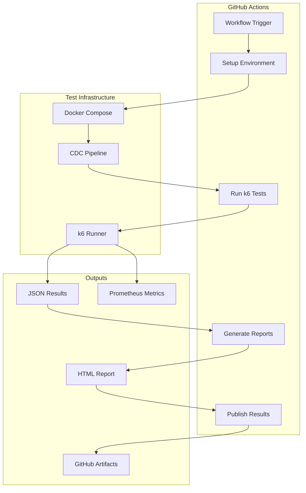
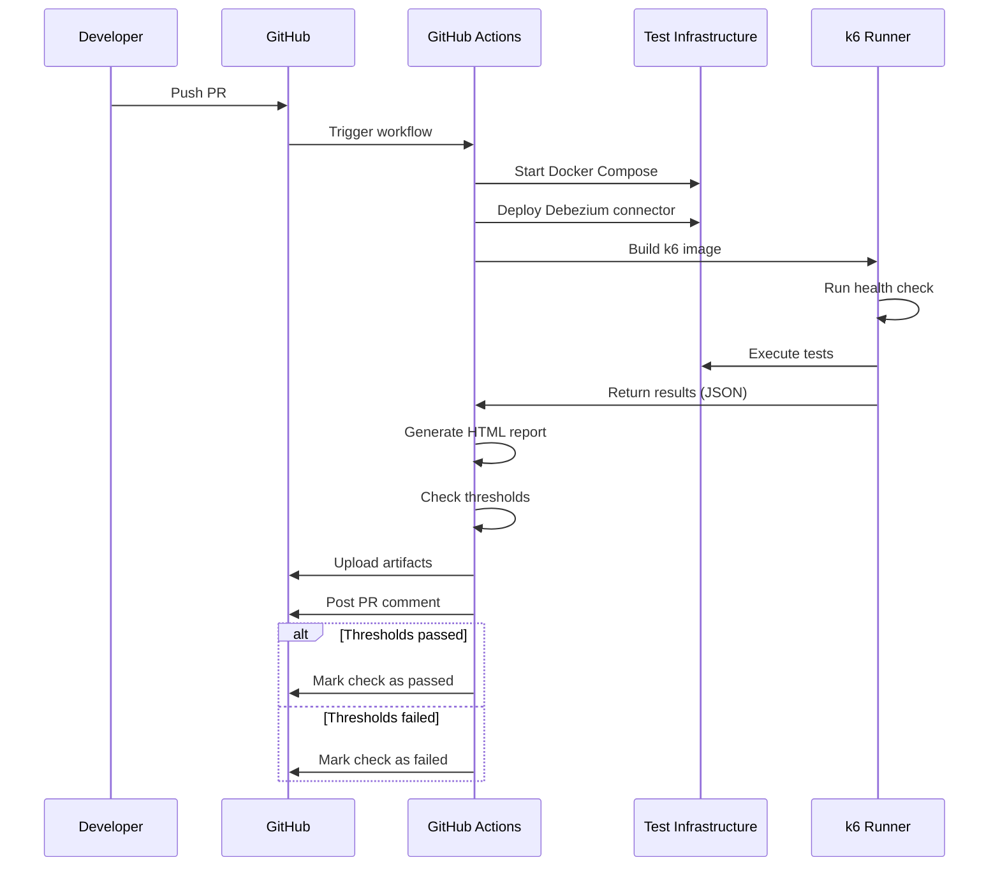

# PLAN-026: GitHub Actions Performance Testing CI/CD

## Objective

Implement GitHub Actions workflow for automated performance testing with k6, including PR checks, scheduled runs, artifact management, and PR commenting with results.

## Parent Feature

[FEATURE-002](../features/FEATURE-002.md) - Section 2.7.8-2.7.9: CI/CD Integration

## Dependencies

- PLAN-022: k6 Load Testing Infrastructure
- PLAN-023: k6 Load Test Scenarios
- PLAN-024: k6 Reporting (for thresholds.json and run-tests.sh)

## Changes

### Files to Create/Modify

| File                                     | Purpose                       |
|------------------------------------------|-------------------------------|
| `.github/workflows/performance-test.yml` | GitHub Actions workflow       |
| `k6/results/.gitkeep`                    | Results directory placeholder |

### CI/CD Architecture



### GitHub Actions Workflow (performance-test.yml)

```yaml
# .github/workflows/performance-test.yml
name: Performance Tests

on:
  workflow_dispatch:
    inputs:
      scenario:
        description: 'Test scenario to run'
        required: true
        default: 'baseline'
        type: choice
        options:
          - baseline
          - stress
          - spike
          - e2e-latency
          - mixed-workload
          - all
      duration_override:
        description: 'Override test duration (e.g., 5m, 30m)'
        required: false
        type: string
  schedule:
    # Run baseline tests daily at 2 AM UTC
    - cron: '0 2 * * *'
  pull_request:
    paths:
      - 'src/**'
      - 'k6/**'
      - 'docker-compose.yml'

env:
  DOCKER_BUILDKIT: 1
  COMPOSE_DOCKER_CLI_BUILD: 1

jobs:
  performance-test:
    name: Run Performance Tests
    runs-on: ubuntu-latest
    timeout-minutes: 120

    steps:
      - name: Checkout repository
        uses: actions/checkout@v4

      - name: Set up Docker Buildx
        uses: docker/setup-buildx-action@v3

      - name: Cache Docker layers
        uses: actions/cache@v4
        with:
          path: /tmp/.buildx-cache
          key: ${{ runner.os }}-buildx-${{ github.sha }}
          restore-keys: |
            ${{ runner.os }}-buildx-

      - name: Create results directory
        run: mkdir -p k6/results

      - name: Start CDC infrastructure
        run: |
          docker compose up -d postgres mongodb kafka kafka-connect otel-collector prometheus
          echo "Waiting for services to be healthy..."
          sleep 30
          docker compose ps

      - name: Deploy Debezium connector
        run: |
          chmod +x scripts/deploy-connector.sh
          ./scripts/deploy-connector.sh
          sleep 10

      - name: Start CDC consumer
        run: |
          docker compose up -d cdc-consumer
          sleep 15
          docker compose logs cdc-consumer --tail 50

      - name: Build k6 image
        run: docker compose -f k6/docker-compose.k6.yml build k6

      - name: Run health check
        run: |
          docker compose -f k6/docker-compose.k6.yml run --rm k6 run /scripts/health-check.js

      - name: Determine test scenarios
        id: scenarios
        run: |
          if [ "${{ github.event.inputs.scenario }}" == "all" ] || [ -z "${{ github.event.inputs.scenario }}" ]; then
            echo "scenarios=baseline,e2e-latency" >> $GITHUB_OUTPUT
          else
            echo "scenarios=${{ github.event.inputs.scenario }}" >> $GITHUB_OUTPUT
          fi

      - name: Run baseline test
        if: contains(steps.scenarios.outputs.scenarios, 'baseline')
        run: |
          docker compose -f k6/docker-compose.k6.yml run --rm k6 run \
            --out json=/results/baseline-${{ github.run_id }}.json \
            --out experimental-prometheus-rw \
            /scripts/baseline-test.js
        continue-on-error: true

      - name: Run E2E latency test
        if: contains(steps.scenarios.outputs.scenarios, 'e2e-latency')
        run: |
          docker compose -f k6/docker-compose.k6.yml run --rm k6 run \
            --out json=/results/e2e-latency-${{ github.run_id }}.json \
            --out experimental-prometheus-rw \
            /scripts/e2e-latency-test.js
        continue-on-error: true

      - name: Run stress test
        if: contains(steps.scenarios.outputs.scenarios, 'stress')
        run: |
          docker compose -f k6/docker-compose.k6.yml run --rm k6 run \
            --out json=/results/stress-${{ github.run_id }}.json \
            --out experimental-prometheus-rw \
            /scripts/stress-test.js
        continue-on-error: true

      - name: Run spike test
        if: contains(steps.scenarios.outputs.scenarios, 'spike')
        run: |
          docker compose -f k6/docker-compose.k6.yml run --rm k6 run \
            --out json=/results/spike-${{ github.run_id }}.json \
            --out experimental-prometheus-rw \
            /scripts/spike-test.js
        continue-on-error: true

      - name: Run mixed workload test
        if: contains(steps.scenarios.outputs.scenarios, 'mixed-workload')
        run: |
          docker compose -f k6/docker-compose.k6.yml run --rm k6 run \
            --out json=/results/mixed-${{ github.run_id }}.json \
            --out experimental-prometheus-rw \
            /scripts/mixed-workload-test.js
        continue-on-error: true

      - name: Generate HTML report
        run: |
          # Install k6 reporter
          npm install -g k6-html-reporter || true

          # Generate reports for each result file
          for f in k6/results/*.json; do
            if [ -f "$f" ]; then
              filename=$(basename "$f" .json)
              k6-html-reporter --input "$f" --output "k6/results/${filename}.html" || echo "Report generation skipped for $f"
            fi
          done

      - name: Generate summary report
        run: |
          echo "## Performance Test Results" >> $GITHUB_STEP_SUMMARY
          echo "" >> $GITHUB_STEP_SUMMARY
          echo "**Run ID:** ${{ github.run_id }}" >> $GITHUB_STEP_SUMMARY
          echo "**Scenarios:** ${{ steps.scenarios.outputs.scenarios }}" >> $GITHUB_STEP_SUMMARY
          echo "" >> $GITHUB_STEP_SUMMARY

          for f in k6/results/*.json; do
            if [ -f "$f" ]; then
              filename=$(basename "$f" .json)
              echo "### ${filename}" >> $GITHUB_STEP_SUMMARY
              echo '```' >> $GITHUB_STEP_SUMMARY
              # Extract key metrics using jq
              jq -r '.metrics | to_entries[] | select(.key | test("cdc_|e2e_")) | "\(.key): \(.value.values // .value.value)"' "$f" 2>/dev/null | head -20 >> $GITHUB_STEP_SUMMARY || echo "Unable to parse metrics" >> $GITHUB_STEP_SUMMARY
              echo '```' >> $GITHUB_STEP_SUMMARY
              echo "" >> $GITHUB_STEP_SUMMARY
            fi
          done

      - name: Check threshold violations
        id: thresholds
        run: |
          violations=0
          for f in k6/results/*.json; do
            if [ -f "$f" ]; then
              # Check for threshold violations in k6 output
              if jq -e '.root_group.checks | to_entries[] | select(.value.fails > 0)' "$f" > /dev/null 2>&1; then
                violations=$((violations + 1))
              fi
            fi
          done

          if [ $violations -gt 0 ]; then
            echo "threshold_violations=true" >> $GITHUB_OUTPUT
            echo "::warning::Performance thresholds violated in $violations test(s)"
          else
            echo "threshold_violations=false" >> $GITHUB_OUTPUT
          fi

      - name: Upload test results
        uses: actions/upload-artifact@v4
        with:
          name: k6-results-${{ github.run_id }}
          path: k6/results/
          retention-days: 30

      - name: Collect docker logs
        if: always()
        run: |
          mkdir -p logs
          docker compose logs > logs/docker-compose.log 2>&1
          docker compose -f k6/docker-compose.k6.yml logs > logs/k6.log 2>&1

      - name: Upload logs
        if: always()
        uses: actions/upload-artifact@v4
        with:
          name: logs-${{ github.run_id }}
          path: logs/
          retention-days: 7

      - name: Cleanup
        if: always()
        run: |
          docker compose down -v
          docker compose -f k6/docker-compose.k6.yml down

      - name: Comment on PR
        if: github.event_name == 'pull_request'
        uses: actions/github-script@v7
        with:
          script: |
            const fs = require('fs');
            let comment = '## Performance Test Results\n\n';
            comment += `**Status:** ${{ steps.thresholds.outputs.threshold_violations == 'true' && 'Threshold violations detected' || 'All thresholds passed' }}\n\n`;

            // Add link to artifacts
            comment += `[Download detailed results](https://github.com/${{ github.repository }}/actions/runs/${{ github.run_id }})\n`;

            github.rest.issues.createComment({
              issue_number: context.issue.number,
              owner: context.repo.owner,
              repo: context.repo.repo,
              body: comment
            });

      - name: Fail on threshold violations
        if: steps.thresholds.outputs.threshold_violations == 'true' && github.event_name == 'pull_request'
        run: exit 1
```

### Results Directory Placeholder

```bash
# k6/results/.gitkeep
# This directory holds k6 test results (JSON/HTML)
# Results are gitignored but the directory is preserved
```

## Directory Structure

```
.github/
└── workflows/
    └── performance-test.yml

k6/
└── results/
    └── .gitkeep
```

## Commands to Run

```bash
# Create the workflow directory
mkdir -p .github/workflows

# Create results directory with placeholder
mkdir -p k6/results
touch k6/results/.gitkeep

# Trigger GitHub Actions manually
gh workflow run performance-test.yml -f scenario=baseline

# Trigger with specific scenario
gh workflow run performance-test.yml -f scenario=stress

# Run all scenarios
gh workflow run performance-test.yml -f scenario=all

# View workflow runs
gh run list --workflow=performance-test.yml

# Watch a running workflow
gh run watch

# Download artifacts from workflow run
gh run download <run-id> -n k6-results-<run-id>

# View workflow logs
gh run view <run-id> --log
```

## Acceptance Criteria

- [ ] GitHub Actions workflow file exists at `.github/workflows/performance-test.yml`
- [ ] Workflow triggers on:
  - [ ] Pull requests modifying `src/**`, `k6/**`, or `docker-compose.yml`
  - [ ] Daily schedule at 2 AM UTC
  - [ ] Manual dispatch with scenario selection
- [ ] Workflow starts full CDC infrastructure (postgres, mongodb, kafka, kafka-connect, otel-collector, prometheus)
- [ ] Workflow deploys Debezium connector before running tests
- [ ] Workflow runs health check before performance tests
- [ ] Selected test scenarios execute with JSON output
- [ ] HTML reports are generated from JSON results
- [ ] GitHub step summary displays key metrics
- [ ] Test results uploaded as artifacts (30-day retention)
- [ ] Docker logs uploaded as artifacts (7-day retention)
- [ ] PR comments posted with pass/fail status and artifact links
- [ ] Threshold violations fail PR checks
- [ ] Infrastructure cleaned up on completion (success or failure)

## CI/CD Flow



## Estimated Complexity

Medium - Involves GitHub Actions workflow configuration, artifact management, and PR integration.

## Notes

- GitHub Actions self-hosted runners recommended for consistent performance results
- Consider k6 Cloud for distributed testing in production environments
- PR comments help developers catch performance regressions early
- Artifact retention policies: 30 days for results, 7 days for logs
- Scheduled tests establish performance baselines over time
- Manual triggers enable on-demand stress/spike testing
- The workflow uses `continue-on-error: true` for tests to ensure all scenarios run even if one fails
- Threshold violations only fail the build for PRs, not scheduled runs
