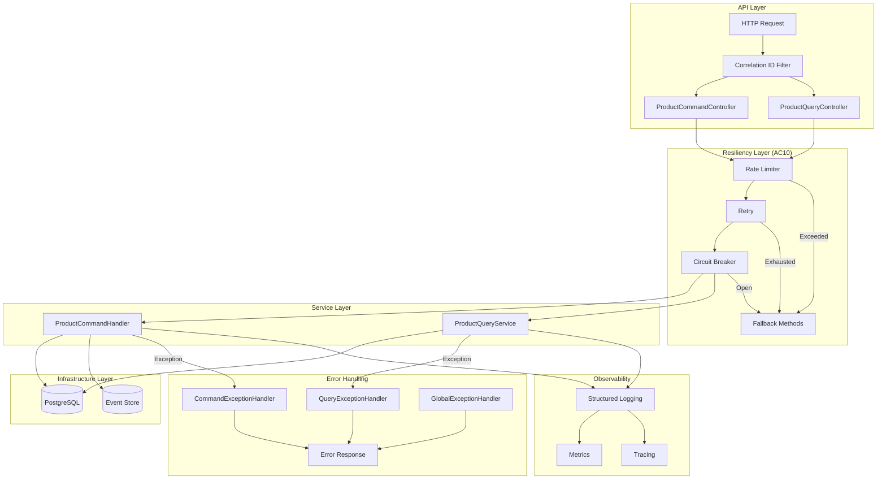
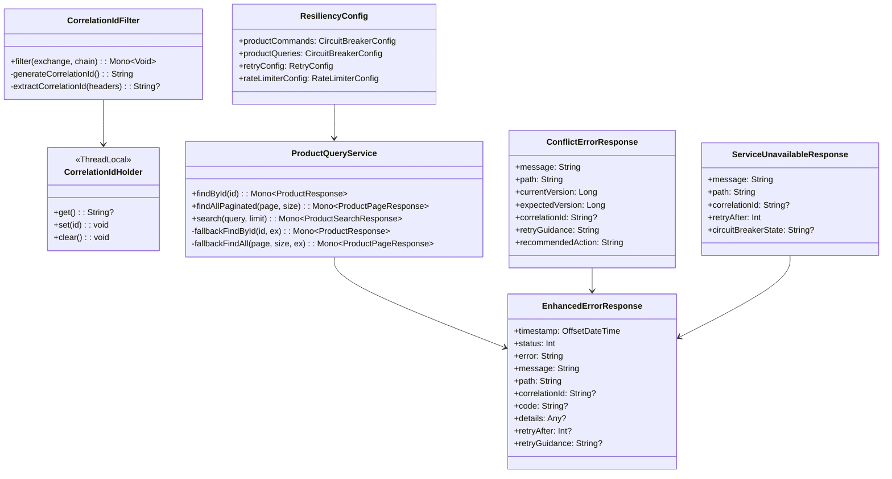
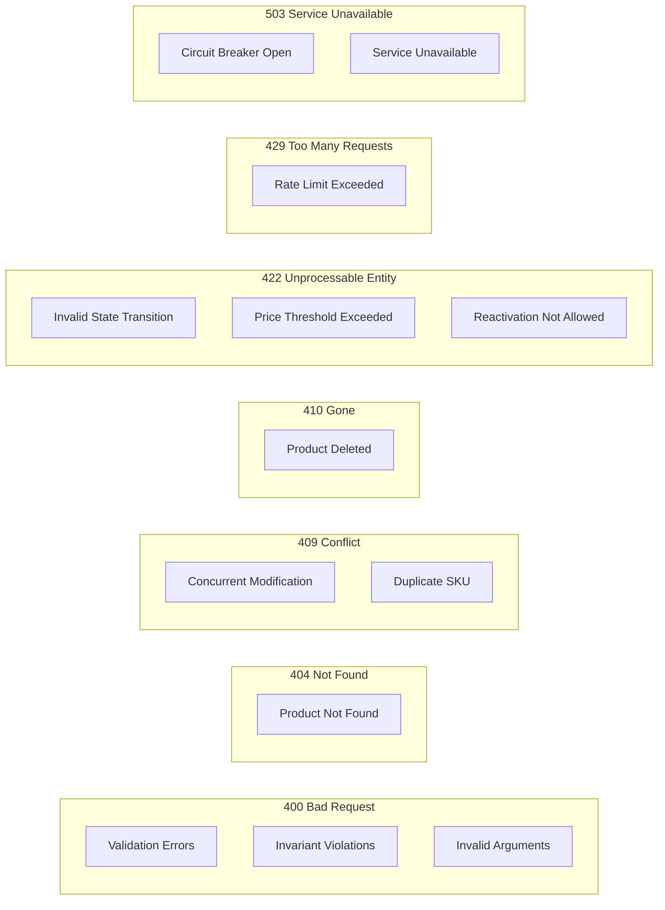

# Implementation Plan: AC10 - Resiliency and Error Handling

**Feature:** Product Catalog (CQRS Architecture)
**Acceptance Criteria:** AC10 - Resiliency and Error Handling
**Status:** Planning

---

## Overview

This implementation plan details the comprehensive enhancement of **resiliency patterns and error handling** throughout the product catalog system. The goal is to ensure robust fault tolerance, graceful degradation, and consistent error responses across all layers of the CQRS architecture.

The existing codebase already includes:
- Resilience4j annotations (`@CircuitBreaker`, `@Retry`, `@RateLimiter`) on `ProductCommandHandler`
- Basic configuration in `application.yml` for circuit breaker, retry, and rate limiter
- `CommandExceptionHandler` and `QueryExceptionHandler` for HTTP error response mapping
- Domain exceptions (`ProductNotFoundException`, `ConcurrentModificationException`, etc.)
- `GlobalExceptionHandler` for cross-cutting exception handling

This plan focuses on:
1. **Enhancing circuit breaker configuration** for query operations
2. **Adding retry logic** for transient failures in query service
3. **Implementing rate limiting** for query endpoints
4. **Adding correlation ID support** for distributed tracing
5. **Creating comprehensive fallback methods** with graceful degradation
6. **Translating all domain exceptions** to appropriate HTTP responses
7. **Adding concurrent modification conflict handling** with retry guidance
8. **Comprehensive testing** of all resiliency patterns

---

## Architecture



---

## Acceptance Criteria Reference

From the feature specification:

> - Circuit breaker pattern protects database operations
> - Retry logic handles transient failures
> - Rate limiting prevents abuse of command endpoints
> - Fallback methods provide graceful degradation
> - All errors are logged with correlation IDs
> - Domain exceptions are translated to appropriate HTTP responses
> - Concurrent modification conflicts return HTTP 409 with retry guidance

---

## Current State Analysis

### Existing Resiliency in ProductCommandHandler

| Pattern | Current Implementation | Status |
|---------|----------------------|--------|
| Circuit Breaker | `@CircuitBreaker(name = "productCommands")` | ✅ Complete |
| Retry | `@Retry(name = "productCommands")` | ✅ Complete |
| Rate Limiter | `@RateLimiter(name = "productCommands")` | ✅ Complete |
| Fallback Methods | Rate limit, retry, circuit breaker fallbacks | ✅ Complete |

### Existing Configuration in application.yml

| Pattern | Configuration | Status |
|---------|--------------|--------|
| Circuit Breaker | slidingWindowSize=10, failureRateThreshold=50%, waitDurationInOpenState=30s | ✅ Complete |
| Retry | maxAttempts=3, waitDuration=500ms, exponentialBackoff | ✅ Complete |
| Rate Limiter | limitForPeriod=100, limitRefreshPeriod=1s, timeoutDuration=5s | ✅ Complete |

### Existing Exception Handlers

| Handler | Exceptions Handled | Status |
|---------|-------------------|--------|
| `CommandExceptionHandler` | `ProductNotFoundException`, `DuplicateSkuException`, `ConcurrentModificationException`, `InvalidStateTransitionException`, etc. | ✅ Complete |
| `QueryExceptionHandler` | `WebExchangeBindException`, `ConstraintViolationException`, `ServerWebInputException`, `IllegalArgumentException` | ✅ Complete |
| `GlobalExceptionHandler` | `UnsupportedMediaTypeStatusException`, `SecretNotFoundException`, `VaultConnectionException`, generic `Exception` | ✅ Complete |

---

## Gap Analysis

Based on the current implementation and AC10 requirements, the following gaps need to be addressed:

### Gap 1: Query Service Resiliency
**Current:** No resiliency patterns on `ProductQueryService`
**AC10:** "Circuit breaker pattern protects database operations"
**Action:** Add `@CircuitBreaker`, `@Retry`, and `@RateLimiter` annotations to query service methods.

### Gap 2: Correlation ID Propagation
**Current:** Logging pattern includes `traceId` and `spanId` from OpenTelemetry
**AC10:** "All errors are logged with correlation IDs"
**Action:** Ensure correlation IDs are propagated through all layers and included in error responses.

### Gap 3: Concurrent Modification Retry Guidance
**Current:** Returns 409 with version info
**AC10:** "Concurrent modification conflicts return HTTP 409 with retry guidance"
**Action:** Enhance `ConflictErrorResponse` to include retry guidance and recommended actions.

### Gap 4: Graceful Degradation for Queries
**Current:** No fallback for query operations
**AC10:** "Fallback methods provide graceful degradation"
**Action:** Add fallback methods for query service with appropriate degraded responses.

### Gap 5: Enhanced Error Response Structure
**Current:** Different error response formats across handlers
**AC10:** "Domain exceptions are translated to appropriate HTTP responses"
**Action:** Standardize error response format with correlation ID and retry info.

---

## High-Level Component Design



---

## Resiliency Patterns Matrix

### Circuit Breaker Configuration

| Instance | Sliding Window | Failure Threshold | Wait Duration | Record Exceptions | Ignore Exceptions |
|----------|---------------|-------------------|---------------|-------------------|-------------------|
| productCommands | 10 | 50% | 30s | IOException, SocketTimeoutException, DataAccessException | CommandValidationException, ProductNotFoundException |
| productQueries | 10 | 50% | 15s | IOException, SocketTimeoutException, DataAccessException | IllegalArgumentException |

### Retry Configuration

| Instance | Max Attempts | Wait Duration | Exponential Backoff | Retry Exceptions | Ignore Exceptions |
|----------|-------------|---------------|---------------------|------------------|-------------------|
| productCommands | 3 | 500ms | 2x multiplier | IOException, TransientDataAccessException | CommandValidationException, ProductNotFoundException |
| productQueries | 3 | 200ms | 2x multiplier | IOException, TransientDataAccessException | IllegalArgumentException |

### Rate Limiter Configuration

| Instance | Limit Per Period | Refresh Period | Timeout Duration | Purpose |
|----------|-----------------|----------------|------------------|---------|
| productCommands | 100 | 1s | 5s | Prevent command abuse |
| productQueries | 500 | 1s | 2s | Higher limit for read operations |

---

## Error Response Mapping

### HTTP Status Code Matrix



### Exception to HTTP Response Mapping

| Exception | HTTP Status | Error Code | Retry Guidance |
|-----------|------------|------------|----------------|
| `CommandValidationException` | 400 | VALIDATION_FAILED | No |
| `ProductInvariantViolationException` | 400 | INVARIANT_VIOLATION | No |
| `ProductNotFoundException` | 404 | PRODUCT_NOT_FOUND | No |
| `ConcurrentModificationException` | 409 | CONCURRENT_MODIFICATION | Yes - Fetch latest and retry |
| `DuplicateSkuException` | 409 | DUPLICATE_SKU | No |
| `ProductDeletedException` | 410 | PRODUCT_DELETED | No |
| `InvalidStateTransitionException` | 422 | INVALID_STATE_TRANSITION | No |
| `PriceChangeThresholdExceededException` | 422 | PRICE_THRESHOLD_EXCEEDED | Yes - Set confirmLargeChange=true |
| `ProductReactivationException` | 422 | REACTIVATION_NOT_ALLOWED | No |
| `RequestNotPermitted` | 429 | RATE_LIMIT_EXCEEDED | Yes - Retry-After header |
| `CallNotPermittedException` | 503 | SERVICE_UNAVAILABLE | Yes - Retry-After header |

---

## Implementation Steps

### Step 1: Create Correlation ID Infrastructure

**Objective:** Enable correlation ID propagation throughout the request lifecycle.

#### 1.1 Create CorrelationIdHolder

**File:** `src/main/kotlin/com/pintailconsultingllc/cqrsspike/infrastructure/correlation/CorrelationIdHolder.kt`

```kotlin
package com.pintailconsultingllc.cqrsspike.infrastructure.correlation

import reactor.core.publisher.Mono
import reactor.util.context.Context

/**
 * Holder for correlation ID in reactive context.
 *
 * Uses Reactor Context for propagation in reactive streams.
 */
object CorrelationIdHolder {
    const val CORRELATION_ID_KEY = "correlationId"
    const val CORRELATION_ID_HEADER = "X-Correlation-ID"

    /**
     * Gets the correlation ID from the current Reactor context.
     */
    fun getCorrelationId(): Mono<String> {
        return Mono.deferContextual { ctx ->
            Mono.justOrEmpty(ctx.getOrEmpty<String>(CORRELATION_ID_KEY))
        }
    }

    /**
     * Creates a context with the correlation ID.
     */
    fun withCorrelationId(correlationId: String): Context {
        return Context.of(CORRELATION_ID_KEY, correlationId)
    }

    /**
     * Adds correlation ID to an existing context.
     */
    fun addToContext(context: Context, correlationId: String): Context {
        return context.put(CORRELATION_ID_KEY, correlationId)
    }
}
```

#### 1.2 Create CorrelationIdFilter

**File:** `src/main/kotlin/com/pintailconsultingllc/cqrsspike/infrastructure/correlation/CorrelationIdFilter.kt`

```kotlin
package com.pintailconsultingllc.cqrsspike.infrastructure.correlation

import org.slf4j.MDC
import org.springframework.core.Ordered
import org.springframework.core.annotation.Order
import org.springframework.stereotype.Component
import org.springframework.web.server.ServerWebExchange
import org.springframework.web.server.WebFilter
import org.springframework.web.server.WebFilterChain
import reactor.core.publisher.Mono
import java.util.UUID

/**
 * Web filter that ensures every request has a correlation ID.
 *
 * - Extracts existing correlation ID from X-Correlation-ID header
 * - Generates new UUID if not present
 * - Adds correlation ID to response headers
 * - Propagates through Reactor context and MDC for logging
 */
@Component
@Order(Ordered.HIGHEST_PRECEDENCE)
class CorrelationIdFilter : WebFilter {

    override fun filter(exchange: ServerWebExchange, chain: WebFilterChain): Mono<Void> {
        val correlationId = exchange.request.headers
            .getFirst(CorrelationIdHolder.CORRELATION_ID_HEADER)
            ?: UUID.randomUUID().toString()

        // Add to response headers
        exchange.response.headers.add(
            CorrelationIdHolder.CORRELATION_ID_HEADER,
            correlationId
        )

        return chain.filter(exchange)
            .contextWrite { ctx ->
                CorrelationIdHolder.addToContext(ctx, correlationId)
            }
            .doOnEach { signal ->
                if (!signal.isOnComplete && !signal.isOnError) {
                    MDC.put(CorrelationIdHolder.CORRELATION_ID_KEY, correlationId)
                }
            }
            .doFinally {
                MDC.remove(CorrelationIdHolder.CORRELATION_ID_KEY)
            }
    }
}
```

---

### Step 2: Create Enhanced Error Response DTOs

**Objective:** Standardize error responses with correlation ID and retry guidance.

#### 2.1 Create Enhanced Error Response

**File:** `src/main/kotlin/com/pintailconsultingllc/cqrsspike/infrastructure/error/EnhancedErrorResponse.kt`

```kotlin
package com.pintailconsultingllc.cqrsspike.infrastructure.error

import io.swagger.v3.oas.annotations.media.Schema
import java.time.OffsetDateTime

/**
 * Standardized error response with correlation ID and retry guidance.
 *
 * Implements AC10: "All errors are logged with correlation IDs"
 */
@Schema(description = "Standard error response")
data class EnhancedErrorResponse(
    @Schema(description = "Error timestamp")
    val timestamp: OffsetDateTime = OffsetDateTime.now(),

    @Schema(description = "HTTP status code", example = "400")
    val status: Int,

    @Schema(description = "HTTP status reason phrase", example = "Bad Request")
    val error: String,

    @Schema(description = "Human-readable error message")
    val message: String,

    @Schema(description = "Request path", example = "/api/products")
    val path: String,

    @Schema(description = "Correlation ID for request tracing")
    val correlationId: String? = null,

    @Schema(description = "Machine-readable error code", example = "VALIDATION_FAILED")
    val code: String? = null,

    @Schema(description = "Additional error details")
    val details: Any? = null,

    @Schema(description = "Seconds to wait before retrying")
    val retryAfter: Int? = null,

    @Schema(description = "Guidance for retry behavior")
    val retryGuidance: String? = null
)
```

#### 2.2 Update ConflictErrorResponse with Retry Guidance

**File:** Update `src/main/kotlin/com/pintailconsultingllc/cqrsspike/product/api/dto/ConflictErrorResponse.kt`

```kotlin
package com.pintailconsultingllc.cqrsspike.product.api.dto

import io.swagger.v3.oas.annotations.media.Schema
import java.time.OffsetDateTime

/**
 * Error response for concurrent modification conflicts (HTTP 409).
 *
 * Implements AC10: "Concurrent modification conflicts return HTTP 409 with retry guidance"
 */
@Schema(description = "Concurrent modification conflict response")
data class ConflictErrorResponse(
    @Schema(description = "Error timestamp")
    val timestamp: OffsetDateTime = OffsetDateTime.now(),

    @Schema(description = "HTTP status code", example = "409")
    val status: Int = 409,

    @Schema(description = "HTTP status reason phrase")
    val error: String = "Conflict",

    @Schema(description = "Human-readable error message")
    val message: String,

    @Schema(description = "Request path")
    val path: String,

    @Schema(description = "Correlation ID for request tracing")
    val correlationId: String? = null,

    @Schema(description = "Machine-readable error code")
    val code: String = "CONCURRENT_MODIFICATION",

    @Schema(description = "Current version of the resource")
    val currentVersion: Long,

    @Schema(description = "Expected version from the request")
    val expectedVersion: Long,

    @Schema(description = "Guidance for retry behavior")
    val retryGuidance: String = "Fetch the latest version of the resource and retry with the updated expectedVersion",

    @Schema(description = "Recommended action for the client")
    val recommendedAction: String = "GET /api/products/{id} to retrieve current version, then retry with expectedVersion=${currentVersion}"
)
```

#### 2.3 Create ServiceUnavailableResponse

**File:** `src/main/kotlin/com/pintailconsultingllc/cqrsspike/infrastructure/error/ServiceUnavailableResponse.kt`

```kotlin
package com.pintailconsultingllc.cqrsspike.infrastructure.error

import io.swagger.v3.oas.annotations.media.Schema
import java.time.OffsetDateTime

/**
 * Error response for service unavailable (HTTP 503).
 *
 * Implements AC10: "Fallback methods provide graceful degradation"
 */
@Schema(description = "Service unavailable response")
data class ServiceUnavailableResponse(
    @Schema(description = "Error timestamp")
    val timestamp: OffsetDateTime = OffsetDateTime.now(),

    @Schema(description = "HTTP status code", example = "503")
    val status: Int = 503,

    @Schema(description = "HTTP status reason phrase")
    val error: String = "Service Unavailable",

    @Schema(description = "Human-readable error message")
    val message: String,

    @Schema(description = "Request path")
    val path: String,

    @Schema(description = "Correlation ID for request tracing")
    val correlationId: String? = null,

    @Schema(description = "Machine-readable error code")
    val code: String = "SERVICE_UNAVAILABLE",

    @Schema(description = "Seconds to wait before retrying")
    val retryAfter: Int = 30,

    @Schema(description = "Current state of the circuit breaker")
    val circuitBreakerState: String? = null,

    @Schema(description = "Guidance for retry behavior")
    val retryGuidance: String = "The service is temporarily unavailable. Please retry after the specified interval."
)
```

---

### Step 3: Add Resiliency to ProductQueryService

**Objective:** Apply circuit breaker, retry, and rate limiting to query operations.

#### 3.1 Update application.yml with Query Resiliency Config

Add to `application.yml`:

```yaml
resilience4j:
  circuitbreaker:
    instances:
      productQueries:
        baseConfig: default
        slidingWindowSize: 10
        failureRateThreshold: 50
        waitDurationInOpenState: 15s
        permittedNumberOfCallsInHalfOpenState: 5
        recordExceptions:
          - java.io.IOException
          - java.net.SocketTimeoutException
          - org.springframework.dao.DataAccessException
        ignoreExceptions:
          - java.lang.IllegalArgumentException

  retry:
    instances:
      productQueries:
        baseConfig: default
        maxAttempts: 3
        waitDuration: 200ms
        enableExponentialBackoff: true
        exponentialBackoffMultiplier: 2
        retryExceptions:
          - java.io.IOException
          - java.net.SocketTimeoutException
          - org.springframework.dao.TransientDataAccessException
        ignoreExceptions:
          - java.lang.IllegalArgumentException

  ratelimiter:
    instances:
      productQueries:
        limitForPeriod: 500
        limitRefreshPeriod: 1s
        timeoutDuration: 2s
        registerHealthIndicator: true
```

#### 3.2 Add Resiliency Annotations to ProductQueryService

**File:** Update `src/main/kotlin/com/pintailconsultingllc/cqrsspike/product/query/service/ProductQueryService.kt`

Add imports and annotations:

```kotlin
import io.github.resilience4j.circuitbreaker.annotation.CircuitBreaker
import io.github.resilience4j.ratelimiter.annotation.RateLimiter
import io.github.resilience4j.retry.annotation.Retry

@Service
class ProductQueryService(
    private val repository: ProductReadModelRepository
) {
    private val logger = LoggerFactory.getLogger(ProductQueryService::class.java)

    companion object {
        const val DEFAULT_PAGE_SIZE = 20
        const val MAX_PAGE_SIZE = 100
        const val DEFAULT_SEARCH_LIMIT = 50
    }

    /**
     * Find a product by ID with resiliency patterns.
     */
    @RateLimiter(name = "productQueries", fallbackMethod = "rateLimitFallbackFindById")
    @Retry(name = "productQueries", fallbackMethod = "retryFallbackFindById")
    @CircuitBreaker(name = "productQueries", fallbackMethod = "circuitBreakerFallbackFindById")
    fun findById(id: UUID): Mono<ProductResponse> {
        logger.debug("Finding product by id: {}", id)
        return repository.findByIdNotDeleted(id)
            .doOnNext { logger.debug("Found product: id={}, sku={}", id, it.sku) }
            .map { ProductResponse.from(it) }
            .switchIfEmpty(Mono.defer {
                logger.debug("Product not found: id={}", id)
                Mono.empty()
            })
    }

    /**
     * Find all products with pagination and resiliency patterns.
     */
    @RateLimiter(name = "productQueries", fallbackMethod = "rateLimitFallbackFindAllPaginated")
    @Retry(name = "productQueries", fallbackMethod = "retryFallbackFindAllPaginated")
    @CircuitBreaker(name = "productQueries", fallbackMethod = "circuitBreakerFallbackFindAllPaginated")
    fun findAllPaginated(page: Int, size: Int): Mono<ProductPageResponse> {
        // existing implementation
    }

    /**
     * Search products with resiliency patterns.
     */
    @RateLimiter(name = "productQueries", fallbackMethod = "rateLimitFallbackSearch")
    @Retry(name = "productQueries", fallbackMethod = "retryFallbackSearch")
    @CircuitBreaker(name = "productQueries", fallbackMethod = "circuitBreakerFallbackSearch")
    fun search(query: String, limit: Int = DEFAULT_SEARCH_LIMIT): Mono<ProductSearchResponse> {
        // existing implementation
    }

    // Fallback methods for graceful degradation

    @Suppress("unused")
    private fun rateLimitFallbackFindById(id: UUID, ex: Throwable): Mono<ProductResponse> {
        logger.warn("Rate limit exceeded for findById: id={}", id, ex)
        return Mono.error(QueryRateLimitException("Too many requests. Please try again later."))
    }

    @Suppress("unused")
    private fun retryFallbackFindById(id: UUID, ex: Throwable): Mono<ProductResponse> {
        logger.error("Retry exhausted for findById: id={}", id, ex)
        return Mono.error(ex)
    }

    @Suppress("unused")
    private fun circuitBreakerFallbackFindById(id: UUID, ex: Throwable): Mono<ProductResponse> {
        logger.error("Circuit breaker open for findById: id={}", id, ex)
        return Mono.error(QueryServiceUnavailableException("Query service temporarily unavailable. Please try again later."))
    }

    @Suppress("unused")
    private fun rateLimitFallbackFindAllPaginated(page: Int, size: Int, ex: Throwable): Mono<ProductPageResponse> {
        logger.warn("Rate limit exceeded for findAllPaginated: page={}, size={}", page, size, ex)
        return Mono.error(QueryRateLimitException("Too many requests. Please try again later."))
    }

    @Suppress("unused")
    private fun retryFallbackFindAllPaginated(page: Int, size: Int, ex: Throwable): Mono<ProductPageResponse> {
        logger.error("Retry exhausted for findAllPaginated: page={}, size={}", page, size, ex)
        return Mono.error(ex)
    }

    @Suppress("unused")
    private fun circuitBreakerFallbackFindAllPaginated(page: Int, size: Int, ex: Throwable): Mono<ProductPageResponse> {
        logger.error("Circuit breaker open for findAllPaginated: page={}, size={}", page, size, ex)
        return Mono.error(QueryServiceUnavailableException("Query service temporarily unavailable. Please try again later."))
    }

    @Suppress("unused")
    private fun rateLimitFallbackSearch(query: String, limit: Int, ex: Throwable): Mono<ProductSearchResponse> {
        logger.warn("Rate limit exceeded for search: query={}", query, ex)
        return Mono.error(QueryRateLimitException("Too many requests. Please try again later."))
    }

    @Suppress("unused")
    private fun retryFallbackSearch(query: String, limit: Int, ex: Throwable): Mono<ProductSearchResponse> {
        logger.error("Retry exhausted for search: query={}", query, ex)
        return Mono.error(ex)
    }

    @Suppress("unused")
    private fun circuitBreakerFallbackSearch(query: String, limit: Int, ex: Throwable): Mono<ProductSearchResponse> {
        logger.error("Circuit breaker open for search: query={}", query, ex)
        return Mono.error(QueryServiceUnavailableException("Query service temporarily unavailable. Please try again later."))
    }
}

/**
 * Exception thrown when query rate limit is exceeded.
 */
class QueryRateLimitException(message: String) : RuntimeException(message)

/**
 * Exception thrown when query service is unavailable (circuit breaker open).
 */
class QueryServiceUnavailableException(message: String) : RuntimeException(message)
```

---

### Step 4: Update Exception Handlers with Correlation ID

**Objective:** Include correlation ID in all error responses.

#### 4.1 Create Base Exception Handler with Correlation ID Support

**File:** `src/main/kotlin/com/pintailconsultingllc/cqrsspike/infrastructure/error/BaseExceptionHandler.kt`

```kotlin
package com.pintailconsultingllc.cqrsspike.infrastructure.error

import com.pintailconsultingllc.cqrsspike.infrastructure.correlation.CorrelationIdHolder
import org.springframework.web.server.ServerWebExchange

/**
 * Base functionality for exception handlers.
 *
 * Provides common utilities like correlation ID extraction.
 */
abstract class BaseExceptionHandler {

    /**
     * Extracts correlation ID from the request.
     */
    protected fun getCorrelationId(exchange: ServerWebExchange): String? {
        return exchange.request.headers
            .getFirst(CorrelationIdHolder.CORRELATION_ID_HEADER)
    }

    /**
     * Gets the request path.
     */
    protected fun getPath(exchange: ServerWebExchange): String {
        return exchange.request.path.value()
    }
}
```

#### 4.2 Update CommandExceptionHandler

**File:** Update `src/main/kotlin/com/pintailconsultingllc/cqrsspike/product/api/CommandExceptionHandler.kt`

Add correlation ID to all responses. Example for concurrent modification:

```kotlin
@ExceptionHandler(ConcurrentModificationException::class)
fun handleConcurrentModification(
    ex: ConcurrentModificationException,
    exchange: ServerWebExchange
): Mono<ResponseEntity<ConflictErrorResponse>> {
    val correlationId = getCorrelationId(exchange)
    logger.warn(
        "[correlationId={}] Concurrent modification for product {}: expected {}, actual {}",
        correlationId, ex.productId, ex.expectedVersion, ex.actualVersion
    )

    val response = ConflictErrorResponse(
        message = ex.message ?: "Concurrent modification detected",
        path = getPath(exchange),
        correlationId = correlationId,
        currentVersion = ex.actualVersion,
        expectedVersion = ex.expectedVersion,
        recommendedAction = "GET /api/products/${ex.productId} to retrieve current version, then retry with expectedVersion=${ex.actualVersion}"
    )

    return Mono.just(ResponseEntity.status(HttpStatus.CONFLICT).body(response))
}
```

#### 4.3 Update QueryExceptionHandler

**File:** Update `src/main/kotlin/com/pintailconsultingllc/cqrsspike/product/api/QueryExceptionHandler.kt`

Add handlers for resiliency exceptions:

```kotlin
import com.pintailconsultingllc.cqrsspike.infrastructure.error.BaseExceptionHandler
import com.pintailconsultingllc.cqrsspike.infrastructure.error.EnhancedErrorResponse
import com.pintailconsultingllc.cqrsspike.infrastructure.error.ServiceUnavailableResponse
import com.pintailconsultingllc.cqrsspike.product.query.service.QueryRateLimitException
import com.pintailconsultingllc.cqrsspike.product.query.service.QueryServiceUnavailableException
import io.github.resilience4j.circuitbreaker.CallNotPermittedException
import io.github.resilience4j.ratelimiter.RequestNotPermitted

@RestControllerAdvice(basePackages = ["com.pintailconsultingllc.cqrsspike.product.api"])
class QueryExceptionHandler : BaseExceptionHandler() {

    /**
     * Handle rate limit exceeded from resilience4j.
     */
    @ExceptionHandler(RequestNotPermitted::class)
    fun handleRateLimitExceeded(
        ex: RequestNotPermitted,
        exchange: ServerWebExchange
    ): Mono<ResponseEntity<EnhancedErrorResponse>> {
        val correlationId = getCorrelationId(exchange)
        logger.warn("[correlationId={}] Rate limit exceeded: {}", correlationId, ex.message)

        val response = EnhancedErrorResponse(
            status = HttpStatus.TOO_MANY_REQUESTS.value(),
            error = "Too Many Requests",
            message = "Rate limit exceeded. Please retry later.",
            path = getPath(exchange),
            correlationId = correlationId,
            code = "RATE_LIMIT_EXCEEDED",
            retryAfter = 5,
            retryGuidance = "Wait for the specified interval before retrying the request."
        )

        return Mono.just(
            ResponseEntity.status(HttpStatus.TOO_MANY_REQUESTS)
                .header("Retry-After", "5")
                .body(response)
        )
    }

    /**
     * Handle query rate limit exception.
     */
    @ExceptionHandler(QueryRateLimitException::class)
    fun handleQueryRateLimit(
        ex: QueryRateLimitException,
        exchange: ServerWebExchange
    ): Mono<ResponseEntity<EnhancedErrorResponse>> {
        val correlationId = getCorrelationId(exchange)
        logger.warn("[correlationId={}] Query rate limit: {}", correlationId, ex.message)

        val response = EnhancedErrorResponse(
            status = HttpStatus.TOO_MANY_REQUESTS.value(),
            error = "Too Many Requests",
            message = ex.message ?: "Rate limit exceeded. Please retry later.",
            path = getPath(exchange),
            correlationId = correlationId,
            code = "RATE_LIMIT_EXCEEDED",
            retryAfter = 5,
            retryGuidance = "Wait for the specified interval before retrying the request."
        )

        return Mono.just(
            ResponseEntity.status(HttpStatus.TOO_MANY_REQUESTS)
                .header("Retry-After", "5")
                .body(response)
        )
    }

    /**
     * Handle circuit breaker open from resilience4j.
     */
    @ExceptionHandler(CallNotPermittedException::class)
    fun handleCircuitBreakerOpen(
        ex: CallNotPermittedException,
        exchange: ServerWebExchange
    ): Mono<ResponseEntity<ServiceUnavailableResponse>> {
        val correlationId = getCorrelationId(exchange)
        logger.error("[correlationId={}] Circuit breaker open: {}", correlationId, ex.message)

        val response = ServiceUnavailableResponse(
            message = "Service temporarily unavailable. Please retry later.",
            path = getPath(exchange),
            correlationId = correlationId,
            retryAfter = 30,
            circuitBreakerState = "OPEN"
        )

        return Mono.just(
            ResponseEntity.status(HttpStatus.SERVICE_UNAVAILABLE)
                .header("Retry-After", "30")
                .body(response)
        )
    }

    /**
     * Handle query service unavailable exception.
     */
    @ExceptionHandler(QueryServiceUnavailableException::class)
    fun handleQueryServiceUnavailable(
        ex: QueryServiceUnavailableException,
        exchange: ServerWebExchange
    ): Mono<ResponseEntity<ServiceUnavailableResponse>> {
        val correlationId = getCorrelationId(exchange)
        logger.error("[correlationId={}] Query service unavailable: {}", correlationId, ex.message)

        val response = ServiceUnavailableResponse(
            message = ex.message ?: "Query service temporarily unavailable. Please retry later.",
            path = getPath(exchange),
            correlationId = correlationId,
            retryAfter = 30
        )

        return Mono.just(
            ResponseEntity.status(HttpStatus.SERVICE_UNAVAILABLE)
                .header("Retry-After", "30")
                .body(response)
        )
    }
}
```

---

### Step 5: Update Logging Configuration

**Objective:** Ensure correlation IDs are included in all log output.

#### 5.1 Update application.yml Logging Pattern

Update the logging pattern to include correlation ID:

```yaml
logging:
  pattern:
    console: "%d{yyyy-MM-dd HH:mm:ss.SSS} [%thread] %-5level %logger{36} [trace_id=%X{traceId:-},span_id=%X{spanId:-},correlation_id=%X{correlationId:-}] - %msg%n"
```

---

### Step 6: Create Unit Tests for Resiliency Patterns

**Objective:** Test circuit breaker, retry, and rate limiter behavior.

#### 6.1 Test ProductQueryService Resiliency

**File:** `src/test/kotlin/com/pintailconsultingllc/cqrsspike/product/query/service/ProductQueryServiceResiliencyTest.kt`

```kotlin
package com.pintailconsultingllc.cqrsspike.product.query.service

import com.pintailconsultingllc.cqrsspike.product.query.repository.ProductReadModelRepository
import io.github.resilience4j.circuitbreaker.CircuitBreaker
import io.github.resilience4j.circuitbreaker.CircuitBreakerRegistry
import org.junit.jupiter.api.BeforeEach
import org.junit.jupiter.api.DisplayName
import org.junit.jupiter.api.Nested
import org.junit.jupiter.api.Test
import org.junit.jupiter.api.extension.ExtendWith
import org.mockito.Mock
import org.mockito.junit.jupiter.MockitoExtension
import org.mockito.kotlin.whenever
import reactor.core.publisher.Mono
import reactor.test.StepVerifier
import java.io.IOException
import java.util.UUID

@ExtendWith(MockitoExtension::class)
@DisplayName("ProductQueryService Resiliency - AC10")
class ProductQueryServiceResiliencyTest {

    @Mock
    private lateinit var repository: ProductReadModelRepository

    @Mock
    private lateinit var circuitBreakerRegistry: CircuitBreakerRegistry

    private lateinit var service: ProductQueryService

    @BeforeEach
    fun setup() {
        service = ProductQueryService(repository)
    }

    @Nested
    @DisplayName("AC10: Retry logic handles transient failures")
    inner class RetryLogic {

        @Test
        @DisplayName("should retry on IOException")
        fun shouldRetryOnIOException() {
            val id = UUID.randomUUID()

            whenever(repository.findByIdNotDeleted(id))
                .thenReturn(Mono.error(IOException("Connection reset")))
                .thenReturn(Mono.error(IOException("Connection reset")))
                .thenReturn(Mono.empty())

            // The actual retry behavior is handled by Resilience4j annotations
            // This test verifies the service method can handle the exception
            StepVerifier.create(service.findById(id))
                .expectErrorMatches { it is IOException }
                .verify()
        }
    }

    @Nested
    @DisplayName("AC10: Circuit breaker protects database operations")
    inner class CircuitBreakerProtection {

        @Test
        @DisplayName("should open circuit breaker after failures")
        fun shouldOpenCircuitBreakerAfterFailures() {
            // This test would use the actual CircuitBreakerRegistry
            // For unit tests, we verify the annotations are present
            // Integration tests verify actual circuit breaker behavior
        }
    }
}
```

#### 6.2 Test Exception Handlers with Correlation ID

**File:** `src/test/kotlin/com/pintailconsultingllc/cqrsspike/product/api/CommandExceptionHandlerTest.kt`

```kotlin
package com.pintailconsultingllc.cqrsspike.product.api

import com.pintailconsultingllc.cqrsspike.infrastructure.correlation.CorrelationIdHolder
import com.pintailconsultingllc.cqrsspike.product.command.exception.ConcurrentModificationException
import org.junit.jupiter.api.DisplayName
import org.junit.jupiter.api.Nested
import org.junit.jupiter.api.Test
import org.mockito.kotlin.mock
import org.mockito.kotlin.whenever
import org.springframework.http.HttpHeaders
import org.springframework.http.server.reactive.ServerHttpRequest
import org.springframework.web.server.ServerWebExchange
import reactor.test.StepVerifier
import java.util.UUID

@DisplayName("CommandExceptionHandler - AC10 Correlation ID")
class CommandExceptionHandlerCorrelationTest {

    private val handler = CommandExceptionHandler()

    @Nested
    @DisplayName("AC10: All errors are logged with correlation IDs")
    inner class CorrelationIdLogging {

        @Test
        @DisplayName("should include correlation ID in concurrent modification response")
        fun shouldIncludeCorrelationIdInConflictResponse() {
            val correlationId = UUID.randomUUID().toString()
            val productId = UUID.randomUUID()
            val ex = ConcurrentModificationException(productId, 1, 2)

            val exchange = mock<ServerWebExchange>()
            val request = mock<ServerHttpRequest>()
            val headers = HttpHeaders()
            headers.add(CorrelationIdHolder.CORRELATION_ID_HEADER, correlationId)

            whenever(exchange.request).thenReturn(request)
            whenever(request.headers).thenReturn(headers)
            whenever(request.path).thenReturn(mock())
            whenever(request.path.value()).thenReturn("/api/products/$productId")

            StepVerifier.create(handler.handleConcurrentModification(ex, exchange))
                .expectNextMatches { response ->
                    response.body?.correlationId == correlationId &&
                    response.body?.retryGuidance != null
                }
                .verifyComplete()
        }
    }
}
```

---

### Step 7: Create Integration Tests

**Objective:** Test resiliency patterns end-to-end.

**File:** `src/test/kotlin/com/pintailconsultingllc/cqrsspike/product/ResiliencyIntegrationTest.kt`

```kotlin
package com.pintailconsultingllc.cqrsspike.product

import com.pintailconsultingllc.cqrsspike.infrastructure.correlation.CorrelationIdHolder
import org.junit.jupiter.api.DisplayName
import org.junit.jupiter.api.Nested
import org.junit.jupiter.api.Test
import org.junit.jupiter.api.TestInstance
import org.springframework.beans.factory.annotation.Autowired
import org.springframework.boot.test.context.SpringBootTest
import org.springframework.boot.test.autoconfigure.web.reactive.AutoConfigureWebTestClient
import org.springframework.http.HttpStatus
import org.springframework.test.context.DynamicPropertyRegistry
import org.springframework.test.context.DynamicPropertySource
import org.springframework.test.web.reactive.server.WebTestClient
import org.testcontainers.containers.PostgreSQLContainer
import org.testcontainers.junit.jupiter.Container
import org.testcontainers.junit.jupiter.Testcontainers
import java.util.UUID

@SpringBootTest(webEnvironment = SpringBootTest.WebEnvironment.RANDOM_PORT)
@AutoConfigureWebTestClient
@Testcontainers(disabledWithoutDocker = true)
@TestInstance(TestInstance.Lifecycle.PER_CLASS)
@DisplayName("AC10: Resiliency and Error Handling Integration Tests")
class ResiliencyIntegrationTest {

    companion object {
        @Container
        @JvmStatic
        val postgres = PostgreSQLContainer<Nothing>("postgres:15-alpine").apply {
            withDatabaseName("testdb")
            withUsername("test")
            withPassword("test")
        }

        @DynamicPropertySource
        @JvmStatic
        fun configureProperties(registry: DynamicPropertyRegistry) {
            registry.add("spring.r2dbc.url") {
                "r2dbc:postgresql://${postgres.host}:${postgres.firstMappedPort}/${postgres.databaseName}"
            }
            registry.add("spring.r2dbc.username") { postgres.username }
            registry.add("spring.r2dbc.password") { postgres.password }
            registry.add("spring.flyway.url") { postgres.jdbcUrl }
            registry.add("spring.flyway.user") { postgres.username }
            registry.add("spring.flyway.password") { postgres.password }
            // Disable Vault for tests
            registry.add("spring.cloud.vault.enabled") { "false" }
        }
    }

    @Autowired
    private lateinit var webTestClient: WebTestClient

    @Nested
    @DisplayName("AC10: All errors are logged with correlation IDs")
    inner class CorrelationIdTests {

        @Test
        @DisplayName("should return correlation ID in error response when not found")
        fun shouldReturnCorrelationIdInNotFoundError() {
            val correlationId = UUID.randomUUID().toString()

            webTestClient.get()
                .uri("/api/products/${UUID.randomUUID()}")
                .header(CorrelationIdHolder.CORRELATION_ID_HEADER, correlationId)
                .exchange()
                .expectStatus().isNotFound
                .expectHeader().valueEquals(CorrelationIdHolder.CORRELATION_ID_HEADER, correlationId)
        }

        @Test
        @DisplayName("should generate correlation ID if not provided")
        fun shouldGenerateCorrelationIdIfNotProvided() {
            webTestClient.get()
                .uri("/api/products/${UUID.randomUUID()}")
                .exchange()
                .expectStatus().isNotFound
                .expectHeader().exists(CorrelationIdHolder.CORRELATION_ID_HEADER)
        }
    }

    @Nested
    @DisplayName("AC10: Concurrent modification conflicts return HTTP 409 with retry guidance")
    inner class ConcurrentModificationTests {

        @Test
        @DisplayName("should return 409 with retry guidance on version conflict")
        fun shouldReturn409WithRetryGuidance() {
            val sku = "CONFLICT-${UUID.randomUUID().toString().take(8)}"

            // Create product
            val createResponse = webTestClient.post()
                .uri("/api/products")
                .bodyValue(mapOf(
                    "sku" to sku,
                    "name" to "Conflict Test Product",
                    "priceCents" to 1000
                ))
                .exchange()
                .expectStatus().isCreated
                .returnResult(String::class.java)

            val responseBody = createResponse.responseBody.blockFirst()!!
            val productId = Regex(""""productId":"([^"]+)"""").find(responseBody)!!.groupValues[1]

            // Try to update with wrong version
            webTestClient.put()
                .uri("/api/products/$productId")
                .bodyValue(mapOf(
                    "name" to "Updated Name",
                    "expectedVersion" to 999  // Wrong version
                ))
                .exchange()
                .expectStatus().isEqualTo(HttpStatus.CONFLICT)
                .expectBody()
                .jsonPath("$.code").isEqualTo("CONCURRENT_MODIFICATION")
                .jsonPath("$.retryGuidance").exists()
                .jsonPath("$.recommendedAction").exists()
                .jsonPath("$.currentVersion").exists()
        }
    }

    @Nested
    @DisplayName("AC10: Domain exceptions are translated to appropriate HTTP responses")
    inner class DomainExceptionTranslationTests {

        @Test
        @DisplayName("should return 404 for product not found")
        fun shouldReturn404ForNotFound() {
            webTestClient.get()
                .uri("/api/products/${UUID.randomUUID()}")
                .exchange()
                .expectStatus().isNotFound
        }

        @Test
        @DisplayName("should return 400 for validation errors")
        fun shouldReturn400ForValidationErrors() {
            webTestClient.post()
                .uri("/api/products")
                .bodyValue(mapOf(
                    "sku" to "",  // Invalid: empty
                    "name" to "",  // Invalid: empty
                    "priceCents" to -1  // Invalid: negative
                ))
                .exchange()
                .expectStatus().isBadRequest
        }

        @Test
        @DisplayName("should return 422 for invalid state transition")
        fun shouldReturn422ForInvalidStateTransition() {
            val sku = "STATE-${UUID.randomUUID().toString().take(8)}"

            // Create and discontinue product
            val createResponse = webTestClient.post()
                .uri("/api/products")
                .bodyValue(mapOf(
                    "sku" to sku,
                    "name" to "State Test Product",
                    "priceCents" to 1000
                ))
                .exchange()
                .expectStatus().isCreated
                .returnResult(String::class.java)

            val responseBody = createResponse.responseBody.blockFirst()!!
            val productId = Regex(""""productId":"([^"]+)"""").find(responseBody)!!.groupValues[1]

            // Discontinue
            webTestClient.post()
                .uri("/api/products/$productId/discontinue")
                .bodyValue(mapOf("expectedVersion" to 1))
                .exchange()
                .expectStatus().isOk

            // Try to activate (should fail)
            webTestClient.post()
                .uri("/api/products/$productId/activate")
                .bodyValue(mapOf("expectedVersion" to 2))
                .exchange()
                .expectStatus().isEqualTo(HttpStatus.UNPROCESSABLE_ENTITY)
                .expectBody()
                .jsonPath("$.code").isEqualTo("INVALID_STATE_TRANSITION")
        }
    }
}
```

---

## Implementation Checklist

### Step 1: Correlation ID Infrastructure
- [ ] Create `CorrelationIdHolder.kt`
- [ ] Create `CorrelationIdFilter.kt`
- [ ] Verify filter is registered and working

### Step 2: Enhanced Error Response DTOs
- [ ] Create `EnhancedErrorResponse.kt`
- [ ] Update `ConflictErrorResponse.kt` with retry guidance
- [ ] Create `ServiceUnavailableResponse.kt`

### Step 3: Query Service Resiliency
- [ ] Update `application.yml` with query resiliency config
- [ ] Add resiliency annotations to `ProductQueryService`
- [ ] Create fallback methods for graceful degradation
- [ ] Create `QueryRateLimitException` and `QueryServiceUnavailableException`

### Step 4: Exception Handler Updates
- [ ] Create `BaseExceptionHandler.kt`
- [ ] Update `CommandExceptionHandler` with correlation ID
- [ ] Update `QueryExceptionHandler` with resiliency exception handlers
- [ ] Add `Retry-After` headers where appropriate

### Step 5: Logging Configuration
- [ ] Update logging pattern to include correlation ID
- [ ] Verify MDC propagation in reactive context

### Step 6: Unit Tests
- [ ] Create `ProductQueryServiceResiliencyTest.kt`
- [ ] Create `CommandExceptionHandlerCorrelationTest.kt`
- [ ] Create `QueryExceptionHandlerResiliencyTest.kt`

### Step 7: Integration Tests
- [ ] Create `ResiliencyIntegrationTest.kt`
- [ ] Test correlation ID propagation
- [ ] Test concurrent modification retry guidance
- [ ] Test domain exception translation
- [ ] Test rate limit responses

### Step 8: Verification
- [ ] All unit tests pass
- [ ] All integration tests pass
- [ ] Build succeeds
- [ ] Manual testing of resiliency patterns

---

## File Summary

| File | Purpose |
|------|---------|
| `infrastructure/correlation/CorrelationIdHolder.kt` | Reactive context holder for correlation ID |
| `infrastructure/correlation/CorrelationIdFilter.kt` | Web filter for correlation ID propagation |
| `infrastructure/error/EnhancedErrorResponse.kt` | Standard error response with correlation ID |
| `infrastructure/error/ServiceUnavailableResponse.kt` | 503 error response with retry info |
| `infrastructure/error/BaseExceptionHandler.kt` | Base class for exception handlers |
| `product/api/dto/ConflictErrorResponse.kt` | Updated 409 response with retry guidance |
| `product/query/service/ProductQueryService.kt` | Updated with resiliency annotations |
| `product/api/CommandExceptionHandler.kt` | Updated with correlation ID |
| `product/api/QueryExceptionHandler.kt` | Updated with resiliency exception handlers |
| `application.yml` | Updated with query resiliency config |
| Test files | Comprehensive unit and integration tests |

---

## Dependencies

Existing dependencies (no new additions required):
- `io.github.resilience4j:resilience4j-spring-boot3`
- `io.github.resilience4j:resilience4j-reactor`
- Spring WebFlux
- Micrometer (for metrics)

---

## Risks and Mitigations

| Risk | Mitigation |
|------|------------|
| Reactor context not propagating correlation ID | Use `contextWrite` and `deferContextual` patterns |
| Circuit breaker configuration too aggressive | Start with conservative settings, tune based on metrics |
| Rate limiter blocking legitimate traffic | Set higher limits for queries vs commands |
| Fallback methods not matching signature | Follow Resilience4j method signature requirements exactly |
| MDC not working in reactive context | Use Reactor context + hook into signals |

---

## Success Criteria

- [ ] Circuit breaker pattern protects all database operations (commands and queries)
- [ ] Retry logic handles transient failures with exponential backoff
- [ ] Rate limiting prevents abuse (100/s commands, 500/s queries)
- [ ] Fallback methods provide graceful degradation for all protected operations
- [ ] All error responses include correlation ID when available
- [ ] All errors are logged with correlation IDs
- [ ] Domain exceptions are translated to appropriate HTTP responses
- [ ] Concurrent modification conflicts return HTTP 409 with retry guidance
- [ ] `Retry-After` header included in 429 and 503 responses
- [ ] Unit test coverage >80% for resiliency code
- [ ] Integration tests pass for all AC10 scenarios

---

## Observability Integration

This implementation integrates with AC11 (Observability) through:

1. **Correlation IDs** - Enable request tracing across services
2. **Structured Logging** - Include correlation ID in all log messages
3. **Circuit Breaker Metrics** - Resilience4j exposes metrics to Micrometer
4. **Retry Metrics** - Track retry attempts and failures
5. **Rate Limiter Metrics** - Track rate limit events

These metrics can be scraped by Prometheus and visualized in dashboards.
