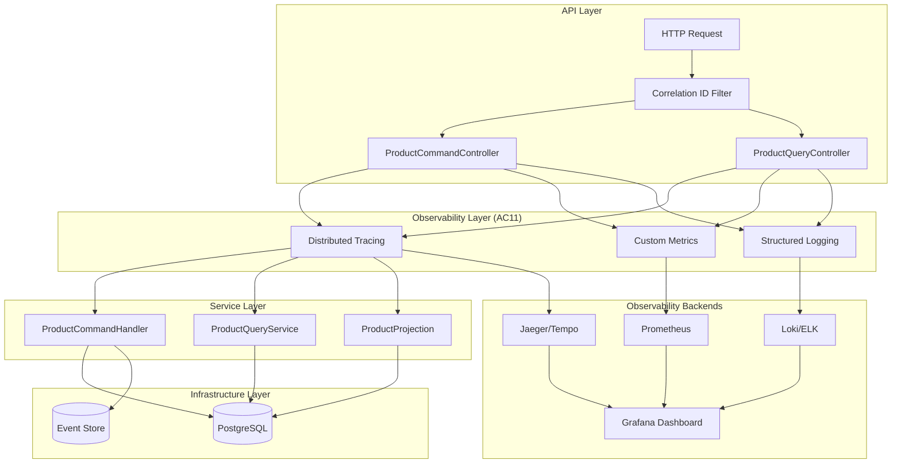
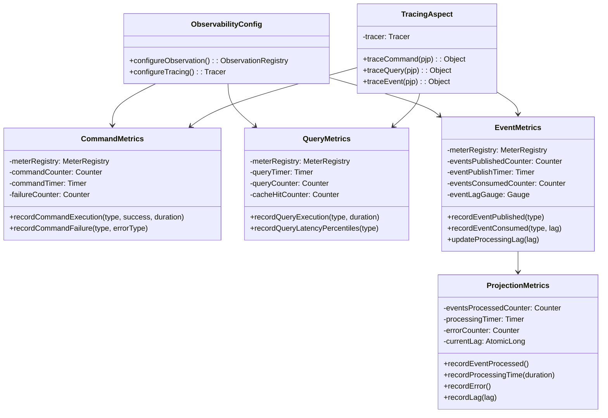
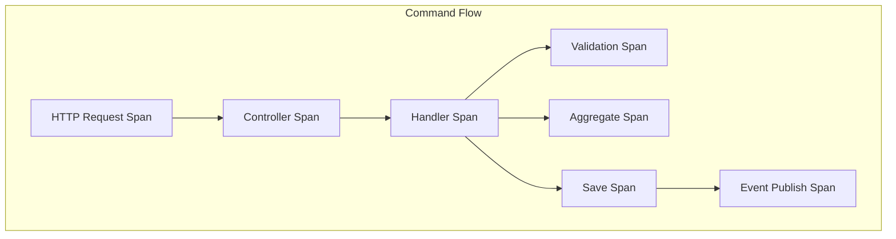

# Implementation Plan: AC11 - Observability

**Feature:** Product Catalog (CQRS Architecture)
**Acceptance Criteria:** AC11 - Observability
**Status:** Planning

---

## Overview

This implementation plan details the comprehensive observability infrastructure for the product catalog system. The goal is to provide complete visibility into system behavior through distributed tracing, custom metrics, and structured logging, enabling effective monitoring, debugging, and performance analysis.

The existing codebase already includes:
- Micrometer registry with Prometheus exporter configured in `application.yml`
- OpenTelemetry tracing bridge with OTLP exporter
- Basic `ProjectionMetrics` component for projection monitoring
- Logstash encoder for structured JSON logging
- Correlation ID infrastructure from AC10

This plan focuses on:
1. **Adding trace spans** to all command operations
2. **Adding trace spans** to all query operations
3. **Tracing event publication and consumption**
4. **Custom metrics** for command success/failure rates
5. **Custom metrics** for query latency percentiles
6. **Custom metrics** for event processing lag
7. **Ensuring logs include correlation IDs** for request tracing
8. **Creating a monitoring dashboard** for product catalog health

---

## Architecture



---

## Acceptance Criteria Reference

From the feature specification:

> - All command operations emit trace spans
> - All query operations emit trace spans
> - Event publication and consumption are traced
> - Custom metrics track command success/failure rates
> - Custom metrics track query latency percentiles
> - Custom metrics track event processing lag
> - Logs include correlation IDs for request tracing
> - Dashboard exists for monitoring product catalog health

---

## Current State Analysis

### Existing Observability Infrastructure

| Component | Current Implementation | Status |
|-----------|----------------------|--------|
| Prometheus Integration | Micrometer registry configured | ✅ Complete |
| OTLP Tracing | OpenTelemetry bridge configured | ✅ Complete |
| Structured Logging | Logstash encoder available | ✅ Complete |
| Correlation ID | Filter and holder from AC10 | ✅ Complete |
| Projection Metrics | Basic `ProjectionMetrics` component | ✅ Partial |

### Existing Configuration in application.yml

| Setting | Configuration | Status |
|---------|--------------|--------|
| Actuator Endpoints | health, info, metrics, prometheus | ✅ Complete |
| Prometheus Export | enabled | ✅ Complete |
| Tracing Sampling | 1.0 (100%) | ✅ Complete |
| OTLP Endpoint | http://localhost:4318/v1/traces | ✅ Complete |
| Log Pattern | Includes traceId, spanId, correlationId | ✅ Complete |

---

## Gap Analysis

Based on the current implementation and AC11 requirements, the following gaps need to be addressed:

### Gap 1: Command Operation Tracing
**Current:** No explicit trace spans on command handlers
**AC11:** "All command operations emit trace spans"
**Action:** Add `@Observed` annotations or manual span creation for command methods.

### Gap 2: Query Operation Tracing
**Current:** No explicit trace spans on query service
**AC11:** "All query operations emit trace spans"
**Action:** Add `@Observed` annotations or manual span creation for query methods.

### Gap 3: Event Tracing
**Current:** Events published without trace context propagation
**AC11:** "Event publication and consumption are traced"
**Action:** Add tracing to event store operations and projection processing.

### Gap 4: Command Metrics
**Current:** No command-specific metrics
**AC11:** "Custom metrics track command success/failure rates"
**Action:** Create `CommandMetrics` component with counters and timers.

### Gap 5: Query Latency Metrics
**Current:** No query-specific latency percentiles
**AC11:** "Custom metrics track query latency percentiles"
**Action:** Create `QueryMetrics` component with distribution summaries.

### Gap 6: Event Processing Lag Metrics
**Current:** Basic projection lag in `ProjectionMetrics`
**AC11:** "Custom metrics track event processing lag"
**Action:** Enhance projection metrics with lag histogram and alerts.

### Gap 7: Monitoring Dashboard
**Current:** No dashboard exists
**AC11:** "Dashboard exists for monitoring product catalog health"
**Action:** Create Grafana dashboard JSON configuration.

---

## High-Level Component Design



---

## Metrics Design

### Command Metrics

| Metric Name | Type | Description | Tags |
|-------------|------|-------------|------|
| `product.command.total` | Counter | Total commands executed | command_type, status |
| `product.command.duration` | Timer | Command execution time | command_type |
| `product.command.success` | Counter | Successful commands | command_type |
| `product.command.failure` | Counter | Failed commands | command_type, error_type |
| `product.command.rate` | Gauge | Commands per second | command_type |

### Query Metrics

| Metric Name | Type | Description | Tags |
|-------------|------|-------------|------|
| `product.query.total` | Counter | Total queries executed | query_type |
| `product.query.duration` | Timer | Query execution time | query_type |
| `product.query.latency.p50` | Gauge | 50th percentile latency | query_type |
| `product.query.latency.p95` | Gauge | 95th percentile latency | query_type |
| `product.query.latency.p99` | Gauge | 99th percentile latency | query_type |
| `product.query.results.count` | Distribution | Result set sizes | query_type |

### Event Metrics

| Metric Name | Type | Description | Tags |
|-------------|------|-------------|------|
| `product.event.published` | Counter | Events published | event_type |
| `product.event.publish.duration` | Timer | Event publish time | event_type |
| `product.event.consumed` | Counter | Events consumed | event_type |
| `product.event.consume.duration` | Timer | Event processing time | event_type |
| `product.event.lag` | Gauge | Current processing lag | projection |
| `product.event.lag.histogram` | Distribution | Lag distribution | projection |

---

## Tracing Design

### Span Hierarchy



### Span Attributes

| Span | Attributes |
|------|------------|
| Command Handler | command.type, product.id, command.idempotency_key |
| Query Service | query.type, product.id, query.page, query.size |
| Event Publish | event.type, event.id, aggregate.id, aggregate.version |
| Event Consume | event.type, event.id, projection.name, processing.lag_ms |
| Aggregate Load | aggregate.id, aggregate.type, aggregate.version |
| Repository Save | entity.type, entity.id, operation.type |

---

## Implementation Steps

### Step 1: Add Observation Dependencies

**Objective:** Add Micrometer Observation API dependencies for automatic tracing and metrics.

#### 1.1 Update build.gradle.kts

Add the observation dependencies:

```kotlin
dependencies {
    // Existing dependencies...

    // Observation API for unified tracing and metrics
    implementation("io.micrometer:micrometer-observation")

    // AOP support for @Observed annotation
    implementation("org.springframework.boot:spring-boot-starter-aop")
}
```

---

### Step 2: Create Command Metrics

**Objective:** Track command success/failure rates and execution times.

#### 2.1 Create CommandMetrics Component

**File:** `src/main/kotlin/com/pintailconsultingllc/cqrsspike/infrastructure/observability/CommandMetrics.kt`

```kotlin
package com.pintailconsultingllc.cqrsspike.infrastructure.observability

import io.micrometer.core.instrument.Counter
import io.micrometer.core.instrument.MeterRegistry
import io.micrometer.core.instrument.Timer
import org.springframework.stereotype.Component
import java.time.Duration
import java.util.concurrent.ConcurrentHashMap

/**
 * Metrics for monitoring command execution.
 *
 * Implements AC11: "Custom metrics track command success/failure rates"
 */
@Component
class CommandMetrics(private val meterRegistry: MeterRegistry) {

    private val commandTimers = ConcurrentHashMap<String, Timer>()
    private val successCounters = ConcurrentHashMap<String, Counter>()
    private val failureCounters = ConcurrentHashMap<String, Counter>()

    /**
     * Record successful command execution.
     */
    fun recordSuccess(commandType: String, duration: Duration) {
        getTimer(commandType).record(duration)
        getSuccessCounter(commandType).increment()
    }

    /**
     * Record failed command execution.
     */
    fun recordFailure(commandType: String, errorType: String, duration: Duration) {
        getTimer(commandType).record(duration)
        getFailureCounter(commandType, errorType).increment()
    }

    private fun getTimer(commandType: String): Timer {
        return commandTimers.computeIfAbsent(commandType) {
            Timer.builder("product.command.duration")
                .description("Command execution time")
                .tag("command_type", commandType)
                .publishPercentiles(0.5, 0.75, 0.95, 0.99)
                .publishPercentileHistogram()
                .register(meterRegistry)
        }
    }

    private fun getSuccessCounter(commandType: String): Counter {
        return successCounters.computeIfAbsent(commandType) {
            Counter.builder("product.command.success")
                .description("Successful command executions")
                .tag("command_type", commandType)
                .register(meterRegistry)
        }
    }

    private fun getFailureCounter(commandType: String, errorType: String): Counter {
        val key = "$commandType:$errorType"
        return failureCounters.computeIfAbsent(key) {
            Counter.builder("product.command.failure")
                .description("Failed command executions")
                .tag("command_type", commandType)
                .tag("error_type", errorType)
                .register(meterRegistry)
        }
    }
}
```

#### 2.2 Create CommandObservationAspect

**File:** `src/main/kotlin/com/pintailconsultingllc/cqrsspike/infrastructure/observability/CommandObservationAspect.kt`

```kotlin
package com.pintailconsultingllc.cqrsspike.infrastructure.observability

import io.micrometer.observation.Observation
import io.micrometer.observation.ObservationRegistry
import org.aspectj.lang.ProceedingJoinPoint
import org.aspectj.lang.annotation.Around
import org.aspectj.lang.annotation.Aspect
import org.aspectj.lang.annotation.Pointcut
import org.slf4j.LoggerFactory
import org.springframework.stereotype.Component
import reactor.core.publisher.Mono
import java.time.Duration
import java.time.Instant

/**
 * Aspect for observing command handler execution.
 *
 * Implements AC11: "All command operations emit trace spans"
 */
@Aspect
@Component
class CommandObservationAspect(
    private val observationRegistry: ObservationRegistry,
    private val commandMetrics: CommandMetrics
) {
    private val logger = LoggerFactory.getLogger(CommandObservationAspect::class.java)

    @Pointcut("execution(* com.pintailconsultingllc.cqrsspike.product.command.handler.ProductCommandHandler.handle(..))")
    fun commandHandlerMethods() {}

    @Around("commandHandlerMethods()")
    fun observeCommand(joinPoint: ProceedingJoinPoint): Any? {
        val commandType = extractCommandType(joinPoint)
        val startTime = Instant.now()

        val observation = Observation.createNotStarted("product.command", observationRegistry)
            .lowCardinalityKeyValue("command.type", commandType)
            .start()

        @Suppress("UNCHECKED_CAST")
        return (joinPoint.proceed() as Mono<*>)
            .doOnSuccess {
                val duration = Duration.between(startTime, Instant.now())
                commandMetrics.recordSuccess(commandType, duration)
                observation.stop()
                logger.debug("Command completed: type={}, duration={}ms", commandType, duration.toMillis())
            }
            .doOnError { error ->
                val duration = Duration.between(startTime, Instant.now())
                val errorType = error::class.simpleName ?: "Unknown"
                commandMetrics.recordFailure(commandType, errorType, duration)
                observation.error(error)
                observation.stop()
                logger.error("Command failed: type={}, error={}, duration={}ms",
                    commandType, errorType, duration.toMillis())
            }
    }

    private fun extractCommandType(joinPoint: ProceedingJoinPoint): String {
        val args = joinPoint.args
        return if (args.isNotEmpty()) {
            args[0]::class.simpleName ?: "UnknownCommand"
        } else {
            "UnknownCommand"
        }
    }
}
```

---

### Step 3: Create Query Metrics

**Objective:** Track query latency percentiles and execution counts.

#### 3.1 Create QueryMetrics Component

**File:** `src/main/kotlin/com/pintailconsultingllc/cqrsspike/infrastructure/observability/QueryMetrics.kt`

```kotlin
package com.pintailconsultingllc.cqrsspike.infrastructure.observability

import io.micrometer.core.instrument.Counter
import io.micrometer.core.instrument.DistributionSummary
import io.micrometer.core.instrument.MeterRegistry
import io.micrometer.core.instrument.Timer
import org.springframework.stereotype.Component
import java.time.Duration
import java.util.concurrent.ConcurrentHashMap

/**
 * Metrics for monitoring query execution.
 *
 * Implements AC11: "Custom metrics track query latency percentiles"
 */
@Component
class QueryMetrics(private val meterRegistry: MeterRegistry) {

    private val queryTimers = ConcurrentHashMap<String, Timer>()
    private val queryCounters = ConcurrentHashMap<String, Counter>()
    private val resultSizeSummaries = ConcurrentHashMap<String, DistributionSummary>()

    /**
     * Record query execution.
     */
    fun recordQuery(queryType: String, duration: Duration, resultCount: Int = 0) {
        getTimer(queryType).record(duration)
        getCounter(queryType).increment()
        if (resultCount > 0) {
            getResultSizeSummary(queryType).record(resultCount.toDouble())
        }
    }

    /**
     * Record query execution with result size.
     */
    fun recordQueryWithResultSize(queryType: String, duration: Duration, resultCount: Int) {
        recordQuery(queryType, duration, resultCount)
    }

    private fun getTimer(queryType: String): Timer {
        return queryTimers.computeIfAbsent(queryType) {
            Timer.builder("product.query.duration")
                .description("Query execution time")
                .tag("query_type", queryType)
                .publishPercentiles(0.5, 0.75, 0.95, 0.99)
                .publishPercentileHistogram()
                .register(meterRegistry)
        }
    }

    private fun getCounter(queryType: String): Counter {
        return queryCounters.computeIfAbsent(queryType) {
            Counter.builder("product.query.total")
                .description("Total query executions")
                .tag("query_type", queryType)
                .register(meterRegistry)
        }
    }

    private fun getResultSizeSummary(queryType: String): DistributionSummary {
        return resultSizeSummaries.computeIfAbsent(queryType) {
            DistributionSummary.builder("product.query.results.count")
                .description("Query result set sizes")
                .tag("query_type", queryType)
                .publishPercentiles(0.5, 0.75, 0.95, 0.99)
                .register(meterRegistry)
        }
    }
}
```

#### 3.2 Create QueryObservationAspect

**File:** `src/main/kotlin/com/pintailconsultingllc/cqrsspike/infrastructure/observability/QueryObservationAspect.kt`

```kotlin
package com.pintailconsultingllc.cqrsspike.infrastructure.observability

import io.micrometer.observation.Observation
import io.micrometer.observation.ObservationRegistry
import org.aspectj.lang.ProceedingJoinPoint
import org.aspectj.lang.annotation.Around
import org.aspectj.lang.annotation.Aspect
import org.aspectj.lang.annotation.Pointcut
import org.slf4j.LoggerFactory
import org.springframework.stereotype.Component
import reactor.core.publisher.Mono
import java.time.Duration
import java.time.Instant

/**
 * Aspect for observing query service execution.
 *
 * Implements AC11: "All query operations emit trace spans"
 */
@Aspect
@Component
class QueryObservationAspect(
    private val observationRegistry: ObservationRegistry,
    private val queryMetrics: QueryMetrics
) {
    private val logger = LoggerFactory.getLogger(QueryObservationAspect::class.java)

    @Pointcut("execution(* com.pintailconsultingllc.cqrsspike.product.query.service.ProductQueryService.*(..))")
    fun queryServiceMethods() {}

    @Around("queryServiceMethods()")
    fun observeQuery(joinPoint: ProceedingJoinPoint): Any? {
        val methodName = joinPoint.signature.name
        val queryType = mapMethodToQueryType(methodName)
        val startTime = Instant.now()

        val observation = Observation.createNotStarted("product.query", observationRegistry)
            .lowCardinalityKeyValue("query.type", queryType)
            .start()

        @Suppress("UNCHECKED_CAST")
        return (joinPoint.proceed() as Mono<*>)
            .doOnSuccess { result ->
                val duration = Duration.between(startTime, Instant.now())
                val resultCount = extractResultCount(result)
                queryMetrics.recordQuery(queryType, duration, resultCount)
                observation.stop()
                logger.debug("Query completed: type={}, results={}, duration={}ms",
                    queryType, resultCount, duration.toMillis())
            }
            .doOnError { error ->
                val duration = Duration.between(startTime, Instant.now())
                queryMetrics.recordQuery(queryType, duration)
                observation.error(error)
                observation.stop()
                logger.error("Query failed: type={}, error={}, duration={}ms",
                    queryType, error::class.simpleName, duration.toMillis())
            }
    }

    private fun mapMethodToQueryType(methodName: String): String {
        return when {
            methodName.startsWith("findById") -> "findById"
            methodName.startsWith("findAll") -> "findAll"
            methodName.startsWith("search") -> "search"
            methodName.startsWith("findByStatus") -> "findByStatus"
            else -> methodName
        }
    }

    private fun extractResultCount(result: Any?): Int {
        return when (result) {
            is Collection<*> -> result.size
            null -> 0
            else -> 1
        }
    }
}
```

---

### Step 4: Create Event Metrics

**Objective:** Track event publication, consumption, and processing lag.

#### 4.1 Create EventMetrics Component

**File:** `src/main/kotlin/com/pintailconsultingllc/cqrsspike/infrastructure/observability/EventMetrics.kt`

```kotlin
package com.pintailconsultingllc.cqrsspike.infrastructure.observability

import io.micrometer.core.instrument.Counter
import io.micrometer.core.instrument.DistributionSummary
import io.micrometer.core.instrument.Gauge
import io.micrometer.core.instrument.MeterRegistry
import io.micrometer.core.instrument.Timer
import org.springframework.stereotype.Component
import java.time.Duration
import java.util.concurrent.ConcurrentHashMap
import java.util.concurrent.atomic.AtomicLong

/**
 * Metrics for monitoring event publication and consumption.
 *
 * Implements AC11: "Custom metrics track event processing lag"
 */
@Component
class EventMetrics(private val meterRegistry: MeterRegistry) {

    private val publishCounters = ConcurrentHashMap<String, Counter>()
    private val consumeCounters = ConcurrentHashMap<String, Counter>()
    private val publishTimers = ConcurrentHashMap<String, Timer>()
    private val consumeTimers = ConcurrentHashMap<String, Timer>()
    private val lagGauges = ConcurrentHashMap<String, AtomicLong>()
    private val lagHistograms = ConcurrentHashMap<String, DistributionSummary>()

    init {
        // Initialize default lag gauge for product projection
        initializeLagGauge("ProductReadModel")
    }

    /**
     * Record event publication.
     */
    fun recordEventPublished(eventType: String, duration: Duration) {
        getPublishCounter(eventType).increment()
        getPublishTimer(eventType).record(duration)
    }

    /**
     * Record event consumption.
     */
    fun recordEventConsumed(eventType: String, duration: Duration, lagMs: Long) {
        getConsumeCounter(eventType).increment()
        getConsumeTimer(eventType).record(duration)
        recordLag("ProductReadModel", lagMs)
    }

    /**
     * Record current processing lag.
     */
    fun recordLag(projectionName: String, lagMs: Long) {
        getLagGauge(projectionName).set(lagMs)
        getLagHistogram(projectionName).record(lagMs.toDouble())
    }

    /**
     * Update current event lag count (number of events behind).
     */
    fun updateEventLagCount(projectionName: String, lagCount: Long) {
        getLagGauge(projectionName).set(lagCount)
    }

    private fun getPublishCounter(eventType: String): Counter {
        return publishCounters.computeIfAbsent(eventType) {
            Counter.builder("product.event.published")
                .description("Events published to event store")
                .tag("event_type", eventType)
                .register(meterRegistry)
        }
    }

    private fun getConsumeCounter(eventType: String): Counter {
        return consumeCounters.computeIfAbsent(eventType) {
            Counter.builder("product.event.consumed")
                .description("Events consumed by projections")
                .tag("event_type", eventType)
                .register(meterRegistry)
        }
    }

    private fun getPublishTimer(eventType: String): Timer {
        return publishTimers.computeIfAbsent(eventType) {
            Timer.builder("product.event.publish.duration")
                .description("Event publish time")
                .tag("event_type", eventType)
                .publishPercentiles(0.5, 0.95, 0.99)
                .register(meterRegistry)
        }
    }

    private fun getConsumeTimer(eventType: String): Timer {
        return consumeTimers.computeIfAbsent(eventType) {
            Timer.builder("product.event.consume.duration")
                .description("Event consume time")
                .tag("event_type", eventType)
                .publishPercentiles(0.5, 0.95, 0.99)
                .register(meterRegistry)
        }
    }

    private fun initializeLagGauge(projectionName: String) {
        val lagValue = AtomicLong(0)
        lagGauges[projectionName] = lagValue
        Gauge.builder("product.event.lag") { lagValue.get().toDouble() }
            .description("Current event processing lag (events behind)")
            .tag("projection", projectionName)
            .register(meterRegistry)
    }

    private fun getLagGauge(projectionName: String): AtomicLong {
        return lagGauges.computeIfAbsent(projectionName) {
            val lagValue = AtomicLong(0)
            Gauge.builder("product.event.lag") { lagValue.get().toDouble() }
                .description("Current event processing lag (events behind)")
                .tag("projection", projectionName)
                .register(meterRegistry)
            lagValue
        }
    }

    private fun getLagHistogram(projectionName: String): DistributionSummary {
        return lagHistograms.computeIfAbsent(projectionName) {
            DistributionSummary.builder("product.event.lag.histogram")
                .description("Event processing lag distribution (ms)")
                .tag("projection", projectionName)
                .publishPercentiles(0.5, 0.75, 0.95, 0.99)
                .register(meterRegistry)
        }
    }
}
```

#### 4.2 Create EventObservationAspect

**File:** `src/main/kotlin/com/pintailconsultingllc/cqrsspike/infrastructure/observability/EventObservationAspect.kt`

```kotlin
package com.pintailconsultingllc.cqrsspike.infrastructure.observability

import io.micrometer.observation.Observation
import io.micrometer.observation.ObservationRegistry
import org.aspectj.lang.ProceedingJoinPoint
import org.aspectj.lang.annotation.Around
import org.aspectj.lang.annotation.Aspect
import org.aspectj.lang.annotation.Pointcut
import org.slf4j.LoggerFactory
import org.springframework.stereotype.Component
import reactor.core.publisher.Mono
import java.time.Duration
import java.time.Instant

/**
 * Aspect for observing event store operations.
 *
 * Implements AC11: "Event publication and consumption are traced"
 */
@Aspect
@Component
class EventObservationAspect(
    private val observationRegistry: ObservationRegistry,
    private val eventMetrics: EventMetrics
) {
    private val logger = LoggerFactory.getLogger(EventObservationAspect::class.java)

    @Pointcut("execution(* com.pintailconsultingllc.cqrsspike.product.event.repository.EventStoreRepository.append(..))")
    fun eventStoreAppendMethods() {}

    @Pointcut("execution(* com.pintailconsultingllc.cqrsspike.product.query.projection.ProductProjection.process*(..))")
    fun projectionProcessMethods() {}

    @Around("eventStoreAppendMethods()")
    fun observeEventPublish(joinPoint: ProceedingJoinPoint): Any? {
        val startTime = Instant.now()
        val eventType = extractEventType(joinPoint)

        val observation = Observation.createNotStarted("product.event.publish", observationRegistry)
            .lowCardinalityKeyValue("event.type", eventType)
            .start()

        @Suppress("UNCHECKED_CAST")
        return (joinPoint.proceed() as Mono<*>)
            .doOnSuccess {
                val duration = Duration.between(startTime, Instant.now())
                eventMetrics.recordEventPublished(eventType, duration)
                observation.stop()
                logger.debug("Event published: type={}, duration={}ms", eventType, duration.toMillis())
            }
            .doOnError { error ->
                observation.error(error)
                observation.stop()
                logger.error("Event publish failed: type={}, error={}", eventType, error.message)
            }
    }

    @Around("projectionProcessMethods()")
    fun observeEventConsume(joinPoint: ProceedingJoinPoint): Any? {
        val startTime = Instant.now()
        val eventType = extractEventTypeFromProjection(joinPoint)

        val observation = Observation.createNotStarted("product.event.consume", observationRegistry)
            .lowCardinalityKeyValue("event.type", eventType)
            .lowCardinalityKeyValue("projection", "ProductReadModel")
            .start()

        @Suppress("UNCHECKED_CAST")
        return (joinPoint.proceed() as Mono<*>)
            .doOnSuccess {
                val duration = Duration.between(startTime, Instant.now())
                val lagMs = duration.toMillis() // Simplified lag calculation
                eventMetrics.recordEventConsumed(eventType, duration, lagMs)
                observation.stop()
                logger.debug("Event consumed: type={}, duration={}ms", eventType, duration.toMillis())
            }
            .doOnError { error ->
                observation.error(error)
                observation.stop()
                logger.error("Event consume failed: type={}, error={}", eventType, error.message)
            }
    }

    private fun extractEventType(joinPoint: ProceedingJoinPoint): String {
        val args = joinPoint.args
        return if (args.isNotEmpty() && args[0] != null) {
            args[0]::class.simpleName ?: "UnknownEvent"
        } else {
            "UnknownEvent"
        }
    }

    private fun extractEventTypeFromProjection(joinPoint: ProceedingJoinPoint): String {
        val methodName = joinPoint.signature.name
        return when {
            methodName.contains("Created") -> "ProductCreated"
            methodName.contains("Updated") -> "ProductUpdated"
            methodName.contains("PriceChanged") -> "ProductPriceChanged"
            methodName.contains("Activated") -> "ProductActivated"
            methodName.contains("Discontinued") -> "ProductDiscontinued"
            methodName.contains("Deleted") -> "ProductDeleted"
            else -> methodName
        }
    }
}
```

---

### Step 5: Configure Observation Registry

**Objective:** Set up the observation registry for unified tracing and metrics.

#### 5.1 Create ObservabilityConfig

**File:** `src/main/kotlin/com/pintailconsultingllc/cqrsspike/infrastructure/observability/ObservabilityConfig.kt`

```kotlin
package com.pintailconsultingllc.cqrsspike.infrastructure.observability

import io.micrometer.observation.ObservationRegistry
import io.micrometer.observation.aop.ObservedAspect
import org.springframework.context.annotation.Bean
import org.springframework.context.annotation.Configuration

/**
 * Configuration for observability components.
 *
 * Implements AC11 observability infrastructure.
 */
@Configuration
class ObservabilityConfig {

    /**
     * Enable @Observed annotation support.
     */
    @Bean
    fun observedAspect(observationRegistry: ObservationRegistry): ObservedAspect {
        return ObservedAspect(observationRegistry)
    }
}
```

---

### Step 6: Update Logging Configuration

**Objective:** Ensure all logs include correlation IDs and trace context.

#### 6.1 Verify application.yml Logging Pattern

The logging pattern already includes correlation ID from AC10. Verify it includes all required fields:

```yaml
logging:
  pattern:
    console: "%d{yyyy-MM-dd HH:mm:ss.SSS} [%thread] %-5level %logger{36} [trace_id=%X{traceId:-},span_id=%X{spanId:-},correlation_id=%X{correlationId:-}] - %msg%n"
```

#### 6.2 Create Structured Logging Configuration

**File:** `src/main/resources/logback-spring.xml`

```xml
<?xml version="1.0" encoding="UTF-8"?>
<configuration>
    <include resource="org/springframework/boot/logging/logback/defaults.xml"/>

    <!-- Console appender with correlation ID -->
    <appender name="CONSOLE" class="ch.qos.logback.core.ConsoleAppender">
        <encoder>
            <pattern>%d{yyyy-MM-dd HH:mm:ss.SSS} [%thread] %-5level %logger{36} [trace_id=%X{traceId:-},span_id=%X{spanId:-},correlation_id=%X{correlationId:-}] - %msg%n</pattern>
        </encoder>
    </appender>

    <!-- JSON appender for structured logging -->
    <appender name="JSON" class="ch.qos.logback.core.ConsoleAppender">
        <encoder class="net.logstash.logback.encoder.LogstashEncoder">
            <includeMdcKeyName>traceId</includeMdcKeyName>
            <includeMdcKeyName>spanId</includeMdcKeyName>
            <includeMdcKeyName>correlationId</includeMdcKeyName>
            <customFields>{"application":"cqrs-spike"}</customFields>
        </encoder>
    </appender>

    <springProfile name="default,dev">
        <root level="INFO">
            <appender-ref ref="CONSOLE"/>
        </root>
    </springProfile>

    <springProfile name="prod">
        <root level="INFO">
            <appender-ref ref="JSON"/>
        </root>
    </springProfile>

    <!-- Application-specific logging -->
    <logger name="com.pintailconsultingllc.cqrsspike" level="INFO"/>
    <logger name="com.pintailconsultingllc.cqrsspike.infrastructure.observability" level="DEBUG"/>
</configuration>
```

---

### Step 7: Create Grafana Dashboard

**Objective:** Provide a dashboard for monitoring product catalog health.

#### 7.1 Create Dashboard Configuration

**File:** `documentation/dashboards/product-catalog-dashboard.json`

```json
{
  "annotations": {
    "list": []
  },
  "description": "Product Catalog CQRS Health Dashboard - AC11 Observability",
  "editable": true,
  "fiscalYearStartMonth": 0,
  "graphTooltip": 0,
  "id": null,
  "links": [],
  "liveNow": false,
  "panels": [
    {
      "title": "Command Success Rate",
      "type": "stat",
      "gridPos": { "h": 4, "w": 6, "x": 0, "y": 0 },
      "targets": [
        {
          "expr": "sum(rate(product_command_success_total[5m])) / sum(rate(product_command_success_total[5m]) + rate(product_command_failure_total[5m])) * 100",
          "legendFormat": "Success Rate %"
        }
      ],
      "fieldConfig": {
        "defaults": {
          "unit": "percent",
          "thresholds": {
            "mode": "absolute",
            "steps": [
              { "color": "red", "value": null },
              { "color": "yellow", "value": 95 },
              { "color": "green", "value": 99 }
            ]
          }
        }
      }
    },
    {
      "title": "Command Latency (p95)",
      "type": "stat",
      "gridPos": { "h": 4, "w": 6, "x": 6, "y": 0 },
      "targets": [
        {
          "expr": "histogram_quantile(0.95, sum(rate(product_command_duration_seconds_bucket[5m])) by (le))",
          "legendFormat": "p95 Latency"
        }
      ],
      "fieldConfig": {
        "defaults": {
          "unit": "s",
          "thresholds": {
            "mode": "absolute",
            "steps": [
              { "color": "green", "value": null },
              { "color": "yellow", "value": 0.2 },
              { "color": "red", "value": 0.5 }
            ]
          }
        }
      }
    },
    {
      "title": "Query Latency (p95)",
      "type": "stat",
      "gridPos": { "h": 4, "w": 6, "x": 12, "y": 0 },
      "targets": [
        {
          "expr": "histogram_quantile(0.95, sum(rate(product_query_duration_seconds_bucket[5m])) by (le))",
          "legendFormat": "p95 Latency"
        }
      ],
      "fieldConfig": {
        "defaults": {
          "unit": "s",
          "thresholds": {
            "mode": "absolute",
            "steps": [
              { "color": "green", "value": null },
              { "color": "yellow", "value": 0.05 },
              { "color": "red", "value": 0.1 }
            ]
          }
        }
      }
    },
    {
      "title": "Event Processing Lag",
      "type": "stat",
      "gridPos": { "h": 4, "w": 6, "x": 18, "y": 0 },
      "targets": [
        {
          "expr": "product_event_lag{projection=\"ProductReadModel\"}",
          "legendFormat": "Events Behind"
        }
      ],
      "fieldConfig": {
        "defaults": {
          "unit": "short",
          "thresholds": {
            "mode": "absolute",
            "steps": [
              { "color": "green", "value": null },
              { "color": "yellow", "value": 100 },
              { "color": "red", "value": 1000 }
            ]
          }
        }
      }
    },
    {
      "title": "Commands Over Time",
      "type": "timeseries",
      "gridPos": { "h": 8, "w": 12, "x": 0, "y": 4 },
      "targets": [
        {
          "expr": "sum(rate(product_command_success_total[1m])) by (command_type)",
          "legendFormat": "{{command_type}} - Success"
        },
        {
          "expr": "sum(rate(product_command_failure_total[1m])) by (command_type)",
          "legendFormat": "{{command_type}} - Failure"
        }
      ]
    },
    {
      "title": "Queries Over Time",
      "type": "timeseries",
      "gridPos": { "h": 8, "w": 12, "x": 12, "y": 4 },
      "targets": [
        {
          "expr": "sum(rate(product_query_total[1m])) by (query_type)",
          "legendFormat": "{{query_type}}"
        }
      ]
    },
    {
      "title": "Command Latency Distribution",
      "type": "heatmap",
      "gridPos": { "h": 8, "w": 12, "x": 0, "y": 12 },
      "targets": [
        {
          "expr": "sum(rate(product_command_duration_seconds_bucket[5m])) by (le)",
          "legendFormat": "{{le}}"
        }
      ]
    },
    {
      "title": "Query Latency Distribution",
      "type": "heatmap",
      "gridPos": { "h": 8, "w": 12, "x": 12, "y": 12 },
      "targets": [
        {
          "expr": "sum(rate(product_query_duration_seconds_bucket[5m])) by (le)",
          "legendFormat": "{{le}}"
        }
      ]
    },
    {
      "title": "Events Published",
      "type": "timeseries",
      "gridPos": { "h": 8, "w": 12, "x": 0, "y": 20 },
      "targets": [
        {
          "expr": "sum(rate(product_event_published_total[1m])) by (event_type)",
          "legendFormat": "{{event_type}}"
        }
      ]
    },
    {
      "title": "Event Processing Lag Over Time",
      "type": "timeseries",
      "gridPos": { "h": 8, "w": 12, "x": 12, "y": 20 },
      "targets": [
        {
          "expr": "product_event_lag{projection=\"ProductReadModel\"}",
          "legendFormat": "ProductReadModel Lag"
        },
        {
          "expr": "histogram_quantile(0.95, sum(rate(product_event_lag_histogram_bucket[5m])) by (le, projection))",
          "legendFormat": "p95 Lag (ms)"
        }
      ]
    },
    {
      "title": "Circuit Breaker State",
      "type": "stat",
      "gridPos": { "h": 4, "w": 8, "x": 0, "y": 28 },
      "targets": [
        {
          "expr": "resilience4j_circuitbreaker_state{name=\"productCommands\"}",
          "legendFormat": "Commands CB"
        },
        {
          "expr": "resilience4j_circuitbreaker_state{name=\"productQueries\"}",
          "legendFormat": "Queries CB"
        }
      ]
    },
    {
      "title": "Rate Limiter Available Permissions",
      "type": "gauge",
      "gridPos": { "h": 4, "w": 8, "x": 8, "y": 28 },
      "targets": [
        {
          "expr": "resilience4j_ratelimiter_available_permissions{name=~\"product.*\"}",
          "legendFormat": "{{name}}"
        }
      ]
    },
    {
      "title": "Retry Attempts",
      "type": "timeseries",
      "gridPos": { "h": 4, "w": 8, "x": 16, "y": 28 },
      "targets": [
        {
          "expr": "sum(rate(resilience4j_retry_calls_total{name=~\"product.*\"}[5m])) by (name, kind)",
          "legendFormat": "{{name}} - {{kind}}"
        }
      ]
    }
  ],
  "refresh": "10s",
  "schemaVersion": 38,
  "tags": ["product-catalog", "cqrs", "observability"],
  "templating": {
    "list": []
  },
  "time": {
    "from": "now-1h",
    "to": "now"
  },
  "timepicker": {},
  "timezone": "",
  "title": "Product Catalog Health",
  "uid": "product-catalog-health",
  "version": 1
}
```

---

### Step 8: Create Unit Tests

**Objective:** Test observability components.

#### 8.1 Test CommandMetrics

**File:** `src/test/kotlin/com/pintailconsultingllc/cqrsspike/infrastructure/observability/CommandMetricsTest.kt`

```kotlin
package com.pintailconsultingllc.cqrsspike.infrastructure.observability

import io.micrometer.core.instrument.simple.SimpleMeterRegistry
import org.junit.jupiter.api.BeforeEach
import org.junit.jupiter.api.DisplayName
import org.junit.jupiter.api.Nested
import org.junit.jupiter.api.Test
import java.time.Duration
import kotlin.test.assertEquals
import kotlin.test.assertNotNull

@DisplayName("CommandMetrics - AC11")
class CommandMetricsTest {

    private lateinit var meterRegistry: SimpleMeterRegistry
    private lateinit var commandMetrics: CommandMetrics

    @BeforeEach
    fun setUp() {
        meterRegistry = SimpleMeterRegistry()
        commandMetrics = CommandMetrics(meterRegistry)
    }

    @Nested
    @DisplayName("AC11: Custom metrics track command success/failure rates")
    inner class SuccessFailureTracking {

        @Test
        @DisplayName("should record successful command execution")
        fun shouldRecordSuccessfulCommandExecution() {
            commandMetrics.recordSuccess("CreateProductCommand", Duration.ofMillis(100))

            val counter = meterRegistry.find("product.command.success")
                .tag("command_type", "CreateProductCommand")
                .counter()

            assertNotNull(counter)
            assertEquals(1.0, counter.count())
        }

        @Test
        @DisplayName("should record failed command execution")
        fun shouldRecordFailedCommandExecution() {
            commandMetrics.recordFailure(
                "UpdateProductCommand",
                "ValidationException",
                Duration.ofMillis(50)
            )

            val counter = meterRegistry.find("product.command.failure")
                .tag("command_type", "UpdateProductCommand")
                .tag("error_type", "ValidationException")
                .counter()

            assertNotNull(counter)
            assertEquals(1.0, counter.count())
        }

        @Test
        @DisplayName("should record command duration")
        fun shouldRecordCommandDuration() {
            commandMetrics.recordSuccess("CreateProductCommand", Duration.ofMillis(150))

            val timer = meterRegistry.find("product.command.duration")
                .tag("command_type", "CreateProductCommand")
                .timer()

            assertNotNull(timer)
            assertEquals(1L, timer.count())
        }
    }
}
```

#### 8.2 Test QueryMetrics

**File:** `src/test/kotlin/com/pintailconsultingllc/cqrsspike/infrastructure/observability/QueryMetricsTest.kt`

```kotlin
package com.pintailconsultingllc.cqrsspike.infrastructure.observability

import io.micrometer.core.instrument.simple.SimpleMeterRegistry
import org.junit.jupiter.api.BeforeEach
import org.junit.jupiter.api.DisplayName
import org.junit.jupiter.api.Nested
import org.junit.jupiter.api.Test
import java.time.Duration
import kotlin.test.assertEquals
import kotlin.test.assertNotNull

@DisplayName("QueryMetrics - AC11")
class QueryMetricsTest {

    private lateinit var meterRegistry: SimpleMeterRegistry
    private lateinit var queryMetrics: QueryMetrics

    @BeforeEach
    fun setUp() {
        meterRegistry = SimpleMeterRegistry()
        queryMetrics = QueryMetrics(meterRegistry)
    }

    @Nested
    @DisplayName("AC11: Custom metrics track query latency percentiles")
    inner class LatencyTracking {

        @Test
        @DisplayName("should record query execution time")
        fun shouldRecordQueryExecutionTime() {
            queryMetrics.recordQuery("findById", Duration.ofMillis(25))

            val timer = meterRegistry.find("product.query.duration")
                .tag("query_type", "findById")
                .timer()

            assertNotNull(timer)
            assertEquals(1L, timer.count())
        }

        @Test
        @DisplayName("should record query with result count")
        fun shouldRecordQueryWithResultCount() {
            queryMetrics.recordQueryWithResultSize("findAll", Duration.ofMillis(50), 25)

            val timer = meterRegistry.find("product.query.duration")
                .tag("query_type", "findAll")
                .timer()

            val summary = meterRegistry.find("product.query.results.count")
                .tag("query_type", "findAll")
                .summary()

            assertNotNull(timer)
            assertNotNull(summary)
            assertEquals(1L, timer.count())
            assertEquals(1L, summary.count())
            assertEquals(25.0, summary.totalAmount())
        }

        @Test
        @DisplayName("should track total query count")
        fun shouldTrackTotalQueryCount() {
            queryMetrics.recordQuery("search", Duration.ofMillis(30))
            queryMetrics.recordQuery("search", Duration.ofMillis(40))
            queryMetrics.recordQuery("search", Duration.ofMillis(35))

            val counter = meterRegistry.find("product.query.total")
                .tag("query_type", "search")
                .counter()

            assertNotNull(counter)
            assertEquals(3.0, counter.count())
        }
    }
}
```

#### 8.3 Test EventMetrics

**File:** `src/test/kotlin/com/pintailconsultingllc/cqrsspike/infrastructure/observability/EventMetricsTest.kt`

```kotlin
package com.pintailconsultingllc.cqrsspike.infrastructure.observability

import io.micrometer.core.instrument.simple.SimpleMeterRegistry
import org.junit.jupiter.api.BeforeEach
import org.junit.jupiter.api.DisplayName
import org.junit.jupiter.api.Nested
import org.junit.jupiter.api.Test
import java.time.Duration
import kotlin.test.assertEquals
import kotlin.test.assertNotNull

@DisplayName("EventMetrics - AC11")
class EventMetricsTest {

    private lateinit var meterRegistry: SimpleMeterRegistry
    private lateinit var eventMetrics: EventMetrics

    @BeforeEach
    fun setUp() {
        meterRegistry = SimpleMeterRegistry()
        eventMetrics = EventMetrics(meterRegistry)
    }

    @Nested
    @DisplayName("AC11: Custom metrics track event processing lag")
    inner class EventProcessingLag {

        @Test
        @DisplayName("should record event publication")
        fun shouldRecordEventPublication() {
            eventMetrics.recordEventPublished("ProductCreated", Duration.ofMillis(10))

            val counter = meterRegistry.find("product.event.published")
                .tag("event_type", "ProductCreated")
                .counter()

            assertNotNull(counter)
            assertEquals(1.0, counter.count())
        }

        @Test
        @DisplayName("should record event consumption with lag")
        fun shouldRecordEventConsumptionWithLag() {
            eventMetrics.recordEventConsumed("ProductUpdated", Duration.ofMillis(20), 5L)

            val counter = meterRegistry.find("product.event.consumed")
                .tag("event_type", "ProductUpdated")
                .counter()

            assertNotNull(counter)
            assertEquals(1.0, counter.count())
        }

        @Test
        @DisplayName("should track event processing lag")
        fun shouldTrackEventProcessingLag() {
            eventMetrics.recordLag("ProductReadModel", 150L)

            val gauge = meterRegistry.find("product.event.lag")
                .tag("projection", "ProductReadModel")
                .gauge()

            assertNotNull(gauge)
            assertEquals(150.0, gauge.value())
        }

        @Test
        @DisplayName("should update event lag count")
        fun shouldUpdateEventLagCount() {
            eventMetrics.updateEventLagCount("ProductReadModel", 50L)

            val gauge = meterRegistry.find("product.event.lag")
                .tag("projection", "ProductReadModel")
                .gauge()

            assertNotNull(gauge)
            assertEquals(50.0, gauge.value())
        }
    }
}
```

---

### Step 9: Create Integration Tests

**Objective:** Test observability end-to-end.

**File:** `src/test/kotlin/com/pintailconsultingllc/cqrsspike/product/ObservabilityIntegrationTest.kt`

```kotlin
package com.pintailconsultingllc.cqrsspike.product

import org.junit.jupiter.api.DisplayName
import org.junit.jupiter.api.Nested
import org.junit.jupiter.api.Test
import org.junit.jupiter.api.TestInstance
import org.springframework.beans.factory.annotation.Autowired
import org.springframework.boot.test.context.SpringBootTest
import org.springframework.boot.test.autoconfigure.web.reactive.AutoConfigureWebTestClient
import org.springframework.test.context.DynamicPropertyRegistry
import org.springframework.test.context.DynamicPropertySource
import org.springframework.test.web.reactive.server.WebTestClient
import org.testcontainers.containers.PostgreSQLContainer
import org.testcontainers.junit.jupiter.Container
import org.testcontainers.junit.jupiter.Testcontainers

@SpringBootTest(webEnvironment = SpringBootTest.WebEnvironment.RANDOM_PORT)
@AutoConfigureWebTestClient
@Testcontainers(disabledWithoutDocker = true)
@TestInstance(TestInstance.Lifecycle.PER_CLASS)
@DisplayName("AC11: Observability Integration Tests")
class ObservabilityIntegrationTest {

    companion object {
        @Container
        @JvmStatic
        val postgres = PostgreSQLContainer<Nothing>("postgres:15-alpine").apply {
            withDatabaseName("testdb")
            withUsername("test")
            withPassword("test")
        }

        @DynamicPropertySource
        @JvmStatic
        fun configureProperties(registry: DynamicPropertyRegistry) {
            registry.add("spring.r2dbc.url") {
                "r2dbc:postgresql://${postgres.host}:${postgres.firstMappedPort}/${postgres.databaseName}"
            }
            registry.add("spring.r2dbc.username") { postgres.username }
            registry.add("spring.r2dbc.password") { postgres.password }
            registry.add("spring.flyway.url") { postgres.jdbcUrl }
            registry.add("spring.flyway.user") { postgres.username }
            registry.add("spring.flyway.password") { postgres.password }
            registry.add("spring.cloud.vault.enabled") { "false" }
        }
    }

    @Autowired
    private lateinit var webTestClient: WebTestClient

    @Nested
    @DisplayName("AC11: Prometheus metrics endpoint")
    inner class PrometheusMetrics {

        @Test
        @DisplayName("should expose prometheus metrics endpoint")
        fun shouldExposePrometheusEndpoint() {
            webTestClient.get()
                .uri("/actuator/prometheus")
                .exchange()
                .expectStatus().isOk
                .expectBody(String::class.java)
                .consumeWith { response ->
                    val body = response.responseBody!!
                    assert(body.contains("http_server_requests"))
                }
        }

        @Test
        @DisplayName("should include custom command metrics")
        fun shouldIncludeCustomCommandMetrics() {
            // First, execute a command to generate metrics
            webTestClient.post()
                .uri("/api/products")
                .bodyValue(mapOf(
                    "sku" to "METRICS-TEST-001",
                    "name" to "Metrics Test Product",
                    "priceCents" to 1000
                ))
                .exchange()
                .expectStatus().isCreated

            // Check prometheus endpoint for command metrics
            webTestClient.get()
                .uri("/actuator/prometheus")
                .exchange()
                .expectStatus().isOk
                .expectBody(String::class.java)
                .consumeWith { response ->
                    val body = response.responseBody!!
                    // Metrics may take a moment to appear
                    // This test verifies the endpoint is accessible
                    assert(body.isNotEmpty())
                }
        }
    }

    @Nested
    @DisplayName("AC11: Trace context propagation")
    inner class TraceContextPropagation {

        @Test
        @DisplayName("should return trace ID in response headers")
        fun shouldReturnTraceIdInResponseHeaders() {
            webTestClient.get()
                .uri("/api/products")
                .exchange()
                .expectStatus().isOk
                .expectHeader().exists("X-Correlation-ID")
        }
    }

    @Nested
    @DisplayName("AC11: Health endpoint includes observability info")
    inner class HealthEndpoint {

        @Test
        @DisplayName("should expose health endpoint with details")
        fun shouldExposeHealthEndpoint() {
            webTestClient.get()
                .uri("/actuator/health")
                .exchange()
                .expectStatus().isOk
                .expectBody()
                .jsonPath("$.status").isEqualTo("UP")
        }
    }
}
```

---

## Implementation Checklist

### Step 1: Add Observation Dependencies
- [ ] Update `build.gradle.kts` with observation dependencies
- [ ] Verify AOP support is available

### Step 2: Create Command Metrics
- [ ] Create `CommandMetrics.kt` component
- [ ] Create `CommandObservationAspect.kt`
- [ ] Verify metrics are emitted for all command types

### Step 3: Create Query Metrics
- [ ] Create `QueryMetrics.kt` component
- [ ] Create `QueryObservationAspect.kt`
- [ ] Verify latency percentiles are calculated

### Step 4: Create Event Metrics
- [ ] Create `EventMetrics.kt` component
- [ ] Create `EventObservationAspect.kt`
- [ ] Integrate with existing `ProjectionMetrics`
- [ ] Verify lag tracking is working

### Step 5: Configure Observation Registry
- [ ] Create `ObservabilityConfig.kt`
- [ ] Enable `@Observed` annotation support

### Step 6: Update Logging Configuration
- [ ] Verify `application.yml` logging pattern
- [ ] Create `logback-spring.xml` for structured logging
- [ ] Test correlation ID propagation

### Step 7: Create Grafana Dashboard
- [ ] Create `product-catalog-dashboard.json`
- [ ] Verify all panels have valid queries
- [ ] Document dashboard import process

### Step 8: Create Unit Tests
- [ ] Create `CommandMetricsTest.kt`
- [ ] Create `QueryMetricsTest.kt`
- [ ] Create `EventMetricsTest.kt`
- [ ] Verify test coverage >80%

### Step 9: Create Integration Tests
- [ ] Create `ObservabilityIntegrationTest.kt`
- [ ] Test Prometheus endpoint
- [ ] Test trace context propagation
- [ ] Test health endpoint

### Step 10: Verification
- [ ] All unit tests pass
- [ ] All integration tests pass
- [ ] Build succeeds
- [ ] Manual verification of metrics in Prometheus
- [ ] Manual verification of traces in Jaeger
- [ ] Dashboard imports correctly in Grafana

---

## File Summary

| File | Purpose |
|------|---------|
| `build.gradle.kts` | Add observation dependencies |
| `infrastructure/observability/CommandMetrics.kt` | Track command success/failure rates |
| `infrastructure/observability/QueryMetrics.kt` | Track query latency percentiles |
| `infrastructure/observability/EventMetrics.kt` | Track event processing lag |
| `infrastructure/observability/CommandObservationAspect.kt` | Add trace spans to commands |
| `infrastructure/observability/QueryObservationAspect.kt` | Add trace spans to queries |
| `infrastructure/observability/EventObservationAspect.kt` | Add trace spans to events |
| `infrastructure/observability/ObservabilityConfig.kt` | Configure observation registry |
| `logback-spring.xml` | Structured logging configuration |
| `documentation/dashboards/product-catalog-dashboard.json` | Grafana dashboard definition |
| Test files | Comprehensive unit and integration tests |

---

## Dependencies

### Existing Dependencies (No Changes)
- `io.micrometer:micrometer-registry-prometheus`
- `io.micrometer:micrometer-tracing-bridge-otel`
- `io.opentelemetry:opentelemetry-exporter-otlp`
- `net.logstash.logback:logstash-logback-encoder`

### New Dependencies
```kotlin
// In build.gradle.kts
implementation("io.micrometer:micrometer-observation")
implementation("org.springframework.boot:spring-boot-starter-aop")
```

---

## Metrics Reference

### Command Metrics

```promql
# Success rate (percentage)
sum(rate(product_command_success_total[5m])) /
(sum(rate(product_command_success_total[5m])) + sum(rate(product_command_failure_total[5m]))) * 100

# Latency p95
histogram_quantile(0.95, sum(rate(product_command_duration_seconds_bucket[5m])) by (le, command_type))

# Commands per second by type
sum(rate(product_command_success_total[1m])) by (command_type)
```

### Query Metrics

```promql
# Query latency p95
histogram_quantile(0.95, sum(rate(product_query_duration_seconds_bucket[5m])) by (le, query_type))

# Queries per second
sum(rate(product_query_total[1m])) by (query_type)

# Average result set size
sum(rate(product_query_results_count_sum[5m])) / sum(rate(product_query_results_count_count[5m]))
```

### Event Metrics

```promql
# Event processing lag (current)
product_event_lag{projection="ProductReadModel"}

# Events published per second
sum(rate(product_event_published_total[1m])) by (event_type)

# Events consumed per second
sum(rate(product_event_consumed_total[1m])) by (event_type)

# Lag p95
histogram_quantile(0.95, sum(rate(product_event_lag_histogram_bucket[5m])) by (le, projection))
```

---

## Risks and Mitigations

| Risk | Mitigation |
|------|------------|
| AOP aspects may have performance overhead | Use lightweight observation API, monitor overhead |
| Metric cardinality explosion | Use low-cardinality tags, avoid dynamic values |
| Missing trace context in reactive chains | Use Reactor context propagation correctly |
| Dashboard queries may be slow | Use recording rules for complex aggregations |
| Log volume may be high | Use log sampling in production |

---

## Success Criteria

- [ ] All command operations emit trace spans with command.type attribute
- [ ] All query operations emit trace spans with query.type attribute
- [ ] Event publication and consumption are traced with event.type attribute
- [ ] `product.command.success` and `product.command.failure` counters work correctly
- [ ] `product.query.duration` timer captures latency percentiles (p50, p95, p99)
- [ ] `product.event.lag` gauge tracks event processing lag
- [ ] All logs include traceId, spanId, and correlationId
- [ ] Grafana dashboard imports and displays data correctly
- [ ] Prometheus endpoint exposes all custom metrics
- [ ] Unit test coverage >80% for observability components
- [ ] Integration tests pass for all AC11 scenarios

---

## Integration with Other ACs

This implementation integrates with:

1. **AC10 (Resiliency)** - Uses correlation ID infrastructure for log tracing
2. **AC3 (Command Handlers)** - Adds tracing to command execution
3. **AC6 (Query Service)** - Adds tracing and latency metrics to queries
4. **AC5 (Event Projections)** - Integrates with ProjectionMetrics for lag tracking

---

## Dashboard Access

### Local Development

1. Start Grafana: `docker-compose up -d grafana`
2. Access: http://localhost:3000
3. Import dashboard: Dashboards > Import > Upload JSON file
4. Select `product-catalog-dashboard.json`

### Required Data Sources

| Data Source | Purpose | Default URL |
|-------------|---------|-------------|
| Prometheus | Metrics | http://prometheus:9090 |
| Jaeger | Traces | http://jaeger:16686 |
| Loki | Logs | http://loki:3100 |
