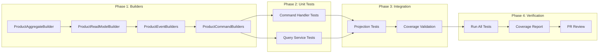

# Implementation Plan: AC12 - Testing

**Feature:** Product Catalog (CQRS Architecture)
**Acceptance Criteria:** AC12 - Testing
**Status:** Planning

---

## Overview

This implementation plan details the comprehensive testing strategy for the Product Catalog CQRS system. The goal is to ensure thorough test coverage across all layers of the architecture, from unit tests for domain logic to integration tests for infrastructure components, following reactive testing patterns with `StepVerifier` and leveraging Testcontainers for database integration.

### Existing Testing Infrastructure

The codebase already includes substantial test coverage:
- Unit tests for command handlers using Mockito and StepVerifier
- Unit tests for query services with mocked repositories
- Unit tests for aggregate business rules
- Integration tests with Testcontainers for PostgreSQL
- Controller tests using `@WebFluxTest` and `WebTestClient`
- JaCoCo configured for code coverage reporting (90% threshold)

This plan focuses on:
1. **Auditing existing tests** against AC12 requirements
2. **Identifying coverage gaps** in critical areas
3. **Adding missing tests** for untested scenarios
4. **Creating test data builders** for domain objects
5. **Ensuring consistent test patterns** across the codebase
6. **Validating coverage threshold** compliance

---

## Architecture

```mermaid
flowchart TB
    subgraph "Test Pyramid"
        subgraph "Unit Tests"
            AGG[Aggregate Tests]
            CMD_H[Command Handler Tests]
            QRY_H[Query Service Tests]
            VAL[Validator Tests]
            PROJ[Projector Tests]
        end

        subgraph "Integration Tests"
            ES_INT[Event Store Integration]
            RM_INT[Read Model Integration]
            PROJ_INT[Projection Integration]
            DB_INT[Database Integration]
        end

        subgraph "Controller Tests"
            CMD_CTRL[@WebFluxTest Command]
            QRY_CTRL[@WebFluxTest Query]
            E2E[End-to-End Flow Tests]
        end
    end

    subgraph "Test Infrastructure"
        TC[Testcontainers]
        MOCK[Mockito]
        SV[StepVerifier]
        WTC[WebTestClient]
        JACOCO[JaCoCo Coverage]
    end

    AGG --> MOCK
    CMD_H --> MOCK
    CMD_H --> SV
    QRY_H --> MOCK
    QRY_H --> SV
    VAL --> MOCK
    PROJ --> MOCK
    PROJ --> SV

    ES_INT --> TC
    ES_INT --> SV
    RM_INT --> TC
    RM_INT --> SV
    PROJ_INT --> TC
    DB_INT --> TC

    CMD_CTRL --> WTC
    QRY_CTRL --> WTC
    E2E --> TC
    E2E --> WTC

    AGG --> JACOCO
    CMD_H --> JACOCO
    QRY_H --> JACOCO
    ES_INT --> JACOCO
```

---

## Acceptance Criteria Reference

From the feature specification:

> - Unit tests exist for all command handlers using `StepVerifier`
> - Unit tests exist for all query handlers using `StepVerifier`
> - Unit tests verify aggregate business rules
> - Integration tests verify event store persistence
> - Integration tests verify projection updates
> - Controller tests use `@WebFluxTest` and `WebTestClient`
> - Test coverage meets minimum threshold (80% line coverage)
> - Test data builders exist for domain objects

---

## Current State Analysis

### Existing Test Coverage Summary

| Test Category | File | Tests | Status |
|---------------|------|-------|--------|
| **Aggregate Tests** | `ProductAggregateTest.kt` | 35+ | ✅ Complete |
| **Command Handler Tests** | `ProductCommandHandlerTest.kt` | 22+ | ✅ Complete |
| **Query Service Tests** | `ProductQueryServiceTest.kt` | 25+ | ✅ Complete |
| **Controller Tests (Command)** | `ProductCommandControllerTest.kt` | 20+ | ✅ Complete |
| **Controller Tests (Query)** | `ProductQueryControllerTest.kt` | 15+ | ✅ Complete |
| **Event Store Integration** | `ProductEventStoreRepositoryIntegrationTest.kt` | 30+ | ✅ Complete |
| **Projection Tests** | `ProductProjectorTest.kt` | 15+ | ✅ Complete |
| **Validator Tests** | `CommandValidatorsTest.kt`, `StatusBasedValidatorTest.kt` | 20+ | ✅ Complete |
| **Resiliency Tests** | `ResiliencyIntegrationTest.kt` | 10+ | ✅ Complete |
| **Observability Tests** | `CommandMetricsTest.kt`, `EventMetricsTest.kt`, `QueryMetricsTest.kt` | 20+ | ✅ Complete |
| **Test Data Builders** | None | 0 | ❌ Missing |

### Test Patterns Already Established

```kotlin
// Unit Test Pattern - Command Handler
@ExtendWith(MockitoExtension::class)
@DisplayName("ProductCommandHandler")
class ProductCommandHandlerTest {
    @Mock private lateinit var repository: ProductAggregateRepository
    @Mock private lateinit var idempotencyService: IdempotencyService

    @Test
    @DisplayName("should create product successfully")
    fun shouldCreateProductSuccessfully() {
        whenever(repository.save(any())).thenReturn(Mono.just(aggregate))

        StepVerifier.create(handler.handle(command))
            .expectNextMatches { it is CommandSuccess }
            .verifyComplete()
    }
}

// Integration Test Pattern
@SpringBootTest
@Testcontainers(disabledWithoutDocker = true)
@DisplayName("Event Store Integration Tests")
class ProductEventStoreRepositoryIntegrationTest {
    companion object {
        @Container @JvmStatic
        val postgres: PostgreSQLContainer<*> = PostgreSQLContainer("postgres:18-alpine")

        @DynamicPropertySource @JvmStatic
        fun configureProperties(registry: DynamicPropertyRegistry) {
            registry.add("spring.r2dbc.url") { "r2dbc://..." }
        }
    }
}

// Controller Test Pattern
@WebFluxTest(ProductCommandController::class)
@Import(CommandExceptionHandler::class)
class ProductCommandControllerTest {
    @Autowired private lateinit var webTestClient: WebTestClient
    @MockitoBean private lateinit var commandHandler: ProductCommandHandler

    @Test
    fun shouldCreateProduct() {
        webTestClient.post().uri("/api/products")
            .contentType(MediaType.APPLICATION_JSON)
            .bodyValue(requestJson)
            .exchange()
            .expectStatus().isCreated
    }
}
```

---

## Gap Analysis

Based on the current implementation and AC12 requirements, the following gaps need to be addressed:

### Gap 1: Test Data Builders
**Current:** Tests use inline object creation, leading to repetitive setup code
**AC12:** "Test data builders exist for domain objects"
**Action:** Create fluent test data builders for:
- `ProductAggregate`
- `ProductReadModel`
- Domain Events (`ProductCreated`, `ProductUpdated`, etc.)
- Command objects
- Request/Response DTOs

### Gap 2: Projection Integration Tests
**Current:** `ProjectionIntegrationTest.kt` is disabled
**AC12:** "Integration tests verify projection updates"
**Action:** Enable and fix projection integration tests or create alternative approach

### Gap 3: Coverage Report Validation
**Current:** JaCoCo configured but threshold enforcement not verified
**AC12:** "Test coverage meets minimum threshold (80% line coverage)"
**Action:** Run coverage report and fix any gaps below threshold

### Gap 4: Query Handler Edge Cases
**Current:** Basic happy path tests exist
**AC12:** "Unit tests exist for all query handlers using StepVerifier"
**Action:** Add tests for edge cases like concurrent access, null handling, error scenarios

### Gap 5: Command Handler Edge Cases
**Current:** Core scenarios covered
**AC12:** "Unit tests exist for all command handlers using StepVerifier"
**Action:** Add tests for edge cases like timeout handling, retry scenarios

---

## Implementation Steps

### Step 1: Create Test Data Builders

Create reusable test data builders following the Builder pattern for clean test setup.

#### 1.1 Create ProductAggregateBuilder

**File:** `src/test/kotlin/com/pintailconsultingllc/cqrsspike/testutil/builders/ProductAggregateBuilder.kt`

```kotlin
package com.pintailconsultingllc.cqrsspike.testutil.builders

import com.pintailconsultingllc.cqrsspike.product.command.aggregate.ProductAggregate
import com.pintailconsultingllc.cqrsspike.product.command.model.ProductStatus
import java.util.UUID

class ProductAggregateBuilder private constructor() {
    private var sku: String = "TEST-SKU-001"
    private var name: String = "Test Product"
    private var description: String? = "A test product description"
    private var priceCents: Int = 1999
    private var status: ProductStatus = ProductStatus.DRAFT

    companion object {
        fun aProduct() = ProductAggregateBuilder()

        fun aValidProduct() = aProduct()
            .withSku("VALID-001")
            .withName("Valid Product")
            .withPrice(2999)

        fun aDraftProduct() = aProduct().withStatus(ProductStatus.DRAFT)
        fun anActiveProduct() = aProduct().withStatus(ProductStatus.ACTIVE)
        fun aDiscontinuedProduct() = aProduct().withStatus(ProductStatus.DISCONTINUED)
    }

    fun withSku(sku: String) = apply { this.sku = sku }
    fun withName(name: String) = apply { this.name = name }
    fun withDescription(description: String?) = apply { this.description = description }
    fun withPrice(priceCents: Int) = apply { this.priceCents = priceCents }
    fun withStatus(status: ProductStatus) = apply { this.status = status }

    fun build(): ProductAggregate {
        val aggregate = ProductAggregate.create(
            sku = sku,
            name = name,
            description = description,
            priceCents = priceCents
        )

        return when (status) {
            ProductStatus.DRAFT -> aggregate
            ProductStatus.ACTIVE -> aggregate.activate(expectedVersion = 1L)
            ProductStatus.DISCONTINUED -> aggregate.discontinue(expectedVersion = 1L)
        }
    }
}
```

#### 1.2 Create ProductReadModelBuilder

**File:** `src/test/kotlin/com/pintailconsultingllc/cqrsspike/testutil/builders/ProductReadModelBuilder.kt`

```kotlin
package com.pintailconsultingllc.cqrsspike.testutil.builders

import com.pintailconsultingllc.cqrsspike.product.query.model.ProductReadModel
import java.time.OffsetDateTime
import java.util.UUID

class ProductReadModelBuilder private constructor() {
    private var id: UUID = UUID.randomUUID()
    private var sku: String = "TEST-SKU-001"
    private var name: String = "Test Product"
    private var description: String? = "A test product description"
    private var priceCents: Int = 1999
    private var status: String = "ACTIVE"
    private var createdAt: OffsetDateTime = OffsetDateTime.now().minusDays(1)
    private var updatedAt: OffsetDateTime = OffsetDateTime.now()
    private var aggregateVersion: Long = 1L
    private var isDeleted: Boolean = false

    companion object {
        fun aProductReadModel() = ProductReadModelBuilder()

        fun anActiveProductReadModel() = aProductReadModel().withStatus("ACTIVE")
        fun aDraftProductReadModel() = aProductReadModel().withStatus("DRAFT")
        fun aDiscontinuedProductReadModel() = aProductReadModel().withStatus("DISCONTINUED")
        fun aDeletedProductReadModel() = aProductReadModel().deleted()
    }

    fun withId(id: UUID) = apply { this.id = id }
    fun withSku(sku: String) = apply { this.sku = sku }
    fun withName(name: String) = apply { this.name = name }
    fun withDescription(description: String?) = apply { this.description = description }
    fun withPrice(priceCents: Int) = apply { this.priceCents = priceCents }
    fun withStatus(status: String) = apply { this.status = status }
    fun withVersion(version: Long) = apply { this.aggregateVersion = version }
    fun deleted() = apply { this.isDeleted = true }
    fun createdAt(createdAt: OffsetDateTime) = apply { this.createdAt = createdAt }
    fun updatedAt(updatedAt: OffsetDateTime) = apply { this.updatedAt = updatedAt }

    fun build(): ProductReadModel = ProductReadModel(
        id = id,
        sku = sku,
        name = name,
        description = description,
        priceCents = priceCents,
        status = status,
        createdAt = createdAt,
        updatedAt = updatedAt,
        aggregateVersion = aggregateVersion,
        isDeleted = isDeleted,
        priceDisplay = formatPrice(priceCents),
        searchText = buildSearchText()
    )

    private fun formatPrice(cents: Int): String =
        "$${cents / 100}.${(cents % 100).toString().padStart(2, '0')}"

    private fun buildSearchText(): String =
        listOfNotNull(name, description).joinToString(" ")
}
```

#### 1.3 Create Event Builders

**File:** `src/test/kotlin/com/pintailconsultingllc/cqrsspike/testutil/builders/ProductEventBuilders.kt`

```kotlin
package com.pintailconsultingllc.cqrsspike.testutil.builders

import com.pintailconsultingllc.cqrsspike.product.command.model.ProductStatus
import com.pintailconsultingllc.cqrsspike.product.event.*
import java.util.UUID

object ProductEventBuilders {

    fun productCreated(
        productId: UUID = UUID.randomUUID(),
        version: Long = 1L,
        sku: String = "TEST-SKU-001",
        name: String = "Test Product",
        description: String? = "A test description",
        priceCents: Int = 1999,
        status: ProductStatus = ProductStatus.DRAFT
    ) = ProductCreated(
        productId = productId,
        version = version,
        sku = sku,
        name = name,
        description = description,
        priceCents = priceCents,
        status = status
    )

    fun productUpdated(
        productId: UUID = UUID.randomUUID(),
        version: Long = 2L,
        name: String = "Updated Product",
        description: String? = "Updated description",
        previousName: String = "Test Product",
        previousDescription: String? = "A test description"
    ) = ProductUpdated(
        productId = productId,
        version = version,
        name = name,
        description = description,
        previousName = previousName,
        previousDescription = previousDescription
    )

    fun productPriceChanged(
        productId: UUID = UUID.randomUUID(),
        version: Long = 2L,
        newPriceCents: Int = 2999,
        previousPriceCents: Int = 1999,
        changePercentage: Double = 50.0
    ) = ProductPriceChanged(
        productId = productId,
        version = version,
        newPriceCents = newPriceCents,
        previousPriceCents = previousPriceCents,
        changePercentage = changePercentage
    )

    fun productActivated(
        productId: UUID = UUID.randomUUID(),
        version: Long = 2L,
        previousStatus: ProductStatus = ProductStatus.DRAFT
    ) = ProductActivated(
        productId = productId,
        version = version,
        previousStatus = previousStatus
    )

    fun productDiscontinued(
        productId: UUID = UUID.randomUUID(),
        version: Long = 2L,
        previousStatus: ProductStatus = ProductStatus.ACTIVE,
        reason: String? = "End of life"
    ) = ProductDiscontinued(
        productId = productId,
        version = version,
        previousStatus = previousStatus,
        reason = reason
    )

    fun productDeleted(
        productId: UUID = UUID.randomUUID(),
        version: Long = 2L,
        deletedBy: String? = "admin@example.com"
    ) = ProductDeleted(
        productId = productId,
        version = version,
        deletedBy = deletedBy
    )
}
```

#### 1.4 Create Command Builders

**File:** `src/test/kotlin/com/pintailconsultingllc/cqrsspike/testutil/builders/ProductCommandBuilders.kt`

```kotlin
package com.pintailconsultingllc.cqrsspike.testutil.builders

import com.pintailconsultingllc.cqrsspike.product.command.model.*
import java.util.UUID

object ProductCommandBuilders {

    fun createProductCommand(
        sku: String = "TEST-SKU-001",
        name: String = "Test Product",
        description: String? = "A test description",
        priceCents: Int = 1999,
        idempotencyKey: String? = null
    ) = CreateProductCommand(
        sku = sku,
        name = name,
        description = description,
        priceCents = priceCents,
        idempotencyKey = idempotencyKey
    )

    fun updateProductCommand(
        productId: UUID = UUID.randomUUID(),
        expectedVersion: Long = 1L,
        name: String = "Updated Product",
        description: String? = "Updated description",
        idempotencyKey: String? = null
    ) = UpdateProductCommand(
        productId = productId,
        expectedVersion = expectedVersion,
        name = name,
        description = description,
        idempotencyKey = idempotencyKey
    )

    fun changePriceCommand(
        productId: UUID = UUID.randomUUID(),
        expectedVersion: Long = 1L,
        newPriceCents: Int = 2999,
        confirmLargeChange: Boolean = false,
        idempotencyKey: String? = null
    ) = ChangePriceCommand(
        productId = productId,
        expectedVersion = expectedVersion,
        newPriceCents = newPriceCents,
        confirmLargeChange = confirmLargeChange,
        idempotencyKey = idempotencyKey
    )

    fun activateProductCommand(
        productId: UUID = UUID.randomUUID(),
        expectedVersion: Long = 1L,
        idempotencyKey: String? = null
    ) = ActivateProductCommand(
        productId = productId,
        expectedVersion = expectedVersion,
        idempotencyKey = idempotencyKey
    )

    fun discontinueProductCommand(
        productId: UUID = UUID.randomUUID(),
        expectedVersion: Long = 1L,
        reason: String? = "No longer manufactured",
        idempotencyKey: String? = null
    ) = DiscontinueProductCommand(
        productId = productId,
        expectedVersion = expectedVersion,
        reason = reason,
        idempotencyKey = idempotencyKey
    )

    fun deleteProductCommand(
        productId: UUID = UUID.randomUUID(),
        expectedVersion: Long = 1L,
        deletedBy: String? = "admin@example.com",
        idempotencyKey: String? = null
    ) = DeleteProductCommand(
        productId = productId,
        expectedVersion = expectedVersion,
        deletedBy = deletedBy,
        idempotencyKey = idempotencyKey
    )
}
```

---

### Step 2: Add Missing Command Handler Tests

Add additional tests for edge cases not currently covered.

#### 2.1 Add Concurrent Modification Test

**File:** Add to `ProductCommandHandlerTest.kt`

```kotlin
@Nested
@DisplayName("Concurrent Modification Handling")
inner class ConcurrentModificationHandling {

    @Test
    @DisplayName("should propagate concurrent modification exception from repository")
    fun shouldPropagateConcurrentModificationException() {
        val productId = UUID.randomUUID()
        val aggregate = ProductAggregateBuilder.anActiveProduct().build()

        val command = ProductCommandBuilders.updateProductCommand(
            productId = productId,
            expectedVersion = 1L
        )

        whenever(idempotencyService.checkIdempotency(anyOrNull()))
            .thenReturn(Mono.empty())
        whenever(aggregateRepository.findById(productId))
            .thenReturn(Mono.just(aggregate))
        whenever(aggregateRepository.update(any()))
            .thenReturn(Mono.error(ConcurrentModificationException(productId, 1L, 2L)))

        StepVerifier.create(handler.handle(command))
            .expectError(ConcurrentModificationException::class.java)
            .verify()
    }

    @Test
    @DisplayName("should handle repository timeout gracefully")
    fun shouldHandleRepositoryTimeoutGracefully() {
        val command = ProductCommandBuilders.createProductCommand()

        whenever(idempotencyService.checkIdempotency(anyOrNull()))
            .thenReturn(Mono.empty())
        whenever(aggregateRepository.save(any()))
            .thenReturn(Mono.never()) // Simulates a timeout scenario

        StepVerifier.create(handler.handle(command))
            .expectTimeout(Duration.ofSeconds(5))
            .verify()
    }
}
```

#### 2.2 Add Business Rule Violation Tests

**File:** Add to `ProductCommandHandlerTest.kt`

```kotlin
@Nested
@DisplayName("Business Rule Violations")
inner class BusinessRuleViolations {

    @Test
    @DisplayName("should reject activation of already active product")
    fun shouldRejectActivationOfAlreadyActiveProduct() {
        val aggregate = ProductAggregateBuilder.anActiveProduct().build()
        val productId = aggregate.id

        val command = ProductCommandBuilders.activateProductCommand(
            productId = productId,
            expectedVersion = 2L
        )

        whenever(idempotencyService.checkIdempotency(anyOrNull()))
            .thenReturn(Mono.empty())
        whenever(aggregateRepository.findById(productId))
            .thenReturn(Mono.just(aggregate))

        StepVerifier.create(handler.handle(command))
            .expectError(InvalidStateTransitionException::class.java)
            .verify()
    }

    @Test
    @DisplayName("should reject operations on deleted product")
    fun shouldRejectOperationsOnDeletedProduct() {
        val aggregate = ProductAggregateBuilder.aDraftProduct()
            .build()
            .delete(expectedVersion = 1L)
        val productId = aggregate.id

        val command = ProductCommandBuilders.updateProductCommand(
            productId = productId,
            expectedVersion = 2L
        )

        whenever(idempotencyService.checkIdempotency(anyOrNull()))
            .thenReturn(Mono.empty())
        whenever(aggregateRepository.findById(productId))
            .thenReturn(Mono.just(aggregate))

        StepVerifier.create(handler.handle(command))
            .expectError(ProductDeletedException::class.java)
            .verify()
    }

    @Test
    @DisplayName("should reject large price change without confirmation for active product")
    fun shouldRejectLargePriceChangeWithoutConfirmation() {
        val aggregate = ProductAggregateBuilder.anActiveProduct()
            .withPrice(1000)
            .build()
        val productId = aggregate.id

        val command = ProductCommandBuilders.changePriceCommand(
            productId = productId,
            expectedVersion = 2L,
            newPriceCents = 3000, // 200% increase
            confirmLargeChange = false
        )

        whenever(idempotencyService.checkIdempotency(anyOrNull()))
            .thenReturn(Mono.empty())
        whenever(aggregateRepository.findById(productId))
            .thenReturn(Mono.just(aggregate))

        StepVerifier.create(handler.handle(command))
            .expectError(PriceChangeThresholdExceededException::class.java)
            .verify()
    }
}
```

---

### Step 3: Add Missing Query Service Tests

Add additional tests for edge cases and error scenarios.

#### 3.1 Add Error Handling Tests

**File:** Add to `ProductQueryServiceTest.kt`

```kotlin
@Nested
@DisplayName("Error Handling")
inner class ErrorHandling {

    @Test
    @DisplayName("should handle repository exception gracefully")
    fun shouldHandleRepositoryExceptionGracefully() {
        val error = RuntimeException("Database connection failed")

        whenever(repository.findByIdNotDeleted(any()))
            .thenReturn(Mono.error(error))

        StepVerifier.create(queryService.findById(UUID.randomUUID()))
            .expectError(RuntimeException::class.java)
            .verify()
    }

    @Test
    @DisplayName("should return empty when searching with invalid characters")
    fun shouldReturnEmptyForInvalidSearchQuery() {
        whenever(repository.searchByText(any(), any()))
            .thenReturn(Flux.empty())
        whenever(repository.countBySearchTerm(any()))
            .thenReturn(Mono.just(0L))

        // Test with special characters that might cause issues
        StepVerifier.create(queryService.search("'; DROP TABLE products; --"))
            .expectNextMatches { response ->
                response.content.isEmpty() &&
                response.totalMatches == 0L
            }
            .verifyComplete()
    }
}

@Nested
@DisplayName("Boundary Conditions")
inner class BoundaryConditions {

    @Test
    @DisplayName("should handle maximum page size")
    fun shouldHandleMaximumPageSize() {
        whenever(repository.findAllPaginated(100, 0))
            .thenReturn(Flux.empty())
        whenever(repository.countAllNotDeleted())
            .thenReturn(Mono.just(0L))

        StepVerifier.create(queryService.findAllPaginated(0, Int.MAX_VALUE))
            .expectNextMatches { page -> page.size == 100 } // Capped at max
            .verifyComplete()
    }

    @Test
    @DisplayName("should handle price range with same min and max")
    fun shouldHandlePriceRangeWithSameMinMax() {
        val price = 1999
        whenever(repository.findByPriceRange(price, price))
            .thenReturn(Flux.just(ProductReadModelBuilder.aProductReadModel()
                .withPrice(price).build()))

        StepVerifier.create(queryService.findByPriceRange(price, price))
            .expectNextMatches { it.priceCents == price }
            .verifyComplete()
    }
}
```

---

### Step 4: Enable and Fix Projection Integration Tests

Update the disabled projection integration tests to work properly.

#### 4.1 Create Simplified Projection Test

**File:** Create `src/test/kotlin/com/pintailconsultingllc/cqrsspike/product/query/projection/ProjectionEventProcessingTest.kt`

```kotlin
package com.pintailconsultingllc.cqrsspike.product.query.projection

import com.pintailconsultingllc.cqrsspike.product.command.model.ProductStatus
import com.pintailconsultingllc.cqrsspike.product.event.ProductCreated
import com.pintailconsultingllc.cqrsspike.product.event.ProductUpdated
import com.pintailconsultingllc.cqrsspike.product.event.ProductActivated
import com.pintailconsultingllc.cqrsspike.product.query.repository.ProductReadModelRepository
import com.pintailconsultingllc.cqrsspike.product.query.repository.ProjectionPositionRepository
import com.pintailconsultingllc.cqrsspike.testutil.builders.ProductEventBuilders
import org.junit.jupiter.api.BeforeEach
import org.junit.jupiter.api.DisplayName
import org.junit.jupiter.api.Nested
import org.junit.jupiter.api.Test
import org.junit.jupiter.api.TestInstance
import org.springframework.beans.factory.annotation.Autowired
import org.springframework.boot.test.context.SpringBootTest
import org.springframework.test.context.DynamicPropertyRegistry
import org.springframework.test.context.DynamicPropertySource
import org.testcontainers.containers.PostgreSQLContainer
import org.testcontainers.junit.jupiter.Container
import org.testcontainers.junit.jupiter.Testcontainers
import reactor.test.StepVerifier
import java.util.UUID

@SpringBootTest
@Testcontainers(disabledWithoutDocker = true)
@TestInstance(TestInstance.Lifecycle.PER_CLASS)
@DisplayName("Projection Event Processing Integration Tests")
class ProjectionEventProcessingTest {

    companion object {
        @Container
        @JvmStatic
        val postgres: PostgreSQLContainer<*> = PostgreSQLContainer("postgres:18-alpine")
            .withDatabaseName("cqrs_test")
            .withUsername("test")
            .withPassword("test")
            .withInitScript("init-test-schema.sql")

        @DynamicPropertySource
        @JvmStatic
        fun configureProperties(registry: DynamicPropertyRegistry) {
            registry.add("spring.r2dbc.url") {
                "r2dbc:postgresql://${postgres.host}:${postgres.firstMappedPort}/${postgres.databaseName}"
            }
            registry.add("spring.r2dbc.username", postgres::getUsername)
            registry.add("spring.r2dbc.password", postgres::getPassword)
            registry.add("spring.flyway.enabled") { "false" }
            registry.add("spring.cloud.vault.enabled") { "false" }
            registry.add("projection.auto-start") { "false" }
        }
    }

    @Autowired
    private lateinit var productProjector: ProductProjector

    @Autowired
    private lateinit var readModelRepository: ProductReadModelRepository

    @Autowired
    private lateinit var positionRepository: ProjectionPositionRepository

    @BeforeEach
    fun setUp() {
        // Clean up before each test
        readModelRepository.deleteAll().block()
        positionRepository.deleteAll().block()
    }

    @Nested
    @DisplayName("AC12: Integration tests verify projection updates")
    inner class ProjectionUpdateVerification {

        @Test
        @DisplayName("should project ProductCreated event to read model")
        fun shouldProjectProductCreatedEvent() {
            val productId = UUID.randomUUID()
            val eventId = UUID.randomUUID()

            val event = ProductEventBuilders.productCreated(
                productId = productId,
                sku = "PROJ-TEST-001",
                name = "Projection Test Product",
                priceCents = 2499
            )

            StepVerifier.create(productProjector.processEvent(event, eventId, 1L))
                .verifyComplete()

            StepVerifier.create(readModelRepository.findById(productId))
                .expectNextMatches { readModel ->
                    readModel.sku == "PROJ-TEST-001" &&
                    readModel.name == "Projection Test Product" &&
                    readModel.priceCents == 2499 &&
                    readModel.aggregateVersion == 1L
                }
                .verifyComplete()
        }

        @Test
        @DisplayName("should project sequence of events correctly")
        fun shouldProjectSequenceOfEventsCorrectly() {
            val productId = UUID.randomUUID()

            val createEvent = ProductEventBuilders.productCreated(
                productId = productId,
                name = "Original Name"
            )

            val updateEvent = ProductEventBuilders.productUpdated(
                productId = productId,
                name = "Updated Name",
                previousName = "Original Name"
            )

            val activateEvent = ProductEventBuilders.productActivated(
                productId = productId,
                version = 3L
            )

            // Process events in sequence
            StepVerifier.create(productProjector.processEvent(createEvent, UUID.randomUUID(), 1L))
                .verifyComplete()

            StepVerifier.create(productProjector.processEvent(updateEvent, UUID.randomUUID(), 2L))
                .verifyComplete()

            StepVerifier.create(productProjector.processEvent(activateEvent, UUID.randomUUID(), 3L))
                .verifyComplete()

            // Verify final state
            StepVerifier.create(readModelRepository.findById(productId))
                .expectNextMatches { readModel ->
                    readModel.name == "Updated Name" &&
                    readModel.status == "ACTIVE" &&
                    readModel.aggregateVersion == 3L
                }
                .verifyComplete()
        }

        @Test
        @DisplayName("should handle idempotent event processing")
        fun shouldHandleIdempotentEventProcessing() {
            val productId = UUID.randomUUID()
            val eventId = UUID.randomUUID()

            val event = ProductEventBuilders.productCreated(productId = productId)

            // Process same event twice
            StepVerifier.create(productProjector.processEvent(event, eventId, 1L))
                .verifyComplete()

            StepVerifier.create(productProjector.processEvent(event, eventId, 1L))
                .verifyComplete()

            // Should still only have one record
            StepVerifier.create(readModelRepository.findById(productId))
                .expectNextCount(1)
                .verifyComplete()
        }

        @Test
        @DisplayName("should track projection position")
        fun shouldTrackProjectionPosition() {
            val productId = UUID.randomUUID()
            val eventId = UUID.randomUUID()

            val event = ProductEventBuilders.productCreated(productId = productId)

            StepVerifier.create(productProjector.processEvent(event, eventId, 100L))
                .verifyComplete()

            StepVerifier.create(productProjector.getProjectionPosition())
                .expectNextMatches { position ->
                    position.lastEventId == eventId &&
                    position.lastEventSequence == 100L &&
                    position.eventsProcessed > 0
                }
                .verifyComplete()
        }
    }
}
```

---

### Step 5: Create Test Coverage Validation

Create a utility to validate test coverage requirements.

#### 5.1 Add Coverage Verification Test

**File:** Create `src/test/kotlin/com/pintailconsultingllc/cqrsspike/CoverageValidationTest.kt`

```kotlin
package com.pintailconsultingllc.cqrsspike

import org.junit.jupiter.api.Disabled
import org.junit.jupiter.api.DisplayName
import org.junit.jupiter.api.Test
import java.io.File
import javax.xml.parsers.DocumentBuilderFactory
import kotlin.test.assertTrue

/**
 * Test to validate coverage requirements are met.
 * Run after `./gradlew test jacocoTestReport` to verify coverage.
 *
 * Note: This test is disabled by default and should be run manually
 * as part of the CI/CD pipeline after coverage reports are generated.
 */
@DisplayName("AC12: Test Coverage Validation")
class CoverageValidationTest {

    companion object {
        private const val MINIMUM_LINE_COVERAGE = 0.80 // 80%
        private const val COVERAGE_REPORT_PATH = "build/reports/jacoco/jacocoTestReport.xml"
    }

    @Test
    @Disabled("Run manually after jacocoTestReport")
    @DisplayName("should meet minimum line coverage threshold of 80%")
    fun shouldMeetMinimumLineCoverageThreshold() {
        val reportFile = File(COVERAGE_REPORT_PATH)

        if (!reportFile.exists()) {
            throw AssertionError(
                "Coverage report not found at $COVERAGE_REPORT_PATH. " +
                "Run './gradlew test jacocoTestReport' first."
            )
        }

        val (covered, missed) = parseCoverageReport(reportFile)
        val total = covered + missed
        val coverageRatio = if (total > 0) covered.toDouble() / total else 0.0

        assertTrue(
            coverageRatio >= MINIMUM_LINE_COVERAGE,
            "Line coverage ${(coverageRatio * 100).format(2)}% is below " +
            "minimum threshold of ${(MINIMUM_LINE_COVERAGE * 100).format(2)}%"
        )

        println("✅ Line coverage: ${(coverageRatio * 100).format(2)}% (threshold: ${(MINIMUM_LINE_COVERAGE * 100).format(2)}%)")
    }

    private fun parseCoverageReport(file: File): Pair<Long, Long> {
        val factory = DocumentBuilderFactory.newInstance()
        val builder = factory.newDocumentBuilder()
        val document = builder.parse(file)

        var totalCovered = 0L
        var totalMissed = 0L

        val counters = document.getElementsByTagName("counter")
        for (i in 0 until counters.length) {
            val node = counters.item(i)
            val type = node.attributes.getNamedItem("type")?.nodeValue

            if (type == "LINE") {
                val covered = node.attributes.getNamedItem("covered")?.nodeValue?.toLongOrNull() ?: 0
                val missed = node.attributes.getNamedItem("missed")?.nodeValue?.toLongOrNull() ?: 0
                totalCovered += covered
                totalMissed += missed
            }
        }

        return Pair(totalCovered, totalMissed)
    }

    private fun Double.format(digits: Int) = "%.${digits}f".format(this)
}
```

---

### Step 6: Update build.gradle.kts Coverage Configuration

Ensure JaCoCo is properly configured for AC12 requirements.

#### 6.1 Verify Coverage Configuration

The existing configuration in `build.gradle.kts` should include:

```kotlin
jacoco {
    toolVersion = "0.8.12"
}

tasks.jacocoTestReport {
    dependsOn(tasks.test)
    reports {
        xml.required = true
        csv.required = false
        html.required = true
        html.outputLocation = layout.buildDirectory.dir("reports/jacoco/html")
        xml.outputLocation = layout.buildDirectory.file("reports/jacoco/jacocoTestReport.xml")
    }
    classDirectories.setFrom(
        files(classDirectories.files.map {
            fileTree(it) {
                exclude(
                    "**/dto/**",
                    "**/config/**",
                    "**/CqrsSpikeApplication*"
                )
            }
        })
    )
}

tasks.jacocoTestCoverageVerification {
    violationRules {
        rule {
            limit {
                minimum = "0.80".toBigDecimal() // AC12: 80% line coverage
            }
        }
    }
}

// Add verification to build lifecycle
tasks.check {
    dependsOn(tasks.jacocoTestCoverageVerification)
}
```

---

## Implementation Summary

### Files to Create

| File | Purpose |
|------|---------|
| `testutil/builders/ProductAggregateBuilder.kt` | Builder for ProductAggregate test data |
| `testutil/builders/ProductReadModelBuilder.kt` | Builder for ProductReadModel test data |
| `testutil/builders/ProductEventBuilders.kt` | Builder methods for domain events |
| `testutil/builders/ProductCommandBuilders.kt` | Builder methods for commands |
| `projection/ProjectionEventProcessingTest.kt` | Integration tests for projection updates |
| `CoverageValidationTest.kt` | Coverage threshold validation |

### Files to Modify

| File | Changes |
|------|---------|
| `ProductCommandHandlerTest.kt` | Add concurrent modification and business rule tests |
| `ProductQueryServiceTest.kt` | Add error handling and boundary condition tests |
| `build.gradle.kts` | Ensure coverage verification in build lifecycle |

---

## Test Matrix

| AC12 Requirement | Test File(s) | Status |
|------------------|--------------|--------|
| Unit tests for command handlers with StepVerifier | `ProductCommandHandlerTest.kt` | ✅ Exists + Enhancements |
| Unit tests for query handlers with StepVerifier | `ProductQueryServiceTest.kt` | ✅ Exists + Enhancements |
| Unit tests verify aggregate business rules | `ProductAggregateTest.kt` | ✅ Complete |
| Integration tests verify event store persistence | `ProductEventStoreRepositoryIntegrationTest.kt` | ✅ Complete |
| Integration tests verify projection updates | `ProjectionEventProcessingTest.kt` | 🆕 New |
| Controller tests use @WebFluxTest and WebTestClient | `ProductCommandControllerTest.kt`, `ProductQueryControllerTest.kt` | ✅ Complete |
| Test coverage meets 80% threshold | JaCoCo configuration | ✅ Configured |
| Test data builders exist for domain objects | `testutil/builders/*` | 🆕 New |

---

## Definition of Done

- [ ] All test data builders are implemented and used in at least 3 test files
- [ ] Additional command handler tests for edge cases are passing
- [ ] Additional query service tests for edge cases are passing
- [ ] Projection integration tests are enabled and passing
- [ ] All tests pass with `./gradlew test`
- [ ] Coverage report shows ≥80% line coverage
- [ ] `./gradlew check` passes (includes coverage verification)
- [ ] Test patterns are consistent across the codebase
- [ ] Code review completed

---

## Execution Order



---

## Notes

### Testing Best Practices

1. **Use `StepVerifier` for all reactive tests** - Never block in test code
2. **Use `@DisplayName` for readable test output** - Document intent clearly
3. **Use nested test classes with `@Nested`** - Group related tests
4. **Use test data builders** - Avoid repetitive setup code
5. **Test edge cases** - Empty results, nulls, boundary values
6. **Test error scenarios** - Exceptions, timeouts, failures
7. **Use Testcontainers for integration tests** - Consistent test database

### Common Test Patterns

```kotlin
// Pattern: Testing reactive error handling
StepVerifier.create(service.operation())
    .expectError(ExpectedException::class.java)
    .verify()

// Pattern: Testing reactive success with verification
StepVerifier.create(service.operation())
    .expectNextMatches { result ->
        result.property == expectedValue
    }
    .verifyComplete()

// Pattern: Testing reactive timeout
StepVerifier.create(service.operation())
    .expectTimeout(Duration.ofSeconds(5))
    .verify()
```

### Coverage Exclusions

The following are excluded from coverage requirements:
- DTOs (data transfer objects)
- Configuration classes
- Main application class

These exclusions are appropriate as they contain minimal logic and are primarily structural.
