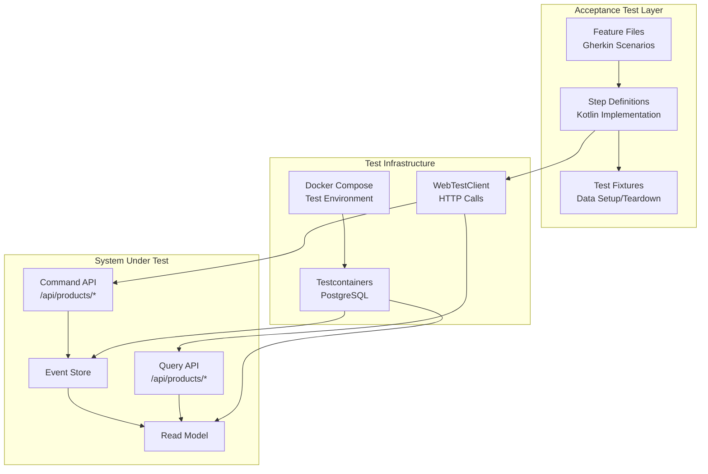

# Implementation Plan: AC13 - Acceptance Testing

**Feature:** Product Catalog (CQRS Architecture)
**Acceptance Criteria:** AC13 - Acceptance Testing
**Status:** Planning

---

## Overview

This implementation plan details the acceptance testing strategy for the Product Catalog CQRS system. The goal is to create comprehensive end-to-end tests that validate complete user scenarios, covering both command and query flows, business rules, and error handling using a BDD (Behavior-Driven Development) approach with Cucumber.

### Acceptance Testing vs Integration Testing

| Aspect | Integration Tests (AC12) | Acceptance Tests (AC13) |
|--------|--------------------------|-------------------------|
| **Focus** | Component integration | User scenario validation |
| **Perspective** | Technical/Developer | Business/User |
| **Granularity** | Service boundaries | Full user flows |
| **Language** | Technical assertions | Business language (Gherkin) |
| **Stakeholders** | Developers | Developers, QA, Product Owners |

---

## Architecture



---

## Acceptance Criteria Reference

From the feature specification:

> - End-to-end tests cover main user scenarios
> - Tests cover command and query flows
> - Tests validate business rules and error handling
> - Use Cucumber or similar BDD framework
> - Tests run with the Docker Compose test environment

---

## Technology Stack

### Cucumber for Kotlin/JVM

```kotlin
// Dependencies to add
testImplementation("io.cucumber:cucumber-java:7.20.1")
testImplementation("io.cucumber:cucumber-junit-platform-engine:7.20.1")
testImplementation("io.cucumber:cucumber-spring:7.20.1")
testImplementation("org.junit.platform:junit-platform-suite:1.11.3")
```

### Key Technologies

| Technology | Purpose | Version |
|------------|---------|---------|
| Cucumber | BDD framework | 7.20.1 |
| Gherkin | Feature file syntax | 28.x |
| WebTestClient | HTTP testing | Spring Boot 4.x |
| Testcontainers | Docker containers | 1.20.4 |
| JUnit Platform | Test execution | 1.11.x |

---

## Feature Scenarios

### Feature 1: Product Lifecycle Management

```gherkin
# src/test/resources/features/product-lifecycle.feature

Feature: Product Lifecycle Management
  As a product administrator
  I want to manage the complete product lifecycle
  So that I can maintain an accurate product catalog

  Background:
    Given the product catalog system is running
    And the database is empty

  @smoke @happy-path
  Scenario: Create and activate a new product
    Given I have a valid product with SKU "WIDGET-001"
    When I create the product with the following details:
      | name        | Premium Widget           |
      | description | A high-quality widget    |
      | priceCents  | 2999                     |
    Then the product should be created successfully
    And the product should have status "DRAFT"
    And the product should have version 1
    When I activate the product
    Then the product should have status "ACTIVE"
    And the product should have version 2
    And the product should be visible in the catalog

  @happy-path
  Scenario: Update product information
    Given an existing product with SKU "UPDATE-001" exists
    And the product has status "DRAFT"
    When I update the product with:
      | name        | Updated Widget Name      |
      | description | Updated description text |
    Then the product should be updated successfully
    And the product name should be "Updated Widget Name"
    And the product description should be "Updated description text"
    And the product version should be incremented

  @happy-path
  Scenario: Change product price
    Given an existing active product with SKU "PRICE-001" exists
    And the product price is 1999 cents
    When I change the price to 2499 cents
    Then the price change should be successful
    And the product price should be 2499 cents

  @happy-path
  Scenario: Discontinue a product
    Given an existing active product with SKU "DISC-001" exists
    When I discontinue the product with reason "End of product line"
    Then the product should have status "DISCONTINUED"
    And the product should still be visible in the catalog

  @happy-path
  Scenario: Delete a product (soft delete)
    Given an existing product with SKU "DELETE-001" exists
    When I delete the product
    Then the product should be marked as deleted
    And the product should not appear in catalog searches
    But the product should still exist in the event store

  @happy-path
  Scenario: Complete product lifecycle
    When I create a product with SKU "LIFECYCLE-001"
    Then the product should have status "DRAFT"
    When I activate the product
    Then the product should have status "ACTIVE"
    When I change the price from 1999 to 2999 cents with confirmation
    Then the price change should require confirmation due to large change
    When I discontinue the product
    Then the product should have status "DISCONTINUED"
    When I delete the product
    Then the product should be soft deleted
```

### Feature 2: Product Query Operations

```gherkin
# src/test/resources/features/product-queries.feature

Feature: Product Query Operations
  As a catalog user
  I want to search and filter products
  So that I can find the products I need

  Background:
    Given the product catalog system is running
    And the following products exist:
      | sku         | name             | priceCents | status       |
      | QUERY-001   | Basic Widget     | 999        | ACTIVE       |
      | QUERY-002   | Premium Widget   | 2999       | ACTIVE       |
      | QUERY-003   | Super Widget     | 4999       | ACTIVE       |
      | QUERY-004   | Draft Widget     | 1999       | DRAFT        |
      | QUERY-005   | Old Widget       | 1499       | DISCONTINUED |

  @query @smoke
  Scenario: Query product by ID
    Given product "QUERY-001" exists
    When I query for the product by its ID
    Then I should receive the product details
    And the product name should be "Basic Widget"

  @query
  Scenario: Query products by status
    When I query for products with status "ACTIVE"
    Then I should receive 3 products
    And all returned products should have status "ACTIVE"

  @query
  Scenario: Query products with pagination
    When I query for all products with page size 2
    Then I should receive 2 products
    And the response should indicate there are more pages
    When I query for the next page
    Then I should receive the next 2 products

  @query
  Scenario: Query products by price range
    When I query for products with price between 1000 and 3000 cents
    Then I should receive 2 products
    And all returned products should have price between 1000 and 3000 cents

  @query @search
  Scenario: Full-text search on products
    When I search for products containing "Widget"
    Then I should receive 4 products
    When I search for products containing "Premium"
    Then I should receive 1 product
    And the product SKU should be "QUERY-002"

  @query
  Scenario: Query products sorted by price
    When I query for active products sorted by price ascending
    Then I should receive products in price order
    And the first product should be "Basic Widget"
    And the last product should be "Super Widget"

  @query
  Scenario: Cursor-based pagination
    When I query for the first page of products using cursor pagination
    Then I should receive products and a cursor for the next page
    When I query for the next page using the cursor
    Then I should receive the next set of products
    And no duplicate products should appear across pages
```

### Feature 3: Business Rules Validation

```gherkin
# src/test/resources/features/business-rules.feature

Feature: Business Rules Validation
  As a product administrator
  I want the system to enforce business rules
  So that the catalog maintains data integrity

  Background:
    Given the product catalog system is running

  @validation @error-handling
  Scenario: Reject product with invalid SKU format
    When I try to create a product with SKU "ab" # Too short
    Then the creation should fail with validation error
    And the error should mention "SKU" and "format"

  @validation @error-handling
  Scenario: Reject product with negative price
    When I try to create a product with price -100 cents
    Then the creation should fail with validation error
    And the error should mention "price" and "positive"

  @validation @error-handling
  Scenario: Reject product with empty name
    When I try to create a product with empty name
    Then the creation should fail with validation error
    And the error should mention "name" and "required"

  @validation @error-handling
  Scenario: Reject duplicate SKU
    Given an existing product with SKU "DUPE-001" exists
    When I try to create another product with SKU "DUPE-001"
    Then the creation should fail with conflict error
    And the error should mention "SKU" and "exists"

  @business-rule
  Scenario: Require confirmation for large price changes on active products
    Given an existing active product with SKU "PRICE-RULE-001" exists
    And the product price is 1000 cents
    When I try to change the price to 1500 cents without confirmation
    Then the price change should fail
    And the error should require confirmation for changes over 20%
    When I change the price to 1500 cents with confirmation
    Then the price change should be successful

  @business-rule
  Scenario: Prevent reactivation of discontinued products
    Given an existing discontinued product with SKU "REACT-001" exists
    When I try to activate the product
    Then the activation should fail
    And the error should mention "discontinued" products cannot be activated

  @business-rule
  Scenario: Prevent operations on deleted products
    Given an existing deleted product with SKU "DELETED-001" exists
    When I try to update the product
    Then the operation should fail
    And the error should mention the product is deleted

  @concurrency @error-handling
  Scenario: Handle concurrent modification conflict
    Given an existing product with SKU "CONCURRENT-001" at version 1
    When two users simultaneously try to update the product
    Then one update should succeed
    And the other update should fail with version conflict
    And the error should provide retry guidance
```

### Feature 4: Error Handling and Resiliency

```gherkin
# src/test/resources/features/error-handling.feature

Feature: Error Handling and Resiliency
  As a system user
  I want graceful error handling
  So that I can recover from failures

  Background:
    Given the product catalog system is running

  @error-handling
  Scenario: Handle product not found
    When I query for a non-existent product ID
    Then I should receive a 404 Not Found response
    And the error response should include a message
    And the error response should include a correlation ID

  @error-handling
  Scenario: Handle validation errors with details
    When I create a product with multiple validation errors
    Then I should receive a 400 Bad Request response
    And the error response should list all validation errors
    And each error should specify the field and constraint

  @error-handling
  Scenario: Handle malformed request body
    When I send a malformed JSON request to create a product
    Then I should receive a 400 Bad Request response
    And the error should indicate a parsing error

  @error-handling
  Scenario: Verify correlation ID propagation
    When I make a request with correlation ID "test-correlation-123"
    Then the response should include the same correlation ID
    And the correlation ID should appear in logs

  @rate-limiting
  Scenario: Handle rate limiting gracefully
    Given rate limiting is configured for the API
    When I exceed the rate limit with rapid requests
    Then I should receive a 429 Too Many Requests response
    And the response should include retry-after information
```

### Feature 5: Event Sourcing Verification

```gherkin
# src/test/resources/features/event-sourcing.feature

Feature: Event Sourcing Verification
  As a system architect
  I want to verify event sourcing behavior
  So that I can ensure audit and replay capabilities

  Background:
    Given the product catalog system is running
    And the database is empty

  @event-sourcing
  Scenario: Verify events are persisted for product operations
    When I create a product with SKU "EVENT-001"
    Then a "ProductCreated" event should be stored
    When I update the product name
    Then a "ProductUpdated" event should be stored
    When I change the product price
    Then a "ProductPriceChanged" event should be stored
    When I activate the product
    Then a "ProductActivated" event should be stored
    When I discontinue the product
    Then a "ProductDiscontinued" event should be stored

  @event-sourcing
  Scenario: Verify event stream reconstruction
    Given a product has been created and modified 5 times
    When I request the complete event stream for the product
    Then I should receive all 6 events in order
    And each event should have the correct version number
    And event timestamps should be in chronological order

  @event-sourcing @projection
  Scenario: Verify read model is updated from events
    When I create and activate a product
    Then the read model should reflect the product status as "ACTIVE"
    And the read model version should match the aggregate version

  @event-sourcing
  Scenario: Verify idempotent command handling
    Given I create a product with idempotency key "idem-key-001"
    When I retry the same create command with the same idempotency key
    Then I should receive the original result
    And only one product should exist in the database
    And only one set of events should exist
```

---

## Implementation Steps

### Step 1: Add Cucumber Dependencies

**File:** `build.gradle.kts`

```kotlin
// Add to dependencies block
testImplementation("io.cucumber:cucumber-java:7.20.1")
testImplementation("io.cucumber:cucumber-junit-platform-engine:7.20.1")
testImplementation("io.cucumber:cucumber-spring:7.20.1")
testImplementation("org.junit.platform:junit-platform-suite:1.11.3")
```

### Step 2: Create Cucumber Configuration

#### 2.1 JUnit Platform Suite Runner

**File:** `src/test/kotlin/com/pintailconsultingllc/cqrsspike/acceptance/AcceptanceTestRunner.kt`

```kotlin
package com.pintailconsultingllc.cqrsspike.acceptance

import org.junit.platform.suite.api.ConfigurationParameter
import org.junit.platform.suite.api.IncludeEngines
import org.junit.platform.suite.api.SelectPackages
import org.junit.platform.suite.api.Suite
import io.cucumber.junit.platform.engine.Constants

@Suite
@IncludeEngines("cucumber")
@SelectPackages("com.pintailconsultingllc.cqrsspike.acceptance")
@ConfigurationParameter(
    key = Constants.GLUE_PROPERTY_NAME,
    value = "com.pintailconsultingllc.cqrsspike.acceptance"
)
@ConfigurationParameter(
    key = Constants.FEATURES_PROPERTY_NAME,
    value = "src/test/resources/features"
)
@ConfigurationParameter(
    key = Constants.PLUGIN_PROPERTY_NAME,
    value = "pretty,html:build/reports/cucumber/cucumber.html,json:build/reports/cucumber/cucumber.json"
)
@ConfigurationParameter(
    key = Constants.FILTER_TAGS_PROPERTY_NAME,
    value = "not @wip"
)
class AcceptanceTestRunner
```

#### 2.2 Spring Integration Configuration

**File:** `src/test/kotlin/com/pintailconsultingllc/cqrsspike/acceptance/CucumberSpringConfiguration.kt`

```kotlin
package com.pintailconsultingllc.cqrsspike.acceptance

import io.cucumber.spring.CucumberContextConfiguration
import org.springframework.boot.test.autoconfigure.web.reactive.AutoConfigureWebTestClient
import org.springframework.boot.test.context.SpringBootTest
import org.springframework.test.context.DynamicPropertyRegistry
import org.springframework.test.context.DynamicPropertySource
import org.testcontainers.containers.PostgreSQLContainer
import org.testcontainers.junit.jupiter.Container
import org.testcontainers.junit.jupiter.Testcontainers

@CucumberContextConfiguration
@SpringBootTest(webEnvironment = SpringBootTest.WebEnvironment.RANDOM_PORT)
@AutoConfigureWebTestClient(timeout = "30s")
@Testcontainers(disabledWithoutDocker = true)
class CucumberSpringConfiguration {

    companion object {
        @Container
        @JvmStatic
        val postgres: PostgreSQLContainer<*> = PostgreSQLContainer("postgres:18-alpine")
            .withDatabaseName("cqrs_acceptance_test")
            .withUsername("test")
            .withPassword("test")
            .withInitScript("init-test-schema.sql")

        @DynamicPropertySource
        @JvmStatic
        fun configureProperties(registry: DynamicPropertyRegistry) {
            registry.add("spring.r2dbc.url") {
                "r2dbc:postgresql://${postgres.host}:${postgres.firstMappedPort}/${postgres.databaseName}"
            }
            registry.add("spring.r2dbc.username", postgres::getUsername)
            registry.add("spring.r2dbc.password", postgres::getPassword)
            registry.add("spring.datasource.url") {
                "jdbc:postgresql://${postgres.host}:${postgres.firstMappedPort}/${postgres.databaseName}"
            }
            registry.add("spring.datasource.username", postgres::getUsername)
            registry.add("spring.datasource.password", postgres::getPassword)
            registry.add("spring.flyway.enabled") { "false" }
            registry.add("spring.cloud.vault.enabled") { "false" }
            registry.add("projection.auto-start") { "false" }
        }
    }
}
```

### Step 3: Create Test Context and State Management

**File:** `src/test/kotlin/com/pintailconsultingllc/cqrsspike/acceptance/TestContext.kt`

```kotlin
package com.pintailconsultingllc.cqrsspike.acceptance

import org.springframework.stereotype.Component
import org.springframework.context.annotation.Scope
import io.cucumber.spring.ScenarioScope
import java.util.UUID

/**
 * Scenario-scoped context for sharing state between step definitions.
 * Each Cucumber scenario gets a fresh instance.
 */
@Component
@ScenarioScope
class TestContext {
    // Current product being tested
    var currentProductId: UUID? = null
    var currentProductSku: String? = null
    var currentProductVersion: Long = 0

    // Response tracking
    var lastResponseStatus: Int? = null
    var lastResponseBody: String? = null
    var lastCorrelationId: String? = null

    // Product collection for multi-product scenarios
    val products: MutableMap<String, UUID> = mutableMapOf()

    // Error tracking
    var lastError: String? = null
    var lastErrorDetails: Map<String, Any>? = null

    // Pagination state
    var currentPage: Int = 0
    var currentCursor: String? = null
    var hasMorePages: Boolean = false

    fun reset() {
        currentProductId = null
        currentProductSku = null
        currentProductVersion = 0
        lastResponseStatus = null
        lastResponseBody = null
        lastCorrelationId = null
        products.clear()
        lastError = null
        lastErrorDetails = null
        currentPage = 0
        currentCursor = null
        hasMorePages = false
    }
}
```

### Step 4: Create Step Definitions

#### 4.1 Common Steps

**File:** `src/test/kotlin/com/pintailconsultingllc/cqrsspike/acceptance/steps/CommonSteps.kt`

```kotlin
package com.pintailconsultingllc.cqrsspike.acceptance.steps

import com.pintailconsultingllc.cqrsspike.acceptance.TestContext
import com.pintailconsultingllc.cqrsspike.product.query.repository.ProductReadModelRepository
import io.cucumber.java.Before
import io.cucumber.java.en.Given
import io.cucumber.java.en.Then
import org.springframework.beans.factory.annotation.Autowired
import org.springframework.r2dbc.core.DatabaseClient
import org.springframework.test.web.reactive.server.WebTestClient
import kotlin.test.assertEquals
import kotlin.test.assertNotNull

class CommonSteps {

    @Autowired
    private lateinit var testContext: TestContext

    @Autowired
    private lateinit var webTestClient: WebTestClient

    @Autowired
    private lateinit var databaseClient: DatabaseClient

    @Autowired
    private lateinit var readModelRepository: ProductReadModelRepository

    @Before
    fun setUp() {
        testContext.reset()
    }

    @Given("the product catalog system is running")
    fun theProductCatalogSystemIsRunning() {
        // Verify the system is healthy by hitting actuator
        webTestClient.get()
            .uri("/actuator/health")
            .exchange()
            .expectStatus().isOk
    }

    @Given("the database is empty")
    fun theDatabaseIsEmpty() {
        // Clean all schemas
        databaseClient.sql("DELETE FROM read_model.product").then().block()
        databaseClient.sql("DELETE FROM read_model.projection_position").then().block()
        databaseClient.sql("DELETE FROM event_store.domain_event").then().block()
        databaseClient.sql("DELETE FROM event_store.event_stream").then().block()
        databaseClient.sql("DELETE FROM command_model.product").then().block()
        databaseClient.sql("DELETE FROM command_model.processed_command").then().block()
    }

    @Then("the response should include the same correlation ID")
    fun theResponseShouldIncludeCorrelationId() {
        assertNotNull(testContext.lastCorrelationId)
    }

    @Then("the error response should include a correlation ID")
    fun theErrorResponseShouldIncludeCorrelationId() {
        assertNotNull(testContext.lastCorrelationId)
    }
}
```

#### 4.2 Product Lifecycle Steps

**File:** `src/test/kotlin/com/pintailconsultingllc/cqrsspike/acceptance/steps/ProductLifecycleSteps.kt`

```kotlin
package com.pintailconsultingllc.cqrsspike.acceptance.steps

import com.fasterxml.jackson.databind.ObjectMapper
import com.pintailconsultingllc.cqrsspike.acceptance.TestContext
import io.cucumber.datatable.DataTable
import io.cucumber.java.en.Given
import io.cucumber.java.en.When
import io.cucumber.java.en.Then
import io.cucumber.java.en.And
import org.springframework.beans.factory.annotation.Autowired
import org.springframework.http.MediaType
import org.springframework.test.web.reactive.server.WebTestClient
import java.util.UUID
import kotlin.test.assertEquals
import kotlin.test.assertNotNull
import kotlin.test.assertTrue

class ProductLifecycleSteps {

    @Autowired
    private lateinit var testContext: TestContext

    @Autowired
    private lateinit var webTestClient: WebTestClient

    @Autowired
    private lateinit var objectMapper: ObjectMapper

    @Given("I have a valid product with SKU {string}")
    fun iHaveValidProductWithSku(sku: String) {
        testContext.currentProductSku = sku
    }

    @Given("an existing product with SKU {string} exists")
    fun anExistingProductWithSkuExists(sku: String) {
        createProduct(sku, "Test Product for $sku", "Test description", 1999)
    }

    @Given("an existing active product with SKU {string} exists")
    fun anExistingActiveProductWithSkuExists(sku: String) {
        createProduct(sku, "Active Product for $sku", "Test description", 1999)
        activateProduct()
    }

    @Given("an existing discontinued product with SKU {string} exists")
    fun anExistingDiscontinuedProductWithSkuExists(sku: String) {
        createProduct(sku, "Discontinued Product for $sku", "Test description", 1999)
        activateProduct()
        discontinueProduct(null)
    }

    @Given("an existing deleted product with SKU {string} exists")
    fun anExistingDeletedProductWithSkuExists(sku: String) {
        createProduct(sku, "Deleted Product for $sku", "Test description", 1999)
        deleteProduct()
    }

    @Given("the product has status {string}")
    fun theProductHasStatus(status: String) {
        // Verify status matches expectation
        val productId = testContext.currentProductId
        assertNotNull(productId)

        webTestClient.get()
            .uri("/api/products/{id}", productId)
            .exchange()
            .expectStatus().isOk
            .expectBody()
            .jsonPath("$.status").isEqualTo(status)
    }

    @Given("the product price is {int} cents")
    fun theProductPriceIsCents(priceCents: Int) {
        val productId = testContext.currentProductId
        assertNotNull(productId)

        webTestClient.get()
            .uri("/api/products/{id}", productId)
            .exchange()
            .expectStatus().isOk
            .expectBody()
            .jsonPath("$.priceCents").isEqualTo(priceCents)
    }

    @When("I create the product with the following details:")
    fun iCreateProductWithDetails(dataTable: DataTable) {
        val details = dataTable.asMap()
        val sku = testContext.currentProductSku ?: throw IllegalStateException("SKU not set")

        createProduct(
            sku = sku,
            name = details["name"] ?: "Test Product",
            description = details["description"],
            priceCents = details["priceCents"]?.toInt() ?: 1999
        )
    }

    @When("I create a product with SKU {string}")
    fun iCreateProductWithSku(sku: String) {
        createProduct(sku, "Test Product", "Test description", 1999)
    }

    @When("I activate the product")
    fun iActivateTheProduct() {
        activateProduct()
    }

    @When("I update the product with:")
    fun iUpdateTheProductWith(dataTable: DataTable) {
        val details = dataTable.asMap()
        val productId = testContext.currentProductId ?: throw IllegalStateException("No product ID")

        val request = mapOf(
            "name" to details["name"],
            "description" to details["description"],
            "expectedVersion" to testContext.currentProductVersion
        ).filterValues { it != null }

        val result = webTestClient.put()
            .uri("/api/products/{id}", productId)
            .contentType(MediaType.APPLICATION_JSON)
            .bodyValue(objectMapper.writeValueAsString(request))
            .exchange()
            .expectBody(String::class.java)
            .returnResult()

        testContext.lastResponseStatus = result.status.value()
        testContext.lastResponseBody = result.responseBody
        testContext.lastCorrelationId = result.responseHeaders["X-Correlation-Id"]?.firstOrNull()

        if (result.status.is2xxSuccessful) {
            testContext.currentProductVersion++
        }
    }

    @When("I change the price to {int} cents")
    fun iChangeThePriceToCents(newPriceCents: Int) {
        changePriceWithConfirmation(newPriceCents, false)
    }

    @When("I change the price to {int} cents with confirmation")
    fun iChangeThePriceToCentsWithConfirmation(newPriceCents: Int) {
        changePriceWithConfirmation(newPriceCents, true)
    }

    @When("I try to change the price to {int} cents without confirmation")
    fun iTryToChangeThePriceToCentsWithoutConfirmation(newPriceCents: Int) {
        changePriceWithConfirmation(newPriceCents, false)
    }

    @When("I discontinue the product")
    fun iDiscontinueTheProduct() {
        discontinueProduct(null)
    }

    @When("I discontinue the product with reason {string}")
    fun iDiscontinueTheProductWithReason(reason: String) {
        discontinueProduct(reason)
    }

    @When("I delete the product")
    fun iDeleteTheProduct() {
        deleteProduct()
    }

    @When("I try to activate the product")
    fun iTryToActivateTheProduct() {
        activateProduct()
    }

    @When("I try to update the product")
    fun iTryToUpdateTheProduct() {
        val productId = testContext.currentProductId ?: throw IllegalStateException("No product ID")

        val request = mapOf(
            "name" to "Updated Name",
            "expectedVersion" to testContext.currentProductVersion
        )

        val result = webTestClient.put()
            .uri("/api/products/{id}", productId)
            .contentType(MediaType.APPLICATION_JSON)
            .bodyValue(objectMapper.writeValueAsString(request))
            .exchange()
            .expectBody(String::class.java)
            .returnResult()

        testContext.lastResponseStatus = result.status.value()
        testContext.lastResponseBody = result.responseBody
    }

    @Then("the product should be created successfully")
    fun theProductShouldBeCreatedSuccessfully() {
        assertEquals(201, testContext.lastResponseStatus)
        assertNotNull(testContext.currentProductId)
    }

    @Then("the product should have status {string}")
    fun theProductShouldHaveStatus(expectedStatus: String) {
        val productId = testContext.currentProductId
        assertNotNull(productId)

        webTestClient.get()
            .uri("/api/products/{id}", productId)
            .exchange()
            .expectStatus().isOk
            .expectBody()
            .jsonPath("$.status").isEqualTo(expectedStatus)
    }

    @Then("the product should have version {int}")
    fun theProductShouldHaveVersion(expectedVersion: Int) {
        assertEquals(expectedVersion.toLong(), testContext.currentProductVersion)
    }

    @Then("the product should be updated successfully")
    fun theProductShouldBeUpdatedSuccessfully() {
        assertEquals(200, testContext.lastResponseStatus)
    }

    @Then("the product version should be incremented")
    fun theProductVersionShouldBeIncremented() {
        assertTrue(testContext.currentProductVersion > 1)
    }

    @Then("the product name should be {string}")
    fun theProductNameShouldBe(expectedName: String) {
        val productId = testContext.currentProductId
        assertNotNull(productId)

        webTestClient.get()
            .uri("/api/products/{id}", productId)
            .exchange()
            .expectStatus().isOk
            .expectBody()
            .jsonPath("$.name").isEqualTo(expectedName)
    }

    @Then("the product description should be {string}")
    fun theProductDescriptionShouldBe(expectedDescription: String) {
        val productId = testContext.currentProductId
        assertNotNull(productId)

        webTestClient.get()
            .uri("/api/products/{id}", productId)
            .exchange()
            .expectStatus().isOk
            .expectBody()
            .jsonPath("$.description").isEqualTo(expectedDescription)
    }

    @Then("the price change should be successful")
    fun thePriceChangeShouldBeSuccessful() {
        assertEquals(200, testContext.lastResponseStatus)
    }

    @Then("the price change should fail")
    fun thePriceChangeShouldFail() {
        assertTrue(testContext.lastResponseStatus in 400..499)
    }

    @Then("the product price should be {int} cents")
    fun theProductPriceShouldBeCents(expectedPrice: Int) {
        val productId = testContext.currentProductId
        assertNotNull(productId)

        webTestClient.get()
            .uri("/api/products/{id}", productId)
            .exchange()
            .expectStatus().isOk
            .expectBody()
            .jsonPath("$.priceCents").isEqualTo(expectedPrice)
    }

    @Then("the product should be visible in the catalog")
    fun theProductShouldBeVisibleInCatalog() {
        val productId = testContext.currentProductId
        assertNotNull(productId)

        webTestClient.get()
            .uri("/api/products/{id}", productId)
            .exchange()
            .expectStatus().isOk
    }

    @Then("the product should be marked as deleted")
    fun theProductShouldBeMarkedAsDeleted() {
        assertEquals(204, testContext.lastResponseStatus)
    }

    @Then("the product should not appear in catalog searches")
    fun theProductShouldNotAppearInSearches() {
        val sku = testContext.currentProductSku
        assertNotNull(sku)

        webTestClient.get()
            .uri("/api/products/search?query={query}", sku)
            .exchange()
            .expectStatus().isOk
            .expectBody()
            .jsonPath("$.content").isEmpty
    }

    @Then("the activation should fail")
    fun theActivationShouldFail() {
        assertTrue(testContext.lastResponseStatus in 400..499)
    }

    @Then("the operation should fail")
    fun theOperationShouldFail() {
        assertTrue(testContext.lastResponseStatus in 400..499)
    }

    // Helper methods

    private fun createProduct(sku: String, name: String, description: String?, priceCents: Int) {
        testContext.currentProductSku = sku

        val request = mapOf(
            "sku" to sku,
            "name" to name,
            "description" to description,
            "priceCents" to priceCents
        )

        val result = webTestClient.post()
            .uri("/api/products")
            .contentType(MediaType.APPLICATION_JSON)
            .bodyValue(objectMapper.writeValueAsString(request))
            .exchange()
            .expectBody(String::class.java)
            .returnResult()

        testContext.lastResponseStatus = result.status.value()
        testContext.lastResponseBody = result.responseBody
        testContext.lastCorrelationId = result.responseHeaders["X-Correlation-Id"]?.firstOrNull()

        if (result.status.is2xxSuccessful) {
            val responseJson = objectMapper.readTree(result.responseBody)
            testContext.currentProductId = UUID.fromString(responseJson.get("productId").asText())
            testContext.currentProductVersion = responseJson.get("version").asLong()
            testContext.products[sku] = testContext.currentProductId!!
        }
    }

    private fun activateProduct() {
        val productId = testContext.currentProductId ?: throw IllegalStateException("No product ID")

        val request = mapOf("expectedVersion" to testContext.currentProductVersion)

        val result = webTestClient.post()
            .uri("/api/products/{id}/activate", productId)
            .contentType(MediaType.APPLICATION_JSON)
            .bodyValue(objectMapper.writeValueAsString(request))
            .exchange()
            .expectBody(String::class.java)
            .returnResult()

        testContext.lastResponseStatus = result.status.value()
        testContext.lastResponseBody = result.responseBody

        if (result.status.is2xxSuccessful) {
            testContext.currentProductVersion++
        }
    }

    private fun changePriceWithConfirmation(newPriceCents: Int, confirmLargeChange: Boolean) {
        val productId = testContext.currentProductId ?: throw IllegalStateException("No product ID")

        val request = mapOf(
            "newPriceCents" to newPriceCents,
            "expectedVersion" to testContext.currentProductVersion,
            "confirmLargeChange" to confirmLargeChange
        )

        val result = webTestClient.patch()
            .uri("/api/products/{id}/price", productId)
            .contentType(MediaType.APPLICATION_JSON)
            .bodyValue(objectMapper.writeValueAsString(request))
            .exchange()
            .expectBody(String::class.java)
            .returnResult()

        testContext.lastResponseStatus = result.status.value()
        testContext.lastResponseBody = result.responseBody

        if (result.status.is2xxSuccessful) {
            testContext.currentProductVersion++
        }
    }

    private fun discontinueProduct(reason: String?) {
        val productId = testContext.currentProductId ?: throw IllegalStateException("No product ID")

        val request = mutableMapOf<String, Any>(
            "expectedVersion" to testContext.currentProductVersion
        )
        reason?.let { request["reason"] = it }

        val result = webTestClient.post()
            .uri("/api/products/{id}/discontinue", productId)
            .contentType(MediaType.APPLICATION_JSON)
            .bodyValue(objectMapper.writeValueAsString(request))
            .exchange()
            .expectBody(String::class.java)
            .returnResult()

        testContext.lastResponseStatus = result.status.value()
        testContext.lastResponseBody = result.responseBody

        if (result.status.is2xxSuccessful) {
            testContext.currentProductVersion++
        }
    }

    private fun deleteProduct() {
        val productId = testContext.currentProductId ?: throw IllegalStateException("No product ID")

        val result = webTestClient.delete()
            .uri("/api/products/{id}?expectedVersion={version}", productId, testContext.currentProductVersion)
            .exchange()
            .expectBody(String::class.java)
            .returnResult()

        testContext.lastResponseStatus = result.status.value()
        testContext.lastResponseBody = result.responseBody
    }
}
```

#### 4.3 Query Steps

**File:** `src/test/kotlin/com/pintailconsultingllc/cqrsspike/acceptance/steps/ProductQuerySteps.kt`

```kotlin
package com.pintailconsultingllc.cqrsspike.acceptance.steps

import com.fasterxml.jackson.databind.JsonNode
import com.fasterxml.jackson.databind.ObjectMapper
import com.pintailconsultingllc.cqrsspike.acceptance.TestContext
import io.cucumber.datatable.DataTable
import io.cucumber.java.en.Given
import io.cucumber.java.en.When
import io.cucumber.java.en.Then
import org.springframework.beans.factory.annotation.Autowired
import org.springframework.http.MediaType
import org.springframework.test.web.reactive.server.WebTestClient
import kotlin.test.assertEquals
import kotlin.test.assertTrue
import kotlin.test.assertNotNull

class ProductQuerySteps {

    @Autowired
    private lateinit var testContext: TestContext

    @Autowired
    private lateinit var webTestClient: WebTestClient

    @Autowired
    private lateinit var objectMapper: ObjectMapper

    private var lastQueryResponse: JsonNode? = null
    private var queryResults: List<JsonNode> = emptyList()

    @Given("the following products exist:")
    fun theFollowingProductsExist(dataTable: DataTable) {
        dataTable.asMaps().forEach { row ->
            createProductFromRow(row)
        }
    }

    @Given("product {string} exists")
    fun productExists(sku: String) {
        // Verify product exists in context
        assertTrue(testContext.products.containsKey(sku), "Product $sku not found")
    }

    @When("I query for the product by its ID")
    fun iQueryForProductById() {
        val productId = testContext.currentProductId ?:
            testContext.products.values.firstOrNull() ?:
            throw IllegalStateException("No product ID available")

        val result = webTestClient.get()
            .uri("/api/products/{id}", productId)
            .exchange()
            .expectBody(String::class.java)
            .returnResult()

        testContext.lastResponseStatus = result.status.value()
        testContext.lastResponseBody = result.responseBody

        if (result.status.is2xxSuccessful) {
            lastQueryResponse = objectMapper.readTree(result.responseBody)
        }
    }

    @When("I query for products with status {string}")
    fun iQueryForProductsWithStatus(status: String) {
        val result = webTestClient.get()
            .uri("/api/products/by-status/{status}", status)
            .exchange()
            .expectBody(String::class.java)
            .returnResult()

        testContext.lastResponseStatus = result.status.value()
        testContext.lastResponseBody = result.responseBody

        if (result.status.is2xxSuccessful) {
            lastQueryResponse = objectMapper.readTree(result.responseBody)
            queryResults = lastQueryResponse?.get("content")?.toList() ?: emptyList()
        }
    }

    @When("I query for all products with page size {int}")
    fun iQueryForAllProductsWithPageSize(pageSize: Int) {
        val result = webTestClient.get()
            .uri("/api/products?page=0&size={size}", pageSize)
            .exchange()
            .expectBody(String::class.java)
            .returnResult()

        testContext.lastResponseStatus = result.status.value()
        testContext.lastResponseBody = result.responseBody

        if (result.status.is2xxSuccessful) {
            lastQueryResponse = objectMapper.readTree(result.responseBody)
            queryResults = lastQueryResponse?.get("content")?.toList() ?: emptyList()
            testContext.hasMorePages = lastQueryResponse?.get("hasNext")?.asBoolean() ?: false
            testContext.currentPage = 0
        }
    }

    @When("I query for the next page")
    fun iQueryForNextPage() {
        testContext.currentPage++

        val result = webTestClient.get()
            .uri("/api/products?page={page}&size=2", testContext.currentPage)
            .exchange()
            .expectBody(String::class.java)
            .returnResult()

        testContext.lastResponseStatus = result.status.value()
        testContext.lastResponseBody = result.responseBody

        if (result.status.is2xxSuccessful) {
            lastQueryResponse = objectMapper.readTree(result.responseBody)
            queryResults = lastQueryResponse?.get("content")?.toList() ?: emptyList()
        }
    }

    @When("I query for products with price between {int} and {int} cents")
    fun iQueryForProductsWithPriceBetween(minPrice: Int, maxPrice: Int) {
        val result = webTestClient.get()
            .uri("/api/products?minPrice={min}&maxPrice={max}", minPrice, maxPrice)
            .exchange()
            .expectBody(String::class.java)
            .returnResult()

        testContext.lastResponseStatus = result.status.value()
        testContext.lastResponseBody = result.responseBody

        if (result.status.is2xxSuccessful) {
            lastQueryResponse = objectMapper.readTree(result.responseBody)
            queryResults = lastQueryResponse?.get("content")?.toList() ?: emptyList()
        }
    }

    @When("I search for products containing {string}")
    fun iSearchForProductsContaining(searchTerm: String) {
        val result = webTestClient.get()
            .uri("/api/products/search?query={query}", searchTerm)
            .exchange()
            .expectBody(String::class.java)
            .returnResult()

        testContext.lastResponseStatus = result.status.value()
        testContext.lastResponseBody = result.responseBody

        if (result.status.is2xxSuccessful) {
            lastQueryResponse = objectMapper.readTree(result.responseBody)
            queryResults = lastQueryResponse?.get("content")?.toList() ?: emptyList()
        }
    }

    @When("I query for active products sorted by price ascending")
    fun iQueryForActiveProductsSortedByPriceAscending() {
        val result = webTestClient.get()
            .uri("/api/products/by-status/ACTIVE?sort=price&direction=ASC")
            .exchange()
            .expectBody(String::class.java)
            .returnResult()

        testContext.lastResponseStatus = result.status.value()
        testContext.lastResponseBody = result.responseBody

        if (result.status.is2xxSuccessful) {
            lastQueryResponse = objectMapper.readTree(result.responseBody)
            queryResults = lastQueryResponse?.get("content")?.toList() ?: emptyList()
        }
    }

    @When("I query for a non-existent product ID")
    fun iQueryForNonExistentProductId() {
        val nonExistentId = java.util.UUID.randomUUID()

        val result = webTestClient.get()
            .uri("/api/products/{id}", nonExistentId)
            .exchange()
            .expectBody(String::class.java)
            .returnResult()

        testContext.lastResponseStatus = result.status.value()
        testContext.lastResponseBody = result.responseBody
        testContext.lastCorrelationId = result.responseHeaders["X-Correlation-Id"]?.firstOrNull()
    }

    @Then("I should receive the product details")
    fun iShouldReceiveProductDetails() {
        assertEquals(200, testContext.lastResponseStatus)
        assertNotNull(lastQueryResponse)
    }

    @Then("I should receive {int} products")
    fun iShouldReceiveProducts(expectedCount: Int) {
        assertEquals(200, testContext.lastResponseStatus)
        assertEquals(expectedCount, queryResults.size)
    }

    @Then("I should receive {int} product")
    fun iShouldReceiveProduct(expectedCount: Int) {
        iShouldReceiveProducts(expectedCount)
    }

    @Then("all returned products should have status {string}")
    fun allReturnedProductsShouldHaveStatus(status: String) {
        assertTrue(queryResults.all { it.get("status")?.asText() == status })
    }

    @Then("the response should indicate there are more pages")
    fun theResponseShouldIndicateMorePages() {
        assertTrue(testContext.hasMorePages)
    }

    @Then("I should receive the next {int} products")
    fun iShouldReceiveNextProducts(expectedCount: Int) {
        assertEquals(200, testContext.lastResponseStatus)
        assertTrue(queryResults.size <= expectedCount)
    }

    @Then("all returned products should have price between {int} and {int} cents")
    fun allReturnedProductsShouldHavePriceBetween(minPrice: Int, maxPrice: Int) {
        assertTrue(queryResults.all {
            val price = it.get("priceCents")?.asInt() ?: 0
            price in minPrice..maxPrice
        })
    }

    @Then("the product SKU should be {string}")
    fun theProductSkuShouldBe(expectedSku: String) {
        val sku = queryResults.firstOrNull()?.get("sku")?.asText()
        assertEquals(expectedSku, sku)
    }

    @Then("I should receive products in price order")
    fun iShouldReceiveProductsInPriceOrder() {
        val prices = queryResults.map { it.get("priceCents")?.asInt() ?: 0 }
        assertEquals(prices.sorted(), prices)
    }

    @Then("the first product should be {string}")
    fun theFirstProductShouldBe(expectedName: String) {
        val firstName = queryResults.firstOrNull()?.get("name")?.asText()
        assertEquals(expectedName, firstName)
    }

    @Then("the last product should be {string}")
    fun theLastProductShouldBe(expectedName: String) {
        val lastName = queryResults.lastOrNull()?.get("name")?.asText()
        assertEquals(expectedName, lastName)
    }

    @Then("I should receive a {int} Not Found response")
    fun iShouldReceiveNotFoundResponse(statusCode: Int) {
        assertEquals(statusCode, testContext.lastResponseStatus)
    }

    @Then("the error response should include a message")
    fun theErrorResponseShouldIncludeMessage() {
        val responseJson = objectMapper.readTree(testContext.lastResponseBody)
        assertNotNull(responseJson.get("message")?.asText())
    }

    // Helper methods

    private fun createProductFromRow(row: Map<String, String>) {
        val sku = row["sku"] ?: throw IllegalArgumentException("SKU required")
        val name = row["name"] ?: "Test Product"
        val priceCents = row["priceCents"]?.toInt() ?: 1999
        val status = row["status"] ?: "DRAFT"

        // Create the product
        val createRequest = mapOf(
            "sku" to sku,
            "name" to name,
            "description" to "Auto-generated test product",
            "priceCents" to priceCents
        )

        val createResult = webTestClient.post()
            .uri("/api/products")
            .contentType(MediaType.APPLICATION_JSON)
            .bodyValue(objectMapper.writeValueAsString(createRequest))
            .exchange()
            .expectStatus().isCreated
            .expectBody(String::class.java)
            .returnResult()

        val createResponse = objectMapper.readTree(createResult.responseBody)
        val productId = java.util.UUID.fromString(createResponse.get("productId").asText())
        var version = createResponse.get("version").asLong()

        testContext.products[sku] = productId

        // Handle status transitions
        if (status == "ACTIVE" || status == "DISCONTINUED") {
            val activateRequest = mapOf("expectedVersion" to version)
            webTestClient.post()
                .uri("/api/products/{id}/activate", productId)
                .contentType(MediaType.APPLICATION_JSON)
                .bodyValue(objectMapper.writeValueAsString(activateRequest))
                .exchange()
                .expectStatus().isOk
            version++
        }

        if (status == "DISCONTINUED") {
            val discontinueRequest = mapOf(
                "expectedVersion" to version,
                "reason" to "Test discontinuation"
            )
            webTestClient.post()
                .uri("/api/products/{id}/discontinue", productId)
                .contentType(MediaType.APPLICATION_JSON)
                .bodyValue(objectMapper.writeValueAsString(discontinueRequest))
                .exchange()
                .expectStatus().isOk
        }
    }
}
```

#### 4.4 Business Rules Steps

**File:** `src/test/kotlin/com/pintailconsultingllc/cqrsspike/acceptance/steps/BusinessRulesSteps.kt`

```kotlin
package com.pintailconsultingllc.cqrsspike.acceptance.steps

import com.fasterxml.jackson.databind.ObjectMapper
import com.pintailconsultingllc.cqrsspike.acceptance.TestContext
import io.cucumber.java.en.When
import io.cucumber.java.en.Then
import org.springframework.beans.factory.annotation.Autowired
import org.springframework.http.MediaType
import org.springframework.test.web.reactive.server.WebTestClient
import kotlin.test.assertEquals
import kotlin.test.assertTrue

class BusinessRulesSteps {

    @Autowired
    private lateinit var testContext: TestContext

    @Autowired
    private lateinit var webTestClient: WebTestClient

    @Autowired
    private lateinit var objectMapper: ObjectMapper

    @When("I try to create a product with SKU {string}")
    fun iTryToCreateProductWithSku(sku: String) {
        val request = mapOf(
            "sku" to sku,
            "name" to "Test Product",
            "description" to "Test description",
            "priceCents" to 1999
        )

        val result = webTestClient.post()
            .uri("/api/products")
            .contentType(MediaType.APPLICATION_JSON)
            .bodyValue(objectMapper.writeValueAsString(request))
            .exchange()
            .expectBody(String::class.java)
            .returnResult()

        testContext.lastResponseStatus = result.status.value()
        testContext.lastResponseBody = result.responseBody
    }

    @When("I try to create a product with price {int} cents")
    fun iTryToCreateProductWithPrice(priceCents: Int) {
        val request = mapOf(
            "sku" to "TEST-${System.currentTimeMillis()}",
            "name" to "Test Product",
            "description" to "Test description",
            "priceCents" to priceCents
        )

        val result = webTestClient.post()
            .uri("/api/products")
            .contentType(MediaType.APPLICATION_JSON)
            .bodyValue(objectMapper.writeValueAsString(request))
            .exchange()
            .expectBody(String::class.java)
            .returnResult()

        testContext.lastResponseStatus = result.status.value()
        testContext.lastResponseBody = result.responseBody
    }

    @When("I try to create a product with empty name")
    fun iTryToCreateProductWithEmptyName() {
        val request = mapOf(
            "sku" to "TEST-${System.currentTimeMillis()}",
            "name" to "",
            "description" to "Test description",
            "priceCents" to 1999
        )

        val result = webTestClient.post()
            .uri("/api/products")
            .contentType(MediaType.APPLICATION_JSON)
            .bodyValue(objectMapper.writeValueAsString(request))
            .exchange()
            .expectBody(String::class.java)
            .returnResult()

        testContext.lastResponseStatus = result.status.value()
        testContext.lastResponseBody = result.responseBody
    }

    @When("I try to create another product with SKU {string}")
    fun iTryToCreateAnotherProductWithSku(sku: String) {
        iTryToCreateProductWithSku(sku)
    }

    @When("I create a product with multiple validation errors")
    fun iCreateProductWithMultipleValidationErrors() {
        val request = mapOf(
            "sku" to "x", // Too short
            "name" to "", // Empty
            "priceCents" to -100 // Negative
        )

        val result = webTestClient.post()
            .uri("/api/products")
            .contentType(MediaType.APPLICATION_JSON)
            .bodyValue(objectMapper.writeValueAsString(request))
            .exchange()
            .expectBody(String::class.java)
            .returnResult()

        testContext.lastResponseStatus = result.status.value()
        testContext.lastResponseBody = result.responseBody
    }

    @When("I send a malformed JSON request to create a product")
    fun iSendMalformedJsonRequest() {
        val result = webTestClient.post()
            .uri("/api/products")
            .contentType(MediaType.APPLICATION_JSON)
            .bodyValue("{ this is not valid json }")
            .exchange()
            .expectBody(String::class.java)
            .returnResult()

        testContext.lastResponseStatus = result.status.value()
        testContext.lastResponseBody = result.responseBody
    }

    @Then("the creation should fail with validation error")
    fun theCreationShouldFailWithValidationError() {
        assertEquals(400, testContext.lastResponseStatus)
    }

    @Then("the creation should fail with conflict error")
    fun theCreationShouldFailWithConflictError() {
        assertEquals(409, testContext.lastResponseStatus)
    }

    @Then("the error should mention {string} and {string}")
    fun theErrorShouldMention(keyword1: String, keyword2: String) {
        val responseBody = testContext.lastResponseBody?.lowercase() ?: ""
        assertTrue(
            responseBody.contains(keyword1.lowercase()) ||
            responseBody.contains(keyword2.lowercase()),
            "Expected error to mention '$keyword1' or '$keyword2' but got: $responseBody"
        )
    }

    @Then("the error should require confirmation for changes over {int}%")
    fun theErrorShouldRequireConfirmation(percentage: Int) {
        val responseBody = testContext.lastResponseBody?.lowercase() ?: ""
        assertTrue(
            responseBody.contains("confirm") || responseBody.contains("threshold"),
            "Expected error to mention confirmation requirement"
        )
    }

    @Then("the error should mention {string} products cannot be activated")
    fun theErrorShouldMentionCannotBeActivated(status: String) {
        val responseBody = testContext.lastResponseBody?.lowercase() ?: ""
        assertTrue(
            responseBody.contains(status.lowercase()) &&
            (responseBody.contains("cannot") || responseBody.contains("invalid")),
            "Expected error about $status products"
        )
    }

    @Then("the error should mention the product is deleted")
    fun theErrorShouldMentionProductIsDeleted() {
        val responseBody = testContext.lastResponseBody?.lowercase() ?: ""
        assertTrue(
            responseBody.contains("deleted"),
            "Expected error to mention product is deleted"
        )
    }

    @Then("I should receive a {int} Bad Request response")
    fun iShouldReceiveBadRequestResponse(statusCode: Int) {
        assertEquals(statusCode, testContext.lastResponseStatus)
    }

    @Then("the error response should list all validation errors")
    fun theErrorResponseShouldListAllValidationErrors() {
        val responseJson = objectMapper.readTree(testContext.lastResponseBody)
        val errors = responseJson.get("errors") ?: responseJson.get("fieldErrors")
        assertTrue(errors != null && errors.size() > 0, "Expected validation errors in response")
    }

    @Then("each error should specify the field and constraint")
    fun eachErrorShouldSpecifyFieldAndConstraint() {
        val responseJson = objectMapper.readTree(testContext.lastResponseBody)
        val errors = responseJson.get("errors") ?: responseJson.get("fieldErrors")

        errors?.forEach { error ->
            assertTrue(
                error.has("field") || error.has("property"),
                "Error should specify field"
            )
        }
    }

    @Then("the error should indicate a parsing error")
    fun theErrorShouldIndicateParsingError() {
        val responseBody = testContext.lastResponseBody?.lowercase() ?: ""
        assertTrue(
            responseBody.contains("parse") ||
            responseBody.contains("json") ||
            responseBody.contains("malformed"),
            "Expected parsing error message"
        )
    }
}
```

### Step 5: Create Feature Files Directory Structure

```
src/test/resources/features/
├── product-lifecycle.feature
├── product-queries.feature
├── business-rules.feature
├── error-handling.feature
└── event-sourcing.feature
```

### Step 6: Configure Gradle for Cucumber

**File:** Update `build.gradle.kts`

```kotlin
// Add to dependencies
testImplementation("io.cucumber:cucumber-java:7.20.1")
testImplementation("io.cucumber:cucumber-junit-platform-engine:7.20.1")
testImplementation("io.cucumber:cucumber-spring:7.20.1")
testImplementation("org.junit.platform:junit-platform-suite:1.11.3")

// Add cucumber test task
tasks.register<Test>("cucumberTest") {
    description = "Runs Cucumber acceptance tests"
    group = "verification"

    useJUnitPlatform {
        includeEngines("cucumber")
    }

    testClassesDirs = sourceSets["test"].output.classesDirs
    classpath = sourceSets["test"].runtimeClasspath

    // Configure parallel execution
    systemProperty("cucumber.execution.parallel.enabled", "false")

    // Configure reporting
    systemProperty("cucumber.plugin",
        "pretty,html:build/reports/cucumber/cucumber.html,json:build/reports/cucumber/cucumber.json")

    // Filter tags if needed
    systemProperty("cucumber.filter.tags", System.getProperty("cucumber.filter.tags") ?: "not @wip")
}

// Make check depend on cucumber tests
tasks.check {
    dependsOn("cucumberTest")
}
```

---

## Docker Compose Test Environment

### Create Test-Specific Docker Compose

**File:** `docker-compose.test.yml`

```yaml
services:
  postgres-test:
    image: postgres:18-alpine
    container_name: cqrs-postgres-test
    ports:
      - "5433:5432"
    environment:
      POSTGRES_DB: cqrs_acceptance_test
      POSTGRES_USER: test
      POSTGRES_PASSWORD: test
    volumes:
      - ./src/test/resources/init-test-schema.sql:/docker-entrypoint-initdb.d/01-init-schema.sql
    healthcheck:
      test: ["CMD-SHELL", "pg_isready -U test -d cqrs_acceptance_test"]
      interval: 5s
      timeout: 3s
      retries: 10
    networks:
      - cqrs-test-network

networks:
  cqrs-test-network:
    name: cqrs-test-network
    driver: bridge
```

### Script to Run Acceptance Tests with Docker

**File:** `scripts/run-acceptance-tests.sh`

```bash
#!/bin/bash
set -e

echo "Starting test infrastructure..."
docker-compose -f docker-compose.test.yml up -d

echo "Waiting for PostgreSQL to be ready..."
until docker-compose -f docker-compose.test.yml exec -T postgres-test pg_isready -U test; do
  sleep 1
done

echo "Running acceptance tests..."
./gradlew cucumberTest --info

echo "Stopping test infrastructure..."
docker-compose -f docker-compose.test.yml down

echo "Acceptance tests complete!"
```

---

## Test Execution Matrix

### Smoke Tests (@smoke)

| Scenario | Feature | Expected Result |
|----------|---------|-----------------|
| Create and activate product | product-lifecycle | Product created, activated, visible |
| Query product by ID | product-queries | Product details returned |

### Happy Path Tests (@happy-path)

| Scenario | Feature | Expected Result |
|----------|---------|-----------------|
| Full product lifecycle | product-lifecycle | All status transitions work |
| Update product | product-lifecycle | Product updated successfully |
| Change price | product-lifecycle | Price updated |
| Pagination | product-queries | Correct page results |
| Search | product-queries | Matching products returned |

### Error Handling Tests (@error-handling)

| Scenario | Feature | Expected Result |
|----------|---------|-----------------|
| Invalid SKU | business-rules | 400 with validation error |
| Negative price | business-rules | 400 with validation error |
| Duplicate SKU | business-rules | 409 conflict |
| Product not found | error-handling | 404 with message |

### Business Rules Tests (@business-rule)

| Scenario | Feature | Expected Result |
|----------|---------|-----------------|
| Large price change confirmation | business-rules | Requires confirmation |
| Discontinued reactivation | business-rules | Rejected |
| Deleted product operations | business-rules | Rejected |

---

## Implementation Summary

### Files to Create

| File | Purpose |
|------|---------|
| `acceptance/AcceptanceTestRunner.kt` | Cucumber JUnit Platform suite runner |
| `acceptance/CucumberSpringConfiguration.kt` | Spring/Testcontainers integration |
| `acceptance/TestContext.kt` | Scenario-scoped state management |
| `acceptance/steps/CommonSteps.kt` | Common step definitions |
| `acceptance/steps/ProductLifecycleSteps.kt` | Product lifecycle steps |
| `acceptance/steps/ProductQuerySteps.kt` | Query operation steps |
| `acceptance/steps/BusinessRulesSteps.kt` | Business rule validation steps |
| `features/product-lifecycle.feature` | Product lifecycle scenarios |
| `features/product-queries.feature` | Query operation scenarios |
| `features/business-rules.feature` | Business rule scenarios |
| `features/error-handling.feature` | Error handling scenarios |
| `features/event-sourcing.feature` | Event sourcing scenarios |
| `docker-compose.test.yml` | Test environment configuration |
| `scripts/run-acceptance-tests.sh` | Test execution script |

### Files to Modify

| File | Changes |
|------|---------|
| `build.gradle.kts` | Add Cucumber dependencies and test task |

---

## Definition of Done

- [ ] Cucumber dependencies added to build.gradle.kts
- [ ] Cucumber Spring integration configured with Testcontainers
- [ ] All feature files created with Gherkin scenarios
- [ ] Step definitions implemented for all scenarios
- [ ] TestContext provides scenario-scoped state management
- [ ] AcceptanceTestRunner executes all features
- [ ] Docker Compose test environment configured
- [ ] Smoke tests pass (@smoke tag)
- [ ] Happy path tests pass (@happy-path tag)
- [ ] Error handling tests pass (@error-handling tag)
- [ ] Business rule tests pass (@business-rule tag)
- [ ] Event sourcing tests pass (@event-sourcing tag)
- [ ] Cucumber HTML report generated
- [ ] All tests run with `./gradlew cucumberTest`
- [ ] Tests work with Docker Compose test environment
- [ ] Code review completed

---

## Execution Order


---

## Notes

### Cucumber Best Practices

1. **Write scenarios from user perspective** - Use business language, not technical
2. **Keep scenarios independent** - Each scenario should set up its own data
3. **Use Background for common setup** - Reduce duplication
4. **Tag scenarios appropriately** - Enable selective execution
5. **Keep step definitions reusable** - Use parameters and data tables
6. **Avoid imperative scenarios** - Focus on declarative "what" not "how"

### Gherkin Writing Guidelines

```gherkin
# Good - Declarative
Scenario: User searches for products
  Given products exist in the catalog
  When I search for "Widget"
  Then I should see matching products

# Bad - Imperative
Scenario: User searches for products
  Given I navigate to the search page
  And I click on the search box
  And I type "Widget"
  And I click the search button
  Then I should see a list of products
```

### Tag Strategy

| Tag | Purpose |
|-----|---------|
| `@smoke` | Quick validation tests |
| `@happy-path` | Main success scenarios |
| `@error-handling` | Error and exception scenarios |
| `@business-rule` | Business rule validation |
| `@concurrency` | Concurrent access scenarios |
| `@event-sourcing` | Event store verification |
| `@wip` | Work in progress (excluded by default) |

### Test Data Management

- Use scenario-scoped `TestContext` for state
- Clean database before each scenario
- Generate unique SKUs to avoid conflicts
- Track created products for cleanup
