# Implementation Plan: AC2 - Product Event Store

**Feature:** Product Catalog (CQRS Architecture)
**Acceptance Criteria:** AC2 - Product Event Store
**Status:** Planning
**Estimated Effort:** 3-4 days

---

## Overview

This implementation plan details the creation of a production-ready Event Store for the Product aggregate. The event store will persist all domain events to PostgreSQL using R2DBC, support event reconstitution, provide querying capabilities, and handle event schema versioning for future evolution.

## Architecture

```mermaid
flowchart TB
    subgraph "Command Side"
        PA[ProductAggregate]
        PAR[ProductAggregateRepository]
    end

    subgraph "Event Store Layer"
        ESR[EventStoreRepository<br/>Interface]
        PESR[ProductEventStoreRepository<br/>Implementation]
        ES[EventSerializer]
        ED[EventDeserializer]
    end

    subgraph "Database (event_store schema)"
        EST[(event_stream)]
        DET[(domain_event)]
    end

    PA -->|generates events| PAR
    PAR -->|saveEvents| ESR
    ESR -.->|implements| PESR
    PESR -->|serialize| ES
    PESR -->|deserialize| ED
    PESR -->|append_events()| EST
    PESR -->|INSERT/SELECT| DET
    EST ---|FK| DET
```

## Prerequisites

Before starting this implementation:

- [x] AC1 (Product Command Model) is complete
- [x] Event store schema exists (`event_store.event_stream`, `event_store.domain_event`)
- [x] `append_events` function is available for atomic event appending
- [x] ProductEvent sealed interface and concrete event classes exist
- [x] EventStoreRepository interface is defined

## Acceptance Criteria Reference

From the feature specification:

> - Domain events are persisted to the `event_store` schema
> - Events are stored with metadata (event ID, stream ID, event type, timestamp, version)
> - Event data is stored as JSONB for flexibility
> - Events are immutable once written
> - Event streams can be read by aggregate ID
> - Events can be queried by type and time range
> - Event versioning supports schema evolution

---

## Implementation Steps

### Step 1: Create Event Store R2DBC Entities

**Objective:** Create R2DBC entity classes that map to the event store tables.

#### 1.1 Create EventStreamEntity

**File:** `src/main/kotlin/com/pintailconsultingllc/cqrsspike/infrastructure/eventstore/EventStreamEntity.kt`

```kotlin
package com.pintailconsultingllc.cqrsspike.infrastructure.eventstore

import org.springframework.data.annotation.Id
import org.springframework.data.relational.core.mapping.Column
import org.springframework.data.relational.core.mapping.Table
import java.time.OffsetDateTime
import java.util.UUID

/**
 * R2DBC entity for event_store.event_stream table.
 * Represents an aggregate's event stream.
 */
@Table("event_store.event_stream")
data class EventStreamEntity(
    @Id
    @Column("stream_id")
    val streamId: UUID,

    @Column("aggregate_type")
    val aggregateType: String,

    @Column("aggregate_id")
    val aggregateId: UUID,

    @Column("version")
    val version: Int,

    @Column("created_at")
    val createdAt: OffsetDateTime,

    @Column("updated_at")
    val updatedAt: OffsetDateTime
)
```

#### 1.2 Create DomainEventEntity

**File:** `src/main/kotlin/com/pintailconsultingllc/cqrsspike/infrastructure/eventstore/DomainEventEntity.kt`

```kotlin
package com.pintailconsultingllc.cqrsspike.infrastructure.eventstore

import io.r2dbc.postgresql.codec.Json
import org.springframework.data.annotation.Id
import org.springframework.data.relational.core.mapping.Column
import org.springframework.data.relational.core.mapping.Table
import java.time.OffsetDateTime
import java.util.UUID

/**
 * R2DBC entity for event_store.domain_event table.
 * Represents a single domain event.
 */
@Table("event_store.domain_event")
data class DomainEventEntity(
    @Id
    @Column("event_id")
    val eventId: UUID,

    @Column("stream_id")
    val streamId: UUID,

    @Column("event_type")
    val eventType: String,

    @Column("event_version")
    val eventVersion: Int,

    @Column("aggregate_version")
    val aggregateVersion: Int,

    @Column("event_data")
    val eventData: Json,

    @Column("metadata")
    val metadata: Json?,

    @Column("occurred_at")
    val occurredAt: OffsetDateTime,

    @Column("causation_id")
    val causationId: UUID?,

    @Column("correlation_id")
    val correlationId: UUID?,

    @Column("user_id")
    val userId: String?
)
```

#### 1.3 Verification

- [ ] Entities compile without errors
- [ ] Column mappings match database schema
- [ ] JSONB columns use appropriate R2DBC type

---

### Step 2: Create Event Store R2DBC Repositories

**Objective:** Create reactive repositories for event store data access.

#### 2.1 Create EventStreamR2dbcRepository

**File:** `src/main/kotlin/com/pintailconsultingllc/cqrsspike/infrastructure/eventstore/EventStreamR2dbcRepository.kt`

```kotlin
package com.pintailconsultingllc.cqrsspike.infrastructure.eventstore

import org.springframework.data.r2dbc.repository.Query
import org.springframework.data.repository.reactive.ReactiveCrudRepository
import org.springframework.stereotype.Repository
import reactor.core.publisher.Mono
import java.util.UUID

/**
 * R2DBC repository for event_store.event_stream table.
 */
@Repository
interface EventStreamR2dbcRepository : ReactiveCrudRepository<EventStreamEntity, UUID> {

    /**
     * Find event stream by aggregate type and ID.
     */
    @Query("""
        SELECT * FROM event_store.event_stream
        WHERE aggregate_type = :aggregateType
        AND aggregate_id = :aggregateId
    """)
    fun findByAggregateTypeAndAggregateId(
        aggregateType: String,
        aggregateId: UUID
    ): Mono<EventStreamEntity>

    /**
     * Check if stream exists for aggregate.
     */
    @Query("""
        SELECT EXISTS(
            SELECT 1 FROM event_store.event_stream
            WHERE aggregate_type = :aggregateType
            AND aggregate_id = :aggregateId
        )
    """)
    fun existsByAggregateTypeAndAggregateId(
        aggregateType: String,
        aggregateId: UUID
    ): Mono<Boolean>
}
```

#### 2.2 Create DomainEventR2dbcRepository

**File:** `src/main/kotlin/com/pintailconsultingllc/cqrsspike/infrastructure/eventstore/DomainEventR2dbcRepository.kt`

```kotlin
package com.pintailconsultingllc.cqrsspike.infrastructure.eventstore

import org.springframework.data.r2dbc.repository.Query
import org.springframework.data.repository.reactive.ReactiveCrudRepository
import org.springframework.stereotype.Repository
import reactor.core.publisher.Flux
import reactor.core.publisher.Mono
import java.time.OffsetDateTime
import java.util.UUID

/**
 * R2DBC repository for event_store.domain_event table.
 */
@Repository
interface DomainEventR2dbcRepository : ReactiveCrudRepository<DomainEventEntity, UUID> {

    /**
     * Find all events for a stream, ordered by aggregate version.
     */
    @Query("""
        SELECT * FROM event_store.domain_event
        WHERE stream_id = :streamId
        ORDER BY aggregate_version ASC
    """)
    fun findByStreamIdOrderByAggregateVersion(streamId: UUID): Flux<DomainEventEntity>

    /**
     * Find events for a stream starting from a specific version.
     */
    @Query("""
        SELECT * FROM event_store.domain_event
        WHERE stream_id = :streamId
        AND aggregate_version > :fromVersion
        ORDER BY aggregate_version ASC
    """)
    fun findByStreamIdAndVersionGreaterThan(
        streamId: UUID,
        fromVersion: Int
    ): Flux<DomainEventEntity>

    /**
     * Find events by type within a time range.
     */
    @Query("""
        SELECT * FROM event_store.domain_event
        WHERE event_type = :eventType
        AND occurred_at BETWEEN :startTime AND :endTime
        ORDER BY occurred_at ASC
    """)
    fun findByEventTypeAndTimeRange(
        eventType: String,
        startTime: OffsetDateTime,
        endTime: OffsetDateTime
    ): Flux<DomainEventEntity>

    /**
     * Find events by correlation ID.
     */
    @Query("""
        SELECT * FROM event_store.domain_event
        WHERE correlation_id = :correlationId
        ORDER BY occurred_at ASC
    """)
    fun findByCorrelationId(correlationId: UUID): Flux<DomainEventEntity>

    /**
     * Count events for a stream.
     */
    @Query("""
        SELECT COUNT(*) FROM event_store.domain_event
        WHERE stream_id = :streamId
    """)
    fun countByStreamId(streamId: UUID): Mono<Long>

    /**
     * Find the latest event for a stream.
     */
    @Query("""
        SELECT * FROM event_store.domain_event
        WHERE stream_id = :streamId
        ORDER BY aggregate_version DESC
        LIMIT 1
    """)
    fun findLatestByStreamId(streamId: UUID): Mono<DomainEventEntity>
}
```

#### 2.3 Verification

- [ ] Repositories compile without errors
- [ ] Query methods are correctly defined
- [ ] Return types use reactive types (Mono/Flux)

---

### Step 3: Create Event Serialization Infrastructure

**Objective:** Create JSON serialization/deserialization for domain events with versioning support.

#### 3.1 Create EventMetadata Data Class

**File:** `src/main/kotlin/com/pintailconsultingllc/cqrsspike/infrastructure/eventstore/EventMetadata.kt`

```kotlin
package com.pintailconsultingllc.cqrsspike.infrastructure.eventstore

import java.util.UUID

/**
 * Metadata attached to domain events for tracing and auditing.
 */
data class EventMetadata(
    val causationId: UUID? = null,
    val correlationId: UUID? = null,
    val userId: String? = null,
    val timestamp: Long = System.currentTimeMillis(),
    val additionalData: Map<String, Any?> = emptyMap()
)
```

#### 3.2 Create EventSerializer

**File:** `src/main/kotlin/com/pintailconsultingllc/cqrsspike/infrastructure/eventstore/EventSerializer.kt`

```kotlin
package com.pintailconsultingllc.cqrsspike.infrastructure.eventstore

import com.fasterxml.jackson.databind.ObjectMapper
import com.fasterxml.jackson.databind.SerializationFeature
import com.fasterxml.jackson.datatype.jsr310.JavaTimeModule
import com.fasterxml.jackson.module.kotlin.jacksonObjectMapper
import com.pintailconsultingllc.cqrsspike.product.event.ProductEvent
import org.springframework.stereotype.Component

/**
 * Serializes domain events to JSON for storage in event store.
 */
@Component
class EventSerializer {

    private val objectMapper: ObjectMapper = jacksonObjectMapper()
        .registerModule(JavaTimeModule())
        .disable(SerializationFeature.WRITE_DATES_AS_TIMESTAMPS)

    /**
     * Serialize event to JSON string.
     */
    fun serialize(event: ProductEvent): String {
        return objectMapper.writeValueAsString(event)
    }

    /**
     * Serialize metadata to JSON string.
     */
    fun serializeMetadata(metadata: EventMetadata?): String? {
        return metadata?.let { objectMapper.writeValueAsString(it) }
    }

    /**
     * Get the event type name for storage.
     */
    fun getEventTypeName(event: ProductEvent): String {
        return event::class.simpleName ?: "UnknownEvent"
    }

    /**
     * Get the event schema version.
     * Override for specific event types that have evolved.
     */
    fun getEventVersion(event: ProductEvent): Int {
        return EVENT_VERSIONS[event::class.simpleName] ?: 1
    }

    companion object {
        /**
         * Event schema versions. Increment when event structure changes.
         */
        private val EVENT_VERSIONS = mapOf(
            "ProductCreated" to 1,
            "ProductUpdated" to 1,
            "ProductPriceChanged" to 1,
            "ProductActivated" to 1,
            "ProductDiscontinued" to 1,
            "ProductDeleted" to 1
        )
    }
}
```

#### 3.3 Create EventDeserializer

**File:** `src/main/kotlin/com/pintailconsultingllc/cqrsspike/infrastructure/eventstore/EventDeserializer.kt`

```kotlin
package com.pintailconsultingllc.cqrsspike.infrastructure.eventstore

import com.fasterxml.jackson.databind.ObjectMapper
import com.fasterxml.jackson.datatype.jsr310.JavaTimeModule
import com.fasterxml.jackson.module.kotlin.jacksonObjectMapper
import com.fasterxml.jackson.module.kotlin.readValue
import com.pintailconsultingllc.cqrsspike.product.event.ProductActivated
import com.pintailconsultingllc.cqrsspike.product.event.ProductCreated
import com.pintailconsultingllc.cqrsspike.product.event.ProductDeleted
import com.pintailconsultingllc.cqrsspike.product.event.ProductDiscontinued
import com.pintailconsultingllc.cqrsspike.product.event.ProductEvent
import com.pintailconsultingllc.cqrsspike.product.event.ProductPriceChanged
import com.pintailconsultingllc.cqrsspike.product.event.ProductUpdated
import org.slf4j.LoggerFactory
import org.springframework.stereotype.Component
import kotlin.reflect.KClass

/**
 * Deserializes domain events from JSON with versioning support.
 */
@Component
class EventDeserializer {

    private val logger = LoggerFactory.getLogger(EventDeserializer::class.java)

    private val objectMapper: ObjectMapper = jacksonObjectMapper()
        .registerModule(JavaTimeModule())

    /**
     * Deserialize event from JSON string.
     *
     * @param eventType The event type name
     * @param eventVersion The schema version of the event
     * @param json The JSON string
     * @return The deserialized ProductEvent
     * @throws EventDeserializationException if deserialization fails
     */
    fun deserialize(eventType: String, eventVersion: Int, json: String): ProductEvent {
        val eventClass = getEventClass(eventType)
            ?: throw EventDeserializationException("Unknown event type: $eventType")

        return try {
            // Handle version migrations if needed
            val migratedJson = migrateEventIfNeeded(eventType, eventVersion, json)
            objectMapper.readValue(migratedJson, eventClass.java)
        } catch (e: Exception) {
            logger.error("Failed to deserialize event: type=$eventType, version=$eventVersion", e)
            throw EventDeserializationException("Failed to deserialize event: $eventType", e)
        }
    }

    /**
     * Get the Kotlin class for an event type.
     */
    private fun getEventClass(eventType: String): KClass<out ProductEvent>? {
        return EVENT_TYPE_MAP[eventType]
    }

    /**
     * Migrate event JSON from older versions to current version.
     * Override this method to handle schema evolution.
     */
    private fun migrateEventIfNeeded(eventType: String, fromVersion: Int, json: String): String {
        val currentVersion = CURRENT_VERSIONS[eventType] ?: 1

        if (fromVersion >= currentVersion) {
            return json
        }

        // Apply migrations sequentially
        var migratedJson = json
        for (version in fromVersion until currentVersion) {
            migratedJson = applyMigration(eventType, version, migratedJson)
        }

        logger.debug("Migrated event $eventType from v$fromVersion to v$currentVersion")
        return migratedJson
    }

    /**
     * Apply a single version migration.
     * Add specific migration logic here as events evolve.
     */
    private fun applyMigration(eventType: String, fromVersion: Int, json: String): String {
        // Example migration structure (add real migrations as needed):
        // when {
        //     eventType == "ProductCreated" && fromVersion == 1 -> migrateProductCreatedV1ToV2(json)
        //     else -> json
        // }
        return json
    }

    companion object {
        /**
         * Map of event type names to their Kotlin classes.
         */
        private val EVENT_TYPE_MAP: Map<String, KClass<out ProductEvent>> = mapOf(
            "ProductCreated" to ProductCreated::class,
            "ProductUpdated" to ProductUpdated::class,
            "ProductPriceChanged" to ProductPriceChanged::class,
            "ProductActivated" to ProductActivated::class,
            "ProductDiscontinued" to ProductDiscontinued::class,
            "ProductDeleted" to ProductDeleted::class
        )

        /**
         * Current schema versions for each event type.
         */
        private val CURRENT_VERSIONS: Map<String, Int> = mapOf(
            "ProductCreated" to 1,
            "ProductUpdated" to 1,
            "ProductPriceChanged" to 1,
            "ProductActivated" to 1,
            "ProductDiscontinued" to 1,
            "ProductDeleted" to 1
        )
    }
}

/**
 * Exception thrown when event deserialization fails.
 */
class EventDeserializationException(
    message: String,
    cause: Throwable? = null
) : RuntimeException(message, cause)
```

#### 3.4 Verification

- [ ] Serializer correctly converts events to JSON
- [ ] Deserializer correctly reconstructs events from JSON
- [ ] Event versions are tracked correctly
- [ ] OffsetDateTime serialization works correctly

---

### Step 4: Implement ProductEventStoreRepository

**Objective:** Create the production implementation of EventStoreRepository that replaces the stub.

#### 4.1 Create ProductEventStoreRepository

**File:** `src/main/kotlin/com/pintailconsultingllc/cqrsspike/infrastructure/eventstore/ProductEventStoreRepository.kt`

```kotlin
package com.pintailconsultingllc.cqrsspike.infrastructure.eventstore

import com.pintailconsultingllc.cqrsspike.product.command.infrastructure.EventStoreRepository
import com.pintailconsultingllc.cqrsspike.product.event.ProductEvent
import io.r2dbc.postgresql.codec.Json
import org.slf4j.LoggerFactory
import org.springframework.context.annotation.Primary
import org.springframework.r2dbc.core.DatabaseClient
import org.springframework.stereotype.Repository
import org.springframework.transaction.annotation.Transactional
import reactor.core.publisher.Flux
import reactor.core.publisher.Mono
import java.time.OffsetDateTime
import java.util.UUID

/**
 * Production implementation of EventStoreRepository using R2DBC and PostgreSQL.
 *
 * Uses the append_events stored procedure for atomic event appending with
 * optimistic concurrency control.
 */
@Repository
@Primary
class ProductEventStoreRepository(
    private val databaseClient: DatabaseClient,
    private val eventStreamRepository: EventStreamR2dbcRepository,
    private val domainEventRepository: DomainEventR2dbcRepository,
    private val eventSerializer: EventSerializer,
    private val eventDeserializer: EventDeserializer
) : EventStoreRepository {

    private val logger = LoggerFactory.getLogger(ProductEventStoreRepository::class.java)

    companion object {
        const val AGGREGATE_TYPE = "Product"
    }

    /**
     * Saves events to the event store using the append_events function.
     *
     * @param events List of events to save (must all belong to the same aggregate)
     * @return Mono<Void> that completes when events are persisted
     */
    @Transactional
    override fun saveEvents(events: List<ProductEvent>): Mono<Void> {
        if (events.isEmpty()) {
            return Mono.empty()
        }

        val productId = events.first().productId
        val expectedVersion = (events.first().version - 1).toInt()

        // Verify all events belong to the same aggregate
        require(events.all { it.productId == productId }) {
            "All events must belong to the same aggregate"
        }

        return appendEventsUsingStoredProcedure(productId, expectedVersion, events)
            .doOnSuccess {
                logger.info("Saved ${events.size} events for Product $productId")
            }
            .doOnError { error ->
                logger.error("Failed to save events for Product $productId", error)
            }
    }

    /**
     * Finds all events for a given aggregate ID in version order.
     */
    override fun findEventsByAggregateId(aggregateId: UUID): Flux<ProductEvent> {
        return eventStreamRepository.findByAggregateTypeAndAggregateId(AGGREGATE_TYPE, aggregateId)
            .flatMapMany { stream ->
                domainEventRepository.findByStreamIdOrderByAggregateVersion(stream.streamId)
            }
            .map { entity -> deserializeEvent(entity) }
            .doOnComplete {
                logger.debug("Loaded events for Product $aggregateId")
            }
    }

    /**
     * Finds events starting from a specific version (for partial replay).
     */
    fun findEventsByAggregateIdFromVersion(
        aggregateId: UUID,
        fromVersion: Int
    ): Flux<ProductEvent> {
        return eventStreamRepository.findByAggregateTypeAndAggregateId(AGGREGATE_TYPE, aggregateId)
            .flatMapMany { stream ->
                domainEventRepository.findByStreamIdAndVersionGreaterThan(stream.streamId, fromVersion)
            }
            .map { entity -> deserializeEvent(entity) }
    }

    /**
     * Finds events by type within a time range.
     */
    fun findEventsByTypeAndTimeRange(
        eventType: String,
        startTime: OffsetDateTime,
        endTime: OffsetDateTime
    ): Flux<ProductEvent> {
        return domainEventRepository.findByEventTypeAndTimeRange(eventType, startTime, endTime)
            .map { entity -> deserializeEvent(entity) }
    }

    /**
     * Finds events by correlation ID (for distributed tracing).
     */
    fun findEventsByCorrelationId(correlationId: UUID): Flux<ProductEvent> {
        return domainEventRepository.findByCorrelationId(correlationId)
            .map { entity -> deserializeEvent(entity) }
    }

    /**
     * Gets the current version of an aggregate's event stream.
     */
    fun getStreamVersion(aggregateId: UUID): Mono<Int> {
        return eventStreamRepository.findByAggregateTypeAndAggregateId(AGGREGATE_TYPE, aggregateId)
            .map { it.version }
            .defaultIfEmpty(0)
    }

    /**
     * Checks if an event stream exists for an aggregate.
     */
    fun streamExists(aggregateId: UUID): Mono<Boolean> {
        return eventStreamRepository.existsByAggregateTypeAndAggregateId(AGGREGATE_TYPE, aggregateId)
    }

    // Private helper methods

    private fun appendEventsUsingStoredProcedure(
        aggregateId: UUID,
        expectedVersion: Int,
        events: List<ProductEvent>
    ): Mono<Void> {
        val eventsJsonArray = events.map { event ->
            buildEventJsonObject(event)
        }

        val eventsArrayString = eventsJsonArray.joinToString(
            separator = ",",
            prefix = "ARRAY[",
            postfix = "]::JSONB[]"
        ) { "'$it'::JSONB" }

        val sql = """
            SELECT event_store.append_events(
                :aggregateType,
                :aggregateId,
                :expectedVersion,
                $eventsArrayString
            )
        """.trimIndent()

        return databaseClient.sql(sql)
            .bind("aggregateType", AGGREGATE_TYPE)
            .bind("aggregateId", aggregateId)
            .bind("expectedVersion", expectedVersion)
            .fetch()
            .rowsUpdated()
            .then()
            .onErrorMap { error ->
                if (error.message?.contains("Concurrency conflict") == true) {
                    EventStoreConcurrencyException(
                        aggregateId = aggregateId,
                        expectedVersion = expectedVersion,
                        message = "Concurrent modification detected for Product $aggregateId"
                    )
                } else {
                    error
                }
            }
    }

    private fun buildEventJsonObject(event: ProductEvent): String {
        val eventData = eventSerializer.serialize(event)
        val eventType = eventSerializer.getEventTypeName(event)
        val eventVersion = eventSerializer.getEventVersion(event)

        return """
            {
                "event_type": "$eventType",
                "event_version": $eventVersion,
                "event_data": $eventData
            }
        """.trimIndent().replace("\n", "").replace("  ", "")
    }

    private fun deserializeEvent(entity: DomainEventEntity): ProductEvent {
        val jsonString = entity.eventData.asString()
        return eventDeserializer.deserialize(
            eventType = entity.eventType,
            eventVersion = entity.eventVersion,
            json = jsonString
        )
    }
}

/**
 * Exception thrown when concurrent modification is detected.
 */
class EventStoreConcurrencyException(
    val aggregateId: UUID,
    val expectedVersion: Int,
    message: String
) : RuntimeException(message)
```

#### 4.2 Verification

- [ ] Repository compiles without errors
- [ ] Uses append_events stored procedure correctly
- [ ] Handles concurrency conflicts appropriately
- [ ] Serialization/deserialization works end-to-end

---

### Step 5: Create Event Store Configuration

**Objective:** Configure the event store components and handle R2DBC JSONB type conversion.

#### 5.1 Create R2DBC JSONB Converter Configuration

**File:** `src/main/kotlin/com/pintailconsultingllc/cqrsspike/infrastructure/eventstore/EventStoreR2dbcConfig.kt`

```kotlin
package com.pintailconsultingllc.cqrsspike.infrastructure.eventstore

import io.r2dbc.postgresql.codec.Json
import org.springframework.context.annotation.Bean
import org.springframework.context.annotation.Configuration
import org.springframework.core.convert.converter.Converter
import org.springframework.data.convert.ReadingConverter
import org.springframework.data.convert.WritingConverter
import org.springframework.data.r2dbc.convert.R2dbcCustomConversions
import org.springframework.data.r2dbc.dialect.PostgresDialect

/**
 * R2DBC configuration for event store JSONB handling.
 */
@Configuration
class EventStoreR2dbcConfig {

    @Bean
    fun eventStoreR2dbcCustomConversions(): R2dbcCustomConversions {
        val converters = listOf(
            JsonToStringConverter(),
            StringToJsonConverter()
        )
        return R2dbcCustomConversions.of(PostgresDialect.INSTANCE, converters)
    }
}

/**
 * Converter from R2DBC Json to String.
 */
@ReadingConverter
class JsonToStringConverter : Converter<Json, String> {
    override fun convert(source: Json): String {
        return source.asString()
    }
}

/**
 * Converter from String to R2DBC Json.
 */
@WritingConverter
class StringToJsonConverter : Converter<String, Json> {
    override fun convert(source: String): Json {
        return Json.of(source)
    }
}
```

#### 5.2 Verification

- [ ] Configuration loads correctly
- [ ] JSONB conversions work for both read and write
- [ ] No conflicts with existing R2DBC configuration

---

### Step 6: Create Event Store Exceptions

**Objective:** Define specific exceptions for event store operations.

#### 6.1 Create Event Store Exceptions

**File:** `src/main/kotlin/com/pintailconsultingllc/cqrsspike/infrastructure/eventstore/EventStoreExceptions.kt`

```kotlin
package com.pintailconsultingllc.cqrsspike.infrastructure.eventstore

import java.util.UUID

/**
 * Base exception for event store errors.
 */
sealed class EventStoreException(
    message: String,
    cause: Throwable? = null
) : RuntimeException(message, cause)

/**
 * Thrown when an event stream is not found.
 */
class EventStreamNotFoundException(
    val aggregateType: String,
    val aggregateId: UUID
) : EventStoreException("Event stream not found: $aggregateType/$aggregateId")

/**
 * Thrown when there's a version conflict during event append.
 */
class EventStoreVersionConflictException(
    val aggregateType: String,
    val aggregateId: UUID,
    val expectedVersion: Int,
    val actualVersion: Int
) : EventStoreException(
    "Version conflict for $aggregateType/$aggregateId: expected $expectedVersion, actual $actualVersion"
)

/**
 * Thrown when event serialization fails.
 */
class EventSerializationException(
    val eventType: String,
    cause: Throwable
) : EventStoreException("Failed to serialize event: $eventType", cause)

/**
 * Thrown when events don't belong to the same aggregate.
 */
class InvalidEventBatchException(
    message: String
) : EventStoreException(message)
```

#### 6.2 Verification

- [ ] All exceptions compile
- [ ] Exceptions provide sufficient context for debugging

---

### Step 7: Update ProductAggregateRepository

**Objective:** Update the aggregate repository to work with the new event store.

#### 7.1 Update ProductAggregateRepository to Use Extended Interface

The existing `ProductAggregateRepository` should work with the new implementation since it uses the `EventStoreRepository` interface. However, we may want to add additional functionality.

**File:** Update `src/main/kotlin/com/pintailconsultingllc/cqrsspike/product/command/infrastructure/EventStoreRepository.kt`

```kotlin
package com.pintailconsultingllc.cqrsspike.product.command.infrastructure

import com.pintailconsultingllc.cqrsspike.product.event.ProductEvent
import reactor.core.publisher.Flux
import reactor.core.publisher.Mono
import java.time.OffsetDateTime
import java.util.UUID

/**
 * Interface for Event Store Repository.
 */
interface EventStoreRepository {
    /**
     * Saves events to the event store.
     */
    fun saveEvents(events: List<ProductEvent>): Mono<Void>

    /**
     * Finds all events for a given aggregate ID.
     */
    fun findEventsByAggregateId(aggregateId: UUID): Flux<ProductEvent>
}

/**
 * Extended interface with additional query capabilities.
 */
interface ExtendedEventStoreRepository : EventStoreRepository {
    /**
     * Finds events starting from a specific version.
     */
    fun findEventsByAggregateIdFromVersion(
        aggregateId: UUID,
        fromVersion: Int
    ): Flux<ProductEvent>

    /**
     * Finds events by type within a time range.
     */
    fun findEventsByTypeAndTimeRange(
        eventType: String,
        startTime: OffsetDateTime,
        endTime: OffsetDateTime
    ): Flux<ProductEvent>

    /**
     * Finds events by correlation ID.
     */
    fun findEventsByCorrelationId(correlationId: UUID): Flux<ProductEvent>

    /**
     * Gets the current version of an aggregate's event stream.
     */
    fun getStreamVersion(aggregateId: UUID): Mono<Int>

    /**
     * Checks if an event stream exists.
     */
    fun streamExists(aggregateId: UUID): Mono<Boolean>
}
```

#### 7.2 Verification

- [ ] Interface changes are backwards compatible
- [ ] ProductAggregateRepository continues to work
- [ ] New query methods are available

---

### Step 8: Create Unit Tests

**Objective:** Create comprehensive unit tests for event store components.

#### 8.1 Create EventSerializer Tests

**File:** `src/test/kotlin/com/pintailconsultingllc/cqrsspike/infrastructure/eventstore/EventSerializerTest.kt`

```kotlin
package com.pintailconsultingllc.cqrsspike.infrastructure.eventstore

import com.pintailconsultingllc.cqrsspike.product.command.model.ProductStatus
import com.pintailconsultingllc.cqrsspike.product.event.ProductCreated
import com.pintailconsultingllc.cqrsspike.product.event.ProductPriceChanged
import org.junit.jupiter.api.DisplayName
import org.junit.jupiter.api.Nested
import org.junit.jupiter.api.Test
import java.time.OffsetDateTime
import java.util.UUID
import kotlin.test.assertEquals
import kotlin.test.assertNotNull
import kotlin.test.assertTrue

@DisplayName("EventSerializer")
class EventSerializerTest {

    private val serializer = EventSerializer()

    @Nested
    @DisplayName("Serialization")
    inner class Serialization {

        @Test
        @DisplayName("should serialize ProductCreated event")
        fun shouldSerializeProductCreatedEvent() {
            val event = ProductCreated(
                eventId = UUID.randomUUID(),
                productId = UUID.randomUUID(),
                occurredAt = OffsetDateTime.now(),
                version = 1,
                sku = "TEST-001",
                name = "Test Product",
                description = "Description",
                priceCents = 1999,
                status = ProductStatus.DRAFT
            )

            val json = serializer.serialize(event)

            assertNotNull(json)
            assertTrue(json.contains("TEST-001"))
            assertTrue(json.contains("Test Product"))
            assertTrue(json.contains("1999"))
        }

        @Test
        @DisplayName("should get correct event type name")
        fun shouldGetCorrectEventTypeName() {
            val event = ProductCreated(
                productId = UUID.randomUUID(),
                version = 1,
                sku = "TEST-001",
                name = "Test",
                description = null,
                priceCents = 100
            )

            val typeName = serializer.getEventTypeName(event)

            assertEquals("ProductCreated", typeName)
        }

        @Test
        @DisplayName("should get event version")
        fun shouldGetEventVersion() {
            val event = ProductPriceChanged(
                productId = UUID.randomUUID(),
                version = 2,
                newPriceCents = 2999,
                previousPriceCents = 1999,
                changePercentage = 50.0
            )

            val version = serializer.getEventVersion(event)

            assertEquals(1, version)
        }
    }
}
```

#### 8.2 Create EventDeserializer Tests

**File:** `src/test/kotlin/com/pintailconsultingllc/cqrsspike/infrastructure/eventstore/EventDeserializerTest.kt`

```kotlin
package com.pintailconsultingllc.cqrsspike.infrastructure.eventstore

import com.pintailconsultingllc.cqrsspike.product.event.ProductCreated
import com.pintailconsultingllc.cqrsspike.product.event.ProductUpdated
import org.junit.jupiter.api.DisplayName
import org.junit.jupiter.api.Nested
import org.junit.jupiter.api.Test
import java.util.UUID
import kotlin.test.assertEquals
import kotlin.test.assertFailsWith
import kotlin.test.assertIs
import kotlin.test.assertNull

@DisplayName("EventDeserializer")
class EventDeserializerTest {

    private val deserializer = EventDeserializer()

    @Nested
    @DisplayName("Deserialization")
    inner class Deserialization {

        @Test
        @DisplayName("should deserialize ProductCreated event")
        fun shouldDeserializeProductCreatedEvent() {
            val productId = UUID.randomUUID()
            val eventId = UUID.randomUUID()
            val json = """
                {
                    "eventId": "$eventId",
                    "productId": "$productId",
                    "occurredAt": "2024-01-15T10:30:00Z",
                    "version": 1,
                    "sku": "TEST-001",
                    "name": "Test Product",
                    "description": "A test product",
                    "priceCents": 1999,
                    "status": "DRAFT"
                }
            """.trimIndent()

            val event = deserializer.deserialize("ProductCreated", 1, json)

            assertIs<ProductCreated>(event)
            assertEquals(productId, event.productId)
            assertEquals("TEST-001", event.sku)
            assertEquals("Test Product", event.name)
            assertEquals(1999, event.priceCents)
        }

        @Test
        @DisplayName("should deserialize ProductUpdated with null description")
        fun shouldDeserializeProductUpdatedWithNullDescription() {
            val productId = UUID.randomUUID()
            val json = """
                {
                    "eventId": "${UUID.randomUUID()}",
                    "productId": "$productId",
                    "occurredAt": "2024-01-15T10:30:00Z",
                    "version": 2,
                    "name": "Updated Name",
                    "description": null,
                    "previousName": "Old Name",
                    "previousDescription": "Old Description"
                }
            """.trimIndent()

            val event = deserializer.deserialize("ProductUpdated", 1, json)

            assertIs<ProductUpdated>(event)
            assertEquals("Updated Name", event.name)
            assertNull(event.description)
        }

        @Test
        @DisplayName("should throw exception for unknown event type")
        fun shouldThrowExceptionForUnknownEventType() {
            val json = """{"data": "test"}"""

            assertFailsWith<EventDeserializationException> {
                deserializer.deserialize("UnknownEvent", 1, json)
            }
        }
    }
}
```

#### 8.3 Verification

- [ ] All unit tests pass
- [ ] Edge cases are covered
- [ ] Error scenarios are tested

---

### Step 9: Create Integration Tests

**Objective:** Create integration tests that verify the complete event store flow with PostgreSQL.

#### 9.1 Create Event Store Integration Tests

**File:** `src/test/kotlin/com/pintailconsultingllc/cqrsspike/infrastructure/eventstore/ProductEventStoreRepositoryIntegrationTest.kt`

```kotlin
package com.pintailconsultingllc.cqrsspike.infrastructure.eventstore

import com.pintailconsultingllc.cqrsspike.product.command.model.ProductStatus
import com.pintailconsultingllc.cqrsspike.product.event.ProductActivated
import com.pintailconsultingllc.cqrsspike.product.event.ProductCreated
import com.pintailconsultingllc.cqrsspike.product.event.ProductPriceChanged
import org.junit.jupiter.api.BeforeEach
import org.junit.jupiter.api.DisplayName
import org.junit.jupiter.api.Nested
import org.junit.jupiter.api.Test
import org.springframework.beans.factory.annotation.Autowired
import org.springframework.boot.test.context.SpringBootTest
import org.springframework.test.context.DynamicPropertyRegistry
import org.springframework.test.context.DynamicPropertySource
import org.testcontainers.containers.PostgreSQLContainer
import org.testcontainers.junit.jupiter.Container
import org.testcontainers.junit.jupiter.Testcontainers
import reactor.test.StepVerifier
import java.util.UUID

@SpringBootTest
@Testcontainers(disabledWithoutDocker = true)
@DisplayName("ProductEventStoreRepository Integration Tests")
class ProductEventStoreRepositoryIntegrationTest {

    companion object {
        @Container
        @JvmStatic
        val postgres: PostgreSQLContainer<*> = PostgreSQLContainer("postgres:18-alpine")
            .withDatabaseName("cqrs_test")
            .withUsername("test")
            .withPassword("test")
            .withInitScript("init-test-schema.sql")

        @DynamicPropertySource
        @JvmStatic
        fun configureProperties(registry: DynamicPropertyRegistry) {
            registry.add("spring.r2dbc.url") {
                "r2dbc:postgresql://${postgres.host}:${postgres.firstMappedPort}/${postgres.databaseName}"
            }
            registry.add("spring.r2dbc.username", postgres::getUsername)
            registry.add("spring.r2dbc.password", postgres::getPassword)
            registry.add("spring.flyway.enabled") { "false" }
            registry.add("spring.cloud.vault.enabled") { "false" }
        }
    }

    @Autowired
    private lateinit var eventStoreRepository: ProductEventStoreRepository

    @Nested
    @DisplayName("Save Events")
    inner class SaveEvents {

        @Test
        @DisplayName("should save single event")
        fun shouldSaveSingleEvent() {
            val productId = UUID.randomUUID()
            val event = ProductCreated(
                productId = productId,
                version = 1,
                sku = "SAVE-${productId.toString().take(8)}",
                name = "Test Product",
                description = "Description",
                priceCents = 1999
            )

            StepVerifier.create(eventStoreRepository.saveEvents(listOf(event)))
                .verifyComplete()

            StepVerifier.create(eventStoreRepository.findEventsByAggregateId(productId))
                .expectNextCount(1)
                .verifyComplete()
        }

        @Test
        @DisplayName("should save multiple events atomically")
        fun shouldSaveMultipleEventsAtomically() {
            val productId = UUID.randomUUID()
            val events = listOf(
                ProductCreated(
                    productId = productId,
                    version = 1,
                    sku = "MULTI-${productId.toString().take(8)}",
                    name = "Test Product",
                    description = null,
                    priceCents = 1000
                ),
                ProductPriceChanged(
                    productId = productId,
                    version = 2,
                    newPriceCents = 1500,
                    previousPriceCents = 1000,
                    changePercentage = 50.0
                ),
                ProductActivated(
                    productId = productId,
                    version = 3,
                    previousStatus = ProductStatus.DRAFT
                )
            )

            StepVerifier.create(eventStoreRepository.saveEvents(events))
                .verifyComplete()

            StepVerifier.create(eventStoreRepository.findEventsByAggregateId(productId))
                .expectNextCount(3)
                .verifyComplete()
        }
    }

    @Nested
    @DisplayName("Find Events")
    inner class FindEvents {

        @Test
        @DisplayName("should return events in version order")
        fun shouldReturnEventsInVersionOrder() {
            val productId = UUID.randomUUID()
            val events = listOf(
                ProductCreated(
                    productId = productId,
                    version = 1,
                    sku = "ORDER-${productId.toString().take(8)}",
                    name = "Test",
                    description = null,
                    priceCents = 100
                ),
                ProductPriceChanged(
                    productId = productId,
                    version = 2,
                    newPriceCents = 200,
                    previousPriceCents = 100,
                    changePercentage = 100.0
                )
            )

            StepVerifier.create(
                eventStoreRepository.saveEvents(events)
                    .thenMany(eventStoreRepository.findEventsByAggregateId(productId))
            )
                .expectNextMatches { it.version == 1L }
                .expectNextMatches { it.version == 2L }
                .verifyComplete()
        }

        @Test
        @DisplayName("should return empty for non-existent aggregate")
        fun shouldReturnEmptyForNonExistentAggregate() {
            val nonExistentId = UUID.randomUUID()

            StepVerifier.create(eventStoreRepository.findEventsByAggregateId(nonExistentId))
                .verifyComplete()
        }
    }

    @Nested
    @DisplayName("Stream Version")
    inner class StreamVersion {

        @Test
        @DisplayName("should track stream version correctly")
        fun shouldTrackStreamVersionCorrectly() {
            val productId = UUID.randomUUID()
            val event = ProductCreated(
                productId = productId,
                version = 1,
                sku = "VER-${productId.toString().take(8)}",
                name = "Test",
                description = null,
                priceCents = 100
            )

            StepVerifier.create(
                eventStoreRepository.saveEvents(listOf(event))
                    .then(eventStoreRepository.getStreamVersion(productId))
            )
                .expectNext(1)
                .verifyComplete()
        }
    }
}
```

#### 9.2 Update Test Schema

Update `src/test/resources/init-test-schema.sql` to ensure it includes all event store components (already exists from AC1, verify completeness).

#### 9.3 Verification

- [ ] Integration tests pass with Docker
- [ ] Events are correctly persisted and retrieved
- [ ] Optimistic concurrency works correctly

---

## Verification Checklist

### Functional Requirements

| Requirement | Status |
|-------------|--------|
| Domain events are persisted to `event_store` schema | [ ] |
| Events stored with metadata (event ID, stream ID, event type, timestamp, version) | [ ] |
| Event data is stored as JSONB | [ ] |
| Events are immutable once written | [ ] |
| Event streams can be read by aggregate ID | [ ] |
| Events can be queried by type and time range | [ ] |
| Event versioning supports schema evolution | [ ] |

### Technical Requirements

| Requirement | Status |
|-------------|--------|
| All code follows CONSTITUTION.md guidelines | [ ] |
| Reactive types used throughout (`Mono<T>`, `Flux<T>`) | [ ] |
| R2DBC used for database access | [ ] |
| Data classes used for immutability | [ ] |
| Proper logging implemented | [ ] |
| Unit tests achieve 80%+ coverage | [ ] |
| Integration tests pass | [ ] |

### Code Quality

| Requirement | Status |
|-------------|--------|
| Code compiles without warnings | [ ] |
| No blocking operations in reactive pipeline | [ ] |
| Proper error handling with domain exceptions | [ ] |
| Clear and meaningful variable/method names | [ ] |
| KDoc documentation on public APIs | [ ] |

---

## Component Diagram

```mermaid
classDiagram
    class EventStoreRepository {
        <<interface>>
        +saveEvents(events: List~ProductEvent~): Mono~Void~
        +findEventsByAggregateId(aggregateId: UUID): Flux~ProductEvent~
    }

    class ExtendedEventStoreRepository {
        <<interface>>
        +findEventsByAggregateIdFromVersion(aggregateId: UUID, fromVersion: Int): Flux~ProductEvent~
        +findEventsByTypeAndTimeRange(eventType: String, startTime: OffsetDateTime, endTime: OffsetDateTime): Flux~ProductEvent~
        +findEventsByCorrelationId(correlationId: UUID): Flux~ProductEvent~
        +getStreamVersion(aggregateId: UUID): Mono~Int~
        +streamExists(aggregateId: UUID): Mono~Boolean~
    }

    class ProductEventStoreRepository {
        -databaseClient: DatabaseClient
        -eventStreamRepository: EventStreamR2dbcRepository
        -domainEventRepository: DomainEventR2dbcRepository
        -eventSerializer: EventSerializer
        -eventDeserializer: EventDeserializer
        +saveEvents(events: List~ProductEvent~): Mono~Void~
        +findEventsByAggregateId(aggregateId: UUID): Flux~ProductEvent~
    }

    class EventSerializer {
        -objectMapper: ObjectMapper
        +serialize(event: ProductEvent): String
        +serializeMetadata(metadata: EventMetadata): String
        +getEventTypeName(event: ProductEvent): String
        +getEventVersion(event: ProductEvent): Int
    }

    class EventDeserializer {
        -objectMapper: ObjectMapper
        +deserialize(eventType: String, eventVersion: Int, json: String): ProductEvent
    }

    class EventStreamR2dbcRepository {
        <<interface>>
        +findByAggregateTypeAndAggregateId(aggregateType: String, aggregateId: UUID): Mono~EventStreamEntity~
    }

    class DomainEventR2dbcRepository {
        <<interface>>
        +findByStreamIdOrderByAggregateVersion(streamId: UUID): Flux~DomainEventEntity~
        +findByEventTypeAndTimeRange(eventType: String, startTime: OffsetDateTime, endTime: OffsetDateTime): Flux~DomainEventEntity~
    }

    ExtendedEventStoreRepository --|> EventStoreRepository
    ProductEventStoreRepository ..|> ExtendedEventStoreRepository
    ProductEventStoreRepository --> EventSerializer
    ProductEventStoreRepository --> EventDeserializer
    ProductEventStoreRepository --> EventStreamR2dbcRepository
    ProductEventStoreRepository --> DomainEventR2dbcRepository
```



---

## Dependencies on Other ACs

| AC | Dependency Type | Description |
|----|-----------------|-------------|
| AC1 | Required | ProductEvent interface and concrete event classes |
| AC3 | Dependent | Command handlers will use this event store |
| AC5 | Dependent | Event projections will read from this store |

---

## Files to Create

| File Path | Description |
|-----------|-------------|
| `src/main/kotlin/.../infrastructure/eventstore/EventStreamEntity.kt` | R2DBC entity for event_stream |
| `src/main/kotlin/.../infrastructure/eventstore/DomainEventEntity.kt` | R2DBC entity for domain_event |
| `src/main/kotlin/.../infrastructure/eventstore/EventStreamR2dbcRepository.kt` | Repository for event streams |
| `src/main/kotlin/.../infrastructure/eventstore/DomainEventR2dbcRepository.kt` | Repository for domain events |
| `src/main/kotlin/.../infrastructure/eventstore/EventMetadata.kt` | Event metadata data class |
| `src/main/kotlin/.../infrastructure/eventstore/EventSerializer.kt` | JSON serialization |
| `src/main/kotlin/.../infrastructure/eventstore/EventDeserializer.kt` | JSON deserialization with versioning |
| `src/main/kotlin/.../infrastructure/eventstore/ProductEventStoreRepository.kt` | Production implementation |
| `src/main/kotlin/.../infrastructure/eventstore/EventStoreR2dbcConfig.kt` | R2DBC configuration |
| `src/main/kotlin/.../infrastructure/eventstore/EventStoreExceptions.kt` | Exception classes |
| `src/test/kotlin/.../infrastructure/eventstore/EventSerializerTest.kt` | Serializer unit tests |
| `src/test/kotlin/.../infrastructure/eventstore/EventDeserializerTest.kt` | Deserializer unit tests |
| `src/test/kotlin/.../infrastructure/eventstore/ProductEventStoreRepositoryIntegrationTest.kt` | Integration tests |

---

## Notes and Decisions

1. **Stored Procedure Usage:** Using `append_events` stored procedure for atomic event appending with optimistic locking. This ensures consistency at the database level.

2. **Event Versioning:** Each event type has a schema version. The deserializer supports migrations for evolving event schemas over time.

3. **JSONB Storage:** Events are stored as JSONB to allow flexible querying while maintaining schema flexibility.

4. **Correlation/Causation IDs:** Support for distributed tracing through correlation and causation IDs.

5. **@Primary Annotation:** The `ProductEventStoreRepository` is marked as `@Primary` to replace the stub implementation automatically.

6. **Immutability:** Events are never updated or deleted once written. The event store is append-only.
