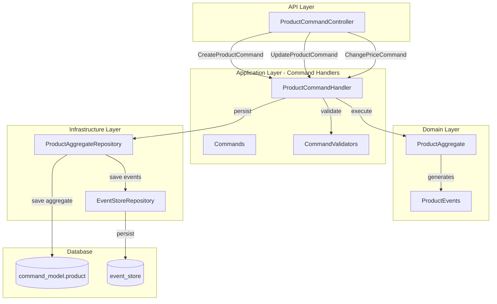
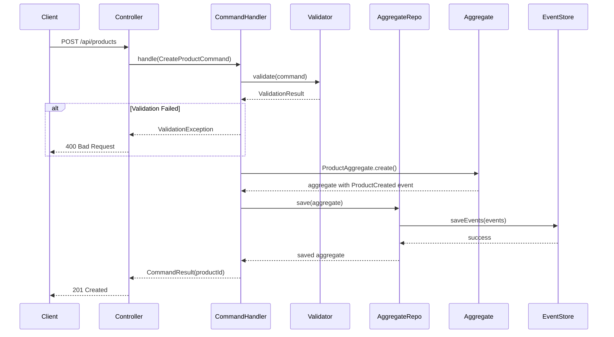
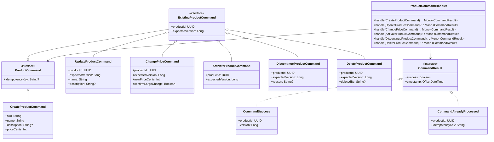
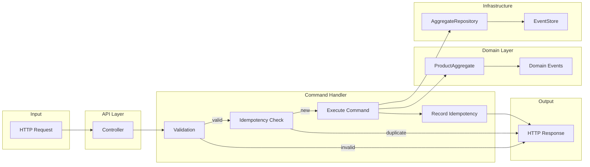

# Implementation Plan: AC3 - Command Handlers

**Feature:** Product Catalog (CQRS Architecture)
**Acceptance Criteria:** AC3 - Command Handlers
**Status:** Planning
**Estimated Effort:** 4-5 days

---

## Overview

This implementation plan details the creation of Command Handlers for the Product aggregate in the CQRS architecture. Command handlers serve as the application service layer that orchestrates command processing, coordinates with the aggregate and event store, handles validation, and implements idempotency where appropriate.

## Architecture



## Prerequisites

Before starting this implementation:

- [x] AC1 (Product Command Model) is complete - `ProductAggregate` exists with business logic
- [x] AC2 (Product Event Store) is complete - `ProductEventStoreRepository` persists events
- [x] `ProductAggregateRepository` is available for aggregate persistence
- [x] Domain events are defined (`ProductCreated`, `ProductUpdated`, etc.)
- [x] Domain exceptions are defined (`ProductNotFoundException`, etc.)

## Acceptance Criteria Reference

From the feature specification:

> - `CreateProductCommand` creates a new product and emits `ProductCreated` event
> - `UpdateProductCommand` updates product details and emits `ProductUpdated` event
> - `ChangePriceCommand` updates price and emits `ProductPriceChanged` event
> - `ActivateProductCommand` transitions product to ACTIVE status
> - `DiscontinueProductCommand` transitions product to DISCONTINUED status
> - `DeleteProductCommand` soft-deletes the product and emits `ProductDeleted` event
> - All commands are validated before processing
> - Commands return appropriate error responses for invalid operations
> - Commands implement idempotency where appropriate

---

## Command Flow Diagram



---

## Implementation Steps

### Step 1: Define Command Data Classes

**Objective:** Create immutable command data classes representing all product operations.

#### 1.1 Create Command Sealed Interface and Base Classes

**File:** `src/main/kotlin/com/pintailconsultingllc/cqrsspike/product/command/model/Commands.kt`

```kotlin
package com.pintailconsultingllc.cqrsspike.product.command.model

import java.util.UUID

/**
 * Marker interface for all Product commands.
 * Commands are immutable requests to change the state of the system.
 */
sealed interface ProductCommand {
    /**
     * Optional idempotency key for duplicate request detection.
     * If provided, the same command with the same key will not be processed twice.
     */
    val idempotencyKey: String?
}

/**
 * Commands that target an existing product.
 */
sealed interface ExistingProductCommand : ProductCommand {
    val productId: UUID
    val expectedVersion: Long
}

/**
 * Command to create a new product.
 */
data class CreateProductCommand(
    val sku: String,
    val name: String,
    val description: String?,
    val priceCents: Int,
    override val idempotencyKey: String? = null
) : ProductCommand

/**
 * Command to update product details (name and description).
 */
data class UpdateProductCommand(
    override val productId: UUID,
    override val expectedVersion: Long,
    val name: String,
    val description: String?,
    override val idempotencyKey: String? = null
) : ExistingProductCommand

/**
 * Command to change the product price.
 */
data class ChangePriceCommand(
    override val productId: UUID,
    override val expectedVersion: Long,
    val newPriceCents: Int,
    val confirmLargeChange: Boolean = false,
    override val idempotencyKey: String? = null
) : ExistingProductCommand

/**
 * Command to activate a product (DRAFT -> ACTIVE).
 */
data class ActivateProductCommand(
    override val productId: UUID,
    override val expectedVersion: Long,
    override val idempotencyKey: String? = null
) : ExistingProductCommand

/**
 * Command to discontinue a product.
 */
data class DiscontinueProductCommand(
    override val productId: UUID,
    override val expectedVersion: Long,
    val reason: String? = null,
    override val idempotencyKey: String? = null
) : ExistingProductCommand

/**
 * Command to soft-delete a product.
 */
data class DeleteProductCommand(
    override val productId: UUID,
    override val expectedVersion: Long,
    val deletedBy: String? = null,
    override val idempotencyKey: String? = null
) : ExistingProductCommand
```

#### 1.2 Create Command Result Classes

**File:** `src/main/kotlin/com/pintailconsultingllc/cqrsspike/product/command/model/CommandResults.kt`

```kotlin
package com.pintailconsultingllc.cqrsspike.product.command.model

import java.time.OffsetDateTime
import java.util.UUID

/**
 * Base interface for command results.
 */
sealed interface CommandResult {
    val success: Boolean
    val timestamp: OffsetDateTime
}

/**
 * Successful command execution result.
 */
data class CommandSuccess(
    val productId: UUID,
    val version: Long,
    override val timestamp: OffsetDateTime = OffsetDateTime.now()
) : CommandResult {
    override val success: Boolean = true
}

/**
 * Result for idempotent commands that were already processed.
 */
data class CommandAlreadyProcessed(
    val productId: UUID,
    val idempotencyKey: String,
    override val timestamp: OffsetDateTime = OffsetDateTime.now()
) : CommandResult {
    override val success: Boolean = true
}
```

#### 1.3 Verification

- [ ] Command classes compile without errors
- [ ] All commands are immutable (data classes with val)
- [ ] Commands capture all necessary information for processing
- [ ] IdempotencyKey is optional on all commands

---

### Step 2: Create Command Validation Infrastructure

**Objective:** Create a validation framework for validating commands before processing.

#### 2.1 Create Validation Result Classes

**File:** `src/main/kotlin/com/pintailconsultingllc/cqrsspike/product/command/validation/ValidationResult.kt`

```kotlin
package com.pintailconsultingllc.cqrsspike.product.command.validation

/**
 * Represents a validation error with field and message.
 */
data class ValidationError(
    val field: String,
    val message: String,
    val code: String? = null
)

/**
 * Result of command validation.
 */
sealed class ValidationResult {
    /**
     * Validation passed successfully.
     */
    data object Valid : ValidationResult()

    /**
     * Validation failed with one or more errors.
     */
    data class Invalid(val errors: List<ValidationError>) : ValidationResult() {
        constructor(vararg errors: ValidationError) : this(errors.toList())

        fun toException(): CommandValidationException = CommandValidationException(errors)
    }

    val isValid: Boolean get() = this is Valid
}

/**
 * Exception thrown when command validation fails.
 */
class CommandValidationException(
    val errors: List<ValidationError>
) : RuntimeException("Command validation failed: ${errors.joinToString { "${it.field}: ${it.message}" }}")
```

#### 2.2 Create Command Validators

**File:** `src/main/kotlin/com/pintailconsultingllc/cqrsspike/product/command/validation/CommandValidators.kt`

```kotlin
package com.pintailconsultingllc.cqrsspike.product.command.validation

import com.pintailconsultingllc.cqrsspike.product.command.aggregate.ProductAggregate
import com.pintailconsultingllc.cqrsspike.product.command.model.ChangePriceCommand
import com.pintailconsultingllc.cqrsspike.product.command.model.CreateProductCommand
import com.pintailconsultingllc.cqrsspike.product.command.model.DeleteProductCommand
import com.pintailconsultingllc.cqrsspike.product.command.model.DiscontinueProductCommand
import com.pintailconsultingllc.cqrsspike.product.command.model.UpdateProductCommand
import org.springframework.stereotype.Component

/**
 * Validates CreateProductCommand.
 */
@Component
class CreateProductCommandValidator {

    companion object {
        private val SKU_PATTERN = Regex("^[A-Za-z0-9\\-]{3,50}$")
    }

    fun validate(command: CreateProductCommand): ValidationResult {
        val errors = mutableListOf<ValidationError>()

        // SKU validation
        val trimmedSku = command.sku.trim()
        when {
            trimmedSku.isBlank() -> errors.add(
                ValidationError("sku", "SKU is required", "REQUIRED")
            )
            trimmedSku.length < ProductAggregate.MIN_SKU_LENGTH -> errors.add(
                ValidationError("sku", "SKU must be at least ${ProductAggregate.MIN_SKU_LENGTH} characters", "MIN_LENGTH")
            )
            trimmedSku.length > ProductAggregate.MAX_SKU_LENGTH -> errors.add(
                ValidationError("sku", "SKU must not exceed ${ProductAggregate.MAX_SKU_LENGTH} characters", "MAX_LENGTH")
            )
            !SKU_PATTERN.matches(trimmedSku) -> errors.add(
                ValidationError("sku", "SKU must contain only alphanumeric characters and hyphens", "INVALID_FORMAT")
            )
        }

        // Name validation
        val trimmedName = command.name.trim()
        when {
            trimmedName.isBlank() -> errors.add(
                ValidationError("name", "Name is required", "REQUIRED")
            )
            trimmedName.length > ProductAggregate.MAX_NAME_LENGTH -> errors.add(
                ValidationError("name", "Name must not exceed ${ProductAggregate.MAX_NAME_LENGTH} characters", "MAX_LENGTH")
            )
        }

        // Description validation
        command.description?.let { desc ->
            if (desc.length > ProductAggregate.MAX_DESCRIPTION_LENGTH) {
                errors.add(
                    ValidationError("description", "Description must not exceed ${ProductAggregate.MAX_DESCRIPTION_LENGTH} characters", "MAX_LENGTH")
                )
            }
        }

        // Price validation
        if (command.priceCents <= 0) {
            errors.add(
                ValidationError("priceCents", "Price must be positive", "POSITIVE_REQUIRED")
            )
        }

        return if (errors.isEmpty()) ValidationResult.Valid else ValidationResult.Invalid(errors)
    }
}

/**
 * Validates UpdateProductCommand.
 */
@Component
class UpdateProductCommandValidator {

    fun validate(command: UpdateProductCommand): ValidationResult {
        val errors = mutableListOf<ValidationError>()

        // Name validation
        val trimmedName = command.name.trim()
        when {
            trimmedName.isBlank() -> errors.add(
                ValidationError("name", "Name is required", "REQUIRED")
            )
            trimmedName.length > ProductAggregate.MAX_NAME_LENGTH -> errors.add(
                ValidationError("name", "Name must not exceed ${ProductAggregate.MAX_NAME_LENGTH} characters", "MAX_LENGTH")
            )
        }

        // Description validation
        command.description?.let { desc ->
            if (desc.length > ProductAggregate.MAX_DESCRIPTION_LENGTH) {
                errors.add(
                    ValidationError("description", "Description must not exceed ${ProductAggregate.MAX_DESCRIPTION_LENGTH} characters", "MAX_LENGTH")
                )
            }
        }

        // Version validation
        if (command.expectedVersion < 1) {
            errors.add(
                ValidationError("expectedVersion", "Expected version must be positive", "POSITIVE_REQUIRED")
            )
        }

        return if (errors.isEmpty()) ValidationResult.Valid else ValidationResult.Invalid(errors)
    }
}

/**
 * Validates ChangePriceCommand.
 */
@Component
class ChangePriceCommandValidator {

    fun validate(command: ChangePriceCommand): ValidationResult {
        val errors = mutableListOf<ValidationError>()

        if (command.newPriceCents <= 0) {
            errors.add(
                ValidationError("newPriceCents", "Price must be positive", "POSITIVE_REQUIRED")
            )
        }

        if (command.expectedVersion < 1) {
            errors.add(
                ValidationError("expectedVersion", "Expected version must be positive", "POSITIVE_REQUIRED")
            )
        }

        return if (errors.isEmpty()) ValidationResult.Valid else ValidationResult.Invalid(errors)
    }
}

/**
 * Validates DiscontinueProductCommand.
 */
@Component
class DiscontinueProductCommandValidator {

    companion object {
        const val MAX_REASON_LENGTH = 500
    }

    fun validate(command: DiscontinueProductCommand): ValidationResult {
        val errors = mutableListOf<ValidationError>()

        command.reason?.let { reason ->
            if (reason.length > MAX_REASON_LENGTH) {
                errors.add(
                    ValidationError("reason", "Reason must not exceed $MAX_REASON_LENGTH characters", "MAX_LENGTH")
                )
            }
        }

        if (command.expectedVersion < 1) {
            errors.add(
                ValidationError("expectedVersion", "Expected version must be positive", "POSITIVE_REQUIRED")
            )
        }

        return if (errors.isEmpty()) ValidationResult.Valid else ValidationResult.Invalid(errors)
    }
}

/**
 * Validates DeleteProductCommand.
 */
@Component
class DeleteProductCommandValidator {

    companion object {
        const val MAX_DELETED_BY_LENGTH = 255
    }

    fun validate(command: DeleteProductCommand): ValidationResult {
        val errors = mutableListOf<ValidationError>()

        command.deletedBy?.let { deletedBy ->
            if (deletedBy.length > MAX_DELETED_BY_LENGTH) {
                errors.add(
                    ValidationError("deletedBy", "DeletedBy must not exceed $MAX_DELETED_BY_LENGTH characters", "MAX_LENGTH")
                )
            }
        }

        if (command.expectedVersion < 1) {
            errors.add(
                ValidationError("expectedVersion", "Expected version must be positive", "POSITIVE_REQUIRED")
            )
        }

        return if (errors.isEmpty()) ValidationResult.Valid else ValidationResult.Invalid(errors)
    }
}
```

#### 2.3 Verification

- [ ] Validators compile without errors
- [ ] Each command type has a corresponding validator
- [ ] Validation errors include field name, message, and optional code
- [ ] Validators are Spring components for injection

---

### Step 3: Create Idempotency Infrastructure

**Objective:** Create infrastructure for tracking processed commands to support idempotency.

#### 3.1 Create Idempotency Entity and Repository

**File:** `src/main/kotlin/com/pintailconsultingllc/cqrsspike/product/command/infrastructure/IdempotencyEntity.kt`

```kotlin
package com.pintailconsultingllc.cqrsspike.product.command.infrastructure

import org.springframework.data.annotation.Id
import org.springframework.data.relational.core.mapping.Column
import org.springframework.data.relational.core.mapping.Table
import java.time.OffsetDateTime
import java.util.UUID

/**
 * Entity for tracking processed commands for idempotency.
 */
@Table("command_model.processed_command")
data class ProcessedCommandEntity(
    @Id
    @Column("idempotency_key")
    val idempotencyKey: String,

    @Column("command_type")
    val commandType: String,

    @Column("product_id")
    val productId: UUID,

    @Column("result_data")
    val resultData: String?,

    @Column("processed_at")
    val processedAt: OffsetDateTime = OffsetDateTime.now(),

    @Column("expires_at")
    val expiresAt: OffsetDateTime
)
```

**File:** `src/main/kotlin/com/pintailconsultingllc/cqrsspike/product/command/infrastructure/IdempotencyRepository.kt`

```kotlin
package com.pintailconsultingllc.cqrsspike.product.command.infrastructure

import org.springframework.data.r2dbc.repository.Query
import org.springframework.data.repository.reactive.ReactiveCrudRepository
import org.springframework.stereotype.Repository
import reactor.core.publisher.Mono
import java.time.OffsetDateTime

/**
 * Repository for processed command tracking (idempotency).
 */
@Repository
interface IdempotencyRepository : ReactiveCrudRepository<ProcessedCommandEntity, String> {

    /**
     * Find a processed command by idempotency key.
     */
    @Query("""
        SELECT * FROM command_model.processed_command
        WHERE idempotency_key = :key AND expires_at > NOW()
    """)
    fun findByIdempotencyKey(key: String): Mono<ProcessedCommandEntity>

    /**
     * Delete expired entries (for cleanup job).
     */
    @Query("DELETE FROM command_model.processed_command WHERE expires_at < :cutoff")
    fun deleteExpiredBefore(cutoff: OffsetDateTime): Mono<Int>
}
```

#### 3.2 Create Database Migration for Idempotency Table

**File:** `src/main/resources/db/migration/V4__create_idempotency_table.sql`

```sql
-- Idempotency tracking table for command handlers
CREATE TABLE IF NOT EXISTS command_model.processed_command (
    idempotency_key VARCHAR(255) PRIMARY KEY,
    command_type VARCHAR(100) NOT NULL,
    product_id UUID NOT NULL,
    result_data TEXT,
    processed_at TIMESTAMPTZ NOT NULL DEFAULT NOW(),
    expires_at TIMESTAMPTZ NOT NULL
);

-- Index for cleanup queries
CREATE INDEX idx_processed_command_expires_at
    ON command_model.processed_command(expires_at);

-- Index for product-specific queries
CREATE INDEX idx_processed_command_product_id
    ON command_model.processed_command(product_id);

-- Comment for documentation
COMMENT ON TABLE command_model.processed_command IS
    'Tracks processed commands for idempotency. Entries expire after configured TTL.';
```

#### 3.3 Create Idempotency Service

**File:** `src/main/kotlin/com/pintailconsultingllc/cqrsspike/product/command/service/IdempotencyService.kt`

```kotlin
package com.pintailconsultingllc.cqrsspike.product.command.service

import com.fasterxml.jackson.databind.ObjectMapper
import com.pintailconsultingllc.cqrsspike.product.command.infrastructure.IdempotencyRepository
import com.pintailconsultingllc.cqrsspike.product.command.infrastructure.ProcessedCommandEntity
import com.pintailconsultingllc.cqrsspike.product.command.model.CommandResult
import com.pintailconsultingllc.cqrsspike.product.command.model.CommandSuccess
import org.slf4j.LoggerFactory
import org.springframework.beans.factory.annotation.Value
import org.springframework.stereotype.Service
import reactor.core.publisher.Mono
import java.time.Duration
import java.time.OffsetDateTime
import java.util.UUID

/**
 * Service for handling command idempotency.
 *
 * Tracks processed commands by idempotency key to prevent duplicate processing.
 */
@Service
class IdempotencyService(
    private val repository: IdempotencyRepository,
    private val objectMapper: ObjectMapper,
    @Value("\${product.command.idempotency.ttl-hours:24}")
    private val ttlHours: Long
) {
    private val logger = LoggerFactory.getLogger(IdempotencyService::class.java)

    /**
     * Checks if a command with the given idempotency key has already been processed.
     *
     * @param idempotencyKey The unique key for the command
     * @return Mono<CommandResult?> - The previous result if found, null otherwise
     */
    fun checkIdempotency(idempotencyKey: String?): Mono<CommandSuccess?> {
        if (idempotencyKey == null) {
            return Mono.just(null)
        }

        return repository.findByIdempotencyKey(idempotencyKey)
            .map { entity ->
                try {
                    objectMapper.readValue(entity.resultData, CommandSuccess::class.java)
                } catch (e: Exception) {
                    logger.warn("Failed to deserialize result for key $idempotencyKey", e)
                    CommandSuccess(
                        productId = entity.productId,
                        version = 0,
                        timestamp = entity.processedAt
                    )
                }
            }
            .defaultIfEmpty(null as CommandSuccess?)
            .onErrorResume { error ->
                logger.error("Error checking idempotency for key $idempotencyKey", error)
                Mono.just(null)
            }
    }

    /**
     * Records a successfully processed command.
     *
     * @param idempotencyKey The unique key for the command
     * @param commandType The type of command processed
     * @param productId The affected product ID
     * @param result The command result to store
     */
    fun recordProcessedCommand(
        idempotencyKey: String?,
        commandType: String,
        productId: UUID,
        result: CommandSuccess
    ): Mono<Void> {
        if (idempotencyKey == null) {
            return Mono.empty()
        }

        val entity = ProcessedCommandEntity(
            idempotencyKey = idempotencyKey,
            commandType = commandType,
            productId = productId,
            resultData = objectMapper.writeValueAsString(result),
            expiresAt = OffsetDateTime.now().plusHours(ttlHours)
        )

        return repository.save(entity)
            .doOnSuccess {
                logger.debug("Recorded processed command: key=$idempotencyKey, type=$commandType")
            }
            .then()
    }

    /**
     * Cleans up expired idempotency records.
     * Should be called by a scheduled job.
     */
    fun cleanupExpired(): Mono<Int> {
        return repository.deleteExpiredBefore(OffsetDateTime.now())
            .doOnSuccess { count ->
                if (count > 0) {
                    logger.info("Cleaned up $count expired idempotency records")
                }
            }
    }
}
```

#### 3.4 Verification

- [ ] Idempotency entity and repository compile
- [ ] Database migration can be applied
- [ ] IdempotencyService handles all edge cases
- [ ] TTL is configurable

---

### Step 4: Create Product Command Handler

**Objective:** Create the main command handler that orchestrates command processing.

#### 4.1 Create ProductCommandHandler

**File:** `src/main/kotlin/com/pintailconsultingllc/cqrsspike/product/command/handler/ProductCommandHandler.kt`

```kotlin
package com.pintailconsultingllc.cqrsspike.product.command.handler

import com.pintailconsultingllc.cqrsspike.product.command.aggregate.ProductAggregate
import com.pintailconsultingllc.cqrsspike.product.command.infrastructure.ProductAggregateRepository
import com.pintailconsultingllc.cqrsspike.product.command.model.ActivateProductCommand
import com.pintailconsultingllc.cqrsspike.product.command.model.ChangePriceCommand
import com.pintailconsultingllc.cqrsspike.product.command.model.CommandAlreadyProcessed
import com.pintailconsultingllc.cqrsspike.product.command.model.CommandResult
import com.pintailconsultingllc.cqrsspike.product.command.model.CommandSuccess
import com.pintailconsultingllc.cqrsspike.product.command.model.CreateProductCommand
import com.pintailconsultingllc.cqrsspike.product.command.model.DeleteProductCommand
import com.pintailconsultingllc.cqrsspike.product.command.model.DiscontinueProductCommand
import com.pintailconsultingllc.cqrsspike.product.command.model.ExistingProductCommand
import com.pintailconsultingllc.cqrsspike.product.command.model.UpdateProductCommand
import com.pintailconsultingllc.cqrsspike.product.command.service.IdempotencyService
import com.pintailconsultingllc.cqrsspike.product.command.validation.ChangePriceCommandValidator
import com.pintailconsultingllc.cqrsspike.product.command.validation.CreateProductCommandValidator
import com.pintailconsultingllc.cqrsspike.product.command.validation.DeleteProductCommandValidator
import com.pintailconsultingllc.cqrsspike.product.command.validation.DiscontinueProductCommandValidator
import com.pintailconsultingllc.cqrsspike.product.command.validation.UpdateProductCommandValidator
import com.pintailconsultingllc.cqrsspike.product.command.validation.ValidationResult
import io.github.resilience4j.circuitbreaker.annotation.CircuitBreaker
import io.github.resilience4j.ratelimiter.annotation.RateLimiter
import io.github.resilience4j.retry.annotation.Retry
import org.slf4j.LoggerFactory
import org.springframework.stereotype.Service
import org.springframework.transaction.annotation.Transactional
import reactor.core.publisher.Mono
import java.util.UUID

/**
 * Command handler for Product aggregate.
 *
 * Orchestrates command processing including:
 * - Validation
 * - Idempotency checking
 * - Aggregate loading/creation
 * - Business logic execution
 * - Persistence
 * - Event publication
 *
 * Implements resiliency patterns (circuit breaker, retry, rate limiting).
 */
@Service
class ProductCommandHandler(
    private val aggregateRepository: ProductAggregateRepository,
    private val idempotencyService: IdempotencyService,
    private val createValidator: CreateProductCommandValidator,
    private val updateValidator: UpdateProductCommandValidator,
    private val changePriceValidator: ChangePriceCommandValidator,
    private val discontinueValidator: DiscontinueProductCommandValidator,
    private val deleteValidator: DeleteProductCommandValidator
) {
    private val logger = LoggerFactory.getLogger(ProductCommandHandler::class.java)

    /**
     * Handles CreateProductCommand.
     * Creates a new product with the given details.
     *
     * @param command The create product command
     * @return Mono<CommandResult> with the created product ID and version
     */
    @RateLimiter(name = "productCommands", fallbackMethod = "rateLimitFallback")
    @Retry(name = "productCommands", fallbackMethod = "retryFallback")
    @CircuitBreaker(name = "productCommands", fallbackMethod = "circuitBreakerFallback")
    @Transactional
    fun handle(command: CreateProductCommand): Mono<CommandResult> {
        logger.info("Handling CreateProductCommand: sku=${command.sku}")

        return checkIdempotency(command.idempotencyKey, "CreateProductCommand")
            .flatMap { existingResult ->
                if (existingResult != null) {
                    logger.info("Idempotent request detected: key=${command.idempotencyKey}")
                    Mono.just(CommandAlreadyProcessed(
                        productId = existingResult.productId,
                        idempotencyKey = command.idempotencyKey!!
                    ) as CommandResult)
                } else {
                    validateAndExecuteCreate(command)
                }
            }
    }

    /**
     * Handles UpdateProductCommand.
     * Updates product details (name and description).
     *
     * @param command The update product command
     * @return Mono<CommandResult> with the updated product ID and version
     */
    @RateLimiter(name = "productCommands", fallbackMethod = "rateLimitFallback")
    @Retry(name = "productCommands", fallbackMethod = "retryFallback")
    @CircuitBreaker(name = "productCommands", fallbackMethod = "circuitBreakerFallback")
    @Transactional
    fun handle(command: UpdateProductCommand): Mono<CommandResult> {
        logger.info("Handling UpdateProductCommand: productId=${command.productId}")

        return checkIdempotency(command.idempotencyKey, "UpdateProductCommand")
            .flatMap { existingResult ->
                if (existingResult != null) {
                    Mono.just(CommandAlreadyProcessed(
                        productId = existingResult.productId,
                        idempotencyKey = command.idempotencyKey!!
                    ) as CommandResult)
                } else {
                    validateAndExecuteUpdate(command)
                }
            }
    }

    /**
     * Handles ChangePriceCommand.
     * Changes the product price.
     *
     * @param command The change price command
     * @return Mono<CommandResult> with the updated product ID and version
     */
    @RateLimiter(name = "productCommands", fallbackMethod = "rateLimitFallback")
    @Retry(name = "productCommands", fallbackMethod = "retryFallback")
    @CircuitBreaker(name = "productCommands", fallbackMethod = "circuitBreakerFallback")
    @Transactional
    fun handle(command: ChangePriceCommand): Mono<CommandResult> {
        logger.info("Handling ChangePriceCommand: productId=${command.productId}")

        return checkIdempotency(command.idempotencyKey, "ChangePriceCommand")
            .flatMap { existingResult ->
                if (existingResult != null) {
                    Mono.just(CommandAlreadyProcessed(
                        productId = existingResult.productId,
                        idempotencyKey = command.idempotencyKey!!
                    ) as CommandResult)
                } else {
                    validateAndExecuteChangePrice(command)
                }
            }
    }

    /**
     * Handles ActivateProductCommand.
     * Transitions a product from DRAFT to ACTIVE status.
     *
     * @param command The activate product command
     * @return Mono<CommandResult> with the updated product ID and version
     */
    @RateLimiter(name = "productCommands", fallbackMethod = "rateLimitFallback")
    @Retry(name = "productCommands", fallbackMethod = "retryFallback")
    @CircuitBreaker(name = "productCommands", fallbackMethod = "circuitBreakerFallback")
    @Transactional
    fun handle(command: ActivateProductCommand): Mono<CommandResult> {
        logger.info("Handling ActivateProductCommand: productId=${command.productId}")

        return checkIdempotency(command.idempotencyKey, "ActivateProductCommand")
            .flatMap { existingResult ->
                if (existingResult != null) {
                    Mono.just(CommandAlreadyProcessed(
                        productId = existingResult.productId,
                        idempotencyKey = command.idempotencyKey!!
                    ) as CommandResult)
                } else {
                    executeActivate(command)
                }
            }
    }

    /**
     * Handles DiscontinueProductCommand.
     * Transitions a product to DISCONTINUED status.
     *
     * @param command The discontinue product command
     * @return Mono<CommandResult> with the updated product ID and version
     */
    @RateLimiter(name = "productCommands", fallbackMethod = "rateLimitFallback")
    @Retry(name = "productCommands", fallbackMethod = "retryFallback")
    @CircuitBreaker(name = "productCommands", fallbackMethod = "circuitBreakerFallback")
    @Transactional
    fun handle(command: DiscontinueProductCommand): Mono<CommandResult> {
        logger.info("Handling DiscontinueProductCommand: productId=${command.productId}")

        return checkIdempotency(command.idempotencyKey, "DiscontinueProductCommand")
            .flatMap { existingResult ->
                if (existingResult != null) {
                    Mono.just(CommandAlreadyProcessed(
                        productId = existingResult.productId,
                        idempotencyKey = command.idempotencyKey!!
                    ) as CommandResult)
                } else {
                    validateAndExecuteDiscontinue(command)
                }
            }
    }

    /**
     * Handles DeleteProductCommand.
     * Soft-deletes a product.
     *
     * @param command The delete product command
     * @return Mono<CommandResult> with the deleted product ID and version
     */
    @RateLimiter(name = "productCommands", fallbackMethod = "rateLimitFallback")
    @Retry(name = "productCommands", fallbackMethod = "retryFallback")
    @CircuitBreaker(name = "productCommands", fallbackMethod = "circuitBreakerFallback")
    @Transactional
    fun handle(command: DeleteProductCommand): Mono<CommandResult> {
        logger.info("Handling DeleteProductCommand: productId=${command.productId}")

        return checkIdempotency(command.idempotencyKey, "DeleteProductCommand")
            .flatMap { existingResult ->
                if (existingResult != null) {
                    Mono.just(CommandAlreadyProcessed(
                        productId = existingResult.productId,
                        idempotencyKey = command.idempotencyKey!!
                    ) as CommandResult)
                } else {
                    validateAndExecuteDelete(command)
                }
            }
    }

    // Private helper methods

    private fun checkIdempotency(
        idempotencyKey: String?,
        commandType: String
    ): Mono<CommandSuccess?> {
        return idempotencyService.checkIdempotency(idempotencyKey)
    }

    private fun recordIdempotency(
        idempotencyKey: String?,
        commandType: String,
        productId: UUID,
        result: CommandSuccess
    ): Mono<CommandSuccess> {
        return idempotencyService.recordProcessedCommand(idempotencyKey, commandType, productId, result)
            .thenReturn(result)
    }

    private fun validateAndExecuteCreate(command: CreateProductCommand): Mono<CommandResult> {
        val validationResult = createValidator.validate(command)
        if (validationResult is ValidationResult.Invalid) {
            return Mono.error(validationResult.toException())
        }

        return Mono.fromCallable {
            ProductAggregate.create(
                sku = command.sku,
                name = command.name,
                description = command.description,
                priceCents = command.priceCents
            )
        }
        .flatMap { aggregate ->
            aggregateRepository.save(aggregate)
                .map { saved ->
                    CommandSuccess(
                        productId = saved.id,
                        version = saved.version
                    )
                }
        }
        .flatMap { result ->
            recordIdempotency(command.idempotencyKey, "CreateProductCommand", result.productId, result)
        }
        .map { it as CommandResult }
        .doOnSuccess { result ->
            logger.info("Product created: productId=${(result as CommandSuccess).productId}")
        }
    }

    private fun validateAndExecuteUpdate(command: UpdateProductCommand): Mono<CommandResult> {
        val validationResult = updateValidator.validate(command)
        if (validationResult is ValidationResult.Invalid) {
            return Mono.error(validationResult.toException())
        }

        return loadAndExecute(command) { aggregate ->
            aggregate.update(
                newName = command.name,
                newDescription = command.description,
                expectedVersion = command.expectedVersion
            )
        }
        .flatMap { result ->
            recordIdempotency(command.idempotencyKey, "UpdateProductCommand", result.productId, result)
        }
        .map { it as CommandResult }
    }

    private fun validateAndExecuteChangePrice(command: ChangePriceCommand): Mono<CommandResult> {
        val validationResult = changePriceValidator.validate(command)
        if (validationResult is ValidationResult.Invalid) {
            return Mono.error(validationResult.toException())
        }

        return loadAndExecute(command) { aggregate ->
            aggregate.changePrice(
                newPriceCents = command.newPriceCents,
                expectedVersion = command.expectedVersion,
                confirmLargeChange = command.confirmLargeChange
            )
        }
        .flatMap { result ->
            recordIdempotency(command.idempotencyKey, "ChangePriceCommand", result.productId, result)
        }
        .map { it as CommandResult }
    }

    private fun executeActivate(command: ActivateProductCommand): Mono<CommandResult> {
        return loadAndExecute(command) { aggregate ->
            aggregate.activate(expectedVersion = command.expectedVersion)
        }
        .flatMap { result ->
            recordIdempotency(command.idempotencyKey, "ActivateProductCommand", result.productId, result)
        }
        .map { it as CommandResult }
    }

    private fun validateAndExecuteDiscontinue(command: DiscontinueProductCommand): Mono<CommandResult> {
        val validationResult = discontinueValidator.validate(command)
        if (validationResult is ValidationResult.Invalid) {
            return Mono.error(validationResult.toException())
        }

        return loadAndExecute(command) { aggregate ->
            aggregate.discontinue(
                expectedVersion = command.expectedVersion,
                reason = command.reason
            )
        }
        .flatMap { result ->
            recordIdempotency(command.idempotencyKey, "DiscontinueProductCommand", result.productId, result)
        }
        .map { it as CommandResult }
    }

    private fun validateAndExecuteDelete(command: DeleteProductCommand): Mono<CommandResult> {
        val validationResult = deleteValidator.validate(command)
        if (validationResult is ValidationResult.Invalid) {
            return Mono.error(validationResult.toException())
        }

        return loadAndExecute(command) { aggregate ->
            aggregate.delete(
                expectedVersion = command.expectedVersion,
                deletedBy = command.deletedBy
            )
        }
        .flatMap { result ->
            recordIdempotency(command.idempotencyKey, "DeleteProductCommand", result.productId, result)
        }
        .map { it as CommandResult }
    }

    /**
     * Generic method to load an aggregate and execute a command on it.
     */
    private fun loadAndExecute(
        command: ExistingProductCommand,
        action: (ProductAggregate) -> ProductAggregate
    ): Mono<CommandSuccess> {
        return aggregateRepository.findById(command.productId)
            .flatMap { aggregate ->
                Mono.fromCallable { action(aggregate) }
            }
            .flatMap { updatedAggregate ->
                aggregateRepository.update(updatedAggregate)
            }
            .map { saved ->
                CommandSuccess(
                    productId = saved.id,
                    version = saved.version
                )
            }
    }

    // Fallback methods for resiliency

    @Suppress("unused")
    private fun rateLimitFallback(command: CreateProductCommand, ex: Exception): Mono<CommandResult> {
        logger.warn("Rate limit exceeded for CreateProductCommand", ex)
        return Mono.error(CommandRateLimitException("Too many requests. Please try again later."))
    }

    @Suppress("unused")
    private fun rateLimitFallback(command: UpdateProductCommand, ex: Exception): Mono<CommandResult> {
        logger.warn("Rate limit exceeded for UpdateProductCommand", ex)
        return Mono.error(CommandRateLimitException("Too many requests. Please try again later."))
    }

    @Suppress("unused")
    private fun rateLimitFallback(command: ChangePriceCommand, ex: Exception): Mono<CommandResult> {
        logger.warn("Rate limit exceeded for ChangePriceCommand", ex)
        return Mono.error(CommandRateLimitException("Too many requests. Please try again later."))
    }

    @Suppress("unused")
    private fun rateLimitFallback(command: ActivateProductCommand, ex: Exception): Mono<CommandResult> {
        logger.warn("Rate limit exceeded for ActivateProductCommand", ex)
        return Mono.error(CommandRateLimitException("Too many requests. Please try again later."))
    }

    @Suppress("unused")
    private fun rateLimitFallback(command: DiscontinueProductCommand, ex: Exception): Mono<CommandResult> {
        logger.warn("Rate limit exceeded for DiscontinueProductCommand", ex)
        return Mono.error(CommandRateLimitException("Too many requests. Please try again later."))
    }

    @Suppress("unused")
    private fun rateLimitFallback(command: DeleteProductCommand, ex: Exception): Mono<CommandResult> {
        logger.warn("Rate limit exceeded for DeleteProductCommand", ex)
        return Mono.error(CommandRateLimitException("Too many requests. Please try again later."))
    }

    @Suppress("unused")
    private fun retryFallback(command: CreateProductCommand, ex: Exception): Mono<CommandResult> {
        logger.error("Retry exhausted for CreateProductCommand", ex)
        return Mono.error(ex)
    }

    @Suppress("unused")
    private fun retryFallback(command: UpdateProductCommand, ex: Exception): Mono<CommandResult> {
        logger.error("Retry exhausted for UpdateProductCommand", ex)
        return Mono.error(ex)
    }

    @Suppress("unused")
    private fun retryFallback(command: ChangePriceCommand, ex: Exception): Mono<CommandResult> {
        logger.error("Retry exhausted for ChangePriceCommand", ex)
        return Mono.error(ex)
    }

    @Suppress("unused")
    private fun retryFallback(command: ActivateProductCommand, ex: Exception): Mono<CommandResult> {
        logger.error("Retry exhausted for ActivateProductCommand", ex)
        return Mono.error(ex)
    }

    @Suppress("unused")
    private fun retryFallback(command: DiscontinueProductCommand, ex: Exception): Mono<CommandResult> {
        logger.error("Retry exhausted for DiscontinueProductCommand", ex)
        return Mono.error(ex)
    }

    @Suppress("unused")
    private fun retryFallback(command: DeleteProductCommand, ex: Exception): Mono<CommandResult> {
        logger.error("Retry exhausted for DeleteProductCommand", ex)
        return Mono.error(ex)
    }

    @Suppress("unused")
    private fun circuitBreakerFallback(command: CreateProductCommand, ex: Exception): Mono<CommandResult> {
        logger.error("Circuit breaker open for CreateProductCommand", ex)
        return Mono.error(CommandServiceUnavailableException("Service temporarily unavailable. Please try again later."))
    }

    @Suppress("unused")
    private fun circuitBreakerFallback(command: UpdateProductCommand, ex: Exception): Mono<CommandResult> {
        logger.error("Circuit breaker open for UpdateProductCommand", ex)
        return Mono.error(CommandServiceUnavailableException("Service temporarily unavailable. Please try again later."))
    }

    @Suppress("unused")
    private fun circuitBreakerFallback(command: ChangePriceCommand, ex: Exception): Mono<CommandResult> {
        logger.error("Circuit breaker open for ChangePriceCommand", ex)
        return Mono.error(CommandServiceUnavailableException("Service temporarily unavailable. Please try again later."))
    }

    @Suppress("unused")
    private fun circuitBreakerFallback(command: ActivateProductCommand, ex: Exception): Mono<CommandResult> {
        logger.error("Circuit breaker open for ActivateProductCommand", ex)
        return Mono.error(CommandServiceUnavailableException("Service temporarily unavailable. Please try again later."))
    }

    @Suppress("unused")
    private fun circuitBreakerFallback(command: DiscontinueProductCommand, ex: Exception): Mono<CommandResult> {
        logger.error("Circuit breaker open for DiscontinueProductCommand", ex)
        return Mono.error(CommandServiceUnavailableException("Service temporarily unavailable. Please try again later."))
    }

    @Suppress("unused")
    private fun circuitBreakerFallback(command: DeleteProductCommand, ex: Exception): Mono<CommandResult> {
        logger.error("Circuit breaker open for DeleteProductCommand", ex)
        return Mono.error(CommandServiceUnavailableException("Service temporarily unavailable. Please try again later."))
    }
}

/**
 * Exception thrown when rate limit is exceeded.
 */
class CommandRateLimitException(message: String) : RuntimeException(message)

/**
 * Exception thrown when service is unavailable (circuit breaker open).
 */
class CommandServiceUnavailableException(message: String) : RuntimeException(message)
```

#### 4.2 Verification

- [ ] Command handler compiles without errors
- [ ] All command types have corresponding handle methods
- [ ] Validation is performed before processing
- [ ] Idempotency is checked for commands with idempotency keys
- [ ] Resiliency annotations are correctly applied

---

### Step 5: Create Unit Tests for Command Handlers

**Objective:** Create comprehensive unit tests for command handler behavior.

#### 5.1 Create Command Handler Unit Tests

**File:** `src/test/kotlin/com/pintailconsultingllc/cqrsspike/product/command/handler/ProductCommandHandlerTest.kt`

```kotlin
package com.pintailconsultingllc.cqrsspike.product.command.handler

import com.pintailconsultingllc.cqrsspike.product.command.aggregate.ProductAggregate
import com.pintailconsultingllc.cqrsspike.product.command.exception.ProductNotFoundException
import com.pintailconsultingllc.cqrsspike.product.command.infrastructure.ProductAggregateRepository
import com.pintailconsultingllc.cqrsspike.product.command.model.ActivateProductCommand
import com.pintailconsultingllc.cqrsspike.product.command.model.ChangePriceCommand
import com.pintailconsultingllc.cqrsspike.product.command.model.CommandAlreadyProcessed
import com.pintailconsultingllc.cqrsspike.product.command.model.CommandSuccess
import com.pintailconsultingllc.cqrsspike.product.command.model.CreateProductCommand
import com.pintailconsultingllc.cqrsspike.product.command.model.DeleteProductCommand
import com.pintailconsultingllc.cqrsspike.product.command.model.DiscontinueProductCommand
import com.pintailconsultingllc.cqrsspike.product.command.model.UpdateProductCommand
import com.pintailconsultingllc.cqrsspike.product.command.service.IdempotencyService
import com.pintailconsultingllc.cqrsspike.product.command.validation.ChangePriceCommandValidator
import com.pintailconsultingllc.cqrsspike.product.command.validation.CommandValidationException
import com.pintailconsultingllc.cqrsspike.product.command.validation.CreateProductCommandValidator
import com.pintailconsultingllc.cqrsspike.product.command.validation.DeleteProductCommandValidator
import com.pintailconsultingllc.cqrsspike.product.command.validation.DiscontinueProductCommandValidator
import com.pintailconsultingllc.cqrsspike.product.command.validation.UpdateProductCommandValidator
import org.junit.jupiter.api.BeforeEach
import org.junit.jupiter.api.DisplayName
import org.junit.jupiter.api.Nested
import org.junit.jupiter.api.Test
import org.junit.jupiter.api.extension.ExtendWith
import org.mockito.Mock
import org.mockito.junit.jupiter.MockitoExtension
import org.mockito.kotlin.any
import org.mockito.kotlin.verify
import org.mockito.kotlin.whenever
import reactor.core.publisher.Mono
import reactor.test.StepVerifier
import java.time.OffsetDateTime
import java.util.UUID

@ExtendWith(MockitoExtension::class)
@DisplayName("ProductCommandHandler")
class ProductCommandHandlerTest {

    @Mock
    private lateinit var aggregateRepository: ProductAggregateRepository

    @Mock
    private lateinit var idempotencyService: IdempotencyService

    private lateinit var handler: ProductCommandHandler

    companion object {
        const val VALID_SKU = "TEST-001"
        const val VALID_NAME = "Test Product"
        const val VALID_DESCRIPTION = "Test description"
        const val VALID_PRICE = 1999
    }

    @BeforeEach
    fun setUp() {
        handler = ProductCommandHandler(
            aggregateRepository = aggregateRepository,
            idempotencyService = idempotencyService,
            createValidator = CreateProductCommandValidator(),
            updateValidator = UpdateProductCommandValidator(),
            changePriceValidator = ChangePriceCommandValidator(),
            discontinueValidator = DiscontinueProductCommandValidator(),
            deleteValidator = DeleteProductCommandValidator()
        )
    }

    @Nested
    @DisplayName("CreateProductCommand")
    inner class CreateProductCommandTests {

        @Test
        @DisplayName("should create product successfully")
        fun shouldCreateProductSuccessfully() {
            val command = CreateProductCommand(
                sku = VALID_SKU,
                name = VALID_NAME,
                description = VALID_DESCRIPTION,
                priceCents = VALID_PRICE
            )

            whenever(idempotencyService.checkIdempotency(any()))
                .thenReturn(Mono.just(null as CommandSuccess?))

            whenever(aggregateRepository.save(any()))
                .thenAnswer { invocation ->
                    val aggregate = invocation.getArgument<ProductAggregate>(0)
                    Mono.just(aggregate)
                }

            whenever(idempotencyService.recordProcessedCommand(any(), any(), any(), any()))
                .thenReturn(Mono.empty())

            StepVerifier.create(handler.handle(command))
                .expectNextMatches { result ->
                    result is CommandSuccess &&
                    result.version == 1L
                }
                .verifyComplete()

            verify(aggregateRepository).save(any())
        }

        @Test
        @DisplayName("should fail validation for empty SKU")
        fun shouldFailValidationForEmptySku() {
            val command = CreateProductCommand(
                sku = "",
                name = VALID_NAME,
                description = null,
                priceCents = VALID_PRICE
            )

            whenever(idempotencyService.checkIdempotency(any()))
                .thenReturn(Mono.just(null as CommandSuccess?))

            StepVerifier.create(handler.handle(command))
                .expectError(CommandValidationException::class.java)
                .verify()
        }

        @Test
        @DisplayName("should return cached result for idempotent request")
        fun shouldReturnCachedResultForIdempotentRequest() {
            val idempotencyKey = UUID.randomUUID().toString()
            val productId = UUID.randomUUID()

            val command = CreateProductCommand(
                sku = VALID_SKU,
                name = VALID_NAME,
                description = null,
                priceCents = VALID_PRICE,
                idempotencyKey = idempotencyKey
            )

            val cachedResult = CommandSuccess(
                productId = productId,
                version = 1L,
                timestamp = OffsetDateTime.now()
            )

            whenever(idempotencyService.checkIdempotency(idempotencyKey))
                .thenReturn(Mono.just(cachedResult))

            StepVerifier.create(handler.handle(command))
                .expectNextMatches { result ->
                    result is CommandAlreadyProcessed &&
                    result.productId == productId &&
                    result.idempotencyKey == idempotencyKey
                }
                .verifyComplete()
        }
    }

    @Nested
    @DisplayName("UpdateProductCommand")
    inner class UpdateProductCommandTests {

        @Test
        @DisplayName("should update product successfully")
        fun shouldUpdateProductSuccessfully() {
            val productId = UUID.randomUUID()
            val aggregate = ProductAggregate.create(
                sku = VALID_SKU,
                name = VALID_NAME,
                description = VALID_DESCRIPTION,
                priceCents = VALID_PRICE
            )

            val command = UpdateProductCommand(
                productId = productId,
                expectedVersion = 1L,
                name = "Updated Name",
                description = "Updated description"
            )

            whenever(idempotencyService.checkIdempotency(any()))
                .thenReturn(Mono.just(null as CommandSuccess?))

            whenever(aggregateRepository.findById(productId))
                .thenReturn(Mono.just(aggregate))

            whenever(aggregateRepository.update(any()))
                .thenAnswer { invocation ->
                    Mono.just(invocation.getArgument<ProductAggregate>(0))
                }

            whenever(idempotencyService.recordProcessedCommand(any(), any(), any(), any()))
                .thenReturn(Mono.empty())

            StepVerifier.create(handler.handle(command))
                .expectNextMatches { result ->
                    result is CommandSuccess &&
                    result.version == 2L
                }
                .verifyComplete()
        }

        @Test
        @DisplayName("should fail when product not found")
        fun shouldFailWhenProductNotFound() {
            val productId = UUID.randomUUID()
            val command = UpdateProductCommand(
                productId = productId,
                expectedVersion = 1L,
                name = "Updated Name",
                description = null
            )

            whenever(idempotencyService.checkIdempotency(any()))
                .thenReturn(Mono.just(null as CommandSuccess?))

            whenever(aggregateRepository.findById(productId))
                .thenReturn(Mono.error(ProductNotFoundException(productId)))

            StepVerifier.create(handler.handle(command))
                .expectError(ProductNotFoundException::class.java)
                .verify()
        }
    }

    @Nested
    @DisplayName("ChangePriceCommand")
    inner class ChangePriceCommandTests {

        @Test
        @DisplayName("should change price successfully")
        fun shouldChangePriceSuccessfully() {
            val productId = UUID.randomUUID()
            val aggregate = ProductAggregate.create(
                sku = VALID_SKU,
                name = VALID_NAME,
                description = null,
                priceCents = VALID_PRICE
            )

            val command = ChangePriceCommand(
                productId = productId,
                expectedVersion = 1L,
                newPriceCents = 2999
            )

            whenever(idempotencyService.checkIdempotency(any()))
                .thenReturn(Mono.just(null as CommandSuccess?))

            whenever(aggregateRepository.findById(productId))
                .thenReturn(Mono.just(aggregate))

            whenever(aggregateRepository.update(any()))
                .thenAnswer { invocation ->
                    Mono.just(invocation.getArgument<ProductAggregate>(0))
                }

            whenever(idempotencyService.recordProcessedCommand(any(), any(), any(), any()))
                .thenReturn(Mono.empty())

            StepVerifier.create(handler.handle(command))
                .expectNextMatches { result ->
                    result is CommandSuccess
                }
                .verifyComplete()
        }

        @Test
        @DisplayName("should fail validation for non-positive price")
        fun shouldFailValidationForNonPositivePrice() {
            val command = ChangePriceCommand(
                productId = UUID.randomUUID(),
                expectedVersion = 1L,
                newPriceCents = 0
            )

            whenever(idempotencyService.checkIdempotency(any()))
                .thenReturn(Mono.just(null as CommandSuccess?))

            StepVerifier.create(handler.handle(command))
                .expectError(CommandValidationException::class.java)
                .verify()
        }
    }

    @Nested
    @DisplayName("ActivateProductCommand")
    inner class ActivateProductCommandTests {

        @Test
        @DisplayName("should activate product successfully")
        fun shouldActivateProductSuccessfully() {
            val productId = UUID.randomUUID()
            val aggregate = ProductAggregate.create(
                sku = VALID_SKU,
                name = VALID_NAME,
                description = null,
                priceCents = VALID_PRICE
            )

            val command = ActivateProductCommand(
                productId = productId,
                expectedVersion = 1L
            )

            whenever(idempotencyService.checkIdempotency(any()))
                .thenReturn(Mono.just(null as CommandSuccess?))

            whenever(aggregateRepository.findById(productId))
                .thenReturn(Mono.just(aggregate))

            whenever(aggregateRepository.update(any()))
                .thenAnswer { invocation ->
                    Mono.just(invocation.getArgument<ProductAggregate>(0))
                }

            whenever(idempotencyService.recordProcessedCommand(any(), any(), any(), any()))
                .thenReturn(Mono.empty())

            StepVerifier.create(handler.handle(command))
                .expectNextMatches { result ->
                    result is CommandSuccess &&
                    result.version == 2L
                }
                .verifyComplete()
        }
    }

    @Nested
    @DisplayName("DiscontinueProductCommand")
    inner class DiscontinueProductCommandTests {

        @Test
        @DisplayName("should discontinue product successfully")
        fun shouldDiscontinueProductSuccessfully() {
            val productId = UUID.randomUUID()
            val aggregate = ProductAggregate.create(
                sku = VALID_SKU,
                name = VALID_NAME,
                description = null,
                priceCents = VALID_PRICE
            )

            val command = DiscontinueProductCommand(
                productId = productId,
                expectedVersion = 1L,
                reason = "No longer manufactured"
            )

            whenever(idempotencyService.checkIdempotency(any()))
                .thenReturn(Mono.just(null as CommandSuccess?))

            whenever(aggregateRepository.findById(productId))
                .thenReturn(Mono.just(aggregate))

            whenever(aggregateRepository.update(any()))
                .thenAnswer { invocation ->
                    Mono.just(invocation.getArgument<ProductAggregate>(0))
                }

            whenever(idempotencyService.recordProcessedCommand(any(), any(), any(), any()))
                .thenReturn(Mono.empty())

            StepVerifier.create(handler.handle(command))
                .expectNextMatches { result ->
                    result is CommandSuccess
                }
                .verifyComplete()
        }
    }

    @Nested
    @DisplayName("DeleteProductCommand")
    inner class DeleteProductCommandTests {

        @Test
        @DisplayName("should delete product successfully")
        fun shouldDeleteProductSuccessfully() {
            val productId = UUID.randomUUID()
            val aggregate = ProductAggregate.create(
                sku = VALID_SKU,
                name = VALID_NAME,
                description = null,
                priceCents = VALID_PRICE
            )

            val command = DeleteProductCommand(
                productId = productId,
                expectedVersion = 1L,
                deletedBy = "admin@example.com"
            )

            whenever(idempotencyService.checkIdempotency(any()))
                .thenReturn(Mono.just(null as CommandSuccess?))

            whenever(aggregateRepository.findById(productId))
                .thenReturn(Mono.just(aggregate))

            whenever(aggregateRepository.update(any()))
                .thenAnswer { invocation ->
                    Mono.just(invocation.getArgument<ProductAggregate>(0))
                }

            whenever(idempotencyService.recordProcessedCommand(any(), any(), any(), any()))
                .thenReturn(Mono.empty())

            StepVerifier.create(handler.handle(command))
                .expectNextMatches { result ->
                    result is CommandSuccess
                }
                .verifyComplete()
        }
    }
}
```

#### 5.2 Create Validator Unit Tests

**File:** `src/test/kotlin/com/pintailconsultingllc/cqrsspike/product/command/validation/CommandValidatorsTest.kt`

```kotlin
package com.pintailconsultingllc.cqrsspike.product.command.validation

import com.pintailconsultingllc.cqrsspike.product.command.model.ChangePriceCommand
import com.pintailconsultingllc.cqrsspike.product.command.model.CreateProductCommand
import com.pintailconsultingllc.cqrsspike.product.command.model.UpdateProductCommand
import org.junit.jupiter.api.DisplayName
import org.junit.jupiter.api.Nested
import org.junit.jupiter.api.Test
import java.util.UUID
import kotlin.test.assertEquals
import kotlin.test.assertIs
import kotlin.test.assertTrue

@DisplayName("Command Validators")
class CommandValidatorsTest {

    @Nested
    @DisplayName("CreateProductCommandValidator")
    inner class CreateProductCommandValidatorTests {

        private val validator = CreateProductCommandValidator()

        @Test
        @DisplayName("should pass for valid command")
        fun shouldPassForValidCommand() {
            val command = CreateProductCommand(
                sku = "PROD-001",
                name = "Test Product",
                description = "A test product",
                priceCents = 1999
            )

            val result = validator.validate(command)

            assertIs<ValidationResult.Valid>(result)
        }

        @Test
        @DisplayName("should fail for empty SKU")
        fun shouldFailForEmptySku() {
            val command = CreateProductCommand(
                sku = "",
                name = "Test Product",
                description = null,
                priceCents = 1999
            )

            val result = validator.validate(command)

            assertIs<ValidationResult.Invalid>(result)
            assertTrue(result.errors.any { it.field == "sku" })
        }

        @Test
        @DisplayName("should fail for SKU with invalid characters")
        fun shouldFailForSkuWithInvalidCharacters() {
            val command = CreateProductCommand(
                sku = "PROD@001!",
                name = "Test Product",
                description = null,
                priceCents = 1999
            )

            val result = validator.validate(command)

            assertIs<ValidationResult.Invalid>(result)
            assertTrue(result.errors.any { it.field == "sku" && it.code == "INVALID_FORMAT" })
        }

        @Test
        @DisplayName("should fail for empty name")
        fun shouldFailForEmptyName() {
            val command = CreateProductCommand(
                sku = "PROD-001",
                name = "",
                description = null,
                priceCents = 1999
            )

            val result = validator.validate(command)

            assertIs<ValidationResult.Invalid>(result)
            assertTrue(result.errors.any { it.field == "name" })
        }

        @Test
        @DisplayName("should fail for non-positive price")
        fun shouldFailForNonPositivePrice() {
            val command = CreateProductCommand(
                sku = "PROD-001",
                name = "Test Product",
                description = null,
                priceCents = 0
            )

            val result = validator.validate(command)

            assertIs<ValidationResult.Invalid>(result)
            assertTrue(result.errors.any { it.field == "priceCents" })
        }

        @Test
        @DisplayName("should collect multiple validation errors")
        fun shouldCollectMultipleValidationErrors() {
            val command = CreateProductCommand(
                sku = "",
                name = "",
                description = null,
                priceCents = -100
            )

            val result = validator.validate(command)

            assertIs<ValidationResult.Invalid>(result)
            assertTrue(result.errors.size >= 3)
        }
    }

    @Nested
    @DisplayName("UpdateProductCommandValidator")
    inner class UpdateProductCommandValidatorTests {

        private val validator = UpdateProductCommandValidator()

        @Test
        @DisplayName("should pass for valid command")
        fun shouldPassForValidCommand() {
            val command = UpdateProductCommand(
                productId = UUID.randomUUID(),
                expectedVersion = 1L,
                name = "Updated Name",
                description = "Updated description"
            )

            val result = validator.validate(command)

            assertIs<ValidationResult.Valid>(result)
        }

        @Test
        @DisplayName("should fail for non-positive version")
        fun shouldFailForNonPositiveVersion() {
            val command = UpdateProductCommand(
                productId = UUID.randomUUID(),
                expectedVersion = 0L,
                name = "Updated Name",
                description = null
            )

            val result = validator.validate(command)

            assertIs<ValidationResult.Invalid>(result)
            assertTrue(result.errors.any { it.field == "expectedVersion" })
        }
    }

    @Nested
    @DisplayName("ChangePriceCommandValidator")
    inner class ChangePriceCommandValidatorTests {

        private val validator = ChangePriceCommandValidator()

        @Test
        @DisplayName("should pass for valid command")
        fun shouldPassForValidCommand() {
            val command = ChangePriceCommand(
                productId = UUID.randomUUID(),
                expectedVersion = 1L,
                newPriceCents = 2999
            )

            val result = validator.validate(command)

            assertIs<ValidationResult.Valid>(result)
        }

        @Test
        @DisplayName("should fail for negative price")
        fun shouldFailForNegativePrice() {
            val command = ChangePriceCommand(
                productId = UUID.randomUUID(),
                expectedVersion = 1L,
                newPriceCents = -100
            )

            val result = validator.validate(command)

            assertIs<ValidationResult.Invalid>(result)
            assertTrue(result.errors.any { it.field == "newPriceCents" })
        }
    }
}
```

#### 5.3 Verification

- [ ] All unit tests pass
- [ ] Test coverage meets 80% threshold
- [ ] Edge cases are tested
- [ ] Error scenarios are tested

---

### Step 6: Create Integration Tests

**Objective:** Create integration tests that verify the complete command flow.

#### 6.1 Create Command Handler Integration Tests

**File:** `src/test/kotlin/com/pintailconsultingllc/cqrsspike/product/command/handler/ProductCommandHandlerIntegrationTest.kt`

```kotlin
package com.pintailconsultingllc.cqrsspike.product.command.handler

import com.pintailconsultingllc.cqrsspike.product.command.model.ActivateProductCommand
import com.pintailconsultingllc.cqrsspike.product.command.model.ChangePriceCommand
import com.pintailconsultingllc.cqrsspike.product.command.model.CommandAlreadyProcessed
import com.pintailconsultingllc.cqrsspike.product.command.model.CommandSuccess
import com.pintailconsultingllc.cqrsspike.product.command.model.CreateProductCommand
import com.pintailconsultingllc.cqrsspike.product.command.model.DeleteProductCommand
import com.pintailconsultingllc.cqrsspike.product.command.model.UpdateProductCommand
import com.pintailconsultingllc.cqrsspike.product.command.validation.CommandValidationException
import org.junit.jupiter.api.DisplayName
import org.junit.jupiter.api.Nested
import org.junit.jupiter.api.Test
import org.springframework.beans.factory.annotation.Autowired
import org.springframework.boot.test.context.SpringBootTest
import org.springframework.test.context.DynamicPropertyRegistry
import org.springframework.test.context.DynamicPropertySource
import org.testcontainers.containers.PostgreSQLContainer
import org.testcontainers.junit.jupiter.Container
import org.testcontainers.junit.jupiter.Testcontainers
import reactor.test.StepVerifier
import java.util.UUID

@SpringBootTest
@Testcontainers(disabledWithoutDocker = true)
@DisplayName("ProductCommandHandler Integration Tests")
class ProductCommandHandlerIntegrationTest {

    companion object {
        @Container
        @JvmStatic
        val postgres: PostgreSQLContainer<*> = PostgreSQLContainer("postgres:18-alpine")
            .withDatabaseName("cqrs_test")
            .withUsername("test")
            .withPassword("test")
            .withInitScript("init-test-schema.sql")

        @DynamicPropertySource
        @JvmStatic
        fun configureProperties(registry: DynamicPropertyRegistry) {
            registry.add("spring.r2dbc.url") {
                "r2dbc:postgresql://${postgres.host}:${postgres.firstMappedPort}/${postgres.databaseName}"
            }
            registry.add("spring.r2dbc.username", postgres::getUsername)
            registry.add("spring.r2dbc.password", postgres::getPassword)
            registry.add("spring.flyway.enabled") { "false" }
            registry.add("spring.cloud.vault.enabled") { "false" }
        }
    }

    @Autowired
    private lateinit var commandHandler: ProductCommandHandler

    @Nested
    @DisplayName("Full Command Lifecycle")
    inner class FullCommandLifecycle {

        @Test
        @DisplayName("should execute full product lifecycle")
        fun shouldExecuteFullProductLifecycle() {
            val sku = "LIFECYCLE-${UUID.randomUUID().toString().take(8)}"

            // Create product
            val createCommand = CreateProductCommand(
                sku = sku,
                name = "Lifecycle Test Product",
                description = "Testing full lifecycle",
                priceCents = 1999
            )

            val createResult = StepVerifier.create(commandHandler.handle(createCommand))
                .expectNextMatches { it is CommandSuccess }
                .verifyComplete()

            // Get product ID from result
            val productId = (commandHandler.handle(createCommand).block() as? CommandSuccess)?.productId
                ?: throw AssertionError("Failed to get product ID")

            // Update product
            val updateCommand = UpdateProductCommand(
                productId = productId,
                expectedVersion = 1L,
                name = "Updated Lifecycle Product",
                description = "Updated description"
            )

            StepVerifier.create(commandHandler.handle(updateCommand))
                .expectNextMatches { result ->
                    result is CommandSuccess && result.version == 2L
                }
                .verifyComplete()

            // Change price
            val changePriceCommand = ChangePriceCommand(
                productId = productId,
                expectedVersion = 2L,
                newPriceCents = 2999
            )

            StepVerifier.create(commandHandler.handle(changePriceCommand))
                .expectNextMatches { result ->
                    result is CommandSuccess && result.version == 3L
                }
                .verifyComplete()

            // Activate product
            val activateCommand = ActivateProductCommand(
                productId = productId,
                expectedVersion = 3L
            )

            StepVerifier.create(commandHandler.handle(activateCommand))
                .expectNextMatches { result ->
                    result is CommandSuccess && result.version == 4L
                }
                .verifyComplete()

            // Delete product
            val deleteCommand = DeleteProductCommand(
                productId = productId,
                expectedVersion = 4L,
                deletedBy = "integration-test"
            )

            StepVerifier.create(commandHandler.handle(deleteCommand))
                .expectNextMatches { result ->
                    result is CommandSuccess && result.version == 5L
                }
                .verifyComplete()
        }
    }

    @Nested
    @DisplayName("Idempotency")
    inner class Idempotency {

        @Test
        @DisplayName("should return same result for duplicate idempotent request")
        fun shouldReturnSameResultForDuplicateRequest() {
            val idempotencyKey = UUID.randomUUID().toString()
            val sku = "IDEMP-${UUID.randomUUID().toString().take(8)}"

            val command = CreateProductCommand(
                sku = sku,
                name = "Idempotency Test",
                description = null,
                priceCents = 999,
                idempotencyKey = idempotencyKey
            )

            // First request
            val firstResult = commandHandler.handle(command).block() as CommandSuccess

            // Second request with same idempotency key
            StepVerifier.create(commandHandler.handle(command))
                .expectNextMatches { result ->
                    result is CommandAlreadyProcessed &&
                    result.productId == firstResult.productId &&
                    result.idempotencyKey == idempotencyKey
                }
                .verifyComplete()
        }
    }

    @Nested
    @DisplayName("Validation")
    inner class Validation {

        @Test
        @DisplayName("should reject invalid create command")
        fun shouldRejectInvalidCreateCommand() {
            val command = CreateProductCommand(
                sku = "",
                name = "",
                description = null,
                priceCents = -100
            )

            StepVerifier.create(commandHandler.handle(command))
                .expectError(CommandValidationException::class.java)
                .verify()
        }
    }
}
```

#### 6.2 Verification

- [ ] Integration tests pass with Docker
- [ ] Full command lifecycle works correctly
- [ ] Idempotency is verified
- [ ] Events are correctly persisted

---

### Step 7: Configure Resiliency

**Objective:** Configure Resilience4j for command handlers.

#### 7.1 Add Resilience4j Configuration

**File:** `src/main/resources/application-resilience.yml` (merge with existing configuration)

```yaml
resilience4j:
  circuitbreaker:
    instances:
      productCommands:
        registerHealthIndicator: true
        slidingWindowSize: 10
        minimumNumberOfCalls: 5
        permittedNumberOfCallsInHalfOpenState: 3
        automaticTransitionFromOpenToHalfOpenEnabled: true
        waitDurationInOpenState: 30s
        failureRateThreshold: 50
        eventConsumerBufferSize: 10
        recordExceptions:
          - java.io.IOException
          - java.net.SocketTimeoutException
          - org.springframework.dao.DataAccessException
        ignoreExceptions:
          - com.pintailconsultingllc.cqrsspike.product.command.validation.CommandValidationException
          - com.pintailconsultingllc.cqrsspike.product.command.exception.ProductNotFoundException

  retry:
    instances:
      productCommands:
        maxAttempts: 3
        waitDuration: 500ms
        enableExponentialBackoff: true
        exponentialBackoffMultiplier: 2
        retryExceptions:
          - java.io.IOException
          - java.net.SocketTimeoutException
        ignoreExceptions:
          - com.pintailconsultingllc.cqrsspike.product.command.validation.CommandValidationException
          - com.pintailconsultingllc.cqrsspike.product.command.exception.ProductNotFoundException

  ratelimiter:
    instances:
      productCommands:
        limitForPeriod: 100
        limitRefreshPeriod: 1s
        timeoutDuration: 5s
        registerHealthIndicator: true
        eventConsumerBufferSize: 100
```

#### 7.2 Verification

- [ ] Configuration loads without errors
- [ ] Circuit breaker activates on failures
- [ ] Rate limiter enforces limits
- [ ] Retry logic works correctly

---

## Verification Checklist

### Functional Requirements

| Requirement | Status |
|-------------|--------|
| `CreateProductCommand` creates product and emits `ProductCreated` event | [ ] |
| `UpdateProductCommand` updates details and emits `ProductUpdated` event | [ ] |
| `ChangePriceCommand` updates price and emits `ProductPriceChanged` event | [ ] |
| `ActivateProductCommand` transitions to ACTIVE status | [ ] |
| `DiscontinueProductCommand` transitions to DISCONTINUED status | [ ] |
| `DeleteProductCommand` soft-deletes and emits `ProductDeleted` event | [ ] |
| All commands are validated before processing | [ ] |
| Commands return appropriate error responses | [ ] |
| Commands implement idempotency where appropriate | [ ] |

### Technical Requirements

| Requirement | Status |
|-------------|--------|
| All code follows CONSTITUTION.md guidelines | [ ] |
| Reactive types used throughout (`Mono<T>`) | [ ] |
| Data classes used for commands | [ ] |
| Proper logging implemented | [ ] |
| Unit tests achieve 80%+ coverage | [ ] |
| Integration tests pass | [ ] |
| Resiliency patterns implemented | [ ] |

### Code Quality

| Requirement | Status |
|-------------|--------|
| Code compiles without warnings | [ ] |
| No blocking operations in reactive pipeline | [ ] |
| Proper error handling with domain exceptions | [ ] |
| Clear and meaningful variable/method names | [ ] |
| KDoc documentation on public APIs | [ ] |

---

## Component Diagram



---

## Data Flow Diagram



---

## Dependencies on Other ACs

| AC | Dependency Type | Description |
|----|-----------------|-------------|
| AC1 | Required | ProductAggregate with business logic |
| AC2 | Required | EventStoreRepository for event persistence |
| AC7 | Dependent | REST API will use these command handlers |
| AC10 | Integration | Resiliency patterns configuration |

---

## Files to Create

| File Path | Description |
|-----------|-------------|
| `src/main/kotlin/.../product/command/model/Commands.kt` | Command data classes |
| `src/main/kotlin/.../product/command/model/CommandResults.kt` | Result data classes |
| `src/main/kotlin/.../product/command/validation/ValidationResult.kt` | Validation infrastructure |
| `src/main/kotlin/.../product/command/validation/CommandValidators.kt` | Command validators |
| `src/main/kotlin/.../product/command/infrastructure/IdempotencyEntity.kt` | Idempotency entity |
| `src/main/kotlin/.../product/command/infrastructure/IdempotencyRepository.kt` | Idempotency repository |
| `src/main/kotlin/.../product/command/service/IdempotencyService.kt` | Idempotency service |
| `src/main/kotlin/.../product/command/handler/ProductCommandHandler.kt` | Main command handler |
| `src/main/resources/db/migration/V4__create_idempotency_table.sql` | Database migration |
| `src/test/kotlin/.../product/command/handler/ProductCommandHandlerTest.kt` | Unit tests |
| `src/test/kotlin/.../product/command/validation/CommandValidatorsTest.kt` | Validator tests |
| `src/test/kotlin/.../product/command/handler/ProductCommandHandlerIntegrationTest.kt` | Integration tests |

---

## Notes and Decisions

1. **Command Pattern:** Using separate data classes for each command type provides clear contracts and enables type-safe validation.

2. **Idempotency Strategy:** Commands with `idempotencyKey` are tracked in a database table with TTL expiration. This prevents duplicate processing of the same command.

3. **Validation Approach:** Validation is performed at the command handler level before aggregate operations. This allows for early failure and clearer error messages.

4. **Resiliency Order:** Annotations are applied in order: RateLimiter → Retry → CircuitBreaker. This ensures rate limiting happens first, retries for transient failures, and circuit breaker for persistent failures.

5. **Transaction Boundaries:** Each command handler method is transactional, ensuring atomic persistence of aggregate state and events.

6. **Error Handling:** Domain exceptions (ProductNotFoundException, etc.) are propagated to the API layer for appropriate HTTP response mapping.

7. **Fallback Methods:** Each resiliency annotation has corresponding fallback methods for graceful degradation.

8. **Logging:** Commands are logged at INFO level with relevant context (productId, sku, etc.) for observability.
