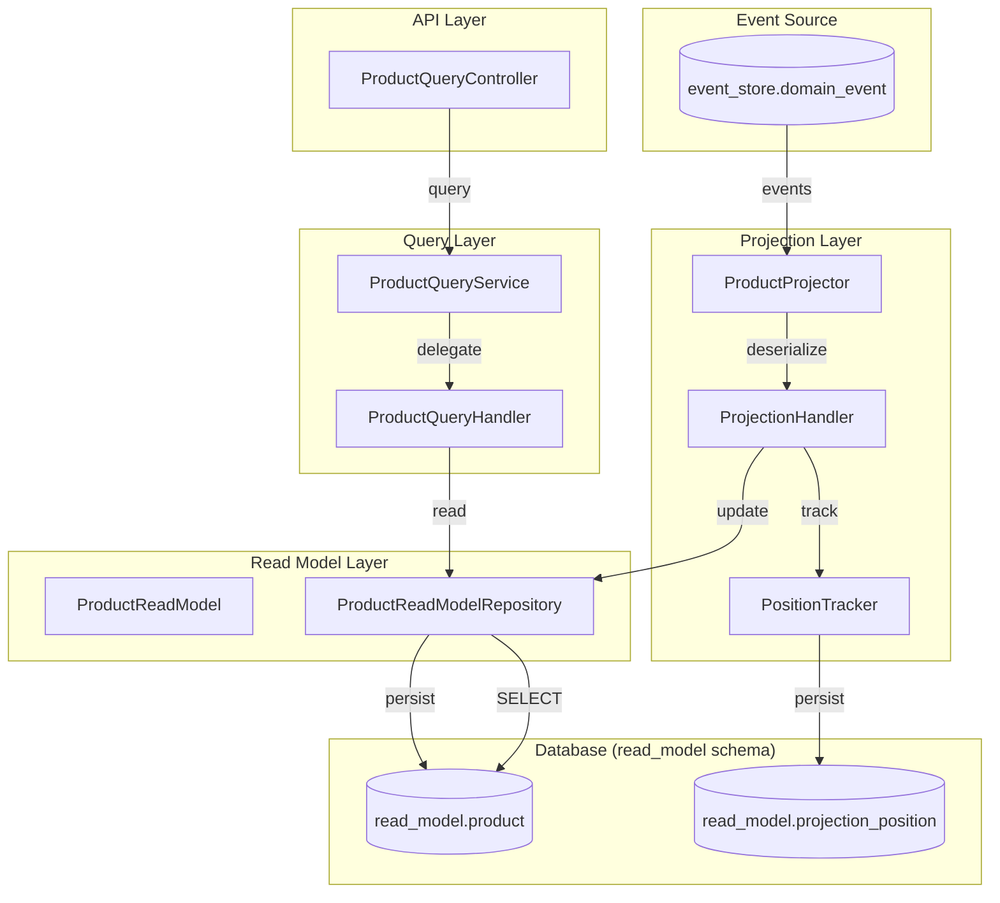
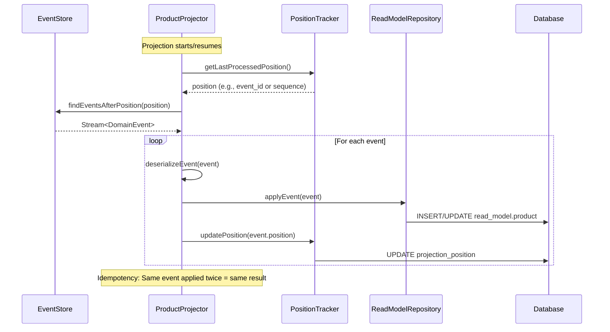
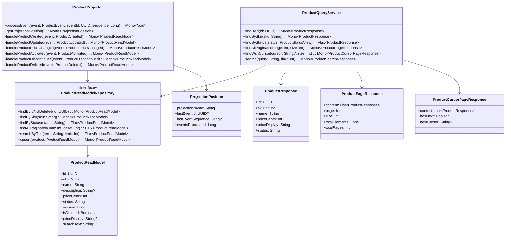
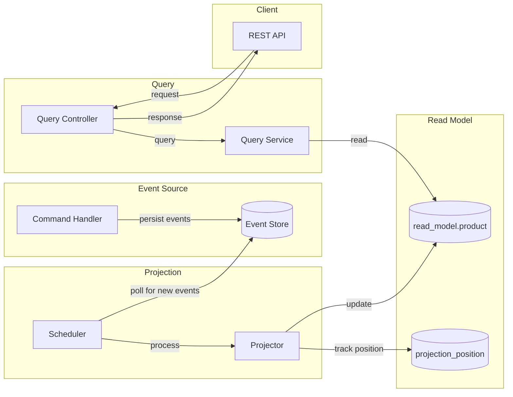

# Implementation Plan: AC4 - Product Read Model

**Feature:** Product Catalog (CQRS Architecture)
**Acceptance Criteria:** AC4 - Product Read Model
**Status:** Planning
**Estimated Effort:** 3-4 days

---

## Overview

This implementation plan details the creation of a denormalized Read Model for the Product aggregate in the CQRS architecture. The read model provides optimized, query-friendly data structures that are updated asynchronously from domain events, enabling fast and scalable read operations independent of the command model.

## Architecture



## Prerequisites

Before starting this implementation:

- [x] AC1 (Product Command Model) is complete - Domain events are defined
- [x] AC2 (Product Event Store) is complete - Events are persisted and queryable
- [x] AC3 (Command Handlers) is complete - Events are being generated
- [x] Read model schema exists (`read_model.product` table)
- [x] Event deserialization infrastructure exists

## Acceptance Criteria Reference

From the feature specification:

> - A denormalized read model exists in the `read_model` schema optimized for queries
> - The read model includes all fields needed for product listing and detail views
> - The read model is updated asynchronously from domain events
> - Read model queries return `Flux<T>` or `Mono<T>` for reactive streaming
> - The read model supports pagination with cursor-based navigation
> - Read model updates are idempotent (safe to replay)

---

## Read Model Data Flow



---

## Implementation Steps

### Step 1: Create Read Model Entity

**Objective:** Create the R2DBC entity that maps to the `read_model.product` table.

#### 1.1 Create ProductReadModel Entity

**File:** `src/main/kotlin/com/pintailconsultingllc/cqrsspike/product/query/model/ProductReadModel.kt`

```kotlin
package com.pintailconsultingllc.cqrsspike.product.query.model

import org.springframework.data.annotation.Id
import org.springframework.data.annotation.Version
import org.springframework.data.relational.core.mapping.Column
import org.springframework.data.relational.core.mapping.Table
import java.time.OffsetDateTime
import java.util.UUID

/**
 * Read model entity for Product queries.
 *
 * This is a denormalized view optimized for read operations.
 * It is updated asynchronously from domain events via projections.
 *
 * Maps to read_model.product table.
 */
@Table("read_model.product")
data class ProductReadModel(
    @Id
    @Column("id")
    val id: UUID,

    @Column("sku")
    val sku: String,

    @Column("name")
    val name: String,

    @Column("description")
    val description: String?,

    @Column("price_cents")
    val priceCents: Int,

    @Column("status")
    val status: String,

    @Column("created_at")
    val createdAt: OffsetDateTime,

    @Column("updated_at")
    val updatedAt: OffsetDateTime,

    @Version
    @Column("version")
    val version: Long,

    @Column("is_deleted")
    val isDeleted: Boolean = false,

    // Denormalized fields for common queries
    @Column("price_display")
    val priceDisplay: String? = null,

    @Column("search_text")
    val searchText: String? = null,

    @Column("last_event_id")
    val lastEventId: UUID? = null
)
```

#### 1.2 Create ProductStatus Enum for Read Model

**File:** `src/main/kotlin/com/pintailconsultingllc/cqrsspike/product/query/model/ProductStatusView.kt`

```kotlin
package com.pintailconsultingllc.cqrsspike.product.query.model

/**
 * Read-side representation of product status.
 * Mirrors the command model status for query operations.
 */
enum class ProductStatusView {
    DRAFT,
    ACTIVE,
    DISCONTINUED;

    companion object {
        fun fromString(value: String): ProductStatusView {
            return entries.find { it.name == value.uppercase() }
                ?: throw IllegalArgumentException("Unknown product status: $value")
        }
    }
}
```

#### 1.3 Verification

- [ ] Entity compiles without errors
- [ ] Column mappings match database schema
- [ ] All query-relevant fields are included
- [ ] Version field enables optimistic locking for projections

---

### Step 2: Create Database Schema Migration

**Objective:** Create or verify the read model database schema with proper indexes for query optimization.

#### 2.1 Create/Update Read Model Schema Migration

**File:** `src/main/resources/db/migration/V5__create_read_model_schema.sql`

```sql
-- Read Model Schema for Product Queries
CREATE SCHEMA IF NOT EXISTS read_model;

-- Product Read Model Table
CREATE TABLE IF NOT EXISTS read_model.product (
    id UUID PRIMARY KEY,
    sku VARCHAR(50) NOT NULL,
    name VARCHAR(255) NOT NULL,
    description TEXT,
    price_cents INTEGER NOT NULL,
    status VARCHAR(20) NOT NULL,
    created_at TIMESTAMPTZ NOT NULL,
    updated_at TIMESTAMPTZ NOT NULL,
    version BIGINT NOT NULL DEFAULT 1,
    is_deleted BOOLEAN NOT NULL DEFAULT FALSE,

    -- Denormalized fields for common queries
    price_display VARCHAR(20),
    search_text TEXT,
    last_event_id UUID,

    -- Constraints
    CONSTRAINT chk_rm_price_positive CHECK (price_cents > 0),
    CONSTRAINT chk_rm_status_valid CHECK (status IN ('DRAFT', 'ACTIVE', 'DISCONTINUED'))
);

-- Indexes for common query patterns
CREATE INDEX IF NOT EXISTS idx_rm_product_status
    ON read_model.product(status)
    WHERE NOT is_deleted;

CREATE INDEX IF NOT EXISTS idx_rm_product_sku
    ON read_model.product(sku)
    WHERE NOT is_deleted;

CREATE INDEX IF NOT EXISTS idx_rm_product_name
    ON read_model.product(name)
    WHERE NOT is_deleted;

CREATE INDEX IF NOT EXISTS idx_rm_product_price
    ON read_model.product(price_cents)
    WHERE NOT is_deleted;

CREATE INDEX IF NOT EXISTS idx_rm_product_created_at
    ON read_model.product(created_at DESC)
    WHERE NOT is_deleted;

CREATE INDEX IF NOT EXISTS idx_rm_product_updated_at
    ON read_model.product(updated_at DESC)
    WHERE NOT is_deleted;

-- Full-text search index for name and description
CREATE INDEX IF NOT EXISTS idx_rm_product_search
    ON read_model.product USING gin(to_tsvector('english', coalesce(name, '') || ' ' || coalesce(description, '')))
    WHERE NOT is_deleted;

-- Cursor-based pagination support (composite index)
CREATE INDEX IF NOT EXISTS idx_rm_product_cursor_created
    ON read_model.product(created_at, id)
    WHERE NOT is_deleted;

CREATE INDEX IF NOT EXISTS idx_rm_product_cursor_name
    ON read_model.product(name, id)
    WHERE NOT is_deleted;

CREATE INDEX IF NOT EXISTS idx_rm_product_cursor_price
    ON read_model.product(price_cents, id)
    WHERE NOT is_deleted;

-- Projection Position Tracking Table
CREATE TABLE IF NOT EXISTS read_model.projection_position (
    projection_name VARCHAR(100) PRIMARY KEY,
    last_event_id UUID,
    last_event_sequence BIGINT,
    last_processed_at TIMESTAMPTZ NOT NULL DEFAULT NOW(),
    events_processed BIGINT NOT NULL DEFAULT 0,
    CONSTRAINT chk_projection_name_format CHECK (projection_name ~ '^[a-zA-Z0-9_-]+$')
);

-- Comments for documentation
COMMENT ON TABLE read_model.product IS
    'Denormalized read model for product queries. Updated via event projections.';

COMMENT ON TABLE read_model.projection_position IS
    'Tracks the last processed event for each projection to enable resumable processing.';

COMMENT ON COLUMN read_model.product.last_event_id IS
    'The ID of the last event that updated this record. Used for idempotency.';

COMMENT ON COLUMN read_model.product.search_text IS
    'Pre-computed searchable text combining name and description for full-text search.';

COMMENT ON COLUMN read_model.product.price_display IS
    'Pre-formatted price string for display (e.g., "$19.99").';
```

#### 2.2 Verification

- [ ] Migration applies successfully
- [ ] All indexes are created
- [ ] Constraints are enforced
- [ ] Full-text search works correctly

---

### Step 3: Create Read Model Repository

**Objective:** Create a reactive repository with optimized query methods for the read model.

#### 3.1 Create ProductReadModelRepository Interface

**File:** `src/main/kotlin/com/pintailconsultingllc/cqrsspike/product/query/repository/ProductReadModelRepository.kt`

```kotlin
package com.pintailconsultingllc.cqrsspike.product.query.repository

import com.pintailconsultingllc.cqrsspike.product.query.model.ProductReadModel
import org.springframework.data.r2dbc.repository.Query
import org.springframework.data.repository.reactive.ReactiveCrudRepository
import org.springframework.stereotype.Repository
import reactor.core.publisher.Flux
import reactor.core.publisher.Mono
import java.util.UUID

/**
 * Reactive repository for Product read model queries.
 *
 * Provides optimized query methods for common access patterns.
 * All queries exclude soft-deleted products by default.
 */
@Repository
interface ProductReadModelRepository : ReactiveCrudRepository<ProductReadModel, UUID> {

    // ============ Single Product Queries ============

    /**
     * Find a product by ID (excluding deleted).
     */
    @Query("""
        SELECT * FROM read_model.product
        WHERE id = :id AND NOT is_deleted
    """)
    fun findByIdNotDeleted(id: UUID): Mono<ProductReadModel>

    /**
     * Find a product by SKU (excluding deleted).
     */
    @Query("""
        SELECT * FROM read_model.product
        WHERE sku = :sku AND NOT is_deleted
    """)
    fun findBySku(sku: String): Mono<ProductReadModel>

    /**
     * Check if a product exists by ID (excluding deleted).
     */
    @Query("""
        SELECT EXISTS(
            SELECT 1 FROM read_model.product
            WHERE id = :id AND NOT is_deleted
        )
    """)
    fun existsByIdNotDeleted(id: UUID): Mono<Boolean>

    // ============ List Queries with Filtering ============

    /**
     * Find all products by status (excluding deleted).
     */
    @Query("""
        SELECT * FROM read_model.product
        WHERE status = :status AND NOT is_deleted
        ORDER BY name ASC
    """)
    fun findByStatus(status: String): Flux<ProductReadModel>

    /**
     * Find products by status with pagination (offset-based).
     */
    @Query("""
        SELECT * FROM read_model.product
        WHERE status = :status AND NOT is_deleted
        ORDER BY name ASC
        LIMIT :limit OFFSET :offset
    """)
    fun findByStatusPaginated(status: String, limit: Int, offset: Int): Flux<ProductReadModel>

    /**
     * Find all active products (status = ACTIVE).
     */
    @Query("""
        SELECT * FROM read_model.product
        WHERE status = 'ACTIVE' AND NOT is_deleted
        ORDER BY name ASC
    """)
    fun findAllActive(): Flux<ProductReadModel>

    /**
     * Find products within a price range.
     */
    @Query("""
        SELECT * FROM read_model.product
        WHERE price_cents >= :minPrice
        AND price_cents <= :maxPrice
        AND NOT is_deleted
        ORDER BY price_cents ASC
    """)
    fun findByPriceRange(minPrice: Int, maxPrice: Int): Flux<ProductReadModel>

    /**
     * Find products by status and price range.
     */
    @Query("""
        SELECT * FROM read_model.product
        WHERE status = :status
        AND price_cents >= :minPrice
        AND price_cents <= :maxPrice
        AND NOT is_deleted
        ORDER BY price_cents ASC
    """)
    fun findByStatusAndPriceRange(
        status: String,
        minPrice: Int,
        maxPrice: Int
    ): Flux<ProductReadModel>

    // ============ Pagination Queries (Offset-based) ============

    /**
     * Find all products with pagination (offset-based).
     */
    @Query("""
        SELECT * FROM read_model.product
        WHERE NOT is_deleted
        ORDER BY created_at DESC
        LIMIT :limit OFFSET :offset
    """)
    fun findAllPaginated(limit: Int, offset: Int): Flux<ProductReadModel>

    /**
     * Find all products sorted by name with pagination.
     */
    @Query("""
        SELECT * FROM read_model.product
        WHERE NOT is_deleted
        ORDER BY name ASC
        LIMIT :limit OFFSET :offset
    """)
    fun findAllSortedByNamePaginated(limit: Int, offset: Int): Flux<ProductReadModel>

    /**
     * Find all products sorted by price with pagination.
     */
    @Query("""
        SELECT * FROM read_model.product
        WHERE NOT is_deleted
        ORDER BY price_cents ASC
        LIMIT :limit OFFSET :offset
    """)
    fun findAllSortedByPricePaginated(limit: Int, offset: Int): Flux<ProductReadModel>

    // ============ Cursor-based Pagination ============

    /**
     * Find products after a cursor (cursor = created_at + id).
     * For cursor-based pagination, sorted by created_at DESC.
     */
    @Query("""
        SELECT * FROM read_model.product
        WHERE NOT is_deleted
        AND (created_at, id) < (:cursorCreatedAt, :cursorId::uuid)
        ORDER BY created_at DESC, id DESC
        LIMIT :limit
    """)
    fun findAfterCursorByCreatedAt(
        cursorCreatedAt: java.time.OffsetDateTime,
        cursorId: UUID,
        limit: Int
    ): Flux<ProductReadModel>

    /**
     * Find products after a cursor (cursor = name + id).
     * For cursor-based pagination, sorted by name ASC.
     */
    @Query("""
        SELECT * FROM read_model.product
        WHERE NOT is_deleted
        AND (name, id) > (:cursorName, :cursorId::uuid)
        ORDER BY name ASC, id ASC
        LIMIT :limit
    """)
    fun findAfterCursorByName(
        cursorName: String,
        cursorId: UUID,
        limit: Int
    ): Flux<ProductReadModel>

    /**
     * Find first page (no cursor) sorted by created_at DESC.
     */
    @Query("""
        SELECT * FROM read_model.product
        WHERE NOT is_deleted
        ORDER BY created_at DESC, id DESC
        LIMIT :limit
    """)
    fun findFirstPageByCreatedAt(limit: Int): Flux<ProductReadModel>

    // ============ Search Queries ============

    /**
     * Full-text search on name and description.
     */
    @Query("""
        SELECT * FROM read_model.product
        WHERE NOT is_deleted
        AND to_tsvector('english', coalesce(name, '') || ' ' || coalesce(description, ''))
            @@ plainto_tsquery('english', :searchTerm)
        ORDER BY ts_rank(
            to_tsvector('english', coalesce(name, '') || ' ' || coalesce(description, '')),
            plainto_tsquery('english', :searchTerm)
        ) DESC
        LIMIT :limit
    """)
    fun searchByText(searchTerm: String, limit: Int): Flux<ProductReadModel>

    /**
     * Search products with status filter.
     */
    @Query("""
        SELECT * FROM read_model.product
        WHERE NOT is_deleted
        AND status = :status
        AND to_tsvector('english', coalesce(name, '') || ' ' || coalesce(description, ''))
            @@ plainto_tsquery('english', :searchTerm)
        ORDER BY ts_rank(
            to_tsvector('english', coalesce(name, '') || ' ' || coalesce(description, '')),
            plainto_tsquery('english', :searchTerm)
        ) DESC
        LIMIT :limit
    """)
    fun searchByTextAndStatus(searchTerm: String, status: String, limit: Int): Flux<ProductReadModel>

    /**
     * Like-based search on name (for autocomplete).
     */
    @Query("""
        SELECT * FROM read_model.product
        WHERE NOT is_deleted
        AND LOWER(name) LIKE LOWER(:prefix || '%')
        ORDER BY name ASC
        LIMIT :limit
    """)
    fun findByNameStartingWith(prefix: String, limit: Int): Flux<ProductReadModel>

    // ============ Count Queries ============

    /**
     * Count all non-deleted products.
     */
    @Query("SELECT COUNT(*) FROM read_model.product WHERE NOT is_deleted")
    fun countAllNotDeleted(): Mono<Long>

    /**
     * Count products by status.
     */
    @Query("SELECT COUNT(*) FROM read_model.product WHERE status = :status AND NOT is_deleted")
    fun countByStatus(status: String): Mono<Long>

    /**
     * Count products matching search term.
     */
    @Query("""
        SELECT COUNT(*) FROM read_model.product
        WHERE NOT is_deleted
        AND to_tsvector('english', coalesce(name, '') || ' ' || coalesce(description, ''))
            @@ plainto_tsquery('english', :searchTerm)
    """)
    fun countBySearchTerm(searchTerm: String): Mono<Long>

    // ============ Projection Support ============

    /**
     * Find by last event ID (for idempotency checking).
     */
    @Query("""
        SELECT * FROM read_model.product
        WHERE id = :productId AND last_event_id = :eventId
    """)
    fun findByIdAndLastEventId(productId: UUID, eventId: UUID): Mono<ProductReadModel>

    /**
     * Upsert product read model (for projections).
     * Uses ON CONFLICT for idempotent updates.
     */
    @Query("""
        INSERT INTO read_model.product (
            id, sku, name, description, price_cents, status,
            created_at, updated_at, version, is_deleted,
            price_display, search_text, last_event_id
        ) VALUES (
            :#{#product.id}, :#{#product.sku}, :#{#product.name},
            :#{#product.description}, :#{#product.priceCents}, :#{#product.status},
            :#{#product.createdAt}, :#{#product.updatedAt}, :#{#product.version},
            :#{#product.isDeleted}, :#{#product.priceDisplay},
            :#{#product.searchText}, :#{#product.lastEventId}
        )
        ON CONFLICT (id) DO UPDATE SET
            sku = EXCLUDED.sku,
            name = EXCLUDED.name,
            description = EXCLUDED.description,
            price_cents = EXCLUDED.price_cents,
            status = EXCLUDED.status,
            updated_at = EXCLUDED.updated_at,
            version = EXCLUDED.version,
            is_deleted = EXCLUDED.is_deleted,
            price_display = EXCLUDED.price_display,
            search_text = EXCLUDED.search_text,
            last_event_id = EXCLUDED.last_event_id
        WHERE read_model.product.version < EXCLUDED.version
        RETURNING *
    """)
    fun upsert(product: ProductReadModel): Mono<ProductReadModel>
}
```

#### 3.2 Create Projection Position Repository

**File:** `src/main/kotlin/com/pintailconsultingllc/cqrsspike/product/query/repository/ProjectionPositionRepository.kt`

```kotlin
package com.pintailconsultingllc.cqrsspike.product.query.repository

import org.springframework.data.annotation.Id
import org.springframework.data.r2dbc.repository.Query
import org.springframework.data.relational.core.mapping.Column
import org.springframework.data.relational.core.mapping.Table
import org.springframework.data.repository.reactive.ReactiveCrudRepository
import org.springframework.stereotype.Repository
import reactor.core.publisher.Mono
import java.time.OffsetDateTime
import java.util.UUID

/**
 * Entity for tracking projection processing position.
 */
@Table("read_model.projection_position")
data class ProjectionPosition(
    @Id
    @Column("projection_name")
    val projectionName: String,

    @Column("last_event_id")
    val lastEventId: UUID?,

    @Column("last_event_sequence")
    val lastEventSequence: Long?,

    @Column("last_processed_at")
    val lastProcessedAt: OffsetDateTime = OffsetDateTime.now(),

    @Column("events_processed")
    val eventsProcessed: Long = 0
)

/**
 * Repository for projection position tracking.
 */
@Repository
interface ProjectionPositionRepository : ReactiveCrudRepository<ProjectionPosition, String> {

    /**
     * Get position for a specific projection.
     */
    fun findByProjectionName(projectionName: String): Mono<ProjectionPosition>

    /**
     * Update projection position atomically.
     */
    @Query("""
        INSERT INTO read_model.projection_position (
            projection_name, last_event_id, last_event_sequence,
            last_processed_at, events_processed
        ) VALUES (
            :projectionName, :lastEventId, :lastEventSequence,
            NOW(), :eventsProcessed
        )
        ON CONFLICT (projection_name) DO UPDATE SET
            last_event_id = EXCLUDED.last_event_id,
            last_event_sequence = EXCLUDED.last_event_sequence,
            last_processed_at = NOW(),
            events_processed = read_model.projection_position.events_processed + 1
        RETURNING *
    """)
    fun upsertPosition(
        projectionName: String,
        lastEventId: UUID,
        lastEventSequence: Long,
        eventsProcessed: Long
    ): Mono<ProjectionPosition>
}
```

#### 3.3 Verification

- [ ] Repository compiles without errors
- [ ] Query methods use reactive types (Mono/Flux)
- [ ] Pagination queries work correctly
- [ ] Full-text search queries return ranked results
- [ ] Cursor-based pagination works correctly

---

### Step 4: Create Query Response DTOs

**Objective:** Create Data Transfer Objects for query responses with pagination metadata.

#### 4.1 Create Query Response Classes

**File:** `src/main/kotlin/com/pintailconsultingllc/cqrsspike/product/query/dto/QueryResponses.kt`

```kotlin
package com.pintailconsultingllc.cqrsspike.product.query.dto

import com.pintailconsultingllc.cqrsspike.product.query.model.ProductReadModel
import java.time.OffsetDateTime
import java.util.UUID

/**
 * DTO for single product response.
 */
data class ProductResponse(
    val id: UUID,
    val sku: String,
    val name: String,
    val description: String?,
    val priceCents: Int,
    val priceDisplay: String,
    val status: String,
    val createdAt: OffsetDateTime,
    val updatedAt: OffsetDateTime,
    val version: Long
) {
    companion object {
        fun from(model: ProductReadModel): ProductResponse {
            return ProductResponse(
                id = model.id,
                sku = model.sku,
                name = model.name,
                description = model.description,
                priceCents = model.priceCents,
                priceDisplay = model.priceDisplay ?: formatPrice(model.priceCents),
                status = model.status,
                createdAt = model.createdAt,
                updatedAt = model.updatedAt,
                version = model.version
            )
        }

        private fun formatPrice(cents: Int): String {
            val dollars = cents / 100
            val remainingCents = cents % 100
            return "$${dollars}.${remainingCents.toString().padStart(2, '0')}"
        }
    }
}

/**
 * DTO for paginated product list response (offset-based).
 */
data class ProductPageResponse(
    val content: List<ProductResponse>,
    val page: Int,
    val size: Int,
    val totalElements: Long,
    val totalPages: Int,
    val first: Boolean,
    val last: Boolean,
    val hasNext: Boolean,
    val hasPrevious: Boolean
) {
    companion object {
        fun of(
            products: List<ProductReadModel>,
            page: Int,
            size: Int,
            totalElements: Long
        ): ProductPageResponse {
            val totalPages = if (totalElements == 0L) 1 else ((totalElements + size - 1) / size).toInt()
            return ProductPageResponse(
                content = products.map { ProductResponse.from(it) },
                page = page,
                size = size,
                totalElements = totalElements,
                totalPages = totalPages,
                first = page == 0,
                last = page >= totalPages - 1,
                hasNext = page < totalPages - 1,
                hasPrevious = page > 0
            )
        }
    }
}

/**
 * Cursor for cursor-based pagination.
 */
data class ProductCursor(
    val value: String,
    val id: UUID
) {
    fun encode(): String {
        return java.util.Base64.getEncoder()
            .encodeToString("$value|$id".toByteArray())
    }

    companion object {
        fun decode(encoded: String): ProductCursor? {
            return try {
                val decoded = String(java.util.Base64.getDecoder().decode(encoded))
                val parts = decoded.split("|")
                if (parts.size == 2) {
                    ProductCursor(parts[0], UUID.fromString(parts[1]))
                } else null
            } catch (e: Exception) {
                null
            }
        }

        fun fromProduct(product: ProductReadModel, sortField: SortField): ProductCursor {
            val value = when (sortField) {
                SortField.CREATED_AT -> product.createdAt.toString()
                SortField.NAME -> product.name
                SortField.PRICE -> product.priceCents.toString()
            }
            return ProductCursor(value, product.id)
        }
    }
}

/**
 * Supported sort fields for pagination.
 */
enum class SortField {
    CREATED_AT,
    NAME,
    PRICE
}

/**
 * Sort direction.
 */
enum class SortDirection {
    ASC,
    DESC
}

/**
 * DTO for cursor-based paginated product list response.
 */
data class ProductCursorPageResponse(
    val content: List<ProductResponse>,
    val size: Int,
    val hasNext: Boolean,
    val nextCursor: String?,
    val totalElements: Long? = null // Optional, expensive to compute
) {
    companion object {
        fun of(
            products: List<ProductReadModel>,
            requestedSize: Int,
            sortField: SortField,
            totalElements: Long? = null
        ): ProductCursorPageResponse {
            val hasNext = products.size > requestedSize
            val actualProducts = if (hasNext) products.dropLast(1) else products
            val nextCursor = if (hasNext && actualProducts.isNotEmpty()) {
                ProductCursor.fromProduct(actualProducts.last(), sortField).encode()
            } else null

            return ProductCursorPageResponse(
                content = actualProducts.map { ProductResponse.from(it) },
                size = actualProducts.size,
                hasNext = hasNext,
                nextCursor = nextCursor,
                totalElements = totalElements
            )
        }
    }
}

/**
 * DTO for search results response.
 */
data class ProductSearchResponse(
    val content: List<ProductResponse>,
    val query: String,
    val totalMatches: Long,
    val hasMore: Boolean
)
```

#### 4.2 Verification

- [ ] DTOs compile without errors
- [ ] Cursor encoding/decoding works correctly
- [ ] Price formatting is correct
- [ ] Pagination metadata is accurate

---

### Step 5: Create Product Query Service

**Objective:** Create the query service that handles all read model queries.

#### 5.1 Create ProductQueryService

**File:** `src/main/kotlin/com/pintailconsultingllc/cqrsspike/product/query/service/ProductQueryService.kt`

```kotlin
package com.pintailconsultingllc.cqrsspike.product.query.service

import com.pintailconsultingllc.cqrsspike.product.query.dto.ProductCursor
import com.pintailconsultingllc.cqrsspike.product.query.dto.ProductCursorPageResponse
import com.pintailconsultingllc.cqrsspike.product.query.dto.ProductPageResponse
import com.pintailconsultingllc.cqrsspike.product.query.dto.ProductResponse
import com.pintailconsultingllc.cqrsspike.product.query.dto.ProductSearchResponse
import com.pintailconsultingllc.cqrsspike.product.query.dto.SortDirection
import com.pintailconsultingllc.cqrsspike.product.query.dto.SortField
import com.pintailconsultingllc.cqrsspike.product.query.model.ProductReadModel
import com.pintailconsultingllc.cqrsspike.product.query.model.ProductStatusView
import com.pintailconsultingllc.cqrsspike.product.query.repository.ProductReadModelRepository
import org.slf4j.LoggerFactory
import org.springframework.stereotype.Service
import reactor.core.publisher.Flux
import reactor.core.publisher.Mono
import java.time.OffsetDateTime
import java.util.UUID

/**
 * Service for Product read model queries.
 *
 * Provides methods for retrieving products from the read model
 * with support for pagination, filtering, and search.
 */
@Service
class ProductQueryService(
    private val repository: ProductReadModelRepository
) {
    private val logger = LoggerFactory.getLogger(ProductQueryService::class.java)

    companion object {
        const val DEFAULT_PAGE_SIZE = 20
        const val MAX_PAGE_SIZE = 100
        const val DEFAULT_SEARCH_LIMIT = 50
    }

    // ============ Single Product Queries ============

    /**
     * Find a product by ID.
     *
     * @param id Product UUID
     * @return Mono<ProductResponse> or empty if not found
     */
    fun findById(id: UUID): Mono<ProductResponse> {
        logger.debug("Finding product by id: {}", id)
        return repository.findByIdNotDeleted(id)
            .map { ProductResponse.from(it) }
            .doOnSuccess { result ->
                if (result != null) {
                    logger.debug("Found product: id={}, sku={}", id, result.sku)
                } else {
                    logger.debug("Product not found: id={}", id)
                }
            }
    }

    /**
     * Find a product by SKU.
     *
     * @param sku Product SKU
     * @return Mono<ProductResponse> or empty if not found
     */
    fun findBySku(sku: String): Mono<ProductResponse> {
        logger.debug("Finding product by sku: {}", sku)
        return repository.findBySku(sku.uppercase())
            .map { ProductResponse.from(it) }
    }

    /**
     * Check if a product exists.
     *
     * @param id Product UUID
     * @return Mono<Boolean>
     */
    fun exists(id: UUID): Mono<Boolean> {
        return repository.existsByIdNotDeleted(id)
    }

    // ============ List Queries with Filtering ============

    /**
     * Find all products by status.
     *
     * @param status Product status filter
     * @return Flux<ProductResponse>
     */
    fun findByStatus(status: ProductStatusView): Flux<ProductResponse> {
        logger.debug("Finding products by status: {}", status)
        return repository.findByStatus(status.name)
            .map { ProductResponse.from(it) }
    }

    /**
     * Find all active products.
     *
     * @return Flux<ProductResponse>
     */
    fun findAllActive(): Flux<ProductResponse> {
        return repository.findAllActive()
            .map { ProductResponse.from(it) }
    }

    /**
     * Find products within a price range.
     *
     * @param minPriceCents Minimum price in cents
     * @param maxPriceCents Maximum price in cents
     * @return Flux<ProductResponse>
     */
    fun findByPriceRange(minPriceCents: Int, maxPriceCents: Int): Flux<ProductResponse> {
        require(minPriceCents >= 0) { "Minimum price must be non-negative" }
        require(maxPriceCents >= minPriceCents) { "Maximum price must be >= minimum price" }

        logger.debug("Finding products by price range: {} - {}", minPriceCents, maxPriceCents)
        return repository.findByPriceRange(minPriceCents, maxPriceCents)
            .map { ProductResponse.from(it) }
    }

    /**
     * Find products by status and price range.
     *
     * @param status Product status filter
     * @param minPriceCents Minimum price in cents
     * @param maxPriceCents Maximum price in cents
     * @return Flux<ProductResponse>
     */
    fun findByStatusAndPriceRange(
        status: ProductStatusView,
        minPriceCents: Int,
        maxPriceCents: Int
    ): Flux<ProductResponse> {
        require(minPriceCents >= 0) { "Minimum price must be non-negative" }
        require(maxPriceCents >= minPriceCents) { "Maximum price must be >= minimum price" }

        return repository.findByStatusAndPriceRange(status.name, minPriceCents, maxPriceCents)
            .map { ProductResponse.from(it) }
    }

    // ============ Offset-based Pagination ============

    /**
     * Find all products with offset-based pagination.
     *
     * @param page Page number (0-indexed)
     * @param size Page size
     * @return Mono<ProductPageResponse>
     */
    fun findAllPaginated(page: Int, size: Int): Mono<ProductPageResponse> {
        val validatedPage = maxOf(0, page)
        val validatedSize = minOf(maxOf(1, size), MAX_PAGE_SIZE)
        val offset = validatedPage * validatedSize

        logger.debug("Finding all products paginated: page={}, size={}", validatedPage, validatedSize)

        return Mono.zip(
            repository.findAllPaginated(validatedSize, offset).collectList(),
            repository.countAllNotDeleted()
        ).map { tuple ->
            ProductPageResponse.of(tuple.t1, validatedPage, validatedSize, tuple.t2)
        }
    }

    /**
     * Find products by status with offset-based pagination.
     *
     * @param status Product status filter
     * @param page Page number (0-indexed)
     * @param size Page size
     * @return Mono<ProductPageResponse>
     */
    fun findByStatusPaginated(
        status: ProductStatusView,
        page: Int,
        size: Int
    ): Mono<ProductPageResponse> {
        val validatedPage = maxOf(0, page)
        val validatedSize = minOf(maxOf(1, size), MAX_PAGE_SIZE)
        val offset = validatedPage * validatedSize

        return Mono.zip(
            repository.findByStatusPaginated(status.name, validatedSize, offset).collectList(),
            repository.countByStatus(status.name)
        ).map { tuple ->
            ProductPageResponse.of(tuple.t1, validatedPage, validatedSize, tuple.t2)
        }
    }

    /**
     * Find all products sorted by a field with offset-based pagination.
     *
     * @param page Page number (0-indexed)
     * @param size Page size
     * @param sortField Field to sort by
     * @param direction Sort direction
     * @return Mono<ProductPageResponse>
     */
    fun findAllSortedPaginated(
        page: Int,
        size: Int,
        sortField: SortField,
        direction: SortDirection = SortDirection.ASC
    ): Mono<ProductPageResponse> {
        val validatedPage = maxOf(0, page)
        val validatedSize = minOf(maxOf(1, size), MAX_PAGE_SIZE)
        val offset = validatedPage * validatedSize

        val productsFlux = when (sortField) {
            SortField.NAME -> repository.findAllSortedByNamePaginated(validatedSize, offset)
            SortField.PRICE -> repository.findAllSortedByPricePaginated(validatedSize, offset)
            SortField.CREATED_AT -> repository.findAllPaginated(validatedSize, offset)
        }

        return Mono.zip(
            productsFlux.collectList(),
            repository.countAllNotDeleted()
        ).map { tuple ->
            ProductPageResponse.of(tuple.t1, validatedPage, validatedSize, tuple.t2)
        }
    }

    // ============ Cursor-based Pagination ============

    /**
     * Find products with cursor-based pagination.
     *
     * @param cursor Encoded cursor string (null for first page)
     * @param size Page size
     * @param sortField Field to sort by
     * @return Mono<ProductCursorPageResponse>
     */
    fun findWithCursor(
        cursor: String?,
        size: Int,
        sortField: SortField = SortField.CREATED_AT
    ): Mono<ProductCursorPageResponse> {
        val validatedSize = minOf(maxOf(1, size), MAX_PAGE_SIZE)
        // Request one extra to determine if there's a next page
        val fetchSize = validatedSize + 1

        logger.debug("Finding products with cursor: cursor={}, size={}, sortField={}",
            cursor, validatedSize, sortField)

        val productsFlux = if (cursor == null) {
            // First page
            repository.findFirstPageByCreatedAt(fetchSize)
        } else {
            val decodedCursor = ProductCursor.decode(cursor)
            if (decodedCursor == null) {
                logger.warn("Invalid cursor: {}", cursor)
                return Mono.just(ProductCursorPageResponse(
                    content = emptyList(),
                    size = 0,
                    hasNext = false,
                    nextCursor = null
                ))
            }

            when (sortField) {
                SortField.CREATED_AT -> {
                    val cursorTime = OffsetDateTime.parse(decodedCursor.value)
                    repository.findAfterCursorByCreatedAt(cursorTime, decodedCursor.id, fetchSize)
                }
                SortField.NAME -> {
                    repository.findAfterCursorByName(decodedCursor.value, decodedCursor.id, fetchSize)
                }
                SortField.PRICE -> {
                    // For price, we'd need another cursor query method
                    // Defaulting to created_at for now
                    repository.findFirstPageByCreatedAt(fetchSize)
                }
            }
        }

        return productsFlux.collectList()
            .map { products ->
                ProductCursorPageResponse.of(products, validatedSize, sortField)
            }
    }

    // ============ Search Queries ============

    /**
     * Full-text search on products.
     *
     * @param query Search query string
     * @param limit Maximum results to return
     * @return Mono<ProductSearchResponse>
     */
    fun search(query: String, limit: Int = DEFAULT_SEARCH_LIMIT): Mono<ProductSearchResponse> {
        val trimmedQuery = query.trim()
        if (trimmedQuery.isBlank()) {
            return Mono.just(ProductSearchResponse(
                content = emptyList(),
                query = query,
                totalMatches = 0,
                hasMore = false
            ))
        }

        val validatedLimit = minOf(maxOf(1, limit), MAX_PAGE_SIZE)
        val fetchLimit = validatedLimit + 1 // Fetch one extra to check for more

        logger.debug("Searching products: query='{}', limit={}", trimmedQuery, validatedLimit)

        return Mono.zip(
            repository.searchByText(trimmedQuery, fetchLimit).collectList(),
            repository.countBySearchTerm(trimmedQuery)
        ).map { tuple ->
            val products = tuple.t1
            val totalMatches = tuple.t2
            val hasMore = products.size > validatedLimit
            val actualProducts = if (hasMore) products.dropLast(1) else products

            ProductSearchResponse(
                content = actualProducts.map { ProductResponse.from(it) },
                query = trimmedQuery,
                totalMatches = totalMatches,
                hasMore = hasMore
            )
        }
    }

    /**
     * Search products with status filter.
     *
     * @param query Search query string
     * @param status Product status filter
     * @param limit Maximum results to return
     * @return Flux<ProductResponse>
     */
    fun searchByStatus(
        query: String,
        status: ProductStatusView,
        limit: Int = DEFAULT_SEARCH_LIMIT
    ): Flux<ProductResponse> {
        val trimmedQuery = query.trim()
        if (trimmedQuery.isBlank()) {
            return Flux.empty()
        }

        val validatedLimit = minOf(maxOf(1, limit), MAX_PAGE_SIZE)
        return repository.searchByTextAndStatus(trimmedQuery, status.name, validatedLimit)
            .map { ProductResponse.from(it) }
    }

    /**
     * Autocomplete search by name prefix.
     *
     * @param prefix Name prefix to search for
     * @param limit Maximum results to return
     * @return Flux<ProductResponse>
     */
    fun autocomplete(prefix: String, limit: Int = 10): Flux<ProductResponse> {
        val trimmedPrefix = prefix.trim()
        if (trimmedPrefix.isBlank()) {
            return Flux.empty()
        }

        return repository.findByNameStartingWith(trimmedPrefix, limit)
            .map { ProductResponse.from(it) }
    }

    // ============ Aggregate Queries ============

    /**
     * Get total count of products.
     *
     * @return Mono<Long>
     */
    fun count(): Mono<Long> {
        return repository.countAllNotDeleted()
    }

    /**
     * Get count of products by status.
     *
     * @param status Product status filter
     * @return Mono<Long>
     */
    fun countByStatus(status: ProductStatusView): Mono<Long> {
        return repository.countByStatus(status.name)
    }
}
```

#### 5.2 Verification

- [ ] Service compiles without errors
- [ ] All query methods use reactive types
- [ ] Pagination validation works correctly
- [ ] Search queries handle edge cases
- [ ] Logging provides useful debugging information

---

### Step 6: Create Projection Handler for Read Model Updates

**Objective:** Create the projection handler that updates the read model from domain events.

#### 6.1 Create ProductProjector

**File:** `src/main/kotlin/com/pintailconsultingllc/cqrsspike/product/query/projection/ProductProjector.kt`

```kotlin
package com.pintailconsultingllc.cqrsspike.product.query.projection

import com.pintailconsultingllc.cqrsspike.infrastructure.eventstore.ProductEventStoreRepository
import com.pintailconsultingllc.cqrsspike.product.event.ProductActivated
import com.pintailconsultingllc.cqrsspike.product.event.ProductCreated
import com.pintailconsultingllc.cqrsspike.product.event.ProductDeleted
import com.pintailconsultingllc.cqrsspike.product.event.ProductDiscontinued
import com.pintailconsultingllc.cqrsspike.product.event.ProductEvent
import com.pintailconsultingllc.cqrsspike.product.event.ProductPriceChanged
import com.pintailconsultingllc.cqrsspike.product.event.ProductUpdated
import com.pintailconsultingllc.cqrsspike.product.query.model.ProductReadModel
import com.pintailconsultingllc.cqrsspike.product.query.model.ProductStatusView
import com.pintailconsultingllc.cqrsspike.product.query.repository.ProductReadModelRepository
import com.pintailconsultingllc.cqrsspike.product.query.repository.ProjectionPosition
import com.pintailconsultingllc.cqrsspike.product.query.repository.ProjectionPositionRepository
import org.slf4j.LoggerFactory
import org.springframework.stereotype.Component
import org.springframework.transaction.annotation.Transactional
import reactor.core.publisher.Mono
import java.time.OffsetDateTime
import java.util.UUID

/**
 * Projection handler for Product read model.
 *
 * Processes domain events and updates the read model accordingly.
 * Supports idempotent event processing for safe replays.
 */
@Component
class ProductProjector(
    private val readModelRepository: ProductReadModelRepository,
    private val positionRepository: ProjectionPositionRepository
) {
    private val logger = LoggerFactory.getLogger(ProductProjector::class.java)

    companion object {
        const val PROJECTION_NAME = "ProductReadModel"
    }

    /**
     * Process a domain event and update the read model.
     *
     * This method is idempotent - processing the same event twice
     * will not corrupt the read model.
     *
     * @param event The domain event to process
     * @param eventId Unique event identifier for tracking
     * @param eventSequence Sequence number for ordering
     * @return Mono<Void> completing when processing is done
     */
    @Transactional
    fun processEvent(
        event: ProductEvent,
        eventId: UUID,
        eventSequence: Long
    ): Mono<Void> {
        logger.debug("Processing event: type={}, productId={}, version={}",
            event::class.simpleName, event.productId, event.version)

        return when (event) {
            is ProductCreated -> handleProductCreated(event, eventId)
            is ProductUpdated -> handleProductUpdated(event, eventId)
            is ProductPriceChanged -> handleProductPriceChanged(event, eventId)
            is ProductActivated -> handleProductActivated(event, eventId)
            is ProductDiscontinued -> handleProductDiscontinued(event, eventId)
            is ProductDeleted -> handleProductDeleted(event, eventId)
        }.flatMap { _ ->
            updateProjectionPosition(eventId, eventSequence)
        }.doOnSuccess {
            logger.debug("Successfully processed event: type={}, productId={}",
                event::class.simpleName, event.productId)
        }.doOnError { error ->
            logger.error("Failed to process event: type={}, productId={}",
                event::class.simpleName, event.productId, error)
        }
    }

    /**
     * Handle ProductCreated event.
     * Creates a new read model entry.
     */
    private fun handleProductCreated(event: ProductCreated, eventId: UUID): Mono<ProductReadModel> {
        val readModel = ProductReadModel(
            id = event.productId,
            sku = event.sku,
            name = event.name,
            description = event.description,
            priceCents = event.priceCents,
            status = event.status.name,
            createdAt = event.occurredAt,
            updatedAt = event.occurredAt,
            version = event.version,
            isDeleted = false,
            priceDisplay = formatPrice(event.priceCents),
            searchText = buildSearchText(event.name, event.description),
            lastEventId = eventId
        )

        return readModelRepository.upsert(readModel)
            .doOnSuccess {
                logger.info("Created read model for product: id={}, sku={}", event.productId, event.sku)
            }
    }

    /**
     * Handle ProductUpdated event.
     * Updates name and description in the read model.
     */
    private fun handleProductUpdated(event: ProductUpdated, eventId: UUID): Mono<ProductReadModel> {
        return readModelRepository.findById(event.productId)
            .flatMap { existing ->
                // Check for idempotency
                if (existing.version >= event.version) {
                    logger.debug("Skipping already processed event: productId={}, version={}",
                        event.productId, event.version)
                    return@flatMap Mono.just(existing)
                }

                val updated = existing.copy(
                    name = event.name,
                    description = event.description,
                    updatedAt = event.occurredAt,
                    version = event.version,
                    searchText = buildSearchText(event.name, event.description),
                    lastEventId = eventId
                )
                readModelRepository.save(updated)
            }
            .switchIfEmpty(Mono.defer {
                logger.warn("Product not found for update: productId={}", event.productId)
                Mono.empty()
            })
    }

    /**
     * Handle ProductPriceChanged event.
     * Updates price and price display in the read model.
     */
    private fun handleProductPriceChanged(event: ProductPriceChanged, eventId: UUID): Mono<ProductReadModel> {
        return readModelRepository.findById(event.productId)
            .flatMap { existing ->
                if (existing.version >= event.version) {
                    return@flatMap Mono.just(existing)
                }

                val updated = existing.copy(
                    priceCents = event.newPriceCents,
                    priceDisplay = formatPrice(event.newPriceCents),
                    updatedAt = event.occurredAt,
                    version = event.version,
                    lastEventId = eventId
                )
                readModelRepository.save(updated)
            }
            .switchIfEmpty(Mono.defer {
                logger.warn("Product not found for price change: productId={}", event.productId)
                Mono.empty()
            })
    }

    /**
     * Handle ProductActivated event.
     * Updates status to ACTIVE in the read model.
     */
    private fun handleProductActivated(event: ProductActivated, eventId: UUID): Mono<ProductReadModel> {
        return readModelRepository.findById(event.productId)
            .flatMap { existing ->
                if (existing.version >= event.version) {
                    return@flatMap Mono.just(existing)
                }

                val updated = existing.copy(
                    status = ProductStatusView.ACTIVE.name,
                    updatedAt = event.occurredAt,
                    version = event.version,
                    lastEventId = eventId
                )
                readModelRepository.save(updated)
            }
            .switchIfEmpty(Mono.defer {
                logger.warn("Product not found for activation: productId={}", event.productId)
                Mono.empty()
            })
    }

    /**
     * Handle ProductDiscontinued event.
     * Updates status to DISCONTINUED in the read model.
     */
    private fun handleProductDiscontinued(event: ProductDiscontinued, eventId: UUID): Mono<ProductReadModel> {
        return readModelRepository.findById(event.productId)
            .flatMap { existing ->
                if (existing.version >= event.version) {
                    return@flatMap Mono.just(existing)
                }

                val updated = existing.copy(
                    status = ProductStatusView.DISCONTINUED.name,
                    updatedAt = event.occurredAt,
                    version = event.version,
                    lastEventId = eventId
                )
                readModelRepository.save(updated)
            }
            .switchIfEmpty(Mono.defer {
                logger.warn("Product not found for discontinuation: productId={}", event.productId)
                Mono.empty()
            })
    }

    /**
     * Handle ProductDeleted event.
     * Marks product as deleted in the read model (soft delete).
     */
    private fun handleProductDeleted(event: ProductDeleted, eventId: UUID): Mono<ProductReadModel> {
        return readModelRepository.findById(event.productId)
            .flatMap { existing ->
                if (existing.version >= event.version) {
                    return@flatMap Mono.just(existing)
                }

                val updated = existing.copy(
                    isDeleted = true,
                    updatedAt = event.occurredAt,
                    version = event.version,
                    lastEventId = eventId
                )
                readModelRepository.save(updated)
            }
            .switchIfEmpty(Mono.defer {
                logger.warn("Product not found for deletion: productId={}", event.productId)
                Mono.empty()
            })
    }

    /**
     * Update the projection position after successfully processing an event.
     */
    private fun updateProjectionPosition(eventId: UUID, eventSequence: Long): Mono<Void> {
        return positionRepository.upsertPosition(
            projectionName = PROJECTION_NAME,
            lastEventId = eventId,
            lastEventSequence = eventSequence,
            eventsProcessed = 1
        ).then()
    }

    /**
     * Get the current projection position.
     */
    fun getProjectionPosition(): Mono<ProjectionPosition> {
        return positionRepository.findByProjectionName(PROJECTION_NAME)
            .defaultIfEmpty(ProjectionPosition(
                projectionName = PROJECTION_NAME,
                lastEventId = null,
                lastEventSequence = null,
                eventsProcessed = 0
            ))
    }

    // Helper methods

    private fun formatPrice(cents: Int): String {
        val dollars = cents / 100
        val remainingCents = cents % 100
        return "$${dollars}.${remainingCents.toString().padStart(2, '0')}"
    }

    private fun buildSearchText(name: String, description: String?): String {
        return listOfNotNull(name, description).joinToString(" ")
    }
}
```

#### 6.2 Create Projection Scheduler (Optional - for catching up)

**File:** `src/main/kotlin/com/pintailconsultingllc/cqrsspike/product/query/projection/ProjectionScheduler.kt`

```kotlin
package com.pintailconsultingllc.cqrsspike.product.query.projection

import com.pintailconsultingllc.cqrsspike.infrastructure.eventstore.DomainEventR2dbcRepository
import com.pintailconsultingllc.cqrsspike.infrastructure.eventstore.EventDeserializer
import org.slf4j.LoggerFactory
import org.springframework.scheduling.annotation.Scheduled
import org.springframework.stereotype.Component
import reactor.core.publisher.Mono
import java.util.concurrent.atomic.AtomicBoolean

/**
 * Scheduled component that catches up the projection with new events.
 *
 * This runs periodically to process any events that haven't been
 * processed yet (useful for catch-up after restarts or failures).
 */
@Component
class ProjectionScheduler(
    private val productProjector: ProductProjector,
    private val domainEventRepository: DomainEventR2dbcRepository,
    private val eventDeserializer: EventDeserializer
) {
    private val logger = LoggerFactory.getLogger(ProjectionScheduler::class.java)
    private val isRunning = AtomicBoolean(false)

    companion object {
        const val BATCH_SIZE = 100
    }

    /**
     * Periodically process new events to keep the read model up to date.
     * Runs every 5 seconds by default.
     */
    @Scheduled(fixedDelayString = "\${projection.scheduler.delay-ms:5000}")
    fun catchUpProjection() {
        if (!isRunning.compareAndSet(false, true)) {
            logger.debug("Projection catch-up already running, skipping")
            return
        }

        try {
            processPendingEvents()
                .doFinally { isRunning.set(false) }
                .subscribe(
                    { count ->
                        if (count > 0) {
                            logger.info("Processed {} events in catch-up", count)
                        }
                    },
                    { error ->
                        logger.error("Error during projection catch-up", error)
                    }
                )
        } catch (e: Exception) {
            logger.error("Failed to start projection catch-up", e)
            isRunning.set(false)
        }
    }

    /**
     * Process all pending events since the last processed position.
     */
    private fun processPendingEvents(): Mono<Long> {
        return productProjector.getProjectionPosition()
            .flatMap { position ->
                val lastSequence = position.lastEventSequence ?: 0L

                // Find and process events after the last processed position
                domainEventRepository.findAll()
                    .filter { event ->
                        // Filter events that are product-related and after our position
                        event.eventType.startsWith("Product") &&
                        (position.lastEventId == null || event.eventId != position.lastEventId)
                    }
                    .take(BATCH_SIZE.toLong())
                    .flatMap { eventEntity ->
                        try {
                            val event = eventDeserializer.deserialize(
                                eventType = eventEntity.eventType,
                                eventVersion = eventEntity.eventVersion,
                                json = eventEntity.eventData.asString()
                            )
                            productProjector.processEvent(
                                event = event,
                                eventId = eventEntity.eventId,
                                eventSequence = eventEntity.aggregateVersion.toLong()
                            ).thenReturn(1L)
                        } catch (e: Exception) {
                            logger.error("Failed to process event: {}", eventEntity.eventId, e)
                            Mono.just(0L)
                        }
                    }
                    .reduce(0L) { acc, count -> acc + count }
            }
    }

    /**
     * Manually trigger a full rebuild of the read model.
     * Use with caution - this will reprocess all events.
     */
    fun rebuildProjection(): Mono<Long> {
        logger.warn("Starting full projection rebuild")

        return domainEventRepository.findAll()
            .filter { event -> event.eventType.startsWith("Product") }
            .flatMap { eventEntity ->
                try {
                    val event = eventDeserializer.deserialize(
                        eventType = eventEntity.eventType,
                        eventVersion = eventEntity.eventVersion,
                        json = eventEntity.eventData.asString()
                    )
                    productProjector.processEvent(
                        event = event,
                        eventId = eventEntity.eventId,
                        eventSequence = eventEntity.aggregateVersion.toLong()
                    ).thenReturn(1L)
                } catch (e: Exception) {
                    logger.error("Failed to process event during rebuild: {}", eventEntity.eventId, e)
                    Mono.just(0L)
                }
            }
            .reduce(0L) { acc, count -> acc + count }
            .doOnSuccess { count ->
                logger.info("Projection rebuild complete. Processed {} events.", count)
            }
    }
}
```

#### 6.3 Verification

- [ ] Projector compiles without errors
- [ ] All event types are handled
- [ ] Idempotency is implemented correctly
- [ ] Position tracking works correctly
- [ ] Scheduler catches up pending events

---

### Step 7: Create Unit Tests

**Objective:** Create comprehensive unit tests for query service and projector.

#### 7.1 Create ProductQueryService Unit Tests

**File:** `src/test/kotlin/com/pintailconsultingllc/cqrsspike/product/query/service/ProductQueryServiceTest.kt`

```kotlin
package com.pintailconsultingllc.cqrsspike.product.query.service

import com.pintailconsultingllc.cqrsspike.product.query.dto.ProductResponse
import com.pintailconsultingllc.cqrsspike.product.query.model.ProductReadModel
import com.pintailconsultingllc.cqrsspike.product.query.model.ProductStatusView
import com.pintailconsultingllc.cqrsspike.product.query.repository.ProductReadModelRepository
import org.junit.jupiter.api.BeforeEach
import org.junit.jupiter.api.DisplayName
import org.junit.jupiter.api.Nested
import org.junit.jupiter.api.Test
import org.junit.jupiter.api.extension.ExtendWith
import org.mockito.Mock
import org.mockito.junit.jupiter.MockitoExtension
import org.mockito.kotlin.any
import org.mockito.kotlin.whenever
import reactor.core.publisher.Flux
import reactor.core.publisher.Mono
import reactor.test.StepVerifier
import java.time.OffsetDateTime
import java.util.UUID

@ExtendWith(MockitoExtension::class)
@DisplayName("ProductQueryService")
class ProductQueryServiceTest {

    @Mock
    private lateinit var repository: ProductReadModelRepository

    private lateinit var queryService: ProductQueryService

    private val testProduct = ProductReadModel(
        id = UUID.randomUUID(),
        sku = "TEST-001",
        name = "Test Product",
        description = "A test product description",
        priceCents = 1999,
        status = "ACTIVE",
        createdAt = OffsetDateTime.now(),
        updatedAt = OffsetDateTime.now(),
        version = 1,
        isDeleted = false,
        priceDisplay = "$19.99",
        searchText = "Test Product A test product description"
    )

    @BeforeEach
    fun setUp() {
        queryService = ProductQueryService(repository)
    }

    @Nested
    @DisplayName("findById")
    inner class FindById {

        @Test
        @DisplayName("should return product when found")
        fun shouldReturnProductWhenFound() {
            whenever(repository.findByIdNotDeleted(testProduct.id))
                .thenReturn(Mono.just(testProduct))

            StepVerifier.create(queryService.findById(testProduct.id))
                .expectNextMatches { response ->
                    response.id == testProduct.id &&
                    response.sku == testProduct.sku &&
                    response.name == testProduct.name
                }
                .verifyComplete()
        }

        @Test
        @DisplayName("should return empty when not found")
        fun shouldReturnEmptyWhenNotFound() {
            val nonExistentId = UUID.randomUUID()
            whenever(repository.findByIdNotDeleted(nonExistentId))
                .thenReturn(Mono.empty())

            StepVerifier.create(queryService.findById(nonExistentId))
                .verifyComplete()
        }
    }

    @Nested
    @DisplayName("findByStatus")
    inner class FindByStatus {

        @Test
        @DisplayName("should return products with matching status")
        fun shouldReturnProductsWithMatchingStatus() {
            whenever(repository.findByStatus("ACTIVE"))
                .thenReturn(Flux.just(testProduct))

            StepVerifier.create(queryService.findByStatus(ProductStatusView.ACTIVE))
                .expectNextMatches { it.status == "ACTIVE" }
                .verifyComplete()
        }

        @Test
        @DisplayName("should return empty flux when no products match status")
        fun shouldReturnEmptyFluxWhenNoProductsMatchStatus() {
            whenever(repository.findByStatus("DRAFT"))
                .thenReturn(Flux.empty())

            StepVerifier.create(queryService.findByStatus(ProductStatusView.DRAFT))
                .verifyComplete()
        }
    }

    @Nested
    @DisplayName("findAllPaginated")
    inner class FindAllPaginated {

        @Test
        @DisplayName("should return paginated results")
        fun shouldReturnPaginatedResults() {
            val products = listOf(testProduct)
            whenever(repository.findAllPaginated(20, 0))
                .thenReturn(Flux.fromIterable(products))
            whenever(repository.countAllNotDeleted())
                .thenReturn(Mono.just(1L))

            StepVerifier.create(queryService.findAllPaginated(0, 20))
                .expectNextMatches { page ->
                    page.content.size == 1 &&
                    page.page == 0 &&
                    page.size == 20 &&
                    page.totalElements == 1L &&
                    page.first &&
                    page.last
                }
                .verifyComplete()
        }

        @Test
        @DisplayName("should validate page and size parameters")
        fun shouldValidatePageAndSizeParameters() {
            whenever(repository.findAllPaginated(any(), any()))
                .thenReturn(Flux.empty())
            whenever(repository.countAllNotDeleted())
                .thenReturn(Mono.just(0L))

            // Negative page should be converted to 0
            StepVerifier.create(queryService.findAllPaginated(-1, 20))
                .expectNextMatches { page -> page.page == 0 }
                .verifyComplete()
        }

        @Test
        @DisplayName("should cap page size at maximum")
        fun shouldCapPageSizeAtMaximum() {
            whenever(repository.findAllPaginated(100, 0))
                .thenReturn(Flux.empty())
            whenever(repository.countAllNotDeleted())
                .thenReturn(Mono.just(0L))

            // Size over max should be capped at 100
            StepVerifier.create(queryService.findAllPaginated(0, 200))
                .expectNextMatches { page -> page.size == 0 } // No content, but size is validated
                .verifyComplete()
        }
    }

    @Nested
    @DisplayName("findByPriceRange")
    inner class FindByPriceRange {

        @Test
        @DisplayName("should return products within price range")
        fun shouldReturnProductsWithinPriceRange() {
            whenever(repository.findByPriceRange(1000, 3000))
                .thenReturn(Flux.just(testProduct))

            StepVerifier.create(queryService.findByPriceRange(1000, 3000))
                .expectNextMatches { it.priceCents >= 1000 && it.priceCents <= 3000 }
                .verifyComplete()
        }

        @Test
        @DisplayName("should reject negative minimum price")
        fun shouldRejectNegativeMinimumPrice() {
            StepVerifier.create(queryService.findByPriceRange(-100, 3000))
                .expectError(IllegalArgumentException::class.java)
                .verify()
        }

        @Test
        @DisplayName("should reject max less than min")
        fun shouldRejectMaxLessThanMin() {
            StepVerifier.create(queryService.findByPriceRange(3000, 1000))
                .expectError(IllegalArgumentException::class.java)
                .verify()
        }
    }

    @Nested
    @DisplayName("search")
    inner class Search {

        @Test
        @DisplayName("should return search results")
        fun shouldReturnSearchResults() {
            whenever(repository.searchByText("test", 51))
                .thenReturn(Flux.just(testProduct))
            whenever(repository.countBySearchTerm("test"))
                .thenReturn(Mono.just(1L))

            StepVerifier.create(queryService.search("test"))
                .expectNextMatches { response ->
                    response.content.isNotEmpty() &&
                    response.query == "test" &&
                    response.totalMatches == 1L
                }
                .verifyComplete()
        }

        @Test
        @DisplayName("should return empty result for blank query")
        fun shouldReturnEmptyResultForBlankQuery() {
            StepVerifier.create(queryService.search("   "))
                .expectNextMatches { response ->
                    response.content.isEmpty() &&
                    response.totalMatches == 0L
                }
                .verifyComplete()
        }
    }

    @Nested
    @DisplayName("count")
    inner class Count {

        @Test
        @DisplayName("should return total count")
        fun shouldReturnTotalCount() {
            whenever(repository.countAllNotDeleted())
                .thenReturn(Mono.just(42L))

            StepVerifier.create(queryService.count())
                .expectNext(42L)
                .verifyComplete()
        }

        @Test
        @DisplayName("should return count by status")
        fun shouldReturnCountByStatus() {
            whenever(repository.countByStatus("ACTIVE"))
                .thenReturn(Mono.just(10L))

            StepVerifier.create(queryService.countByStatus(ProductStatusView.ACTIVE))
                .expectNext(10L)
                .verifyComplete()
        }
    }
}
```

#### 7.2 Create ProductProjector Unit Tests

**File:** `src/test/kotlin/com/pintailconsultingllc/cqrsspike/product/query/projection/ProductProjectorTest.kt`

```kotlin
package com.pintailconsultingllc.cqrsspike.product.query.projection

import com.pintailconsultingllc.cqrsspike.product.command.model.ProductStatus
import com.pintailconsultingllc.cqrsspike.product.event.ProductActivated
import com.pintailconsultingllc.cqrsspike.product.event.ProductCreated
import com.pintailconsultingllc.cqrsspike.product.event.ProductDeleted
import com.pintailconsultingllc.cqrsspike.product.event.ProductPriceChanged
import com.pintailconsultingllc.cqrsspike.product.event.ProductUpdated
import com.pintailconsultingllc.cqrsspike.product.query.model.ProductReadModel
import com.pintailconsultingllc.cqrsspike.product.query.repository.ProductReadModelRepository
import com.pintailconsultingllc.cqrsspike.product.query.repository.ProjectionPosition
import com.pintailconsultingllc.cqrsspike.product.query.repository.ProjectionPositionRepository
import org.junit.jupiter.api.BeforeEach
import org.junit.jupiter.api.DisplayName
import org.junit.jupiter.api.Nested
import org.junit.jupiter.api.Test
import org.junit.jupiter.api.extension.ExtendWith
import org.mockito.ArgumentCaptor
import org.mockito.Captor
import org.mockito.Mock
import org.mockito.junit.jupiter.MockitoExtension
import org.mockito.kotlin.any
import org.mockito.kotlin.capture
import org.mockito.kotlin.verify
import org.mockito.kotlin.whenever
import reactor.core.publisher.Mono
import reactor.test.StepVerifier
import java.time.OffsetDateTime
import java.util.UUID
import kotlin.test.assertEquals
import kotlin.test.assertFalse
import kotlin.test.assertTrue

@ExtendWith(MockitoExtension::class)
@DisplayName("ProductProjector")
class ProductProjectorTest {

    @Mock
    private lateinit var readModelRepository: ProductReadModelRepository

    @Mock
    private lateinit var positionRepository: ProjectionPositionRepository

    @Captor
    private lateinit var productCaptor: ArgumentCaptor<ProductReadModel>

    private lateinit var projector: ProductProjector

    private val productId = UUID.randomUUID()
    private val eventId = UUID.randomUUID()
    private val eventSequence = 1L

    @BeforeEach
    fun setUp() {
        projector = ProductProjector(readModelRepository, positionRepository)

        // Default position repository behavior
        whenever(positionRepository.upsertPosition(any(), any(), any(), any()))
            .thenReturn(Mono.just(ProjectionPosition(
                projectionName = "ProductReadModel",
                lastEventId = eventId,
                lastEventSequence = eventSequence
            )))
    }

    @Nested
    @DisplayName("ProductCreated Event")
    inner class ProductCreatedEvent {

        @Test
        @DisplayName("should create read model from ProductCreated event")
        fun shouldCreateReadModelFromProductCreatedEvent() {
            val event = ProductCreated(
                productId = productId,
                version = 1,
                sku = "TEST-001",
                name = "Test Product",
                description = "A description",
                priceCents = 1999,
                status = ProductStatus.DRAFT
            )

            val savedModel = ProductReadModel(
                id = productId,
                sku = "TEST-001",
                name = "Test Product",
                description = "A description",
                priceCents = 1999,
                status = "DRAFT",
                createdAt = event.occurredAt,
                updatedAt = event.occurredAt,
                version = 1,
                isDeleted = false,
                priceDisplay = "$19.99",
                searchText = "Test Product A description",
                lastEventId = eventId
            )

            whenever(readModelRepository.upsert(any()))
                .thenReturn(Mono.just(savedModel))

            StepVerifier.create(projector.processEvent(event, eventId, eventSequence))
                .verifyComplete()

            verify(readModelRepository).upsert(capture(productCaptor))
            val captured = productCaptor.value
            assertEquals(productId, captured.id)
            assertEquals("TEST-001", captured.sku)
            assertEquals("Test Product", captured.name)
            assertEquals(1999, captured.priceCents)
            assertEquals("DRAFT", captured.status)
            assertFalse(captured.isDeleted)
        }
    }

    @Nested
    @DisplayName("ProductUpdated Event")
    inner class ProductUpdatedEvent {

        @Test
        @DisplayName("should update read model from ProductUpdated event")
        fun shouldUpdateReadModelFromProductUpdatedEvent() {
            val existingModel = createExistingReadModel(version = 1)

            val event = ProductUpdated(
                productId = productId,
                version = 2,
                name = "Updated Name",
                description = "Updated description",
                previousName = "Test Product",
                previousDescription = "A description"
            )

            whenever(readModelRepository.findById(productId))
                .thenReturn(Mono.just(existingModel))
            whenever(readModelRepository.save(any()))
                .thenAnswer { invocation -> Mono.just(invocation.getArgument(0)) }

            StepVerifier.create(projector.processEvent(event, eventId, eventSequence))
                .verifyComplete()

            verify(readModelRepository).save(capture(productCaptor))
            val captured = productCaptor.value
            assertEquals("Updated Name", captured.name)
            assertEquals("Updated description", captured.description)
            assertEquals(2L, captured.version)
        }

        @Test
        @DisplayName("should skip event if already processed (idempotency)")
        fun shouldSkipEventIfAlreadyProcessed() {
            val existingModel = createExistingReadModel(version = 2)

            val event = ProductUpdated(
                productId = productId,
                version = 2, // Same version as existing
                name = "Updated Name",
                description = "Updated description",
                previousName = "Test Product",
                previousDescription = "A description"
            )

            whenever(readModelRepository.findById(productId))
                .thenReturn(Mono.just(existingModel))

            StepVerifier.create(projector.processEvent(event, eventId, eventSequence))
                .verifyComplete()

            // save should not be called because event was already processed
            verify(readModelRepository).findById(productId)
        }
    }

    @Nested
    @DisplayName("ProductPriceChanged Event")
    inner class ProductPriceChangedEvent {

        @Test
        @DisplayName("should update price from ProductPriceChanged event")
        fun shouldUpdatePriceFromProductPriceChangedEvent() {
            val existingModel = createExistingReadModel(version = 1)

            val event = ProductPriceChanged(
                productId = productId,
                version = 2,
                newPriceCents = 2999,
                previousPriceCents = 1999,
                changePercentage = 50.0
            )

            whenever(readModelRepository.findById(productId))
                .thenReturn(Mono.just(existingModel))
            whenever(readModelRepository.save(any()))
                .thenAnswer { invocation -> Mono.just(invocation.getArgument(0)) }

            StepVerifier.create(projector.processEvent(event, eventId, eventSequence))
                .verifyComplete()

            verify(readModelRepository).save(capture(productCaptor))
            val captured = productCaptor.value
            assertEquals(2999, captured.priceCents)
            assertEquals("$29.99", captured.priceDisplay)
        }
    }

    @Nested
    @DisplayName("ProductActivated Event")
    inner class ProductActivatedEvent {

        @Test
        @DisplayName("should update status to ACTIVE")
        fun shouldUpdateStatusToActive() {
            val existingModel = createExistingReadModel(version = 1, status = "DRAFT")

            val event = ProductActivated(
                productId = productId,
                version = 2,
                previousStatus = ProductStatus.DRAFT
            )

            whenever(readModelRepository.findById(productId))
                .thenReturn(Mono.just(existingModel))
            whenever(readModelRepository.save(any()))
                .thenAnswer { invocation -> Mono.just(invocation.getArgument(0)) }

            StepVerifier.create(projector.processEvent(event, eventId, eventSequence))
                .verifyComplete()

            verify(readModelRepository).save(capture(productCaptor))
            assertEquals("ACTIVE", productCaptor.value.status)
        }
    }

    @Nested
    @DisplayName("ProductDeleted Event")
    inner class ProductDeletedEvent {

        @Test
        @DisplayName("should mark product as deleted")
        fun shouldMarkProductAsDeleted() {
            val existingModel = createExistingReadModel(version = 1)

            val event = ProductDeleted(
                productId = productId,
                version = 2,
                deletedBy = "admin@example.com"
            )

            whenever(readModelRepository.findById(productId))
                .thenReturn(Mono.just(existingModel))
            whenever(readModelRepository.save(any()))
                .thenAnswer { invocation -> Mono.just(invocation.getArgument(0)) }

            StepVerifier.create(projector.processEvent(event, eventId, eventSequence))
                .verifyComplete()

            verify(readModelRepository).save(capture(productCaptor))
            assertTrue(productCaptor.value.isDeleted)
        }
    }

    // Helper method
    private fun createExistingReadModel(
        version: Long = 1,
        status: String = "ACTIVE"
    ): ProductReadModel {
        return ProductReadModel(
            id = productId,
            sku = "TEST-001",
            name = "Test Product",
            description = "A description",
            priceCents = 1999,
            status = status,
            createdAt = OffsetDateTime.now().minusDays(1),
            updatedAt = OffsetDateTime.now().minusDays(1),
            version = version,
            isDeleted = false,
            priceDisplay = "$19.99",
            searchText = "Test Product A description"
        )
    }
}
```

#### 7.3 Verification

- [ ] All unit tests pass
- [ ] Test coverage meets 80% threshold
- [ ] Edge cases are tested
- [ ] Idempotency is verified

---

### Step 8: Create Integration Tests

**Objective:** Create integration tests that verify the complete read model flow.

#### 8.1 Create Read Model Integration Tests

**File:** `src/test/kotlin/com/pintailconsultingllc/cqrsspike/product/query/ProductReadModelIntegrationTest.kt`

```kotlin
package com.pintailconsultingllc.cqrsspike.product.query

import com.pintailconsultingllc.cqrsspike.product.command.model.ProductStatus
import com.pintailconsultingllc.cqrsspike.product.event.ProductActivated
import com.pintailconsultingllc.cqrsspike.product.event.ProductCreated
import com.pintailconsultingllc.cqrsspike.product.event.ProductPriceChanged
import com.pintailconsultingllc.cqrsspike.product.query.model.ProductStatusView
import com.pintailconsultingllc.cqrsspike.product.query.projection.ProductProjector
import com.pintailconsultingllc.cqrsspike.product.query.service.ProductQueryService
import org.junit.jupiter.api.DisplayName
import org.junit.jupiter.api.Nested
import org.junit.jupiter.api.Test
import org.springframework.beans.factory.annotation.Autowired
import org.springframework.boot.test.context.SpringBootTest
import org.springframework.test.context.DynamicPropertyRegistry
import org.springframework.test.context.DynamicPropertySource
import org.testcontainers.containers.PostgreSQLContainer
import org.testcontainers.junit.jupiter.Container
import org.testcontainers.junit.jupiter.Testcontainers
import reactor.test.StepVerifier
import java.util.UUID

@SpringBootTest
@Testcontainers(disabledWithoutDocker = true)
@DisplayName("Product Read Model Integration Tests")
class ProductReadModelIntegrationTest {

    companion object {
        @Container
        @JvmStatic
        val postgres: PostgreSQLContainer<*> = PostgreSQLContainer("postgres:18-alpine")
            .withDatabaseName("cqrs_test")
            .withUsername("test")
            .withPassword("test")
            .withInitScript("init-test-schema.sql")

        @DynamicPropertySource
        @JvmStatic
        fun configureProperties(registry: DynamicPropertyRegistry) {
            registry.add("spring.r2dbc.url") {
                "r2dbc:postgresql://${postgres.host}:${postgres.firstMappedPort}/${postgres.databaseName}"
            }
            registry.add("spring.r2dbc.username", postgres::getUsername)
            registry.add("spring.r2dbc.password", postgres::getPassword)
            registry.add("spring.flyway.enabled") { "false" }
            registry.add("spring.cloud.vault.enabled") { "false" }
            registry.add("projection.scheduler.delay-ms") { "60000" } // Disable auto-scheduling
        }
    }

    @Autowired
    private lateinit var projector: ProductProjector

    @Autowired
    private lateinit var queryService: ProductQueryService

    @Nested
    @DisplayName("Projection and Query Integration")
    inner class ProjectionAndQueryIntegration {

        @Test
        @DisplayName("should create and query product via projection")
        fun shouldCreateAndQueryProductViaProjection() {
            val productId = UUID.randomUUID()
            val eventId = UUID.randomUUID()
            val sku = "INT-${productId.toString().take(8)}"

            val createEvent = ProductCreated(
                productId = productId,
                version = 1,
                sku = sku,
                name = "Integration Test Product",
                description = "Testing read model",
                priceCents = 2999,
                status = ProductStatus.DRAFT
            )

            // Process event through projector
            StepVerifier.create(projector.processEvent(createEvent, eventId, 1L))
                .verifyComplete()

            // Query the read model
            StepVerifier.create(queryService.findById(productId))
                .expectNextMatches { product ->
                    product.id == productId &&
                    product.sku == sku &&
                    product.name == "Integration Test Product" &&
                    product.priceCents == 2999 &&
                    product.status == "DRAFT"
                }
                .verifyComplete()
        }

        @Test
        @DisplayName("should update read model through multiple events")
        fun shouldUpdateReadModelThroughMultipleEvents() {
            val productId = UUID.randomUUID()
            val sku = "MULTI-${productId.toString().take(8)}"

            // Create product
            val createEvent = ProductCreated(
                productId = productId,
                version = 1,
                sku = sku,
                name = "Multi Event Product",
                description = "Testing multiple events",
                priceCents = 1999,
                status = ProductStatus.DRAFT
            )

            StepVerifier.create(projector.processEvent(createEvent, UUID.randomUUID(), 1L))
                .verifyComplete()

            // Change price
            val priceEvent = ProductPriceChanged(
                productId = productId,
                version = 2,
                newPriceCents = 2999,
                previousPriceCents = 1999,
                changePercentage = 50.0
            )

            StepVerifier.create(projector.processEvent(priceEvent, UUID.randomUUID(), 2L))
                .verifyComplete()

            // Activate product
            val activateEvent = ProductActivated(
                productId = productId,
                version = 3,
                previousStatus = ProductStatus.DRAFT
            )

            StepVerifier.create(projector.processEvent(activateEvent, UUID.randomUUID(), 3L))
                .verifyComplete()

            // Verify final state
            StepVerifier.create(queryService.findById(productId))
                .expectNextMatches { product ->
                    product.priceCents == 2999 &&
                    product.status == "ACTIVE" &&
                    product.version == 3L
                }
                .verifyComplete()
        }

        @Test
        @DisplayName("should support pagination queries")
        fun shouldSupportPaginationQueries() {
            // Create multiple products
            val products = (1..5).map { i ->
                val productId = UUID.randomUUID()
                val createEvent = ProductCreated(
                    productId = productId,
                    version = 1,
                    sku = "PAGE-$i-${productId.toString().take(4)}",
                    name = "Pagination Product $i",
                    description = "For pagination test",
                    priceCents = 1000 * i,
                    status = ProductStatus.ACTIVE
                )
                projector.processEvent(createEvent, UUID.randomUUID(), 1L).block()
                productId
            }

            // Query with pagination
            StepVerifier.create(queryService.findAllPaginated(0, 3))
                .expectNextMatches { page ->
                    page.content.size <= 3 &&
                    page.page == 0 &&
                    page.size == 3
                }
                .verifyComplete()
        }

        @Test
        @DisplayName("should support search queries")
        fun shouldSupportSearchQueries() {
            val productId = UUID.randomUUID()
            val createEvent = ProductCreated(
                productId = productId,
                version = 1,
                sku = "SEARCH-${productId.toString().take(8)}",
                name = "Searchable Widget",
                description = "A unique searchable widget for testing",
                priceCents = 4999,
                status = ProductStatus.ACTIVE
            )

            StepVerifier.create(projector.processEvent(createEvent, UUID.randomUUID(), 1L))
                .verifyComplete()

            // Search for the product
            StepVerifier.create(queryService.search("widget"))
                .expectNextMatches { response ->
                    response.content.any { it.name.contains("Widget", ignoreCase = true) }
                }
                .verifyComplete()
        }
    }

    @Nested
    @DisplayName("Idempotency")
    inner class Idempotency {

        @Test
        @DisplayName("should handle duplicate events idempotently")
        fun shouldHandleDuplicateEventsIdempotently() {
            val productId = UUID.randomUUID()
            val eventId = UUID.randomUUID()
            val sku = "IDEMP-${productId.toString().take(8)}"

            val createEvent = ProductCreated(
                productId = productId,
                version = 1,
                sku = sku,
                name = "Idempotent Product",
                description = "Testing idempotency",
                priceCents = 1999,
                status = ProductStatus.DRAFT
            )

            // Process same event twice
            StepVerifier.create(projector.processEvent(createEvent, eventId, 1L))
                .verifyComplete()

            StepVerifier.create(projector.processEvent(createEvent, eventId, 1L))
                .verifyComplete()

            // Should still have correct state
            StepVerifier.create(queryService.findById(productId))
                .expectNextMatches { product ->
                    product.id == productId &&
                    product.version == 1L
                }
                .verifyComplete()
        }
    }
}
```

#### 8.2 Update Test Schema File

Ensure `src/test/resources/init-test-schema.sql` includes read model schema:

```sql
-- Add to existing init-test-schema.sql

-- Read Model Schema
CREATE SCHEMA IF NOT EXISTS read_model;

CREATE TABLE IF NOT EXISTS read_model.product (
    id UUID PRIMARY KEY,
    sku VARCHAR(50) NOT NULL,
    name VARCHAR(255) NOT NULL,
    description TEXT,
    price_cents INTEGER NOT NULL,
    status VARCHAR(20) NOT NULL,
    created_at TIMESTAMPTZ NOT NULL,
    updated_at TIMESTAMPTZ NOT NULL,
    version BIGINT NOT NULL DEFAULT 1,
    is_deleted BOOLEAN NOT NULL DEFAULT FALSE,
    price_display VARCHAR(20),
    search_text TEXT,
    last_event_id UUID,
    CONSTRAINT chk_rm_price_positive CHECK (price_cents > 0)
);

CREATE TABLE IF NOT EXISTS read_model.projection_position (
    projection_name VARCHAR(100) PRIMARY KEY,
    last_event_id UUID,
    last_event_sequence BIGINT,
    last_processed_at TIMESTAMPTZ NOT NULL DEFAULT NOW(),
    events_processed BIGINT NOT NULL DEFAULT 0
);

-- Indexes for testing
CREATE INDEX IF NOT EXISTS idx_rm_product_status ON read_model.product(status) WHERE NOT is_deleted;
CREATE INDEX IF NOT EXISTS idx_rm_product_sku ON read_model.product(sku) WHERE NOT is_deleted;
```

#### 8.3 Verification

- [ ] Integration tests pass with Docker
- [ ] Projection correctly updates read model
- [ ] Queries return expected results
- [ ] Pagination works correctly
- [ ] Search functionality works

---

## Verification Checklist

### Functional Requirements

| Requirement | Status |
|-------------|--------|
| Denormalized read model exists in `read_model` schema | [ ] |
| Read model includes all fields for listing and detail views | [ ] |
| Read model is updated asynchronously from domain events | [ ] |
| Queries return `Flux<T>` or `Mono<T>` for reactive streaming | [ ] |
| Read model supports pagination (offset and cursor-based) | [ ] |
| Read model updates are idempotent (safe to replay) | [ ] |

### Technical Requirements

| Requirement | Status |
|-------------|--------|
| All code follows CONSTITUTION.md guidelines | [ ] |
| Reactive types used throughout (`Mono<T>`, `Flux<T>`) | [ ] |
| R2DBC used for database access | [ ] |
| Data classes used for immutability | [ ] |
| Proper logging implemented | [ ] |
| Unit tests achieve 80%+ coverage | [ ] |
| Integration tests pass | [ ] |

### Code Quality

| Requirement | Status |
|-------------|--------|
| Code compiles without warnings | [ ] |
| No blocking operations in reactive pipeline | [ ] |
| Proper error handling with domain exceptions | [ ] |
| Clear and meaningful variable/method names | [ ] |
| KDoc documentation on public APIs | [ ] |

---

## Component Diagram



---

## Data Flow Diagram



---

## Dependencies on Other ACs

| AC | Dependency Type | Description |
|----|-----------------|-------------|
| AC1 | Required | Domain events structure |
| AC2 | Required | Event store for event sourcing |
| AC3 | Required | Command handlers generate events |
| AC5 | Integration | Event projections (this AC implements projection handling) |
| AC6 | Dependent | Product Query Service uses this read model |
| AC8 | Dependent | REST API queries use this read model |

---

## Files to Create

| File Path | Description |
|-----------|-------------|
| `src/main/kotlin/.../product/query/model/ProductReadModel.kt` | Read model entity |
| `src/main/kotlin/.../product/query/model/ProductStatusView.kt` | Status enum for queries |
| `src/main/kotlin/.../product/query/repository/ProductReadModelRepository.kt` | Query repository |
| `src/main/kotlin/.../product/query/repository/ProjectionPositionRepository.kt` | Position tracking |
| `src/main/kotlin/.../product/query/dto/QueryResponses.kt` | Response DTOs |
| `src/main/kotlin/.../product/query/service/ProductQueryService.kt` | Query service |
| `src/main/kotlin/.../product/query/projection/ProductProjector.kt` | Event projector |
| `src/main/kotlin/.../product/query/projection/ProjectionScheduler.kt` | Catch-up scheduler |
| `src/main/resources/db/migration/V5__create_read_model_schema.sql` | Database migration |
| `src/test/kotlin/.../product/query/service/ProductQueryServiceTest.kt` | Query service tests |
| `src/test/kotlin/.../product/query/projection/ProductProjectorTest.kt` | Projector tests |
| `src/test/kotlin/.../product/query/ProductReadModelIntegrationTest.kt` | Integration tests |

---

## Notes and Decisions

1. **Denormalization Strategy:** The read model includes pre-computed fields (`priceDisplay`, `searchText`) to optimize query performance and reduce computation at read time.

2. **Pagination Approaches:** Both offset-based and cursor-based pagination are supported. Cursor-based pagination is recommended for large datasets to avoid performance degradation.

3. **Full-Text Search:** PostgreSQL's built-in full-text search (tsvector/tsquery) is used for search functionality. This provides good performance without requiring additional infrastructure.

4. **Idempotency:** Event processing is idempotent through version checking. Events with a version <= current read model version are skipped.

5. **Position Tracking:** The projection position is tracked in a separate table to enable resumable processing after restarts or failures.

6. **Eventual Consistency:** The read model is eventually consistent with the command model. There may be a short delay between command execution and read model update.

7. **Soft Delete:** Deleted products are marked with `is_deleted = true` and excluded from queries by default. This preserves historical data while hiding deleted items from users.

8. **Scheduled Catch-up:** A scheduled job periodically checks for unprocessed events and catches up the read model. This handles scenarios where real-time event handling fails.

---

## Performance Considerations

| Aspect | Optimization |
|--------|--------------|
| Index Strategy | Partial indexes on `WHERE NOT is_deleted` for all query patterns |
| Full-Text Search | GIN index on `to_tsvector()` for fast text search |
| Cursor Pagination | Composite indexes on (sort_field, id) for efficient cursor queries |
| Count Queries | Consider caching counts for high-traffic scenarios |
| Batch Processing | Projection scheduler processes events in batches of 100 |

---

## Monitoring and Observability

| Metric | Description |
|--------|-------------|
| `projection.events.processed` | Counter of events processed by projection |
| `projection.lag.seconds` | Time since last event was processed |
| `query.latency.p99` | 99th percentile query latency |
| `readmodel.count.total` | Total products in read model |
| `readmodel.count.by_status` | Products by status |

