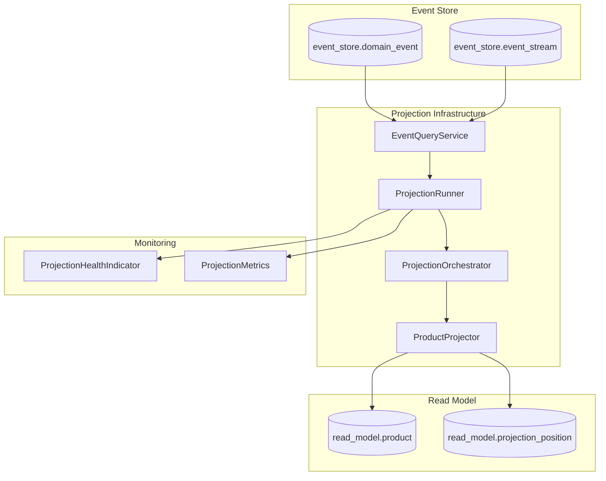
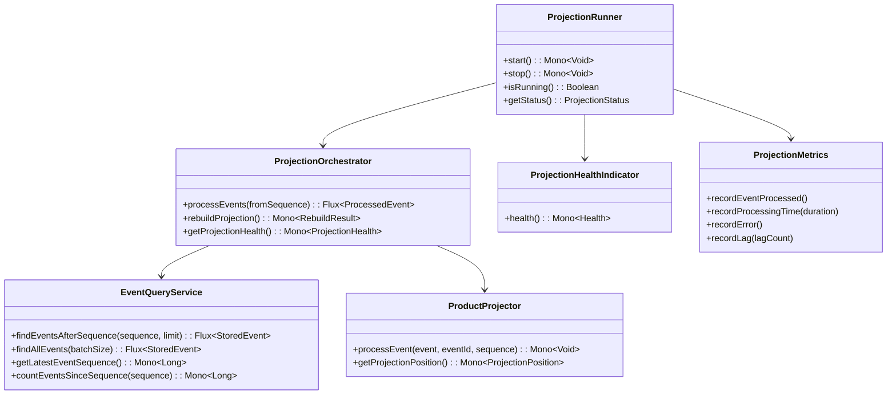
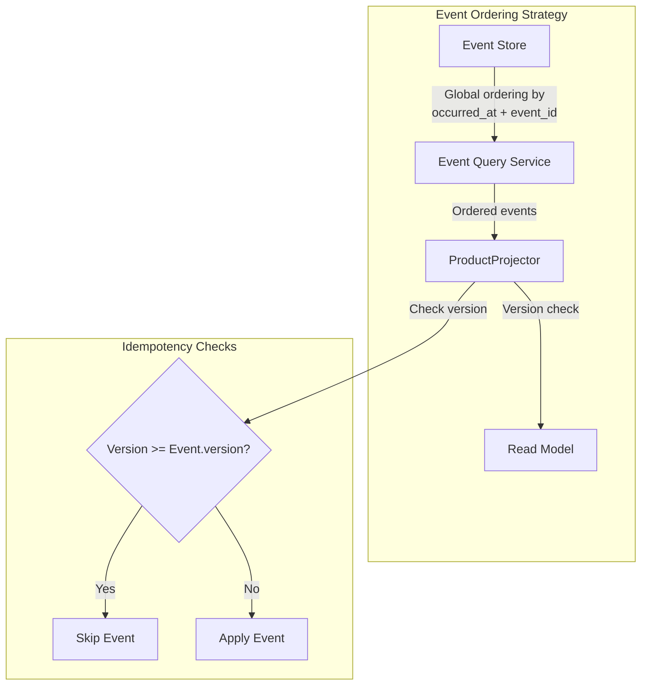
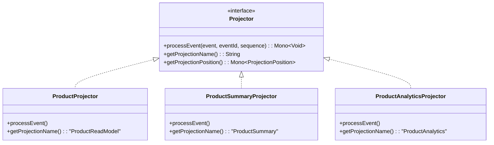
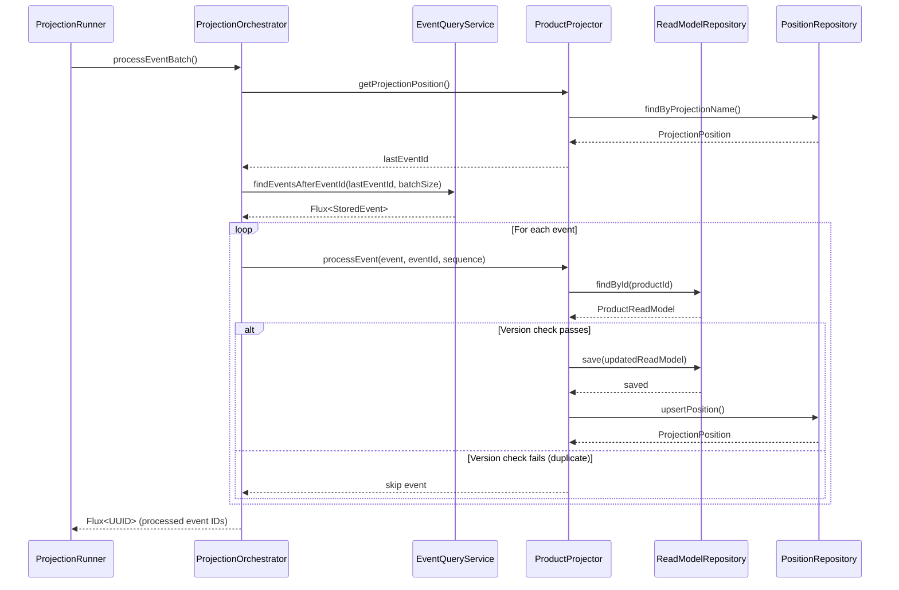

# Implementation Plan: AC5 - Event Projections

**Feature:** Product Catalog (CQRS Architecture)
**Acceptance Criteria:** AC5 - Event Projections
**Status:** Planning

---

## Overview

This implementation plan details the creation of the Event Projection infrastructure for the Product CQRS system. Event projections are responsible for transforming domain events from the event store into optimized read models, enabling eventual consistency between the command and query sides of the application.

The existing codebase already includes a `ProductProjector` component that handles individual event processing, and a `ProjectionPosition` table for tracking progress. This plan focuses on building the orchestration layer that continuously processes events and maintains projection health.

## Architecture



## Prerequisites

Before starting this implementation:

- [x] AC2 (Product Event Store) is complete - Events are persisted
- [x] AC4 (Product Read Model) is complete - Read model schema exists
- [x] `ProductProjector` exists with individual event handlers
- [x] `ProjectionPosition` tracking infrastructure exists
- [x] Domain events are defined and serializable

## Acceptance Criteria Reference

From the feature specification:

> - Event projectors listen to domain events and update read models
> - Projections track their position in the event stream
> - Projections can be rebuilt from scratch by replaying all events
> - Projection errors are logged and can trigger alerts
> - Multiple projections can be maintained for different query needs
> - Projections handle out-of-order events gracefully

---

## High-Level Component Design



---

## Implementation Steps

### Step 1: Create Event Query Service

**Objective:** Create a service to query events from the event store for projection processing.

#### 1.1 Create StoredEvent Data Class

**File:** `src/main/kotlin/com/pintailconsultingllc/cqrsspike/product/query/projection/StoredEvent.kt`

```kotlin
package com.pintailconsultingllc.cqrsspike.product.query.projection

import com.pintailconsultingllc.cqrsspike.product.event.ProductEvent
import java.time.OffsetDateTime
import java.util.UUID

/**
 * Represents an event as stored in the event store with its metadata.
 * Used by projection infrastructure to process events in order.
 */
data class StoredEvent(
    val eventId: UUID,
    val streamId: UUID,
    val eventType: String,
    val aggregateVersion: Long,
    val globalSequence: Long,
    val occurredAt: OffsetDateTime,
    val event: ProductEvent
)
```

#### 1.2 Extend DomainEventR2dbcRepository

**File:** `src/main/kotlin/com/pintailconsultingllc/cqrsspike/infrastructure/eventstore/DomainEventR2dbcRepository.kt`

Add the following queries to support projection processing:

```kotlin
/**
 * Find all events after a global sequence number (for incremental processing).
 * Events are ordered by their global occurrence for consistent projection.
 */
@Query("""
    SELECT * FROM event_store.domain_event
    WHERE event_id > :afterEventId
    ORDER BY occurred_at ASC, event_id ASC
    LIMIT :limit
""")
fun findEventsAfterEventId(
    afterEventId: UUID,
    limit: Int
): Flux<DomainEventEntity>

/**
 * Find all events ordered by occurrence (for full rebuild).
 */
@Query("""
    SELECT * FROM event_store.domain_event
    ORDER BY occurred_at ASC, event_id ASC
    LIMIT :limit OFFSET :offset
""")
fun findAllEventsOrdered(
    limit: Int,
    offset: Long
): Flux<DomainEventEntity>

/**
 * Get the most recent event (for determining current position).
 */
@Query("""
    SELECT * FROM event_store.domain_event
    ORDER BY occurred_at DESC, event_id DESC
    LIMIT 1
""")
fun findLatestEvent(): Mono<DomainEventEntity>

/**
 * Count events after a specific event ID (for lag calculation).
 */
@Query("""
    SELECT COUNT(*) FROM event_store.domain_event
    WHERE event_id > :afterEventId
""")
fun countEventsAfterEventId(afterEventId: UUID): Mono<Long>

/**
 * Count all events in the store.
 */
@Query("SELECT COUNT(*) FROM event_store.domain_event")
fun countAllEvents(): Mono<Long>
```

#### 1.3 Create EventQueryService

**File:** `src/main/kotlin/com/pintailconsultingllc/cqrsspike/product/query/projection/EventQueryService.kt`

```kotlin
package com.pintailconsultingllc.cqrsspike.product.query.projection

import com.pintailconsultingllc.cqrsspike.infrastructure.eventstore.DomainEventEntity
import com.pintailconsultingllc.cqrsspike.infrastructure.eventstore.DomainEventR2dbcRepository
import com.pintailconsultingllc.cqrsspike.infrastructure.eventstore.EventDeserializer
import org.slf4j.LoggerFactory
import org.springframework.stereotype.Service
import reactor.core.publisher.Flux
import reactor.core.publisher.Mono
import java.util.UUID

/**
 * Service for querying events from the event store for projection processing.
 *
 * Provides ordered event retrieval with support for incremental processing
 * and full replay scenarios.
 */
@Service
class EventQueryService(
    private val domainEventRepository: DomainEventR2dbcRepository,
    private val eventDeserializer: EventDeserializer
) {
    private val logger = LoggerFactory.getLogger(EventQueryService::class.java)

    companion object {
        const val DEFAULT_BATCH_SIZE = 100
    }

    /**
     * Find events after a specific event ID for incremental processing.
     *
     * @param afterEventId The event ID to start after (exclusive)
     * @param limit Maximum number of events to return
     * @return Flux of stored events in order
     */
    fun findEventsAfterEventId(
        afterEventId: UUID?,
        limit: Int = DEFAULT_BATCH_SIZE
    ): Flux<StoredEvent> {
        return if (afterEventId == null) {
            findAllEventsOrdered(limit, 0)
        } else {
            domainEventRepository.findEventsAfterEventId(afterEventId, limit)
                .map { entity -> toStoredEvent(entity) }
                .doOnSubscribe {
                    logger.debug("Querying events after eventId={}, limit={}", afterEventId, limit)
                }
        }
    }

    /**
     * Find all events ordered by occurrence (for full rebuild).
     *
     * @param limit Maximum events per batch
     * @param offset Starting offset
     * @return Flux of stored events
     */
    fun findAllEventsOrdered(
        limit: Int = DEFAULT_BATCH_SIZE,
        offset: Long = 0
    ): Flux<StoredEvent> {
        return domainEventRepository.findAllEventsOrdered(limit, offset)
            .map { entity -> toStoredEvent(entity) }
            .doOnSubscribe {
                logger.debug("Querying all events: limit={}, offset={}", limit, offset)
            }
    }

    /**
     * Get the latest event in the store.
     */
    fun getLatestEvent(): Mono<StoredEvent> {
        return domainEventRepository.findLatestEvent()
            .map { entity -> toStoredEvent(entity) }
    }

    /**
     * Count events after a specific event ID (for lag calculation).
     */
    fun countEventsAfterEventId(afterEventId: UUID?): Mono<Long> {
        return if (afterEventId == null) {
            domainEventRepository.countAllEvents()
        } else {
            domainEventRepository.countEventsAfterEventId(afterEventId)
        }
    }

    /**
     * Count total events in the event store.
     */
    fun countAllEvents(): Mono<Long> {
        return domainEventRepository.countAllEvents()
    }

    private fun toStoredEvent(entity: DomainEventEntity): StoredEvent {
        val event = eventDeserializer.deserialize(
            eventType = entity.eventType,
            eventVersion = entity.eventVersion,
            json = entity.eventData
        )

        return StoredEvent(
            eventId = entity.eventId,
            streamId = entity.streamId,
            eventType = entity.eventType,
            aggregateVersion = entity.aggregateVersion.toLong(),
            globalSequence = 0, // Will be set by caller if needed
            occurredAt = entity.occurredAt,
            event = event
        )
    }
}
```

#### 1.4 Verification

- [ ] Event query service compiles without errors
- [ ] Queries return events in correct order
- [ ] Incremental queries correctly filter by event ID
- [ ] Full rebuild queries support pagination

---

### Step 2: Create Projection Configuration

**Objective:** Create configuration classes for projection behavior.

#### 2.1 Create ProjectionConfig

**File:** `src/main/kotlin/com/pintailconsultingllc/cqrsspike/product/query/projection/ProjectionConfig.kt`

```kotlin
package com.pintailconsultingllc.cqrsspike.product.query.projection

import org.springframework.boot.context.properties.ConfigurationProperties
import org.springframework.context.annotation.Configuration
import java.time.Duration

/**
 * Configuration properties for event projections.
 */
@Configuration
@ConfigurationProperties(prefix = "projection")
class ProjectionConfig {
    /**
     * Number of events to process in each batch.
     */
    var batchSize: Int = 100

    /**
     * Delay between polling for new events when caught up.
     */
    var pollInterval: Duration = Duration.ofSeconds(1)

    /**
     * Maximum time to wait for events before considering the projection idle.
     */
    var idleTimeout: Duration = Duration.ofMinutes(5)

    /**
     * Whether to start projections automatically on application startup.
     */
    var autoStart: Boolean = true

    /**
     * Number of retry attempts for failed event processing.
     */
    var maxRetries: Int = 3

    /**
     * Initial delay between retry attempts.
     */
    var retryDelay: Duration = Duration.ofMillis(500)

    /**
     * Multiplier for exponential backoff between retries.
     */
    var retryBackoffMultiplier: Double = 2.0

    /**
     * Maximum delay between retry attempts.
     */
    var maxRetryDelay: Duration = Duration.ofSeconds(30)

    /**
     * Lag threshold (in events) that triggers a warning.
     */
    var lagWarningThreshold: Long = 100

    /**
     * Lag threshold (in events) that triggers an error/alert.
     */
    var lagErrorThreshold: Long = 1000
}
```

#### 2.2 Add Application Configuration

**File:** `src/main/resources/application.yml` (add to existing)

```yaml
projection:
  batch-size: 100
  poll-interval: 1s
  idle-timeout: 5m
  auto-start: true
  max-retries: 3
  retry-delay: 500ms
  retry-backoff-multiplier: 2.0
  max-retry-delay: 30s
  lag-warning-threshold: 100
  lag-error-threshold: 1000
```

#### 2.3 Verification

- [ ] Configuration properties load correctly
- [ ] Default values are sensible
- [ ] Configuration can be overridden via environment variables

---

### Step 3: Create Projection Orchestrator

**Objective:** Create the component that orchestrates event processing for projections.

#### 3.1 Create Projection Status Classes

**File:** `src/main/kotlin/com/pintailconsultingllc/cqrsspike/product/query/projection/ProjectionStatus.kt`

```kotlin
package com.pintailconsultingllc.cqrsspike.product.query.projection

import java.time.OffsetDateTime
import java.util.UUID

/**
 * Status of a projection.
 */
enum class ProjectionState {
    STOPPED,
    STARTING,
    RUNNING,
    CATCHING_UP,
    REBUILDING,
    PAUSED,
    ERROR
}

/**
 * Current status of a projection including health metrics.
 */
data class ProjectionStatus(
    val projectionName: String,
    val state: ProjectionState,
    val lastEventId: UUID?,
    val lastEventSequence: Long?,
    val eventsProcessed: Long,
    val eventLag: Long,
    val lastProcessedAt: OffsetDateTime?,
    val lastError: String?,
    val lastErrorAt: OffsetDateTime?
)

/**
 * Result of a projection rebuild operation.
 */
data class RebuildResult(
    val projectionName: String,
    val eventsProcessed: Long,
    val duration: java.time.Duration,
    val success: Boolean,
    val errorMessage: String? = null
)

/**
 * Health status of a projection.
 */
data class ProjectionHealth(
    val projectionName: String,
    val healthy: Boolean,
    val eventLag: Long,
    val lastProcessedAt: OffsetDateTime?,
    val message: String
)
```

#### 3.2 Create ProjectionOrchestrator

**File:** `src/main/kotlin/com/pintailconsultingllc/cqrsspike/product/query/projection/ProjectionOrchestrator.kt`

```kotlin
package com.pintailconsultingllc.cqrsspike.product.query.projection

import com.pintailconsultingllc.cqrsspike.product.query.repository.ProjectionPosition
import com.pintailconsultingllc.cqrsspike.product.query.repository.ProjectionPositionRepository
import org.slf4j.LoggerFactory
import org.springframework.stereotype.Component
import org.springframework.transaction.annotation.Transactional
import reactor.core.publisher.Flux
import reactor.core.publisher.Mono
import reactor.util.retry.Retry
import java.time.Duration
import java.time.OffsetDateTime
import java.util.UUID

/**
 * Orchestrates event projection processing.
 *
 * Coordinates between the event query service and individual projectors,
 * handling batch processing, error recovery, and position tracking.
 */
@Component
class ProjectionOrchestrator(
    private val eventQueryService: EventQueryService,
    private val productProjector: ProductProjector,
    private val positionRepository: ProjectionPositionRepository,
    private val config: ProjectionConfig
) {
    private val logger = LoggerFactory.getLogger(ProjectionOrchestrator::class.java)

    companion object {
        const val PROJECTION_NAME = "ProductReadModel"
    }

    /**
     * Process a batch of events starting from the last processed position.
     *
     * @return Flux of processed event IDs
     */
    fun processEventBatch(): Flux<UUID> {
        return getLastProcessedEventId()
            .flatMapMany { lastEventId ->
                eventQueryService.findEventsAfterEventId(lastEventId, config.batchSize)
            }
            .flatMap { storedEvent ->
                processEventWithRetry(storedEvent)
            }
            .doOnComplete {
                logger.debug("Completed processing event batch")
            }
    }

    /**
     * Process events until caught up with the event store.
     *
     * @return Mono<Long> with total events processed
     */
    fun processToCurrent(): Mono<Long> {
        return processEventBatch()
            .count()
            .flatMap { count ->
                if (count >= config.batchSize) {
                    // More events may be available, continue processing
                    processToCurrent().map { it + count }
                } else {
                    Mono.just(count)
                }
            }
    }

    /**
     * Rebuild the projection from scratch by replaying all events.
     *
     * WARNING: This will delete existing read model data and replay all events.
     *
     * @return Mono<RebuildResult> with the result of the rebuild
     */
    @Transactional
    fun rebuildProjection(): Mono<RebuildResult> {
        val startTime = System.currentTimeMillis()

        return resetProjectionPosition()
            .then(processAllEvents())
            .map { eventsProcessed ->
                val duration = Duration.ofMillis(System.currentTimeMillis() - startTime)
                RebuildResult(
                    projectionName = PROJECTION_NAME,
                    eventsProcessed = eventsProcessed,
                    duration = duration,
                    success = true
                )
            }
            .doOnSuccess { result ->
                logger.info(
                    "Projection rebuild completed: events={}, duration={}",
                    result.eventsProcessed, result.duration
                )
            }
            .onErrorResume { error ->
                val duration = Duration.ofMillis(System.currentTimeMillis() - startTime)
                logger.error("Projection rebuild failed", error)
                Mono.just(RebuildResult(
                    projectionName = PROJECTION_NAME,
                    eventsProcessed = 0,
                    duration = duration,
                    success = false,
                    errorMessage = error.message
                ))
            }
    }

    /**
     * Get the current health status of the projection.
     */
    fun getProjectionHealth(): Mono<ProjectionHealth> {
        return Mono.zip(
            productProjector.getProjectionPosition(),
            eventQueryService.getLatestEvent().map { it.eventId }.defaultIfEmpty(UUID(0, 0))
        ).flatMap { tuple ->
            val position = tuple.t1
            val latestEventId = tuple.t2

            calculateLag(position.lastEventId).map { lag ->
                val healthy = lag < config.lagErrorThreshold
                val message = when {
                    lag == 0L -> "Projection is current"
                    lag < config.lagWarningThreshold -> "Projection is slightly behind ($lag events)"
                    lag < config.lagErrorThreshold -> "Projection is behind ($lag events) - WARNING"
                    else -> "Projection is significantly behind ($lag events) - ERROR"
                }

                ProjectionHealth(
                    projectionName = PROJECTION_NAME,
                    healthy = healthy,
                    eventLag = lag,
                    lastProcessedAt = position.lastProcessedAt,
                    message = message
                )
            }
        }
    }

    /**
     * Get the current projection status.
     */
    fun getProjectionStatus(state: ProjectionState): Mono<ProjectionStatus> {
        return Mono.zip(
            productProjector.getProjectionPosition(),
            calculateLag(null)
        ).map { tuple ->
            val position = tuple.t1
            val lag = tuple.t2

            ProjectionStatus(
                projectionName = PROJECTION_NAME,
                state = state,
                lastEventId = position.lastEventId,
                lastEventSequence = position.lastEventSequence,
                eventsProcessed = position.eventsProcessed,
                eventLag = lag,
                lastProcessedAt = position.lastProcessedAt,
                lastError = null,
                lastErrorAt = null
            )
        }
    }

    // Private helper methods

    private fun getLastProcessedEventId(): Mono<UUID?> {
        return productProjector.getProjectionPosition()
            .map { it.lastEventId }
    }

    private fun processEventWithRetry(storedEvent: StoredEvent): Mono<UUID> {
        return productProjector.processEvent(
            event = storedEvent.event,
            eventId = storedEvent.eventId,
            eventSequence = storedEvent.aggregateVersion
        )
        .retryWhen(Retry.backoff(config.maxRetries.toLong(), config.retryDelay)
            .maxBackoff(config.maxRetryDelay)
            .doBeforeRetry { signal ->
                logger.warn(
                    "Retrying event processing: eventId={}, attempt={}, error={}",
                    storedEvent.eventId, signal.totalRetries() + 1, signal.failure().message
                )
            }
        )
        .thenReturn(storedEvent.eventId)
        .doOnSuccess {
            logger.debug("Processed event: eventId={}, type={}", storedEvent.eventId, storedEvent.eventType)
        }
        .doOnError { error ->
            logger.error(
                "Failed to process event after retries: eventId={}, type={}",
                storedEvent.eventId, storedEvent.eventType, error
            )
        }
    }

    private fun processAllEvents(): Mono<Long> {
        return processAllEventsBatched(0, 0)
    }

    private fun processAllEventsBatched(offset: Long, totalProcessed: Long): Mono<Long> {
        return eventQueryService.findAllEventsOrdered(config.batchSize, offset)
            .flatMap { storedEvent ->
                processEventWithRetry(storedEvent)
            }
            .count()
            .flatMap { count ->
                val newTotal = totalProcessed + count
                if (count >= config.batchSize) {
                    // More events available
                    processAllEventsBatched(offset + count, newTotal)
                } else {
                    Mono.just(newTotal)
                }
            }
    }

    private fun resetProjectionPosition(): Mono<Void> {
        return positionRepository.deleteById(PROJECTION_NAME)
            .doOnSuccess {
                logger.info("Reset projection position for: {}", PROJECTION_NAME)
            }
    }

    private fun calculateLag(lastEventId: UUID?): Mono<Long> {
        return eventQueryService.countEventsAfterEventId(lastEventId)
    }
}
```

#### 3.3 Verification

- [ ] Orchestrator compiles without errors
- [ ] Batch processing respects configuration
- [ ] Retry logic works correctly
- [ ] Rebuild operation processes all events

---

### Step 4: Create Projection Runner

**Objective:** Create the component that runs projections continuously.

#### 4.1 Create ProjectionRunner

**File:** `src/main/kotlin/com/pintailconsultingllc/cqrsspike/product/query/projection/ProjectionRunner.kt`

```kotlin
package com.pintailconsultingllc.cqrsspike.product.query.projection

import jakarta.annotation.PostConstruct
import jakarta.annotation.PreDestroy
import org.slf4j.LoggerFactory
import org.springframework.stereotype.Component
import reactor.core.Disposable
import reactor.core.publisher.Flux
import reactor.core.publisher.Mono
import reactor.core.scheduler.Schedulers
import java.time.Duration
import java.time.OffsetDateTime
import java.util.concurrent.atomic.AtomicBoolean
import java.util.concurrent.atomic.AtomicReference

/**
 * Runs event projections continuously.
 *
 * Polls for new events at configured intervals and processes them
 * to keep read models up to date.
 */
@Component
class ProjectionRunner(
    private val orchestrator: ProjectionOrchestrator,
    private val config: ProjectionConfig,
    private val metrics: ProjectionMetrics
) {
    private val logger = LoggerFactory.getLogger(ProjectionRunner::class.java)

    private val running = AtomicBoolean(false)
    private val state = AtomicReference(ProjectionState.STOPPED)
    private val lastError = AtomicReference<Throwable?>(null)
    private val lastErrorAt = AtomicReference<OffsetDateTime?>(null)
    private var subscription: Disposable? = null

    /**
     * Start the projection runner.
     */
    fun start(): Mono<Void> {
        if (!running.compareAndSet(false, true)) {
            logger.warn("Projection runner is already running")
            return Mono.empty()
        }

        logger.info("Starting projection runner")
        state.set(ProjectionState.STARTING)

        return orchestrator.processToCurrent()
            .doOnSuccess { count ->
                logger.info("Initial catch-up processed {} events", count)
                state.set(ProjectionState.RUNNING)
                startPolling()
            }
            .doOnError { error ->
                logger.error("Failed to start projection runner", error)
                state.set(ProjectionState.ERROR)
                lastError.set(error)
                lastErrorAt.set(OffsetDateTime.now())
                running.set(false)
            }
            .then()
    }

    /**
     * Stop the projection runner.
     */
    fun stop(): Mono<Void> {
        if (!running.compareAndSet(true, false)) {
            logger.warn("Projection runner is not running")
            return Mono.empty()
        }

        logger.info("Stopping projection runner")
        subscription?.dispose()
        subscription = null
        state.set(ProjectionState.STOPPED)

        return Mono.empty()
    }

    /**
     * Check if the runner is currently running.
     */
    fun isRunning(): Boolean = running.get()

    /**
     * Get the current state of the runner.
     */
    fun getState(): ProjectionState = state.get()

    /**
     * Get the current status of the projection.
     */
    fun getStatus(): Mono<ProjectionStatus> {
        return orchestrator.getProjectionStatus(state.get())
            .map { status ->
                status.copy(
                    lastError = lastError.get()?.message,
                    lastErrorAt = lastErrorAt.get()
                )
            }
    }

    /**
     * Trigger a rebuild of the projection.
     */
    fun rebuild(): Mono<RebuildResult> {
        val wasRunning = running.get()

        return stop()
            .then(Mono.defer {
                state.set(ProjectionState.REBUILDING)
                orchestrator.rebuildProjection()
            })
            .flatMap { result ->
                if (wasRunning && result.success) {
                    start().thenReturn(result)
                } else {
                    Mono.just(result)
                }
            }
    }

    @PostConstruct
    fun init() {
        if (config.autoStart) {
            start()
                .subscribeOn(Schedulers.boundedElastic())
                .subscribe(
                    { },
                    { error -> logger.error("Failed to auto-start projection runner", error) }
                )
        }
    }

    @PreDestroy
    fun destroy() {
        stop().block()
    }

    // Private helper methods

    private fun startPolling() {
        subscription = Flux.interval(config.pollInterval)
            .flatMap { _ -> pollAndProcess() }
            .subscribeOn(Schedulers.boundedElastic())
            .subscribe(
                { count ->
                    if (count > 0) {
                        logger.debug("Processed {} events in poll cycle", count)
                    }
                },
                { error ->
                    logger.error("Error in projection polling", error)
                    handlePollingError(error)
                }
            )
    }

    private fun pollAndProcess(): Mono<Long> {
        if (!running.get()) {
            return Mono.just(0L)
        }

        val startTime = System.currentTimeMillis()

        return orchestrator.processEventBatch()
            .doOnNext { _ ->
                metrics.recordEventProcessed()
            }
            .count()
            .doOnSuccess { count ->
                val duration = System.currentTimeMillis() - startTime
                if (count > 0) {
                    metrics.recordProcessingTime(Duration.ofMillis(duration))
                }
                updateLagMetrics()
            }
            .onErrorResume { error ->
                metrics.recordError()
                lastError.set(error)
                lastErrorAt.set(OffsetDateTime.now())
                logger.error("Error processing event batch", error)
                Mono.just(0L)
            }
    }

    private fun handlePollingError(error: Throwable) {
        state.set(ProjectionState.ERROR)
        lastError.set(error)
        lastErrorAt.set(OffsetDateTime.now())
        metrics.recordError()

        // Continue polling after error
        if (running.get()) {
            logger.info("Resuming polling after error")
        }
    }

    private fun updateLagMetrics() {
        orchestrator.getProjectionHealth()
            .subscribe { health ->
                metrics.recordLag(health.eventLag)
            }
    }
}
```

#### 4.2 Verification

- [ ] Runner starts and stops correctly
- [ ] Polling respects configured interval
- [ ] Auto-start works on application startup
- [ ] Error handling doesn't crash the runner

---

### Step 5: Create Projection Metrics

**Objective:** Create metrics for monitoring projection health.

#### 5.1 Create ProjectionMetrics

**File:** `src/main/kotlin/com/pintailconsultingllc/cqrsspike/product/query/projection/ProjectionMetrics.kt`

```kotlin
package com.pintailconsultingllc.cqrsspike.product.query.projection

import io.micrometer.core.instrument.Counter
import io.micrometer.core.instrument.Gauge
import io.micrometer.core.instrument.MeterRegistry
import io.micrometer.core.instrument.Timer
import org.springframework.stereotype.Component
import java.time.Duration
import java.util.concurrent.atomic.AtomicLong

/**
 * Metrics for monitoring projection health and performance.
 */
@Component
class ProjectionMetrics(meterRegistry: MeterRegistry) {

    private val eventsProcessedCounter: Counter
    private val processingTimer: Timer
    private val errorCounter: Counter
    private val currentLag: AtomicLong = AtomicLong(0)

    init {
        eventsProcessedCounter = Counter.builder("projection.events.processed")
            .description("Total number of events processed by projections")
            .tag("projection", "ProductReadModel")
            .register(meterRegistry)

        processingTimer = Timer.builder("projection.processing.time")
            .description("Time taken to process event batches")
            .tag("projection", "ProductReadModel")
            .register(meterRegistry)

        errorCounter = Counter.builder("projection.errors")
            .description("Number of projection processing errors")
            .tag("projection", "ProductReadModel")
            .register(meterRegistry)

        Gauge.builder("projection.lag", currentLag) { it.get().toDouble() }
            .description("Number of events behind the event store")
            .tag("projection", "ProductReadModel")
            .register(meterRegistry)
    }

    /**
     * Record that an event was successfully processed.
     */
    fun recordEventProcessed() {
        eventsProcessedCounter.increment()
    }

    /**
     * Record the time taken to process a batch of events.
     */
    fun recordProcessingTime(duration: Duration) {
        processingTimer.record(duration)
    }

    /**
     * Record a processing error.
     */
    fun recordError() {
        errorCounter.increment()
    }

    /**
     * Update the current lag value.
     */
    fun recordLag(lag: Long) {
        currentLag.set(lag)
    }
}
```

#### 5.2 Verification

- [ ] Metrics are registered with Micrometer
- [ ] Counters increment correctly
- [ ] Gauge reflects current lag
- [ ] Timer records batch processing duration

---

### Step 6: Create Projection Health Indicator

**Objective:** Create a Spring Boot health indicator for projection status.

#### 6.1 Create ProjectionHealthIndicator

**File:** `src/main/kotlin/com/pintailconsultingllc/cqrsspike/product/query/projection/ProjectionHealthIndicator.kt`

```kotlin
package com.pintailconsultingllc.cqrsspike.product.query.projection

import org.springframework.boot.actuate.health.Health
import org.springframework.boot.actuate.health.ReactiveHealthIndicator
import org.springframework.stereotype.Component
import reactor.core.publisher.Mono

/**
 * Health indicator for the projection infrastructure.
 *
 * Reports projection status to Spring Boot Actuator health endpoint.
 */
@Component("projectionHealth")
class ProjectionHealthIndicator(
    private val runner: ProjectionRunner,
    private val orchestrator: ProjectionOrchestrator,
    private val config: ProjectionConfig
) : ReactiveHealthIndicator {

    override fun health(): Mono<Health> {
        return orchestrator.getProjectionHealth()
            .map { health ->
                val builder = if (health.healthy) {
                    Health.up()
                } else {
                    Health.down()
                }

                builder
                    .withDetail("projectionName", health.projectionName)
                    .withDetail("state", runner.getState().name)
                    .withDetail("running", runner.isRunning())
                    .withDetail("eventLag", health.eventLag)
                    .withDetail("lagWarningThreshold", config.lagWarningThreshold)
                    .withDetail("lagErrorThreshold", config.lagErrorThreshold)
                    .withDetail("lastProcessedAt", health.lastProcessedAt?.toString() ?: "never")
                    .withDetail("message", health.message)
                    .build()
            }
            .onErrorResume { error ->
                Mono.just(
                    Health.down()
                        .withDetail("error", error.message)
                        .build()
                )
            }
    }
}
```

#### 6.2 Verification

- [ ] Health indicator appears in actuator endpoint
- [ ] Status reflects actual projection state
- [ ] Lag thresholds affect health status
- [ ] Error conditions reported correctly

---

### Step 7: Create Database Migration for Global Sequence

**Objective:** Add support for global event ordering in the event store.

#### 7.1 Create Migration

**File:** `src/main/resources/db/migration/V7__add_global_event_sequence.sql`

```sql
-- Add global sequence for event ordering across all streams
-- This enables projections to process events in a consistent global order

-- Add sequence column to domain_event table
ALTER TABLE event_store.domain_event
ADD COLUMN IF NOT EXISTS global_sequence BIGSERIAL;

-- Create index for efficient projection queries
CREATE INDEX IF NOT EXISTS idx_domain_event_global_sequence
    ON event_store.domain_event(global_sequence ASC);

-- Create index for event ID ordering (used by projections)
CREATE INDEX IF NOT EXISTS idx_domain_event_occurred_event_id
    ON event_store.domain_event(occurred_at ASC, event_id ASC);

-- Add comment
COMMENT ON COLUMN event_store.domain_event.global_sequence IS
    'Global sequence number for ordering events across all aggregate streams. Used by projections.';

-- Update append_events function to set global_sequence automatically
-- The BIGSERIAL column auto-increments, so no changes needed to the function
```

#### 7.2 Verification

- [ ] Migration applies successfully
- [ ] Existing events get sequence numbers
- [ ] New events get sequential numbers
- [ ] Index improves query performance

---

### Step 8: Create Projection Management API

**Objective:** Create REST endpoints for managing projections.

#### 8.1 Create ProjectionController

**File:** `src/main/kotlin/com/pintailconsultingllc/cqrsspike/product/api/ProjectionController.kt`

```kotlin
package com.pintailconsultingllc.cqrsspike.product.api

import com.pintailconsultingllc.cqrsspike.product.query.projection.ProjectionRunner
import com.pintailconsultingllc.cqrsspike.product.query.projection.ProjectionStatus
import com.pintailconsultingllc.cqrsspike.product.query.projection.RebuildResult
import org.springframework.http.ResponseEntity
import org.springframework.web.bind.annotation.GetMapping
import org.springframework.web.bind.annotation.PostMapping
import org.springframework.web.bind.annotation.RequestMapping
import org.springframework.web.bind.annotation.RestController
import reactor.core.publisher.Mono

/**
 * REST API for managing projections.
 */
@RestController
@RequestMapping("/api/admin/projections")
class ProjectionController(
    private val runner: ProjectionRunner
) {

    /**
     * Get the current status of the product projection.
     */
    @GetMapping("/product/status")
    fun getStatus(): Mono<ResponseEntity<ProjectionStatus>> {
        return runner.getStatus()
            .map { ResponseEntity.ok(it) }
    }

    /**
     * Start the projection runner.
     */
    @PostMapping("/product/start")
    fun start(): Mono<ResponseEntity<Map<String, String>>> {
        return runner.start()
            .thenReturn(ResponseEntity.ok(mapOf("status" to "started")))
            .onErrorResume { error ->
                Mono.just(ResponseEntity.internalServerError()
                    .body(mapOf("status" to "error", "message" to (error.message ?: "Unknown error"))))
            }
    }

    /**
     * Stop the projection runner.
     */
    @PostMapping("/product/stop")
    fun stop(): Mono<ResponseEntity<Map<String, String>>> {
        return runner.stop()
            .thenReturn(ResponseEntity.ok(mapOf("status" to "stopped")))
    }

    /**
     * Rebuild the projection from scratch.
     * WARNING: This will replay all events.
     */
    @PostMapping("/product/rebuild")
    fun rebuild(): Mono<ResponseEntity<RebuildResult>> {
        return runner.rebuild()
            .map { result ->
                if (result.success) {
                    ResponseEntity.ok(result)
                } else {
                    ResponseEntity.internalServerError().body(result)
                }
            }
    }
}
```

#### 8.2 Verification

- [ ] Endpoints are accessible
- [ ] Status endpoint returns correct information
- [ ] Start/stop commands work correctly
- [ ] Rebuild operation completes successfully

---

### Step 9: Create Unit Tests

**Objective:** Create comprehensive unit tests for projection components.

#### 9.1 Create EventQueryService Tests

**File:** `src/test/kotlin/com/pintailconsultingllc/cqrsspike/product/query/projection/EventQueryServiceTest.kt`

```kotlin
package com.pintailconsultingllc.cqrsspike.product.query.projection

import com.pintailconsultingllc.cqrsspike.infrastructure.eventstore.DomainEventEntity
import com.pintailconsultingllc.cqrsspike.infrastructure.eventstore.DomainEventR2dbcRepository
import com.pintailconsultingllc.cqrsspike.infrastructure.eventstore.EventDeserializer
import com.pintailconsultingllc.cqrsspike.product.event.ProductCreated
import com.pintailconsultingllc.cqrsspike.product.command.aggregate.ProductStatus
import org.junit.jupiter.api.BeforeEach
import org.junit.jupiter.api.DisplayName
import org.junit.jupiter.api.Nested
import org.junit.jupiter.api.Test
import org.junit.jupiter.api.extension.ExtendWith
import org.mockito.Mock
import org.mockito.junit.jupiter.MockitoExtension
import org.mockito.kotlin.any
import org.mockito.kotlin.whenever
import reactor.core.publisher.Flux
import reactor.core.publisher.Mono
import reactor.test.StepVerifier
import java.time.OffsetDateTime
import java.util.UUID

@ExtendWith(MockitoExtension::class)
@DisplayName("EventQueryService")
class EventQueryServiceTest {

    @Mock
    private lateinit var domainEventRepository: DomainEventR2dbcRepository

    @Mock
    private lateinit var eventDeserializer: EventDeserializer

    private lateinit var eventQueryService: EventQueryService

    @BeforeEach
    fun setUp() {
        eventQueryService = EventQueryService(domainEventRepository, eventDeserializer)
    }

    @Nested
    @DisplayName("findEventsAfterEventId")
    inner class FindEventsAfterEventId {

        @Test
        @DisplayName("should return events after the specified event ID")
        fun shouldReturnEventsAfterEventId() {
            val afterEventId = UUID.randomUUID()
            val eventEntity = createEventEntity()
            val productEvent = createProductCreatedEvent()

            whenever(domainEventRepository.findEventsAfterEventId(afterEventId, 100))
                .thenReturn(Flux.just(eventEntity))
            whenever(eventDeserializer.deserialize(any(), any(), any()))
                .thenReturn(productEvent)

            StepVerifier.create(eventQueryService.findEventsAfterEventId(afterEventId, 100))
                .expectNextMatches { storedEvent ->
                    storedEvent.eventId == eventEntity.eventId &&
                    storedEvent.event == productEvent
                }
                .verifyComplete()
        }

        @Test
        @DisplayName("should query all events when afterEventId is null")
        fun shouldQueryAllEventsWhenAfterEventIdIsNull() {
            val eventEntity = createEventEntity()
            val productEvent = createProductCreatedEvent()

            whenever(domainEventRepository.findAllEventsOrdered(100, 0))
                .thenReturn(Flux.just(eventEntity))
            whenever(eventDeserializer.deserialize(any(), any(), any()))
                .thenReturn(productEvent)

            StepVerifier.create(eventQueryService.findEventsAfterEventId(null, 100))
                .expectNextCount(1)
                .verifyComplete()
        }
    }

    @Nested
    @DisplayName("countEventsAfterEventId")
    inner class CountEventsAfterEventId {

        @Test
        @DisplayName("should return count of events after event ID")
        fun shouldReturnCountOfEventsAfterEventId() {
            val eventId = UUID.randomUUID()

            whenever(domainEventRepository.countEventsAfterEventId(eventId))
                .thenReturn(Mono.just(42L))

            StepVerifier.create(eventQueryService.countEventsAfterEventId(eventId))
                .expectNext(42L)
                .verifyComplete()
        }

        @Test
        @DisplayName("should return total count when event ID is null")
        fun shouldReturnTotalCountWhenEventIdIsNull() {
            whenever(domainEventRepository.countAllEvents())
                .thenReturn(Mono.just(100L))

            StepVerifier.create(eventQueryService.countEventsAfterEventId(null))
                .expectNext(100L)
                .verifyComplete()
        }
    }

    // Helper methods

    private fun createEventEntity(): DomainEventEntity {
        return DomainEventEntity(
            eventId = UUID.randomUUID(),
            streamId = UUID.randomUUID(),
            eventType = "ProductCreated",
            eventVersion = 1,
            aggregateVersion = 1,
            eventData = "{}",
            metadata = null,
            occurredAt = OffsetDateTime.now(),
            causationId = null,
            correlationId = null,
            userId = null
        )
    }

    private fun createProductCreatedEvent(): ProductCreated {
        return ProductCreated(
            eventId = UUID.randomUUID(),
            productId = UUID.randomUUID(),
            sku = "TEST-001",
            name = "Test Product",
            description = null,
            priceCents = 1999,
            status = ProductStatus.DRAFT,
            occurredAt = OffsetDateTime.now(),
            version = 1
        )
    }
}
```

#### 9.2 Create ProjectionOrchestrator Tests

**File:** `src/test/kotlin/com/pintailconsultingllc/cqrsspike/product/query/projection/ProjectionOrchestratorTest.kt`

```kotlin
package com.pintailconsultingllc.cqrsspike.product.query.projection

import com.pintailconsultingllc.cqrsspike.product.event.ProductCreated
import com.pintailconsultingllc.cqrsspike.product.command.aggregate.ProductStatus
import com.pintailconsultingllc.cqrsspike.product.query.repository.ProjectionPosition
import com.pintailconsultingllc.cqrsspike.product.query.repository.ProjectionPositionRepository
import org.junit.jupiter.api.BeforeEach
import org.junit.jupiter.api.DisplayName
import org.junit.jupiter.api.Nested
import org.junit.jupiter.api.Test
import org.junit.jupiter.api.extension.ExtendWith
import org.mockito.Mock
import org.mockito.junit.jupiter.MockitoExtension
import org.mockito.kotlin.any
import org.mockito.kotlin.whenever
import reactor.core.publisher.Flux
import reactor.core.publisher.Mono
import reactor.test.StepVerifier
import java.time.OffsetDateTime
import java.util.UUID

@ExtendWith(MockitoExtension::class)
@DisplayName("ProjectionOrchestrator")
class ProjectionOrchestratorTest {

    @Mock
    private lateinit var eventQueryService: EventQueryService

    @Mock
    private lateinit var productProjector: ProductProjector

    @Mock
    private lateinit var positionRepository: ProjectionPositionRepository

    private lateinit var config: ProjectionConfig
    private lateinit var orchestrator: ProjectionOrchestrator

    @BeforeEach
    fun setUp() {
        config = ProjectionConfig().apply {
            batchSize = 10
            maxRetries = 2
        }
        orchestrator = ProjectionOrchestrator(
            eventQueryService,
            productProjector,
            positionRepository,
            config
        )
    }

    @Nested
    @DisplayName("processEventBatch")
    inner class ProcessEventBatch {

        @Test
        @DisplayName("should process events starting from last position")
        fun shouldProcessEventsFromLastPosition() {
            val lastEventId = UUID.randomUUID()
            val position = ProjectionPosition(
                projectionName = "ProductReadModel",
                lastEventId = lastEventId,
                lastEventSequence = 5L,
                eventsProcessed = 5
            )
            val storedEvent = createStoredEvent()

            whenever(productProjector.getProjectionPosition())
                .thenReturn(Mono.just(position))
            whenever(eventQueryService.findEventsAfterEventId(lastEventId, 10))
                .thenReturn(Flux.just(storedEvent))
            whenever(productProjector.processEvent(any(), any(), any()))
                .thenReturn(Mono.empty())

            StepVerifier.create(orchestrator.processEventBatch())
                .expectNext(storedEvent.eventId)
                .verifyComplete()
        }

        @Test
        @DisplayName("should return empty flux when no events available")
        fun shouldReturnEmptyFluxWhenNoEvents() {
            val position = ProjectionPosition(
                projectionName = "ProductReadModel",
                lastEventId = UUID.randomUUID(),
                lastEventSequence = 10L,
                eventsProcessed = 10
            )

            whenever(productProjector.getProjectionPosition())
                .thenReturn(Mono.just(position))
            whenever(eventQueryService.findEventsAfterEventId(any(), any()))
                .thenReturn(Flux.empty())

            StepVerifier.create(orchestrator.processEventBatch())
                .verifyComplete()
        }
    }

    @Nested
    @DisplayName("getProjectionHealth")
    inner class GetProjectionHealth {

        @Test
        @DisplayName("should report healthy when lag is below threshold")
        fun shouldReportHealthyWhenLagBelowThreshold() {
            val position = ProjectionPosition(
                projectionName = "ProductReadModel",
                lastEventId = UUID.randomUUID(),
                lastEventSequence = 100L,
                eventsProcessed = 100
            )
            val latestEvent = createStoredEvent()

            whenever(productProjector.getProjectionPosition())
                .thenReturn(Mono.just(position))
            whenever(eventQueryService.getLatestEvent())
                .thenReturn(Mono.just(latestEvent))
            whenever(eventQueryService.countEventsAfterEventId(any()))
                .thenReturn(Mono.just(5L))

            StepVerifier.create(orchestrator.getProjectionHealth())
                .expectNextMatches { health ->
                    health.healthy && health.eventLag == 5L
                }
                .verifyComplete()
        }
    }

    // Helper methods

    private fun createStoredEvent(): StoredEvent {
        return StoredEvent(
            eventId = UUID.randomUUID(),
            streamId = UUID.randomUUID(),
            eventType = "ProductCreated",
            aggregateVersion = 1,
            globalSequence = 1,
            occurredAt = OffsetDateTime.now(),
            event = ProductCreated(
                eventId = UUID.randomUUID(),
                productId = UUID.randomUUID(),
                sku = "TEST-001",
                name = "Test Product",
                description = null,
                priceCents = 1999,
                status = ProductStatus.DRAFT,
                occurredAt = OffsetDateTime.now(),
                version = 1
            )
        )
    }
}
```

#### 9.3 Create ProjectionRunner Tests

**File:** `src/test/kotlin/com/pintailconsultingllc/cqrsspike/product/query/projection/ProjectionRunnerTest.kt`

```kotlin
package com.pintailconsultingllc.cqrsspike.product.query.projection

import org.junit.jupiter.api.BeforeEach
import org.junit.jupiter.api.DisplayName
import org.junit.jupiter.api.Nested
import org.junit.jupiter.api.Test
import org.junit.jupiter.api.extension.ExtendWith
import org.mockito.Mock
import org.mockito.junit.jupiter.MockitoExtension
import org.mockito.kotlin.whenever
import reactor.core.publisher.Mono
import reactor.test.StepVerifier
import java.time.Duration

@ExtendWith(MockitoExtension::class)
@DisplayName("ProjectionRunner")
class ProjectionRunnerTest {

    @Mock
    private lateinit var orchestrator: ProjectionOrchestrator

    @Mock
    private lateinit var metrics: ProjectionMetrics

    private lateinit var config: ProjectionConfig
    private lateinit var runner: ProjectionRunner

    @BeforeEach
    fun setUp() {
        config = ProjectionConfig().apply {
            autoStart = false
            pollInterval = Duration.ofMillis(100)
        }
        runner = ProjectionRunner(orchestrator, config, metrics)
    }

    @Nested
    @DisplayName("start")
    inner class Start {

        @Test
        @DisplayName("should start runner and process initial events")
        fun shouldStartRunnerAndProcessInitialEvents() {
            whenever(orchestrator.processToCurrent())
                .thenReturn(Mono.just(10L))

            StepVerifier.create(runner.start())
                .verifyComplete()

            assert(runner.isRunning())
            assert(runner.getState() == ProjectionState.RUNNING)
        }

        @Test
        @DisplayName("should not start if already running")
        fun shouldNotStartIfAlreadyRunning() {
            whenever(orchestrator.processToCurrent())
                .thenReturn(Mono.just(0L))

            runner.start().block()

            StepVerifier.create(runner.start())
                .verifyComplete()

            // Should still be running
            assert(runner.isRunning())
        }
    }

    @Nested
    @DisplayName("stop")
    inner class Stop {

        @Test
        @DisplayName("should stop running runner")
        fun shouldStopRunningRunner() {
            whenever(orchestrator.processToCurrent())
                .thenReturn(Mono.just(0L))

            runner.start().block()

            StepVerifier.create(runner.stop())
                .verifyComplete()

            assert(!runner.isRunning())
            assert(runner.getState() == ProjectionState.STOPPED)
        }

        @Test
        @DisplayName("should handle stop when not running")
        fun shouldHandleStopWhenNotRunning() {
            StepVerifier.create(runner.stop())
                .verifyComplete()

            assert(!runner.isRunning())
        }
    }

    @Nested
    @DisplayName("rebuild")
    inner class Rebuild {

        @Test
        @DisplayName("should rebuild projection successfully")
        fun shouldRebuildProjectionSuccessfully() {
            val result = RebuildResult(
                projectionName = "ProductReadModel",
                eventsProcessed = 100,
                duration = Duration.ofSeconds(5),
                success = true
            )

            whenever(orchestrator.rebuildProjection())
                .thenReturn(Mono.just(result))

            StepVerifier.create(runner.rebuild())
                .expectNextMatches { it.success && it.eventsProcessed == 100L }
                .verifyComplete()
        }
    }
}
```

#### 9.4 Verification

- [ ] All unit tests pass
- [ ] Test coverage meets 80% threshold
- [ ] Edge cases are tested
- [ ] Error scenarios are tested

---

### Step 10: Create Integration Tests

**Objective:** Create integration tests that verify the complete projection flow.

#### 10.1 Create Projection Integration Tests

**File:** `src/test/kotlin/com/pintailconsultingllc/cqrsspike/product/query/projection/ProjectionIntegrationTest.kt`

```kotlin
package com.pintailconsultingllc.cqrsspike.product.query.projection

import com.pintailconsultingllc.cqrsspike.product.command.handler.ProductCommandHandler
import com.pintailconsultingllc.cqrsspike.product.command.model.CommandSuccess
import com.pintailconsultingllc.cqrsspike.product.command.model.CreateProductCommand
import com.pintailconsultingllc.cqrsspike.product.query.repository.ProductReadModelRepository
import org.junit.jupiter.api.BeforeEach
import org.junit.jupiter.api.DisplayName
import org.junit.jupiter.api.Test
import org.springframework.beans.factory.annotation.Autowired
import org.springframework.boot.test.context.SpringBootTest
import org.springframework.test.context.DynamicPropertyRegistry
import org.springframework.test.context.DynamicPropertySource
import org.testcontainers.containers.PostgreSQLContainer
import org.testcontainers.junit.jupiter.Container
import org.testcontainers.junit.jupiter.Testcontainers
import reactor.test.StepVerifier
import java.time.Duration
import java.util.UUID

@SpringBootTest
@Testcontainers(disabledWithoutDocker = true)
@DisplayName("Projection Integration Tests")
class ProjectionIntegrationTest {

    companion object {
        @Container
        @JvmStatic
        val postgres: PostgreSQLContainer<*> = PostgreSQLContainer("postgres:18-alpine")
            .withDatabaseName("cqrs_test")
            .withUsername("test")
            .withPassword("test")

        @DynamicPropertySource
        @JvmStatic
        fun configureProperties(registry: DynamicPropertyRegistry) {
            registry.add("spring.r2dbc.url") {
                "r2dbc:postgresql://${postgres.host}:${postgres.firstMappedPort}/${postgres.databaseName}"
            }
            registry.add("spring.r2dbc.username", postgres::getUsername)
            registry.add("spring.r2dbc.password", postgres::getPassword)
            registry.add("projection.auto-start") { "false" }
            registry.add("spring.cloud.vault.enabled") { "false" }
        }
    }

    @Autowired
    private lateinit var commandHandler: ProductCommandHandler

    @Autowired
    private lateinit var runner: ProjectionRunner

    @Autowired
    private lateinit var orchestrator: ProjectionOrchestrator

    @Autowired
    private lateinit var readModelRepository: ProductReadModelRepository

    @BeforeEach
    fun setUp() {
        // Ensure projection is stopped before each test
        runner.stop().block()
    }

    @Test
    @DisplayName("should project ProductCreated event to read model")
    fun shouldProjectProductCreatedEvent() {
        // Create a product via command
        val sku = "PROJ-${UUID.randomUUID().toString().take(8)}"
        val command = CreateProductCommand(
            sku = sku,
            name = "Projection Test Product",
            description = "Testing projection flow",
            priceCents = 2499
        )

        val createResult = commandHandler.handle(command).block() as CommandSuccess

        // Process the event through projection
        StepVerifier.create(orchestrator.processToCurrent())
            .expectNextMatches { count -> count >= 1 }
            .verifyComplete()

        // Verify read model was updated
        StepVerifier.create(readModelRepository.findById(createResult.productId))
            .expectNextMatches { readModel ->
                readModel.sku == sku &&
                readModel.name == "Projection Test Product" &&
                readModel.priceCents == 2499 &&
                readModel.aggregateVersion == 1L
            }
            .verifyComplete()
    }

    @Test
    @DisplayName("should handle projection rebuild")
    fun shouldHandleProjectionRebuild() {
        // Create some products
        repeat(5) { i ->
            val command = CreateProductCommand(
                sku = "REBUILD-${i}-${UUID.randomUUID().toString().take(4)}",
                name = "Rebuild Test Product $i",
                description = null,
                priceCents = 1000 + i
            )
            commandHandler.handle(command).block()
        }

        // Rebuild the projection
        StepVerifier.create(runner.rebuild())
            .expectNextMatches { result ->
                result.success && result.eventsProcessed >= 5
            }
            .verifyComplete()

        // Verify all products are in read model
        StepVerifier.create(readModelRepository.count())
            .expectNextMatches { count -> count >= 5 }
            .verifyComplete()
    }

    @Test
    @DisplayName("should report accurate lag")
    fun shouldReportAccurateLag() {
        // Create products without running projection
        repeat(3) { i ->
            val command = CreateProductCommand(
                sku = "LAG-${i}-${UUID.randomUUID().toString().take(4)}",
                name = "Lag Test Product $i",
                description = null,
                priceCents = 999
            )
            commandHandler.handle(command).block()
        }

        // Check projection health shows lag
        StepVerifier.create(orchestrator.getProjectionHealth())
            .expectNextMatches { health ->
                health.eventLag >= 3
            }
            .verifyComplete()

        // Process events
        orchestrator.processToCurrent().block()

        // Verify lag is reduced
        StepVerifier.create(orchestrator.getProjectionHealth())
            .expectNextMatches { health ->
                health.eventLag == 0L
            }
            .verifyComplete()
    }
}
```

#### 10.2 Verification

- [ ] Integration tests pass with Docker
- [ ] Events are correctly projected to read model
- [ ] Rebuild operation works correctly
- [ ] Lag calculation is accurate

---

## Out-of-Order Event Handling

The projection system handles out-of-order events through the following mechanisms:



### Key Mechanisms:

1. **Global Event Ordering**: Events are queried from the event store in a consistent global order using `occurred_at` timestamp and `event_id` as tie-breaker.

2. **Version-Based Idempotency**: Each event handler checks if the read model's `aggregateVersion` is already at or beyond the event's version before applying changes.

3. **Position Tracking**: The projection tracks its position in the event stream, ensuring it processes each event exactly once even across restarts.

4. **Retry with Position**: If processing fails and retries, the projection resumes from the last successfully processed position.

---

## Multiple Projection Support

The architecture supports multiple projections through:



Each projection:
- Has its own entry in `projection_position` table
- Processes events independently
- Can be at different positions in the event stream
- Can be rebuilt independently

---

## Verification Checklist

### Functional Requirements

| Requirement | Status |
|-------------|--------|
| Event projectors listen to domain events and update read models | [ ] |
| Projections track their position in the event stream | [ ] |
| Projections can be rebuilt from scratch by replaying all events | [ ] |
| Projection errors are logged and can trigger alerts | [ ] |
| Multiple projections can be maintained for different query needs | [ ] |
| Projections handle out-of-order events gracefully | [ ] |

### Technical Requirements

| Requirement | Status |
|-------------|--------|
| All code follows CONSTITUTION.md guidelines | [ ] |
| Reactive types used throughout (`Mono<T>`, `Flux<T>`) | [ ] |
| Proper logging implemented | [ ] |
| Unit tests achieve 80%+ coverage | [ ] |
| Integration tests pass | [ ] |
| Metrics are exposed for monitoring | [ ] |
| Health indicator reports projection status | [ ] |

### Code Quality

| Requirement | Status |
|-------------|--------|
| Code compiles without warnings | [ ] |
| No blocking operations in reactive pipeline | [ ] |
| Proper error handling with retry logic | [ ] |
| Clear and meaningful variable/method names | [ ] |
| KDoc documentation on public APIs | [ ] |

---

## Event Processing Flow Diagram



---

## Dependencies on Other ACs

| AC | Dependency Type | Description |
|----|-----------------|-------------|
| AC2 | Required | Event store provides events to project |
| AC4 | Required | Read model schema and repository |
| AC6 | Dependent | Query service uses projected read models |
| AC11 | Integration | Metrics and health indicators |

---

## Files to Create

| File Path | Description |
|-----------|-------------|
| `src/main/kotlin/.../projection/StoredEvent.kt` | Stored event data class |
| `src/main/kotlin/.../projection/EventQueryService.kt` | Event query service |
| `src/main/kotlin/.../projection/ProjectionConfig.kt` | Configuration properties |
| `src/main/kotlin/.../projection/ProjectionStatus.kt` | Status data classes |
| `src/main/kotlin/.../projection/ProjectionOrchestrator.kt` | Orchestration logic |
| `src/main/kotlin/.../projection/ProjectionRunner.kt` | Continuous runner |
| `src/main/kotlin/.../projection/ProjectionMetrics.kt` | Micrometer metrics |
| `src/main/kotlin/.../projection/ProjectionHealthIndicator.kt` | Health indicator |
| `src/main/kotlin/.../api/ProjectionController.kt` | Admin REST API |
| `src/main/resources/db/migration/V7__add_global_event_sequence.sql` | Database migration |
| `src/test/kotlin/.../projection/EventQueryServiceTest.kt` | Unit tests |
| `src/test/kotlin/.../projection/ProjectionOrchestratorTest.kt` | Unit tests |
| `src/test/kotlin/.../projection/ProjectionRunnerTest.kt` | Unit tests |
| `src/test/kotlin/.../projection/ProjectionIntegrationTest.kt` | Integration tests |

---

## Files to Modify

| File Path | Changes |
|-----------|---------|
| `src/main/kotlin/.../infrastructure/eventstore/DomainEventR2dbcRepository.kt` | Add projection queries |
| `src/main/resources/application.yml` | Add projection configuration |

---

## Notes and Decisions

1. **Polling vs Push**: Using polling-based approach for simplicity. For higher throughput, consider adding Kafka/RabbitMQ integration in the future.

2. **Batch Processing**: Events are processed in configurable batches to balance throughput and memory usage.

3. **Global Ordering**: Using `occurred_at` + `event_id` for global ordering since PostgreSQL doesn't guarantee insert order for concurrent transactions.

4. **Idempotency Strategy**: Version-based idempotency in each event handler ensures safe replay without corrupting read models.

5. **Auto-Start**: Projections auto-start by default but can be disabled for testing or maintenance.

6. **Health Thresholds**: Configurable lag thresholds allow tuning based on business requirements.

7. **Rebuild Safety**: Rebuild operation is protected by transaction boundaries and requires explicit invocation.

8. **Metric Tags**: All metrics are tagged with projection name to support multiple projections.

9. **Error Recovery**: Failed events are retried with exponential backoff; persistent failures are logged for manual intervention.

10. **Position Atomicity**: Position updates use PostgreSQL UPSERT for atomic updates without race conditions.
