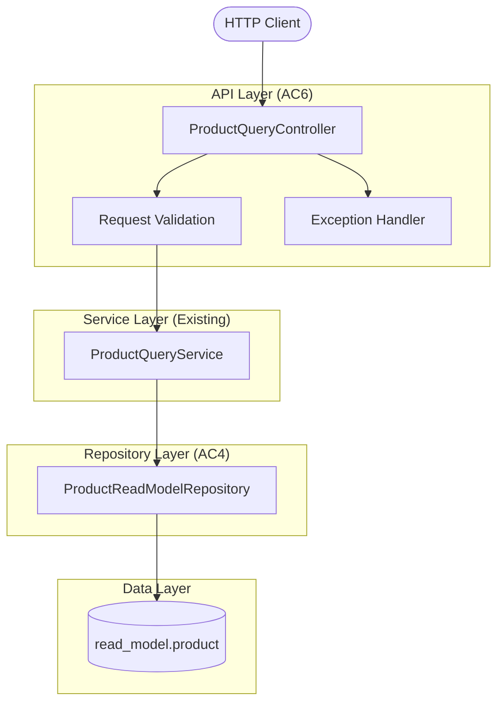
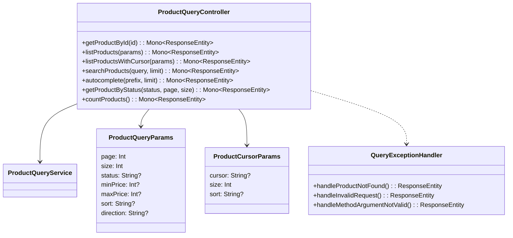
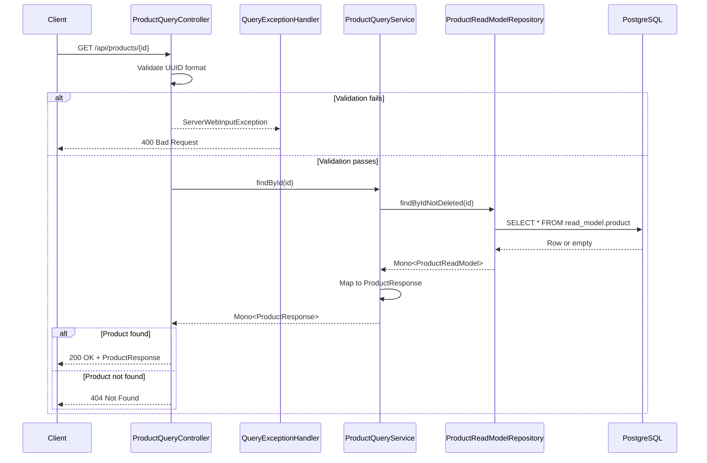
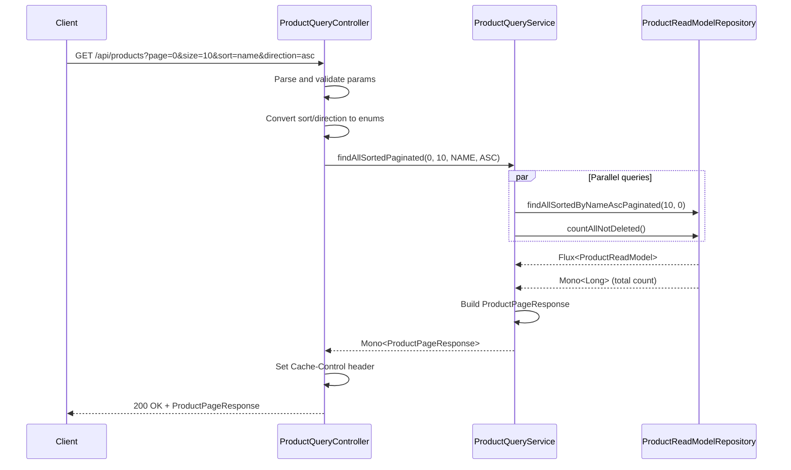

# Implementation Plan: AC6 - Product Query Service

**Feature:** Product Catalog (CQRS Architecture)
**Acceptance Criteria:** AC6 - Product Query Service
**Status:** Planning

---

## Overview

This implementation plan details the creation of the **Product Query Service API layer**, which exposes REST endpoints for querying products from the read model. The query service provides the HTTP interface for clients to retrieve product data with support for filtering, pagination, sorting, and search capabilities.

The existing codebase already includes:
- `ProductQueryService` with comprehensive query methods
- `ProductReadModelRepository` with custom R2DBC queries
- Response DTOs (`ProductResponse`, `ProductPageResponse`, `ProductCursorPageResponse`, `ProductSearchResponse`)

This plan focuses on creating the **REST controller layer** that exposes these query capabilities via HTTP endpoints, along with proper request validation, error handling, and documentation.

## Architecture



## Prerequisites

Before starting this implementation:

- [x] AC4 (Product Read Model) is complete - Read model schema and repository exist
- [x] AC5 (Event Projections) is complete - Read models are populated from events
- [x] `ProductQueryService` exists with query methods
- [x] Response DTOs are defined (`ProductResponse`, etc.)
- [x] `ProductStatusView` enum is defined

## Acceptance Criteria Reference

From the feature specification:

> - Query endpoint returns a single product by ID
> - Query endpoint returns products with pagination (offset and cursor-based)
> - Query endpoint supports filtering by status (DRAFT, ACTIVE, DISCONTINUED)
> - Query endpoint supports filtering by price range
> - Query endpoint supports text search on name and description
> - Query endpoint supports sorting by name, price, or created date
> - All query endpoints return appropriate HTTP status codes (200, 404, 400)

---

## High-Level Component Design



---

## Endpoint Design

| Method | Endpoint | Description | Query Params |
|--------|----------|-------------|--------------|
| `GET` | `/api/products/{id}` | Get single product by ID | - |
| `GET` | `/api/products` | List products with pagination | `page`, `size`, `status`, `minPrice`, `maxPrice`, `sort`, `direction` |
| `GET` | `/api/products/cursor` | List products with cursor pagination | `cursor`, `size`, `sort` |
| `GET` | `/api/products/search` | Full-text search | `q`, `limit`, `status` |
| `GET` | `/api/products/autocomplete` | Name prefix autocomplete | `prefix`, `limit` |
| `GET` | `/api/products/by-status/{status}` | Products by status (paginated) | `page`, `size` |
| `GET` | `/api/products/count` | Get total count | `status` |
| `GET` | `/api/products/sku/{sku}` | Get product by SKU | - |

### HTTP Status Codes

| Code | Description | When Used |
|------|-------------|-----------|
| 200 | OK | Successful retrieval |
| 400 | Bad Request | Invalid query parameters |
| 404 | Not Found | Product not found by ID/SKU |
| 500 | Internal Server Error | Unexpected server error |

---

## Implementation Steps

### Step 1: Create Query Parameter DTOs

**Objective:** Create request DTOs for query parameters with validation.

#### 1.1 Create Query Parameters Classes

**File:** `src/main/kotlin/com/pintailconsultingllc/cqrsspike/product/api/dto/QueryParams.kt`

```kotlin
package com.pintailconsultingllc.cqrsspike.product.api.dto

import jakarta.validation.constraints.Max
import jakarta.validation.constraints.Min
import jakarta.validation.constraints.Pattern
import jakarta.validation.constraints.Size

/**
 * Query parameters for paginated product listing.
 */
data class ProductListParams(
    @field:Min(0, message = "Page must be >= 0")
    val page: Int = 0,

    @field:Min(1, message = "Size must be >= 1")
    @field:Max(100, message = "Size must be <= 100")
    val size: Int = 20,

    @field:Pattern(regexp = "^(DRAFT|ACTIVE|DISCONTINUED)?$", message = "Invalid status")
    val status: String? = null,

    @field:Min(0, message = "minPrice must be >= 0")
    val minPrice: Int? = null,

    @field:Min(0, message = "maxPrice must be >= 0")
    val maxPrice: Int? = null,

    @field:Pattern(regexp = "^(name|price|createdAt)?$", message = "Invalid sort field")
    val sort: String? = null,

    @field:Pattern(regexp = "^(asc|desc)?$", message = "Invalid direction")
    val direction: String? = null
)

/**
 * Query parameters for cursor-based pagination.
 */
data class ProductCursorParams(
    val cursor: String? = null,

    @field:Min(1, message = "Size must be >= 1")
    @field:Max(100, message = "Size must be <= 100")
    val size: Int = 20,

    @field:Pattern(regexp = "^(name|price|createdAt)?$", message = "Invalid sort field")
    val sort: String? = null
)

/**
 * Query parameters for product search.
 */
data class ProductSearchParams(
    @field:Size(min = 1, max = 500, message = "Query must be 1-500 characters")
    val q: String,

    @field:Min(1, message = "Limit must be >= 1")
    @field:Max(100, message = "Limit must be <= 100")
    val limit: Int = 50,

    @field:Pattern(regexp = "^(DRAFT|ACTIVE|DISCONTINUED)?$", message = "Invalid status")
    val status: String? = null
)

/**
 * Query parameters for autocomplete.
 */
data class AutocompleteParams(
    @field:Size(min = 1, max = 100, message = "Prefix must be 1-100 characters")
    val prefix: String,

    @field:Min(1, message = "Limit must be >= 1")
    @field:Max(20, message = "Limit must be <= 20")
    val limit: Int = 10
)
```

#### 1.2 Verification

- [ ] Parameter classes compile without errors
- [ ] Validation annotations are correctly applied
- [ ] Default values are sensible

---

### Step 2: Create API Error Response DTOs

**Objective:** Create standardized error response DTOs.

#### 2.1 Create Error Response Classes

**File:** `src/main/kotlin/com/pintailconsultingllc/cqrsspike/product/api/dto/ErrorResponses.kt`

```kotlin
package com.pintailconsultingllc.cqrsspike.product.api.dto

import java.time.OffsetDateTime

/**
 * Standard API error response.
 */
data class ApiErrorResponse(
    val status: Int,
    val error: String,
    val message: String,
    val path: String,
    val timestamp: OffsetDateTime = OffsetDateTime.now(),
    val details: List<ValidationError>? = null
)

/**
 * Validation error detail.
 */
data class ValidationError(
    val field: String,
    val message: String,
    val rejectedValue: Any? = null
)

/**
 * Product not found error response.
 */
data class ProductNotFoundResponse(
    val status: Int = 404,
    val error: String = "Not Found",
    val message: String,
    val productId: String? = null,
    val sku: String? = null,
    val timestamp: OffsetDateTime = OffsetDateTime.now()
)

/**
 * Count response for aggregate queries.
 */
data class ProductCountResponse(
    val count: Long,
    val status: String? = null
)
```

#### 2.2 Verification

- [ ] Error response classes compile
- [ ] Consistent structure across error types

---

### Step 3: Create Query Controller

**Objective:** Create the main REST controller for product queries.

#### 3.1 Create ProductQueryController

**File:** `src/main/kotlin/com/pintailconsultingllc/cqrsspike/product/api/ProductQueryController.kt`

```kotlin
package com.pintailconsultingllc.cqrsspike.product.api

import com.pintailconsultingllc.cqrsspike.product.api.dto.ApiErrorResponse
import com.pintailconsultingllc.cqrsspike.product.api.dto.AutocompleteParams
import com.pintailconsultingllc.cqrsspike.product.api.dto.ProductCountResponse
import com.pintailconsultingllc.cqrsspike.product.api.dto.ProductCursorParams
import com.pintailconsultingllc.cqrsspike.product.api.dto.ProductListParams
import com.pintailconsultingllc.cqrsspike.product.api.dto.ProductNotFoundResponse
import com.pintailconsultingllc.cqrsspike.product.api.dto.ProductSearchParams
import com.pintailconsultingllc.cqrsspike.product.query.dto.ProductCursorPageResponse
import com.pintailconsultingllc.cqrsspike.product.query.dto.ProductPageResponse
import com.pintailconsultingllc.cqrsspike.product.query.dto.ProductResponse
import com.pintailconsultingllc.cqrsspike.product.query.dto.ProductSearchResponse
import com.pintailconsultingllc.cqrsspike.product.query.dto.SortDirection
import com.pintailconsultingllc.cqrsspike.product.query.dto.SortField
import com.pintailconsultingllc.cqrsspike.product.query.model.ProductStatusView
import com.pintailconsultingllc.cqrsspike.product.query.service.ProductQueryService
import io.swagger.v3.oas.annotations.Operation
import io.swagger.v3.oas.annotations.Parameter
import io.swagger.v3.oas.annotations.media.Content
import io.swagger.v3.oas.annotations.media.Schema
import io.swagger.v3.oas.annotations.responses.ApiResponse
import io.swagger.v3.oas.annotations.responses.ApiResponses
import io.swagger.v3.oas.annotations.tags.Tag
import jakarta.validation.Valid
import jakarta.validation.constraints.Max
import jakarta.validation.constraints.Min
import jakarta.validation.constraints.Pattern
import jakarta.validation.constraints.Size
import org.slf4j.LoggerFactory
import org.springframework.http.CacheControl
import org.springframework.http.HttpStatus
import org.springframework.http.MediaType
import org.springframework.http.ResponseEntity
import org.springframework.validation.annotation.Validated
import org.springframework.web.bind.annotation.GetMapping
import org.springframework.web.bind.annotation.PathVariable
import org.springframework.web.bind.annotation.RequestMapping
import org.springframework.web.bind.annotation.RequestParam
import org.springframework.web.bind.annotation.RestController
import reactor.core.publisher.Mono
import java.time.Duration
import java.util.UUID

/**
 * REST controller for Product query operations.
 *
 * Provides endpoints for retrieving products from the read model
 * with support for pagination, filtering, sorting, and search.
 */
@RestController
@RequestMapping("/api/products")
@Validated
@Tag(name = "Product Queries", description = "Endpoints for querying products")
class ProductQueryController(
    private val queryService: ProductQueryService
) {
    private val logger = LoggerFactory.getLogger(ProductQueryController::class.java)

    companion object {
        private val DEFAULT_CACHE_CONTROL = CacheControl.maxAge(Duration.ofSeconds(60))
        private val NO_CACHE = CacheControl.noCache()
    }

    // ============ Single Product Endpoints ============

    /**
     * Get a product by ID.
     */
    @GetMapping("/{id}")
    @Operation(
        summary = "Get product by ID",
        description = "Retrieves a single product by its unique identifier"
    )
    @ApiResponses(
        ApiResponse(
            responseCode = "200",
            description = "Product found",
            content = [Content(schema = Schema(implementation = ProductResponse::class))]
        ),
        ApiResponse(
            responseCode = "404",
            description = "Product not found",
            content = [Content(schema = Schema(implementation = ProductNotFoundResponse::class))]
        ),
        ApiResponse(
            responseCode = "400",
            description = "Invalid product ID format",
            content = [Content(schema = Schema(implementation = ApiErrorResponse::class))]
        )
    )
    fun getProductById(
        @Parameter(description = "Product UUID", required = true)
        @PathVariable id: UUID
    ): Mono<ResponseEntity<ProductResponse>> {
        logger.debug("GET /api/products/{}", id)

        return queryService.findById(id)
            .map { product ->
                ResponseEntity.ok()
                    .cacheControl(DEFAULT_CACHE_CONTROL)
                    .body(product)
            }
            .switchIfEmpty(Mono.just(ResponseEntity.notFound().build()))
    }

    /**
     * Get a product by SKU.
     */
    @GetMapping("/sku/{sku}")
    @Operation(
        summary = "Get product by SKU",
        description = "Retrieves a single product by its Stock Keeping Unit"
    )
    @ApiResponses(
        ApiResponse(responseCode = "200", description = "Product found"),
        ApiResponse(responseCode = "404", description = "Product not found")
    )
    fun getProductBySku(
        @Parameter(description = "Product SKU", required = true)
        @PathVariable
        @Size(min = 3, max = 50)
        sku: String
    ): Mono<ResponseEntity<ProductResponse>> {
        logger.debug("GET /api/products/sku/{}", sku)

        return queryService.findBySku(sku)
            .map { product ->
                ResponseEntity.ok()
                    .cacheControl(DEFAULT_CACHE_CONTROL)
                    .body(product)
            }
            .switchIfEmpty(Mono.just(ResponseEntity.notFound().build()))
    }

    // ============ List Endpoints (Offset Pagination) ============

    /**
     * List products with offset-based pagination and optional filters.
     */
    @GetMapping
    @Operation(
        summary = "List products",
        description = "Retrieves a paginated list of products with optional filtering and sorting"
    )
    @ApiResponses(
        ApiResponse(responseCode = "200", description = "Products retrieved successfully"),
        ApiResponse(responseCode = "400", description = "Invalid query parameters")
    )
    fun listProducts(
        @Parameter(description = "Page number (0-indexed)")
        @RequestParam(defaultValue = "0")
        @Min(0) page: Int,

        @Parameter(description = "Page size (1-100)")
        @RequestParam(defaultValue = "20")
        @Min(1) @Max(100) size: Int,

        @Parameter(description = "Filter by status (DRAFT, ACTIVE, DISCONTINUED)")
        @RequestParam(required = false)
        @Pattern(regexp = "^(DRAFT|ACTIVE|DISCONTINUED)?$") status: String?,

        @Parameter(description = "Minimum price in cents")
        @RequestParam(required = false)
        @Min(0) minPrice: Int?,

        @Parameter(description = "Maximum price in cents")
        @RequestParam(required = false)
        @Min(0) maxPrice: Int?,

        @Parameter(description = "Sort field (name, price, createdAt)")
        @RequestParam(defaultValue = "createdAt")
        @Pattern(regexp = "^(name|price|createdAt)$") sort: String,

        @Parameter(description = "Sort direction (asc, desc)")
        @RequestParam(defaultValue = "desc")
        @Pattern(regexp = "^(asc|desc)$") direction: String
    ): Mono<ResponseEntity<ProductPageResponse>> {
        logger.debug(
            "GET /api/products - page={}, size={}, status={}, minPrice={}, maxPrice={}, sort={}, direction={}",
            page, size, status, minPrice, maxPrice, sort, direction
        )

        val sortField = parseSortField(sort)
        val sortDirection = parseSortDirection(direction)

        return when {
            // Filter by status AND price range
            status != null && minPrice != null && maxPrice != null -> {
                val statusEnum = ProductStatusView.valueOf(status)
                queryService.findByStatusAndPriceRange(statusEnum, minPrice, maxPrice)
                    .collectList()
                    .map { products ->
                        val paged = paginateList(products, page, size)
                        ProductPageResponse.of(paged, page, size, products.size.toLong())
                    }
            }

            // Filter by status only
            status != null -> {
                val statusEnum = ProductStatusView.valueOf(status)
                queryService.findByStatusPaginated(statusEnum, page, size)
            }

            // Filter by price range only
            minPrice != null && maxPrice != null -> {
                queryService.findByPriceRange(minPrice, maxPrice)
                    .collectList()
                    .map { products ->
                        val paged = paginateList(products, page, size)
                        ProductPageResponse.of(paged, page, size, products.size.toLong())
                    }
            }

            // No filters - sorted pagination
            else -> {
                queryService.findAllSortedPaginated(page, size, sortField, sortDirection)
            }
        }.map { response ->
            ResponseEntity.ok()
                .cacheControl(DEFAULT_CACHE_CONTROL)
                .body(response)
        }
    }

    // ============ Cursor Pagination Endpoint ============

    /**
     * List products with cursor-based pagination.
     */
    @GetMapping("/cursor")
    @Operation(
        summary = "List products with cursor pagination",
        description = "Retrieves products using cursor-based pagination for efficient scrolling"
    )
    @ApiResponses(
        ApiResponse(responseCode = "200", description = "Products retrieved successfully"),
        ApiResponse(responseCode = "400", description = "Invalid cursor or parameters")
    )
    fun listProductsWithCursor(
        @Parameter(description = "Pagination cursor (from previous response)")
        @RequestParam(required = false) cursor: String?,

        @Parameter(description = "Page size (1-100)")
        @RequestParam(defaultValue = "20")
        @Min(1) @Max(100) size: Int,

        @Parameter(description = "Sort field (name, price, createdAt)")
        @RequestParam(defaultValue = "createdAt")
        @Pattern(regexp = "^(name|price|createdAt)$") sort: String
    ): Mono<ResponseEntity<ProductCursorPageResponse>> {
        logger.debug("GET /api/products/cursor - cursor={}, size={}, sort={}", cursor, size, sort)

        val sortField = parseSortField(sort)

        return queryService.findWithCursor(cursor, size, sortField)
            .map { response ->
                ResponseEntity.ok()
                    .cacheControl(DEFAULT_CACHE_CONTROL)
                    .body(response)
            }
    }

    // ============ Status Filter Endpoint ============

    /**
     * Get products by status with pagination.
     */
    @GetMapping("/by-status/{status}")
    @Operation(
        summary = "Get products by status",
        description = "Retrieves paginated products filtered by status"
    )
    @ApiResponses(
        ApiResponse(responseCode = "200", description = "Products retrieved successfully"),
        ApiResponse(responseCode = "400", description = "Invalid status value")
    )
    fun getProductsByStatus(
        @Parameter(description = "Product status", required = true)
        @PathVariable
        @Pattern(regexp = "^(DRAFT|ACTIVE|DISCONTINUED)$") status: String,

        @Parameter(description = "Page number (0-indexed)")
        @RequestParam(defaultValue = "0")
        @Min(0) page: Int,

        @Parameter(description = "Page size (1-100)")
        @RequestParam(defaultValue = "20")
        @Min(1) @Max(100) size: Int
    ): Mono<ResponseEntity<ProductPageResponse>> {
        logger.debug("GET /api/products/by-status/{} - page={}, size={}", status, page, size)

        val statusEnum = ProductStatusView.valueOf(status.uppercase())

        return queryService.findByStatusPaginated(statusEnum, page, size)
            .map { response ->
                ResponseEntity.ok()
                    .cacheControl(DEFAULT_CACHE_CONTROL)
                    .body(response)
            }
    }

    // ============ Search Endpoints ============

    /**
     * Full-text search on products.
     */
    @GetMapping("/search")
    @Operation(
        summary = "Search products",
        description = "Full-text search on product name and description"
    )
    @ApiResponses(
        ApiResponse(responseCode = "200", description = "Search results"),
        ApiResponse(responseCode = "400", description = "Invalid search parameters")
    )
    fun searchProducts(
        @Parameter(description = "Search query", required = true)
        @RequestParam
        @Size(min = 1, max = 500) q: String,

        @Parameter(description = "Maximum results to return (1-100)")
        @RequestParam(defaultValue = "50")
        @Min(1) @Max(100) limit: Int,

        @Parameter(description = "Filter by status")
        @RequestParam(required = false)
        @Pattern(regexp = "^(DRAFT|ACTIVE|DISCONTINUED)?$") status: String?
    ): Mono<ResponseEntity<ProductSearchResponse>> {
        logger.debug("GET /api/products/search - q='{}', limit={}, status={}", q, limit, status)

        return if (status != null) {
            val statusEnum = ProductStatusView.valueOf(status.uppercase())
            queryService.searchByStatus(q, statusEnum, limit)
                .collectList()
                .map { results ->
                    ProductSearchResponse(
                        content = results,
                        query = q,
                        totalMatches = results.size.toLong(),
                        hasMore = false
                    )
                }
        } else {
            queryService.search(q, limit)
        }.map { response ->
            ResponseEntity.ok()
                .cacheControl(NO_CACHE) // Search results should not be cached
                .body(response)
        }
    }

    /**
     * Autocomplete search by name prefix.
     */
    @GetMapping("/autocomplete")
    @Operation(
        summary = "Autocomplete product names",
        description = "Returns products matching the given name prefix"
    )
    @ApiResponses(
        ApiResponse(responseCode = "200", description = "Autocomplete suggestions"),
        ApiResponse(responseCode = "400", description = "Invalid parameters")
    )
    fun autocomplete(
        @Parameter(description = "Name prefix to search", required = true)
        @RequestParam
        @Size(min = 1, max = 100) prefix: String,

        @Parameter(description = "Maximum results to return (1-20)")
        @RequestParam(defaultValue = "10")
        @Min(1) @Max(20) limit: Int
    ): Mono<ResponseEntity<List<ProductResponse>>> {
        logger.debug("GET /api/products/autocomplete - prefix='{}', limit={}", prefix, limit)

        return queryService.autocomplete(prefix, limit)
            .collectList()
            .map { suggestions ->
                ResponseEntity.ok()
                    .cacheControl(CacheControl.maxAge(Duration.ofSeconds(30)))
                    .body(suggestions)
            }
    }

    // ============ Aggregate Endpoints ============

    /**
     * Get product count.
     */
    @GetMapping("/count")
    @Operation(
        summary = "Get product count",
        description = "Returns the total count of products, optionally filtered by status"
    )
    @ApiResponses(
        ApiResponse(responseCode = "200", description = "Count retrieved successfully")
    )
    fun countProducts(
        @Parameter(description = "Filter by status")
        @RequestParam(required = false)
        @Pattern(regexp = "^(DRAFT|ACTIVE|DISCONTINUED)?$") status: String?
    ): Mono<ResponseEntity<ProductCountResponse>> {
        logger.debug("GET /api/products/count - status={}", status)

        return if (status != null) {
            val statusEnum = ProductStatusView.valueOf(status.uppercase())
            queryService.countByStatus(statusEnum)
                .map { count -> ProductCountResponse(count, status) }
        } else {
            queryService.count()
                .map { count -> ProductCountResponse(count) }
        }.map { response ->
            ResponseEntity.ok()
                .cacheControl(CacheControl.maxAge(Duration.ofSeconds(10)))
                .body(response)
        }
    }

    // ============ Helper Methods ============

    private fun parseSortField(sort: String): SortField {
        return when (sort.lowercase()) {
            "name" -> SortField.NAME
            "price" -> SortField.PRICE
            "createdat", "created_at" -> SortField.CREATED_AT
            else -> SortField.CREATED_AT
        }
    }

    private fun parseSortDirection(direction: String): SortDirection {
        return when (direction.lowercase()) {
            "asc" -> SortDirection.ASC
            "desc" -> SortDirection.DESC
            else -> SortDirection.DESC
        }
    }

    private fun <T> paginateList(list: List<T>, page: Int, size: Int): List<T> {
        val startIndex = page * size
        if (startIndex >= list.size) {
            return emptyList()
        }
        val endIndex = minOf(startIndex + size, list.size)
        return list.subList(startIndex, endIndex)
    }
}
```

#### 3.2 Verification

- [ ] Controller compiles without errors
- [ ] All endpoints have OpenAPI annotations
- [ ] Validation annotations are correctly applied
- [ ] Cache-Control headers are set appropriately
- [ ] Logging is implemented for all endpoints

---

### Step 4: Create Exception Handler

**Objective:** Create a global exception handler for query-side errors.

#### 4.1 Create QueryExceptionHandler

**File:** `src/main/kotlin/com/pintailconsultingllc/cqrsspike/product/api/QueryExceptionHandler.kt`

```kotlin
package com.pintailconsultingllc.cqrsspike.product.api

import com.pintailconsultingllc.cqrsspike.product.api.dto.ApiErrorResponse
import com.pintailconsultingllc.cqrsspike.product.api.dto.ValidationError
import jakarta.validation.ConstraintViolationException
import org.slf4j.LoggerFactory
import org.springframework.http.HttpStatus
import org.springframework.http.ResponseEntity
import org.springframework.web.bind.annotation.ExceptionHandler
import org.springframework.web.bind.annotation.RestControllerAdvice
import org.springframework.web.bind.support.WebExchangeBindException
import org.springframework.web.server.ServerWebExchange
import org.springframework.web.server.ServerWebInputException
import reactor.core.publisher.Mono
import java.time.OffsetDateTime

/**
 * Global exception handler for Product Query endpoints.
 *
 * Provides consistent error responses for validation errors,
 * invalid requests, and unexpected errors.
 */
@RestControllerAdvice(basePackages = ["com.pintailconsultingllc.cqrsspike.product.api"])
class QueryExceptionHandler {

    private val logger = LoggerFactory.getLogger(QueryExceptionHandler::class.java)

    /**
     * Handle validation errors from @Valid annotations.
     */
    @ExceptionHandler(WebExchangeBindException::class)
    fun handleValidationError(
        ex: WebExchangeBindException,
        exchange: ServerWebExchange
    ): Mono<ResponseEntity<ApiErrorResponse>> {
        logger.warn("Validation error: {}", ex.message)

        val errors = ex.bindingResult.fieldErrors.map { fieldError ->
            ValidationError(
                field = fieldError.field,
                message = fieldError.defaultMessage ?: "Invalid value",
                rejectedValue = fieldError.rejectedValue
            )
        }

        val response = ApiErrorResponse(
            status = HttpStatus.BAD_REQUEST.value(),
            error = HttpStatus.BAD_REQUEST.reasonPhrase,
            message = "Validation failed",
            path = exchange.request.path.value(),
            details = errors
        )

        return Mono.just(ResponseEntity.badRequest().body(response))
    }

    /**
     * Handle constraint violations from @Validated annotations.
     */
    @ExceptionHandler(ConstraintViolationException::class)
    fun handleConstraintViolation(
        ex: ConstraintViolationException,
        exchange: ServerWebExchange
    ): Mono<ResponseEntity<ApiErrorResponse>> {
        logger.warn("Constraint violation: {}", ex.message)

        val errors = ex.constraintViolations.map { violation ->
            val propertyPath = violation.propertyPath.toString()
            val paramName = propertyPath.substringAfterLast('.')

            ValidationError(
                field = paramName,
                message = violation.message,
                rejectedValue = violation.invalidValue
            )
        }

        val response = ApiErrorResponse(
            status = HttpStatus.BAD_REQUEST.value(),
            error = HttpStatus.BAD_REQUEST.reasonPhrase,
            message = "Validation failed",
            path = exchange.request.path.value(),
            details = errors
        )

        return Mono.just(ResponseEntity.badRequest().body(response))
    }

    /**
     * Handle invalid input errors (e.g., invalid UUID format).
     */
    @ExceptionHandler(ServerWebInputException::class)
    fun handleInputError(
        ex: ServerWebInputException,
        exchange: ServerWebExchange
    ): Mono<ResponseEntity<ApiErrorResponse>> {
        logger.warn("Input error: {}", ex.message)

        val response = ApiErrorResponse(
            status = HttpStatus.BAD_REQUEST.value(),
            error = HttpStatus.BAD_REQUEST.reasonPhrase,
            message = "Invalid request: ${ex.reason ?: "Invalid input"}",
            path = exchange.request.path.value()
        )

        return Mono.just(ResponseEntity.badRequest().body(response))
    }

    /**
     * Handle IllegalArgumentException (e.g., invalid enum values).
     */
    @ExceptionHandler(IllegalArgumentException::class)
    fun handleIllegalArgument(
        ex: IllegalArgumentException,
        exchange: ServerWebExchange
    ): Mono<ResponseEntity<ApiErrorResponse>> {
        logger.warn("Illegal argument: {}", ex.message)

        val response = ApiErrorResponse(
            status = HttpStatus.BAD_REQUEST.value(),
            error = HttpStatus.BAD_REQUEST.reasonPhrase,
            message = ex.message ?: "Invalid argument",
            path = exchange.request.path.value()
        )

        return Mono.just(ResponseEntity.badRequest().body(response))
    }

    /**
     * Handle all other unexpected errors.
     */
    @ExceptionHandler(Exception::class)
    fun handleGenericError(
        ex: Exception,
        exchange: ServerWebExchange
    ): Mono<ResponseEntity<ApiErrorResponse>> {
        logger.error("Unexpected error in query endpoint", ex)

        val response = ApiErrorResponse(
            status = HttpStatus.INTERNAL_SERVER_ERROR.value(),
            error = HttpStatus.INTERNAL_SERVER_ERROR.reasonPhrase,
            message = "An unexpected error occurred",
            path = exchange.request.path.value()
        )

        return Mono.just(
            ResponseEntity.status(HttpStatus.INTERNAL_SERVER_ERROR).body(response)
        )
    }
}
```

#### 4.2 Verification

- [ ] Exception handler compiles
- [ ] All common exception types are handled
- [ ] Error responses are consistent

---

### Step 5: Create Unit Tests

**Objective:** Create comprehensive unit tests for the query controller.

#### 5.1 Create Controller Unit Tests

**File:** `src/test/kotlin/com/pintailconsultingllc/cqrsspike/product/api/ProductQueryControllerTest.kt`

```kotlin
package com.pintailconsultingllc.cqrsspike.product.api

import com.pintailconsultingllc.cqrsspike.product.query.dto.ProductPageResponse
import com.pintailconsultingllc.cqrsspike.product.query.dto.ProductResponse
import com.pintailconsultingllc.cqrsspike.product.query.dto.ProductSearchResponse
import com.pintailconsultingllc.cqrsspike.product.query.dto.SortDirection
import com.pintailconsultingllc.cqrsspike.product.query.dto.SortField
import com.pintailconsultingllc.cqrsspike.product.query.model.ProductStatusView
import com.pintailconsultingllc.cqrsspike.product.query.service.ProductQueryService
import org.junit.jupiter.api.DisplayName
import org.junit.jupiter.api.Nested
import org.junit.jupiter.api.Test
import org.junit.jupiter.api.extension.ExtendWith
import org.mockito.kotlin.any
import org.mockito.kotlin.eq
import org.mockito.kotlin.whenever
import org.springframework.beans.factory.annotation.Autowired
import org.springframework.boot.test.autoconfigure.web.reactive.WebFluxTest
import org.springframework.boot.test.mock.mockito.MockBean
import org.springframework.test.context.junit.jupiter.SpringExtension
import org.springframework.test.web.reactive.server.WebTestClient
import reactor.core.publisher.Flux
import reactor.core.publisher.Mono
import java.time.OffsetDateTime
import java.util.UUID

@ExtendWith(SpringExtension::class)
@WebFluxTest(ProductQueryController::class)
@DisplayName("ProductQueryController")
class ProductQueryControllerTest {

    @Autowired
    private lateinit var webTestClient: WebTestClient

    @MockBean
    private lateinit var queryService: ProductQueryService

    @Nested
    @DisplayName("GET /api/products/{id}")
    inner class GetProductById {

        @Test
        @DisplayName("should return 200 with product when found")
        fun shouldReturnProductWhenFound() {
            val productId = UUID.randomUUID()
            val product = createProductResponse(productId)

            whenever(queryService.findById(productId))
                .thenReturn(Mono.just(product))

            webTestClient.get()
                .uri("/api/products/$productId")
                .exchange()
                .expectStatus().isOk
                .expectBody()
                .jsonPath("$.id").isEqualTo(productId.toString())
                .jsonPath("$.sku").isEqualTo(product.sku)
                .jsonPath("$.name").isEqualTo(product.name)
        }

        @Test
        @DisplayName("should return 404 when product not found")
        fun shouldReturn404WhenNotFound() {
            val productId = UUID.randomUUID()

            whenever(queryService.findById(productId))
                .thenReturn(Mono.empty())

            webTestClient.get()
                .uri("/api/products/$productId")
                .exchange()
                .expectStatus().isNotFound
        }

        @Test
        @DisplayName("should return 400 for invalid UUID format")
        fun shouldReturn400ForInvalidUuid() {
            webTestClient.get()
                .uri("/api/products/invalid-uuid")
                .exchange()
                .expectStatus().isBadRequest
        }
    }

    @Nested
    @DisplayName("GET /api/products")
    inner class ListProducts {

        @Test
        @DisplayName("should return paginated products")
        fun shouldReturnPaginatedProducts() {
            val pageResponse = ProductPageResponse(
                content = listOf(createProductResponse()),
                page = 0,
                size = 20,
                totalElements = 1,
                totalPages = 1,
                first = true,
                last = true,
                hasNext = false,
                hasPrevious = false
            )

            whenever(queryService.findAllSortedPaginated(
                eq(0), eq(20), eq(SortField.CREATED_AT), eq(SortDirection.DESC)
            )).thenReturn(Mono.just(pageResponse))

            webTestClient.get()
                .uri("/api/products")
                .exchange()
                .expectStatus().isOk
                .expectBody()
                .jsonPath("$.content").isArray
                .jsonPath("$.page").isEqualTo(0)
                .jsonPath("$.size").isEqualTo(20)
                .jsonPath("$.totalElements").isEqualTo(1)
        }

        @Test
        @DisplayName("should apply pagination parameters")
        fun shouldApplyPaginationParameters() {
            val pageResponse = ProductPageResponse(
                content = emptyList(),
                page = 2,
                size = 10,
                totalElements = 100,
                totalPages = 10,
                first = false,
                last = false,
                hasNext = true,
                hasPrevious = true
            )

            whenever(queryService.findAllSortedPaginated(
                eq(2), eq(10), eq(SortField.CREATED_AT), eq(SortDirection.DESC)
            )).thenReturn(Mono.just(pageResponse))

            webTestClient.get()
                .uri("/api/products?page=2&size=10")
                .exchange()
                .expectStatus().isOk
                .expectBody()
                .jsonPath("$.page").isEqualTo(2)
                .jsonPath("$.size").isEqualTo(10)
        }

        @Test
        @DisplayName("should filter by status")
        fun shouldFilterByStatus() {
            val pageResponse = ProductPageResponse(
                content = listOf(createProductResponse()),
                page = 0,
                size = 20,
                totalElements = 1,
                totalPages = 1,
                first = true,
                last = true,
                hasNext = false,
                hasPrevious = false
            )

            whenever(queryService.findByStatusPaginated(
                eq(ProductStatusView.ACTIVE), eq(0), eq(20)
            )).thenReturn(Mono.just(pageResponse))

            webTestClient.get()
                .uri("/api/products?status=ACTIVE")
                .exchange()
                .expectStatus().isOk
        }

        @Test
        @DisplayName("should return 400 for invalid status")
        fun shouldReturn400ForInvalidStatus() {
            webTestClient.get()
                .uri("/api/products?status=INVALID")
                .exchange()
                .expectStatus().isBadRequest
        }

        @Test
        @DisplayName("should return 400 for page size over limit")
        fun shouldReturn400ForSizeOverLimit() {
            webTestClient.get()
                .uri("/api/products?size=500")
                .exchange()
                .expectStatus().isBadRequest
        }
    }

    @Nested
    @DisplayName("GET /api/products/by-status/{status}")
    inner class GetProductsByStatus {

        @Test
        @DisplayName("should return products by status")
        fun shouldReturnProductsByStatus() {
            val pageResponse = ProductPageResponse(
                content = listOf(createProductResponse()),
                page = 0,
                size = 20,
                totalElements = 1,
                totalPages = 1,
                first = true,
                last = true,
                hasNext = false,
                hasPrevious = false
            )

            whenever(queryService.findByStatusPaginated(
                eq(ProductStatusView.ACTIVE), eq(0), eq(20)
            )).thenReturn(Mono.just(pageResponse))

            webTestClient.get()
                .uri("/api/products/by-status/ACTIVE")
                .exchange()
                .expectStatus().isOk
        }
    }

    @Nested
    @DisplayName("GET /api/products/search")
    inner class SearchProducts {

        @Test
        @DisplayName("should return search results")
        fun shouldReturnSearchResults() {
            val searchResponse = ProductSearchResponse(
                content = listOf(createProductResponse()),
                query = "test",
                totalMatches = 1,
                hasMore = false
            )

            whenever(queryService.search(eq("test"), eq(50)))
                .thenReturn(Mono.just(searchResponse))

            webTestClient.get()
                .uri("/api/products/search?q=test")
                .exchange()
                .expectStatus().isOk
                .expectBody()
                .jsonPath("$.query").isEqualTo("test")
                .jsonPath("$.totalMatches").isEqualTo(1)
        }

        @Test
        @DisplayName("should return 400 for missing query parameter")
        fun shouldReturn400ForMissingQuery() {
            webTestClient.get()
                .uri("/api/products/search")
                .exchange()
                .expectStatus().isBadRequest
        }
    }

    @Nested
    @DisplayName("GET /api/products/count")
    inner class CountProducts {

        @Test
        @DisplayName("should return total count")
        fun shouldReturnTotalCount() {
            whenever(queryService.count())
                .thenReturn(Mono.just(42L))

            webTestClient.get()
                .uri("/api/products/count")
                .exchange()
                .expectStatus().isOk
                .expectBody()
                .jsonPath("$.count").isEqualTo(42)
        }

        @Test
        @DisplayName("should return count by status")
        fun shouldReturnCountByStatus() {
            whenever(queryService.countByStatus(eq(ProductStatusView.ACTIVE)))
                .thenReturn(Mono.just(10L))

            webTestClient.get()
                .uri("/api/products/count?status=ACTIVE")
                .exchange()
                .expectStatus().isOk
                .expectBody()
                .jsonPath("$.count").isEqualTo(10)
                .jsonPath("$.status").isEqualTo("ACTIVE")
        }
    }

    // Helper methods

    private fun createProductResponse(id: UUID = UUID.randomUUID()): ProductResponse {
        val now = OffsetDateTime.now()
        return ProductResponse(
            id = id,
            sku = "TEST-001",
            name = "Test Product",
            description = "A test product",
            priceCents = 1999,
            priceDisplay = "$19.99",
            status = "ACTIVE",
            createdAt = now,
            updatedAt = now,
            version = 1
        )
    }
}
```

#### 5.2 Verification

- [ ] All unit tests pass
- [ ] Controller behavior is thoroughly tested
- [ ] Edge cases and error scenarios are covered

---

### Step 6: Create Integration Tests

**Objective:** Create integration tests that verify the complete query flow.

#### 6.1 Create Controller Integration Tests

**File:** `src/test/kotlin/com/pintailconsultingllc/cqrsspike/product/api/ProductQueryControllerIntegrationTest.kt`

```kotlin
package com.pintailconsultingllc.cqrsspike.product.api

import com.pintailconsultingllc.cqrsspike.product.query.model.ProductReadModel
import com.pintailconsultingllc.cqrsspike.product.query.repository.ProductReadModelRepository
import org.junit.jupiter.api.BeforeEach
import org.junit.jupiter.api.DisplayName
import org.junit.jupiter.api.Nested
import org.junit.jupiter.api.Test
import org.springframework.beans.factory.annotation.Autowired
import org.springframework.boot.test.autoconfigure.web.reactive.AutoConfigureWebTestClient
import org.springframework.boot.test.context.SpringBootTest
import org.springframework.http.MediaType
import org.springframework.test.context.DynamicPropertyRegistry
import org.springframework.test.context.DynamicPropertySource
import org.springframework.test.web.reactive.server.WebTestClient
import org.testcontainers.containers.PostgreSQLContainer
import org.testcontainers.junit.jupiter.Container
import org.testcontainers.junit.jupiter.Testcontainers
import java.time.OffsetDateTime
import java.util.UUID

@SpringBootTest(webEnvironment = SpringBootTest.WebEnvironment.RANDOM_PORT)
@AutoConfigureWebTestClient
@Testcontainers(disabledWithoutDocker = true)
@DisplayName("ProductQueryController Integration Tests")
class ProductQueryControllerIntegrationTest {

    companion object {
        @Container
        @JvmStatic
        val postgres: PostgreSQLContainer<*> = PostgreSQLContainer("postgres:18-alpine")
            .withDatabaseName("cqrs_test")
            .withUsername("test")
            .withPassword("test")

        @DynamicPropertySource
        @JvmStatic
        fun configureProperties(registry: DynamicPropertyRegistry) {
            registry.add("spring.r2dbc.url") {
                "r2dbc:postgresql://${postgres.host}:${postgres.firstMappedPort}/${postgres.databaseName}"
            }
            registry.add("spring.r2dbc.username", postgres::getUsername)
            registry.add("spring.r2dbc.password", postgres::getPassword)
            registry.add("projection.auto-start") { "false" }
            registry.add("spring.cloud.vault.enabled") { "false" }
        }
    }

    @Autowired
    private lateinit var webTestClient: WebTestClient

    @Autowired
    private lateinit var repository: ProductReadModelRepository

    @BeforeEach
    fun setUp() {
        // Clean up test data
        repository.deleteAll().block()
    }

    @Nested
    @DisplayName("GET /api/products/{id}")
    inner class GetProductById {

        @Test
        @DisplayName("should return product when found")
        fun shouldReturnProductWhenFound() {
            val product = createAndSaveProduct("INTEG-001", "Integration Test Product", 1999)

            webTestClient.get()
                .uri("/api/products/${product.id}")
                .accept(MediaType.APPLICATION_JSON)
                .exchange()
                .expectStatus().isOk
                .expectBody()
                .jsonPath("$.id").isEqualTo(product.id.toString())
                .jsonPath("$.sku").isEqualTo("INTEG-001")
                .jsonPath("$.name").isEqualTo("Integration Test Product")
                .jsonPath("$.priceCents").isEqualTo(1999)
        }

        @Test
        @DisplayName("should return 404 when product not found")
        fun shouldReturn404WhenNotFound() {
            val nonExistentId = UUID.randomUUID()

            webTestClient.get()
                .uri("/api/products/$nonExistentId")
                .accept(MediaType.APPLICATION_JSON)
                .exchange()
                .expectStatus().isNotFound
        }
    }

    @Nested
    @DisplayName("GET /api/products")
    inner class ListProducts {

        @Test
        @DisplayName("should return empty page when no products")
        fun shouldReturnEmptyPage() {
            webTestClient.get()
                .uri("/api/products")
                .accept(MediaType.APPLICATION_JSON)
                .exchange()
                .expectStatus().isOk
                .expectBody()
                .jsonPath("$.content").isArray
                .jsonPath("$.content.length()").isEqualTo(0)
                .jsonPath("$.totalElements").isEqualTo(0)
        }

        @Test
        @DisplayName("should return paginated products")
        fun shouldReturnPaginatedProducts() {
            // Create test products
            repeat(5) { i ->
                createAndSaveProduct("PAGE-$i", "Product $i", 1000 + i)
            }

            webTestClient.get()
                .uri("/api/products?page=0&size=3")
                .accept(MediaType.APPLICATION_JSON)
                .exchange()
                .expectStatus().isOk
                .expectBody()
                .jsonPath("$.content.length()").isEqualTo(3)
                .jsonPath("$.totalElements").isEqualTo(5)
                .jsonPath("$.totalPages").isEqualTo(2)
                .jsonPath("$.hasNext").isEqualTo(true)
        }

        @Test
        @DisplayName("should filter by status")
        fun shouldFilterByStatus() {
            createAndSaveProduct("ACTIVE-1", "Active Product", 1000, "ACTIVE")
            createAndSaveProduct("DRAFT-1", "Draft Product", 2000, "DRAFT")

            webTestClient.get()
                .uri("/api/products?status=ACTIVE")
                .accept(MediaType.APPLICATION_JSON)
                .exchange()
                .expectStatus().isOk
                .expectBody()
                .jsonPath("$.content.length()").isEqualTo(1)
                .jsonPath("$.content[0].status").isEqualTo("ACTIVE")
        }
    }

    @Nested
    @DisplayName("GET /api/products/search")
    inner class SearchProducts {

        @Test
        @DisplayName("should return matching products")
        fun shouldReturnMatchingProducts() {
            createAndSaveProduct("SRCH-1", "Amazing Widget", 999)
            createAndSaveProduct("SRCH-2", "Basic Gadget", 1999)

            webTestClient.get()
                .uri("/api/products/search?q=widget")
                .accept(MediaType.APPLICATION_JSON)
                .exchange()
                .expectStatus().isOk
                .expectBody()
                .jsonPath("$.query").isEqualTo("widget")
                .jsonPath("$.content[0].name").isEqualTo("Amazing Widget")
        }
    }

    @Nested
    @DisplayName("GET /api/products/count")
    inner class CountProducts {

        @Test
        @DisplayName("should return correct count")
        fun shouldReturnCorrectCount() {
            repeat(3) { i ->
                createAndSaveProduct("CNT-$i", "Count Product $i", 1000)
            }

            webTestClient.get()
                .uri("/api/products/count")
                .accept(MediaType.APPLICATION_JSON)
                .exchange()
                .expectStatus().isOk
                .expectBody()
                .jsonPath("$.count").isEqualTo(3)
        }
    }

    // Helper methods

    private fun createAndSaveProduct(
        sku: String,
        name: String,
        priceCents: Int,
        status: String = "ACTIVE"
    ): ProductReadModel {
        val now = OffsetDateTime.now()
        val product = ProductReadModel(
            id = UUID.randomUUID(),
            sku = sku,
            name = name,
            description = "Test description for $name",
            priceCents = priceCents,
            priceDisplay = null,
            status = status,
            createdAt = now,
            updatedAt = now,
            aggregateVersion = 1L,
            isDeleted = false
        )
        return repository.save(product).block()!!
    }
}
```

#### 6.2 Verification

- [ ] Integration tests pass with Testcontainers
- [ ] Endpoints work correctly with real database
- [ ] Pagination and filtering work correctly
- [ ] Search returns expected results

---

### Step 7: Add OpenAPI/Swagger Configuration

**Objective:** Configure OpenAPI documentation for query endpoints.

#### 7.1 Create OpenAPI Configuration

**File:** `src/main/kotlin/com/pintailconsultingllc/cqrsspike/config/OpenApiConfig.kt`

```kotlin
package com.pintailconsultingllc.cqrsspike.config

import io.swagger.v3.oas.models.OpenAPI
import io.swagger.v3.oas.models.info.Contact
import io.swagger.v3.oas.models.info.Info
import io.swagger.v3.oas.models.servers.Server
import org.springframework.context.annotation.Bean
import org.springframework.context.annotation.Configuration

/**
 * OpenAPI/Swagger documentation configuration.
 */
@Configuration
class OpenApiConfig {

    @Bean
    fun customOpenAPI(): OpenAPI {
        return OpenAPI()
            .info(
                Info()
                    .title("Product Catalog API")
                    .description(
                        """
                        Product Catalog REST API built with CQRS architecture.

                        This API provides:
                        - Query endpoints for retrieving products
                        - Command endpoints for creating and modifying products
                        - Support for pagination, filtering, and search

                        ## Query Side (Read Model)
                        All query endpoints operate on the read model which is
                        eventually consistent with the command model through
                        event projections.
                        """.trimIndent()
                    )
                    .version("1.0.0")
                    .contact(
                        Contact()
                            .name("Pintail Consulting LLC")
                            .url("https://pintailconsultingllc.com")
                    )
            )
            .servers(
                listOf(
                    Server()
                        .url("/")
                        .description("Default Server")
                )
            )
    }
}
```

#### 7.2 Add Swagger Dependencies (if not present)

**File:** `build.gradle.kts` (add to dependencies)

```kotlin
implementation("org.springdoc:springdoc-openapi-starter-webflux-ui:2.3.0")
```

#### 7.3 Verification

- [ ] OpenAPI configuration compiles
- [ ] Swagger UI accessible at `/swagger-ui.html`
- [ ] All endpoints documented correctly

---

## Request/Response Flow Diagram



---

## Pagination Flow Diagram



---

## Verification Checklist

### Functional Requirements

| Requirement | Status |
|-------------|--------|
| Query endpoint returns a single product by ID | [ ] |
| Query endpoint returns products with pagination (offset and cursor-based) | [ ] |
| Query endpoint supports filtering by status (DRAFT, ACTIVE, DISCONTINUED) | [ ] |
| Query endpoint supports filtering by price range | [ ] |
| Query endpoint supports text search on name and description | [ ] |
| Query endpoint supports sorting by name, price, or created date | [ ] |
| All query endpoints return appropriate HTTP status codes (200, 404, 400) | [ ] |

### Technical Requirements

| Requirement | Status |
|-------------|--------|
| All code follows CONSTITUTION.md guidelines | [ ] |
| Reactive types used throughout (`Mono<T>`, `Flux<T>`) | [ ] |
| R2DBC used for database access (not blocking) | [ ] |
| Proper logging implemented | [ ] |
| Unit tests achieve 80%+ coverage | [ ] |
| Integration tests pass | [ ] |
| OpenAPI documentation is complete | [ ] |
| Cache headers are set appropriately | [ ] |

### Code Quality

| Requirement | Status |
|-------------|--------|
| Code compiles without warnings | [ ] |
| No blocking operations in reactive pipeline | [ ] |
| Proper error handling with exception handler | [ ] |
| Clear and meaningful variable/method names | [ ] |
| KDoc documentation on public APIs | [ ] |
| Validation annotations are used consistently | [ ] |

---

## Dependencies on Other ACs

| AC | Dependency Type | Description |
|----|-----------------|-------------|
| AC4 | Required | Read model repository and entity |
| AC5 | Required | Read models are populated from projections |
| AC8 | Dependent | REST API Queries extends this controller |

---

## Files to Create

| File Path | Description |
|-----------|-------------|
| `src/main/kotlin/.../api/dto/QueryParams.kt` | Query parameter DTOs |
| `src/main/kotlin/.../api/dto/ErrorResponses.kt` | Error response DTOs |
| `src/main/kotlin/.../api/ProductQueryController.kt` | REST controller |
| `src/main/kotlin/.../api/QueryExceptionHandler.kt` | Exception handler |
| `src/main/kotlin/.../config/OpenApiConfig.kt` | OpenAPI configuration |
| `src/test/kotlin/.../api/ProductQueryControllerTest.kt` | Unit tests |
| `src/test/kotlin/.../api/ProductQueryControllerIntegrationTest.kt` | Integration tests |

---

## Files to Modify

| File Path | Changes |
|-----------|---------|
| `build.gradle.kts` | Add OpenAPI dependency if not present |

---

## API Examples

### Get Product by ID

```http
GET /api/products/550e8400-e29b-41d4-a716-446655440000
Accept: application/json
```

**Response (200 OK):**
```json
{
  "id": "550e8400-e29b-41d4-a716-446655440000",
  "sku": "PROD-001",
  "name": "Premium Widget",
  "description": "A high-quality widget for all your needs",
  "priceCents": 2999,
  "priceDisplay": "$29.99",
  "status": "ACTIVE",
  "createdAt": "2024-01-15T10:30:00Z",
  "updatedAt": "2024-01-15T14:45:00Z",
  "version": 3
}
```

### List Products with Pagination

```http
GET /api/products?page=0&size=10&status=ACTIVE&sort=price&direction=asc
Accept: application/json
```

**Response (200 OK):**
```json
{
  "content": [
    {
      "id": "...",
      "sku": "PROD-001",
      "name": "Budget Widget",
      "priceCents": 999,
      ...
    },
    {
      "id": "...",
      "sku": "PROD-002",
      "name": "Standard Widget",
      "priceCents": 1999,
      ...
    }
  ],
  "page": 0,
  "size": 10,
  "totalElements": 42,
  "totalPages": 5,
  "first": true,
  "last": false,
  "hasNext": true,
  "hasPrevious": false
}
```

### Cursor-based Pagination

```http
GET /api/products/cursor?size=10&sort=createdAt
Accept: application/json
```

**Response (200 OK):**
```json
{
  "content": [...],
  "size": 10,
  "hasNext": true,
  "nextCursor": "MjAyNC0wMS0xNVQxMDozMDowMFp8NTUwZTg0MDAtZTI5Yi00MWQ0...",
  "totalElements": null
}
```

### Search Products

```http
GET /api/products/search?q=widget&limit=20
Accept: application/json
```

**Response (200 OK):**
```json
{
  "content": [
    {
      "id": "...",
      "sku": "PROD-001",
      "name": "Premium Widget",
      ...
    }
  ],
  "query": "widget",
  "totalMatches": 15,
  "hasMore": false
}
```

### Error Response (400 Bad Request)

```http
GET /api/products?size=500
Accept: application/json
```

**Response (400 Bad Request):**
```json
{
  "status": 400,
  "error": "Bad Request",
  "message": "Validation failed",
  "path": "/api/products",
  "timestamp": "2024-01-15T10:30:00Z",
  "details": [
    {
      "field": "size",
      "message": "Size must be <= 100",
      "rejectedValue": 500
    }
  ]
}
```

---

## Notes and Decisions

1. **Cache Headers**: Product queries use `Cache-Control: max-age=60` by default. Search endpoints use `no-cache` since results may change frequently.

2. **Pagination Strategy**: Both offset-based and cursor-based pagination are supported. Cursor-based is recommended for large datasets or infinite scroll UIs.

3. **Sort Fields**: Limited to `name`, `price`, and `createdAt` to ensure index usage. Additional sort fields would require new repository queries.

4. **Search Implementation**: Uses PostgreSQL full-text search (`to_tsvector`) for efficient text matching. Autocomplete uses simple `LIKE` prefix matching.

5. **Validation**: Jakarta Validation annotations are used for request parameters. The `@Validated` annotation on the controller enables method-level validation.

6. **Error Responses**: Consistent error format across all endpoints using `ApiErrorResponse`. Validation errors include field-level details.

7. **Status Mapping**: The controller accepts status as a string and converts to `ProductStatusView` enum. Invalid status values result in 400 Bad Request.

8. **Price Filter**: Price range filter returns all products in range as a non-paginated list (limited by result size). For large datasets, consider adding pagination to price range queries.

9. **OpenAPI/Swagger**: All endpoints are documented with operation summaries, parameter descriptions, and response schemas.

10. **Eventual Consistency**: The read model is eventually consistent with the command model. Clients should handle potential temporary 404s after create operations.
