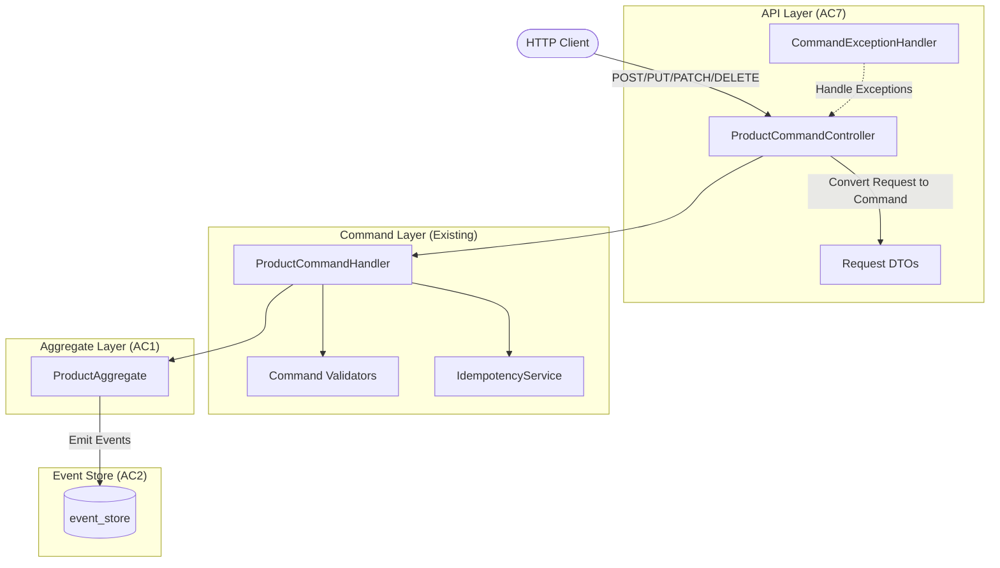
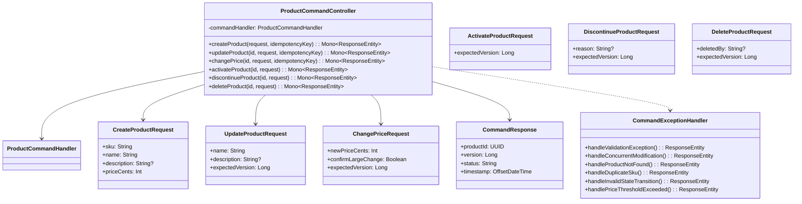
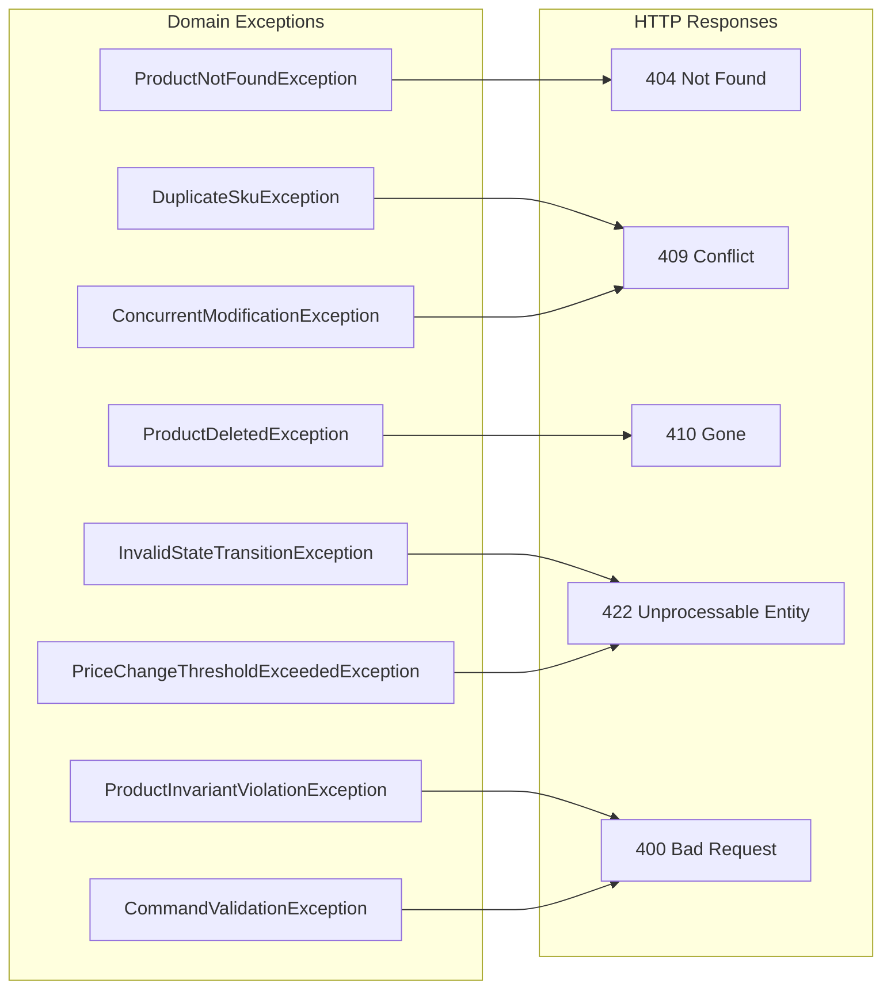

# Implementation Plan: AC7 - Product REST API (Commands)

**Feature:** Product Catalog (CQRS Architecture)
**Acceptance Criteria:** AC7 - Product REST API (Commands)
**Status:** Planning

---

## Overview

This implementation plan details the creation of the **Product Command Controller**, which exposes REST endpoints for executing product commands (create, update, delete, etc.). The command controller provides the HTTP interface for clients to modify product state through the CQRS command pipeline.

The existing codebase already includes:
- `ProductCommandHandler` with handlers for all command types
- Command DTOs (`CreateProductCommand`, `UpdateProductCommand`, etc.)
- `ProductAggregate` with business rule enforcement
- Domain exceptions for error cases
- Command validators for input validation
- `IdempotencyService` for duplicate request handling
- Resiliency patterns (circuit breaker, retry, rate limiter)

This plan focuses on creating the **REST controller layer** that accepts HTTP requests, converts them to commands, delegates to the command handler, and returns appropriate HTTP responses.

## Architecture



## Prerequisites

Before starting this implementation:

- [x] AC1 (Product Command Model) is complete - ProductAggregate exists
- [x] AC2 (Product Event Store) is complete - Events are persisted
- [x] AC3 (Command Handlers) is complete - ProductCommandHandler exists
- [x] Command validators exist for all command types
- [x] Domain exceptions are defined
- [x] IdempotencyService is implemented
- [x] Resiliency patterns are configured

## Acceptance Criteria Reference

From the feature specification:

> - `POST /api/products` creates a new product
> - `PUT /api/products/{id}` updates an existing product
> - `PATCH /api/products/{id}/price` updates product price
> - `POST /api/products/{id}/activate` activates a product
> - `POST /api/products/{id}/discontinue` discontinues a product
> - `DELETE /api/products/{id}` soft-deletes a product
> - All endpoints use DTOs for request/response (never expose domain entities)
> - All endpoints include OpenAPI/Swagger documentation
> - All endpoints return appropriate HTTP status codes (201, 200, 204, 400, 404, 409)
> - Validation errors return structured error responses

---

## High-Level Component Design



---

## Endpoint Design

| Method | Endpoint | Description | Request Body | Success Code |
|--------|----------|-------------|--------------|--------------|
| `POST` | `/api/products` | Create new product | `CreateProductRequest` | 201 Created |
| `PUT` | `/api/products/{id}` | Update product details | `UpdateProductRequest` | 200 OK |
| `PATCH` | `/api/products/{id}/price` | Change product price | `ChangePriceRequest` | 200 OK |
| `POST` | `/api/products/{id}/activate` | Activate product | `ActivateProductRequest` | 200 OK |
| `POST` | `/api/products/{id}/discontinue` | Discontinue product | `DiscontinueProductRequest` | 200 OK |
| `DELETE` | `/api/products/{id}` | Soft-delete product | `DeleteProductRequest` (optional body) | 204 No Content |

### HTTP Status Codes

| Code | Description | When Used |
|------|-------------|-----------|
| 200 | OK | Successful update/action |
| 201 | Created | Successful product creation |
| 204 | No Content | Successful deletion |
| 400 | Bad Request | Validation errors, malformed request |
| 404 | Not Found | Product not found |
| 409 | Conflict | Concurrent modification, duplicate SKU |
| 410 | Gone | Operation on deleted product |
| 422 | Unprocessable Entity | Business rule violation (invalid state transition, price threshold) |
| 429 | Too Many Requests | Rate limit exceeded |
| 500 | Internal Server Error | Unexpected error |
| 503 | Service Unavailable | Circuit breaker open |

### Idempotency Support

All mutating endpoints support idempotency via the `Idempotency-Key` header:

```
POST /api/products
Idempotency-Key: 550e8400-e29b-41d4-a716-446655440000
Content-Type: application/json

{
  "sku": "WIDGET-001",
  "name": "Blue Widget",
  ...
}
```

If a request with the same idempotency key has already been processed:
- Return the original response
- Include `X-Idempotent-Replayed: true` header

---

## Request/Response DTOs

### Request DTOs

```kotlin
// CreateProductRequest
data class CreateProductRequest(
    @field:NotBlank(message = "SKU is required")
    @field:Size(min = 3, max = 50, message = "SKU must be 3-50 characters")
    @field:Pattern(regexp = "^[A-Za-z0-9-]+$", message = "SKU must be alphanumeric with hyphens only")
    val sku: String,

    @field:NotBlank(message = "Name is required")
    @field:Size(min = 1, max = 255, message = "Name must be 1-255 characters")
    val name: String,

    @field:Size(max = 5000, message = "Description must not exceed 5000 characters")
    val description: String? = null,

    @field:Positive(message = "Price must be positive")
    val priceCents: Int
)

// UpdateProductRequest
data class UpdateProductRequest(
    @field:NotBlank(message = "Name is required")
    @field:Size(min = 1, max = 255, message = "Name must be 1-255 characters")
    val name: String,

    @field:Size(max = 5000, message = "Description must not exceed 5000 characters")
    val description: String? = null,

    @field:Min(0, message = "Expected version must be non-negative")
    val expectedVersion: Long
)

// ChangePriceRequest
data class ChangePriceRequest(
    @field:Positive(message = "Price must be positive")
    val newPriceCents: Int,

    val confirmLargeChange: Boolean = false,

    @field:Min(0, message = "Expected version must be non-negative")
    val expectedVersion: Long
)

// ActivateProductRequest
data class ActivateProductRequest(
    @field:Min(0, message = "Expected version must be non-negative")
    val expectedVersion: Long
)

// DiscontinueProductRequest
data class DiscontinueProductRequest(
    @field:Size(max = 500, message = "Reason must not exceed 500 characters")
    val reason: String? = null,

    @field:Min(0, message = "Expected version must be non-negative")
    val expectedVersion: Long
)

// DeleteProductRequest (optional - can use query params instead)
data class DeleteProductRequest(
    @field:Size(max = 100, message = "DeletedBy must not exceed 100 characters")
    val deletedBy: String? = null,

    @field:Min(0, message = "Expected version must be non-negative")
    val expectedVersion: Long
)
```

### Response DTOs

```kotlin
// CommandResponse - Standard success response
data class CommandResponse(
    val productId: UUID,
    val version: Long,
    val status: String,
    val timestamp: OffsetDateTime = OffsetDateTime.now()
)

// CreateProductResponse - Extended response for creation
data class CreateProductResponse(
    val productId: UUID,
    val sku: String,
    val version: Long,
    val status: String,
    val timestamp: OffsetDateTime = OffsetDateTime.now(),
    val links: ProductLinks? = null
)

// ProductLinks - HATEOAS links
data class ProductLinks(
    val self: String,
    val update: String,
    val activate: String?,
    val discontinue: String?,
    val delete: String
)

// CommandErrorResponse - Error response with details
data class CommandErrorResponse(
    val status: Int,
    val error: String,
    val message: String,
    val path: String,
    val timestamp: OffsetDateTime = OffsetDateTime.now(),
    val code: String? = null,  // Machine-readable error code
    val details: Any? = null   // Additional error details
)

// ValidationErrorResponse - Detailed validation errors
data class ValidationErrorResponse(
    val status: Int,
    val error: String,
    val message: String,
    val path: String,
    val timestamp: OffsetDateTime = OffsetDateTime.now(),
    val errors: List<FieldError>
)

data class FieldError(
    val field: String,
    val message: String,
    val code: String,
    val rejectedValue: Any? = null
)

// ConflictErrorResponse - For 409 responses
data class ConflictErrorResponse(
    val status: Int = 409,
    val error: String = "Conflict",
    val message: String,
    val path: String,
    val timestamp: OffsetDateTime = OffsetDateTime.now(),
    val currentVersion: Long? = null,
    val expectedVersion: Long? = null
)

// PriceChangeErrorResponse - For price threshold errors
data class PriceChangeErrorResponse(
    val status: Int = 422,
    val error: String = "Unprocessable Entity",
    val message: String,
    val path: String,
    val timestamp: OffsetDateTime = OffsetDateTime.now(),
    val currentPrice: Int,
    val requestedPrice: Int,
    val changePercentage: Double,
    val threshold: Double,
    val confirmationRequired: Boolean = true
)
```

---

## Exception to HTTP Status Mapping



| Exception | HTTP Status | Error Code |
|-----------|-------------|------------|
| `ProductNotFoundException` | 404 Not Found | `PRODUCT_NOT_FOUND` |
| `DuplicateSkuException` | 409 Conflict | `DUPLICATE_SKU` |
| `ConcurrentModificationException` | 409 Conflict | `CONCURRENT_MODIFICATION` |
| `InvalidStateTransitionException` | 422 Unprocessable Entity | `INVALID_STATE_TRANSITION` |
| `ProductInvariantViolationException` | 400 Bad Request | `INVARIANT_VIOLATION` |
| `ProductDeletedException` | 410 Gone | `PRODUCT_DELETED` |
| `PriceChangeThresholdExceededException` | 422 Unprocessable Entity | `PRICE_CHANGE_THRESHOLD_EXCEEDED` |
| `CommandValidationException` | 400 Bad Request | `VALIDATION_FAILED` |
| `RequestNotPermitted` (rate limit) | 429 Too Many Requests | `RATE_LIMIT_EXCEEDED` |
| `CallNotPermittedException` (circuit breaker) | 503 Service Unavailable | `SERVICE_UNAVAILABLE` |

---

## Implementation Steps

### Step 1: Create Command Request DTOs

**Objective:** Create request DTOs with Jakarta Bean Validation annotations.

#### 1.1 Create Request DTOs

**File:** `src/main/kotlin/com/pintailconsultingllc/cqrsspike/product/api/dto/CommandRequests.kt`

```kotlin
package com.pintailconsultingllc.cqrsspike.product.api.dto

import jakarta.validation.constraints.*

/**
 * Request DTO for creating a new product.
 */
data class CreateProductRequest(
    @field:NotBlank(message = "SKU is required")
    @field:Size(min = 3, max = 50, message = "SKU must be 3-50 characters")
    @field:Pattern(
        regexp = "^[A-Za-z0-9-]+$",
        message = "SKU must contain only alphanumeric characters and hyphens"
    )
    val sku: String,

    @field:NotBlank(message = "Name is required")
    @field:Size(min = 1, max = 255, message = "Name must be 1-255 characters")
    val name: String,

    @field:Size(max = 5000, message = "Description must not exceed 5000 characters")
    val description: String? = null,

    @field:Positive(message = "Price must be a positive integer (cents)")
    val priceCents: Int
)

/**
 * Request DTO for updating product details.
 */
data class UpdateProductRequest(
    @field:NotBlank(message = "Name is required")
    @field:Size(min = 1, max = 255, message = "Name must be 1-255 characters")
    val name: String,

    @field:Size(max = 5000, message = "Description must not exceed 5000 characters")
    val description: String? = null,

    @field:Min(value = 0, message = "Expected version must be non-negative")
    val expectedVersion: Long
)

/**
 * Request DTO for changing product price.
 */
data class ChangePriceRequest(
    @field:Positive(message = "Price must be a positive integer (cents)")
    val newPriceCents: Int,

    val confirmLargeChange: Boolean = false,

    @field:Min(value = 0, message = "Expected version must be non-negative")
    val expectedVersion: Long
)

/**
 * Request DTO for activating a product.
 */
data class ActivateProductRequest(
    @field:Min(value = 0, message = "Expected version must be non-negative")
    val expectedVersion: Long
)

/**
 * Request DTO for discontinuing a product.
 */
data class DiscontinueProductRequest(
    @field:Size(max = 500, message = "Reason must not exceed 500 characters")
    val reason: String? = null,

    @field:Min(value = 0, message = "Expected version must be non-negative")
    val expectedVersion: Long
)

/**
 * Request DTO for deleting a product.
 */
data class DeleteProductRequest(
    @field:Size(max = 100, message = "DeletedBy must not exceed 100 characters")
    val deletedBy: String? = null,

    @field:Min(value = 0, message = "Expected version must be non-negative")
    val expectedVersion: Long
)
```

#### 1.2 Create Response DTOs

**File:** `src/main/kotlin/com/pintailconsultingllc/cqrsspike/product/api/dto/CommandResponses.kt`

```kotlin
package com.pintailconsultingllc.cqrsspike.product.api.dto

import java.time.OffsetDateTime
import java.util.UUID

/**
 * Standard response for successful commands.
 */
data class CommandResponse(
    val productId: UUID,
    val version: Long,
    val status: String,
    val timestamp: OffsetDateTime = OffsetDateTime.now()
)

/**
 * Extended response for product creation.
 */
data class CreateProductResponse(
    val productId: UUID,
    val sku: String,
    val version: Long,
    val status: String,
    val timestamp: OffsetDateTime = OffsetDateTime.now(),
    val links: ProductLinks? = null
)

/**
 * HATEOAS links for product resources.
 */
data class ProductLinks(
    val self: String,
    val update: String,
    val activate: String?,
    val discontinue: String?,
    val delete: String
)

/**
 * Error response for command failures.
 */
data class CommandErrorResponse(
    val status: Int,
    val error: String,
    val message: String,
    val path: String,
    val timestamp: OffsetDateTime = OffsetDateTime.now(),
    val code: String? = null,
    val details: Any? = null
)

/**
 * Error response for concurrent modification conflicts.
 */
data class ConflictErrorResponse(
    val status: Int = 409,
    val error: String = "Conflict",
    val message: String,
    val path: String,
    val timestamp: OffsetDateTime = OffsetDateTime.now(),
    val currentVersion: Long? = null,
    val expectedVersion: Long? = null,
    val code: String = "CONCURRENT_MODIFICATION"
)

/**
 * Error response for price change threshold exceeded.
 */
data class PriceChangeErrorResponse(
    val status: Int = 422,
    val error: String = "Unprocessable Entity",
    val message: String,
    val path: String,
    val timestamp: OffsetDateTime = OffsetDateTime.now(),
    val currentPrice: Int,
    val requestedPrice: Int,
    val changePercentage: Double,
    val threshold: Double,
    val confirmationRequired: Boolean = true,
    val code: String = "PRICE_CHANGE_THRESHOLD_EXCEEDED"
)
```

---

### Step 2: Create Command Exception Handler

**Objective:** Create an exception handler that translates domain exceptions to HTTP responses.

**File:** `src/main/kotlin/com/pintailconsultingllc/cqrsspike/product/api/CommandExceptionHandler.kt`

```kotlin
package com.pintailconsultingllc.cqrsspike.product.api

import com.pintailconsultingllc.cqrsspike.product.api.dto.CommandErrorResponse
import com.pintailconsultingllc.cqrsspike.product.api.dto.ConflictErrorResponse
import com.pintailconsultingllc.cqrsspike.product.api.dto.PriceChangeErrorResponse
import com.pintailconsultingllc.cqrsspike.product.api.dto.ValidationError
import com.pintailconsultingllc.cqrsspike.product.command.exception.*
import io.github.resilience4j.circuitbreaker.CallNotPermittedException
import io.github.resilience4j.ratelimiter.RequestNotPermitted
import jakarta.validation.ConstraintViolationException
import org.slf4j.LoggerFactory
import org.springframework.http.HttpStatus
import org.springframework.http.ResponseEntity
import org.springframework.web.bind.annotation.ExceptionHandler
import org.springframework.web.bind.annotation.RestControllerAdvice
import org.springframework.web.bind.support.WebExchangeBindException
import org.springframework.web.server.ServerWebExchange
import reactor.core.publisher.Mono

/**
 * Exception handler for Product Command endpoints.
 *
 * Translates domain exceptions to appropriate HTTP responses
 * with structured error payloads.
 */
@RestControllerAdvice(basePackageClasses = [ProductCommandController::class])
class CommandExceptionHandler {

    private val logger = LoggerFactory.getLogger(CommandExceptionHandler::class.java)

    /**
     * Handle validation errors from @Valid annotations.
     */
    @ExceptionHandler(WebExchangeBindException::class)
    fun handleValidationError(
        ex: WebExchangeBindException,
        exchange: ServerWebExchange
    ): Mono<ResponseEntity<ApiErrorResponse>> {
        logger.warn("Validation error: {}", ex.message)

        val errors = ex.bindingResult.fieldErrors.map { fieldError ->
            ValidationError(
                field = fieldError.field,
                message = fieldError.defaultMessage ?: "Invalid value",
                rejectedValue = fieldError.rejectedValue
            )
        }

        val response = ApiErrorResponse(
            status = HttpStatus.BAD_REQUEST.value(),
            error = HttpStatus.BAD_REQUEST.reasonPhrase,
            message = "Validation failed",
            path = exchange.request.path.value(),
            details = errors
        )

        return Mono.just(ResponseEntity.badRequest().body(response))
    }

    /**
     * Handle command validation exceptions.
     */
    @ExceptionHandler(CommandValidationException::class)
    fun handleCommandValidation(
        ex: CommandValidationException,
        exchange: ServerWebExchange
    ): Mono<ResponseEntity<CommandErrorResponse>> {
        logger.warn("Command validation failed: {}", ex.message)

        val response = CommandErrorResponse(
            status = HttpStatus.BAD_REQUEST.value(),
            error = HttpStatus.BAD_REQUEST.reasonPhrase,
            message = "Command validation failed",
            path = exchange.request.path.value(),
            code = "VALIDATION_FAILED",
            details = ex.errors
        )

        return Mono.just(ResponseEntity.badRequest().body(response))
    }

    /**
     * Handle product not found.
     */
    @ExceptionHandler(ProductNotFoundException::class)
    fun handleProductNotFound(
        ex: ProductNotFoundException,
        exchange: ServerWebExchange
    ): Mono<ResponseEntity<CommandErrorResponse>> {
        logger.warn("Product not found: {}", ex.productId)

        val response = CommandErrorResponse(
            status = HttpStatus.NOT_FOUND.value(),
            error = HttpStatus.NOT_FOUND.reasonPhrase,
            message = ex.message ?: "Product not found",
            path = exchange.request.path.value(),
            code = "PRODUCT_NOT_FOUND"
        )

        return Mono.just(ResponseEntity.status(HttpStatus.NOT_FOUND).body(response))
    }

    /**
     * Handle duplicate SKU.
     */
    @ExceptionHandler(DuplicateSkuException::class)
    fun handleDuplicateSku(
        ex: DuplicateSkuException,
        exchange: ServerWebExchange
    ): Mono<ResponseEntity<CommandErrorResponse>> {
        logger.warn("Duplicate SKU: {}", ex.sku)

        val response = CommandErrorResponse(
            status = HttpStatus.CONFLICT.value(),
            error = HttpStatus.CONFLICT.reasonPhrase,
            message = ex.message ?: "SKU already exists",
            path = exchange.request.path.value(),
            code = "DUPLICATE_SKU",
            details = mapOf("sku" to ex.sku)
        )

        return Mono.just(ResponseEntity.status(HttpStatus.CONFLICT).body(response))
    }

    /**
     * Handle concurrent modification.
     */
    @ExceptionHandler(ConcurrentModificationException::class)
    fun handleConcurrentModification(
        ex: ConcurrentModificationException,
        exchange: ServerWebExchange
    ): Mono<ResponseEntity<ConflictErrorResponse>> {
        logger.warn("Concurrent modification for product {}: expected {}, actual {}",
            ex.productId, ex.expectedVersion, ex.actualVersion)

        val response = ConflictErrorResponse(
            message = ex.message ?: "Concurrent modification detected",
            path = exchange.request.path.value(),
            currentVersion = ex.actualVersion,
            expectedVersion = ex.expectedVersion
        )

        return Mono.just(ResponseEntity.status(HttpStatus.CONFLICT).body(response))
    }

    /**
     * Handle invalid state transition.
     */
    @ExceptionHandler(InvalidStateTransitionException::class)
    fun handleInvalidStateTransition(
        ex: InvalidStateTransitionException,
        exchange: ServerWebExchange
    ): Mono<ResponseEntity<CommandErrorResponse>> {
        logger.warn("Invalid state transition for product {}: {} -> {}",
            ex.productId, ex.currentStatus, ex.targetStatus)

        val response = CommandErrorResponse(
            status = HttpStatus.UNPROCESSABLE_ENTITY.value(),
            error = "Unprocessable Entity",
            message = ex.message ?: "Invalid state transition",
            path = exchange.request.path.value(),
            code = "INVALID_STATE_TRANSITION",
            details = mapOf(
                "currentStatus" to ex.currentStatus,
                "targetStatus" to ex.targetStatus
            )
        )

        return Mono.just(ResponseEntity.status(HttpStatus.UNPROCESSABLE_ENTITY).body(response))
    }

    /**
     * Handle product deleted.
     */
    @ExceptionHandler(ProductDeletedException::class)
    fun handleProductDeleted(
        ex: ProductDeletedException,
        exchange: ServerWebExchange
    ): Mono<ResponseEntity<CommandErrorResponse>> {
        logger.warn("Operation attempted on deleted product: {}", ex.productId)

        val response = CommandErrorResponse(
            status = HttpStatus.GONE.value(),
            error = "Gone",
            message = ex.message ?: "Product has been deleted",
            path = exchange.request.path.value(),
            code = "PRODUCT_DELETED"
        )

        return Mono.just(ResponseEntity.status(HttpStatus.GONE).body(response))
    }

    /**
     * Handle price change threshold exceeded.
     */
    @ExceptionHandler(PriceChangeThresholdExceededException::class)
    fun handlePriceThresholdExceeded(
        ex: PriceChangeThresholdExceededException,
        exchange: ServerWebExchange
    ): Mono<ResponseEntity<PriceChangeErrorResponse>> {
        logger.warn("Price change threshold exceeded for product {}: {}% change",
            ex.productId, ex.changePercentage)

        val response = PriceChangeErrorResponse(
            message = ex.message ?: "Price change exceeds threshold",
            path = exchange.request.path.value(),
            currentPrice = ex.currentPrice,
            requestedPrice = ex.newPrice,
            changePercentage = ex.changePercentage,
            threshold = ex.threshold
        )

        return Mono.just(ResponseEntity.status(HttpStatus.UNPROCESSABLE_ENTITY).body(response))
    }

    /**
     * Handle product invariant violations.
     */
    @ExceptionHandler(ProductInvariantViolationException::class)
    fun handleInvariantViolation(
        ex: ProductInvariantViolationException,
        exchange: ServerWebExchange
    ): Mono<ResponseEntity<CommandErrorResponse>> {
        logger.warn("Invariant violation for product {}: {}", ex.productId, ex.invariant)

        val response = CommandErrorResponse(
            status = HttpStatus.BAD_REQUEST.value(),
            error = HttpStatus.BAD_REQUEST.reasonPhrase,
            message = ex.message ?: "Business rule violation",
            path = exchange.request.path.value(),
            code = "INVARIANT_VIOLATION",
            details = mapOf(
                "invariant" to ex.invariant,
                "details" to ex.details
            )
        )

        return Mono.just(ResponseEntity.badRequest().body(response))
    }

    /**
     * Handle rate limit exceeded.
     */
    @ExceptionHandler(RequestNotPermitted::class)
    fun handleRateLimitExceeded(
        ex: RequestNotPermitted,
        exchange: ServerWebExchange
    ): Mono<ResponseEntity<CommandErrorResponse>> {
        logger.warn("Rate limit exceeded: {}", ex.message)

        val response = CommandErrorResponse(
            status = HttpStatus.TOO_MANY_REQUESTS.value(),
            error = "Too Many Requests",
            message = "Rate limit exceeded. Please retry later.",
            path = exchange.request.path.value(),
            code = "RATE_LIMIT_EXCEEDED"
        )

        return Mono.just(ResponseEntity.status(HttpStatus.TOO_MANY_REQUESTS).body(response))
    }

    /**
     * Handle circuit breaker open.
     */
    @ExceptionHandler(CallNotPermittedException::class)
    fun handleCircuitBreakerOpen(
        ex: CallNotPermittedException,
        exchange: ServerWebExchange
    ): Mono<ResponseEntity<CommandErrorResponse>> {
        logger.error("Circuit breaker open: {}", ex.message)

        val response = CommandErrorResponse(
            status = HttpStatus.SERVICE_UNAVAILABLE.value(),
            error = "Service Unavailable",
            message = "Service temporarily unavailable. Please retry later.",
            path = exchange.request.path.value(),
            code = "SERVICE_UNAVAILABLE"
        )

        return Mono.just(ResponseEntity.status(HttpStatus.SERVICE_UNAVAILABLE).body(response))
    }

    /**
     * Handle all other exceptions.
     */
    @ExceptionHandler(Exception::class)
    fun handleGenericException(
        ex: Exception,
        exchange: ServerWebExchange
    ): Mono<ResponseEntity<CommandErrorResponse>> {
        logger.error("Unexpected error in command endpoint: {}", ex.message, ex)

        val response = CommandErrorResponse(
            status = HttpStatus.INTERNAL_SERVER_ERROR.value(),
            error = HttpStatus.INTERNAL_SERVER_ERROR.reasonPhrase,
            message = "An unexpected error occurred",
            path = exchange.request.path.value(),
            code = "INTERNAL_ERROR"
        )

        return Mono.just(ResponseEntity.status(HttpStatus.INTERNAL_SERVER_ERROR).body(response))
    }
}
```

---

### Step 3: Create Product Command Controller

**Objective:** Create the REST controller that handles command requests.

**File:** `src/main/kotlin/com/pintailconsultingllc/cqrsspike/product/api/ProductCommandController.kt`

```kotlin
package com.pintailconsultingllc.cqrsspike.product.api

import com.pintailconsultingllc.cqrsspike.product.api.dto.*
import com.pintailconsultingllc.cqrsspike.product.command.handler.ProductCommandHandler
import com.pintailconsultingllc.cqrsspike.product.command.model.*
import io.swagger.v3.oas.annotations.Operation
import io.swagger.v3.oas.annotations.Parameter
import io.swagger.v3.oas.annotations.headers.Header
import io.swagger.v3.oas.annotations.media.Content
import io.swagger.v3.oas.annotations.media.Schema
import io.swagger.v3.oas.annotations.responses.ApiResponse
import io.swagger.v3.oas.annotations.responses.ApiResponses
import io.swagger.v3.oas.annotations.tags.Tag
import jakarta.validation.Valid
import org.slf4j.LoggerFactory
import org.springframework.http.HttpStatus
import org.springframework.http.ResponseEntity
import org.springframework.validation.annotation.Validated
import org.springframework.web.bind.annotation.*
import reactor.core.publisher.Mono
import java.net.URI
import java.util.UUID

/**
 * REST controller for Product command operations.
 *
 * Provides endpoints for creating, updating, and managing products
 * through the CQRS command pipeline.
 */
@RestController
@RequestMapping("/api/products")
@Validated
@Tag(name = "Product Commands", description = "Endpoints for product command operations")
class ProductCommandController(
    private val commandHandler: ProductCommandHandler
) {
    private val logger = LoggerFactory.getLogger(ProductCommandController::class.java)

    companion object {
        const val IDEMPOTENCY_KEY_HEADER = "Idempotency-Key"
        const val IDEMPOTENT_REPLAYED_HEADER = "X-Idempotent-Replayed"
    }

    /**
     * Create a new product.
     */
    @PostMapping
    @Operation(
        summary = "Create a new product",
        description = "Creates a new product in DRAFT status"
    )
    @ApiResponses(
        ApiResponse(
            responseCode = "201",
            description = "Product created successfully",
            headers = [Header(name = "Location", description = "URL of created product")]
        ),
        ApiResponse(responseCode = "400", description = "Validation error"),
        ApiResponse(responseCode = "409", description = "SKU already exists")
    )
    fun createProduct(
        @Valid @RequestBody request: CreateProductRequest,
        @RequestHeader(IDEMPOTENCY_KEY_HEADER, required = false) idempotencyKey: String?
    ): Mono<ResponseEntity<CreateProductResponse>> {
        logger.info("POST /api/products - Creating product with SKU: {}", request.sku)

        val command = CreateProductCommand(
            sku = request.sku.trim(),
            name = request.name.trim(),
            description = request.description?.trim(),
            priceCents = request.priceCents,
            idempotencyKey = idempotencyKey
        )

        return commandHandler.handle(command)
            .map { result ->
                when (result) {
                    is CommandSuccess -> {
                        val response = CreateProductResponse(
                            productId = result.productId,
                            sku = request.sku,
                            version = result.version,
                            status = "DRAFT",
                            links = buildProductLinks(result.productId, "DRAFT")
                        )
                        ResponseEntity
                            .created(URI.create("/api/products/${result.productId}"))
                            .body(response)
                    }
                    is CommandAlreadyProcessed -> {
                        val response = CreateProductResponse(
                            productId = result.productId,
                            sku = request.sku,
                            version = result.version,
                            status = result.status ?: "DRAFT"
                        )
                        ResponseEntity
                            .status(HttpStatus.CREATED)
                            .header(IDEMPOTENT_REPLAYED_HEADER, "true")
                            .body(response)
                    }
                    else -> ResponseEntity.status(HttpStatus.INTERNAL_SERVER_ERROR).build()
                }
            }
    }

    /**
     * Update an existing product.
     */
    @PutMapping("/{id}")
    @Operation(
        summary = "Update product details",
        description = "Updates name and description of an existing product"
    )
    @ApiResponses(
        ApiResponse(responseCode = "200", description = "Product updated successfully"),
        ApiResponse(responseCode = "400", description = "Validation error"),
        ApiResponse(responseCode = "404", description = "Product not found"),
        ApiResponse(responseCode = "409", description = "Concurrent modification")
    )
    fun updateProduct(
        @PathVariable id: UUID,
        @Valid @RequestBody request: UpdateProductRequest,
        @RequestHeader(IDEMPOTENCY_KEY_HEADER, required = false) idempotencyKey: String?
    ): Mono<ResponseEntity<CommandResponse>> {
        logger.info("PUT /api/products/{} - Updating product", id)

        val command = UpdateProductCommand(
            productId = id,
            expectedVersion = request.expectedVersion,
            name = request.name.trim(),
            description = request.description?.trim(),
            idempotencyKey = idempotencyKey
        )

        return commandHandler.handle(command)
            .map { result -> buildCommandResponse(result, id) }
    }

    /**
     * Change product price.
     */
    @PatchMapping("/{id}/price")
    @Operation(
        summary = "Change product price",
        description = "Updates the price of a product. Large changes (>20%) for ACTIVE products require confirmation."
    )
    @ApiResponses(
        ApiResponse(responseCode = "200", description = "Price changed successfully"),
        ApiResponse(responseCode = "400", description = "Validation error"),
        ApiResponse(responseCode = "404", description = "Product not found"),
        ApiResponse(responseCode = "409", description = "Concurrent modification"),
        ApiResponse(responseCode = "422", description = "Price change exceeds threshold without confirmation")
    )
    fun changePrice(
        @PathVariable id: UUID,
        @Valid @RequestBody request: ChangePriceRequest,
        @RequestHeader(IDEMPOTENCY_KEY_HEADER, required = false) idempotencyKey: String?
    ): Mono<ResponseEntity<CommandResponse>> {
        logger.info("PATCH /api/products/{}/price - Changing price to {} cents", id, request.newPriceCents)

        val command = ChangePriceCommand(
            productId = id,
            expectedVersion = request.expectedVersion,
            newPriceCents = request.newPriceCents,
            confirmLargeChange = request.confirmLargeChange,
            idempotencyKey = idempotencyKey
        )

        return commandHandler.handle(command)
            .map { result -> buildCommandResponse(result, id) }
    }

    /**
     * Activate a product.
     */
    @PostMapping("/{id}/activate")
    @Operation(
        summary = "Activate a product",
        description = "Transitions a DRAFT product to ACTIVE status"
    )
    @ApiResponses(
        ApiResponse(responseCode = "200", description = "Product activated successfully"),
        ApiResponse(responseCode = "404", description = "Product not found"),
        ApiResponse(responseCode = "409", description = "Concurrent modification"),
        ApiResponse(responseCode = "422", description = "Invalid state transition")
    )
    fun activateProduct(
        @PathVariable id: UUID,
        @Valid @RequestBody request: ActivateProductRequest,
        @RequestHeader(IDEMPOTENCY_KEY_HEADER, required = false) idempotencyKey: String?
    ): Mono<ResponseEntity<CommandResponse>> {
        logger.info("POST /api/products/{}/activate - Activating product", id)

        val command = ActivateProductCommand(
            productId = id,
            expectedVersion = request.expectedVersion,
            idempotencyKey = idempotencyKey
        )

        return commandHandler.handle(command)
            .map { result -> buildCommandResponse(result, id, "ACTIVE") }
    }

    /**
     * Discontinue a product.
     */
    @PostMapping("/{id}/discontinue")
    @Operation(
        summary = "Discontinue a product",
        description = "Transitions a product to DISCONTINUED status"
    )
    @ApiResponses(
        ApiResponse(responseCode = "200", description = "Product discontinued successfully"),
        ApiResponse(responseCode = "404", description = "Product not found"),
        ApiResponse(responseCode = "409", description = "Concurrent modification"),
        ApiResponse(responseCode = "422", description = "Invalid state transition")
    )
    fun discontinueProduct(
        @PathVariable id: UUID,
        @Valid @RequestBody request: DiscontinueProductRequest,
        @RequestHeader(IDEMPOTENCY_KEY_HEADER, required = false) idempotencyKey: String?
    ): Mono<ResponseEntity<CommandResponse>> {
        logger.info("POST /api/products/{}/discontinue - Discontinuing product", id)

        val command = DiscontinueProductCommand(
            productId = id,
            expectedVersion = request.expectedVersion,
            reason = request.reason?.trim(),
            idempotencyKey = idempotencyKey
        )

        return commandHandler.handle(command)
            .map { result -> buildCommandResponse(result, id, "DISCONTINUED") }
    }

    /**
     * Delete a product (soft delete).
     */
    @DeleteMapping("/{id}")
    @Operation(
        summary = "Delete a product",
        description = "Soft-deletes a product"
    )
    @ApiResponses(
        ApiResponse(responseCode = "204", description = "Product deleted successfully"),
        ApiResponse(responseCode = "404", description = "Product not found"),
        ApiResponse(responseCode = "409", description = "Concurrent modification"),
        ApiResponse(responseCode = "410", description = "Product already deleted")
    )
    fun deleteProduct(
        @PathVariable id: UUID,
        @RequestParam(required = false) expectedVersion: Long?,
        @RequestParam(required = false) deletedBy: String?,
        @RequestHeader(IDEMPOTENCY_KEY_HEADER, required = false) idempotencyKey: String?
    ): Mono<ResponseEntity<Void>> {
        logger.info("DELETE /api/products/{} - Deleting product", id)

        // If expectedVersion not provided, we need to fetch current version
        // For simplicity, require expectedVersion as query param
        val version = expectedVersion ?: return Mono.just(
            ResponseEntity.badRequest().build()
        )

        val command = DeleteProductCommand(
            productId = id,
            expectedVersion = version,
            deletedBy = deletedBy?.trim(),
            idempotencyKey = idempotencyKey
        )

        return commandHandler.handle(command)
            .map { result ->
                when (result) {
                    is CommandSuccess, is CommandAlreadyProcessed ->
                        ResponseEntity.noContent().build()
                    else ->
                        ResponseEntity.status(HttpStatus.INTERNAL_SERVER_ERROR).build()
                }
            }
    }

    // ============ Helper Methods ============

    private fun buildCommandResponse(
        result: CommandResult,
        productId: UUID,
        status: String? = null
    ): ResponseEntity<CommandResponse> {
        return when (result) {
            is CommandSuccess -> {
                val response = CommandResponse(
                    productId = result.productId,
                    version = result.version,
                    status = status ?: result.status ?: "UNKNOWN"
                )
                ResponseEntity.ok(response)
            }
            is CommandAlreadyProcessed -> {
                val response = CommandResponse(
                    productId = result.productId,
                    version = result.version,
                    status = status ?: result.status ?: "UNKNOWN"
                )
                ResponseEntity.ok()
                    .header(IDEMPOTENT_REPLAYED_HEADER, "true")
                    .body(response)
            }
            else -> ResponseEntity.status(HttpStatus.INTERNAL_SERVER_ERROR).build()
        }
    }

    private fun buildProductLinks(productId: UUID, status: String): ProductLinks {
        val baseUrl = "/api/products/$productId"
        return ProductLinks(
            self = baseUrl,
            update = baseUrl,
            activate = if (status == "DRAFT") "$baseUrl/activate" else null,
            discontinue = if (status in listOf("DRAFT", "ACTIVE")) "$baseUrl/discontinue" else null,
            delete = baseUrl
        )
    }
}
```

---

### Step 4: Update OpenAPI Configuration

**Objective:** Enhance OpenAPI configuration to document command endpoints.

**File:** Update `src/main/kotlin/com/pintailconsultingllc/cqrsspike/config/OpenApiConfig.kt`

Add to the existing configuration:

```kotlin
@Bean
fun customOpenAPI(): OpenAPI {
    return OpenAPI()
        .info(
            Info()
                .title("Product Catalog API")
                .description("""
                    Product Catalog REST API built with CQRS architecture.

                    This API provides:
                    - **Command endpoints** for creating and modifying products
                    - **Query endpoints** for retrieving products

                    ## Command Side (Write Model)
                    Command endpoints modify product state and return the new version.
                    All commands support idempotency via the `Idempotency-Key` header.

                    ## Query Side (Read Model)
                    Query endpoints operate on the read model which is eventually
                    consistent with the command model through event projections.

                    ## Optimistic Concurrency
                    Update operations require an `expectedVersion` to prevent
                    concurrent modification conflicts.
                """.trimIndent())
                .version("1.0.0")
                .contact(Contact()
                    .name("Pintail Consulting LLC")
                    .url("https://pintailconsultingllc.com"))
        )
        .servers(listOf(
            Server().url("/").description("Default Server")
        ))
        .components(Components()
            .addSecuritySchemes("idempotencyKey", SecurityScheme()
                .type(SecurityScheme.Type.APIKEY)
                .`in`(SecurityScheme.In.HEADER)
                .name("Idempotency-Key")
                .description("Optional idempotency key for command requests"))
        )
}
```

---

### Step 5: Create Unit Tests

**Objective:** Create comprehensive unit tests for ProductCommandController.

**File:** `src/test/kotlin/com/pintailconsultingllc/cqrsspike/product/api/ProductCommandControllerTest.kt`

```kotlin
package com.pintailconsultingllc.cqrsspike.product.api

import com.pintailconsultingllc.cqrsspike.product.api.dto.*
import com.pintailconsultingllc.cqrsspike.product.command.exception.*
import com.pintailconsultingllc.cqrsspike.product.command.handler.ProductCommandHandler
import com.pintailconsultingllc.cqrsspike.product.command.model.*
import org.junit.jupiter.api.DisplayName
import org.junit.jupiter.api.Nested
import org.junit.jupiter.api.Test
import org.mockito.kotlin.*
import org.springframework.beans.factory.annotation.Autowired
import org.springframework.boot.webflux.test.autoconfigure.WebFluxTest
import org.springframework.http.MediaType
import org.springframework.test.context.bean.override.mockito.MockitoBean
import org.springframework.context.annotation.Import
import org.springframework.test.web.reactive.server.WebTestClient
import reactor.core.publisher.Mono
import java.time.OffsetDateTime
import java.util.UUID

@WebFluxTest(ProductCommandController::class)
@Import(CommandExceptionHandler::class)
@DisplayName("ProductCommandController")
class ProductCommandControllerTest {

    @Autowired
    private lateinit var webTestClient: WebTestClient

    @MockitoBean
    private lateinit var commandHandler: ProductCommandHandler

    @Nested
    @DisplayName("POST /api/products")
    inner class CreateProduct {

        @Test
        @DisplayName("should create product and return 201")
        fun shouldCreateProduct() {
            val productId = UUID.randomUUID()
            val result = CommandSuccess(productId, 1L, "DRAFT", OffsetDateTime.now())

            whenever(commandHandler.handle(any<CreateProductCommand>()))
                .thenReturn(Mono.just(result))

            webTestClient.post()
                .uri("/api/products")
                .contentType(MediaType.APPLICATION_JSON)
                .bodyValue("""
                    {
                        "sku": "TEST-001",
                        "name": "Test Product",
                        "description": "A test product",
                        "priceCents": 1999
                    }
                """.trimIndent())
                .exchange()
                .expectStatus().isCreated
                .expectHeader().exists("Location")
                .expectBody()
                .jsonPath("$.productId").isEqualTo(productId.toString())
                .jsonPath("$.version").isEqualTo(1)
                .jsonPath("$.status").isEqualTo("DRAFT")
        }

        @Test
        @DisplayName("should return 400 for invalid request")
        fun shouldReturn400ForInvalidRequest() {
            webTestClient.post()
                .uri("/api/products")
                .contentType(MediaType.APPLICATION_JSON)
                .bodyValue("""
                    {
                        "sku": "",
                        "name": "",
                        "priceCents": -100
                    }
                """.trimIndent())
                .exchange()
                .expectStatus().isBadRequest
        }

        @Test
        @DisplayName("should return 409 for duplicate SKU")
        fun shouldReturn409ForDuplicateSku() {
            whenever(commandHandler.handle(any<CreateProductCommand>()))
                .thenReturn(Mono.error(DuplicateSkuException("TEST-001")))

            webTestClient.post()
                .uri("/api/products")
                .contentType(MediaType.APPLICATION_JSON)
                .bodyValue("""
                    {
                        "sku": "TEST-001",
                        "name": "Test Product",
                        "priceCents": 1999
                    }
                """.trimIndent())
                .exchange()
                .expectStatus().isEqualTo(409)
                .expectBody()
                .jsonPath("$.code").isEqualTo("DUPLICATE_SKU")
        }

        @Test
        @DisplayName("should handle idempotent request")
        fun shouldHandleIdempotentRequest() {
            val productId = UUID.randomUUID()
            val result = CommandAlreadyProcessed(productId, 1L, "DRAFT", OffsetDateTime.now())

            whenever(commandHandler.handle(any<CreateProductCommand>()))
                .thenReturn(Mono.just(result))

            webTestClient.post()
                .uri("/api/products")
                .header("Idempotency-Key", "test-key-123")
                .contentType(MediaType.APPLICATION_JSON)
                .bodyValue("""
                    {
                        "sku": "TEST-001",
                        "name": "Test Product",
                        "priceCents": 1999
                    }
                """.trimIndent())
                .exchange()
                .expectStatus().isCreated
                .expectHeader().valueEquals("X-Idempotent-Replayed", "true")
        }
    }

    @Nested
    @DisplayName("PUT /api/products/{id}")
    inner class UpdateProduct {

        @Test
        @DisplayName("should update product and return 200")
        fun shouldUpdateProduct() {
            val productId = UUID.randomUUID()
            val result = CommandSuccess(productId, 2L, "DRAFT", OffsetDateTime.now())

            whenever(commandHandler.handle(any<UpdateProductCommand>()))
                .thenReturn(Mono.just(result))

            webTestClient.put()
                .uri("/api/products/$productId")
                .contentType(MediaType.APPLICATION_JSON)
                .bodyValue("""
                    {
                        "name": "Updated Product",
                        "description": "Updated description",
                        "expectedVersion": 1
                    }
                """.trimIndent())
                .exchange()
                .expectStatus().isOk
                .expectBody()
                .jsonPath("$.productId").isEqualTo(productId.toString())
                .jsonPath("$.version").isEqualTo(2)
        }

        @Test
        @DisplayName("should return 404 for non-existent product")
        fun shouldReturn404ForNonExistent() {
            val productId = UUID.randomUUID()

            whenever(commandHandler.handle(any<UpdateProductCommand>()))
                .thenReturn(Mono.error(ProductNotFoundException(productId)))

            webTestClient.put()
                .uri("/api/products/$productId")
                .contentType(MediaType.APPLICATION_JSON)
                .bodyValue("""
                    {
                        "name": "Updated Product",
                        "expectedVersion": 1
                    }
                """.trimIndent())
                .exchange()
                .expectStatus().isNotFound
                .expectBody()
                .jsonPath("$.code").isEqualTo("PRODUCT_NOT_FOUND")
        }

        @Test
        @DisplayName("should return 409 for concurrent modification")
        fun shouldReturn409ForConcurrentModification() {
            val productId = UUID.randomUUID()

            whenever(commandHandler.handle(any<UpdateProductCommand>()))
                .thenReturn(Mono.error(ConcurrentModificationException(productId, 1L, 3L)))

            webTestClient.put()
                .uri("/api/products/$productId")
                .contentType(MediaType.APPLICATION_JSON)
                .bodyValue("""
                    {
                        "name": "Updated Product",
                        "expectedVersion": 1
                    }
                """.trimIndent())
                .exchange()
                .expectStatus().isEqualTo(409)
                .expectBody()
                .jsonPath("$.expectedVersion").isEqualTo(1)
                .jsonPath("$.currentVersion").isEqualTo(3)
        }
    }

    @Nested
    @DisplayName("PATCH /api/products/{id}/price")
    inner class ChangePrice {

        @Test
        @DisplayName("should change price and return 200")
        fun shouldChangePrice() {
            val productId = UUID.randomUUID()
            val result = CommandSuccess(productId, 2L, "ACTIVE", OffsetDateTime.now())

            whenever(commandHandler.handle(any<ChangePriceCommand>()))
                .thenReturn(Mono.just(result))

            webTestClient.patch()
                .uri("/api/products/$productId/price")
                .contentType(MediaType.APPLICATION_JSON)
                .bodyValue("""
                    {
                        "newPriceCents": 2499,
                        "expectedVersion": 1
                    }
                """.trimIndent())
                .exchange()
                .expectStatus().isOk
        }

        @Test
        @DisplayName("should return 422 for price threshold exceeded")
        fun shouldReturn422ForPriceThresholdExceeded() {
            val productId = UUID.randomUUID()

            whenever(commandHandler.handle(any<ChangePriceCommand>()))
                .thenReturn(Mono.error(
                    PriceChangeThresholdExceededException(productId, 1000, 2000, 100.0, 20.0)
                ))

            webTestClient.patch()
                .uri("/api/products/$productId/price")
                .contentType(MediaType.APPLICATION_JSON)
                .bodyValue("""
                    {
                        "newPriceCents": 2000,
                        "expectedVersion": 1
                    }
                """.trimIndent())
                .exchange()
                .expectStatus().isEqualTo(422)
                .expectBody()
                .jsonPath("$.code").isEqualTo("PRICE_CHANGE_THRESHOLD_EXCEEDED")
                .jsonPath("$.confirmationRequired").isEqualTo(true)
        }
    }

    @Nested
    @DisplayName("POST /api/products/{id}/activate")
    inner class ActivateProduct {

        @Test
        @DisplayName("should activate product and return 200")
        fun shouldActivateProduct() {
            val productId = UUID.randomUUID()
            val result = CommandSuccess(productId, 2L, "ACTIVE", OffsetDateTime.now())

            whenever(commandHandler.handle(any<ActivateProductCommand>()))
                .thenReturn(Mono.just(result))

            webTestClient.post()
                .uri("/api/products/$productId/activate")
                .contentType(MediaType.APPLICATION_JSON)
                .bodyValue("""{"expectedVersion": 1}""")
                .exchange()
                .expectStatus().isOk
                .expectBody()
                .jsonPath("$.status").isEqualTo("ACTIVE")
        }

        @Test
        @DisplayName("should return 422 for invalid state transition")
        fun shouldReturn422ForInvalidTransition() {
            val productId = UUID.randomUUID()

            whenever(commandHandler.handle(any<ActivateProductCommand>()))
                .thenReturn(Mono.error(
                    InvalidStateTransitionException(productId, "DISCONTINUED", "ACTIVE")
                ))

            webTestClient.post()
                .uri("/api/products/$productId/activate")
                .contentType(MediaType.APPLICATION_JSON)
                .bodyValue("""{"expectedVersion": 1}""")
                .exchange()
                .expectStatus().isEqualTo(422)
                .expectBody()
                .jsonPath("$.code").isEqualTo("INVALID_STATE_TRANSITION")
        }
    }

    @Nested
    @DisplayName("POST /api/products/{id}/discontinue")
    inner class DiscontinueProduct {

        @Test
        @DisplayName("should discontinue product and return 200")
        fun shouldDiscontinueProduct() {
            val productId = UUID.randomUUID()
            val result = CommandSuccess(productId, 2L, "DISCONTINUED", OffsetDateTime.now())

            whenever(commandHandler.handle(any<DiscontinueProductCommand>()))
                .thenReturn(Mono.just(result))

            webTestClient.post()
                .uri("/api/products/$productId/discontinue")
                .contentType(MediaType.APPLICATION_JSON)
                .bodyValue("""
                    {
                        "reason": "Product end of life",
                        "expectedVersion": 1
                    }
                """.trimIndent())
                .exchange()
                .expectStatus().isOk
                .expectBody()
                .jsonPath("$.status").isEqualTo("DISCONTINUED")
        }
    }

    @Nested
    @DisplayName("DELETE /api/products/{id}")
    inner class DeleteProduct {

        @Test
        @DisplayName("should delete product and return 204")
        fun shouldDeleteProduct() {
            val productId = UUID.randomUUID()
            val result = CommandSuccess(productId, 2L, "DELETED", OffsetDateTime.now())

            whenever(commandHandler.handle(any<DeleteProductCommand>()))
                .thenReturn(Mono.just(result))

            webTestClient.delete()
                .uri("/api/products/$productId?expectedVersion=1")
                .exchange()
                .expectStatus().isNoContent
        }

        @Test
        @DisplayName("should return 410 for already deleted product")
        fun shouldReturn410ForDeletedProduct() {
            val productId = UUID.randomUUID()

            whenever(commandHandler.handle(any<DeleteProductCommand>()))
                .thenReturn(Mono.error(ProductDeletedException(productId)))

            webTestClient.delete()
                .uri("/api/products/$productId?expectedVersion=1")
                .exchange()
                .expectStatus().isEqualTo(410)
                .expectBody()
                .jsonPath("$.code").isEqualTo("PRODUCT_DELETED")
        }
    }
}
```

---

### Step 6: Create Integration Tests

**Objective:** Create integration tests that verify the full command flow.

**File:** `src/test/kotlin/com/pintailconsultingllc/cqrsspike/product/api/ProductCommandControllerIntegrationTest.kt`

```kotlin
package com.pintailconsultingllc.cqrsspike.product.api

import org.junit.jupiter.api.DisplayName
import org.junit.jupiter.api.Nested
import org.junit.jupiter.api.Test
import org.junit.jupiter.api.TestInstance
import org.springframework.beans.factory.annotation.Autowired
import org.springframework.boot.webtestclient.autoconfigure.AutoConfigureWebTestClient
import org.springframework.boot.test.context.SpringBootTest
import org.springframework.http.MediaType
import org.springframework.test.context.DynamicPropertyRegistry
import org.springframework.test.context.DynamicPropertySource
import org.springframework.test.web.reactive.server.WebTestClient
import org.testcontainers.containers.PostgreSQLContainer
import org.testcontainers.junit.jupiter.Container
import org.testcontainers.junit.jupiter.Testcontainers
import java.util.UUID

@SpringBootTest(webEnvironment = SpringBootTest.WebEnvironment.RANDOM_PORT)
@AutoConfigureWebTestClient
@Testcontainers(disabledWithoutDocker = true)
@TestInstance(TestInstance.Lifecycle.PER_CLASS)
@DisplayName("ProductCommandController Integration Tests")
class ProductCommandControllerIntegrationTest {

    companion object {
        @Container
        @JvmStatic
        val postgres = PostgreSQLContainer<Nothing>("postgres:15-alpine").apply {
            withDatabaseName("testdb")
            withUsername("test")
            withPassword("test")
        }

        @DynamicPropertySource
        @JvmStatic
        fun configureProperties(registry: DynamicPropertyRegistry) {
            registry.add("spring.r2dbc.url") {
                "r2dbc:postgresql://${postgres.host}:${postgres.firstMappedPort}/${postgres.databaseName}"
            }
            registry.add("spring.r2dbc.username") { postgres.username }
            registry.add("spring.r2dbc.password") { postgres.password }
            registry.add("spring.flyway.url") { postgres.jdbcUrl }
            registry.add("spring.flyway.user") { postgres.username }
            registry.add("spring.flyway.password") { postgres.password }
        }
    }

    @Autowired
    private lateinit var webTestClient: WebTestClient

    @Nested
    @DisplayName("Full Command Flow")
    inner class FullCommandFlow {

        @Test
        @DisplayName("should create, update, activate, and delete product")
        fun fullProductLifecycle() {
            val sku = "INT-TEST-${UUID.randomUUID().toString().take(8)}"

            // 1. Create product
            val createResponse = webTestClient.post()
                .uri("/api/products")
                .contentType(MediaType.APPLICATION_JSON)
                .bodyValue("""
                    {
                        "sku": "$sku",
                        "name": "Integration Test Product",
                        "description": "Created for integration testing",
                        "priceCents": 1999
                    }
                """.trimIndent())
                .exchange()
                .expectStatus().isCreated
                .expectBody()
                .jsonPath("$.productId").exists()
                .jsonPath("$.version").isEqualTo(1)
                .jsonPath("$.status").isEqualTo("DRAFT")
                .returnResult()

            // Extract product ID from response
            val responseBody = String(createResponse.responseBody!!)
            val productIdMatch = Regex(""""productId":"([^"]+)"""").find(responseBody)
            val productId = productIdMatch!!.groupValues[1]

            // 2. Update product
            webTestClient.put()
                .uri("/api/products/$productId")
                .contentType(MediaType.APPLICATION_JSON)
                .bodyValue("""
                    {
                        "name": "Updated Integration Test Product",
                        "description": "Updated description",
                        "expectedVersion": 1
                    }
                """.trimIndent())
                .exchange()
                .expectStatus().isOk
                .expectBody()
                .jsonPath("$.version").isEqualTo(2)

            // 3. Activate product
            webTestClient.post()
                .uri("/api/products/$productId/activate")
                .contentType(MediaType.APPLICATION_JSON)
                .bodyValue("""{"expectedVersion": 2}""")
                .exchange()
                .expectStatus().isOk
                .expectBody()
                .jsonPath("$.status").isEqualTo("ACTIVE")
                .jsonPath("$.version").isEqualTo(3)

            // 4. Change price
            webTestClient.patch()
                .uri("/api/products/$productId/price")
                .contentType(MediaType.APPLICATION_JSON)
                .bodyValue("""
                    {
                        "newPriceCents": 2199,
                        "expectedVersion": 3
                    }
                """.trimIndent())
                .exchange()
                .expectStatus().isOk
                .expectBody()
                .jsonPath("$.version").isEqualTo(4)

            // 5. Delete product
            webTestClient.delete()
                .uri("/api/products/$productId?expectedVersion=4")
                .exchange()
                .expectStatus().isNoContent
        }

        @Test
        @DisplayName("should handle concurrent modification")
        fun shouldHandleConcurrentModification() {
            val sku = "CONCURRENT-${UUID.randomUUID().toString().take(8)}"

            // Create product
            val createResponse = webTestClient.post()
                .uri("/api/products")
                .contentType(MediaType.APPLICATION_JSON)
                .bodyValue("""
                    {
                        "sku": "$sku",
                        "name": "Concurrent Test Product",
                        "priceCents": 1000
                    }
                """.trimIndent())
                .exchange()
                .expectStatus().isCreated
                .returnResult()

            val responseBody = String(createResponse.responseBody!!)
            val productIdMatch = Regex(""""productId":"([^"]+)"""").find(responseBody)
            val productId = productIdMatch!!.groupValues[1]

            // Update with stale version should fail
            webTestClient.put()
                .uri("/api/products/$productId")
                .contentType(MediaType.APPLICATION_JSON)
                .bodyValue("""
                    {
                        "name": "Stale Update",
                        "expectedVersion": 0
                    }
                """.trimIndent())
                .exchange()
                .expectStatus().isEqualTo(409)
                .expectBody()
                .jsonPath("$.code").isEqualTo("CONCURRENT_MODIFICATION")
        }
    }
}
```

---

## Implementation Checklist

### Step 1: Command Request DTOs
- [ ] Create `CommandRequests.kt` with all request DTOs
- [ ] Add Jakarta Bean Validation annotations
- [ ] Verify validation messages are clear and helpful

### Step 2: Command Response DTOs
- [ ] Create `CommandResponses.kt` with all response DTOs
- [ ] Include HATEOAS links support
- [ ] Define error response structures

### Step 3: Command Exception Handler
- [ ] Create `CommandExceptionHandler.kt`
- [ ] Map all domain exceptions to HTTP status codes
- [ ] Add handlers for resiliency exceptions (rate limit, circuit breaker)
- [ ] Ensure consistent error response format

### Step 4: Product Command Controller
- [ ] Create `ProductCommandController.kt`
- [ ] Implement all 6 command endpoints
- [ ] Add OpenAPI annotations for documentation
- [ ] Support idempotency via header
- [ ] Convert requests to commands
- [ ] Handle command results appropriately

### Step 5: Update OpenAPI Configuration
- [ ] Enhance API description
- [ ] Document idempotency key header
- [ ] Document error responses

### Step 6: Unit Tests
- [ ] Create `ProductCommandControllerTest.kt`
- [ ] Test all success scenarios
- [ ] Test all error scenarios
- [ ] Test idempotency handling
- [ ] Achieve >80% coverage

### Step 7: Integration Tests
- [ ] Create `ProductCommandControllerIntegrationTest.kt`
- [ ] Test full product lifecycle
- [ ] Test concurrent modification handling
- [ ] Test with Testcontainers PostgreSQL

### Step 8: Verification
- [ ] All unit tests pass
- [ ] All integration tests pass
- [ ] OpenAPI documentation is accessible at `/swagger-ui.html`
- [ ] Manual testing of all endpoints

---

## File Summary

| File | Purpose |
|------|---------|
| `api/dto/CommandRequests.kt` | Request DTOs with validation |
| `api/dto/CommandResponses.kt` | Response DTOs including error responses |
| `api/CommandExceptionHandler.kt` | Exception to HTTP response mapping |
| `api/ProductCommandController.kt` | REST controller for commands |
| `config/OpenApiConfig.kt` | Updated OpenAPI configuration |
| `test/api/ProductCommandControllerTest.kt` | Unit tests |
| `test/api/ProductCommandControllerIntegrationTest.kt` | Integration tests |

---

## Dependencies

No new dependencies required. Uses existing:
- Spring WebFlux (reactive REST)
- Jakarta Bean Validation
- SpringDoc OpenAPI
- Testcontainers (for integration tests)

---

## Risks and Mitigations

| Risk | Mitigation |
|------|------------|
| Validation not triggering | Use `@Valid` on request body, `@Validated` on controller |
| Exception handler conflicts | Scope handler with `basePackageClasses` |
| Idempotency key collisions | Use UUID format, document uniqueness requirement |
| Version mismatch in tests | Mock command handler appropriately |
| Integration test flakiness | Use `@TestInstance(PER_CLASS)`, proper cleanup |

---

## Success Criteria

- [ ] All 6 command endpoints are functional
- [ ] Validation errors return 400 with details
- [ ] Domain exceptions map to correct HTTP status codes
- [ ] Idempotency is supported via header
- [ ] OpenAPI documentation is complete
- [ ] Unit test coverage exceeds 80%
- [ ] Integration tests verify full command flow
- [ ] Performance: commands complete within 500ms
