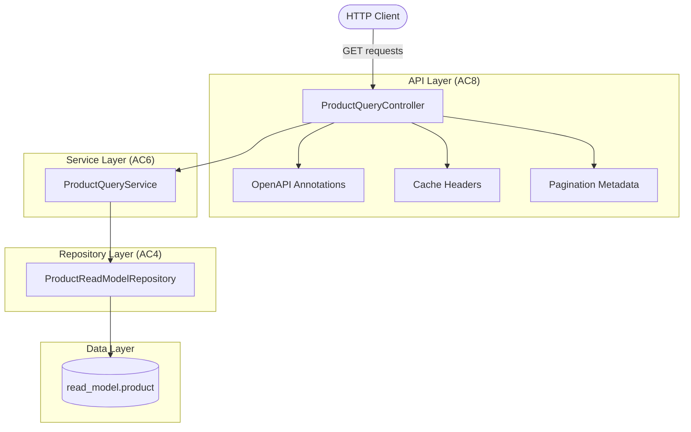
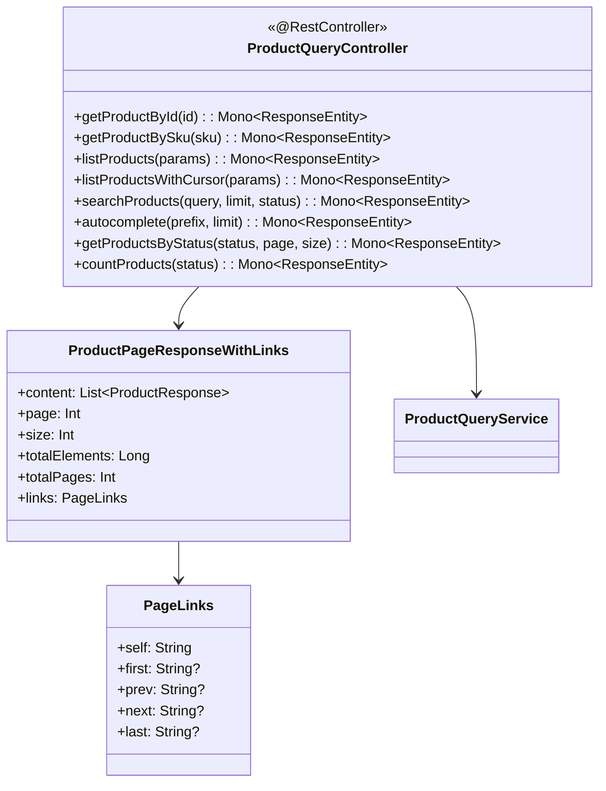
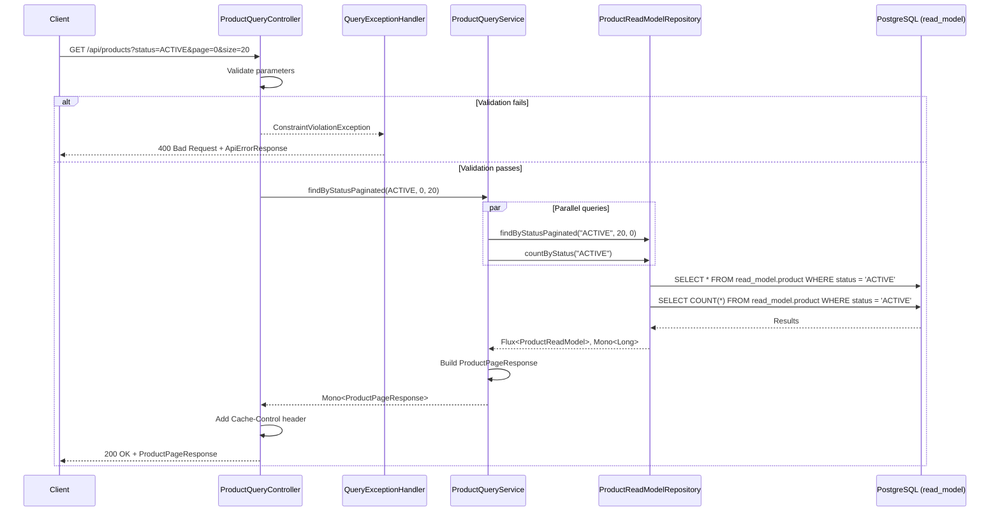

# Implementation Plan: AC8 - Product REST API (Queries)

**Feature:** Product Catalog (CQRS Architecture)
**Acceptance Criteria:** AC8 - Product REST API (Queries)
**Status:** Planning

---

## Overview

This implementation plan details the enhancements to the **Product Query Controller** to fully satisfy AC8 requirements. The existing codebase already includes a functional `ProductQueryController` implemented as part of AC6. This plan focuses on:

1. Adding comprehensive **OpenAPI/Swagger documentation** to all query endpoints
2. Implementing proper **cache headers** for read endpoints
3. Ensuring **content negotiation** (JSON support)
4. Adding **pagination metadata** with links
5. Enhancing **unit and integration tests** to achieve >80% coverage
6. Ensuring all endpoints return **appropriate HTTP status codes**

## Architecture



## Prerequisites

Before starting this implementation:

- [x] AC4 (Product Read Model) is complete - Read model schema and repository exist
- [x] AC5 (Event Projections) is complete - Read models are populated from events
- [x] AC6 (Product Query Service) is complete - Service layer with query methods exists
- [x] `ProductQueryController` exists with basic query endpoints
- [x] Response DTOs are defined (`ProductResponse`, `ProductPageResponse`, etc.)
- [x] `QueryExceptionHandler` exists for error handling

## Acceptance Criteria Reference

From the feature specification:

> - `GET /api/products/{id}` returns a single product
> - `GET /api/products` returns paginated product list
> - `GET /api/products/search` supports full-text search
> - `GET /api/products/by-status/{status}` returns products filtered by status
> - Query parameters support: `page`, `size`, `sort`, `direction`
> - Response includes pagination metadata (total count, page info, links)
> - Endpoints support content negotiation (JSON)
> - Cache headers are set appropriately for read endpoints

---

## Current State Analysis

### Existing Endpoints (from AC6)

| Method | Endpoint | Status | Missing |
|--------|----------|--------|---------|
| `GET` | `/api/products/{id}` | ✅ Implemented | OpenAPI docs |
| `GET` | `/api/products` | ✅ Implemented | OpenAPI docs, HATEOAS links |
| `GET` | `/api/products/cursor` | ✅ Implemented | OpenAPI docs |
| `GET` | `/api/products/search` | ✅ Implemented | OpenAPI docs |
| `GET` | `/api/products/autocomplete` | ✅ Implemented | OpenAPI docs |
| `GET` | `/api/products/by-status/{status}` | ✅ Implemented | OpenAPI docs |
| `GET` | `/api/products/count` | ✅ Implemented | OpenAPI docs |
| `GET` | `/api/products/sku/{sku}` | ✅ Implemented | OpenAPI docs |

### Gap Analysis

| Requirement | Current State | Action Required |
|-------------|---------------|-----------------|
| OpenAPI documentation | Missing | Add `@Operation`, `@ApiResponse`, `@Parameter` annotations |
| Pagination links | Not present | Add HATEOAS-style links to page responses |
| Cache headers | Implemented | Verify and document |
| Content negotiation | Default JSON | Add explicit `produces` declaration |
| Test coverage | Partial | Add comprehensive unit and integration tests |

---

## High-Level Component Design



---

## Endpoint Specification (AC8 Requirements)

### 1. Get Product by ID

| Property | Value |
|----------|-------|
| Method | `GET` |
| Path | `/api/products/{id}` |
| Path Variable | `id` - Product UUID |
| Success Response | `200 OK` with `ProductResponse` |
| Error Responses | `400 Bad Request` (invalid UUID), `404 Not Found` |
| Cache | `Cache-Control: max-age=60` |

### 2. List Products (Paginated)

| Property | Value |
|----------|-------|
| Method | `GET` |
| Path | `/api/products` |
| Query Parameters | `page`, `size`, `status`, `minPrice`, `maxPrice`, `sort`, `direction` |
| Success Response | `200 OK` with `ProductPageResponse` |
| Error Responses | `400 Bad Request` (invalid parameters) |
| Cache | `Cache-Control: max-age=60` |

### 3. Search Products

| Property | Value |
|----------|-------|
| Method | `GET` |
| Path | `/api/products/search` |
| Query Parameters | `q` (required), `limit`, `status` |
| Success Response | `200 OK` with `ProductSearchResponse` |
| Error Responses | `400 Bad Request` (missing/invalid query) |
| Cache | `Cache-Control: no-cache` (dynamic results) |

### 4. Get Products by Status

| Property | Value |
|----------|-------|
| Method | `GET` |
| Path | `/api/products/by-status/{status}` |
| Path Variable | `status` - DRAFT, ACTIVE, or DISCONTINUED |
| Query Parameters | `page`, `size` |
| Success Response | `200 OK` with `ProductPageResponse` |
| Error Responses | `400 Bad Request` (invalid status) |
| Cache | `Cache-Control: max-age=60` |

---

## Implementation Steps

### Step 1: Add OpenAPI/Swagger Configuration

**Objective:** Configure OpenAPI documentation for the application.

#### 1.1 Verify OpenAPI Dependency

**File:** `build.gradle.kts`

Ensure the springdoc dependency is present:

```kotlin
implementation("org.springdoc:springdoc-openapi-starter-webflux-ui:2.8.8")
```

#### 1.2 Create/Update OpenAPI Configuration

**File:** `src/main/kotlin/com/pintailconsultingllc/cqrsspike/config/OpenApiConfig.kt`

```kotlin
package com.pintailconsultingllc.cqrsspike.config

import io.swagger.v3.oas.models.OpenAPI
import io.swagger.v3.oas.models.info.Contact
import io.swagger.v3.oas.models.info.Info
import io.swagger.v3.oas.models.info.License
import io.swagger.v3.oas.models.servers.Server
import io.swagger.v3.oas.models.tags.Tag
import org.springframework.context.annotation.Bean
import org.springframework.context.annotation.Configuration

/**
 * OpenAPI/Swagger documentation configuration.
 */
@Configuration
class OpenApiConfig {

    @Bean
    fun customOpenAPI(): OpenAPI {
        return OpenAPI()
            .info(
                Info()
                    .title("Product Catalog API")
                    .description(
                        """
                        Product Catalog REST API built with CQRS architecture.

                        This API provides:
                        - **Query endpoints** for retrieving products (read model)
                        - **Command endpoints** for creating and modifying products (write model)

                        ## Query Side (Read Model)
                        Query endpoints operate on the read model which is eventually consistent
                        with the command model through event projections. All query endpoints are
                        optimized for fast retrieval with appropriate caching.

                        ## Pagination
                        List endpoints support both offset-based and cursor-based pagination:
                        - **Offset-based**: Use `page` and `size` parameters
                        - **Cursor-based**: Use `/cursor` endpoint with `cursor` parameter

                        ## Filtering and Sorting
                        - Filter by `status`: DRAFT, ACTIVE, DISCONTINUED
                        - Filter by price range: `minPrice`, `maxPrice` (in cents)
                        - Sort by: `name`, `price`, `createdAt`
                        - Sort direction: `asc`, `desc`
                        """.trimIndent()
                    )
                    .version("1.0.0")
                    .contact(
                        Contact()
                            .name("Pintail Consulting LLC")
                            .url("https://pintailconsultingllc.com")
                    )
                    .license(
                        License()
                            .name("MIT License")
                            .url("https://opensource.org/licenses/MIT")
                    )
            )
            .servers(
                listOf(
                    Server()
                        .url("/")
                        .description("Default Server")
                )
            )
            .tags(
                listOf(
                    Tag()
                        .name("Product Queries")
                        .description("Endpoints for querying products from the read model"),
                    Tag()
                        .name("Product Commands")
                        .description("Endpoints for creating and modifying products")
                )
            )
    }
}
```

#### 1.3 Verification

- [ ] OpenAPI configuration compiles without errors
- [ ] Swagger UI accessible at `/swagger-ui.html`
- [ ] API documentation displays correctly

---

### Step 2: Add OpenAPI Annotations to ProductQueryController

**Objective:** Add comprehensive OpenAPI documentation to all query endpoints.

#### 2.1 Update ProductQueryController with OpenAPI Annotations

**File:** `src/main/kotlin/com/pintailconsultingllc/cqrsspike/product/api/ProductQueryController.kt`

Add the following imports and annotations:

```kotlin
package com.pintailconsultingllc.cqrsspike.product.api

import com.pintailconsultingllc.cqrsspike.product.api.dto.ApiErrorResponse
import com.pintailconsultingllc.cqrsspike.product.api.dto.ProductCountResponse
import com.pintailconsultingllc.cqrsspike.product.query.dto.ProductCursorPageResponse
import com.pintailconsultingllc.cqrsspike.product.query.dto.ProductPageResponse
import com.pintailconsultingllc.cqrsspike.product.query.dto.ProductResponse
import com.pintailconsultingllc.cqrsspike.product.query.dto.ProductSearchResponse
import com.pintailconsultingllc.cqrsspike.product.query.dto.SortDirection
import com.pintailconsultingllc.cqrsspike.product.query.dto.SortField
import com.pintailconsultingllc.cqrsspike.product.query.model.ProductStatusView
import com.pintailconsultingllc.cqrsspike.product.query.service.ProductQueryService
import io.swagger.v3.oas.annotations.Operation
import io.swagger.v3.oas.annotations.Parameter
import io.swagger.v3.oas.annotations.media.Content
import io.swagger.v3.oas.annotations.media.Schema
import io.swagger.v3.oas.annotations.responses.ApiResponse
import io.swagger.v3.oas.annotations.responses.ApiResponses
import io.swagger.v3.oas.annotations.tags.Tag
import jakarta.validation.constraints.Max
import jakarta.validation.constraints.Min
import jakarta.validation.constraints.Pattern
import jakarta.validation.constraints.Size
import org.slf4j.LoggerFactory
import org.springframework.http.CacheControl
import org.springframework.http.MediaType
import org.springframework.http.ResponseEntity
import org.springframework.validation.annotation.Validated
import org.springframework.web.bind.annotation.GetMapping
import org.springframework.web.bind.annotation.PathVariable
import org.springframework.web.bind.annotation.RequestMapping
import org.springframework.web.bind.annotation.RequestParam
import org.springframework.web.bind.annotation.RestController
import reactor.core.publisher.Mono
import java.time.Duration
import java.util.UUID

/**
 * REST controller for Product query operations.
 *
 * Provides endpoints for retrieving products from the read model
 * with support for pagination, filtering, sorting, and search.
 */
@RestController
@RequestMapping("/api/products", produces = [MediaType.APPLICATION_JSON_VALUE])
@Validated
@Tag(name = "Product Queries", description = "Endpoints for querying products from the read model")
class ProductQueryController(
    private val queryService: ProductQueryService
) {
    // ... (implementation follows)
}
```

#### 2.2 Add Annotations to Each Endpoint

**Get Product by ID:**

```kotlin
@GetMapping("/{id}")
@Operation(
    summary = "Get product by ID",
    description = "Retrieves a single product by its unique identifier (UUID)"
)
@ApiResponses(
    ApiResponse(
        responseCode = "200",
        description = "Product found",
        content = [Content(
            mediaType = MediaType.APPLICATION_JSON_VALUE,
            schema = Schema(implementation = ProductResponse::class)
        )]
    ),
    ApiResponse(
        responseCode = "400",
        description = "Invalid product ID format",
        content = [Content(
            mediaType = MediaType.APPLICATION_JSON_VALUE,
            schema = Schema(implementation = ApiErrorResponse::class)
        )]
    ),
    ApiResponse(
        responseCode = "404",
        description = "Product not found",
        content = [Content()]
    )
)
fun getProductById(
    @Parameter(description = "Product UUID", required = true, example = "550e8400-e29b-41d4-a716-446655440000")
    @PathVariable id: UUID
): Mono<ResponseEntity<ProductResponse>>
```

**List Products:**

```kotlin
@GetMapping
@Operation(
    summary = "List products",
    description = """
        Retrieves a paginated list of products with optional filtering and sorting.

        **Filtering:**
        - By status: DRAFT, ACTIVE, DISCONTINUED
        - By price range: minPrice and maxPrice (in cents)

        **Sorting:**
        - Fields: name, price, createdAt
        - Directions: asc, desc
    """
)
@ApiResponses(
    ApiResponse(
        responseCode = "200",
        description = "Products retrieved successfully",
        content = [Content(
            mediaType = MediaType.APPLICATION_JSON_VALUE,
            schema = Schema(implementation = ProductPageResponse::class)
        )]
    ),
    ApiResponse(
        responseCode = "400",
        description = "Invalid query parameters",
        content = [Content(
            mediaType = MediaType.APPLICATION_JSON_VALUE,
            schema = Schema(implementation = ApiErrorResponse::class)
        )]
    )
)
fun listProducts(
    @Parameter(description = "Page number (0-indexed)", example = "0")
    @RequestParam(defaultValue = "0") @Min(0) page: Int,

    @Parameter(description = "Page size (1-100)", example = "20")
    @RequestParam(defaultValue = "20") @Min(1) @Max(100) size: Int,

    @Parameter(description = "Filter by status", example = "ACTIVE")
    @RequestParam(required = false)
    @Pattern(regexp = "^(DRAFT|ACTIVE|DISCONTINUED)?$") status: String?,

    @Parameter(description = "Minimum price in cents", example = "1000")
    @RequestParam(required = false) @Min(0) minPrice: Int?,

    @Parameter(description = "Maximum price in cents", example = "5000")
    @RequestParam(required = false) @Min(0) maxPrice: Int?,

    @Parameter(description = "Sort field", example = "createdAt")
    @RequestParam(defaultValue = "createdAt")
    @Pattern(regexp = "^(name|price|createdAt)$") sort: String,

    @Parameter(description = "Sort direction", example = "desc")
    @RequestParam(defaultValue = "desc")
    @Pattern(regexp = "^(asc|desc)$") direction: String
): Mono<ResponseEntity<ProductPageResponse>>
```

**Search Products:**

```kotlin
@GetMapping("/search")
@Operation(
    summary = "Search products",
    description = """
        Full-text search on product name and description.
        Uses PostgreSQL full-text search for efficient matching.
        Results are ranked by relevance.
    """
)
@ApiResponses(
    ApiResponse(
        responseCode = "200",
        description = "Search results",
        content = [Content(
            mediaType = MediaType.APPLICATION_JSON_VALUE,
            schema = Schema(implementation = ProductSearchResponse::class)
        )]
    ),
    ApiResponse(
        responseCode = "400",
        description = "Invalid search parameters",
        content = [Content(
            mediaType = MediaType.APPLICATION_JSON_VALUE,
            schema = Schema(implementation = ApiErrorResponse::class)
        )]
    )
)
fun searchProducts(
    @Parameter(description = "Search query", required = true, example = "widget")
    @RequestParam @Size(min = 1, max = 500) q: String,

    @Parameter(description = "Maximum results (1-100)", example = "50")
    @RequestParam(defaultValue = "50") @Min(1) @Max(100) limit: Int,

    @Parameter(description = "Filter results by status", example = "ACTIVE")
    @RequestParam(required = false)
    @Pattern(regexp = "^(DRAFT|ACTIVE|DISCONTINUED)?$") status: String?
): Mono<ResponseEntity<ProductSearchResponse>>
```

**Get Products by Status:**

```kotlin
@GetMapping("/by-status/{status}")
@Operation(
    summary = "Get products by status",
    description = "Retrieves paginated products filtered by status"
)
@ApiResponses(
    ApiResponse(
        responseCode = "200",
        description = "Products retrieved successfully",
        content = [Content(
            mediaType = MediaType.APPLICATION_JSON_VALUE,
            schema = Schema(implementation = ProductPageResponse::class)
        )]
    ),
    ApiResponse(
        responseCode = "400",
        description = "Invalid status value",
        content = [Content(
            mediaType = MediaType.APPLICATION_JSON_VALUE,
            schema = Schema(implementation = ApiErrorResponse::class)
        )]
    )
)
fun getProductsByStatus(
    @Parameter(description = "Product status", required = true, example = "ACTIVE")
    @PathVariable @Pattern(regexp = "^(DRAFT|ACTIVE|DISCONTINUED)$") status: String,

    @Parameter(description = "Page number (0-indexed)", example = "0")
    @RequestParam(defaultValue = "0") @Min(0) page: Int,

    @Parameter(description = "Page size (1-100)", example = "20")
    @RequestParam(defaultValue = "20") @Min(1) @Max(100) size: Int
): Mono<ResponseEntity<ProductPageResponse>>
```

**Additional endpoints follow the same pattern...**

#### 2.3 Verification

- [ ] All endpoints have `@Operation` annotations
- [ ] All endpoints have `@ApiResponses` annotations
- [ ] All parameters have `@Parameter` annotations with descriptions
- [ ] Swagger UI displays documentation correctly

---

### Step 3: Add Pagination Links (HATEOAS-style)

**Objective:** Add navigation links to paginated responses.

#### 3.1 Create PageLinks DTO

**File:** `src/main/kotlin/com/pintailconsultingllc/cqrsspike/product/api/dto/PageLinks.kt`

```kotlin
package com.pintailconsultingllc.cqrsspike.product.api.dto

import io.swagger.v3.oas.annotations.media.Schema

/**
 * HATEOAS-style pagination links.
 */
@Schema(description = "Pagination navigation links")
data class PageLinks(
    @Schema(description = "Link to current page", example = "/api/products?page=2&size=20")
    val self: String,

    @Schema(description = "Link to first page", example = "/api/products?page=0&size=20")
    val first: String,

    @Schema(description = "Link to previous page (null if on first page)")
    val prev: String?,

    @Schema(description = "Link to next page (null if on last page)")
    val next: String?,

    @Schema(description = "Link to last page", example = "/api/products?page=5&size=20")
    val last: String
) {
    companion object {
        /**
         * Build pagination links for a given page state.
         */
        fun build(
            basePath: String,
            page: Int,
            size: Int,
            totalPages: Int,
            additionalParams: Map<String, String> = emptyMap()
        ): PageLinks {
            val params = additionalParams.entries
                .filter { it.value.isNotBlank() }
                .joinToString("&") { "${it.key}=${it.value}" }
            val suffix = if (params.isNotBlank()) "&$params" else ""

            return PageLinks(
                self = "$basePath?page=$page&size=$size$suffix",
                first = "$basePath?page=0&size=$size$suffix",
                prev = if (page > 0) "$basePath?page=${page - 1}&size=$size$suffix" else null,
                next = if (page < totalPages - 1) "$basePath?page=${page + 1}&size=$size$suffix" else null,
                last = "$basePath?page=${maxOf(0, totalPages - 1)}&size=$size$suffix"
            )
        }
    }
}
```

#### 3.2 Create Extended Page Response with Links

**File:** `src/main/kotlin/com/pintailconsultingllc/cqrsspike/product/api/dto/ProductPageResponseWithLinks.kt`

```kotlin
package com.pintailconsultingllc.cqrsspike.product.api.dto

import com.pintailconsultingllc.cqrsspike.product.query.dto.ProductPageResponse
import com.pintailconsultingllc.cqrsspike.product.query.dto.ProductResponse
import io.swagger.v3.oas.annotations.media.Schema

/**
 * Extended page response with HATEOAS-style navigation links.
 */
@Schema(description = "Paginated product list with navigation links")
data class ProductPageResponseWithLinks(
    @Schema(description = "List of products on current page")
    val content: List<ProductResponse>,

    @Schema(description = "Current page number (0-indexed)", example = "0")
    val page: Int,

    @Schema(description = "Page size", example = "20")
    val size: Int,

    @Schema(description = "Total number of products", example = "150")
    val totalElements: Long,

    @Schema(description = "Total number of pages", example = "8")
    val totalPages: Int,

    @Schema(description = "Whether this is the first page")
    val first: Boolean,

    @Schema(description = "Whether this is the last page")
    val last: Boolean,

    @Schema(description = "Whether there is a next page")
    val hasNext: Boolean,

    @Schema(description = "Whether there is a previous page")
    val hasPrevious: Boolean,

    @Schema(description = "Navigation links")
    val links: PageLinks?
) {
    companion object {
        fun from(
            response: ProductPageResponse,
            basePath: String,
            additionalParams: Map<String, String> = emptyMap()
        ): ProductPageResponseWithLinks {
            return ProductPageResponseWithLinks(
                content = response.content,
                page = response.page,
                size = response.size,
                totalElements = response.totalElements,
                totalPages = response.totalPages,
                first = response.first,
                last = response.last,
                hasNext = response.hasNext,
                hasPrevious = response.hasPrevious,
                links = PageLinks.build(
                    basePath = basePath,
                    page = response.page,
                    size = response.size,
                    totalPages = response.totalPages,
                    additionalParams = additionalParams
                )
            )
        }
    }
}
```

#### 3.3 Verification

- [ ] PageLinks DTO compiles
- [ ] ProductPageResponseWithLinks generates correct links
- [ ] Links are included in API responses

---

### Step 4: Enhance Unit Tests

**Objective:** Create comprehensive unit tests for ProductQueryController.

#### 4.1 Update ProductQueryControllerTest

**File:** `src/test/kotlin/com/pintailconsultingllc/cqrsspike/product/api/ProductQueryControllerTest.kt`

The existing test file should be enhanced with the following test cases:

```kotlin
package com.pintailconsultingllc.cqrsspike.product.api

import com.pintailconsultingllc.cqrsspike.product.query.dto.ProductCursorPageResponse
import com.pintailconsultingllc.cqrsspike.product.query.dto.ProductPageResponse
import com.pintailconsultingllc.cqrsspike.product.query.dto.ProductResponse
import com.pintailconsultingllc.cqrsspike.product.query.dto.ProductSearchResponse
import com.pintailconsultingllc.cqrsspike.product.query.dto.SortDirection
import com.pintailconsultingllc.cqrsspike.product.query.dto.SortField
import com.pintailconsultingllc.cqrsspike.product.query.model.ProductStatusView
import com.pintailconsultingllc.cqrsspike.product.query.service.ProductQueryService
import org.junit.jupiter.api.DisplayName
import org.junit.jupiter.api.Nested
import org.junit.jupiter.api.Test
import org.mockito.kotlin.any
import org.mockito.kotlin.eq
import org.mockito.kotlin.whenever
import org.springframework.beans.factory.annotation.Autowired
import org.springframework.boot.test.autoconfigure.web.reactive.WebFluxTest
import org.springframework.context.annotation.Import
import org.springframework.http.MediaType
import org.springframework.test.context.bean.override.mockito.MockitoBean
import org.springframework.test.web.reactive.server.WebTestClient
import reactor.core.publisher.Flux
import reactor.core.publisher.Mono
import java.time.OffsetDateTime
import java.util.UUID

@WebFluxTest(ProductQueryController::class)
@Import(QueryExceptionHandler::class)
@DisplayName("ProductQueryController")
class ProductQueryControllerTest {

    @Autowired
    private lateinit var webTestClient: WebTestClient

    @MockitoBean
    private lateinit var queryService: ProductQueryService

    @Nested
    @DisplayName("GET /api/products/{id}")
    inner class GetProductById {

        @Test
        @DisplayName("should return 200 with product when found")
        fun shouldReturnProductWhenFound() {
            val productId = UUID.randomUUID()
            val product = createProductResponse(productId)

            whenever(queryService.findById(productId))
                .thenReturn(Mono.just(product))

            webTestClient.get()
                .uri("/api/products/$productId")
                .accept(MediaType.APPLICATION_JSON)
                .exchange()
                .expectStatus().isOk
                .expectHeader().contentType(MediaType.APPLICATION_JSON)
                .expectHeader().cacheControl(CacheControl.maxAge(Duration.ofSeconds(60)))
                .expectBody()
                .jsonPath("$.id").isEqualTo(productId.toString())
                .jsonPath("$.sku").isEqualTo(product.sku)
                .jsonPath("$.name").isEqualTo(product.name)
                .jsonPath("$.priceCents").isEqualTo(product.priceCents)
                .jsonPath("$.status").isEqualTo(product.status)
        }

        @Test
        @DisplayName("should return 404 when product not found")
        fun shouldReturn404WhenNotFound() {
            val productId = UUID.randomUUID()

            whenever(queryService.findById(productId))
                .thenReturn(Mono.empty())

            webTestClient.get()
                .uri("/api/products/$productId")
                .accept(MediaType.APPLICATION_JSON)
                .exchange()
                .expectStatus().isNotFound
        }

        @Test
        @DisplayName("should return 400 for invalid UUID format")
        fun shouldReturn400ForInvalidUuid() {
            webTestClient.get()
                .uri("/api/products/not-a-valid-uuid")
                .accept(MediaType.APPLICATION_JSON)
                .exchange()
                .expectStatus().isBadRequest
        }
    }

    @Nested
    @DisplayName("GET /api/products")
    inner class ListProducts {

        @Test
        @DisplayName("should return paginated products with default parameters")
        fun shouldReturnPaginatedProductsWithDefaults() {
            val pageResponse = createPageResponse(listOf(createProductResponse()), 0, 20, 1)

            whenever(queryService.findAllSortedPaginated(
                eq(0), eq(20), eq(SortField.CREATED_AT), eq(SortDirection.DESC)
            )).thenReturn(Mono.just(pageResponse))

            webTestClient.get()
                .uri("/api/products")
                .accept(MediaType.APPLICATION_JSON)
                .exchange()
                .expectStatus().isOk
                .expectBody()
                .jsonPath("$.content").isArray
                .jsonPath("$.page").isEqualTo(0)
                .jsonPath("$.size").isEqualTo(20)
                .jsonPath("$.totalElements").isEqualTo(1)
                .jsonPath("$.totalPages").isEqualTo(1)
                .jsonPath("$.first").isEqualTo(true)
                .jsonPath("$.last").isEqualTo(true)
        }

        @Test
        @DisplayName("should apply custom pagination parameters")
        fun shouldApplyCustomPaginationParameters() {
            val pageResponse = createPageResponse(emptyList(), 2, 10, 100)

            whenever(queryService.findAllSortedPaginated(
                eq(2), eq(10), eq(SortField.NAME), eq(SortDirection.ASC)
            )).thenReturn(Mono.just(pageResponse))

            webTestClient.get()
                .uri("/api/products?page=2&size=10&sort=name&direction=asc")
                .accept(MediaType.APPLICATION_JSON)
                .exchange()
                .expectStatus().isOk
                .expectBody()
                .jsonPath("$.page").isEqualTo(2)
                .jsonPath("$.size").isEqualTo(10)
        }

        @Test
        @DisplayName("should filter by status")
        fun shouldFilterByStatus() {
            val pageResponse = createPageResponse(listOf(createProductResponse()), 0, 20, 1)

            whenever(queryService.findByStatusPaginated(
                eq(ProductStatusView.ACTIVE), eq(0), eq(20)
            )).thenReturn(Mono.just(pageResponse))

            webTestClient.get()
                .uri("/api/products?status=ACTIVE")
                .accept(MediaType.APPLICATION_JSON)
                .exchange()
                .expectStatus().isOk
        }

        @Test
        @DisplayName("should filter by price range")
        fun shouldFilterByPriceRange() {
            val products = listOf(createProductResponse())

            whenever(queryService.findByPriceRange(eq(1000), eq(5000)))
                .thenReturn(Flux.fromIterable(products))

            webTestClient.get()
                .uri("/api/products?minPrice=1000&maxPrice=5000")
                .accept(MediaType.APPLICATION_JSON)
                .exchange()
                .expectStatus().isOk
        }

        @Test
        @DisplayName("should return 400 for invalid status")
        fun shouldReturn400ForInvalidStatus() {
            webTestClient.get()
                .uri("/api/products?status=INVALID")
                .accept(MediaType.APPLICATION_JSON)
                .exchange()
                .expectStatus().isBadRequest
        }

        @Test
        @DisplayName("should return 400 for page size over limit")
        fun shouldReturn400ForSizeOverLimit() {
            webTestClient.get()
                .uri("/api/products?size=500")
                .accept(MediaType.APPLICATION_JSON)
                .exchange()
                .expectStatus().isBadRequest
        }

        @Test
        @DisplayName("should return 400 for negative page number")
        fun shouldReturn400ForNegativePage() {
            webTestClient.get()
                .uri("/api/products?page=-1")
                .accept(MediaType.APPLICATION_JSON)
                .exchange()
                .expectStatus().isBadRequest
        }
    }

    @Nested
    @DisplayName("GET /api/products/search")
    inner class SearchProducts {

        @Test
        @DisplayName("should return search results")
        fun shouldReturnSearchResults() {
            val searchResponse = ProductSearchResponse(
                content = listOf(createProductResponse()),
                query = "widget",
                totalMatches = 1,
                hasMore = false
            )

            whenever(queryService.search(eq("widget"), eq(50)))
                .thenReturn(Mono.just(searchResponse))

            webTestClient.get()
                .uri("/api/products/search?q=widget")
                .accept(MediaType.APPLICATION_JSON)
                .exchange()
                .expectStatus().isOk
                .expectHeader().cacheControl(CacheControl.noCache())
                .expectBody()
                .jsonPath("$.query").isEqualTo("widget")
                .jsonPath("$.totalMatches").isEqualTo(1)
                .jsonPath("$.content").isArray
        }

        @Test
        @DisplayName("should filter search by status")
        fun shouldFilterSearchByStatus() {
            val products = listOf(createProductResponse())

            whenever(queryService.searchByStatus(eq("widget"), eq(ProductStatusView.ACTIVE), eq(50)))
                .thenReturn(Flux.fromIterable(products))

            webTestClient.get()
                .uri("/api/products/search?q=widget&status=ACTIVE")
                .accept(MediaType.APPLICATION_JSON)
                .exchange()
                .expectStatus().isOk
        }

        @Test
        @DisplayName("should return 400 for missing query parameter")
        fun shouldReturn400ForMissingQuery() {
            webTestClient.get()
                .uri("/api/products/search")
                .accept(MediaType.APPLICATION_JSON)
                .exchange()
                .expectStatus().isBadRequest
        }

        @Test
        @DisplayName("should return 400 for empty query")
        fun shouldReturn400ForEmptyQuery() {
            webTestClient.get()
                .uri("/api/products/search?q=")
                .accept(MediaType.APPLICATION_JSON)
                .exchange()
                .expectStatus().isBadRequest
        }
    }

    @Nested
    @DisplayName("GET /api/products/by-status/{status}")
    inner class GetProductsByStatus {

        @Test
        @DisplayName("should return products by status")
        fun shouldReturnProductsByStatus() {
            val pageResponse = createPageResponse(listOf(createProductResponse()), 0, 20, 1)

            whenever(queryService.findByStatusPaginated(
                eq(ProductStatusView.ACTIVE), eq(0), eq(20)
            )).thenReturn(Mono.just(pageResponse))

            webTestClient.get()
                .uri("/api/products/by-status/ACTIVE")
                .accept(MediaType.APPLICATION_JSON)
                .exchange()
                .expectStatus().isOk
                .expectBody()
                .jsonPath("$.content").isArray
        }

        @Test
        @DisplayName("should return 400 for invalid status")
        fun shouldReturn400ForInvalidStatus() {
            webTestClient.get()
                .uri("/api/products/by-status/INVALID")
                .accept(MediaType.APPLICATION_JSON)
                .exchange()
                .expectStatus().isBadRequest
        }
    }

    @Nested
    @DisplayName("GET /api/products/cursor")
    inner class CursorPagination {

        @Test
        @DisplayName("should return cursor-paginated products")
        fun shouldReturnCursorPaginatedProducts() {
            val response = ProductCursorPageResponse(
                content = listOf(createProductResponse()),
                size = 1,
                hasNext = false,
                nextCursor = null
            )

            whenever(queryService.findWithCursor(eq(null), eq(20), eq(SortField.CREATED_AT)))
                .thenReturn(Mono.just(response))

            webTestClient.get()
                .uri("/api/products/cursor")
                .accept(MediaType.APPLICATION_JSON)
                .exchange()
                .expectStatus().isOk
                .expectBody()
                .jsonPath("$.content").isArray
                .jsonPath("$.hasNext").isEqualTo(false)
        }

        @Test
        @DisplayName("should use provided cursor")
        fun shouldUseProvidedCursor() {
            val cursor = "abc123"
            val response = ProductCursorPageResponse(
                content = emptyList(),
                size = 0,
                hasNext = false,
                nextCursor = null
            )

            whenever(queryService.findWithCursor(eq(cursor), eq(20), eq(SortField.CREATED_AT)))
                .thenReturn(Mono.just(response))

            webTestClient.get()
                .uri("/api/products/cursor?cursor=$cursor")
                .accept(MediaType.APPLICATION_JSON)
                .exchange()
                .expectStatus().isOk
        }
    }

    @Nested
    @DisplayName("GET /api/products/count")
    inner class CountProducts {

        @Test
        @DisplayName("should return total count")
        fun shouldReturnTotalCount() {
            whenever(queryService.count())
                .thenReturn(Mono.just(42L))

            webTestClient.get()
                .uri("/api/products/count")
                .accept(MediaType.APPLICATION_JSON)
                .exchange()
                .expectStatus().isOk
                .expectBody()
                .jsonPath("$.count").isEqualTo(42)
        }

        @Test
        @DisplayName("should return count by status")
        fun shouldReturnCountByStatus() {
            whenever(queryService.countByStatus(eq(ProductStatusView.ACTIVE)))
                .thenReturn(Mono.just(10L))

            webTestClient.get()
                .uri("/api/products/count?status=ACTIVE")
                .accept(MediaType.APPLICATION_JSON)
                .exchange()
                .expectStatus().isOk
                .expectBody()
                .jsonPath("$.count").isEqualTo(10)
                .jsonPath("$.status").isEqualTo("ACTIVE")
        }
    }

    @Nested
    @DisplayName("GET /api/products/autocomplete")
    inner class Autocomplete {

        @Test
        @DisplayName("should return autocomplete suggestions")
        fun shouldReturnAutocompleteSuggestions() {
            val products = listOf(createProductResponse())

            whenever(queryService.autocomplete(eq("wid"), eq(10)))
                .thenReturn(Flux.fromIterable(products))

            webTestClient.get()
                .uri("/api/products/autocomplete?prefix=wid")
                .accept(MediaType.APPLICATION_JSON)
                .exchange()
                .expectStatus().isOk
                .expectBody()
                .jsonPath("$").isArray
        }

        @Test
        @DisplayName("should return 400 for missing prefix")
        fun shouldReturn400ForMissingPrefix() {
            webTestClient.get()
                .uri("/api/products/autocomplete")
                .accept(MediaType.APPLICATION_JSON)
                .exchange()
                .expectStatus().isBadRequest
        }
    }

    @Nested
    @DisplayName("GET /api/products/sku/{sku}")
    inner class GetProductBySku {

        @Test
        @DisplayName("should return product by SKU")
        fun shouldReturnProductBySku() {
            val product = createProductResponse()

            whenever(queryService.findBySku(eq("TEST-001")))
                .thenReturn(Mono.just(product))

            webTestClient.get()
                .uri("/api/products/sku/TEST-001")
                .accept(MediaType.APPLICATION_JSON)
                .exchange()
                .expectStatus().isOk
                .expectBody()
                .jsonPath("$.sku").isEqualTo(product.sku)
        }

        @Test
        @DisplayName("should return 404 when SKU not found")
        fun shouldReturn404WhenSkuNotFound() {
            whenever(queryService.findBySku(eq("NONEXISTENT")))
                .thenReturn(Mono.empty())

            webTestClient.get()
                .uri("/api/products/sku/NONEXISTENT")
                .accept(MediaType.APPLICATION_JSON)
                .exchange()
                .expectStatus().isNotFound
        }
    }

    // ============ Helper Methods ============

    private fun createProductResponse(id: UUID = UUID.randomUUID()): ProductResponse {
        val now = OffsetDateTime.now()
        return ProductResponse(
            id = id,
            sku = "TEST-001",
            name = "Test Product",
            description = "A test product",
            priceCents = 1999,
            priceDisplay = "$19.99",
            status = "ACTIVE",
            createdAt = now,
            updatedAt = now,
            version = 1
        )
    }

    private fun createPageResponse(
        products: List<ProductResponse>,
        page: Int,
        size: Int,
        totalElements: Long
    ): ProductPageResponse {
        val totalPages = if (totalElements == 0L) 0 else ((totalElements + size - 1) / size).toInt()
        return ProductPageResponse(
            content = products,
            page = page,
            size = size,
            totalElements = totalElements,
            totalPages = totalPages,
            first = page == 0,
            last = page >= totalPages - 1,
            hasNext = page < totalPages - 1,
            hasPrevious = page > 0
        )
    }
}
```

#### 4.2 Verification

- [ ] All unit tests pass
- [ ] Tests cover success and error scenarios
- [ ] Tests verify HTTP status codes
- [ ] Tests verify cache headers
- [ ] Test coverage exceeds 80%

---

### Step 5: Enhance Integration Tests

**Objective:** Create comprehensive integration tests with Testcontainers.

#### 5.1 Update ProductQueryControllerIntegrationTest

**File:** `src/test/kotlin/com/pintailconsultingllc/cqrsspike/product/api/ProductQueryControllerIntegrationTest.kt`

```kotlin
package com.pintailconsultingllc.cqrsspike.product.api

import com.pintailconsultingllc.cqrsspike.product.query.model.ProductReadModel
import com.pintailconsultingllc.cqrsspike.product.query.repository.ProductReadModelRepository
import org.junit.jupiter.api.BeforeEach
import org.junit.jupiter.api.DisplayName
import org.junit.jupiter.api.Nested
import org.junit.jupiter.api.Test
import org.springframework.beans.factory.annotation.Autowired
import org.springframework.boot.test.autoconfigure.web.reactive.AutoConfigureWebTestClient
import org.springframework.boot.test.context.SpringBootTest
import org.springframework.http.MediaType
import org.springframework.test.context.DynamicPropertyRegistry
import org.springframework.test.context.DynamicPropertySource
import org.springframework.test.web.reactive.server.WebTestClient
import org.testcontainers.containers.PostgreSQLContainer
import org.testcontainers.junit.jupiter.Container
import org.testcontainers.junit.jupiter.Testcontainers
import java.time.OffsetDateTime
import java.util.UUID

@SpringBootTest(webEnvironment = SpringBootTest.WebEnvironment.RANDOM_PORT)
@AutoConfigureWebTestClient
@Testcontainers(disabledWithoutDocker = true)
@DisplayName("ProductQueryController Integration Tests")
class ProductQueryControllerIntegrationTest {

    companion object {
        @Container
        @JvmStatic
        val postgres: PostgreSQLContainer<*> = PostgreSQLContainer("postgres:18-alpine")
            .withDatabaseName("cqrs_test")
            .withUsername("test")
            .withPassword("test")

        @DynamicPropertySource
        @JvmStatic
        fun configureProperties(registry: DynamicPropertyRegistry) {
            registry.add("spring.r2dbc.url") {
                "r2dbc:postgresql://${postgres.host}:${postgres.firstMappedPort}/${postgres.databaseName}"
            }
            registry.add("spring.r2dbc.username", postgres::getUsername)
            registry.add("spring.r2dbc.password", postgres::getPassword)
            registry.add("spring.flyway.url", postgres::getJdbcUrl)
            registry.add("spring.flyway.user", postgres::getUsername)
            registry.add("spring.flyway.password", postgres::getPassword)
            registry.add("projection.auto-start") { "false" }
            registry.add("spring.cloud.vault.enabled") { "false" }
        }
    }

    @Autowired
    private lateinit var webTestClient: WebTestClient

    @Autowired
    private lateinit var repository: ProductReadModelRepository

    @BeforeEach
    fun setUp() {
        repository.deleteAll().block()
    }

    @Nested
    @DisplayName("GET /api/products/{id}")
    inner class GetProductById {

        @Test
        @DisplayName("should return product when found")
        fun shouldReturnProductWhenFound() {
            val product = createAndSaveProduct("INTEG-001", "Integration Test Product", 1999)

            webTestClient.get()
                .uri("/api/products/${product.id}")
                .accept(MediaType.APPLICATION_JSON)
                .exchange()
                .expectStatus().isOk
                .expectHeader().contentType(MediaType.APPLICATION_JSON)
                .expectBody()
                .jsonPath("$.id").isEqualTo(product.id.toString())
                .jsonPath("$.sku").isEqualTo("INTEG-001")
                .jsonPath("$.name").isEqualTo("Integration Test Product")
                .jsonPath("$.priceCents").isEqualTo(1999)
        }

        @Test
        @DisplayName("should return 404 when product not found")
        fun shouldReturn404WhenNotFound() {
            val nonExistentId = UUID.randomUUID()

            webTestClient.get()
                .uri("/api/products/$nonExistentId")
                .accept(MediaType.APPLICATION_JSON)
                .exchange()
                .expectStatus().isNotFound
        }
    }

    @Nested
    @DisplayName("GET /api/products")
    inner class ListProducts {

        @Test
        @DisplayName("should return empty page when no products")
        fun shouldReturnEmptyPage() {
            webTestClient.get()
                .uri("/api/products")
                .accept(MediaType.APPLICATION_JSON)
                .exchange()
                .expectStatus().isOk
                .expectBody()
                .jsonPath("$.content").isArray
                .jsonPath("$.content.length()").isEqualTo(0)
                .jsonPath("$.totalElements").isEqualTo(0)
        }

        @Test
        @DisplayName("should return paginated products")
        fun shouldReturnPaginatedProducts() {
            repeat(5) { i ->
                createAndSaveProduct("PAGE-$i", "Product $i", 1000 + (i * 100))
            }

            webTestClient.get()
                .uri("/api/products?page=0&size=3")
                .accept(MediaType.APPLICATION_JSON)
                .exchange()
                .expectStatus().isOk
                .expectBody()
                .jsonPath("$.content.length()").isEqualTo(3)
                .jsonPath("$.totalElements").isEqualTo(5)
                .jsonPath("$.totalPages").isEqualTo(2)
                .jsonPath("$.hasNext").isEqualTo(true)
                .jsonPath("$.hasPrevious").isEqualTo(false)
        }

        @Test
        @DisplayName("should filter by status")
        fun shouldFilterByStatus() {
            createAndSaveProduct("ACTIVE-1", "Active Product", 1000, "ACTIVE")
            createAndSaveProduct("DRAFT-1", "Draft Product", 2000, "DRAFT")
            createAndSaveProduct("DISC-1", "Discontinued Product", 3000, "DISCONTINUED")

            webTestClient.get()
                .uri("/api/products?status=ACTIVE")
                .accept(MediaType.APPLICATION_JSON)
                .exchange()
                .expectStatus().isOk
                .expectBody()
                .jsonPath("$.content.length()").isEqualTo(1)
                .jsonPath("$.content[0].status").isEqualTo("ACTIVE")
        }

        @Test
        @DisplayName("should filter by price range")
        fun shouldFilterByPriceRange() {
            createAndSaveProduct("CHEAP-1", "Cheap Product", 500)
            createAndSaveProduct("MID-1", "Mid Product", 1500)
            createAndSaveProduct("EXPENSIVE-1", "Expensive Product", 3000)

            webTestClient.get()
                .uri("/api/products?minPrice=1000&maxPrice=2000")
                .accept(MediaType.APPLICATION_JSON)
                .exchange()
                .expectStatus().isOk
                .expectBody()
                .jsonPath("$.content.length()").isEqualTo(1)
                .jsonPath("$.content[0].sku").isEqualTo("MID-1")
        }

        @Test
        @DisplayName("should sort by name ascending")
        fun shouldSortByNameAscending() {
            createAndSaveProduct("C-PROD", "Charlie Product", 1000)
            createAndSaveProduct("A-PROD", "Alpha Product", 1000)
            createAndSaveProduct("B-PROD", "Bravo Product", 1000)

            webTestClient.get()
                .uri("/api/products?sort=name&direction=asc")
                .accept(MediaType.APPLICATION_JSON)
                .exchange()
                .expectStatus().isOk
                .expectBody()
                .jsonPath("$.content[0].name").isEqualTo("Alpha Product")
                .jsonPath("$.content[1].name").isEqualTo("Bravo Product")
                .jsonPath("$.content[2].name").isEqualTo("Charlie Product")
        }

        @Test
        @DisplayName("should sort by price descending")
        fun shouldSortByPriceDescending() {
            createAndSaveProduct("CHEAP", "Cheap", 100)
            createAndSaveProduct("EXPENSIVE", "Expensive", 10000)
            createAndSaveProduct("MID", "Mid", 1000)

            webTestClient.get()
                .uri("/api/products?sort=price&direction=desc")
                .accept(MediaType.APPLICATION_JSON)
                .exchange()
                .expectStatus().isOk
                .expectBody()
                .jsonPath("$.content[0].sku").isEqualTo("EXPENSIVE")
                .jsonPath("$.content[1].sku").isEqualTo("MID")
                .jsonPath("$.content[2].sku").isEqualTo("CHEAP")
        }
    }

    @Nested
    @DisplayName("GET /api/products/search")
    inner class SearchProducts {

        @Test
        @DisplayName("should return matching products")
        fun shouldReturnMatchingProducts() {
            createAndSaveProduct("WIDGET-1", "Amazing Widget", 999, description = "A wonderful widget for all your needs")
            createAndSaveProduct("GADGET-1", "Basic Gadget", 1999, description = "A simple gadget")

            webTestClient.get()
                .uri("/api/products/search?q=widget")
                .accept(MediaType.APPLICATION_JSON)
                .exchange()
                .expectStatus().isOk
                .expectBody()
                .jsonPath("$.query").isEqualTo("widget")
                .jsonPath("$.content.length()").isEqualTo(1)
                .jsonPath("$.content[0].name").isEqualTo("Amazing Widget")
        }

        @Test
        @DisplayName("should return empty results for no matches")
        fun shouldReturnEmptyForNoMatches() {
            createAndSaveProduct("PROD-1", "Product One", 1000)

            webTestClient.get()
                .uri("/api/products/search?q=nonexistent")
                .accept(MediaType.APPLICATION_JSON)
                .exchange()
                .expectStatus().isOk
                .expectBody()
                .jsonPath("$.content.length()").isEqualTo(0)
                .jsonPath("$.totalMatches").isEqualTo(0)
        }
    }

    @Nested
    @DisplayName("GET /api/products/by-status/{status}")
    inner class GetProductsByStatus {

        @Test
        @DisplayName("should return products by status with pagination")
        fun shouldReturnProductsByStatus() {
            repeat(5) { i ->
                createAndSaveProduct("ACTIVE-$i", "Active Product $i", 1000, "ACTIVE")
            }
            createAndSaveProduct("DRAFT-1", "Draft Product", 2000, "DRAFT")

            webTestClient.get()
                .uri("/api/products/by-status/ACTIVE?page=0&size=3")
                .accept(MediaType.APPLICATION_JSON)
                .exchange()
                .expectStatus().isOk
                .expectBody()
                .jsonPath("$.content.length()").isEqualTo(3)
                .jsonPath("$.totalElements").isEqualTo(5)
                .jsonPath("$.hasNext").isEqualTo(true)
        }
    }

    @Nested
    @DisplayName("GET /api/products/count")
    inner class CountProducts {

        @Test
        @DisplayName("should return correct total count")
        fun shouldReturnCorrectCount() {
            repeat(3) { i ->
                createAndSaveProduct("CNT-$i", "Count Product $i", 1000)
            }

            webTestClient.get()
                .uri("/api/products/count")
                .accept(MediaType.APPLICATION_JSON)
                .exchange()
                .expectStatus().isOk
                .expectBody()
                .jsonPath("$.count").isEqualTo(3)
        }

        @Test
        @DisplayName("should return count by status")
        fun shouldReturnCountByStatus() {
            createAndSaveProduct("A1", "Active 1", 1000, "ACTIVE")
            createAndSaveProduct("A2", "Active 2", 1000, "ACTIVE")
            createAndSaveProduct("D1", "Draft 1", 1000, "DRAFT")

            webTestClient.get()
                .uri("/api/products/count?status=ACTIVE")
                .accept(MediaType.APPLICATION_JSON)
                .exchange()
                .expectStatus().isOk
                .expectBody()
                .jsonPath("$.count").isEqualTo(2)
                .jsonPath("$.status").isEqualTo("ACTIVE")
        }
    }

    @Nested
    @DisplayName("GET /api/products/autocomplete")
    inner class Autocomplete {

        @Test
        @DisplayName("should return autocomplete suggestions")
        fun shouldReturnAutocompleteSuggestions() {
            createAndSaveProduct("WID-1", "Widget One", 1000)
            createAndSaveProduct("WID-2", "Widget Two", 2000)
            createAndSaveProduct("GAD-1", "Gadget One", 3000)

            webTestClient.get()
                .uri("/api/products/autocomplete?prefix=Wid")
                .accept(MediaType.APPLICATION_JSON)
                .exchange()
                .expectStatus().isOk
                .expectBody()
                .jsonPath("$.length()").isEqualTo(2)
        }
    }

    @Nested
    @DisplayName("GET /api/products/sku/{sku}")
    inner class GetProductBySku {

        @Test
        @DisplayName("should return product by SKU")
        fun shouldReturnProductBySku() {
            createAndSaveProduct("UNIQUE-SKU-123", "Unique Product", 1999)

            webTestClient.get()
                .uri("/api/products/sku/UNIQUE-SKU-123")
                .accept(MediaType.APPLICATION_JSON)
                .exchange()
                .expectStatus().isOk
                .expectBody()
                .jsonPath("$.sku").isEqualTo("UNIQUE-SKU-123")
                .jsonPath("$.name").isEqualTo("Unique Product")
        }
    }

    // ============ Helper Methods ============

    private fun createAndSaveProduct(
        sku: String,
        name: String,
        priceCents: Int,
        status: String = "ACTIVE",
        description: String = "Test description for $name"
    ): ProductReadModel {
        val now = OffsetDateTime.now()
        val product = ProductReadModel(
            id = UUID.randomUUID(),
            sku = sku,
            name = name,
            description = description,
            priceCents = priceCents,
            priceDisplay = null,
            status = status,
            createdAt = now,
            updatedAt = now,
            aggregateVersion = 1L,
            isDeleted = false
        )
        return repository.save(product).block()!!
    }
}
```

#### 5.2 Verification

- [ ] All integration tests pass with Testcontainers
- [ ] Tests verify database interactions
- [ ] Tests verify pagination behavior
- [ ] Tests verify filtering and sorting
- [ ] Tests verify search functionality

---

## Request/Response Flow Diagram



---

## Verification Checklist

### Functional Requirements (AC8)

| Requirement | Status |
|-------------|--------|
| `GET /api/products/{id}` returns a single product | ⬜ |
| `GET /api/products` returns paginated product list | ⬜ |
| `GET /api/products/search` supports full-text search | ⬜ |
| `GET /api/products/by-status/{status}` returns products filtered by status | ⬜ |
| Query parameters support: `page`, `size`, `sort`, `direction` | ⬜ |
| Response includes pagination metadata (total count, page info, links) | ⬜ |
| Endpoints support content negotiation (JSON) | ⬜ |
| Cache headers are set appropriately for read endpoints | ⬜ |

### Technical Requirements

| Requirement | Status |
|-------------|--------|
| All code follows CONSTITUTION.md guidelines | ⬜ |
| Reactive types used throughout (`Mono<T>`, `Flux<T>`) | ⬜ |
| R2DBC used for database access (not blocking) | ⬜ |
| Proper logging implemented | ⬜ |
| Unit tests achieve 80%+ coverage | ⬜ |
| Integration tests pass | ⬜ |
| OpenAPI documentation is complete | ⬜ |

### Code Quality

| Requirement | Status |
|-------------|--------|
| Code compiles without warnings | ⬜ |
| No blocking operations in reactive pipeline | ⬜ |
| Proper error handling with exception handler | ⬜ |
| All endpoints have OpenAPI annotations | ⬜ |

---

## Files to Create

| File Path | Description |
|-----------|-------------|
| `src/main/kotlin/.../config/OpenApiConfig.kt` | OpenAPI/Swagger configuration |
| `src/main/kotlin/.../api/dto/PageLinks.kt` | HATEOAS pagination links DTO |
| `src/main/kotlin/.../api/dto/ProductPageResponseWithLinks.kt` | Extended page response with links |

## Files to Modify

| File Path | Changes |
|-----------|---------|
| `build.gradle.kts` | Verify springdoc-openapi dependency |
| `src/main/kotlin/.../api/ProductQueryController.kt` | Add OpenAPI annotations |
| `src/test/kotlin/.../api/ProductQueryControllerTest.kt` | Enhance unit tests |
| `src/test/kotlin/.../api/ProductQueryControllerIntegrationTest.kt` | Enhance integration tests |

---

## API Examples

### Get Product by ID

```http
GET /api/products/550e8400-e29b-41d4-a716-446655440000
Accept: application/json
```

**Response (200 OK):**
```json
{
  "id": "550e8400-e29b-41d4-a716-446655440000",
  "sku": "PROD-001",
  "name": "Premium Widget",
  "description": "A high-quality widget for all your needs",
  "priceCents": 2999,
  "priceDisplay": "$29.99",
  "status": "ACTIVE",
  "createdAt": "2024-01-15T10:30:00Z",
  "updatedAt": "2024-01-15T14:45:00Z",
  "version": 3
}
```

**Headers:**
```
Cache-Control: max-age=60
Content-Type: application/json
```

### List Products with Pagination

```http
GET /api/products?page=0&size=10&status=ACTIVE&sort=price&direction=asc
Accept: application/json
```

**Response (200 OK):**
```json
{
  "content": [
    {
      "id": "...",
      "sku": "PROD-001",
      "name": "Budget Widget",
      "priceCents": 999,
      "priceDisplay": "$9.99",
      "status": "ACTIVE",
      ...
    },
    {
      "id": "...",
      "sku": "PROD-002",
      "name": "Standard Widget",
      "priceCents": 1999,
      "priceDisplay": "$19.99",
      "status": "ACTIVE",
      ...
    }
  ],
  "page": 0,
  "size": 10,
  "totalElements": 42,
  "totalPages": 5,
  "first": true,
  "last": false,
  "hasNext": true,
  "hasPrevious": false,
  "links": {
    "self": "/api/products?page=0&size=10&status=ACTIVE&sort=price&direction=asc",
    "first": "/api/products?page=0&size=10&status=ACTIVE&sort=price&direction=asc",
    "prev": null,
    "next": "/api/products?page=1&size=10&status=ACTIVE&sort=price&direction=asc",
    "last": "/api/products?page=4&size=10&status=ACTIVE&sort=price&direction=asc"
  }
}
```

### Search Products

```http
GET /api/products/search?q=widget&limit=20
Accept: application/json
```

**Response (200 OK):**
```json
{
  "content": [
    {
      "id": "...",
      "sku": "PROD-001",
      "name": "Premium Widget",
      ...
    }
  ],
  "query": "widget",
  "totalMatches": 15,
  "hasMore": false
}
```

**Headers:**
```
Cache-Control: no-cache
Content-Type: application/json
```

### Error Response (400 Bad Request)

```http
GET /api/products?size=500
Accept: application/json
```

**Response (400 Bad Request):**
```json
{
  "status": 400,
  "error": "Bad Request",
  "message": "Validation failed",
  "path": "/api/products",
  "timestamp": "2024-01-15T10:30:00Z",
  "details": [
    {
      "field": "size",
      "message": "must be less than or equal to 100",
      "rejectedValue": 500
    }
  ]
}
```

---

## Dependencies

Ensure the following dependencies are present in `build.gradle.kts`:

```kotlin
// OpenAPI/Swagger
implementation("org.springdoc:springdoc-openapi-starter-webflux-ui:2.8.8")

// Testing
testImplementation("org.springframework.boot:spring-boot-starter-test")
testImplementation("io.projectreactor:reactor-test")
testImplementation("org.mockito.kotlin:mockito-kotlin:5.4.0")
testImplementation("org.testcontainers:testcontainers")
testImplementation("org.testcontainers:postgresql")
testImplementation("org.testcontainers:junit-jupiter")
```

---

## Success Criteria

- [ ] All query endpoints have comprehensive OpenAPI documentation
- [ ] Swagger UI displays all endpoints correctly at `/swagger-ui.html`
- [ ] All endpoints return appropriate HTTP status codes (200, 400, 404)
- [ ] Cache headers are set correctly on all endpoints
- [ ] Pagination responses include navigation links
- [ ] Content negotiation returns JSON by default
- [ ] Unit test coverage exceeds 80%
- [ ] All integration tests pass
- [ ] Query response times are under 100ms for typical queries

---

## Notes and Decisions

1. **Pagination Links**: HATEOAS-style links are included in paginated responses to facilitate client navigation.

2. **Cache Headers**:
   - List/detail endpoints: `Cache-Control: max-age=60` (1 minute)
   - Search endpoints: `Cache-Control: no-cache` (results are dynamic)
   - Count endpoints: `Cache-Control: max-age=10` (10 seconds)
   - Autocomplete: `Cache-Control: max-age=30` (30 seconds)

3. **Content Negotiation**: All endpoints explicitly produce `application/json`. Additional media types can be added in future if needed.

4. **OpenAPI Documentation**: Every endpoint includes:
   - `@Operation` with summary and description
   - `@ApiResponses` for all possible status codes
   - `@Parameter` annotations for all inputs

5. **Error Handling**: The existing `QueryExceptionHandler` handles validation errors and returns structured `ApiErrorResponse` objects.

6. **Test Strategy**:
   - Unit tests mock the service layer and verify controller behavior
   - Integration tests use Testcontainers PostgreSQL and verify end-to-end flow
