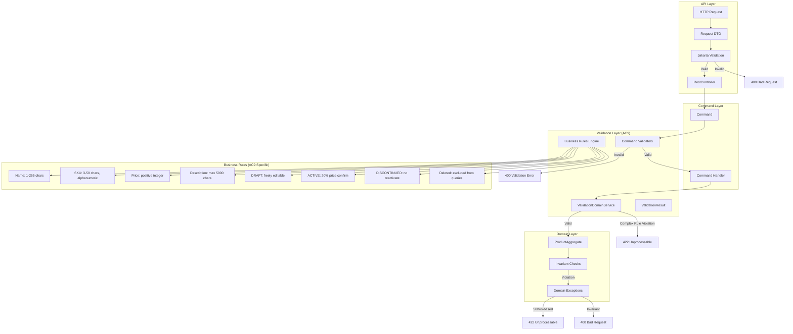
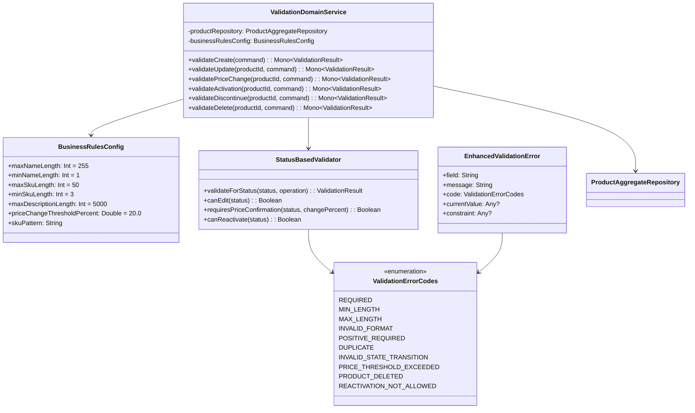
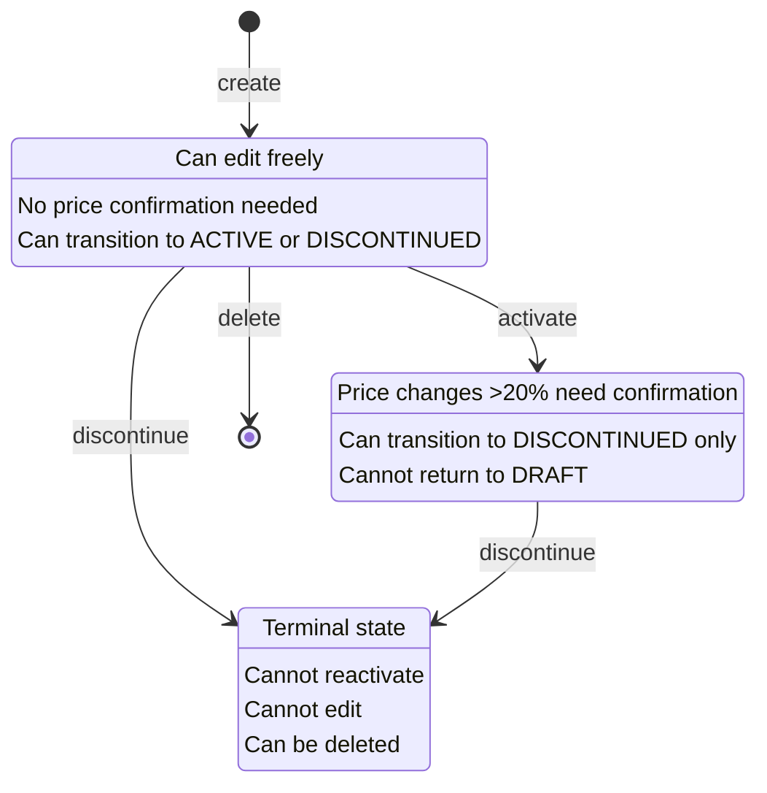

# Implementation Plan: AC9 - Business Rules and Validation

**Feature:** Product Catalog (CQRS Architecture)
**Acceptance Criteria:** AC9 - Business Rules and Validation
**Status:** Planning

---

## Overview

This implementation plan details the comprehensive enhancement of **business rules and validation** throughout the product catalog system. The goal is to ensure robust input validation, domain invariant enforcement, and clear error messaging at every layer of the CQRS architecture.

The existing codebase already includes:
- `ProductAggregate` with basic invariant validation
- Command validators (`CreateProductCommandValidator`, `UpdateProductCommandValidator`, etc.)
- Domain exceptions (`ProductInvariantViolationException`, `InvalidStateTransitionException`, etc.)
- `CommandExceptionHandler` for HTTP error response mapping
- Request DTOs with Jakarta Bean Validation annotations

This plan focuses on:
1. **Consolidating validation rules** to ensure consistency across layers
2. **Enhancing business rule enforcement** per AC9 specifications
3. **Adding status-based validation** (DRAFT, ACTIVE, DISCONTINUED behavior)
4. **Creating a validation domain service** for complex cross-cutting rules
5. **Comprehensive testing** of all business rules

---

## Architecture



---

## Acceptance Criteria Reference

From the feature specification:

> - Product name is required and between 1-255 characters
> - Product SKU is required, unique, and follows defined format (alphanumeric, 3-50 chars)
> - Product price must be a positive integer (cents)
> - Product description is optional but limited to 5000 characters
> - Products in DRAFT status can be freely edited
> - Products in ACTIVE status require confirmation for price changes over 20%
> - Products in DISCONTINUED status cannot be reactivated
> - Deleted products are soft-deleted and excluded from queries by default

---

## Current State Analysis

### Existing Validation in ProductAggregate

| Field | Current Rule | AC9 Requirement | Status |
|-------|--------------|-----------------|--------|
| `name` | 1-255 chars | 1-255 chars | ✅ Complete |
| `sku` | 3-50 chars, alphanumeric + hyphen | 3-50 chars, alphanumeric | ⚠️ Hyphen allowed |
| `price` | > 0 | > 0 | ✅ Complete |
| `description` | max 5000 chars | max 5000 chars | ✅ Complete |

### Existing State Transition Rules in ProductStatus

| Current | Target | Allowed | AC9 Requirement | Status |
|---------|--------|---------|-----------------|--------|
| DRAFT | ACTIVE | Yes | Yes | ✅ Complete |
| DRAFT | DISCONTINUED | Yes | Yes | ✅ Complete |
| ACTIVE | DISCONTINUED | Yes | Yes | ✅ Complete |
| DISCONTINUED | ACTIVE | No | No (cannot reactivate) | ✅ Complete |
| DISCONTINUED | DRAFT | No | Not specified | ✅ Blocked |

### Price Change Threshold

| Scenario | Current Behavior | AC9 Requirement | Status |
|----------|------------------|-----------------|--------|
| DRAFT product | Any change allowed | "freely edited" | ✅ Complete |
| ACTIVE product >20% change | Requires confirmation | Requires confirmation | ✅ Complete |
| ACTIVE product ≤20% change | No confirmation | Not specified | ✅ Reasonable |

### Soft Delete Behavior

| Aspect | Current Behavior | AC9 Requirement | Status |
|--------|------------------|-----------------|--------|
| `deletedAt` field | Present | "soft-deleted" | ✅ Complete |
| `isDeleted` check | Present | - | ✅ Complete |
| Query exclusion | Read model has `is_deleted` | "excluded from queries" | ⚠️ Verify |

---

## Gap Analysis

Based on the current implementation and AC9 requirements, the following gaps need to be addressed:

### Gap 1: SKU Format Clarification
**Current:** Allows hyphens (`^[A-Za-z0-9\\-]{3,50}$`)
**AC9:** "alphanumeric, 3-50 chars"
**Decision:** Keep hyphens as they're common in SKU formats. Document this as an enhancement.

### Gap 2: Status-Based Editing Restrictions
**Current:** Basic validation in aggregate methods
**AC9:** "Products in DRAFT status can be freely edited"
**Action:** Add explicit documentation and consider if ACTIVE products have additional restrictions beyond price confirmation.

### Gap 3: Query Exclusion of Deleted Products
**Current:** `is_deleted` flag exists in read model
**AC9:** "Deleted products are soft-deleted and excluded from queries by default"
**Action:** Verify query service implementations filter by `is_deleted = false` by default.

### Gap 4: Validation Domain Service
**Current:** Validators check individual commands
**AC9:** Complex rules may need cross-aggregate validation
**Action:** Create `ValidationDomainService` for rules requiring repository access (e.g., SKU uniqueness).

### Gap 5: Comprehensive Error Codes
**Current:** Error codes exist but may not cover all AC9 scenarios
**AC9:** Clear, machine-readable error responses
**Action:** Define complete error code taxonomy.

---

## High-Level Component Design



---

## Business Rules Matrix

### Field-Level Validation Rules

| Field | Rule | Error Code | Error Message | Constraint |
|-------|------|------------|---------------|------------|
| `name` | Required | `REQUIRED` | "Name is required" | - |
| `name` | Min length | `MIN_LENGTH` | "Name must be at least 1 character" | 1 |
| `name` | Max length | `MAX_LENGTH` | "Name must not exceed 255 characters" | 255 |
| `sku` | Required | `REQUIRED` | "SKU is required" | - |
| `sku` | Min length | `MIN_LENGTH` | "SKU must be at least 3 characters" | 3 |
| `sku` | Max length | `MAX_LENGTH` | "SKU must not exceed 50 characters" | 50 |
| `sku` | Format | `INVALID_FORMAT` | "SKU must contain only alphanumeric characters and hyphens" | Regex |
| `sku` | Unique | `DUPLICATE` | "SKU '{value}' already exists" | Unique constraint |
| `price` | Positive | `POSITIVE_REQUIRED` | "Price must be a positive integer (cents)" | > 0 |
| `description` | Max length | `MAX_LENGTH` | "Description must not exceed 5000 characters" | 5000 |

### Status-Based Business Rules



### Status Transition Matrix with Error Handling

| From Status | To Status | Allowed | Error Code | Error Message |
|-------------|-----------|---------|------------|---------------|
| DRAFT | ACTIVE | ✅ | - | - |
| DRAFT | DISCONTINUED | ✅ | - | - |
| ACTIVE | ACTIVE | ⚠️ No-op | - | - |
| ACTIVE | DISCONTINUED | ✅ | - | - |
| ACTIVE | DRAFT | ❌ | `INVALID_STATE_TRANSITION` | "Cannot transition from ACTIVE to DRAFT" |
| DISCONTINUED | ACTIVE | ❌ | `REACTIVATION_NOT_ALLOWED` | "Products in DISCONTINUED status cannot be reactivated" |
| DISCONTINUED | DRAFT | ❌ | `INVALID_STATE_TRANSITION` | "Cannot transition from DISCONTINUED to DRAFT" |
| Any | Same | ⚠️ No-op | - | - |

### Price Change Rules for ACTIVE Products

| Change Percentage | Confirmation Required | Action |
|-------------------|----------------------|--------|
| ≤ 20% | No | Proceed |
| > 20% (no confirmation) | Yes | Throw `PriceChangeThresholdExceededException` |
| > 20% (with confirmation) | Provided | Proceed |

---

## Implementation Steps

### Step 1: Create Business Rules Configuration

**Objective:** Centralize business rule constants for easy configuration and testing.

**File:** `src/main/kotlin/com/pintailconsultingllc/cqrsspike/product/command/validation/BusinessRulesConfig.kt`

```kotlin
package com.pintailconsultingllc.cqrsspike.product.command.validation

import org.springframework.boot.context.properties.ConfigurationProperties
import org.springframework.context.annotation.Configuration

/**
 * Externalized configuration for product business rules.
 *
 * Can be overridden in application.yml:
 * ```yaml
 * product:
 *   rules:
 *     max-name-length: 255
 *     price-change-threshold-percent: 20.0
 * ```
 */
@Configuration
@ConfigurationProperties(prefix = "product.rules")
class BusinessRulesConfig {
    var maxNameLength: Int = 255
    var minNameLength: Int = 1
    var maxSkuLength: Int = 50
    var minSkuLength: Int = 3
    var maxDescriptionLength: Int = 5000
    var priceChangeThresholdPercent: Double = 20.0
    var skuPattern: String = "^[A-Za-z0-9\\-]{3,50}$"
    var maxReasonLength: Int = 500
    var maxDeletedByLength: Int = 255
}
```

#### 1.1 Update application.yml

Add default configuration values:

```yaml
product:
  rules:
    max-name-length: 255
    min-name-length: 1
    max-sku-length: 50
    min-sku-length: 3
    max-description-length: 5000
    price-change-threshold-percent: 20.0
    sku-pattern: "^[A-Za-z0-9\\-]{3,50}$"
    max-reason-length: 500
    max-deleted-by-length: 255
```

---

### Step 2: Create Enhanced Validation Error Types

**Objective:** Define comprehensive error codes and enhanced error structures.

**File:** `src/main/kotlin/com/pintailconsultingllc/cqrsspike/product/command/validation/ValidationErrorCodes.kt`

```kotlin
package com.pintailconsultingllc.cqrsspike.product.command.validation

/**
 * Comprehensive error codes for validation failures.
 *
 * These codes are machine-readable and can be used by clients
 * for internationalization or custom error handling.
 */
enum class ValidationErrorCode(val httpStatus: Int) {
    // Field-level validation errors (400)
    REQUIRED(400),
    MIN_LENGTH(400),
    MAX_LENGTH(400),
    INVALID_FORMAT(400),
    POSITIVE_REQUIRED(400),

    // Business rule violations (400/409/422)
    DUPLICATE(409),
    INVALID_STATE_TRANSITION(422),
    PRICE_THRESHOLD_EXCEEDED(422),
    REACTIVATION_NOT_ALLOWED(422),
    PRODUCT_DELETED(410),
    CONCURRENT_MODIFICATION(409),

    // Domain invariant violations (400)
    INVARIANT_VIOLATION(400)
}

/**
 * Enhanced validation error with additional context.
 */
data class EnhancedValidationError(
    val field: String,
    val message: String,
    val code: ValidationErrorCode,
    val currentValue: Any? = null,
    val constraint: Any? = null
) {
    companion object {
        fun required(field: String) = EnhancedValidationError(
            field = field,
            message = "${field.replaceFirstChar { it.uppercase() }} is required",
            code = ValidationErrorCode.REQUIRED
        )

        fun minLength(field: String, minLength: Int, actualLength: Int) = EnhancedValidationError(
            field = field,
            message = "${field.replaceFirstChar { it.uppercase() }} must be at least $minLength characters",
            code = ValidationErrorCode.MIN_LENGTH,
            currentValue = actualLength,
            constraint = minLength
        )

        fun maxLength(field: String, maxLength: Int, actualLength: Int) = EnhancedValidationError(
            field = field,
            message = "${field.replaceFirstChar { it.uppercase() }} must not exceed $maxLength characters",
            code = ValidationErrorCode.MAX_LENGTH,
            currentValue = actualLength,
            constraint = maxLength
        )

        fun invalidFormat(field: String, expectedFormat: String) = EnhancedValidationError(
            field = field,
            message = "${field.replaceFirstChar { it.uppercase() }} format is invalid. Expected: $expectedFormat",
            code = ValidationErrorCode.INVALID_FORMAT,
            constraint = expectedFormat
        )

        fun positiveRequired(field: String, actualValue: Any) = EnhancedValidationError(
            field = field,
            message = "${field.replaceFirstChar { it.uppercase() }} must be a positive integer",
            code = ValidationErrorCode.POSITIVE_REQUIRED,
            currentValue = actualValue
        )

        fun duplicate(field: String, value: Any) = EnhancedValidationError(
            field = field,
            message = "${field.replaceFirstChar { it.uppercase() }} '$value' already exists",
            code = ValidationErrorCode.DUPLICATE,
            currentValue = value
        )
    }
}
```

---

### Step 3: Create Status-Based Validator

**Objective:** Centralize status-based business rule validation.

**File:** `src/main/kotlin/com/pintailconsultingllc/cqrsspike/product/command/validation/StatusBasedValidator.kt`

```kotlin
package com.pintailconsultingllc.cqrsspike.product.command.validation

import com.pintailconsultingllc.cqrsspike.product.command.model.ProductStatus
import org.springframework.stereotype.Component
import kotlin.math.abs

/**
 * Validates business rules based on product status.
 *
 * Implements AC9 requirements:
 * - DRAFT: can be freely edited
 * - ACTIVE: price changes >20% require confirmation
 * - DISCONTINUED: cannot be reactivated
 */
@Component
class StatusBasedValidator(
    private val businessRulesConfig: BusinessRulesConfig
) {

    /**
     * Checks if a product in the given status can be freely edited.
     * Per AC9: "Products in DRAFT status can be freely edited"
     */
    fun canEditFreely(status: ProductStatus): Boolean = when (status) {
        ProductStatus.DRAFT -> true
        ProductStatus.ACTIVE -> true  // Can edit, but with restrictions
        ProductStatus.DISCONTINUED -> false  // Terminal state
    }

    /**
     * Checks if editing is allowed for the given status.
     */
    fun canEdit(status: ProductStatus): Boolean = when (status) {
        ProductStatus.DRAFT -> true
        ProductStatus.ACTIVE -> true
        ProductStatus.DISCONTINUED -> false
    }

    /**
     * Checks if price change requires confirmation based on status and change percentage.
     * Per AC9: "Products in ACTIVE status require confirmation for price changes over 20%"
     */
    fun requiresPriceConfirmation(
        status: ProductStatus,
        currentPriceCents: Int,
        newPriceCents: Int
    ): Boolean {
        if (status != ProductStatus.ACTIVE) return false
        if (currentPriceCents == 0) return false

        val changePercent = abs(((newPriceCents - currentPriceCents).toDouble() / currentPriceCents) * 100.0)
        return changePercent > businessRulesConfig.priceChangeThresholdPercent
    }

    /**
     * Calculates the price change percentage.
     */
    fun calculatePriceChangePercent(currentPriceCents: Int, newPriceCents: Int): Double {
        if (currentPriceCents == 0) return 100.0
        return ((newPriceCents - currentPriceCents).toDouble() / currentPriceCents) * 100.0
    }

    /**
     * Checks if a product can transition to the target status.
     * Per AC9: "Products in DISCONTINUED status cannot be reactivated"
     */
    fun canTransitionTo(currentStatus: ProductStatus, targetStatus: ProductStatus): Boolean =
        currentStatus.canTransitionTo(targetStatus)

    /**
     * Validates a status transition and returns detailed error if invalid.
     */
    fun validateTransition(
        currentStatus: ProductStatus,
        targetStatus: ProductStatus
    ): ValidationResult {
        return if (canTransitionTo(currentStatus, targetStatus)) {
            ValidationResult.Valid
        } else {
            val errorCode = when {
                currentStatus == ProductStatus.DISCONTINUED && targetStatus == ProductStatus.ACTIVE ->
                    ValidationErrorCode.REACTIVATION_NOT_ALLOWED
                else -> ValidationErrorCode.INVALID_STATE_TRANSITION
            }

            val message = when (errorCode) {
                ValidationErrorCode.REACTIVATION_NOT_ALLOWED ->
                    "Products in DISCONTINUED status cannot be reactivated"
                else ->
                    "Cannot transition from $currentStatus to $targetStatus. Valid transitions: ${currentStatus.validTransitions()}"
            }

            ValidationResult.Invalid(listOf(
                ValidationError(
                    field = "status",
                    message = message,
                    code = errorCode.name
                )
            ))
        }
    }

    /**
     * Gets all editing restrictions for a given status.
     */
    fun getEditingRestrictions(status: ProductStatus): List<String> = when (status) {
        ProductStatus.DRAFT -> emptyList()
        ProductStatus.ACTIVE -> listOf(
            "Price changes exceeding ${businessRulesConfig.priceChangeThresholdPercent}% require confirmation"
        )
        ProductStatus.DISCONTINUED -> listOf(
            "Product cannot be edited in DISCONTINUED status",
            "Product cannot be reactivated"
        )
    }
}
```

---

### Step 4: Create Validation Domain Service

**Objective:** Create a service that coordinates complex validation rules requiring repository access.

**File:** `src/main/kotlin/com/pintailconsultingllc/cqrsspike/product/command/validation/ValidationDomainService.kt`

```kotlin
package com.pintailconsultingllc.cqrsspike.product.command.validation

import com.pintailconsultingllc.cqrsspike.product.command.infrastructure.ProductAggregateRepository
import com.pintailconsultingllc.cqrsspike.product.command.model.*
import org.slf4j.LoggerFactory
import org.springframework.stereotype.Service
import reactor.core.publisher.Mono
import java.util.UUID

/**
 * Domain service for complex validation rules that require repository access
 * or cross-aggregate validation.
 *
 * This service implements AC9 business rules that cannot be validated
 * by command validators alone (e.g., SKU uniqueness).
 */
@Service
class ValidationDomainService(
    private val productRepository: ProductAggregateRepository,
    private val businessRulesConfig: BusinessRulesConfig,
    private val statusBasedValidator: StatusBasedValidator
) {
    private val logger = LoggerFactory.getLogger(ValidationDomainService::class.java)

    /**
     * Validates SKU uniqueness for product creation.
     * Per AC9: "Product SKU is required, unique..."
     */
    fun validateSkuUniqueness(sku: String): Mono<ValidationResult> {
        val normalizedSku = sku.uppercase().trim()

        return productRepository.findBySku(normalizedSku)
            .map<ValidationResult> { existingProduct ->
                logger.debug("SKU {} already exists with product ID {}", normalizedSku, existingProduct.id)
                ValidationResult.Invalid(listOf(
                    ValidationError(
                        field = "sku",
                        message = "SKU '$normalizedSku' already exists",
                        code = ValidationErrorCode.DUPLICATE.name
                    )
                ))
            }
            .defaultIfEmpty(ValidationResult.Valid)
    }

    /**
     * Validates that a product can be edited based on its current status.
     * Per AC9:
     * - "Products in DRAFT status can be freely edited"
     * - DISCONTINUED products cannot be edited
     */
    fun validateCanEdit(productId: UUID): Mono<ValidationResult> {
        return productRepository.findById(productId)
            .map { aggregate ->
                if (statusBasedValidator.canEdit(aggregate.status)) {
                    ValidationResult.Valid
                } else {
                    ValidationResult.Invalid(listOf(
                        ValidationError(
                            field = "status",
                            message = "Product in ${aggregate.status} status cannot be edited",
                            code = ValidationErrorCode.INVALID_STATE_TRANSITION.name
                        )
                    ))
                }
            }
    }

    /**
     * Validates price change for an existing product.
     * Per AC9: "Products in ACTIVE status require confirmation for price changes over 20%"
     */
    fun validatePriceChange(
        productId: UUID,
        newPriceCents: Int,
        confirmLargeChange: Boolean
    ): Mono<ValidationResult> {
        return productRepository.findById(productId)
            .map { aggregate ->
                // Check if price change requires confirmation
                if (statusBasedValidator.requiresPriceConfirmation(
                        aggregate.status,
                        aggregate.priceCents,
                        newPriceCents
                    ) && !confirmLargeChange
                ) {
                    val changePercent = statusBasedValidator.calculatePriceChangePercent(
                        aggregate.priceCents,
                        newPriceCents
                    )
                    ValidationResult.Invalid(listOf(
                        ValidationError(
                            field = "newPriceCents",
                            message = "Price change of ${String.format("%.2f", changePercent)}% exceeds " +
                                    "${businessRulesConfig.priceChangeThresholdPercent}% threshold. " +
                                    "Set confirmLargeChange=true to confirm.",
                            code = ValidationErrorCode.PRICE_THRESHOLD_EXCEEDED.name
                        )
                    ))
                } else {
                    ValidationResult.Valid
                }
            }
    }

    /**
     * Validates that a product can be activated.
     * Per AC9 state transitions: DRAFT → ACTIVE is valid
     */
    fun validateCanActivate(productId: UUID): Mono<ValidationResult> {
        return productRepository.findById(productId)
            .map { aggregate ->
                statusBasedValidator.validateTransition(
                    aggregate.status,
                    ProductStatus.ACTIVE
                )
            }
    }

    /**
     * Validates that a product can be discontinued.
     * Per AC9 state transitions: DRAFT/ACTIVE → DISCONTINUED is valid
     */
    fun validateCanDiscontinue(productId: UUID): Mono<ValidationResult> {
        return productRepository.findById(productId)
            .map { aggregate ->
                statusBasedValidator.validateTransition(
                    aggregate.status,
                    ProductStatus.DISCONTINUED
                )
            }
    }

    /**
     * Validates that a product can be deleted.
     * Per AC9: "Deleted products are soft-deleted"
     * Already deleted products cannot be deleted again.
     */
    fun validateCanDelete(productId: UUID): Mono<ValidationResult> {
        return productRepository.findById(productId)
            .map { aggregate ->
                if (aggregate.isDeleted) {
                    ValidationResult.Invalid(listOf(
                        ValidationError(
                            field = "id",
                            message = "Product has already been deleted",
                            code = ValidationErrorCode.PRODUCT_DELETED.name
                        )
                    ))
                } else {
                    ValidationResult.Valid
                }
            }
    }

    /**
     * Combines multiple validation results.
     */
    fun combineResults(vararg results: ValidationResult): ValidationResult {
        val allErrors = results.filterIsInstance<ValidationResult.Invalid>()
            .flatMap { it.errors }

        return if (allErrors.isEmpty()) {
            ValidationResult.Valid
        } else {
            ValidationResult.Invalid(allErrors)
        }
    }
}
```

---

### Step 5: Update Command Validators to Use Configuration

**Objective:** Refactor existing validators to use centralized configuration.

**File:** Update `src/main/kotlin/com/pintailconsultingllc/cqrsspike/product/command/validation/CommandValidators.kt`

```kotlin
package com.pintailconsultingllc.cqrsspike.product.command.validation

import com.pintailconsultingllc.cqrsspike.product.command.model.*
import org.springframework.stereotype.Component

/**
 * Validates CreateProductCommand.
 * Implements AC9 field-level validation rules.
 */
@Component
class CreateProductCommandValidator(
    private val businessRulesConfig: BusinessRulesConfig
) {
    private val skuPattern by lazy { Regex(businessRulesConfig.skuPattern) }

    fun validate(command: CreateProductCommand): ValidationResult {
        val errors = mutableListOf<ValidationError>()

        // SKU validation (AC9: required, unique, alphanumeric, 3-50 chars)
        val trimmedSku = command.sku.trim()
        when {
            trimmedSku.isBlank() -> errors.add(
                ValidationError("sku", "SKU is required", ValidationErrorCode.REQUIRED.name)
            )
            trimmedSku.length < businessRulesConfig.minSkuLength -> errors.add(
                ValidationError(
                    "sku",
                    "SKU must be at least ${businessRulesConfig.minSkuLength} characters",
                    ValidationErrorCode.MIN_LENGTH.name
                )
            )
            trimmedSku.length > businessRulesConfig.maxSkuLength -> errors.add(
                ValidationError(
                    "sku",
                    "SKU must not exceed ${businessRulesConfig.maxSkuLength} characters",
                    ValidationErrorCode.MAX_LENGTH.name
                )
            )
            !skuPattern.matches(trimmedSku) -> errors.add(
                ValidationError(
                    "sku",
                    "SKU must contain only alphanumeric characters and hyphens",
                    ValidationErrorCode.INVALID_FORMAT.name
                )
            )
        }

        // Name validation (AC9: required, 1-255 chars)
        val trimmedName = command.name.trim()
        when {
            trimmedName.isBlank() -> errors.add(
                ValidationError("name", "Name is required", ValidationErrorCode.REQUIRED.name)
            )
            trimmedName.length > businessRulesConfig.maxNameLength -> errors.add(
                ValidationError(
                    "name",
                    "Name must not exceed ${businessRulesConfig.maxNameLength} characters",
                    ValidationErrorCode.MAX_LENGTH.name
                )
            )
        }

        // Description validation (AC9: optional, max 5000 chars)
        command.description?.let { desc ->
            if (desc.length > businessRulesConfig.maxDescriptionLength) {
                errors.add(
                    ValidationError(
                        "description",
                        "Description must not exceed ${businessRulesConfig.maxDescriptionLength} characters",
                        ValidationErrorCode.MAX_LENGTH.name
                    )
                )
            }
        }

        // Price validation (AC9: positive integer)
        if (command.priceCents <= 0) {
            errors.add(
                ValidationError(
                    "priceCents",
                    "Price must be a positive integer (cents)",
                    ValidationErrorCode.POSITIVE_REQUIRED.name
                )
            )
        }

        return if (errors.isEmpty()) ValidationResult.Valid else ValidationResult.Invalid(errors)
    }
}

/**
 * Validates UpdateProductCommand.
 */
@Component
class UpdateProductCommandValidator(
    private val businessRulesConfig: BusinessRulesConfig
) {
    fun validate(command: UpdateProductCommand): ValidationResult {
        val errors = mutableListOf<ValidationError>()

        // Name validation
        val trimmedName = command.name.trim()
        when {
            trimmedName.isBlank() -> errors.add(
                ValidationError("name", "Name is required", ValidationErrorCode.REQUIRED.name)
            )
            trimmedName.length > businessRulesConfig.maxNameLength -> errors.add(
                ValidationError(
                    "name",
                    "Name must not exceed ${businessRulesConfig.maxNameLength} characters",
                    ValidationErrorCode.MAX_LENGTH.name
                )
            )
        }

        // Description validation
        command.description?.let { desc ->
            if (desc.length > businessRulesConfig.maxDescriptionLength) {
                errors.add(
                    ValidationError(
                        "description",
                        "Description must not exceed ${businessRulesConfig.maxDescriptionLength} characters",
                        ValidationErrorCode.MAX_LENGTH.name
                    )
                )
            }
        }

        // Version validation
        if (command.expectedVersion < 1) {
            errors.add(
                ValidationError(
                    "expectedVersion",
                    "Expected version must be positive",
                    ValidationErrorCode.POSITIVE_REQUIRED.name
                )
            )
        }

        return if (errors.isEmpty()) ValidationResult.Valid else ValidationResult.Invalid(errors)
    }
}

/**
 * Validates ChangePriceCommand.
 */
@Component
class ChangePriceCommandValidator {
    fun validate(command: ChangePriceCommand): ValidationResult {
        val errors = mutableListOf<ValidationError>()

        if (command.newPriceCents <= 0) {
            errors.add(
                ValidationError(
                    "newPriceCents",
                    "Price must be a positive integer (cents)",
                    ValidationErrorCode.POSITIVE_REQUIRED.name
                )
            )
        }

        if (command.expectedVersion < 1) {
            errors.add(
                ValidationError(
                    "expectedVersion",
                    "Expected version must be positive",
                    ValidationErrorCode.POSITIVE_REQUIRED.name
                )
            )
        }

        return if (errors.isEmpty()) ValidationResult.Valid else ValidationResult.Invalid(errors)
    }
}

/**
 * Validates ActivateProductCommand.
 */
@Component
class ActivateProductCommandValidator {
    fun validate(command: ActivateProductCommand): ValidationResult {
        val errors = mutableListOf<ValidationError>()

        if (command.expectedVersion < 1) {
            errors.add(
                ValidationError(
                    "expectedVersion",
                    "Expected version must be positive",
                    ValidationErrorCode.POSITIVE_REQUIRED.name
                )
            )
        }

        return if (errors.isEmpty()) ValidationResult.Valid else ValidationResult.Invalid(errors)
    }
}

/**
 * Validates DiscontinueProductCommand.
 */
@Component
class DiscontinueProductCommandValidator(
    private val businessRulesConfig: BusinessRulesConfig
) {
    fun validate(command: DiscontinueProductCommand): ValidationResult {
        val errors = mutableListOf<ValidationError>()

        command.reason?.let { reason ->
            if (reason.length > businessRulesConfig.maxReasonLength) {
                errors.add(
                    ValidationError(
                        "reason",
                        "Reason must not exceed ${businessRulesConfig.maxReasonLength} characters",
                        ValidationErrorCode.MAX_LENGTH.name
                    )
                )
            }
        }

        if (command.expectedVersion < 1) {
            errors.add(
                ValidationError(
                    "expectedVersion",
                    "Expected version must be positive",
                    ValidationErrorCode.POSITIVE_REQUIRED.name
                )
            )
        }

        return if (errors.isEmpty()) ValidationResult.Valid else ValidationResult.Invalid(errors)
    }
}

/**
 * Validates DeleteProductCommand.
 */
@Component
class DeleteProductCommandValidator(
    private val businessRulesConfig: BusinessRulesConfig
) {
    fun validate(command: DeleteProductCommand): ValidationResult {
        val errors = mutableListOf<ValidationError>()

        command.deletedBy?.let { deletedBy ->
            if (deletedBy.length > businessRulesConfig.maxDeletedByLength) {
                errors.add(
                    ValidationError(
                        "deletedBy",
                        "DeletedBy must not exceed ${businessRulesConfig.maxDeletedByLength} characters",
                        ValidationErrorCode.MAX_LENGTH.name
                    )
                )
            }
        }

        if (command.expectedVersion < 1) {
            errors.add(
                ValidationError(
                    "expectedVersion",
                    "Expected version must be positive",
                    ValidationErrorCode.POSITIVE_REQUIRED.name
                )
            )
        }

        return if (errors.isEmpty()) ValidationResult.Valid else ValidationResult.Invalid(errors)
    }
}
```

---

### Step 6: Update ProductAggregate Constants

**Objective:** Ensure aggregate constants align with configuration defaults.

**File:** Update `src/main/kotlin/com/pintailconsultingllc/cqrsspike/product/command/aggregate/ProductAggregate.kt`

The `ProductAggregate` companion object constants should match the `BusinessRulesConfig` defaults:

```kotlin
companion object {
    // Business rule constants - should match BusinessRulesConfig defaults
    const val MAX_NAME_LENGTH = 255
    const val MIN_NAME_LENGTH = 1
    const val MAX_SKU_LENGTH = 50
    const val MIN_SKU_LENGTH = 3
    const val MAX_DESCRIPTION_LENGTH = 5000
    const val PRICE_CHANGE_THRESHOLD_PERCENT = 20.0

    // SKU pattern: alphanumeric and hyphens (AC9 says alphanumeric, but hyphens are standard)
    private val SKU_PATTERN = Regex("^[A-Za-z0-9\\-]{$MIN_SKU_LENGTH,$MAX_SKU_LENGTH}$")

    // ... rest of companion object
}
```

---

### Step 7: Add Validation Exception for Domain Service

**Objective:** Create a specific exception type for validation domain service errors.

**File:** Add to `src/main/kotlin/com/pintailconsultingllc/cqrsspike/product/command/exception/ProductExceptions.kt`

```kotlin
/**
 * Thrown when business rule validation fails in the domain service.
 * Contains structured validation errors for client consumption.
 */
class BusinessRuleViolationException(
    val errors: List<ValidationError>,
    message: String = "Business rule validation failed"
) : ProductDomainException(message) {

    companion object {
        fun fromValidationResult(result: ValidationResult.Invalid): BusinessRuleViolationException {
            val message = result.errors.joinToString("; ") { "${it.field}: ${it.message}" }
            return BusinessRuleViolationException(result.errors, message)
        }
    }
}
```

Note: `ValidationError` needs to be imported from the validation package.

---

### Step 8: Update Query Service for Soft Delete Exclusion

**Objective:** Ensure deleted products are excluded from queries by default per AC9.

**File:** Verify in `src/main/kotlin/com/pintailconsultingllc/cqrsspike/product/query/handler/ProductQueryHandler.kt`

Add/verify the following patterns:

```kotlin
/**
 * Product query handler for read model operations.
 *
 * Per AC9: "Deleted products are soft-deleted and excluded from queries by default"
 */
@Service
class ProductQueryHandler(
    private val productReadRepository: ProductReadRepository
) {
    private val logger = LoggerFactory.getLogger(ProductQueryHandler::class.java)

    /**
     * Find product by ID (excludes deleted by default).
     */
    fun findById(id: UUID, includeDeleted: Boolean = false): Mono<ProductReadModel> {
        return if (includeDeleted) {
            productReadRepository.findById(id)
        } else {
            productReadRepository.findByIdAndIsDeletedFalse(id)
        }
    }

    /**
     * Find all products (excludes deleted by default).
     */
    fun findAll(includeDeleted: Boolean = false): Flux<ProductReadModel> {
        return if (includeDeleted) {
            productReadRepository.findAll()
        } else {
            productReadRepository.findAllByIsDeletedFalse()
        }
    }

    /**
     * Find products by status (excludes deleted by default).
     */
    fun findByStatus(status: ProductStatus, includeDeleted: Boolean = false): Flux<ProductReadModel> {
        return if (includeDeleted) {
            productReadRepository.findByStatus(status.name)
        } else {
            productReadRepository.findByStatusAndIsDeletedFalse(status.name)
        }
    }

    // ... other query methods
}
```

**File:** Update repository interface if needed:

```kotlin
interface ProductReadRepository : ReactiveCrudRepository<ProductReadModel, UUID> {
    // Queries that exclude deleted products (default behavior per AC9)
    fun findByIdAndIsDeletedFalse(id: UUID): Mono<ProductReadModel>
    fun findAllByIsDeletedFalse(): Flux<ProductReadModel>
    fun findByStatusAndIsDeletedFalse(status: String): Flux<ProductReadModel>
    fun findBySkuAndIsDeletedFalse(sku: String): Mono<ProductReadModel>

    // Queries that include deleted products (for admin use)
    fun findByStatus(status: String): Flux<ProductReadModel>
}
```

---

### Step 9: Create Comprehensive Unit Tests

**Objective:** Test all business rules thoroughly.

#### 9.1 Test BusinessRulesConfig

**File:** `src/test/kotlin/com/pintailconsultingllc/cqrsspike/product/command/validation/BusinessRulesConfigTest.kt`

```kotlin
package com.pintailconsultingllc.cqrsspike.product.command.validation

import org.junit.jupiter.api.DisplayName
import org.junit.jupiter.api.Test
import kotlin.test.assertEquals

@DisplayName("BusinessRulesConfig")
class BusinessRulesConfigTest {

    private val config = BusinessRulesConfig()

    @Test
    @DisplayName("should have correct default values")
    fun shouldHaveCorrectDefaults() {
        assertEquals(255, config.maxNameLength)
        assertEquals(1, config.minNameLength)
        assertEquals(50, config.maxSkuLength)
        assertEquals(3, config.minSkuLength)
        assertEquals(5000, config.maxDescriptionLength)
        assertEquals(20.0, config.priceChangeThresholdPercent)
    }
}
```

#### 9.2 Test StatusBasedValidator

**File:** `src/test/kotlin/com/pintailconsultingllc/cqrsspike/product/command/validation/StatusBasedValidatorTest.kt`

```kotlin
package com.pintailconsultingllc.cqrsspike.product.command.validation

import com.pintailconsultingllc.cqrsspike.product.command.model.ProductStatus
import org.junit.jupiter.api.BeforeEach
import org.junit.jupiter.api.DisplayName
import org.junit.jupiter.api.Nested
import org.junit.jupiter.api.Test
import org.junit.jupiter.params.ParameterizedTest
import org.junit.jupiter.params.provider.CsvSource
import kotlin.test.assertEquals
import kotlin.test.assertFalse
import kotlin.test.assertTrue

@DisplayName("StatusBasedValidator")
class StatusBasedValidatorTest {

    private lateinit var config: BusinessRulesConfig
    private lateinit var validator: StatusBasedValidator

    @BeforeEach
    fun setup() {
        config = BusinessRulesConfig()
        validator = StatusBasedValidator(config)
    }

    @Nested
    @DisplayName("canEditFreely")
    inner class CanEditFreely {

        @Test
        @DisplayName("DRAFT products can be freely edited")
        fun draftCanBeFreeelyEdited() {
            assertTrue(validator.canEditFreely(ProductStatus.DRAFT))
        }

        @Test
        @DisplayName("DISCONTINUED products cannot be freely edited")
        fun discontinuedCannotBeEdited() {
            assertFalse(validator.canEditFreely(ProductStatus.DISCONTINUED))
        }
    }

    @Nested
    @DisplayName("requiresPriceConfirmation")
    inner class RequiresPriceConfirmation {

        @Test
        @DisplayName("DRAFT products do not require price confirmation")
        fun draftNoConfirmation() {
            assertFalse(validator.requiresPriceConfirmation(
                ProductStatus.DRAFT, 1000, 2000
            ))
        }

        @Test
        @DisplayName("ACTIVE products require confirmation for >20% changes")
        fun activeRequiresConfirmation() {
            assertTrue(validator.requiresPriceConfirmation(
                ProductStatus.ACTIVE, 1000, 1300  // 30% increase
            ))
        }

        @Test
        @DisplayName("ACTIVE products do not require confirmation for ≤20% changes")
        fun activeNoConfirmationSmallChange() {
            assertFalse(validator.requiresPriceConfirmation(
                ProductStatus.ACTIVE, 1000, 1200  // 20% increase
            ))
        }

        @ParameterizedTest
        @CsvSource(
            "1000, 1201, true",   // 20.1% - requires confirmation
            "1000, 1200, false",  // 20% - no confirmation
            "1000, 799, true",    // -20.1% - requires confirmation
            "1000, 800, false"    // -20% - no confirmation
        )
        @DisplayName("boundary cases for 20% threshold")
        fun boundaryTests(current: Int, new: Int, expected: Boolean) {
            assertEquals(expected, validator.requiresPriceConfirmation(
                ProductStatus.ACTIVE, current, new
            ))
        }
    }

    @Nested
    @DisplayName("validateTransition - AC9: DISCONTINUED cannot reactivate")
    inner class ValidateTransition {

        @Test
        @DisplayName("DRAFT to ACTIVE is valid")
        fun draftToActiveValid() {
            val result = validator.validateTransition(ProductStatus.DRAFT, ProductStatus.ACTIVE)
            assertTrue(result is ValidationResult.Valid)
        }

        @Test
        @DisplayName("DISCONTINUED to ACTIVE is invalid (cannot reactivate)")
        fun discontinuedToActiveInvalid() {
            val result = validator.validateTransition(ProductStatus.DISCONTINUED, ProductStatus.ACTIVE)
            assertTrue(result is ValidationResult.Invalid)

            val errors = (result as ValidationResult.Invalid).errors
            assertEquals(1, errors.size)
            assertEquals(ValidationErrorCode.REACTIVATION_NOT_ALLOWED.name, errors[0].code)
            assertTrue(errors[0].message.contains("cannot be reactivated"))
        }
    }
}
```

#### 9.3 Test Command Validators

**File:** `src/test/kotlin/com/pintailconsultingllc/cqrsspike/product/command/validation/CommandValidatorsTest.kt`

```kotlin
package com.pintailconsultingllc.cqrsspike.product.command.validation

import com.pintailconsultingllc.cqrsspike.product.command.model.CreateProductCommand
import com.pintailconsultingllc.cqrsspike.product.command.model.UpdateProductCommand
import org.junit.jupiter.api.BeforeEach
import org.junit.jupiter.api.DisplayName
import org.junit.jupiter.api.Nested
import org.junit.jupiter.api.Test
import org.junit.jupiter.params.ParameterizedTest
import org.junit.jupiter.params.provider.ValueSource
import java.util.UUID
import kotlin.test.assertEquals
import kotlin.test.assertTrue

@DisplayName("Command Validators - AC9 Business Rules")
class CommandValidatorsTest {

    private lateinit var config: BusinessRulesConfig
    private lateinit var createValidator: CreateProductCommandValidator
    private lateinit var updateValidator: UpdateProductCommandValidator

    @BeforeEach
    fun setup() {
        config = BusinessRulesConfig()
        createValidator = CreateProductCommandValidator(config)
        updateValidator = UpdateProductCommandValidator(config)
    }

    @Nested
    @DisplayName("CreateProductCommandValidator")
    inner class CreateValidation {

        @Nested
        @DisplayName("AC9: Product name is required and between 1-255 characters")
        inner class NameValidation {

            @Test
            @DisplayName("empty name returns REQUIRED error")
            fun emptyName() {
                val command = CreateProductCommand(
                    sku = "TEST-001",
                    name = "",
                    description = null,
                    priceCents = 1000
                )

                val result = createValidator.validate(command)
                assertTrue(result is ValidationResult.Invalid)

                val errors = (result as ValidationResult.Invalid).errors
                val nameError = errors.find { it.field == "name" }
                assertEquals(ValidationErrorCode.REQUIRED.name, nameError?.code)
            }

            @Test
            @DisplayName("name exceeding 255 chars returns MAX_LENGTH error")
            fun nameTooLong() {
                val command = CreateProductCommand(
                    sku = "TEST-001",
                    name = "a".repeat(256),
                    description = null,
                    priceCents = 1000
                )

                val result = createValidator.validate(command)
                assertTrue(result is ValidationResult.Invalid)

                val errors = (result as ValidationResult.Invalid).errors
                val nameError = errors.find { it.field == "name" }
                assertEquals(ValidationErrorCode.MAX_LENGTH.name, nameError?.code)
            }

            @Test
            @DisplayName("valid name passes validation")
            fun validName() {
                val command = CreateProductCommand(
                    sku = "TEST-001",
                    name = "Valid Product Name",
                    description = null,
                    priceCents = 1000
                )

                val result = createValidator.validate(command)
                assertTrue(result is ValidationResult.Valid)
            }
        }

        @Nested
        @DisplayName("AC9: Product SKU is required, alphanumeric, 3-50 chars")
        inner class SkuValidation {

            @Test
            @DisplayName("empty SKU returns REQUIRED error")
            fun emptySku() {
                val command = CreateProductCommand(
                    sku = "",
                    name = "Product",
                    description = null,
                    priceCents = 1000
                )

                val result = createValidator.validate(command)
                assertTrue(result is ValidationResult.Invalid)

                val errors = (result as ValidationResult.Invalid).errors
                val skuError = errors.find { it.field == "sku" }
                assertEquals(ValidationErrorCode.REQUIRED.name, skuError?.code)
            }

            @ParameterizedTest
            @ValueSource(strings = ["AB", "A"])
            @DisplayName("SKU less than 3 chars returns MIN_LENGTH error")
            fun skuTooShort(sku: String) {
                val command = CreateProductCommand(
                    sku = sku,
                    name = "Product",
                    description = null,
                    priceCents = 1000
                )

                val result = createValidator.validate(command)
                assertTrue(result is ValidationResult.Invalid)

                val errors = (result as ValidationResult.Invalid).errors
                val skuError = errors.find { it.field == "sku" }
                assertEquals(ValidationErrorCode.MIN_LENGTH.name, skuError?.code)
            }

            @Test
            @DisplayName("SKU exceeding 50 chars returns MAX_LENGTH error")
            fun skuTooLong() {
                val command = CreateProductCommand(
                    sku = "A".repeat(51),
                    name = "Product",
                    description = null,
                    priceCents = 1000
                )

                val result = createValidator.validate(command)
                assertTrue(result is ValidationResult.Invalid)

                val errors = (result as ValidationResult.Invalid).errors
                val skuError = errors.find { it.field == "sku" }
                assertEquals(ValidationErrorCode.MAX_LENGTH.name, skuError?.code)
            }

            @ParameterizedTest
            @ValueSource(strings = ["TEST@001", "TEST 001", "TEST#001", "TEST.001"])
            @DisplayName("SKU with invalid characters returns INVALID_FORMAT error")
            fun skuInvalidFormat(sku: String) {
                val command = CreateProductCommand(
                    sku = sku,
                    name = "Product",
                    description = null,
                    priceCents = 1000
                )

                val result = createValidator.validate(command)
                assertTrue(result is ValidationResult.Invalid)

                val errors = (result as ValidationResult.Invalid).errors
                val skuError = errors.find { it.field == "sku" }
                assertEquals(ValidationErrorCode.INVALID_FORMAT.name, skuError?.code)
            }

            @ParameterizedTest
            @ValueSource(strings = ["ABC", "TEST-001", "PRODUCT123", "A-B-C-123"])
            @DisplayName("valid SKU formats pass validation")
            fun validSkuFormats(sku: String) {
                val command = CreateProductCommand(
                    sku = sku,
                    name = "Product",
                    description = null,
                    priceCents = 1000
                )

                val result = createValidator.validate(command)
                assertTrue(result is ValidationResult.Valid)
            }
        }

        @Nested
        @DisplayName("AC9: Product price must be a positive integer (cents)")
        inner class PriceValidation {

            @ParameterizedTest
            @ValueSource(ints = [0, -1, -100])
            @DisplayName("non-positive price returns POSITIVE_REQUIRED error")
            fun nonPositivePrice(price: Int) {
                val command = CreateProductCommand(
                    sku = "TEST-001",
                    name = "Product",
                    description = null,
                    priceCents = price
                )

                val result = createValidator.validate(command)
                assertTrue(result is ValidationResult.Invalid)

                val errors = (result as ValidationResult.Invalid).errors
                val priceError = errors.find { it.field == "priceCents" }
                assertEquals(ValidationErrorCode.POSITIVE_REQUIRED.name, priceError?.code)
            }

            @ParameterizedTest
            @ValueSource(ints = [1, 100, 9999, 1000000])
            @DisplayName("positive price passes validation")
            fun positivePrice(price: Int) {
                val command = CreateProductCommand(
                    sku = "TEST-001",
                    name = "Product",
                    description = null,
                    priceCents = price
                )

                val result = createValidator.validate(command)
                assertTrue(result is ValidationResult.Valid)
            }
        }

        @Nested
        @DisplayName("AC9: Product description is optional but limited to 5000 characters")
        inner class DescriptionValidation {

            @Test
            @DisplayName("null description is valid")
            fun nullDescription() {
                val command = CreateProductCommand(
                    sku = "TEST-001",
                    name = "Product",
                    description = null,
                    priceCents = 1000
                )

                val result = createValidator.validate(command)
                assertTrue(result is ValidationResult.Valid)
            }

            @Test
            @DisplayName("empty description is valid")
            fun emptyDescription() {
                val command = CreateProductCommand(
                    sku = "TEST-001",
                    name = "Product",
                    description = "",
                    priceCents = 1000
                )

                val result = createValidator.validate(command)
                assertTrue(result is ValidationResult.Valid)
            }

            @Test
            @DisplayName("description exceeding 5000 chars returns MAX_LENGTH error")
            fun descriptionTooLong() {
                val command = CreateProductCommand(
                    sku = "TEST-001",
                    name = "Product",
                    description = "a".repeat(5001),
                    priceCents = 1000
                )

                val result = createValidator.validate(command)
                assertTrue(result is ValidationResult.Invalid)

                val errors = (result as ValidationResult.Invalid).errors
                val descError = errors.find { it.field == "description" }
                assertEquals(ValidationErrorCode.MAX_LENGTH.name, descError?.code)
            }

            @Test
            @DisplayName("description exactly 5000 chars is valid")
            fun descriptionAtLimit() {
                val command = CreateProductCommand(
                    sku = "TEST-001",
                    name = "Product",
                    description = "a".repeat(5000),
                    priceCents = 1000
                )

                val result = createValidator.validate(command)
                assertTrue(result is ValidationResult.Valid)
            }
        }
    }

    @Nested
    @DisplayName("UpdateProductCommandValidator")
    inner class UpdateValidation {

        @Test
        @DisplayName("validates name and description rules")
        fun validatesNameAndDescription() {
            val command = UpdateProductCommand(
                productId = UUID.randomUUID(),
                expectedVersion = 1,
                name = "",  // Invalid
                description = "a".repeat(5001)  // Invalid
            )

            val result = updateValidator.validate(command)
            assertTrue(result is ValidationResult.Invalid)

            val errors = (result as ValidationResult.Invalid).errors
            assertEquals(2, errors.size)
            assertTrue(errors.any { it.field == "name" })
            assertTrue(errors.any { it.field == "description" })
        }
    }
}
```

---

### Step 10: Create Integration Tests

**Objective:** Test business rules through the full CQRS pipeline.

**File:** `src/test/kotlin/com/pintailconsultingllc/cqrsspike/product/BusinessRulesIntegrationTest.kt`

```kotlin
package com.pintailconsultingllc.cqrsspike.product

import org.junit.jupiter.api.DisplayName
import org.junit.jupiter.api.Nested
import org.junit.jupiter.api.Test
import org.junit.jupiter.api.TestInstance
import org.springframework.beans.factory.annotation.Autowired
import org.springframework.boot.test.context.SpringBootTest
import org.springframework.boot.webtestclient.autoconfigure.AutoConfigureWebTestClient
import org.springframework.http.MediaType
import org.springframework.test.context.DynamicPropertyRegistry
import org.springframework.test.context.DynamicPropertySource
import org.springframework.test.web.reactive.server.WebTestClient
import org.testcontainers.containers.PostgreSQLContainer
import org.testcontainers.junit.jupiter.Container
import org.testcontainers.junit.jupiter.Testcontainers
import java.util.UUID

@SpringBootTest(webEnvironment = SpringBootTest.WebEnvironment.RANDOM_PORT)
@AutoConfigureWebTestClient
@Testcontainers(disabledWithoutDocker = true)
@TestInstance(TestInstance.Lifecycle.PER_CLASS)
@DisplayName("AC9: Business Rules and Validation Integration Tests")
class BusinessRulesIntegrationTest {

    companion object {
        @Container
        @JvmStatic
        val postgres = PostgreSQLContainer<Nothing>("postgres:15-alpine").apply {
            withDatabaseName("testdb")
            withUsername("test")
            withPassword("test")
        }

        @DynamicPropertySource
        @JvmStatic
        fun configureProperties(registry: DynamicPropertyRegistry) {
            registry.add("spring.r2dbc.url") {
                "r2dbc:postgresql://${postgres.host}:${postgres.firstMappedPort}/${postgres.databaseName}"
            }
            registry.add("spring.r2dbc.username") { postgres.username }
            registry.add("spring.r2dbc.password") { postgres.password }
            registry.add("spring.flyway.url") { postgres.jdbcUrl }
            registry.add("spring.flyway.user") { postgres.username }
            registry.add("spring.flyway.password") { postgres.password }
        }
    }

    @Autowired
    private lateinit var webTestClient: WebTestClient

    @Nested
    @DisplayName("AC9: Name Validation (1-255 characters)")
    inner class NameValidation {

        @Test
        @DisplayName("should reject empty name with 400")
        fun rejectEmptyName() {
            webTestClient.post()
                .uri("/api/products")
                .contentType(MediaType.APPLICATION_JSON)
                .bodyValue("""
                    {
                        "sku": "TEST-${UUID.randomUUID().toString().take(8)}",
                        "name": "",
                        "priceCents": 1000
                    }
                """.trimIndent())
                .exchange()
                .expectStatus().isBadRequest
                .expectBody()
                .jsonPath("$.errors[?(@.field=='name')]").exists()
        }

        @Test
        @DisplayName("should reject name exceeding 255 characters")
        fun rejectLongName() {
            webTestClient.post()
                .uri("/api/products")
                .contentType(MediaType.APPLICATION_JSON)
                .bodyValue("""
                    {
                        "sku": "TEST-${UUID.randomUUID().toString().take(8)}",
                        "name": "${"a".repeat(256)}",
                        "priceCents": 1000
                    }
                """.trimIndent())
                .exchange()
                .expectStatus().isBadRequest
        }
    }

    @Nested
    @DisplayName("AC9: SKU Validation (alphanumeric, 3-50 chars, unique)")
    inner class SkuValidation {

        @Test
        @DisplayName("should reject SKU less than 3 characters")
        fun rejectShortSku() {
            webTestClient.post()
                .uri("/api/products")
                .contentType(MediaType.APPLICATION_JSON)
                .bodyValue("""
                    {
                        "sku": "AB",
                        "name": "Test Product",
                        "priceCents": 1000
                    }
                """.trimIndent())
                .exchange()
                .expectStatus().isBadRequest
        }

        @Test
        @DisplayName("should reject duplicate SKU with 409")
        fun rejectDuplicateSku() {
            val sku = "DUP-${UUID.randomUUID().toString().take(8)}"

            // Create first product
            webTestClient.post()
                .uri("/api/products")
                .contentType(MediaType.APPLICATION_JSON)
                .bodyValue("""
                    {
                        "sku": "$sku",
                        "name": "First Product",
                        "priceCents": 1000
                    }
                """.trimIndent())
                .exchange()
                .expectStatus().isCreated

            // Try to create second with same SKU
            webTestClient.post()
                .uri("/api/products")
                .contentType(MediaType.APPLICATION_JSON)
                .bodyValue("""
                    {
                        "sku": "$sku",
                        "name": "Second Product",
                        "priceCents": 2000
                    }
                """.trimIndent())
                .exchange()
                .expectStatus().isEqualTo(409)
                .expectBody()
                .jsonPath("$.code").isEqualTo("DUPLICATE_SKU")
        }
    }

    @Nested
    @DisplayName("AC9: Price Validation (positive integer)")
    inner class PriceValidation {

        @Test
        @DisplayName("should reject zero price")
        fun rejectZeroPrice() {
            webTestClient.post()
                .uri("/api/products")
                .contentType(MediaType.APPLICATION_JSON)
                .bodyValue("""
                    {
                        "sku": "TEST-${UUID.randomUUID().toString().take(8)}",
                        "name": "Test Product",
                        "priceCents": 0
                    }
                """.trimIndent())
                .exchange()
                .expectStatus().isBadRequest
        }

        @Test
        @DisplayName("should reject negative price")
        fun rejectNegativePrice() {
            webTestClient.post()
                .uri("/api/products")
                .contentType(MediaType.APPLICATION_JSON)
                .bodyValue("""
                    {
                        "sku": "TEST-${UUID.randomUUID().toString().take(8)}",
                        "name": "Test Product",
                        "priceCents": -100
                    }
                """.trimIndent())
                .exchange()
                .expectStatus().isBadRequest
        }
    }

    @Nested
    @DisplayName("AC9: ACTIVE products require confirmation for >20% price changes")
    inner class ActivePriceConfirmation {

        @Test
        @DisplayName("should reject large price change without confirmation")
        fun rejectLargePriceChangeWithoutConfirmation() {
            val sku = "PRICE-${UUID.randomUUID().toString().take(8)}"

            // Create product
            val createResponse = webTestClient.post()
                .uri("/api/products")
                .contentType(MediaType.APPLICATION_JSON)
                .bodyValue("""
                    {
                        "sku": "$sku",
                        "name": "Price Test Product",
                        "priceCents": 1000
                    }
                """.trimIndent())
                .exchange()
                .expectStatus().isCreated
                .returnResult(String::class.java)

            val responseBody = createResponse.responseBody.blockFirst()!!
            val productId = Regex(""""productId":"([^"]+)"""").find(responseBody)!!.groupValues[1]

            // Activate product
            webTestClient.post()
                .uri("/api/products/$productId/activate")
                .contentType(MediaType.APPLICATION_JSON)
                .bodyValue("""{"expectedVersion": 1}""")
                .exchange()
                .expectStatus().isOk

            // Try >20% price change without confirmation
            webTestClient.patch()
                .uri("/api/products/$productId/price")
                .contentType(MediaType.APPLICATION_JSON)
                .bodyValue("""
                    {
                        "newPriceCents": 1500,
                        "expectedVersion": 2,
                        "confirmLargeChange": false
                    }
                """.trimIndent())
                .exchange()
                .expectStatus().isEqualTo(422)
                .expectBody()
                .jsonPath("$.code").isEqualTo("PRICE_CHANGE_THRESHOLD_EXCEEDED")
        }

        @Test
        @DisplayName("should accept large price change with confirmation")
        fun acceptLargePriceChangeWithConfirmation() {
            val sku = "CONFIRM-${UUID.randomUUID().toString().take(8)}"

            // Create product
            val createResponse = webTestClient.post()
                .uri("/api/products")
                .contentType(MediaType.APPLICATION_JSON)
                .bodyValue("""
                    {
                        "sku": "$sku",
                        "name": "Confirm Test Product",
                        "priceCents": 1000
                    }
                """.trimIndent())
                .exchange()
                .expectStatus().isCreated
                .returnResult(String::class.java)

            val responseBody = createResponse.responseBody.blockFirst()!!
            val productId = Regex(""""productId":"([^"]+)"""").find(responseBody)!!.groupValues[1]

            // Activate product
            webTestClient.post()
                .uri("/api/products/$productId/activate")
                .contentType(MediaType.APPLICATION_JSON)
                .bodyValue("""{"expectedVersion": 1}""")
                .exchange()
                .expectStatus().isOk

            // Large price change with confirmation
            webTestClient.patch()
                .uri("/api/products/$productId/price")
                .contentType(MediaType.APPLICATION_JSON)
                .bodyValue("""
                    {
                        "newPriceCents": 1500,
                        "expectedVersion": 2,
                        "confirmLargeChange": true
                    }
                """.trimIndent())
                .exchange()
                .expectStatus().isOk
        }
    }

    @Nested
    @DisplayName("AC9: DISCONTINUED products cannot be reactivated")
    inner class DiscontinuedReactivation {

        @Test
        @DisplayName("should reject reactivation of DISCONTINUED product with 422")
        fun rejectReactivation() {
            val sku = "DISC-${UUID.randomUUID().toString().take(8)}"

            // Create product
            val createResponse = webTestClient.post()
                .uri("/api/products")
                .contentType(MediaType.APPLICATION_JSON)
                .bodyValue("""
                    {
                        "sku": "$sku",
                        "name": "Discontinue Test Product",
                        "priceCents": 1000
                    }
                """.trimIndent())
                .exchange()
                .expectStatus().isCreated
                .returnResult(String::class.java)

            val responseBody = createResponse.responseBody.blockFirst()!!
            val productId = Regex(""""productId":"([^"]+)"""").find(responseBody)!!.groupValues[1]

            // Discontinue product (from DRAFT)
            webTestClient.post()
                .uri("/api/products/$productId/discontinue")
                .contentType(MediaType.APPLICATION_JSON)
                .bodyValue("""
                    {
                        "reason": "End of life",
                        "expectedVersion": 1
                    }
                """.trimIndent())
                .exchange()
                .expectStatus().isOk

            // Try to activate (should fail)
            webTestClient.post()
                .uri("/api/products/$productId/activate")
                .contentType(MediaType.APPLICATION_JSON)
                .bodyValue("""{"expectedVersion": 2}""")
                .exchange()
                .expectStatus().isEqualTo(422)
                .expectBody()
                .jsonPath("$.code").isEqualTo("INVALID_STATE_TRANSITION")
        }
    }

    @Nested
    @DisplayName("AC9: Deleted products are excluded from queries by default")
    inner class DeletedProductQueries {

        @Test
        @DisplayName("should exclude deleted products from query results")
        fun excludeDeletedProducts() {
            val sku = "DEL-${UUID.randomUUID().toString().take(8)}"

            // Create product
            val createResponse = webTestClient.post()
                .uri("/api/products")
                .contentType(MediaType.APPLICATION_JSON)
                .bodyValue("""
                    {
                        "sku": "$sku",
                        "name": "Delete Test Product",
                        "priceCents": 1000
                    }
                """.trimIndent())
                .exchange()
                .expectStatus().isCreated
                .returnResult(String::class.java)

            val responseBody = createResponse.responseBody.blockFirst()!!
            val productId = Regex(""""productId":"([^"]+)"""").find(responseBody)!!.groupValues[1]

            // Delete product
            webTestClient.delete()
                .uri("/api/products/$productId?expectedVersion=1")
                .exchange()
                .expectStatus().isNoContent

            // Query should return 404 (product excluded from queries)
            webTestClient.get()
                .uri("/api/products/$productId")
                .exchange()
                .expectStatus().isNotFound
        }
    }
}
```

---

## Implementation Checklist

### Step 1: Business Rules Configuration
- [ ] Create `BusinessRulesConfig.kt`
- [ ] Add configuration to `application.yml`
- [ ] Verify properties are loaded correctly

### Step 2: Enhanced Validation Error Types
- [ ] Create `ValidationErrorCodes.kt`
- [ ] Create `EnhancedValidationError` class
- [ ] Add factory methods for common errors

### Step 3: Status-Based Validator
- [ ] Create `StatusBasedValidator.kt`
- [ ] Implement `canEditFreely()` for DRAFT status
- [ ] Implement `requiresPriceConfirmation()` for ACTIVE status
- [ ] Implement `validateTransition()` with DISCONTINUED check

### Step 4: Validation Domain Service
- [ ] Create `ValidationDomainService.kt`
- [ ] Implement `validateSkuUniqueness()`
- [ ] Implement `validateCanEdit()`
- [ ] Implement `validatePriceChange()`
- [ ] Implement status transition validators

### Step 5: Update Command Validators
- [ ] Refactor validators to use `BusinessRulesConfig`
- [ ] Add `ValidationErrorCode` to all error responses
- [ ] Ensure consistent error messaging

### Step 6: Update ProductAggregate Constants
- [ ] Verify constants match `BusinessRulesConfig` defaults
- [ ] Add documentation comments

### Step 7: Add Business Rule Exception
- [ ] Add `BusinessRuleViolationException` to exceptions file
- [ ] Update exception handler if needed

### Step 8: Update Query Service
- [ ] Add `findByIdAndIsDeletedFalse()` repository method
- [ ] Update query handler to exclude deleted by default
- [ ] Add `includeDeleted` parameter for admin queries

### Step 9: Unit Tests
- [ ] Create `BusinessRulesConfigTest.kt`
- [ ] Create `StatusBasedValidatorTest.kt`
- [ ] Create/update `CommandValidatorsTest.kt`
- [ ] Achieve >80% coverage on validation code

### Step 10: Integration Tests
- [ ] Create `BusinessRulesIntegrationTest.kt`
- [ ] Test all AC9 scenarios end-to-end
- [ ] Test error responses and status codes

### Step 11: Verification
- [ ] All unit tests pass
- [ ] All integration tests pass
- [ ] Build succeeds
- [ ] Manual testing of edge cases

---

## File Summary

| File | Purpose |
|------|---------|
| `validation/BusinessRulesConfig.kt` | Externalized configuration for business rules |
| `validation/ValidationErrorCodes.kt` | Error code enum and enhanced error types |
| `validation/StatusBasedValidator.kt` | Status-based business rule validation |
| `validation/ValidationDomainService.kt` | Complex validation requiring repository access |
| `validation/CommandValidators.kt` | Updated command validators using config |
| `exception/ProductExceptions.kt` | Add `BusinessRuleViolationException` |
| `query/handler/ProductQueryHandler.kt` | Verify deleted exclusion |
| `query/repository/ProductReadRepository.kt` | Add `*AndIsDeletedFalse` methods |
| Test files | Comprehensive unit and integration tests |

---

## Dependencies

No new dependencies required. Uses existing:
- Spring Boot Configuration Properties
- Spring WebFlux
- R2DBC
- Testcontainers (for integration tests)

---

## Risks and Mitigations

| Risk | Mitigation |
|------|------------|
| Config not loaded | Use `@ConfigurationProperties` with `@EnableConfigurationProperties` |
| Validation duplication | Centralize rules in `BusinessRulesConfig` |
| Status check race conditions | Rely on optimistic locking at aggregate level |
| SKU uniqueness check timing | Check in domain service before aggregate creation |
| Query exclusion inconsistency | Add repository methods and default to excluded |

---

## Success Criteria

- [ ] Product name validation: required, 1-255 characters
- [ ] Product SKU validation: required, unique, alphanumeric+hyphen, 3-50 characters
- [ ] Product price validation: positive integer (cents)
- [ ] Product description validation: optional, max 5000 characters
- [ ] DRAFT status: products can be freely edited
- [ ] ACTIVE status: >20% price changes require confirmation
- [ ] DISCONTINUED status: cannot be reactivated (returns 422)
- [ ] Deleted products: excluded from queries by default
- [ ] All validation errors return structured responses with error codes
- [ ] Unit test coverage >80% for validation code
- [ ] Integration tests pass for all AC9 scenarios
