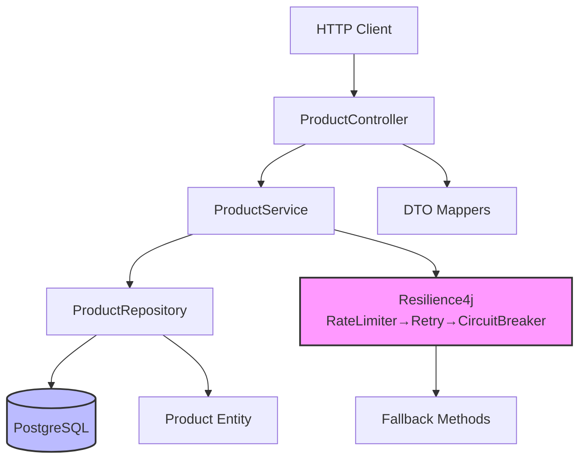
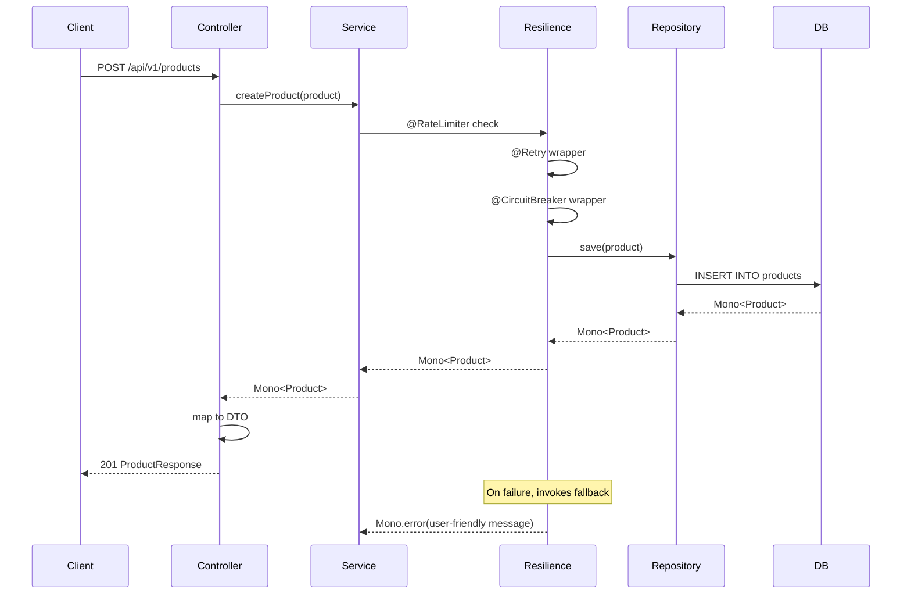

# Technical Implementation: Product Catalog Management

**Feature Reference:** [01-product-catalog-management.md](../features/01-product-catalog-management.md)

**Implementation Date:** 2025
**Status:** ✅ Complete

---

## Architecture Overview

The product catalog is implemented using a layered reactive architecture with Spring WebFlux and R2DBC for non-blocking database access.



---

## Data Model

### Product Entity

**File:** `src/main/kotlin/com/pintailconsultingllc/resiliencyspike/domain/Product.kt`

```kotlin
@Table("products")
data class Product(
    @Id val id: UUID? = null,
    @Column("sku") val sku: String,
    @Column("name") val name: String,
    @Column("description") val description: String? = null,
    @Column("category_id") val categoryId: UUID,
    @Column("price") val price: BigDecimal,
    @Column("stock_quantity") val stockQuantity: Int = 0,
    @Column("is_active") val isActive: Boolean = true,
    @Column("metadata") val metadata: String? = null, // JSONB as String
    @Column("created_at") val createdAt: OffsetDateTime = OffsetDateTime.now(),
    @Column("updated_at") val updatedAt: OffsetDateTime = OffsetDateTime.now()
)
```

**Design Decisions:**
- **UUID Primary Key:** Globally unique, suitable for distributed systems
- **Immutable Data Class:** Kotlin `data class` with `copy()` for updates
- **JSONB Metadata:** Flexible schema for product attributes (color, size, etc.)
- **Soft Delete:** `isActive` flag instead of hard deletion
- **Timestamps:** OffsetDateTime with timezone for multi-region support
- **Denormalized SKU:** Stored separately from ID for business lookups

**Database Schema:**
```sql
CREATE TABLE products (
    id UUID PRIMARY KEY DEFAULT uuid_generate_v4(),
    sku VARCHAR(100) UNIQUE NOT NULL,
    name VARCHAR(255) NOT NULL,
    description TEXT,
    category_id UUID NOT NULL REFERENCES categories(id),
    price DECIMAL(10, 2) NOT NULL,
    stock_quantity INTEGER DEFAULT 0,
    is_active BOOLEAN DEFAULT true,
    metadata JSONB,
    created_at TIMESTAMP WITH TIME ZONE DEFAULT NOW(),
    updated_at TIMESTAMP WITH TIME ZONE DEFAULT NOW()
);

CREATE INDEX idx_products_category_id ON products(category_id);
CREATE INDEX idx_products_sku ON products(sku);
CREATE INDEX idx_products_is_active ON products(is_active);
CREATE INDEX idx_products_price ON products(price);
```

---

## Repository Layer

### ProductRepository Interface

**File:** `src/main/kotlin/com/pintailconsultingllc/resiliencyspike/repository/ProductRepository.kt`

Extends `ReactiveCrudRepository<Product, UUID>` providing:

**Derived Query Methods:**
- `findBySku(sku: String): Mono<Product>` - Spring Data generates query
- `findByCategoryId(categoryId: UUID): Flux<Product>` - Derived from method name
- `findByIsActive(isActive: Boolean): Flux<Product>` - Auto-generated
- `findByCategoryIdAndIsActive(categoryId: UUID, isActive: Boolean): Flux<Product>` - Compound

**Custom @Query Methods:**
```kotlin
@Query("SELECT * FROM products WHERE LOWER(name) LIKE LOWER(CONCAT('%', :searchTerm, '%'))")
fun searchByName(searchTerm: String): Flux<Product>

@Query("SELECT * FROM products WHERE price >= :minPrice AND price <= :maxPrice ORDER BY price ASC")
fun findByPriceRange(minPrice: BigDecimal, maxPrice: BigDecimal): Flux<Product>

@Query("SELECT * FROM products WHERE stock_quantity < :threshold AND is_active = true ORDER BY stock_quantity ASC")
fun findLowStockProducts(threshold: Int): Flux<Product>

@Query("SELECT * FROM products WHERE category_id = :categoryId AND price >= :minPrice AND price <= :maxPrice ORDER BY price ASC")
fun findByCategoryAndPriceRange(categoryId: UUID, minPrice: BigDecimal, maxPrice: BigDecimal): Flux<Product>
```

**Design Decisions:**
- **@Query for Complex Queries:** Explicit SQL for performance and clarity
- **Case-Insensitive Search:** `LOWER()` on both sides for portability
- **Ordering:** Results ordered logically (price ascending, stock ascending)
- **Active Filter:** Low stock only returns active products

---

## Service Layer

### ProductService

**File:** `src/main/kotlin/com/pintailconsultingllc/resiliencyspike/service/ProductService.kt`

**Protected Operations (Resilience4j):**

```kotlin
@RateLimiter(name = "product", fallbackMethod = "createProductFallback")
@Retry(name = "product", fallbackMethod = "createProductFallback")
@CircuitBreaker(name = "product", fallbackMethod = "createProductFallback")
fun createProduct(product: Product): Mono<Product>

@RateLimiter(name = "product", fallbackMethod = "updateProductFallback")
@Retry(name = "product", fallbackMethod = "updateProductFallback")
@CircuitBreaker(name = "product", fallbackMethod = "updateProductFallback")
fun updateProduct(product: Product): Mono<Product>

@RateLimiter(name = "product", fallbackMethod = "findProductByIdFallback")
@Retry(name = "product", fallbackMethod = "findProductByIdFallback")
@CircuitBreaker(name = "product", fallbackMethod = "findProductByIdFallback")
fun findProductById(id: UUID): Mono<Product>
```

**Fallback Pattern:**
```kotlin
private fun createProductFallback(product: Product, ex: Exception): Mono<Product> {
    logger.error("Fallback for createProduct - product: ${product.name}, error: ${ex.message}", ex)
    return Mono.error(RuntimeException("Product service is temporarily unavailable. Please try again later.", ex))
}
```

**Unprotected Operations:**
- Bulk reads (`findAllProducts`, `findActiveProducts`)
- Search operations (`searchProductsByName`)
- Count operations

**Rationale:** Read-heavy operations are left unprotected for performance. Rate limiting write operations prevents database overload.

---

## Controller Layer

### ProductController

**File:** `src/main/kotlin/com/pintailconsultingllc/resiliencyspike/controller/ProductController.kt`

**REST Endpoints (18 total):**

| Method | Path | Description |
|--------|------|-------------|
| POST | `/api/v1/products` | Create product |
| GET | `/api/v1/products/{id}` | Get by ID |
| GET | `/api/v1/products/sku/{sku}` | Get by SKU |
| GET | `/api/v1/products` | List products (optional `activeOnly`) |
| GET | `/api/v1/products/category/{id}` | List by category |
| GET | `/api/v1/products/search?searchTerm=` | Search by name |
| GET | `/api/v1/products/price-range?min=&max=` | Filter by price |
| GET | `/api/v1/products/category/{id}/price-range` | Category + price |
| GET | `/api/v1/products/low-stock?threshold=` | Low stock alert |
| PUT | `/api/v1/products/{id}` | Update product |
| PUT | `/api/v1/products/{id}/stock` | Update stock only |
| POST | `/api/v1/products/{id}/activate` | Activate product |
| POST | `/api/v1/products/{id}/deactivate` | Deactivate (soft delete) |
| DELETE | `/api/v1/products/{id}` | Permanent delete |
| GET | `/api/v1/products/category/{id}/count` | Count by category |
| GET | `/api/v1/products/count/active` | Count active |

**DTO Mapping:**
```kotlin
@PostMapping
@ResponseStatus(HttpStatus.CREATED)
fun createProduct(@RequestBody request: CreateProductRequest): Mono<ProductResponse> {
    val product = Product(
        sku = request.sku,
        name = request.name,
        // ... map fields
    )
    return productService.createProduct(product)
        .map { it.toResponse() }
}
```

**OpenAPI Documentation:**
```kotlin
@Operation(summary = "Create a new product", description = "Creates a new product in the catalog")
@ApiResponses(value = [
    ApiResponse(responseCode = "201", description = "Product created successfully"),
    ApiResponse(responseCode = "400", description = "Invalid input")
])
```

---

## Reactive Flow Diagram



---

## Resilience Configuration

**application.properties:**

```properties
# Rate Limiter
resilience4j.ratelimiter.instances.product.limitForPeriod=100
resilience4j.ratelimiter.instances.product.limitRefreshPeriod=1s
resilience4j.ratelimiter.instances.product.timeoutDuration=0s

# Retry
resilience4j.retry.instances.product.maxAttempts=3
resilience4j.retry.instances.product.waitDuration=500ms
resilience4j.retry.instances.product.enableExponentialBackoff=true
resilience4j.retry.instances.product.exponentialBackoffMultiplier=2

# Circuit Breaker
resilience4j.circuitbreaker.instances.product.slidingWindowSize=10
resilience4j.circuitbreaker.instances.product.minimumNumberOfCalls=5
resilience4j.circuitbreaker.instances.product.failureRateThreshold=50
resilience4j.circuitbreaker.instances.product.waitDurationInOpenState=5s
```

---

## Alternative Implementations Considered

### 1. **Caching Layer**

**Not Implemented:**
```kotlin
@Cacheable("products")
fun findProductById(id: UUID): Mono<Product>
```

**Rationale:** Adds complexity for spike. Production would benefit from Redis cache for frequently accessed products.

### 2. **Event-Driven Updates**

**Not Implemented:**
```kotlin
fun updateProduct(product: Product): Mono<Product> {
    return productRepository.save(product)
        .flatMap { saved ->
            productEventPublisher.publish(ProductUpdatedEvent(saved))
                .thenReturn(saved)
        }
}
```

**Rationale:** Product updates are synchronous in spike. Could publish to Pulsar for inventory sync, price updates, etc.

### 3. **Pagination**

**Not Implemented:**
```kotlin
fun findAllProducts(pageable: Pageable): Mono<Page<Product>>
```

**Rationale:** Spike uses simple `Flux<Product>`. Production should use Spring Data R2DBC pagination support.

### 4. **Elasticsearch Integration**

**Not Implemented:** Full-text search via Elasticsearch

**Current:** Simple LIKE query on name field

**Future:** Index products in Elasticsearch for advanced search (facets, relevance scoring, autocomplete)

### 5. **Optimistic Locking**

**Not Implemented:**
```kotlin
@Version
val version: Long? = null
```

**Rationale:** No concurrent update handling. Production should use `@Version` for optimistic locking.

---

## Testing Strategy

### Service Tests
**File:** `src/test/kotlin/com/pintailconsultingllc/resiliencyspike/service/ProductServiceTest.kt`

```kotlin
@Test
fun shouldCreateProductSuccessfully() {
    val product = TestFixtures.createProduct(id = null, sku = "LAPTOP-001")
    val savedProduct = product.copy(id = UUID.randomUUID())

    whenever(productRepository.save(any())).thenReturn(Mono.just(savedProduct))

    val result = productService.createProduct(product)

    StepVerifier.create(result)
        .expectNextMatches { it.id != null && it.sku == "LAPTOP-001" }
        .verifyComplete()
}
```

### Controller Tests
**File:** `src/test/kotlin/com/pintailconsultingllc/resiliencyspike/controller/ProductControllerTest.kt`

```kotlin
@Test
fun shouldReturnProductById() {
    val productId = UUID.randomUUID()
    val product = TestFixtures.createProduct(id = productId)

    whenever(productService.findProductById(productId))
        .thenReturn(Mono.just(product))

    webTestClient.get()
        .uri("/api/v1/products/$productId")
        .exchange()
        .expectStatus().isOk
        .expectBody<ProductResponse>()
        .consumeWith { response ->
            assertThat(response.responseBody?.id).isEqualTo(productId)
        }
}
```

---

## Performance Considerations

1. **Index Strategy:** Indexes on category_id, sku, is_active, price for common queries
2. **Connection Pooling:** R2DBC pool (initial=10, max=20) prevents connection exhaustion
3. **Backpressure:** Flux streaming respects subscriber demand
4. **Query Optimization:** Explicit @Query with ORDER BY avoids full table scans

---

## Security Considerations

1. **SQL Injection:** Parameterized queries via R2DBC prevent injection
2. **Input Validation:** Jakarta Bean Validation on DTOs (not shown in spike)
3. **Authorization:** No authentication in spike (add Spring Security)
4. **Metadata JSONB:** Validate JSON structure to prevent injection

---

## Observability

1. **Traces:** OpenTelemetry captures all repository calls
2. **Metrics:** Resilience4j exposes circuit breaker, retry, rate limiter metrics
3. **Logs:** Trace/span IDs in log pattern for correlation
4. **Health Checks:** `/actuator/health` includes circuit breaker state

---

## Production Readiness Checklist

- [x] Reactive non-blocking architecture
- [x] Resilience patterns (rate limiter, retry, circuit breaker)
- [x] OpenAPI documentation
- [x] Unit and integration tests
- [x] Distributed tracing
- [ ] Pagination for large result sets
- [ ] Caching (Redis)
- [ ] Input validation
- [ ] Authentication/Authorization
- [ ] Optimistic locking
- [ ] Audit logging
- [ ] Event publishing for inventory sync
