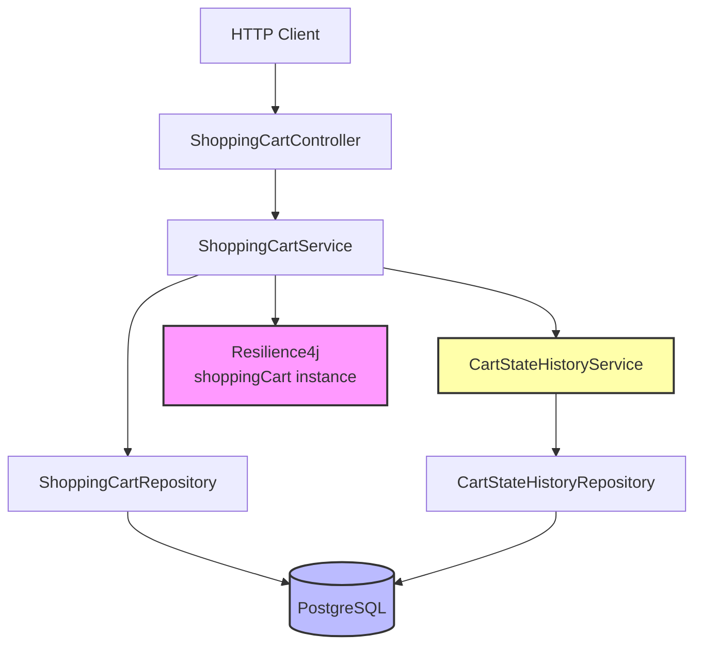
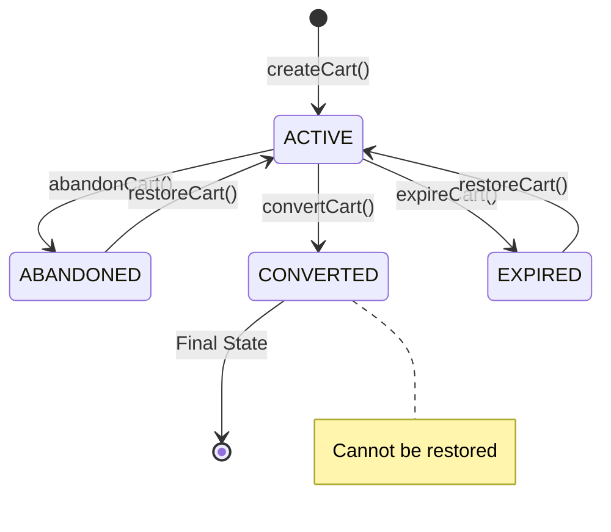
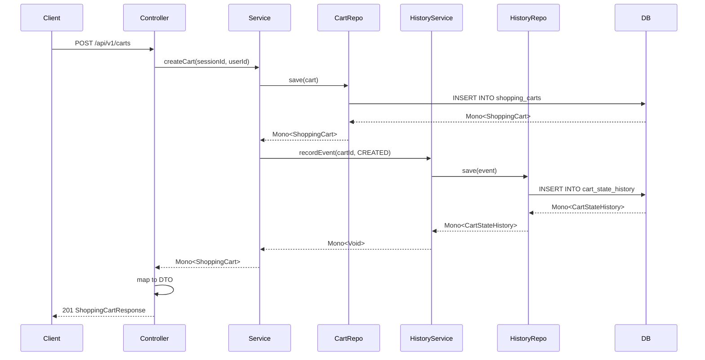

# Technical Implementation: Shopping Cart Lifecycle Management

**Feature Reference:** [02-shopping-cart-lifecycle.md](../features/02-shopping-cart-lifecycle.md)

**Implementation Date:** 2024-2025
**Status:** ✅ Complete

---

## Architecture Overview



---

## Data Model

### ShoppingCart Entity

**File:** `src/main/kotlin/com/pintailconsultingllc/resiliencyspike/domain/ShoppingCart.kt`

```kotlin
@Table("shopping_carts")
data class ShoppingCart(
    @Id val id: Long? = null,                          // Sequential ID for joins
    @Column("cart_uuid") val cartUuid: UUID = UUID.randomUUID(), // External ID
    @Column("session_id") val sessionId: String,       // Browser session
    @Column("user_id") val userId: String? = null,     // Authenticated user
    @Column("status") val status: CartStatus = CartStatus.ACTIVE,
    @Column("total_amount_cents") val totalAmountCents: Long = 0,
    @Column("expires_at") val expiresAt: OffsetDateTime,
    @Column("converted_at") val convertedAt: OffsetDateTime? = null,
    @Column("created_at") val createdAt: OffsetDateTime = OffsetDateTime.now(),
    @Column("updated_at") val updatedAt: OffsetDateTime = OffsetDateTime.now()
)

enum class CartStatus {
    ACTIVE,
    ABANDONED,
    CONVERTED,
    EXPIRED
}
```

**Design Decisions:**

1. **Dual Identifiers:**
   - `id`: Sequential `Long` for database joins and internal references
   - `cartUuid`: UUID for external API exposure (security, uniqueness)
   - **Rationale:** Internal sequential IDs for performance, UUIDs for API safety

2. **Session vs User:**
   - `sessionId`: Required, tracks anonymous sessions
   - `userId`: Optional, populated after login
   - **Pattern:** Guest-to-user conversion flow

3. **Status Enum:**
   - State machine: ACTIVE → {ABANDONED, CONVERTED, EXPIRED}
   - Can restore: {ABANDONED, EXPIRED} → ACTIVE
   - Final state: CONVERTED (cannot restore)

4. **Monetary Values in Cents:**
   - `totalAmountCents`: Long integer, not BigDecimal
   - **Rationale:** Precision, performance, JSON serialization

5. **Expiration Tracking:**
   - `expiresAt`: Configurable per cart (default 7 days)
   - `convertedAt`: Timestamp of conversion (analytics)

### Database Schema

```sql
CREATE TABLE shopping_carts (
    id BIGSERIAL PRIMARY KEY,
    cart_uuid UUID UNIQUE NOT NULL DEFAULT uuid_generate_v4(),
    session_id VARCHAR(255) NOT NULL,
    user_id VARCHAR(255),
    status VARCHAR(20) NOT NULL DEFAULT 'ACTIVE',
    total_amount_cents BIGINT DEFAULT 0,
    expires_at TIMESTAMP WITH TIME ZONE NOT NULL,
    converted_at TIMESTAMP WITH TIME ZONE,
    created_at TIMESTAMP WITH TIME ZONE DEFAULT NOW(),
    updated_at TIMESTAMP WITH TIME ZONE DEFAULT NOW(),

    CHECK (total_amount_cents >= 0),
    CHECK (status IN ('ACTIVE', 'ABANDONED', 'CONVERTED', 'EXPIRED'))
);

CREATE INDEX idx_shopping_carts_session_id ON shopping_carts(session_id);
CREATE INDEX idx_shopping_carts_user_id ON shopping_carts(user_id);
CREATE INDEX idx_shopping_carts_status ON shopping_carts(status);
CREATE INDEX idx_shopping_carts_expires_at ON shopping_carts(expires_at);
CREATE INDEX idx_shopping_carts_cart_uuid ON shopping_carts(cart_uuid);
```

---

## Repository Layer

### ShoppingCartRepository

**File:** `src/main/kotlin/com/pintailconsultingllc/resiliencyspike/repository/ShoppingCartRepository.kt`

Extends `ReactiveCrudRepository<ShoppingCart, Long>` with custom queries:

```kotlin
interface ShoppingCartRepository : ReactiveCrudRepository<ShoppingCart, Long> {

    // Session-based queries
    fun findBySessionId(sessionId: String): Mono<ShoppingCart>
    fun findBySessionIdAndStatus(sessionId: String, status: CartStatus): Mono<ShoppingCart>

    // User-based queries
    fun findByUserId(userId: String): Flux<ShoppingCart>
    fun findByUserIdAndStatus(userId: String, status: CartStatus): Mono<ShoppingCart>

    // UUID lookup
    fun findByCartUuid(cartUuid: UUID): Mono<ShoppingCart>

    // Status queries
    fun findByStatus(status: CartStatus): Flux<ShoppingCart>
    fun countByStatus(status: CartStatus): Mono<Long>

    // Expiration queries
    @Query("SELECT * FROM shopping_carts WHERE expires_at < :currentTime AND status = 'ACTIVE'")
    fun findExpiredCarts(currentTime: OffsetDateTime): Flux<ShoppingCart>

    @Query("""
        SELECT * FROM shopping_carts
        WHERE updated_at < :cutoffTime
        AND status = 'ACTIVE'
        AND id NOT IN (SELECT DISTINCT cart_id FROM cart_items)
    """)
    fun findAbandonedCarts(cutoffTime: OffsetDateTime): Flux<ShoppingCart>

    // Cart item queries
    @Query("""
        SELECT DISTINCT c.* FROM shopping_carts c
        INNER JOIN cart_items ci ON c.id = ci.cart_id
        WHERE c.status = :status
    """)
    fun findCartsWithItems(status: CartStatus): Flux<ShoppingCart>

    @Query("""
        SELECT * FROM shopping_carts c
        WHERE NOT EXISTS (SELECT 1 FROM cart_items WHERE cart_id = c.id)
    """)
    fun findEmptyCarts(): Flux<ShoppingCart>
}
```

**Design Decisions:**

1. **Derived Queries:** Spring Data generates queries for simple lookups
2. **@Query for Complex Logic:** Explicit SQL for abandoned/expired carts
3. **Correlated Subqueries:** Empty carts use NOT EXISTS for efficiency
4. **Index Utilization:** Queries designed to leverage indexes

---

## Service Layer

### ShoppingCartService

**File:** `src/main/kotlin/com/pintailconsultingllc/resiliencyspike/service/ShoppingCartService.kt`

#### State Transition Logic



#### Protected Operations

```kotlin
@RateLimiter(name = "shoppingCart", fallbackMethod = "createCartFallback")
@Retry(name = "shoppingCart", fallbackMethod = "createCartFallback")
@CircuitBreaker(name = "shoppingCart", fallbackMethod = "createCartFallback")
fun createCart(sessionId: String, userId: String?, expiresAt: OffsetDateTime?): Mono<ShoppingCart> {
    val cart = ShoppingCart(
        sessionId = sessionId,
        userId = userId,
        expiresAt = expiresAt ?: OffsetDateTime.now().plusDays(7)
    )
    return cartRepository.save(cart)
        .flatMap { savedCart ->
            cartStateHistoryService.recordEvent(savedCart.id!!, CartEventType.CREATED)
                .thenReturn(savedCart)
        }
}
```

**Event Sourcing Integration:**
Every cart creation records a CREATED event in `cart_state_history`.

#### Status Update Pattern

```kotlin
fun updateCartStatus(cartId: Long, newStatus: CartStatus): Mono<ShoppingCart> {
    return cartRepository.findById(cartId)
        .flatMap { cart ->
            val previousStatus = cart.status
            val updatedCart = cart.copy(
                status = newStatus,
                convertedAt = if (newStatus == CartStatus.CONVERTED) OffsetDateTime.now() else cart.convertedAt
            )
            cartRepository.save(updatedCart)
                .flatMap { savedCart ->
                    val eventType = when (newStatus) {
                        CartStatus.ABANDONED -> CartEventType.ABANDONED
                        CartStatus.CONVERTED -> CartEventType.CONVERTED
                        CartStatus.EXPIRED -> CartEventType.EXPIRED
                        CartStatus.ACTIVE -> CartEventType.RESTORED
                    }
                    cartStateHistoryService.recordStatusChange(
                        savedCart.id!!,
                        eventType,
                        previousStatus.toString(),
                        newStatus.toString()
                    ).thenReturn(savedCart)
                }
        }
}
```

**Design Decision:** Single `updateCartStatus()` method handles all transitions with event recording.

#### Batch Processing

```kotlin
fun processExpiredCarts(): Mono<Long> {
    return findExpiredCarts()
        .flatMap { cart -> expireCart(cart.id!!) }
        .count()
}

fun processAbandonedCarts(hoursInactive: Long = 24): Mono<Long> {
    return findAbandonedCarts(hoursInactive)
        .flatMap { cart -> abandonCart(cart.id!!) }
        .count()
}
```

**Use Case:** Scheduled job calls these methods to transition stale carts.

---

## Controller Layer

### ShoppingCartController (24 Endpoints)

**File:** `src/main/kotlin/com/pintailconsultingllc/resiliencyspike/controller/ShoppingCartController.kt`

#### Key Endpoint Patterns

**1. Get or Create Pattern:**
```kotlin
@GetMapping("/session/{sessionId}")
fun getOrCreateCartForSession(
    @PathVariable sessionId: String,
    @RequestParam(required = false) userId: String?
): Mono<ShoppingCartResponse> {
    return shoppingCartService.findOrCreateCart(sessionId, userId)
        .map { it.toResponse() }
}
```

**Rationale:** Simplifies client code - no need to explicitly create carts.

**2. State Transition Endpoints:**
```kotlin
@PostMapping("/{cartId}/abandon")
fun abandonCart(@PathVariable cartId: Long): Mono<ShoppingCartResponse>

@PostMapping("/{cartId}/convert")
fun convertCart(@PathVariable cartId: Long): Mono<ShoppingCartResponse>

@PostMapping("/{cartId}/expire")
fun expireCart(@PathVariable cartId: Long): Mono<ShoppingCartResponse>

@PostMapping("/{cartId}/restore")
fun restoreCart(@PathVariable cartId: Long): Mono<ShoppingCartResponse>
```

**3. Batch Processing Endpoints:**
```kotlin
@PostMapping("/process-expired")
fun processExpiredCarts(): Mono<Long>

@PostMapping("/process-abandoned")
fun processAbandonedCarts(@RequestParam(defaultValue = "24") hoursInactive: Long): Mono<Long>
```

**Returns:** Count of processed carts for monitoring/logging.

**4. Statistics Endpoint:**
```kotlin
@GetMapping("/statistics")
fun getCartStatistics(): Mono<CartStatisticsResponse> {
    return Mono.zip(
        shoppingCartService.countCartsByStatus(CartStatus.ACTIVE),
        shoppingCartService.countCartsByStatus(CartStatus.ABANDONED),
        shoppingCartService.countCartsByStatus(CartStatus.CONVERTED),
        shoppingCartService.countCartsByStatus(CartStatus.EXPIRED)
    ).map { (active, abandoned, converted, expired) ->
        CartStatisticsResponse(
            totalCarts = active + abandoned + converted + expired,
            activeCarts = active,
            abandonedCarts = abandoned,
            convertedCarts = converted,
            expiredCarts = expired
        )
    }
}
```

**Pattern:** `Mono.zip()` executes queries in parallel, then combines results.

---

## Reactive Flow: Cart Creation with Event Recording



**Design Decision:** Event recording uses `flatMap()` to chain operations, ensuring event is persisted before returning to client.

---

## Alternative Implementations Considered

### 1. **Redis for Session Management**

**Not Implemented:**
```kotlin
@Cacheable("active-carts")
fun findActiveCartBySessionId(sessionId: String): Mono<ShoppingCart>
```

**Rationale:**
- Spike uses PostgreSQL only
- Production benefit: Fast session lookups, reduced DB load
- Trade-off: Cache invalidation complexity

### 2. **Optimistic Locking for Concurrent Updates**

**Not Implemented:**
```kotlin
@Version
val version: Long? = null
```

**Rationale:**
- No concurrent update handling in spike
- Production concern: Multiple devices updating same cart
- Solution: Add `@Version` field, handle `OptimisticLockingFailureException`

### 3. **Event-Driven Cart Expiration**

**Current:** Batch processing via scheduled job

**Alternative:**
```kotlin
// Publish event to Pulsar, consumer processes expiration
pulsarTemplate.send("cart-expiration-topic", CartExpirationEvent(cartId, expiresAt))
```

**Trade-offs:**
- Batch: Simple, predictable, but delayed
- Event-driven: Real-time, but adds infrastructure complexity

### 4. **Soft Delete on Converted Carts**

**Not Implemented:** Physical deletion after conversion

**Alternative:** Add `deleted_at` timestamp, filter in queries

**Rationale:** Spike prioritizes simplicity. Production may need audit trail of all carts.

### 5. **Cart Merging**

**Not Implemented:** Merge anonymous cart into user cart on login

```kotlin
fun mergeAnonymousCart(sessionId: String, userId: String): Mono<ShoppingCart> {
    return findActiveCartBySessionId(sessionId)
        .zipWith(findActiveCartByUserId(userId))
        .flatMap { (anonymousCart, userCart) ->
            // Merge items, delete anonymous cart
        }
}
```

**Rationale:** Complex logic, out of scope for spike. Common e-commerce feature.

---

## Testing Strategy

### Service Tests

```kotlin
@Test
fun shouldCreateCartWithDefaultExpiration() {
    val sessionId = "session-123"
    val cart = TestFixtures.createCart(id = null, sessionId = sessionId)
    val savedCart = cart.copy(id = 1L)

    whenever(cartRepository.save(any())).thenReturn(Mono.just(savedCart))
    whenever(cartStateHistoryService.recordEvent(any(), any())).thenReturn(Mono.empty())

    val result = shoppingCartService.createCart(sessionId)

    StepVerifier.create(result)
        .expectNextMatches { it.id == 1L && it.sessionId == sessionId }
        .verifyComplete()
}

@Test
fun shouldTransitionCartToConverted() {
    val cartId = 1L
    val cart = TestFixtures.createCart(id = cartId, status = CartStatus.ACTIVE)
    val convertedCart = cart.copy(status = CartStatus.CONVERTED)

    whenever(cartRepository.findById(cartId)).thenReturn(Mono.just(cart))
    whenever(cartRepository.save(any())).thenReturn(Mono.just(convertedCart))
    whenever(cartStateHistoryService.recordStatusChange(any(), any(), any(), any()))
        .thenReturn(Mono.empty())

    val result = shoppingCartService.convertCart(cartId)

    StepVerifier.create(result)
        .expectNextMatches { it.status == CartStatus.CONVERTED && it.convertedAt != null }
        .verifyComplete()
}
```

### Controller Tests

```kotlin
@Test
fun shouldReturnCartStatistics() {
    whenever(shoppingCartService.countCartsByStatus(CartStatus.ACTIVE))
        .thenReturn(Mono.just(10L))
    whenever(shoppingCartService.countCartsByStatus(CartStatus.ABANDONED))
        .thenReturn(Mono.just(5L))
    // ...

    webTestClient.get()
        .uri("/api/v1/carts/statistics")
        .exchange()
        .expectStatus().isOk
        .expectBody<CartStatisticsResponse>()
        .consumeWith { response ->
            assertThat(response.responseBody?.totalCarts).isEqualTo(15L)
        }
}
```

---

## Performance Considerations

1. **Index Strategy:**
   - `session_id`: Fast session lookup
   - `user_id`: User cart history
   - `status`: Status-based filtering
   - `expires_at`: Batch expiration queries

2. **Batch Processing Optimization:**
   - `findExpiredCarts()`: Filtered by status + expiration (uses composite index)
   - `processExpiredCarts()`: Uses `flatMap()` for parallel updates (backpressure-aware)

3. **Dual ID Strategy:**
   - Sequential IDs for fast joins (cart_items reference cart.id)
   - UUIDs for API security (no sequential ID guessing)

---

## Security Considerations

1. **Session Hijacking:** Validate session IDs server-side
2. **User Authorization:** Verify userId matches authenticated user
3. **UUID Exposure:** UUIDs prevent cart enumeration attacks
4. **SQL Injection:** Parameterized queries prevent injection

---

## Production Readiness Checklist

- [x] State machine with event sourcing
- [x] Resilience patterns on critical operations
- [x] Batch processing for expiration/abandonment
- [x] Comprehensive REST API (24 endpoints)
- [x] OpenAPI documentation
- [x] Distributed tracing
- [ ] Redis caching for active carts
- [ ] Optimistic locking
- [ ] Cart merging on login
- [ ] Real-time expiration (event-driven)
- [ ] Scheduled jobs (Spring @Scheduled)
