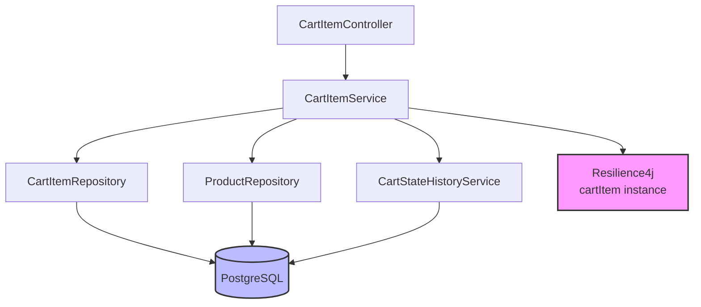
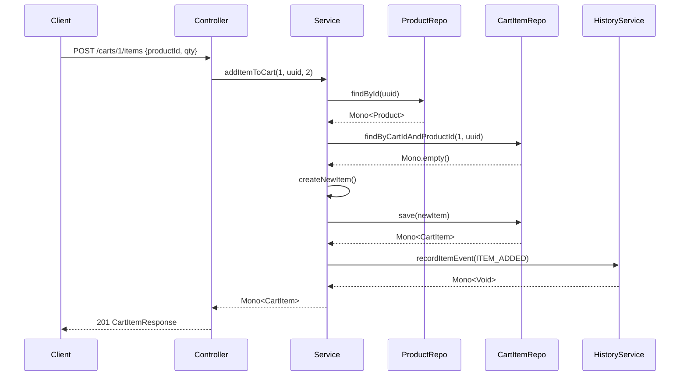

# Technical Implementation: Cart Item Management

**Feature Reference:** [03-cart-item-management.md](../features/03-cart-item-management.md)

**Implementation Date:** 2025
**Status:** ✅ Complete

---

## Architecture Overview



---

## Data Model

### CartItem Entity

```kotlin
@Table("cart_items")
data class CartItem(
    @Id val id: Long? = null,
    @Column("cart_id") val cartId: Long,
    @Column("product_id") val productId: UUID,
    @Column("sku") val sku: String,                     // Denormalized for performance
    @Column("product_name") val productName: String,    // Snapshot at add time
    @Column("quantity") val quantity: Int,
    @Column("unit_price_cents") val unitPriceCents: Long,
    @Column("line_total_cents") val lineTotalCents: Long,
    @Column("discount_amount_cents") val discountAmountCents: Long = 0,
    @Column("metadata") val metadata: String? = null,   // JSONB for customizations
    @Column("added_at") val addedAt: OffsetDateTime = OffsetDateTime.now()
)
```

### Database Schema

```sql
CREATE TABLE cart_items (
    id BIGSERIAL PRIMARY KEY,
    cart_id BIGINT NOT NULL REFERENCES shopping_carts(id) ON DELETE CASCADE,
    product_id UUID NOT NULL REFERENCES products(id),
    sku VARCHAR(100) NOT NULL,
    product_name VARCHAR(255) NOT NULL,
    quantity INTEGER NOT NULL CHECK (quantity > 0),
    unit_price_cents BIGINT NOT NULL CHECK (unit_price_cents >= 0),
    line_total_cents BIGINT NOT NULL CHECK (line_total_cents >= 0),
    discount_amount_cents BIGINT DEFAULT 0 CHECK (discount_amount_cents >= 0),
    metadata JSONB,
    added_at TIMESTAMP WITH TIME ZONE DEFAULT NOW(),

    UNIQUE (cart_id, product_id)  -- Prevent duplicate items
);

CREATE INDEX idx_cart_items_cart_id ON cart_items(cart_id);
CREATE INDEX idx_cart_items_product_id ON cart_items(product_id);
```

**Design Decisions:**

1. **Price Snapshot:** `unitPriceCents` captured at add time (pricing history)
2. **Denormalized Fields:** SKU and product name for performance (no join needed)
3. **Unique Constraint:** One entry per product per cart (update quantity instead)
4. **Cascade Delete:** Deleting cart removes items automatically
5. **Line Total:** Pre-calculated for query performance
6. **Monetary Precision:** All prices in cents (Long) for accuracy

---

## Repository Layer

### CartItemRepository

```kotlin
interface CartItemRepository : ReactiveCrudRepository<CartItem, Long> {

    // Basic queries
    fun findByCartId(cartId: Long): Flux<CartItem>
    fun findByCartIdAndProductId(cartId: Long, productId: UUID): Mono<CartItem>
    fun countByCartId(cartId: Long): Mono<Long>
    fun deleteByCartId(cartId: Long): Mono<Void>

    // Aggregations
    @Query("SELECT COALESCE(SUM(line_total_cents), 0) FROM cart_items WHERE cart_id = :cartId")
    fun calculateCartTotal(cartId: Long): Mono<Long>

    @Query("SELECT COALESCE(SUM(quantity), 0) FROM cart_items WHERE cart_id = :cartId")
    fun calculateCartItemCount(cartId: Long): Mono<Int>

    // Filtering queries
    @Query("SELECT * FROM cart_items WHERE cart_id = :cartId AND discount_amount_cents > 0")
    fun findDiscountedItems(cartId: Long): Flux<CartItem>

    @Query("SELECT * FROM cart_items WHERE cart_id = :cartId AND unit_price_cents >= :minPriceCents")
    fun findHighValueItems(cartId: Long, minPriceCents: Long): Flux<CartItem>

    @Query("SELECT * FROM cart_items WHERE cart_id = :cartId AND quantity >= :minQuantity")
    fun findBulkItems(cartId: Long, minQuantity: Int): Flux<CartItem>
}
```

**Optimization:** `COALESCE(SUM(...), 0)` handles empty carts gracefully.

---

## Service Layer

### Key Operations

#### 1. Add Item (Upsert Pattern)

```kotlin
@RateLimiter(name = "cartItem", fallbackMethod = "addItemToCartFallback")
@Retry(name = "cartItem", fallbackMethod = "addItemToCartFallback")
@CircuitBreaker(name = "cartItem", fallbackMethod = "addItemToCartFallback")
fun addItemToCart(cartId: Long, productId: UUID, quantity: Int): Mono<CartItem> {
    return productRepository.findById(productId)
        .flatMap { product ->
            cartItemRepository.findByCartIdAndProductId(cartId, productId)
                .flatMap { existingItem ->
                    // Update quantity
                    updateExistingItem(cartId, existingItem, quantity, productId)
                }
                .switchIfEmpty(
                    // Create new item
                    createNewItem(cartId, productId, quantity, product)
                )
        }
}
```

**Flow:**
1. Fetch product (for pricing)
2. Check if item exists
3. If exists: increment quantity
4. If new: create with product snapshot
5. Record event in cart history

#### 2. Price Conversion

```kotlin
private fun convertToCents(price: BigDecimal): Long {
    return price.multiply(BigDecimal(100))
        .setScale(0, RoundingMode.HALF_UP)
        .toLong()
}
```

**Rationale:** BigDecimal → Long conversion with banker's rounding for .5 edge cases.

#### 3. Item Validation

```kotlin
fun validateItemAvailability(cartId: Long, productId: UUID): Mono<Boolean> {
    return cartItemRepository.findByCartIdAndProductId(cartId, productId)
        .flatMap { item ->
            productRepository.findById(productId)
                .map { product ->
                    product.isActive && product.stockQuantity >= item.quantity
                }
        }
        .defaultIfEmpty(false)
}
```

**Checks:**
- Product still exists
- Product is active (not deactivated)
- Sufficient stock for quantity

#### 4. Bulk Validation

```kotlin
fun validateCartItems(cartId: Long): Flux<Pair<CartItem, Boolean>> {
    return cartItemRepository.findByCartId(cartId)
        .flatMap { item ->
            validateItemAvailability(cartId, item.productId)
                .map { isValid -> Pair(item, isValid) }
        }
}
```

**Use Case:** Pre-checkout validation - ensure all items available.

---

## Controller Layer (15 Endpoints)

### Nested Resource Pattern

```
/api/v1/carts/{cartId}/items
```

All cart item endpoints are scoped to a specific cart.

### Key Endpoints

| Method | Path | Description |
|--------|------|-------------|
| POST | `/api/v1/carts/{cartId}/items` | Add item (upsert) |
| GET | `/api/v1/carts/{cartId}/items` | List all items |
| GET | `/api/v1/carts/{cartId}/items/{productId}` | Get specific item |
| PUT | `/api/v1/carts/{cartId}/items/{productId}/quantity` | Update quantity |
| PUT | `/api/v1/carts/{cartId}/items/{productId}/discount` | Apply discount |
| DELETE | `/api/v1/carts/{cartId}/items/{productId}` | Remove item |
| DELETE | `/api/v1/carts/{cartId}/items` | Clear cart |
| GET | `/api/v1/carts/{cartId}/items/totals` | Calculate totals |
| GET | `/api/v1/carts/{cartId}/items/validate` | Validate all items |

### Totals Calculation

```kotlin
@GetMapping("/totals")
fun getCartTotals(@PathVariable cartId: Long): Mono<CartTotalsResponse> {
    return Mono.zip(
        cartItemService.calculateCartTotal(cartId),
        cartItemService.calculateCartItemCount(cartId)
    ).map { (totalCents, itemCount) ->
        CartTotalsResponse(
            subtotalCents = totalCents,
            taxAmountCents = 0,          // TODO: Tax calculation
            discountAmountCents = 0,     // TODO: Cart-level discounts
            totalAmountCents = totalCents,
            itemCount = itemCount
        )
    }
}
```

**Pattern:** Parallel aggregation with `Mono.zip()`.

---

## Event Sourcing Integration

Every item operation records an event:

```kotlin
private fun createNewItem(...): Mono<CartItem> {
    val newItem = CartItem(...)
    return cartItemRepository.save(newItem)
        .flatMap { savedItem ->
            cartStateHistoryService.recordItemEvent(
                cartId,
                CartEventType.ITEM_ADDED,
                mapOf(
                    "product_id" to productId.toString(),
                    "quantity" to quantity.toString(),
                    "unit_price_cents" to unitPriceCents.toString()
                )
            ).thenReturn(savedItem)
        }
}
```

**Events:**
- `ITEM_ADDED`: New product added
- `ITEM_REMOVED`: Product removed
- `QUANTITY_CHANGED`: Quantity updated
- `ITEM_UPDATED`: Discount or metadata changed

---

## Reactive Flow: Add Item



---

## Alternative Implementations

### 1. **Optimistic Locking**

**Not Implemented:**
```kotlin
@Version
val version: Long? = null
```

**Rationale:** Concurrent quantity updates could cause race conditions. Add versioning for production.

### 2. **Inventory Reservation**

**Not Implemented:** Reserve stock when item added

```kotlin
fun addItemToCart(...): Mono<CartItem> {
    return inventoryService.reserveStock(productId, quantity)
        .flatMap { reservation ->
            // Create cart item with reservation ID
        }
}
```

**Trade-offs:**
- Current: No reservation (stock checked at checkout)
- Proposed: Reserve stock immediately (prevents overselling, adds complexity)

### 3. **Price History**

**Not Implemented:** Track price changes

```kotlin
@Column("original_price_cents") val originalPriceCents: Long
@Column("current_price_cents") val currentPriceCents: Long
```

**Use Case:** Show "Price dropped!" messages in cart.

### 4. **Quantity Limits**

**Not Implemented:** Max quantity per product

```kotlin
fun addItemToCart(...): Mono<CartItem> {
    if (quantity > MAX_QUANTITY_PER_ITEM) {
        return Mono.error(QuantityExceededException())
    }
    // ...
}
```

---

## Performance Considerations

1. **Denormalization:** SKU and name stored with item (no join on list)
2. **Aggregation Optimization:** Database-level SUM() for totals
3. **Unique Constraint:** Prevents duplicate items at DB level
4. **Cascade Delete:** Database handles cleanup on cart deletion

---

## Testing Strategy

```kotlin
@Test
fun shouldAddNewItemToCart() {
    val cartId = 1L
    val productId = UUID.randomUUID()
    val product = TestFixtures.createProduct(id = productId, price = BigDecimal("19.99"))
    val cartItem = TestFixtures.createCartItem(cartId = cartId, productId = productId)

    whenever(productRepository.findById(productId)).thenReturn(Mono.just(product))
    whenever(cartItemRepository.findByCartIdAndProductId(cartId, productId))
        .thenReturn(Mono.empty())
    whenever(cartItemRepository.save(any())).thenReturn(Mono.just(cartItem))
    whenever(cartStateHistoryService.recordItemEvent(any(), any(), any()))
        .thenReturn(Mono.empty())

    val result = cartItemService.addItemToCart(cartId, productId, 2)

    StepVerifier.create(result)
        .expectNextMatches { it.quantity == 2 && it.unitPriceCents == 1999L }
        .verifyComplete()
}

@Test
fun shouldIncrementQuantityForExistingItem() {
    val existingItem = TestFixtures.createCartItem(quantity = 1)

    whenever(productRepository.findById(any())).thenReturn(Mono.just(TestFixtures.createProduct()))
    whenever(cartItemRepository.findByCartIdAndProductId(any(), any()))
        .thenReturn(Mono.just(existingItem))
    whenever(cartItemRepository.save(any()))
        .thenAnswer { invocation ->
            Mono.just(invocation.getArgument<CartItem>(0))
        }
    whenever(cartStateHistoryService.recordItemEvent(any(), any(), any()))
        .thenReturn(Mono.empty())

    val result = cartItemService.addItemToCart(1L, UUID.randomUUID(), 2)

    StepVerifier.create(result)
        .expectNextMatches { it.quantity == 3 }  // 1 + 2
        .verifyComplete()
}
```

---

## Production Readiness

- [x] Upsert logic (add or update quantity)
- [x] Price snapshot at add time
- [x] Resilience patterns on critical operations
- [x] Item validation (stock, active status)
- [x] Event sourcing integration
- [x] Monetary precision (cents)
- [ ] Optimistic locking
- [ ] Inventory reservation
- [ ] Quantity limits
- [ ] Price change notifications
- [ ] Bulk add/remove operations
