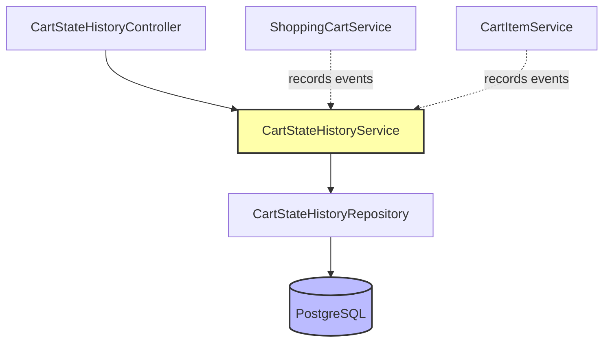
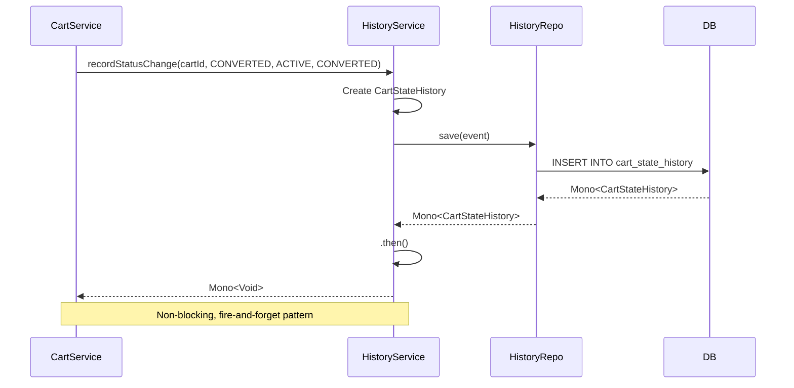

# Technical Implementation: Cart State History Tracking

**Feature Reference:** [04-cart-state-history-tracking.md](../features/04-cart-state-history-tracking.md)

**Implementation Date:** 2025
**Status:** ✅ Complete

---

## Architecture Overview



**Event Sourcing Pattern:** All cart state changes flow through CartStateHistoryService.

---

## Data Model

### CartStateHistory Entity

```kotlin
@Table("cart_state_history")
data class CartStateHistory(
    @Id val id: Long? = null,
    @Column("cart_id") val cartId: Long,
    @Column("event_type") val eventType: CartEventType,
    @Column("old_state") val oldState: String? = null,
    @Column("new_state") val newState: String? = null,
    @Column("metadata") val metadata: String? = null,  // JSONB
    @Column("created_at") val createdAt: OffsetDateTime = OffsetDateTime.now()
)

enum class CartEventType {
    CREATED,
    ITEM_ADDED,
    ITEM_REMOVED,
    QUANTITY_CHANGED,
    ITEM_UPDATED,
    STATUS_CHANGED,
    ABANDONED,
    CONVERTED,
    EXPIRED,
    RESTORED
}
```

### Database Schema

```sql
CREATE TABLE cart_state_history (
    id BIGSERIAL PRIMARY KEY,
    cart_id BIGINT NOT NULL REFERENCES shopping_carts(id) ON DELETE CASCADE,
    event_type VARCHAR(50) NOT NULL,
    old_state VARCHAR(50),
    new_state VARCHAR(50),
    metadata JSONB,
    created_at TIMESTAMP WITH TIME ZONE DEFAULT NOW()
);

CREATE INDEX idx_cart_state_history_cart_id ON cart_state_history(cart_id);
CREATE INDEX idx_cart_state_history_event_type ON cart_state_history(event_type);
CREATE INDEX idx_cart_state_history_created_at ON cart_state_history(created_at DESC);
CREATE INDEX idx_cart_state_history_cart_event ON cart_state_history(cart_id, event_type);
```

**Design Decisions:**

1. **Immutable Events:** No UPDATE/DELETE on history records (append-only log)
2. **JSONB Metadata:** Flexible context storage (product IDs, quantities, etc.)
3. **Nullable States:** Not all events have state transitions (e.g., ITEM_ADDED)
4. **Cascade Delete:** History removed with cart (configurable per requirements)
5. **Indexed Queries:** Optimized for cart_id + event_type lookups

---

## Service Layer

### CartStateHistoryService

**File:** `src/main/kotlin/com/pintailconsultingllc/resiliencyspike/service/CartStateHistoryService.kt`

#### Event Recording Methods

```kotlin
// Simple event (no state change)
fun recordEvent(cartId: Long, eventType: CartEventType): Mono<Void> {
    val event = CartStateHistory(
        cartId = cartId,
        eventType = eventType
    )
    return historyRepository.save(event).then()
}

// Status change event
fun recordStatusChange(
    cartId: Long,
    eventType: CartEventType,
    oldState: String,
    newState: String
): Mono<Void> {
    val event = CartStateHistory(
        cartId = cartId,
        eventType = eventType,
        oldState = oldState,
        newState = newState
    )
    return historyRepository.save(event).then()
}

// Item event with metadata
fun recordItemEvent(
    cartId: Long,
    eventType: CartEventType,
    metadata: Map<String, String>
): Mono<Void> {
    val event = CartStateHistory(
        cartId = cartId,
        eventType = eventType,
        metadata = objectMapper.writeValueAsString(metadata)
    )
    return historyRepository.save(event).then()
}
```

**Pattern:** Three overloaded methods for different event types.

#### Query Methods

```kotlin
fun findCartHistory(cartId: Long): Flux<CartStateHistory> {
    return historyRepository.findByCartIdOrderByCreatedAtAsc(cartId)
}

fun findRecentCartEvents(cartId: Long, hoursBack: Long): Flux<CartStateHistory> {
    val cutoffTime = OffsetDateTime.now().minusHours(hoursBack)
    return historyRepository.findByCartIdAndCreatedAtAfter(cartId, cutoffTime)
}

fun findEventsByType(cartId: Long, eventType: CartEventType): Flux<CartStateHistory> {
    return historyRepository.findByCartIdAndEventType(cartId, eventType)
}

fun findMostRecentEvent(cartId: Long): Mono<CartStateHistory> {
    return historyRepository.findFirstByCartIdOrderByCreatedAtDesc(cartId)
}
```

#### Analytics Queries

```kotlin
fun calculateConversionRate(startDate: OffsetDateTime, endDate: OffsetDateTime): Mono<Double> {
    return Mono.zip(
        historyRepository.countByEventTypeAndCreatedAtBetween(CartEventType.CREATED, startDate, endDate),
        historyRepository.countByEventTypeAndCreatedAtBetween(CartEventType.CONVERTED, startDate, endDate)
    ).map { (created, converted) ->
        if (created == 0L) 0.0 else (converted.toDouble() / created) * 100
    }
}

fun calculateAbandonmentRate(startDate: OffsetDateTime, endDate: OffsetDateTime): Mono<Double> {
    return Mono.zip(
        historyRepository.countByEventTypeAndCreatedAtBetween(CartEventType.CREATED, startDate, endDate),
        historyRepository.countByEventTypeAndCreatedAtBetween(CartEventType.ABANDONED, startDate, endDate)
    ).map { (created, abandoned) ->
        if (created == 0L) 0.0 else (abandoned.toDouble() / created) * 100
    }
}
```

---

## Repository Layer

```kotlin
interface CartStateHistoryRepository : ReactiveCrudRepository<CartStateHistory, Long> {

    // Cart history queries
    fun findByCartIdOrderByCreatedAtAsc(cartId: Long): Flux<CartStateHistory>
    fun findByCartIdOrderByCreatedAtDesc(cartId: Long): Flux<CartStateHistory>
    fun findFirstByCartIdOrderByCreatedAtDesc(cartId: Long): Mono<CartStateHistory>

    // Event type queries
    fun findByCartIdAndEventType(cartId: Long, eventType: CartEventType): Flux<CartStateHistory>
    fun countByCartIdAndEventType(cartId: Long, eventType: CartEventType): Mono<Long>
    fun countByCartId(cartId: Long): Mono<Long>

    // Time-based queries
    fun findByCartIdAndCreatedAtAfter(cartId: Long, cutoffTime: OffsetDateTime): Flux<CartStateHistory>
    fun findByCreatedAtBetween(startDate: OffsetDateTime, endDate: OffsetDateTime): Flux<CartStateHistory>
    fun findByEventTypeAndCreatedAtBetween(
        eventType: CartEventType,
        startDate: OffsetDateTime,
        endDate: OffsetDateTime
    ): Flux<CartStateHistory>

    // Analytics
    fun countByEventTypeAndCreatedAtBetween(
        eventType: CartEventType,
        startDate: OffsetDateTime,
        endDate: OffsetDateTime
    ): Mono<Long>

    // Activity summary
    @Query("""
        SELECT event_type, COUNT(*) as event_count
        FROM cart_state_history
        WHERE cart_id = :cartId
        GROUP BY event_type
    """)
    fun getCartActivitySummary(cartId: Long): Flux<Map<String, Any>>
}
```

---

## Controller Layer

### CartStateHistoryController (7 Endpoints)

**Nested under cart resource:**
```
/api/v1/carts/{cartId}/history
```

```kotlin
@GetMapping
fun getCartHistory(@PathVariable cartId: Long): Flux<CartStateHistoryResponse>

@GetMapping("/recent")
fun getRecentCartEvents(
    @PathVariable cartId: Long,
    @RequestParam(defaultValue = "24") hoursBack: Long
): Flux<CartStateHistoryResponse>

@GetMapping("/type/{eventType}")
fun getEventsByType(
    @PathVariable cartId: Long,
    @PathVariable eventType: CartEventType
): Flux<CartStateHistoryResponse>

@GetMapping("/latest")
fun getMostRecentEvent(@PathVariable cartId: Long): Mono<CartStateHistoryResponse>

@GetMapping("/count/{eventType}")
fun countEventsByType(
    @PathVariable cartId: Long,
    @PathVariable eventType: CartEventType
): Mono<Long>

@GetMapping("/count")
fun countCartEvents(@PathVariable cartId: Long): Mono<Long>

@GetMapping("/summary")
fun getCartActivitySummary(@PathVariable cartId: Long): Mono<CartActivitySummaryResponse>
```

### CartAnalyticsController (5 Endpoints)

**Separate resource for analytics:**
```
/api/v1/analytics/carts
```

```kotlin
@GetMapping("/events")
fun getEventsInDateRange(
    @RequestParam @DateTimeFormat(iso = ISO.DATE_TIME) startDate: OffsetDateTime,
    @RequestParam @DateTimeFormat(iso = ISO.DATE_TIME) endDate: OffsetDateTime
): Flux<CartStateHistoryResponse>

@GetMapping("/conversions")
fun getConversionEvents(startDate: OffsetDateTime, endDate: OffsetDateTime): Flux<CartStateHistoryResponse>

@GetMapping("/abandonments")
fun getAbandonmentEvents(startDate: OffsetDateTime, endDate: OffsetDateTime): Flux<CartStateHistoryResponse>

@GetMapping("/conversion-rate")
fun getConversionRate(startDate: OffsetDateTime, endDate: OffsetDateTime): Mono<ConversionRateResponse>

@GetMapping("/abandonment-rate")
fun getAbandonmentRate(startDate: OffsetDateTime, endDate: OffsetDateTime): Mono<AbandonmentRateResponse>
```

---

## Event Metadata Examples

### ITEM_ADDED Event
```json
{
  "product_id": "550e8400-e29b-41d4-a716-446655440000",
  "quantity": "2",
  "unit_price_cents": "1999"
}
```

### QUANTITY_CHANGED Event
```json
{
  "product_id": "550e8400-e29b-41d4-a716-446655440000",
  "previous_quantity": "2",
  "new_quantity": "5"
}
```

### STATUS_CHANGED Event
```json
{
  "old_state": "ACTIVE",
  "new_state": "CONVERTED",
  "reason": "checkout_completed"
}
```

---

## Reactive Flow: Event Recording



---

## Alternative Implementations

### 1. **Event Streaming to Pulsar**

**Not Implemented:**
```kotlin
fun recordEvent(cartId: Long, eventType: CartEventType): Mono<Void> {
    return historyRepository.save(event)
        .flatMap { savedEvent ->
            pulsarTemplate.send("cart-events", savedEvent)
        }
        .then()
}
```

**Use Case:** Real-time analytics, webhooks, downstream services.

### 2. **Aggregate Root Pattern**

**Not Implemented:** Reconstruct cart state from events

```kotlin
fun reconstructCartState(cartId: Long): Mono<CartSnapshot> {
    return findCartHistory(cartId)
        .reduce(initialState) { state, event ->
            state.apply(event)
        }
}
```

**Trade-off:** Current implementation uses current cart state. Full event sourcing adds complexity.

### 3. **Event Compaction**

**Not Implemented:** Archive/compress old events

```kotlin
@Scheduled(cron = "0 0 2 * * *")  // 2 AM daily
fun compactOldEvents() {
    val cutoff = OffsetDateTime.now().minusDays(90)
    // Archive events older than 90 days
}
```

### 4. **Event Versioning**

**Not Implemented:**
```kotlin
@Column("event_version") val eventVersion: Int = 1
```

**Use Case:** Schema evolution for event payloads.

---

## Performance Considerations

1. **Append-Only:** No updates, only inserts (optimized for writes)
2. **Indexes:** cart_id + event_type composite for filtered queries
3. **Partitioning:** Consider table partitioning by created_at for large datasets
4. **Archiving:** Move old events to cold storage after N days

---

## Analytics Use Cases

### Conversion Funnel
```sql
SELECT
    event_type,
    COUNT(*) as count,
    COUNT(*) * 100.0 / SUM(COUNT(*)) OVER() as percentage
FROM cart_state_history
WHERE created_at BETWEEN '2025-01-01' AND '2025-01-31'
AND event_type IN ('CREATED', 'ITEM_ADDED', 'CONVERTED')
GROUP BY event_type;
```

### Time to Conversion
```sql
SELECT
    c.cart_id,
    MIN(c.created_at) as created,
    MAX(conv.created_at) as converted,
    EXTRACT(EPOCH FROM (MAX(conv.created_at) - MIN(c.created_at)))/3600 as hours_to_convert
FROM cart_state_history c
LEFT JOIN cart_state_history conv ON c.cart_id = conv.cart_id AND conv.event_type = 'CONVERTED'
WHERE c.event_type = 'CREATED'
GROUP BY c.cart_id;
```

---

## Production Readiness

- [x] Immutable event log
- [x] Flexible metadata (JSONB)
- [x] Comprehensive queries (time-based, type-based)
- [x] Analytics calculations (conversion/abandonment rates)
- [x] OpenAPI documentation
- [ ] Event streaming to Pulsar
- [ ] Event compaction/archival
- [ ] Event versioning
- [ ] Aggregate root reconstruction
- [ ] Real-time dashboards
