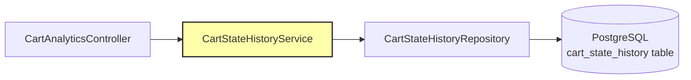

# Technical Implementation: Shopping Cart Analytics

**Feature Reference:** [05-cart-analytics.md](../features/05-cart-analytics.md)

**Implementation Date:** 2024-2025
**Status:** ✅ Complete

---

## Architecture

Analytics leverages the CartStateHistoryService for all calculations:



**Pattern:** Analytics as a read-only view layer over event sourcing data.

---

## Implementation Details

### Conversion Rate Calculation

```kotlin
fun calculateConversionRate(startDate: OffsetDateTime, endDate: OffsetDateTime): Mono<Double> {
    return Mono.zip(
        historyRepository.countByEventTypeAndCreatedAtBetween(CartEventType.CREATED, startDate, endDate),
        historyRepository.countByEventTypeAndCreatedAtBetween(CartEventType.CONVERTED, startDate, endDate)
    ).map { (created, converted) ->
        if (created == 0L) 0.0 else (converted.toDouble() / created) * 100
    }
}
```

**Formula:** `(Converted Carts / Total Created Carts) × 100`

**Parallel Execution:** `Mono.zip()` runs both queries concurrently.

### Abandonment Rate Calculation

```kotlin
fun calculateAbandonmentRate(startDate: OffsetDateTime, endDate: OffsetDateTime): Mono<Double> {
    return Mono.zip(
        historyRepository.countByEventTypeAndCreatedAtBetween(CartEventType.CREATED, startDate, endDate),
        historyRepository.countByEventTypeAndCreatedAtBetween(CartEventType.ABANDONED, startDate, endDate)
    ).map { (created, abandoned) ->
        if (created == 0L) 0.0 else (abandoned.toDouble() / created) * 100
    }
}
```

**Formula:** `(Abandoned Carts / Total Created Carts) × 100`

### REST API Response

```kotlin
@GetMapping("/conversion-rate")
fun getConversionRate(
    @RequestParam @DateTimeFormat(iso = ISO.DATE_TIME) startDate: OffsetDateTime,
    @RequestParam @DateTimeFormat(iso = ISO.DATE_TIME) endDate: OffsetDateTime
): Mono<ConversionRateResponse> {
    return Mono.zip(
        cartStateHistoryService.calculateConversionRate(startDate, endDate),
        cartStateHistoryService.findEventsInDateRange(startDate, endDate)
            .filter { it.eventType == CartEventType.CREATED }
            .count(),
        cartStateHistoryService.findConversionEvents(startDate, endDate).count()
    ).map { (conversionRate, totalCreated, totalConverted) ->
        ConversionRateResponse(
            startDate = startDate,
            endDate = endDate,
            conversionRate = conversionRate,
            totalCreated = totalCreated,
            totalConverted = totalConverted
        )
    }
}
```

**Response Format:**
```json
{
  "startDate": "2025-01-01T00:00:00Z",
  "endDate": "2025-01-31T23:59:59Z",
  "conversionRate": 15.75,
  "totalCreated": 1000,
  "totalConverted": 158
}
```

---

## Database Queries

### Optimized Event Count Query

```sql
SELECT COUNT(*)
FROM cart_state_history
WHERE event_type = 'CREATED'
AND created_at BETWEEN :startDate AND :endDate;
```

**Index Used:** `idx_cart_state_history_created_at`

### Event Filtering

```kotlin
fun findConversionEvents(startDate: OffsetDateTime, endDate: OffsetDateTime): Flux<CartStateHistory> {
    return historyRepository.findByEventTypeAndCreatedAtBetween(
        CartEventType.CONVERTED,
        startDate,
        endDate
    )
}

fun findAbandonmentEvents(startDate: OffsetDateTime, endDate: OffsetDateTime): Flux<CartStateHistory> {
    return historyRepository.findByEventTypeAndCreatedAtBetween(
        CartEventType.ABANDONED,
        startDate,
        endDate
    )
}
```

---

## Alternative Implementations

### 1. **Materialized Views**

**Not Implemented:** Pre-compute daily/weekly/monthly statistics

```sql
CREATE MATERIALIZED VIEW cart_daily_stats AS
SELECT
    DATE(created_at) as date,
    COUNT(CASE WHEN event_type = 'CREATED' THEN 1 END) as created,
    COUNT(CASE WHEN event_type = 'CONVERTED' THEN 1 END) as converted,
    COUNT(CASE WHEN event_type = 'ABANDONED' THEN 1 END) as abandoned
FROM cart_state_history
GROUP BY DATE(created_at);
```

**Benefit:** Fast queries for dashboards.

**Trade-off:** Refresh complexity.

### 2. **Time-Series Database**

**Not Implemented:** Export events to TimescaleDB/InfluxDB

**Use Case:** High-volume analytics, real-time dashboards.

### 3. **OLAP Cube**

**Not Implemented:** Multi-dimensional analysis (time × status × user segment)

**Rationale:** Spike focuses on simple metrics. Production could use Druid/Clickhouse.

### 4. **Cohort Analysis**

**Not Implemented:**
```kotlin
fun getCohortAnalysis(cohortMonth: YearMonth): Mono<CohortAnalysisResponse> {
    // Track conversion rates by month of cart creation
}
```

### 5. **Real-Time Metrics**

**Not Implemented:** Stream events to Redis for live counters

```kotlin
@EventListener
fun onCartCreated(event: CartCreatedEvent) {
    redisTemplate.opsForValue().increment("carts:created:today")
}
```

---

## Performance Considerations

1. **Index Strategy:** `created_at` and `event_type` indexed for fast filtering
2. **Parallel Queries:** `Mono.zip()` runs counts concurrently
3. **Date Range Limits:** Consider enforcing max range (e.g., 90 days) for large datasets
4. **Caching:** Response could be cached for 5-15 minutes

---

## Production Enhancements

- [x] Basic conversion/abandonment rates
- [x] Date range queries
- [x] Event streaming
- [ ] Materialized views for fast queries
- [ ] Caching layer (Redis)
- [ ] Cohort analysis
- [ ] Funnel analysis
- [ ] Revenue metrics (average cart value)
- [ ] Time to conversion analysis
- [ ] Real-time dashboards
