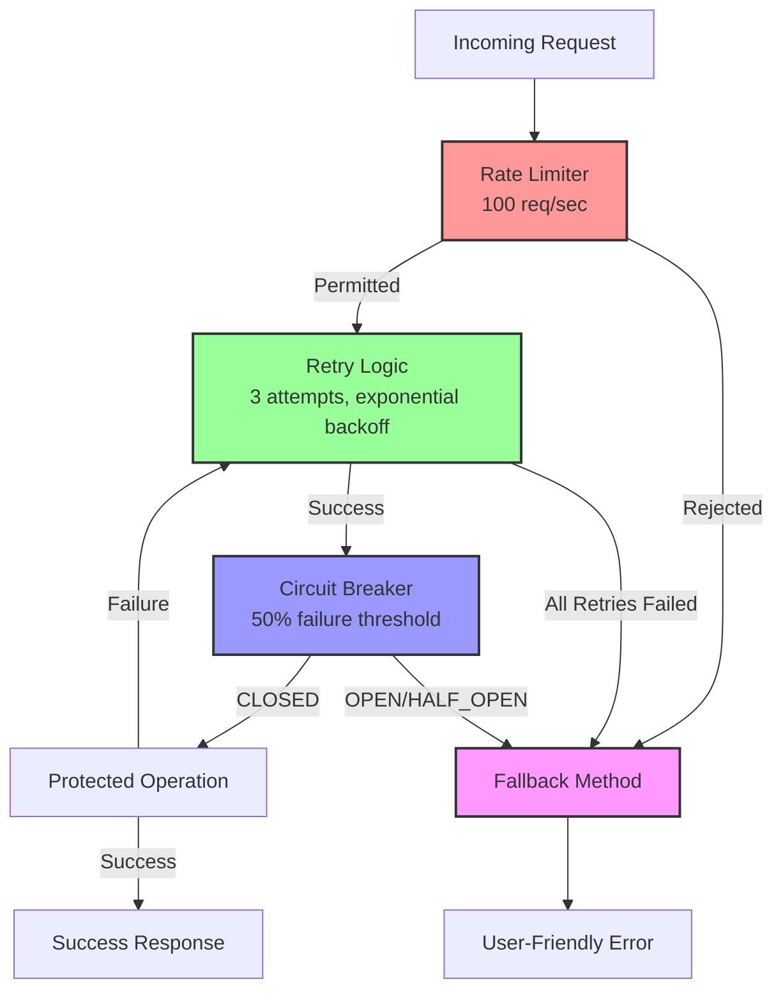
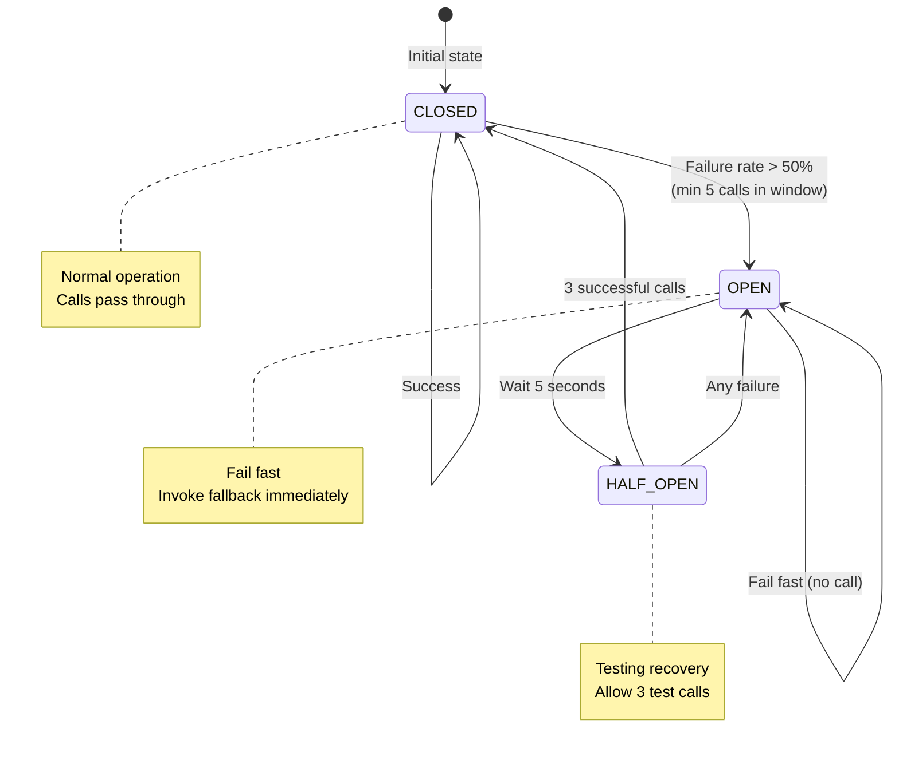

# Technical Implementation: Resilience Patterns

**Feature Reference:** [06-resilience-patterns.md](../features/06-resilience-patterns.md)

**Implementation Date:** 2024-2025
**Status:** ✅ Complete

---

## Architecture Overview



---

## Annotation Stacking Order

**Critical:** Annotations execute in this order:

```kotlin
@RateLimiter(name = "instance", fallbackMethod = "methodFallback")  // 1. First check
@Retry(name = "instance", fallbackMethod = "methodFallback")        // 2. Wrap with retry
@CircuitBreaker(name = "instance", fallbackMethod = "methodFallback") // 3. Innermost
fun protectedMethod(param: Type): Mono<Result>
```

**Execution Flow:**
1. Rate Limiter checks if request is permitted
2. If permitted, Retry wraps the call
3. Circuit Breaker protects the actual operation
4. On any failure, fallback is invoked

---

## Configuration

### application.properties

```properties
# Rate Limiter: shoppingCart instance
resilience4j.ratelimiter.instances.shoppingCart.limitForPeriod=100
resilience4j.ratelimiter.instances.shoppingCart.limitRefreshPeriod=1s
resilience4j.ratelimiter.instances.shoppingCart.timeoutDuration=0s
resilience4j.ratelimiter.instances.shoppingCart.registerHealthIndicator=true

# Retry: shoppingCart instance
resilience4j.retry.instances.shoppingCart.maxAttempts=3
resilience4j.retry.instances.shoppingCart.waitDuration=500ms
resilience4j.retry.instances.shoppingCart.enableExponentialBackoff=true
resilience4j.retry.instances.shoppingCart.exponentialBackoffMultiplier=2
resilience4j.retry.instances.shoppingCart.retryExceptions[0]=java.io.IOException
resilience4j.retry.instances.shoppingCart.retryExceptions[1]=java.util.concurrent.TimeoutException
resilience4j.retry.instances.shoppingCart.retryExceptions[2]=org.springframework.dao.TransientDataAccessException

# Circuit Breaker: shoppingCart instance
resilience4j.circuitbreaker.instances.shoppingCart.slidingWindowSize=10
resilience4j.circuitbreaker.instances.shoppingCart.minimumNumberOfCalls=5
resilience4j.circuitbreaker.instances.shoppingCart.failureRateThreshold=50
resilience4j.circuitbreaker.instances.shoppingCart.waitDurationInOpenState=5s
resilience4j.circuitbreaker.instances.shoppingCart.automaticTransitionFromOpenToHalfOpenEnabled=true
resilience4j.circuitbreaker.instances.shoppingCart.permittedNumberOfCallsInHalfOpenState=3
```

---

## Rate Limiter

### Configuration Explained

- **limitForPeriod:** 100 requests allowed
- **limitRefreshPeriod:** Per 1-second window
- **timeoutDuration:** 0s = fail immediately (no wait)

### Behavior

```
Time: 0s    → Permits: 100/100
Request 1-100 → Permits: 0/100 (all consumed)
Request 101   → REJECTED (no wait)
Time: 1s      → Permits: 100/100 (reset)
```

### Monitoring

```bash
curl http://localhost:8080/actuator/ratelimiters
```

```json
{
  "rateLimiters": {
    "shoppingCart": {
      "availablePermissions": 87,
      "numberOfWaitingThreads": 0
    }
  }
}
```

---

## Retry Logic

### Configuration Explained

- **maxAttempts:** 3 total attempts (1 original + 2 retries)
- **waitDuration:** 500ms initial wait
- **exponentialBackoffMultiplier:** 2×

### Retry Schedule

```
Attempt 1: Immediate
Attempt 2: Wait 500ms  (500 × 2^0)
Attempt 3: Wait 1000ms (500 × 2^1)
Total:     Wait 2000ms (500 × 2^2) - not used, max attempts reached
```

### Retryable Exceptions Only

```kotlin
resilience4j.retry.instances.shoppingCart.retryExceptions[0]=java.io.IOException
resilience4j.retry.instances.shoppingCart.retryExceptions[1]=java.util.concurrent.TimeoutException
resilience4j.retry.instances.shoppingCart.retryExceptions[2]=org.springframework.dao.TransientDataAccessException
```

**Non-Retryable:**
- `IllegalArgumentException` (client error)
- `NullPointerException` (programming error)
- `OptimisticLockingFailureException` (business logic error)

### Monitoring

```bash
curl http://localhost:8080/actuator/retries
curl http://localhost:8080/actuator/retryevents
```

---

## Circuit Breaker

### State Machine



### Configuration Explained

- **slidingWindowSize:** Last 10 calls tracked
- **minimumNumberOfCalls:** Need 5 calls before evaluation
- **failureRateThreshold:** 50% = if 5 out of 10 fail, OPEN
- **waitDurationInOpenState:** Wait 5 seconds before HALF_OPEN
- **permittedNumberOfCallsInHalfOpenState:** Allow 3 test calls

### Example Scenario

```
Calls: [✓ ✓ ✓ ✓ ✓ ✗ ✗ ✗ ✗ ✗]
       └──────────┘ └─────────┘
         Success     Failures

Failure rate: 50% (5/10) → Circuit OPENS
Next 5s: All calls fail fast (fallback invoked)
After 5s: Circuit → HALF_OPEN
Next 3 calls: [✓ ✓ ✓] → Circuit CLOSES
```

### Monitoring

```bash
curl http://localhost:8080/actuator/circuitbreakers
```

```json
{
  "circuitBreakers": {
    "shoppingCart": {
      "state": "CLOSED",
      "failureRate": "12.5%",
      "slowCallRate": "0.0%",
      "bufferedCalls": 8,
      "failedCalls": 1,
      "notPermittedCalls": 0
    }
  }
}
```

```bash
curl http://localhost:8080/actuator/health
```

```json
{
  "status": "UP",
  "components": {
    "circuitBreakers": {
      "status": "UP",
      "details": {
        "shoppingCart": {
          "status": "UP",
          "details": {
            "state": "CLOSED"
          }
        }
      }
    }
  }
}
```

---

## Fallback Pattern

### Implementation

```kotlin
@RateLimiter(name = "shoppingCart", fallbackMethod = "createCartFallback")
@Retry(name = "shoppingCart", fallbackMethod = "createCartFallback")
@CircuitBreaker(name = "shoppingCart", fallbackMethod = "createCartFallback")
fun createCart(sessionId: String, userId: String?, expiresAt: OffsetDateTime?): Mono<ShoppingCart> {
    val cart = ShoppingCart(sessionId = sessionId, userId = userId, expiresAt = expiresAt ?: OffsetDateTime.now().plusDays(7))
    return cartRepository.save(cart)
        .flatMap { savedCart ->
            cartStateHistoryService.recordEvent(savedCart.id!!, CartEventType.CREATED)
                .thenReturn(savedCart)
        }
}

private fun createCartFallback(sessionId: String, userId: String?, expiresAt: OffsetDateTime?, ex: Exception): Mono<ShoppingCart> {
    logger.error("Rate limiter/Retry/Circuit breaker fallback for createCart - sessionId: $sessionId, error: ${ex.message}", ex)
    return Mono.error(RuntimeException("Shopping cart service is temporarily unavailable. Please try again later.", ex))
}
```

### Fallback Signature Rules

1. **Same return type:** `Mono<ShoppingCart>`
2. **Same parameters:** `sessionId`, `userId`, `expiresAt`
3. **Additional parameter:** `ex: Exception` (or specific exception type)

### Fallback Best Practices

1. **Log the error** with full context
2. **Return user-friendly message** (not technical details)
3. **Preserve root cause** (wrap exception)
4. **Never swallow errors** (always return `Mono.error()`)

---

## Protected Operations by Service

### ShoppingCartService
- `createCart()` - Rate limited to prevent cart spam
- `findOrCreateCart()` - Prevents session hijacking abuse
- `findCartById()` - Protects against DB overload
- `updateCartStatus()` - Critical state transitions

### CartItemService
- `addItemToCart()` - Prevents rapid-fire item additions

### ProductService
- `createProduct()` - Prevents bulk product creation abuse
- `updateProduct()` - Protects price/stock updates
- `findProductById()` - Caches misses can cause DB load

### CategoryService
- `createCategory()` - Limits category creation rate
- `updateCategory()` - Protects critical catalog changes
- `findCategoryById()` - Similar to product lookups

---

## Observability

### Actuator Endpoints

| Endpoint | Description |
|----------|-------------|
| `/actuator/health` | Circuit breaker and rate limiter health |
| `/actuator/circuitbreakers` | All circuit breaker states |
| `/actuator/circuitbreakerevents` | Recent state transitions |
| `/actuator/retries` | Retry configurations |
| `/actuator/retryevents` | Recent retry attempts |
| `/actuator/ratelimiters` | Rate limiter states and permits |
| `/actuator/ratelimiterevents` | Recent rate limiter decisions |
| `/actuator/metrics/resilience4j.*` | Detailed metrics |

### OpenTelemetry Integration

All resilience events are automatically traced:
- Circuit breaker state transitions
- Retry attempts
- Rate limiter permit/deny decisions

---

## Alternative Implementations

### 1. **Bulkhead Pattern**

**Not Implemented:**
```kotlin
@Bulkhead(name = "databaseOps", type = Bulkhead.Type.SEMAPHORE)
fun protectedOperation(): Mono<Result>
```

**Use Case:** Limit concurrent database connections.

### 2. **Time Limiter**

**Not Implemented:**
```kotlin
@TimeLimiter(name = "slowOps")
fun protectedOperation(): Mono<Result>
```

**Use Case:** Timeout long-running operations.

### 3. **Adaptive Rate Limiting**

**Not Implemented:** Adjust limits based on system load

**Current:** Static limits (100 req/sec)

### 4. **Cache Fallback**

**Not Implemented:**
```kotlin
private fun findProductByIdFallback(id: UUID, ex: Exception): Mono<Product> {
    return cache.get(id)
        .switchIfEmpty(Mono.error(RuntimeException("Service unavailable")))
}
```

**Use Case:** Serve stale data when service is down.

---

## Production Readiness

- [x] Rate limiter (100 req/sec per instance)
- [x] Retry with exponential backoff
- [x] Circuit breaker (50% threshold)
- [x] Fallback methods
- [x] Health indicators
- [x] Metrics exposure
- [x] OpenTelemetry tracing
- [ ] Bulkhead pattern
- [ ] Time limiter
- [ ] Adaptive rate limiting
- [ ] Cache fallback
- [ ] Real-time alerting (PagerDuty, Slack)
- [ ] Circuit breaker manual override API
