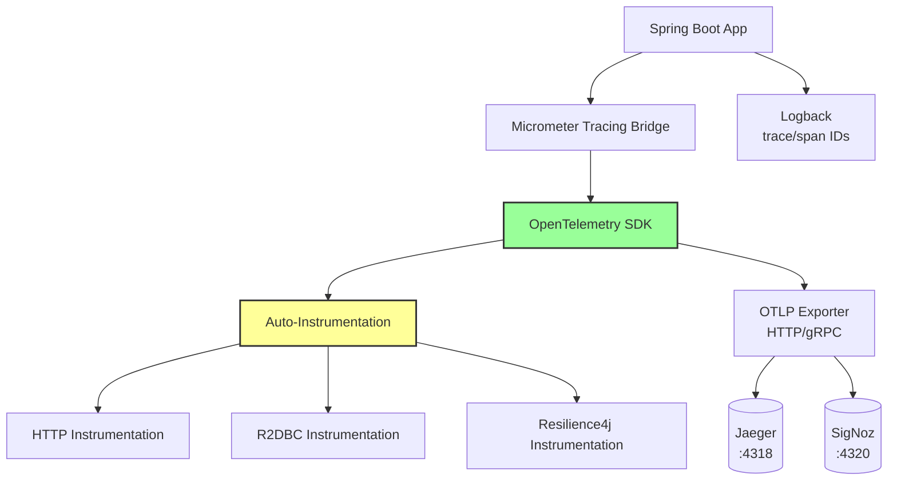

# Technical Implementation: Distributed Tracing and Observability

**Feature Reference:** [07-distributed-tracing.md](../features/07-distributed-tracing.md)

**Implementation Date:** 2025
**Status:** ✅ Complete

---

## Architecture Overview



---

## Dependencies

### build.gradle.kts

```kotlin
dependencies {
    // Micrometer Tracing Bridge
    implementation("io.micrometer:micrometer-tracing-bridge-otel")

    // OpenTelemetry OTLP Exporter
    implementation("io.opentelemetry:opentelemetry-exporter-otlp")
}
```

**Stack:**
- **Micrometer Tracing:** Abstraction layer (can switch between OTel, Brave, etc.)
- **OpenTelemetry SDK:** Industry standard for observability
- **OTLP Exporter:** Exports traces via OpenTelemetry Protocol

---

## Configuration

### application.properties

```properties
# Enable tracing
management.tracing.enabled=true
management.tracing.sampling.probability=1.0  # 100% sampling

# OTLP Endpoint
management.otlp.tracing.endpoint=http://localhost:4318/v1/traces  # Jaeger
# management.otlp.tracing.endpoint=http://localhost:4320/v1/traces  # SigNoz (alternative)

# OTLP compression
management.otlp.tracing.compression=gzip

# Propagation format (W3C Trace Context)
management.tracing.propagation.type=w3c

# Baggage propagation
management.tracing.baggage.enabled=true
management.tracing.baggage.remote-fields=user-id,session-id

# Log pattern with trace context
logging.pattern.level=%5p [${spring.application.name:},%X{traceId:-},%X{spanId:-}]
```

---

## Auto-Instrumentation

### HTTP Instrumentation

**Automatic:** All REST endpoints traced

```
Span: GET /api/v1/products/550e8400-e29b-41d4-a716-446655440000
├─ Attributes:
│  ├─ http.method: GET
│  ├─ http.url: /api/v1/products/550e8400-e29b-41d4-a716-446655440000
│  ├─ http.status_code: 200
│  └─ http.response_content_length: 256
└─ Duration: 45ms
```

### R2DBC Instrumentation

**Automatic:** All database queries traced

```
Span: SELECT FROM products WHERE id = ?
├─ Attributes:
│  ├─ db.system: postgresql
│  ├─ db.name: resiliency_spike
│  ├─ db.statement: SELECT * FROM products WHERE id = $1
│  ├─ db.operation: SELECT
│  └─ db.connection_string: postgresql://localhost:5432
└─ Duration: 8ms
```

### Resilience4j Instrumentation

**Automatic:** Circuit breaker, retry, rate limiter events

```
Span: CircuitBreaker[shoppingCart]
├─ Attributes:
│  ├─ resilience4j.circuitbreaker.name: shoppingCart
│  ├─ resilience4j.circuitbreaker.state: CLOSED
│  └─ resilience4j.circuitbreaker.failure_rate: 0.0
└─ Duration: 2ms
```

---

## Trace Context Propagation

### W3C Trace Context Headers

Incoming request:
```
traceparent: 00-0af7651916cd43dd8448eb211c80319c-b7ad6b7169203331-01
tracestate: vendor1=value1,vendor2=value2
```

Outgoing request (to downstream service):
```
traceparent: 00-0af7651916cd43dd8448eb211c80319c-00f067aa0ba902b7-01
                ^^                               ^^                ^^
                |                                |                 |
                version                          new span ID       sampled
```

**Key:**
- `00`: Version
- `0af7651916cd43dd8448eb211c80319c`: Trace ID (128-bit, hex)
- `b7ad6b7169203331`: Parent Span ID (64-bit, hex)
- `01`: Trace flags (01 = sampled)

---

## Log Correlation

### Logback Pattern

```properties
logging.pattern.level=%5p [${spring.application.name:},%X{traceId:-},%X{spanId:-}]
```

### Example Log Output

```
2025-11-22 10:15:30.123  INFO [resiliency-spike,0af7651916cd43dd8448eb211c80319c,b7ad6b7169203331] c.p.r.service.ProductService: Creating product: LAPTOP-001
2025-11-22 10:15:30.145  INFO [resiliency-spike,0af7651916cd43dd8448eb211c80319c,00f067aa0ba902b7] c.p.r.repository.ProductRepository: Saving product to database
2025-11-22 10:15:30.189  INFO [resiliency-spike,0af7651916cd43dd8448eb211c80319c,b7ad6b7169203331] c.p.r.service.ProductService: Product created successfully
```

**Correlation:** All logs for a request share the same `traceId`.

---

## Trace Visualization

### Jaeger UI Example

```
Trace: GET /api/v1/carts/1/items
├─ resiliency-spike: GET /api/v1/carts/1/items [45ms]
   ├─ resiliency-spike: CartItemService.addItemToCart [38ms]
   │  ├─ resiliency-spike: RateLimiter[cartItem] [1ms]
   │  ├─ resiliency-spike: Retry[cartItem] [35ms]
   │  │  ├─ resiliency-spike: CircuitBreaker[cartItem] [34ms]
   │  │  │  ├─ resiliency-spike: ProductRepository.findById [8ms]
   │  │  │  │  └─ resiliency-spike: SELECT FROM products WHERE id = ? [7ms]
   │  │  │  ├─ resiliency-spike: CartItemRepository.findByCartIdAndProductId [6ms]
   │  │  │  │  └─ resiliency-spike: SELECT FROM cart_items WHERE cart_id = ? [5ms]
   │  │  │  └─ resiliency-spike: CartItemRepository.save [12ms]
   │  │  │     └─ resiliency-spike: INSERT INTO cart_items [11ms]
   │  │  └─ resiliency-spike: CartStateHistoryService.recordItemEvent [6ms]
   │  │     └─ resiliency-spike: INSERT INTO cart_state_history [5ms]
   └─ resiliency-spike: DTO mapping [2ms]
```

### SigNoz Flamegraph

```
┌─────────────────────────────────────────────────────────┐
│ GET /api/v1/carts/1/items                        45ms   │
├─────────────────────────────────────────────────────────┤
│  CartItemService.addItemToCart                   38ms   │
├─────────────────────────────────────────────────────────┤
│  │ RateLimiter[cartItem]                         1ms    │
│  └─────────────────────────────────────────────────────┤
│    Retry[cartItem]                                35ms   │
├─────────────────────────────────────────────────────────┤
│      CircuitBreaker[cartItem]                     34ms   │
├─────────────────────────────────────────────────────────┤
│        ProductRepository.findById                 8ms    │
│        CartItemRepository.find...                 6ms    │
│        CartItemRepository.save                    12ms   │
│        CartStateHistoryService                    6ms    │
└─────────────────────────────────────────────────────────┘
```

---

## Backend Selection

### Jaeger (Default)

```properties
management.otlp.tracing.endpoint=http://localhost:4318/v1/traces
```

**Access:** http://localhost:16686

**docker-compose.yml:**
```yaml
jaeger:
  image: jaegertracing/all-in-one:latest
  ports:
    - "16686:16686"  # UI
    - "4318:4318"    # OTLP HTTP
```

### SigNoz (Alternative)

```properties
management.otlp.tracing.endpoint=http://localhost:4320/v1/traces
```

**Access:** http://localhost:3301

**docker-compose.yml:**
```yaml
signoz:
  # See SIGNOZ.md for full configuration
  ports:
    - "3301:3301"  # UI
    - "4320:4320"  # OTLP HTTP
```

---

## Sampling Strategy

### Current: 100% Sampling

```properties
management.tracing.sampling.probability=1.0
```

**Good for:** Development, debugging, low-traffic environments

### Production Recommendations

```properties
# Sample 10% of requests
management.tracing.sampling.probability=0.1

# Or use head-based sampling with custom rules
```

**Advanced:** Implement adaptive sampling based on:
- Error rate (sample 100% of errors)
- Slow requests (sample 100% above threshold)
- Specific endpoints (sample 100% of checkout)

---

## Custom Span Creation (Manual Instrumentation)

**Not implemented in spike,** but available:

```kotlin
@Service
class ProductService(private val tracer: Tracer) {

    fun createProduct(product: Product): Mono<Product> {
        val span = tracer.nextSpan().name("ProductService.createProduct")
        span.tag("product.sku", product.sku)
        span.tag("product.category", product.categoryId.toString())

        return Mono.using(
            { span.start() },
            {
                productRepository.save(product)
                    .doOnSuccess { span.tag("product.id", it.id.toString()) }
                    .doOnError { span.error(it) }
            },
            { it.end() }
        )
    }
}
```

---

## Metrics Integration

OpenTelemetry also exports metrics (not just traces):

```bash
curl http://localhost:8080/actuator/metrics
```

```json
{
  "names": [
    "http.server.requests",
    "r2dbc.pool.acquired",
    "resilience4j.circuitbreaker.calls",
    "resilience4j.ratelimiter.available.permissions"
  ]
}
```

---

## Alternative Implementations

### 1. **Zipkin Instead of Jaeger**

```kotlin
dependencies {
    implementation("io.micrometer:micrometer-tracing-bridge-brave")
    implementation("io.zipkin.reporter2:zipkin-reporter-brave")
}
```

```properties
management.zipkin.tracing.endpoint=http://localhost:9411/api/v2/spans
```

### 2. **AWS X-Ray**

```kotlin
dependencies {
    implementation("io.awspring.cloud:spring-cloud-aws-xray")
}
```

### 3. **Custom Span Attributes**

```kotlin
@Bean
fun tracingCustomizer(): TracingCustomizer {
    return TracingCustomizer { builder ->
        builder.addSpanProcessor(object : SpanProcessor {
            override fun onStart(context: Context, span: ReadWriteSpan) {
                span.setAttribute("app.version", "1.0.0")
                span.setAttribute("environment", "production")
            }
        })
    }
}
```

### 4. **Trace-Based Testing**

```kotlin
@Test
fun shouldCreateTraceForProductCreation() {
    webTestClient.post()
        .uri("/api/v1/products")
        .bodyValue(productRequest)
        .exchange()
        .expectStatus().isCreated

    // Verify trace was created
    val traces = traceExporter.getFinishedSpans()
    assertThat(traces).hasSize(1)
    assertThat(traces[0].name).isEqualTo("POST /api/v1/products")
}
```

---

## Performance Considerations

1. **Sampling:** 100% sampling adds ~1-2ms latency per request
2. **OTLP Export:** Asynchronous, non-blocking
3. **Compression:** Gzip reduces network payload by ~70%
4. **Batch Export:** Spans batched before sending to backend

---

## Security Considerations

1. **Sensitive Data:** Never include passwords, tokens, PII in span attributes
2. **Trace IDs:** Public exposure of trace IDs is acceptable (no security risk)
3. **Backend Access:** Restrict Jaeger/SigNoz UI to authorized users

---

## Production Readiness

- [x] Auto-instrumentation (HTTP, R2DBC, Resilience4j)
- [x] W3C Trace Context propagation
- [x] Log correlation (trace/span IDs)
- [x] OTLP export with compression
- [x] Pluggable backends (Jaeger, SigNoz)
- [x] Configurable sampling
- [ ] Adaptive sampling
- [ ] Custom span attributes for business metrics
- [ ] Trace-based alerting
- [ ] Distributed transaction tracing
- [ ] Real-time trace analysis
