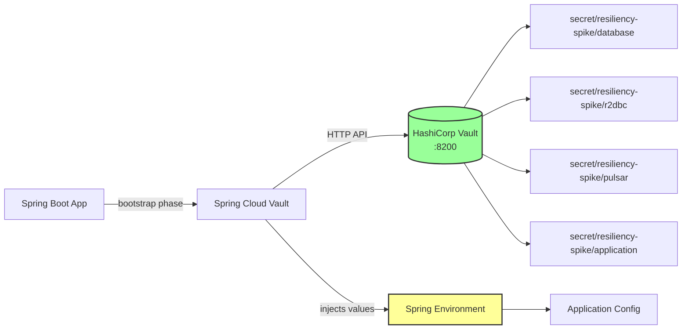
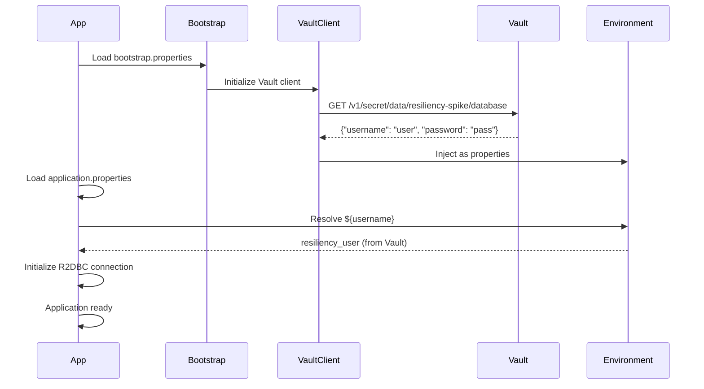

# Technical Implementation: Secrets Management with Vault

**Feature Reference:** [08-secrets-management.md](../features/08-secrets-management.md)

**Implementation Date:** 2025
**Status:** ✅ Complete

---

## Architecture



---

## Dependencies

### build.gradle.kts

```kotlin
extra["springCloudVersion"] = "2025.0.0"

dependencies {
    implementation("org.springframework.cloud:spring-cloud-starter-vault-config")
}

dependencyManagement {
    imports {
        mavenBom("org.springframework.cloud:spring-cloud-dependencies:${property("springCloudVersion")}")
    }
}
```

---

## Configuration

### bootstrap.properties

**File:** `src/main/resources/bootstrap.properties`

```properties
# Vault connection
spring.cloud.vault.host=localhost
spring.cloud.vault.port=8200
spring.cloud.vault.scheme=http
spring.cloud.vault.authentication=token
spring.cloud.vault.token=dev-root-token

# Application name (used for secret paths)
spring.application.name=resiliency-spike

# Key-Value version 2 backend
spring.cloud.vault.kv.backend=secret
spring.cloud.vault.kv.default-context=${spring.application.name}
spring.cloud.vault.kv.application-name=${spring.application.name}

# Disable Vault health indicator (prevents startup failures)
management.health.vault.enabled=false
```

**Why bootstrap.properties?**
- Loaded **before** `application.properties`
- Vault values available for property resolution in `application.properties`

### application.properties

```properties
# R2DBC Configuration (values from Vault)
spring.r2dbc.url=${url:r2dbc:postgresql://localhost:5432/resiliency_spike}
spring.r2dbc.username=${username:resiliency_user}
spring.r2dbc.password=${password:resiliency_password}
```

**Syntax:** `${vaultKey:defaultValue}`
- If Vault has `url`, uses Vault value
- Otherwise, uses default value

---

## Secret Structure in Vault

### Vault Paths

```
secret/
└── resiliency-spike/
    ├── database
    │   ├── username: resiliency_user
    │   ├── password: <encrypted>
    │   └── host: localhost
    ├── r2dbc
    │   ├── url: r2dbc:postgresql://localhost:5432/resiliency_spike
    │   ├── username: resiliency_user
    │   └── password: <encrypted>
    ├── pulsar
    │   ├── broker-url: pulsar://localhost:6650
    │   └── namespace: default
    └── application
        ├── feature.flags.experimental: false
        └── api.rate-limit: 1000
```

### Writing Secrets to Vault

**Using Vault CLI:**
```bash
# Database secrets
docker exec -e VAULT_TOKEN=dev-root-token resiliency-spike-vault \
  vault kv put secret/resiliency-spike/database \
  username=resiliency_user \
  password=super_secret_password \
  host=localhost

# R2DBC secrets
docker exec -e VAULT_TOKEN=dev-root-token resiliency-spike-vault \
  vault kv put secret/resiliency-spike/r2dbc \
  url=r2dbc:postgresql://localhost:5432/resiliency_spike \
  username=resiliency_user \
  password=super_secret_password
```

**Using Vault UI:**
1. Navigate to http://localhost:8200
2. Login with token: `dev-root-token`
3. Navigate to `secret/` → `resiliency-spike/`
4. Create/edit secrets via UI

---

## docker-compose.yml Integration

```yaml
vault:
  image: hashicorp/vault:latest
  container_name: resiliency-spike-vault
  environment:
    VAULT_DEV_ROOT_TOKEN_ID: dev-root-token
    VAULT_DEV_LISTEN_ADDRESS: 0.0.0.0:8200
  ports:
    - "8200:8200"
  cap_add:
    - IPC_LOCK
  command: server -dev
  networks:
    - resiliency-spike-network
```

**Dev Mode:**
- `VAULT_DEV_ROOT_TOKEN_ID`: Sets static root token (for development only)
- `-dev`: Runs in development mode (unsealed, in-memory storage)
- **NEVER use dev mode in production**

---

## Secret Injection Flow



---

## Access Patterns

### Via Spring Environment

```kotlin
@Component
class DatabaseConfig(private val environment: Environment) {

    fun getDatabaseUrl(): String {
        return environment.getProperty("spring.r2dbc.url")
            ?: throw IllegalStateException("Database URL not configured")
    }
}
```

### Via @Value Annotation

```kotlin
@Service
class SomeService(
    @Value("\${spring.r2dbc.username}") private val dbUsername: String,
    @Value("\${custom.api.key:default-key}") private val apiKey: String
) {
    // Secrets injected at bean creation
}
```

### Via @ConfigurationProperties

```kotlin
@ConfigurationProperties(prefix = "custom")
@Component
data class CustomConfig(
    val apiKey: String,
    val rateLimitrequests: Int
)
```

---

## Production Configuration

### Token-Based Authentication (Current)

**Pros:**
- Simple, works for dev/staging
- Easy to rotate

**Cons:**
- Static token in config (security risk)
- No automatic rotation

### AppRole Authentication (Recommended for Production)

```properties
spring.cloud.vault.authentication=approle
spring.cloud.vault.app-role.role-id=${VAULT_ROLE_ID}
spring.cloud.vault.app-role.secret-id=${VAULT_SECRET_ID}
```

**Setup:**
```bash
# Create AppRole
vault auth enable approle
vault write auth/approle/role/resiliency-spike \
  secret_id_ttl=10m \
  token_num_uses=10 \
  token_ttl=20m \
  token_max_ttl=30m \
  secret_id_num_uses=40 \
  policies=resiliency-spike-policy

# Get role-id
vault read auth/approle/role/resiliency-spike/role-id

# Generate secret-id
vault write -f auth/approle/role/resiliency-spike/secret-id
```

### Kubernetes Authentication (For K8s Deployments)

```properties
spring.cloud.vault.authentication=kubernetes
spring.cloud.vault.kubernetes.role=resiliency-spike
spring.cloud.vault.kubernetes.service-account-token-file=/var/run/secrets/kubernetes.io/serviceaccount/token
```

---

## Secret Rotation

### Manual Rotation

```bash
# Update secret in Vault
vault kv put secret/resiliency-spike/database password=new_password

# Restart application (secrets are loaded on startup)
kubectl rollout restart deployment/resiliency-spike
```

### Automatic Rotation (Not Implemented)

```kotlin
@RefreshScope  // Reload beans when secrets change
@Service
class SecretService(
    @Value("\${database.password}") private var password: String
) {
    // Password automatically updated when Vault secret changes
}
```

**Requires:** Spring Cloud Vault Refresh + `/actuator/refresh` endpoint

---

## Alternative Implementations

### 1. **AWS Secrets Manager**

```kotlin
dependencies {
    implementation("io.awspring.cloud:spring-cloud-aws-secrets-manager-config")
}
```

```properties
spring.cloud.aws.secretsmanager.enabled=true
spring.cloud.aws.secretsmanager.region=us-east-1
```

### 2. **Azure Key Vault**

```kotlin
dependencies {
    implementation("com.azure.spring:spring-cloud-azure-starter-keyvault-secrets")
}
```

### 3. **Google Secret Manager**

```kotlin
dependencies {
    implementation("com.google.cloud:spring-cloud-gcp-starter-secretmanager")
}
```

### 4. **Environment Variables**

**Not secure:**
```bash
export DATABASE_PASSWORD=mypassword
```

**Better:**
```bash
export DATABASE_PASSWORD=$(vault kv get -field=password secret/resiliency-spike/database)
```

### 5. **Kubernetes Secrets**

```yaml
apiVersion: v1
kind: Secret
metadata:
  name: database-secret
type: Opaque
data:
  password: <base64-encoded-password>
```

```yaml
# Pod spec
env:
  - name: DATABASE_PASSWORD
    valueFrom:
      secretKeyRef:
        name: database-secret
        key: password
```

---

## Security Best Practices

1. **Never commit secrets to Git**
   - Use `.gitignore` for `application-local.properties`
   - Scan commits with tools like git-secrets, trufflehog

2. **Rotate secrets regularly**
   - Database passwords: quarterly
   - API keys: on breach or quarterly
   - Vault tokens: monthly

3. **Use least privilege**
   - Vault policies restrict which secrets each app can access
   - Don't use root tokens in production

4. **Encrypt secrets at rest**
   - Vault encrypts all data with master key
   - Master key protected by seal mechanism

5. **Audit access**
   - Enable Vault audit logging
   - Monitor who accessed which secrets

---

## Troubleshooting

### Application Won't Start (Vault Connection Failed)

```
Error: Unable to connect to Vault at http://localhost:8200
```

**Fix:**
```bash
# Check Vault is running
docker ps | grep vault

# Check Vault token
docker exec resiliency-spike-vault vault status

# Verify secrets exist
docker exec -e VAULT_TOKEN=dev-root-token resiliency-spike-vault \
  vault kv get secret/resiliency-spike/database
```

### Secret Not Injected

```
Field 'password' requires a bean of type 'String' that could not be found
```

**Fix:**
1. Check secret path: `secret/resiliency-spike/database`
2. Verify key exists: `password`
3. Check `bootstrap.properties` has correct `spring.application.name`

---

## Production Readiness

- [x] Vault integration with Spring Cloud Vault
- [x] Secret injection via bootstrap phase
- [x] Dev mode Vault for local development
- [x] Health indicator disabled (prevents startup failure)
- [ ] AppRole authentication (production)
- [ ] Secret rotation strategy
- [ ] Vault policies and ACLs
- [ ] Audit logging
- [ ] High availability Vault cluster
- [ ] Auto-unseal mechanism (cloud KMS)
- [ ] Secret refresh without restart (@RefreshScope)
