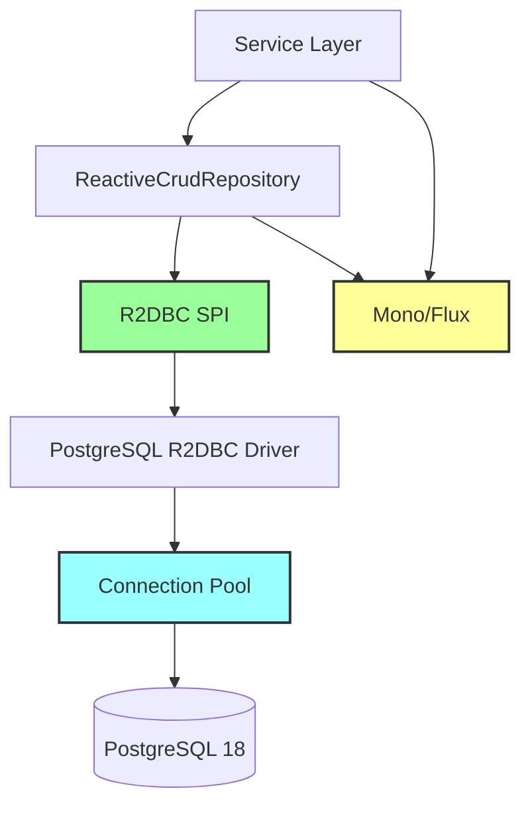
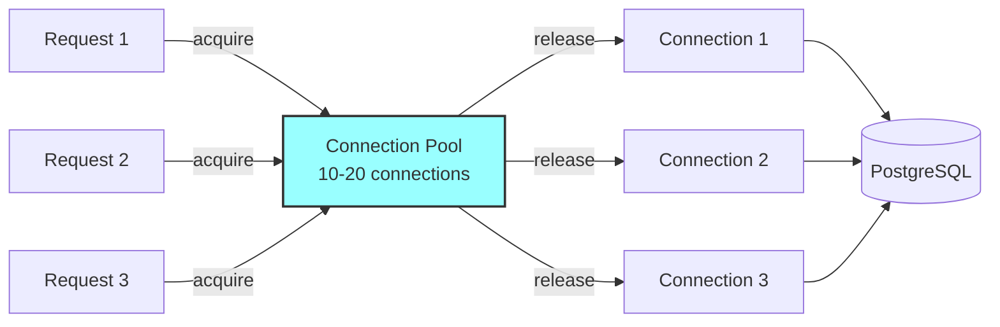
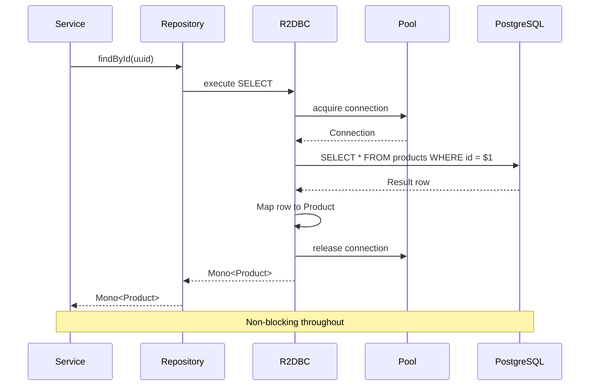

# Technical Implementation: Reactive Database Access with R2DBC

**Feature Reference:** [09-reactive-data-access.md](../features/09-reactive-data-access.md)

**Implementation Date:** 2025
**Status:** ✅ Complete

---

## Architecture Overview



**Key Difference from JDBC:**
- JDBC: Blocking I/O, thread-per-connection
- R2DBC: Non-blocking I/O, event-driven, backpressure-aware

---

## Dependencies

### build.gradle.kts

```kotlin
dependencies {
    // Spring Data R2DBC
    implementation("org.springframework.boot:spring-boot-starter-data-r2dbc")

    // PostgreSQL R2DBC Driver
    runtimeOnly("org.postgresql:r2dbc-postgresql")
}
```

---

## Configuration

### application.properties

```properties
# R2DBC URL (reactive, non-blocking)
spring.r2dbc.url=r2dbc:postgresql://localhost:5432/resiliency_spike
spring.r2dbc.username=resiliency_user
spring.r2dbc.password=resiliency_password

# Connection Pool
spring.r2dbc.pool.enabled=true
spring.r2dbc.pool.initial-size=10    # Warm up 10 connections
spring.r2dbc.pool.max-size=20        # Max 20 concurrent connections
spring.r2dbc.pool.max-idle-time=30m  # Release idle connections after 30 min
```

**Contrast with JDBC:**
```properties
# JDBC (blocking, not used in this project)
spring.datasource.url=jdbc:postgresql://localhost:5432/resiliency_spike
```

---

## Entity Mapping

### R2DBC vs JPA Annotations

| R2DBC | JPA | Purpose |
|-------|-----|---------|
| `@Table` | `@Entity` + `@Table` | Map class to table |
| `@Id` | `@Id` | Primary key |
| `@Column` | `@Column` | Map field to column |
| `@Transient` | `@Transient` | Exclude from persistence |
| N/A | `@OneToMany` | No lazy loading |
| N/A | `@Version` | No optimistic locking (manual) |

### Example Entity

```kotlin
@Table("products")
data class Product(
    @Id
    val id: UUID? = null,

    @Column("sku")
    val sku: String,

    @Column("name")
    val name: String,

    @Column("category_id")
    val categoryId: UUID,

    @Column("price")
    val price: BigDecimal,

    @Column("metadata")
    val metadata: String? = null,  // JSONB as String

    @Column("created_at")
    val createdAt: OffsetDateTime = OffsetDateTime.now()
) {
    @Transient
    var category: Category? = null  // Not persisted, loaded separately
}
```

**Design Decisions:**
- **Immutable:** `data class` with `val` fields
- **Nullable ID:** `null` before insert, populated after
- **No Relationships:** R2DBC doesn't support `@OneToMany` (explicit loading required)
- **JSONB:** Stored as `String`, parse with ObjectMapper

---

## Repository Pattern

### ReactiveCrudRepository

```kotlin
@Repository
interface ProductRepository : ReactiveCrudRepository<Product, UUID> {

    // Derived query methods (auto-generated)
    fun findBySku(sku: String): Mono<Product>
    fun findByCategoryId(categoryId: UUID): Flux<Product>
    fun findByIsActive(isActive: Boolean): Flux<Product>

    // Custom @Query methods
    @Query("SELECT * FROM products WHERE LOWER(name) LIKE LOWER(CONCAT('%', :searchTerm, '%'))")
    fun searchByName(searchTerm: String): Flux<Product>

    @Query("SELECT * FROM products WHERE price >= :minPrice AND price <= :maxPrice ORDER BY price ASC")
    fun findByPriceRange(minPrice: BigDecimal, maxPrice: BigDecimal): Flux<Product>
}
```

**Return Types:**
- `Mono<T>`: 0 or 1 result (nullable)
- `Flux<T>`: 0 to N results (stream)
- `Mono<Void>`: No return value (delete operations)

---

## Reactive Operations

### Save (Insert/Update)

```kotlin
fun createProduct(product: Product): Mono<Product> {
    return productRepository.save(product)  // Returns Mono<Product>
}
```

**SQL Generated:**
```sql
-- If id is null (insert)
INSERT INTO products (sku, name, category_id, price, created_at)
VALUES ($1, $2, $3, $4, $5)
RETURNING *;

-- If id exists (update)
UPDATE products
SET sku = $1, name = $2, category_id = $3, price = $4, updated_at = $5
WHERE id = $6
RETURNING *;
```

### Find by ID

```kotlin
fun findProductById(id: UUID): Mono<Product> {
    return productRepository.findById(id)  // Mono.empty() if not found
}
```

### Find All (Streaming)

```kotlin
fun findAllProducts(): Flux<Product> {
    return productRepository.findAll()  // Lazy stream, backpressure-aware
}
```

**Backpressure Example:**
```kotlin
productRepository.findAll()
    .buffer(10)  // Request 10 items at a time from DB
    .subscribe { batch ->
        // Process batch of 10
    }
```

### Delete

```kotlin
fun deleteProduct(productId: UUID): Mono<Void> {
    return productRepository.deleteById(productId)
}
```

---

## Custom Queries

### Parameterized Queries

```kotlin
@Query("""
    SELECT * FROM products
    WHERE category_id = :categoryId
    AND price >= :minPrice
    AND price <= :maxPrice
    ORDER BY price ASC
""")
fun findByCategoryAndPriceRange(
    categoryId: UUID,
    minPrice: BigDecimal,
    maxPrice: BigDecimal
): Flux<Product>
```

**Parameterization:** R2DBC uses `$1, $2, $3` placeholders (PostgreSQL style), Spring Data maps `:name` to positions.

### Aggregations

```kotlin
@Query("SELECT COALESCE(SUM(line_total_cents), 0) FROM cart_items WHERE cart_id = :cartId")
fun calculateCartTotal(cartId: Long): Mono<Long>
```

**Note:** `COALESCE` handles empty results (returns 0 instead of NULL).

---

## Connection Pooling

### R2DBC Connection Pool



**Configuration:**
```properties
spring.r2dbc.pool.initial-size=10   # Pre-create 10 connections on startup
spring.r2dbc.pool.max-size=20       # Allow up to 20 concurrent connections
spring.r2dbc.pool.max-idle-time=30m # Close idle connections after 30 min
```

**Auto-Configuration:** Spring Boot auto-configures `ConnectionPool` bean.

---

## Transaction Management

### Reactive Transactions

```kotlin
@Service
class TransactionalService(
    private val transactionalOperator: TransactionalOperator
) {

    fun performTransactionalOperation(): Mono<Result> {
        return repository.save(entity1)
            .flatMap { repository.save(entity2) }
            .flatMap { repository.save(entity3) }
            .`as`(transactionalOperator::transactional)  // Wrap in transaction
    }
}
```

**Alternative:** `@Transactional` annotation (works with R2DBC)

```kotlin
@Transactional
fun performTransactionalOperation(): Mono<Result> {
    return repository.save(entity1)
        .flatMap { repository.save(entity2) }
        .flatMap { repository.save(entity3) }
}
```

---

## Type Mappings

### PostgreSQL → Kotlin

| PostgreSQL | Kotlin | Notes |
|------------|--------|-------|
| UUID | `UUID` | Native support |
| VARCHAR | `String` | |
| INTEGER | `Int` | |
| BIGINT | `Long` | Used for cents (money) |
| DECIMAL | `BigDecimal` | Use for prices |
| TIMESTAMP WITH TIME ZONE | `OffsetDateTime` | Recommended |
| BOOLEAN | `Boolean` | |
| JSONB | `String` | Manual JSON parsing |

### JSONB Handling

**Not Native:** R2DBC doesn't auto-parse JSONB.

**Manual Approach:**
```kotlin
// Write
val metadata = objectMapper.writeValueAsString(mapOf("color" to "red", "size" to "L"))
val product = Product(metadata = metadata)

// Read
val metadataMap = objectMapper.readValue<Map<String, Any>>(product.metadata)
```

**Alternative:** Custom converter (advanced)

---

## Reactive Flow Example



---

## Comparison: R2DBC vs JDBC

| Feature | JDBC | R2DBC |
|---------|------|-------|
| I/O Model | Blocking | Non-blocking |
| Threading | Thread-per-request | Event loop |
| Backpressure | No | Yes (Reactive Streams) |
| Connection Pooling | HikariCP | R2DBC Pool |
| ORM Support | JPA/Hibernate | Spring Data R2DBC |
| Lazy Loading | Yes | No (explicit) |
| Transactions | `@Transactional` | `@Transactional` or `TransactionalOperator` |
| Performance (high concurrency) | Moderate | High |
| Complexity | Low | Moderate |

---

## Alternative Implementations

### 1. **JDBC with Virtual Threads (Java 21+)**

**Not used in spike:**
```kotlin
// JDBC remains blocking, but virtual threads make it lightweight
dependencies {
    implementation("org.springframework.boot:spring-boot-starter-data-jpa")
    implementation("org.postgresql:postgresql")
}
```

**Trade-offs:**
- Simpler (JPA ecosystem)
- Still blocking (not truly reactive)
- Requires Java 21+

### 2. **jOOQ with R2DBC**

**Type-safe SQL:**
```kotlin
dependencies {
    implementation("org.jooq:jooq-r2dbc")
}
```

```kotlin
dsl.select(PRODUCT.ID, PRODUCT.NAME)
    .from(PRODUCT)
    .where(PRODUCT.PRICE.between(minPrice, maxPrice))
    .asFlow()  // Kotlin Flow
```

### 3. **Exposed Framework (Kotlin SQL)**

**Kotlin-first SQL library:**
```kotlin
dependencies {
    implementation("org.jetbrains.exposed:exposed-spring-boot-starter")
}
```

### 4. **MongoDB Reactive**

**If using document database:**
```kotlin
dependencies {
    implementation("org.springframework.boot:spring-boot-starter-data-mongodb-reactive")
}
```

---

## Performance Considerations

1. **Connection Pool Sizing:**
   - Initial: 10 (warm up)
   - Max: 20 (tune based on load testing)
   - Formula: `max_connections = (core_count * 2) + effective_spindle_count`

2. **Backpressure:**
   - Flux streams respect subscriber demand
   - Database won't overwhelm application memory

3. **Indexes:**
   - Critical for performance (same as JDBC)
   - Use `EXPLAIN ANALYZE` to verify index usage

4. **Batch Operations:**
   ```kotlin
   productRepository.saveAll(Flux.fromIterable(products))
   ```

---

## Production Readiness

- [x] Non-blocking reactive database access
- [x] Connection pooling (10-20 connections)
- [x] Parameterized queries (SQL injection prevention)
- [x] Transaction support
- [x] Type-safe entity mapping
- [x] Custom @Query methods
- [ ] Optimistic locking (manual @Version equivalent)
- [ ] Schema migrations (Flyway/Liquibase)
- [ ] Read replicas (separate connection for reads)
- [ ] Connection pool monitoring
- [ ] Query performance monitoring
