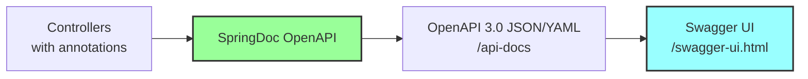

# Technical Implementation: Interactive API Documentation

**Feature Reference:** [10-api-documentation.md](../features/10-api-documentation.md)

**Implementation Date:** 2024-2025
**Status:** ✅ Complete

---

## Architecture



---

## Dependencies

### build.gradle.kts

```kotlin
dependencies {
    // SpringDoc OpenAPI for WebFlux
    implementation("org.springdoc:springdoc-openapi-starter-webflux-ui:2.7.0")
}
```

**Important:** Use `webflux-ui` variant, not `webmvc-ui`.

---

## Configuration

### application.properties

```properties
# OpenAPI Documentation
springdoc.api-docs.path=/api-docs
springdoc.swagger-ui.path=/swagger-ui.html
springdoc.swagger-ui.enabled=true
springdoc.api-docs.enabled=true

# UI Customization
springdoc.swagger-ui.operationsSorter=method  # Sort by HTTP method
springdoc.swagger-ui.tagsSorter=alpha         # Alphabetical tags
springdoc.swagger-ui.tryItOutEnabled=true     # Enable "Try it out"
springdoc.show-actuator=false                 # Hide actuator endpoints

# API Metadata
springdoc.info.title=Spring Boot Resiliency Spike Solution
springdoc.info.description=Spring Boot WebFlux API demonstrating resilience patterns with Circuit Breakers, Retries, and Rate Limiters
springdoc.info.version=0.0.1-SNAPSHOT
springdoc.info.contact.name=Pintail Consulting LLC
springdoc.info.contact.email=info@pintailconsultingllc.com
```

---

## Annotation Usage

### Controller-Level Tags

```kotlin
@RestController
@RequestMapping("/api/v1/products")
@Tag(name = "Product Catalog", description = "Product catalog management APIs")
class ProductController(
    private val productService: ProductService
) {
    // Endpoints...
}
```

**Result:** Groups all endpoints under "Product Catalog" tag.

### Endpoint Documentation

```kotlin
@Operation(
    summary = "Create a new product",
    description = "Creates a new product in the catalog"
)
@ApiResponses(value = [
    ApiResponse(
        responseCode = "201",
        description = "Product created successfully",
        content = [Content(schema = Schema(implementation = ProductResponse::class))]
    ),
    ApiResponse(
        responseCode = "400",
        description = "Invalid input"
    )
])
@PostMapping
@ResponseStatus(HttpStatus.CREATED)
fun createProduct(@RequestBody request: CreateProductRequest): Mono<ProductResponse> {
    // Implementation...
}
```

### Parameter Documentation

```kotlin
@GetMapping("/{productId}")
fun getProductById(
    @Parameter(description = "Product unique identifier")
    @PathVariable productId: UUID
): Mono<ProductResponse> {
    // Implementation...
}

@GetMapping("/search")
fun searchProducts(
    @Parameter(description = "Search term to match product names")
    @RequestParam searchTerm: String
): Flux<ProductResponse> {
    // Implementation...
}
```

### Schema Documentation

```kotlin
@Schema(description = "Product creation request")
data class CreateProductRequest(
    @Schema(description = "Product SKU", example = "LAPTOP-001", required = true)
    val sku: String,

    @Schema(description = "Product name", example = "Gaming Laptop", required = true)
    val name: String,

    @Schema(description = "Product price", example = "1999.99", required = true)
    val price: BigDecimal,

    @Schema(description = "Category unique identifier", required = true)
    val categoryId: UUID,

    @Schema(description = "Initial stock quantity", example = "50", defaultValue = "0")
    val stockQuantity: Int = 0
)
```

---

## Generated API Spec

### Access OpenAPI JSON

**URL:** http://localhost:8080/api-docs

**Example Output:**
```json
{
  "openapi": "3.0.1",
  "info": {
    "title": "Spring Boot Resiliency Spike Solution",
    "description": "Spring Boot WebFlux API demonstrating resilience patterns",
    "contact": {
      "name": "Pintail Consulting LLC",
      "email": "info@pintailconsultingllc.com"
    },
    "version": "0.0.1-SNAPSHOT"
  },
  "servers": [
    {
      "url": "http://localhost:8080",
      "description": "Generated server url"
    }
  ],
  "tags": [
    {
      "name": "Product Catalog",
      "description": "Product catalog management APIs"
    },
    {
      "name": "Shopping Cart",
      "description": "Shopping cart lifecycle and management APIs"
    }
  ],
  "paths": {
    "/api/v1/products": {
      "get": {
        "tags": ["Product Catalog"],
        "summary": "Get all products",
        "operationId": "getAllProducts",
        "parameters": [
          {
            "name": "activeOnly",
            "in": "query",
            "required": false,
            "schema": {
              "type": "boolean",
              "default": false
            }
          }
        ],
        "responses": {
          "200": {
            "description": "Products retrieved successfully",
            "content": {
              "application/json": {
                "schema": {
                  "type": "array",
                  "items": {
                    "$ref": "#/components/schemas/ProductResponse"
                  }
                }
              }
            }
          }
        }
      },
      "post": {
        "tags": ["Product Catalog"],
        "summary": "Create a new product",
        "operationId": "createProduct",
        "requestBody": {
          "content": {
            "application/json": {
              "schema": {
                "$ref": "#/components/schemas/CreateProductRequest"
              }
            }
          },
          "required": true
        },
        "responses": {
          "201": {
            "description": "Product created successfully",
            "content": {
              "application/json": {
                "schema": {
                  "$ref": "#/components/schemas/ProductResponse"
                }
              }
            }
          },
          "400": {
            "description": "Invalid input"
          }
        }
      }
    }
  },
  "components": {
    "schemas": {
      "ProductResponse": {
        "type": "object",
        "properties": {
          "id": {
            "type": "string",
            "format": "uuid"
          },
          "sku": {
            "type": "string"
          },
          "name": {
            "type": "string"
          },
          "price": {
            "type": "number"
          }
        }
      }
    }
  }
}
```

---

## Swagger UI

### Access

**URL:** http://localhost:8080/swagger-ui.html

### Features

1. **Tag Grouping:** Endpoints organized by controller tags
2. **Try It Out:** Execute requests directly from UI
3. **Model Schemas:** View request/response structures
4. **Authentication:** (Not configured in spike, but supported)

### Example UI Screenshot (Text Representation)

```
┌─────────────────────────────────────────────────────────────┐
│  Spring Boot Resiliency Spike Solution  v0.0.1-SNAPSHOT    │
│  Product catalog management with resilience patterns       │
│                                                             │
│  Servers: http://localhost:8080                            │
└─────────────────────────────────────────────────────────────┘

▼ Product Catalog - Product catalog management APIs

  POST   /api/v1/products                    Create a new product
  GET    /api/v1/products                    Get all products
  GET    /api/v1/products/{productId}        Get product by ID
  GET    /api/v1/products/sku/{sku}          Get product by SKU
  GET    /api/v1/products/search             Search products
  ...

▼ Shopping Cart - Shopping cart lifecycle APIs

  POST   /api/v1/carts                       Create cart
  GET    /api/v1/carts/{cartId}              Get cart by ID
  POST   /api/v1/carts/{cartId}/abandon      Abandon cart
  ...

▼ Cart Items - Cart item management APIs

  POST   /api/v1/carts/{cartId}/items        Add item to cart
  GET    /api/v1/carts/{cartId}/items        Get cart items
  ...
```

### Try It Out Example

```
POST /api/v1/products

Request Body (editable):
{
  "sku": "LAPTOP-001",
  "name": "Gaming Laptop",
  "description": "High-performance gaming laptop",
  "categoryId": "550e8400-e29b-41d4-a716-446655440000",
  "price": 1999.99,
  "stockQuantity": 50
}

[Execute] button

Response:
Status: 201 Created
Body:
{
  "id": "660e8400-e29b-41d4-a716-446655440001",
  "sku": "LAPTOP-001",
  "name": "Gaming Laptop",
  "price": 1999.99,
  ...
}
```

---

## Tag Organization

### Current Tags (5)

1. **Product Catalog** - 18 endpoints
2. **Shopping Cart** - 24 endpoints
3. **Cart Items** - 15 endpoints
4. **Cart History** - 7 endpoints
5. **Cart Analytics** - 5 endpoints

**Total:** 69 endpoints

---

## Alternative Implementations

### 1. **Redoc (Alternative UI)**

```properties
springdoc.swagger-ui.enabled=false
```

**Access:** `/redoc` (requires separate dependency)

**Pros:** Cleaner UI, better for reading

**Cons:** Less interactive than Swagger UI

### 2. **Custom OpenAPI YAML**

**Manual approach:**
```yaml
openapi: 3.0.1
info:
  title: My API
paths:
  /api/products:
    get:
      summary: List products
```

**Import to SpringDoc:**
```properties
springdoc.api-docs.path=/api-docs
springdoc.swagger-ui.url=/custom-api-spec.yaml
```

### 3. **Postman Collection Export**

**Not native, but can convert:**
```bash
# Use openapi-to-postman converter
npm install -g openapi-to-postmanv2
openapi2postmanv2 -s http://localhost:8080/api-docs -o collection.json
```

### 4. **Code Generation**

**Client generation:**
```bash
# Download OpenAPI spec
curl http://localhost:8080/api-docs > api-spec.json

# Generate TypeScript client
npx @openapitools/openapi-generator-cli generate \
  -i api-spec.json \
  -g typescript-axios \
  -o client/
```

---

## Security Considerations

### Authentication in Swagger UI

**Not implemented in spike:**

```kotlin
@Configuration
class OpenAPIConfig {

    @Bean
    fun customOpenAPI(): OpenAPI {
        return OpenAPI()
            .components(Components()
                .addSecuritySchemes("bearer-jwt",
                    SecurityScheme()
                        .type(SecurityScheme.Type.HTTP)
                        .scheme("bearer")
                        .bearerFormat("JWT")
                )
            )
            .security(listOf(SecurityRequirement().addList("bearer-jwt")))
    }
}
```

**Swagger UI would then have "Authorize" button.**

### Hiding Endpoints

**Exclude from documentation:**
```kotlin
@Hidden  // SpringDoc annotation
@GetMapping("/internal/admin")
fun adminEndpoint(): Mono<String>
```

---

## Performance Considerations

1. **Spec Generation:** Cached after first request
2. **UI Assets:** Served from `webjars` (static resources)
3. **No Runtime Overhead:** Documentation doesn't affect API performance

---

## Production Readiness

- [x] Auto-generated OpenAPI 3.0 spec
- [x] Interactive Swagger UI
- [x] Comprehensive endpoint documentation
- [x] Schema documentation
- [x] Try-it-out functionality
- [x] Tag-based organization
- [ ] Authentication/Authorization in UI
- [ ] Custom branding/logo
- [ ] Multi-language support
- [ ] Versioned API documentation
- [ ] Rate limiting for docs endpoint
- [ ] Separate docs for public/internal APIs
