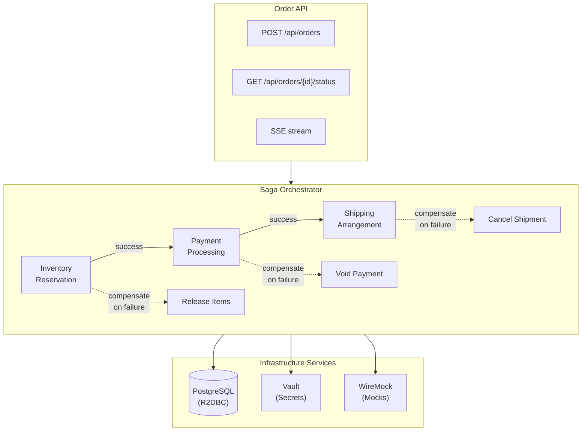

# Saga Pattern Spike

A Spring Boot 4.0 spike project exploring the [saga pattern](https://learn.microsoft.com/en-us/azure/architecture/patterns/saga) for distributed transactions. Built with Kotlin and reactive/coroutine support via WebFlux.

## Overview

This project demonstrates a comprehensive implementation of the [saga orchestration pattern](https://learn.microsoft.com/en-us/azure/architecture/patterns/saga) for managing distributed transactions across multiple services. The saga pattern ensures data consistency by coordinating a series of local transactions, with automatic compensation (rollback) when any step fails.

### Key Features

- **Multi-step Order Processing** - Orchestrated saga execution across inventory, payment, and shipping services
- **Automatic Rollback** - Compensation logic executes in reverse order when failures occur
- **Real-time Status Tracking** - Server-Sent Events (SSE) for live order progress updates
- **Retry Support** - Resume failed orders from the point of failure
- **Order History** - Complete timeline of saga execution with step-by-step details
- **Distributed Tracing** - End-to-end observability with OpenTelemetry and Jaeger
- **Metrics Dashboard** - JVM, HTTP, and saga metrics with Prometheus and Grafana
- **Dynamic Secrets** - HashiCorp Vault integration for secure credential management

## Architecture



## Tech Stack

| Component | Version | Purpose |
|-----------|---------|---------|
| Kotlin | 2.2 | Primary language with coroutines |
| Spring Boot | 4.0 | Application framework |
| Spring WebFlux | - | Reactive web layer |
| R2DBC PostgreSQL | - | Reactive database access |
| Spring Cloud Vault | 2025.1.0 | Secret management |
| OpenTelemetry | (native) | Distributed tracing |
| Prometheus | 2.48 | Metrics collection |
| Grafana | 10.2 | Metrics visualization |
| Micrometer | - | Metrics and observations |
| Cucumber | 7.20 | Acceptance testing |
| WireMock | 3.9 | External service mocking |
| Gradle | 9.2 | Build system (Kotlin DSL) |
| JVM | 24 | Amazon Corretto |

## Getting Started

### Prerequisites

- Docker and Docker Compose
- JDK 24 (recommend using SDKMAN: `sdk env`)
- Gradle 9.2+

### Quick Start

1. **Start infrastructure services:**

   ```bash
   docker compose up -d
   ```

   This starts PostgreSQL, HashiCorp Vault, WireMock, Jaeger, Prometheus, and Grafana.

2. **Run the application:**

   ```bash
   ./gradlew bootRun
   ```

3. **Create a test order:**

   ```bash
   curl -X POST http://localhost:8080/api/orders \
     -H "Content-Type: application/json" \
     -d '{
       "customerId": "550e8400-e29b-41d4-a716-446655440000",
       "items": [
         {
           "productId": "550e8400-e29b-41d4-a716-446655440001",
           "productName": "Widget Pro",
           "quantity": 2,
           "unitPriceInCents": 2999
         }
       ],
       "paymentMethodId": "valid-card",
       "shippingAddress": {
         "street": "123 Main St",
         "city": "Springfield",
         "state": "IL",
         "postalCode": "62701",
         "country": "US"
       }
     }'
   ```

### Distributed Tracing

Jaeger starts by default with `docker compose up -d`.

Access the Jaeger UI at http://localhost:16686

To view traces:
1. Select "sagapattern" from the Service dropdown
2. Click "Find Traces"
3. Click on any trace to see the full span breakdown

## API Reference

### Orders

| Endpoint | Method | Description |
|----------|--------|-------------|
| `/api/orders` | POST | Create and process a new order |
| `/api/orders/{id}` | GET | Get order details |
| `/api/orders/{id}/status` | GET | Get current processing status |
| `/api/orders/{id}/status/stream` | GET | SSE stream for real-time updates |
| `/api/orders/customer/{customerId}` | GET | List orders for a customer |

### Retry

| Endpoint | Method | Description |
|----------|--------|-------------|
| `/api/orders/{id}/retry` | POST | Retry a failed order |
| `/api/orders/{id}/retry/eligibility` | GET | Check if order can be retried |

### History

| Endpoint | Method | Description |
|----------|--------|-------------|
| `/api/orders/{id}/history` | GET | Get full order processing timeline |

### RapidAPI Project

A RapidAPI (Paw) project file is included for convenient API testing and exploration.

**File:** `SagaPatternAPI.paw`

#### Opening the Project

1. Download and install [RapidAPI for Mac](https://paw.cloud/) (formerly Paw)
2. Open `SagaPatternAPI.paw` in RapidAPI
3. The project contains pre-configured requests for all API endpoints

#### Included Requests

The RapidAPI project includes requests for:

- **Orders**
  - Create Order (POST `/api/orders`)
  - Get Order (GET `/api/orders/{id}`)
  - Get Order Status (GET `/api/orders/{id}/status`)
  - List Customer Orders (GET `/api/orders/customer/{customerId}`)

- **Retry**
  - Retry Failed Order (POST `/api/orders/{id}/retry`)
  - Check Retry Eligibility (GET `/api/orders/{id}/retry/eligibility`)

- **History**
  - Get Order History (GET `/api/orders/{id}/history`)

- **Health**
  - Health Check (GET `/actuator/health`)

#### Environment Variables

The project uses environment variables for configuration:

| Variable | Default | Description |
|----------|---------|-------------|
| `baseUrl` | `http://localhost:8080` | Application base URL |

### Postman Collection

A Postman collection is provided for API testing with Postman or compatible tools.

**File:** `SagaPatternAPI.postman.json`

#### Importing the Collection

1. Open [Postman](https://www.postman.com/downloads/)
2. Click **Import** (or use Ctrl/Cmd + O)
3. Select `SagaPatternAPI.postman.json`
4. The collection will appear in your Collections sidebar

#### Collection Structure

The collection is organized into two folders:

**Create a new order**
| Request | Description |
|---------|-------------|
| Success | Creates an order that completes successfully |
| Failure: payment declined | Uses `declined-card` payment method to trigger payment failure |
| Failure: out of stock | Uses nil UUID product to trigger inventory unavailable |
| Failure: invalid address | Uses `00000` postal code to trigger address validation error |
| Failure: undeliverable location | Uses `XX` country code to trigger shipping unavailable |

**Other requests**
| Request | Description |
|---------|-------------|
| Get an order by orderId | Retrieve order details by ID |
| Get an order status by orderId | Get current order status |
| Stream order status updates | SSE endpoint for real-time status updates |
| Get an order by customerId | List all orders for a customer |
| Get an order history by orderId | Get full saga execution history |
| Get retry eligibility for a failed order | Check if order can be retried |
| Retry a failed order | Retry a failed order saga |

#### Usage Notes

- Base URL is configured as `http://localhost:8080`
- For requests requiring an order ID, copy the ID from a create order response and append it to the URL path
- The SSE stream endpoint requires a client that supports Server-Sent Events

## Saga Steps

The order processing saga consists of three sequential steps:

| Order | Step | Description | Compensation |
|-------|------|-------------|--------------|
| 1 | Inventory Reservation | Reserve items from inventory | Release reserved items |
| 2 | Payment Processing | Authorize and capture payment | Void authorization/refund |
| 3 | Shipping Arrangement | Create shipping label and schedule | Cancel shipment |

### Failure Scenarios

- **Step 1 fails**: No compensation needed (nothing to undo)
- **Step 2 fails**: Inventory reservation is released
- **Step 3 fails**: Payment is voided, then inventory is released

### Triggering WireMock Failures

WireMock is configured with special trigger values that cause specific saga steps to fail, allowing you to test compensation behavior. Use these values in your order request to simulate failures:

#### Payment Failures

| `paymentMethodId` Value | Error Response | HTTP Status |
|-------------------------|----------------|-------------|
| `valid-card` | Success | 201 |
| `declined-card` | PAYMENT_DECLINED | 402 |
| `fraud-card` | FRAUD_DETECTED | 403 |

**Example - Trigger payment declined:**

```bash
curl -X POST http://localhost:8080/api/orders \
  -H "Content-Type: application/json" \
  -d '{
    "customerId": "550e8400-e29b-41d4-a716-446655440000",
    "items": [{"productId": "550e8400-e29b-41d4-a716-446655440001", "productName": "Widget", "quantity": 1, "unitPriceInCents": 999}],
    "paymentMethodId": "declined-card",
    "shippingAddress": {"street": "123 Main St", "city": "Springfield", "state": "IL", "postalCode": "62701", "country": "US"}
  }'
```

#### Inventory Failures

| `productId` Value | Error Response | HTTP Status |
|-------------------|----------------|-------------|
| Any valid UUID | Success | 201 |
| `00000000-0000-0000-0000-000000000000` | INVENTORY_UNAVAILABLE | 409 |

**Example - Trigger out of stock:**

```bash
curl -X POST http://localhost:8080/api/orders \
  -H "Content-Type: application/json" \
  -d '{
    "customerId": "550e8400-e29b-41d4-a716-446655440000",
    "items": [{"productId": "00000000-0000-0000-0000-000000000000", "productName": "Sold Out Item", "quantity": 1, "unitPriceInCents": 999}],
    "paymentMethodId": "valid-card",
    "shippingAddress": {"street": "123 Main St", "city": "Springfield", "state": "IL", "postalCode": "62701", "country": "US"}
  }'
```

#### Shipping Failures

| Field | Trigger Value | Error Response | HTTP Status |
|-------|---------------|----------------|-------------|
| `postalCode` | `00000` | INVALID_ADDRESS | 400 |
| `country` | `XX` | SHIPPING_UNAVAILABLE | 422 |

**Example - Trigger invalid address:**

```bash
curl -X POST http://localhost:8080/api/orders \
  -H "Content-Type: application/json" \
  -d '{
    "customerId": "550e8400-e29b-41d4-a716-446655440000",
    "items": [{"productId": "550e8400-e29b-41d4-a716-446655440001", "productName": "Widget", "quantity": 1, "unitPriceInCents": 999}],
    "paymentMethodId": "valid-card",
    "shippingAddress": {"street": "123 Main St", "city": "Springfield", "state": "IL", "postalCode": "00000", "country": "US"}
  }'
```

**Example - Trigger undeliverable location:**

```bash
curl -X POST http://localhost:8080/api/orders \
  -H "Content-Type: application/json" \
  -d '{
    "customerId": "550e8400-e29b-41d4-a716-446655440000",
    "items": [{"productId": "550e8400-e29b-41d4-a716-446655440001", "productName": "Widget", "quantity": 1, "unitPriceInCents": 999}],
    "paymentMethodId": "valid-card",
    "shippingAddress": {"street": "123 Main St", "city": "Nowhere", "state": "ZZ", "postalCode": "12345", "country": "XX"}
  }'
```

#### Expected Compensation Behavior

| Failed Step | Compensated Steps |
|-------------|-------------------|
| Inventory (Step 1) | None |
| Payment (Step 2) | Inventory released |
| Shipping (Step 3) | Payment voided, Inventory released |

## Configuration

### Application Properties

Key configuration in `application.yaml`:

```yaml
spring:
  application:
    name: sagapattern
  r2dbc:
    url: r2dbc:postgresql://localhost:5432/saga_db

saga:
  services:
    inventory:
      base-url: http://localhost:8081/api/inventory
    payment:
      base-url: http://localhost:8081/api/payments
    shipping:
      base-url: http://localhost:8081/api/shipments
```

### Environment Variables

| Variable | Description | Default |
|----------|-------------|---------|
| `OTEL_EXPORTER_OTLP_ENDPOINT` | OpenTelemetry collector endpoint | `http://localhost:4318` |
| `DEPLOYMENT_ENV` | Deployment environment tag | `development` |
| `VAULT_ROLE_ID` | Vault AppRole role ID (production) | - |
| `VAULT_SECRET_ID` | Vault AppRole secret ID (production) | - |

## Infrastructure

### Docker Services

| Service | Port | Purpose |
|---------|------|---------|
| PostgreSQL | 5432 | Order and saga persistence |
| Vault | 8200 | Secret management |
| WireMock | 8081 | Mock external services |
| Jaeger | 16686 | Distributed tracing UI |
| Jaeger OTLP | 4317/4318 | OTLP trace receiver |
| Prometheus | 9090 | Metrics database and query UI |
| Grafana | 3000 | Metrics visualization (admin/admin) |

### Vault Integration

The application uses HashiCorp Vault for:

- **KV Secrets**: API keys, encryption keys at `secret/sagapattern/application`
- **Dynamic Database Credentials**: Auto-rotating PostgreSQL credentials with 1-hour TTL

Development mode uses a root token (`dev-root-token`). Production should use AppRole authentication.

```bash
# Check Vault status
curl http://localhost:8200/v1/sys/health

# Read KV secrets
docker exec saga-vault vault kv get secret/sagapattern/application

# Generate database credentials
docker exec saga-vault vault read database/creds/sagapattern-readwrite
```

## Testing

### Unit Tests

```bash
./gradlew test
```

### Acceptance Tests (Cucumber)

```bash
# Run all acceptance tests
./gradlew test --tests "*.CucumberTestRunner"

# Run by user story
./gradlew test -Dcucumber.filter.tags="@saga-001"  # Multi-step process
./gradlew test -Dcucumber.filter.tags="@saga-002"  # Automatic rollback
./gradlew test -Dcucumber.filter.tags="@saga-003"  # Order status
./gradlew test -Dcucumber.filter.tags="@saga-004"  # Retry functionality
./gradlew test -Dcucumber.filter.tags="@saga-005"  # Order history

# Run by scenario type
./gradlew test -Dcucumber.filter.tags="@happy-path"
./gradlew test -Dcucumber.filter.tags="@compensation"
./gradlew test -Dcucumber.filter.tags="@observability"
```

Test reports are generated at `build/reports/cucumber/cucumber-report.html`

### Integration Tests

```bash
./gradlew test -Dcucumber.filter.tags="@integration"
```

## Observability

### Distributed Tracing

Every saga execution creates a distributed trace with:

- Parent span for the complete saga
- Child spans for each step (inventory, payment, shipping)
- Compensation spans when rollback occurs
- HTTP client spans for external service calls

### Metrics

Metrics are collected via Prometheus and visualized in Grafana.

**Viewing Metrics:**

1. Start services: `docker compose up -d`
2. Open Grafana: http://localhost:3000 (admin/admin)
3. Navigate to the "Saga Pattern" folder to see pre-configured dashboards

**Pre-configured Dashboards:**

| Dashboard | Description |
|-----------|-------------|
| JVM Metrics | Memory, GC, threads, class loading |
| Spring Boot HTTP | Request rate, latency, error rate |
| Saga Pattern Metrics | Saga execution, compensation, step timing |

### Custom Metrics

| Metric | Description |
|--------|-------------|
| `saga_started_total` | Counter of sagas initiated |
| `saga_completed_total` | Counter of successful sagas |
| `saga_compensated_total` | Counter of compensated sagas |
| `saga_duration_seconds` | Histogram of saga execution time |
| `saga_step_duration_seconds` | Histogram of individual step times |
| `saga_step_failed_total` | Counter of step failures by step name |

### Viewing Traces

1. Start services: `docker compose up -d`
2. Open Jaeger: http://localhost:16686
3. Select "sagapattern" from the Service dropdown and click "Find Traces"

## Project Structure

```
saga-pattern-spike/
├── src/main/kotlin/com/pintailconsultingllc/sagapattern/
│   ├── api/                    # REST controllers and DTOs
│   ├── config/                 # Spring configuration
│   ├── domain/                 # Domain entities (Order, SagaExecution)
│   ├── event/                  # Domain events and publishers
│   ├── history/                # Order history and timeline
│   ├── metrics/                # Custom saga metrics
│   ├── notification/           # Failure notifications
│   ├── progress/               # Order progress tracking
│   ├── repository/             # R2DBC repositories
│   ├── retry/                  # Retry orchestration
│   ├── saga/                   # Saga orchestrator and steps
│   │   ├── steps/              # Individual saga step implementations
│   │   └── compensation/       # Compensation handling
│   ├── service/                # External service clients
│   └── util/                   # Utilities
├── src/test/kotlin/            # Unit and integration tests
├── src/test/resources/features/ # Cucumber feature files
├── docker/                     # Docker configurations
│   ├── postgres/               # PostgreSQL init scripts
│   ├── vault/                  # Vault init scripts
│   └── wiremock/               # WireMock stubs
├── docs/
│   ├── features/               # Feature specifications
│   └── implementation-plans/   # Implementation planning docs
├── SagaPatternAPI.paw          # RapidAPI project for API testing
└── SagaPatternAPI.postman.json # Postman collection for API testing
```

## User Stories

This spike implements the following user stories:

| ID | Story | Description |
|----|-------|-------------|
| SAGA-001 | Multi-Step Order Process | Process orders through inventory, payment, and shipping |
| SAGA-002 | Automatic Rollback | Compensate completed steps when a failure occurs |
| SAGA-003 | View Order Status | Real-time visibility into saga progress |
| SAGA-004 | Retry Failed Orders | Resume processing from the failed step |
| SAGA-005 | Order History | Complete timeline of all saga events |

## Development

### Build Commands

```bash
# Full build with tests
./gradlew build

# Compile only
./gradlew compileKotlin

# Run application
./gradlew bootRun

# Clean build
./gradlew clean build
```

### Infrastructure Commands

```bash
# Start services
docker compose up -d

# Stop services
docker compose down

# Reset all data
docker compose down -v && docker compose up -d

# View logs
docker compose logs -f [service-name]

# Check WireMock mappings
curl http://localhost:8081/__admin/mappings
```

### SDK Management

This project uses SDKMAN for Java/Gradle version management:

```bash
sdk env
```

This activates Java 24.0.2-amzn and Gradle 9.2.1.

## Documentation

- [Feature Specification](docs/features/001-basic-saga-pattern.md) - User stories and acceptance criteria
- [Infrastructure Plan](docs/implementation-plans/INFRA-001-infrastructure.md) - Docker setup details
- [Acceptance Testing](docs/implementation-plans/INFRA-002-acceptance-testing.md) - Cucumber configuration
- [Vault Integration](docs/implementation-plans/INFRA-003-vault-integration.md) - Secret management setup
- [Observability Integration](docs/implementation-plans/INFRA-004-observability-integration.md) - OpenTelemetry + Jaeger
- [Prometheus/Grafana](docs/implementation-plans/INFRA-006-prometheus-grafana.md) - Metrics collection and visualization

## License

This is a spike/proof-of-concept project for exploring the saga pattern.
