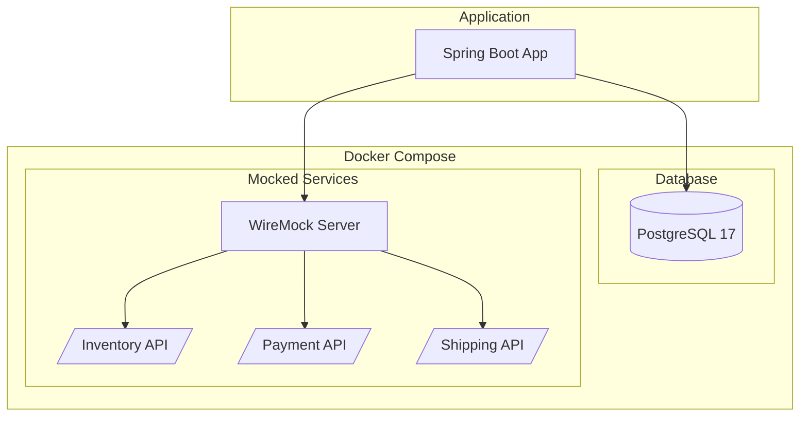
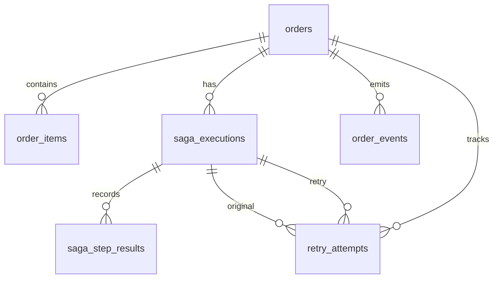

# Infrastructure Setup

## Overview

This document describes the local development infrastructure for the saga pattern spike, including database and external service mocks.

## Architecture



## Services

### PostgreSQL Database

| Property | Value |
|----------|-------|
| Image | `postgres:17-alpine` |
| Container | `saga-postgres` |
| Port | `5432` |
| Database | `saga_db` |
| Username | `saga_user` |
| Password | `saga_password` |

**Connection URL:**
```
jdbc:postgresql://localhost:5432/saga_db
```

### WireMock Server

| Property | Value |
|----------|-------|
| Image | `wiremock/wiremock:3.9.2` |
| Container | `saga-wiremock` |
| Port | `8081` |
| Admin UI | `http://localhost:8081/__admin` |

**Base URL:**
```
http://localhost:8081
```

## Quick Start

### Start Services

```bash
docker compose up -d
```

### Stop Services

```bash
docker compose down
```

### Reset Database

```bash
docker compose down -v
docker compose up -d
```

### View Logs

```bash
# All services
docker compose logs -f

# Specific service
docker compose logs -f postgres
docker compose logs -f wiremock
```

## Database Schema

The database is automatically initialized with the schema defined in `docker/postgres/init/01-schema.sql`.

### Tables

| Table | Purpose |
|-------|---------|
| `orders` | Order records |
| `order_items` | Line items for orders |
| `saga_executions` | Saga execution tracking |
| `saga_step_results` | Individual step outcomes |
| `order_events` | Event history for orders |
| `retry_attempts` | Retry attempt tracking |

### Entity Relationship



## WireMock Stub Mappings

### Inventory Service

| Endpoint | Method | Description |
|----------|--------|-------------|
| `/api/inventory/reservations` | POST | Reserve inventory |
| `/api/inventory/reservations/{id}` | DELETE | Release reservation |
| `/api/inventory/reservations/{id}` | GET | Get reservation status |
| `/api/inventory/products/{id}/availability` | GET | Check availability |

**Failure Scenarios:**
- Product ID `out-of-stock-product` triggers `INVENTORY_UNAVAILABLE` error

### Payment Service

| Endpoint | Method | Description |
|----------|--------|-------------|
| `/api/payments/authorize` | POST | Authorize payment |
| `/api/payments/authorizations/{id}/void` | POST | Void authorization |
| `/api/payments/authorizations/{id}/capture` | POST | Capture payment |
| `/api/payments/authorizations/{id}` | GET | Get authorization status |

**Failure Scenarios:**
- Payment method ID `declined-card` triggers `PAYMENT_DECLINED` error (retryable)
- Payment method ID `fraud-card` triggers `FRAUD_DETECTED` error (non-retryable)

### Shipping Service

| Endpoint | Method | Description |
|----------|--------|-------------|
| `/api/shipments` | POST | Create shipment |
| `/api/shipments/{id}/cancel` | POST | Cancel shipment |
| `/api/shipments/{id}` | GET | Get shipment status |
| `/api/shipments/rates` | POST | Get shipping rates |

**Failure Scenarios:**
- Postal code `00000` triggers `INVALID_ADDRESS` error (retryable)
- Country code `XX` triggers `SHIPPING_UNAVAILABLE` error (non-retryable)

## Application Configuration

### application.yml

```yaml
spring:
  r2dbc:
    url: r2dbc:postgresql://localhost:5432/saga_db
    username: saga_user
    password: saga_password

saga:
  services:
    inventory:
      base-url: http://localhost:8081/api/inventory
    payment:
      base-url: http://localhost:8081/api/payments
    shipping:
      base-url: http://localhost:8081/api/shipments
```

## Testing with WireMock

### Verify Stub Mappings

```bash
curl http://localhost:8081/__admin/mappings
```

### Test Inventory Reservation

```bash
curl -X POST http://localhost:8081/api/inventory/reservations \
  -H "Content-Type: application/json" \
  -d '{
    "orderId": "550e8400-e29b-41d4-a716-446655440000",
    "items": [{"productId": "abc123", "quantity": 2}]
  }'
```

### Test Payment Authorization

```bash
curl -X POST http://localhost:8081/api/payments/authorize \
  -H "Content-Type: application/json" \
  -d '{
    "orderId": "550e8400-e29b-41d4-a716-446655440000",
    "amount": 99.99,
    "paymentMethodId": "valid-card"
  }'
```

### Test Declined Payment

```bash
curl -X POST http://localhost:8081/api/payments/authorize \
  -H "Content-Type: application/json" \
  -d '{
    "orderId": "550e8400-e29b-41d4-a716-446655440000",
    "amount": 99.99,
    "paymentMethodId": "declined-card"
  }'
```

### Test Shipment Creation

```bash
curl -X POST http://localhost:8081/api/shipments \
  -H "Content-Type: application/json" \
  -d '{
    "orderId": "550e8400-e29b-41d4-a716-446655440000",
    "shippingAddress": {
      "street": "123 Main St",
      "city": "Anytown",
      "state": "CA",
      "postalCode": "90210",
      "country": "US"
    }
  }'
```

## Health Checks

Both services include health checks:

```bash
# PostgreSQL
docker exec saga-postgres pg_isready -U saga_user -d saga_db

# WireMock
curl http://localhost:8081/__admin/health
```

## Troubleshooting

### Port Conflicts

If ports 5432 or 8081 are in use, modify `docker-compose.yml`:

```yaml
ports:
  - "5433:5432"  # PostgreSQL on 5433
  - "8082:8080"  # WireMock on 8082
```

### Database Connection Issues

1. Verify container is running: `docker ps`
2. Check logs: `docker compose logs postgres`
3. Test connection: `psql -h localhost -U saga_user -d saga_db`

### WireMock Mapping Issues

1. Check admin UI: `http://localhost:8081/__admin`
2. View near-misses: `http://localhost:8081/__admin/requests/unmatched/near-misses`
3. Verify mappings loaded: `curl http://localhost:8081/__admin/mappings`
