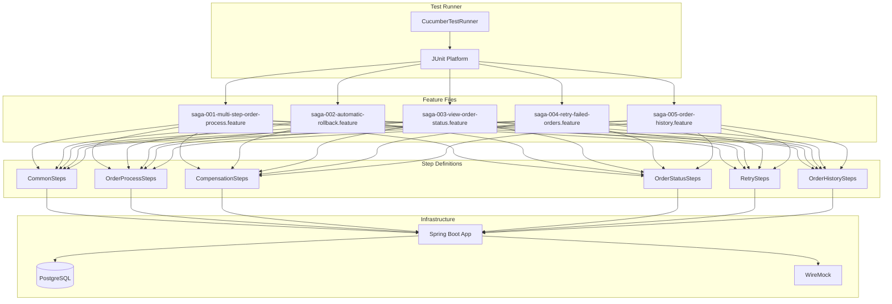

# Implementation Plan: Acceptance Testing with Cucumber

## Overview

Configure and implement Cucumber-based acceptance testing for validating the saga pattern user stories. Tests are organized by feature and tagged for selective execution.

## Architecture



## Test Configuration

### Dependencies

```kotlin
val cucumberVersion = "7.20.1"

testImplementation("io.cucumber:cucumber-java:$cucumberVersion")
testImplementation("io.cucumber:cucumber-junit-platform-engine:$cucumberVersion")
testImplementation("io.cucumber:cucumber-spring:$cucumberVersion")
testImplementation("org.junit.platform:junit-platform-suite")
```

### Directory Structure

```
src/test/
├── kotlin/com/pintailconsultingllc/sagapattern/acceptance/
│   ├── CucumberTestRunner.kt           # JUnit Platform test runner
│   ├── config/
│   │   ├── AcceptanceTestConfig.kt     # Test-specific Spring beans
│   │   └── TestContext.kt              # Shared scenario state
│   ├── hooks/
│   │   └── ScenarioHooks.kt            # Before/After hooks
│   └── steps/
│       ├── CommonSteps.kt              # Shared step definitions
│       ├── OrderProcessSteps.kt        # SAGA-001 steps
│       ├── CompensationSteps.kt        # SAGA-002 steps
│       ├── OrderStatusSteps.kt         # SAGA-003 steps
│       ├── RetrySteps.kt               # SAGA-004 steps
│       └── OrderHistorySteps.kt        # SAGA-005 steps
└── resources/
    ├── cucumber.properties             # Cucumber configuration
    └── features/
        ├── saga-001-multi-step-order-process.feature
        ├── saga-002-automatic-rollback.feature
        ├── saga-003-view-order-status.feature
        ├── saga-004-retry-failed-orders.feature
        └── saga-005-order-history.feature
```

## Feature Files

### Tag Organization

| Tag | Description |
|-----|-------------|
| `@saga` | All saga pattern tests |
| `@saga-001` | SAGA-001: Multi-step order process |
| `@saga-002` | SAGA-002: Automatic rollback |
| `@saga-003` | SAGA-003: View order status |
| `@saga-004` | SAGA-004: Retry failed orders |
| `@saga-005` | SAGA-005: Order history |
| `@happy-path` | Success scenario tests |
| `@compensation` | Compensation/rollback tests |
| `@retry` | Retry functionality tests |
| `@history` | History/timeline tests |
| `@integration` | Tests requiring Docker infrastructure |

### Scenario Coverage

| Feature | Scenarios | Tags |
|---------|-----------|------|
| saga-001 | 4 | happy-path, saga-state, integration |
| saga-002 | 8 | compensation, notification, idempotent |
| saga-003 | 7 | status, api, timestamps |
| saga-004 | 10 | retry, eligibility, limits, concurrent |
| saga-005 | 10 | history, timeline, events, api |

## Running Tests

### All Acceptance Tests

```bash
./gradlew test --tests "*.CucumberTestRunner"
```

### By Feature Tag

```bash
# Single user story
./gradlew test -Dcucumber.filter.tags="@saga-001"

# Multiple tags (OR)
./gradlew test -Dcucumber.filter.tags="@saga-001 or @saga-002"

# Multiple tags (AND)
./gradlew test -Dcucumber.filter.tags="@saga and @happy-path"

# Exclude tags
./gradlew test -Dcucumber.filter.tags="@saga and not @integration"
```

### By Scenario Type

```bash
# Only happy path tests
./gradlew test -Dcucumber.filter.tags="@happy-path"

# Only compensation tests
./gradlew test -Dcucumber.filter.tags="@compensation"

# Only integration tests (requires Docker)
./gradlew test -Dcucumber.filter.tags="@integration"
```

## Test Reports

### Report Locations

| Report | Path |
|--------|------|
| HTML Report | `build/reports/cucumber/cucumber-report.html` |
| JSON Report | `build/reports/cucumber/cucumber-report.json` |
| JUnit XML | `build/test-results/test/` |

### Sample HTML Report

The HTML report includes:
- Scenario pass/fail status
- Step execution details
- Tags and metadata
- Execution time
- Error stack traces for failures

## WireMock Integration

### Test Triggers

Tests use specific values to trigger WireMock failure scenarios:

| Scenario | Trigger | Expected Response |
|----------|---------|-------------------|
| Out of stock | `productId: out-of-stock-product` | 409 INVENTORY_UNAVAILABLE |
| Payment declined | `paymentMethodId: declined-card` | 402 PAYMENT_DECLINED |
| Fraud detected | `paymentMethodId: fraud-card` | 403 FRAUD_DETECTED |
| Invalid address | `postalCode: 00000` | 400 INVALID_ADDRESS |
| Undeliverable | `country: XX` | 422 SHIPPING_UNAVAILABLE |

### WireMock Verification

Step definitions should verify WireMock interactions:

```kotlin
// Verify compensation endpoints were called
@Then("the inventory reservation should be automatically released")
fun theInventoryReservationShouldBeAutomaticallyReleased() {
    // Use WireMock verification API
    // GET http://localhost:8081/__admin/requests/count
    // Match: DELETE /api/inventory/reservations/{id}
}
```

## Step Definition Implementation

### Common Pattern

```kotlin
@Given("I have a valid customer account")
fun iHaveAValidCustomerAccount() {
    testContext.customerId = UUID.randomUUID()
    // Set up customer in database or context
}

@When("I submit my order")
fun iSubmitMyOrder() {
    val response = webClient.post()
        .uri("/api/orders")
        .bodyValue(buildOrderRequest())
        .retrieve()
        .bodyToMono<OrderResponse>()
        .block()

    testContext.orderId = response?.orderId
    testContext.orderResponse = response?.toMap()
}

@Then("the order status should be {string}")
fun theOrderStatusShouldBe(expectedStatus: String) {
    val actualStatus = testContext.orderResponse?.get("status")
    assertThat(actualStatus).isEqualTo(expectedStatus)
}
```

### DataTable Handling

```kotlin
@Then("I should see the following step statuses:")
fun iShouldSeeTheFollowingStepStatuses(dataTable: DataTable) {
    val expectedSteps = dataTable.asMaps()
    val actualSteps = testContext.statusResponse?.get("steps") as List<Map<String, Any>>

    expectedSteps.forEachIndexed { index, expected ->
        assertThat(actualSteps[index]["name"]).isEqualTo(expected["step"])
        assertThat(actualSteps[index]["status"]).isEqualTo(expected["status"])
    }
}
```

## Prerequisites

Before running acceptance tests:

1. Start Docker infrastructure:
   ```bash
   docker compose up -d
   ```

2. Verify services are healthy:
   ```bash
   curl http://localhost:8081/__admin/health
   docker exec saga-postgres pg_isready -U saga_user
   ```

3. Run tests:
   ```bash
   ./gradlew test --tests "*.CucumberTestRunner"
   ```

## CI/CD Integration

### GitHub Actions Example

```yaml
acceptance-tests:
  runs-on: ubuntu-latest
  services:
    postgres:
      image: postgres:17-alpine
      env:
        POSTGRES_USER: saga_user
        POSTGRES_PASSWORD: saga_password
        POSTGRES_DB: saga_db
      ports:
        - 5432:5432
    wiremock:
      image: wiremock/wiremock:3.9.2
      ports:
        - 8081:8080

  steps:
    - uses: actions/checkout@v4
    - name: Set up JDK 24
      uses: actions/setup-java@v4
      with:
        java-version: '24'
        distribution: 'corretto'
    - name: Run acceptance tests
      run: ./gradlew test --tests "*.CucumberTestRunner"
    - name: Upload Cucumber reports
      uses: actions/upload-artifact@v4
      with:
        name: cucumber-reports
        path: build/reports/cucumber/
```

## Dependencies

| Story | Test Coverage |
|-------|---------------|
| SAGA-001 | saga-001-multi-step-order-process.feature |
| SAGA-002 | saga-002-automatic-rollback.feature |
| SAGA-003 | saga-003-view-order-status.feature |
| SAGA-004 | saga-004-retry-failed-orders.feature |
| SAGA-005 | saga-005-order-history.feature |

## Implementation Status

| Component | Status | Notes |
|-----------|--------|-------|
| CucumberTestRunner | ✅ Complete | JUnit Platform Suite with glue paths and report plugins |
| cucumber.properties | ✅ Complete | Spring factory, glue paths, snippet type, report plugins |
| AcceptanceTestConfig | ✅ Complete | WebClient beans for app, WireMock, and admin API |
| TestContext | ✅ Complete | Shared scenario state with reset capability |
| ScenarioHooks | ✅ Complete | Infrastructure health checks, tag-specific hooks, logging |
| CommonSteps | ✅ Complete | Shared step definitions with PendingException pattern |
| Feature Files | ✅ Complete | All 5 feature files with comprehensive scenarios |
| Step Definitions | 🔄 Pending | Await saga implementation (SAGA-001 through SAGA-005) |

### Implemented Features

- **Test Runner Configuration**
  - JUnit Platform Suite integration
  - Glue paths for steps and hooks packages
  - HTML and JSON report generation
  - CamelCase snippet type for step generation

- **Scenario Hooks**
  - `@Before(order = 0)` - Reset test context and log scenario start
  - `@After(order = 0)` - Log scenario completion and failure details
  - `@Before("@integration", order = 1)` - Infrastructure health checks (PostgreSQL, WireMock)
  - `@After("@compensation", order = 1)` - Clear WireMock request journal
  - `@Before("@observability", order = 1)` - Log tracing context info
  - `@Before("@retry", order = 1)` - Reset retry-specific context

- **Test Configuration**
  - `wireMockWebClient` - Calls WireMock stub endpoints
  - `applicationWebClient` - Calls application under test
  - `wireMockAdminClient` - WireMock admin API operations
  - Trigger constants for failure scenarios (out-of-stock, declined-card, fraud, etc.)

- **Infrastructure Verification**
  - Socket-based port checks for PostgreSQL (5432) and WireMock (8081)
  - WireMock health endpoint verification
  - JUnit Assumptions for graceful test skipping when infrastructure unavailable
