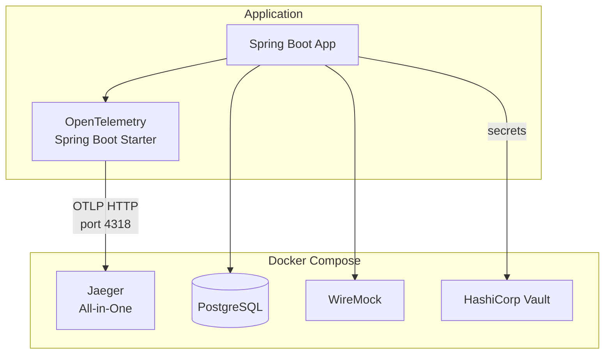

# Observability Integration: OpenTelemetry and Jaeger

## Status: ✅ COMPLETED

**Implementation Date:** December 2025

## Overview

This document describes the implementation of distributed tracing using OpenTelemetry and Jaeger in the saga pattern spike application. The integration provides end-to-end visibility into saga execution, compensation flows, and external service interactions.

### Implementation Notes

The implementation uses **Spring Boot 4.0's native OpenTelemetry support** via `spring-boot-starter-opentelemetry`. This provides:

- Native integration with Micrometer's Observation API
- Automatic OTLP export configuration
- Seamless WebClient instrumentation
- Zero-code instrumentation for HTTP server/client

## Goals

- **Distributed Tracing** - Trace requests across saga orchestration steps and external service calls
- **Saga-Specific Observability** - Track saga execution, compensation flows, and service interactions
- **Simple Infrastructure** - Single-container observability backend for local development

## Architecture



## Infrastructure

### Jaeger All-in-One

Jaeger provides a simple single-container solution for distributed tracing.

```yaml
# docker-compose.yml
jaeger:
  image: jaegertracing/all-in-one:1.54
  container_name: saga-jaeger
  ports:
    - "16686:16686"  # Jaeger UI
    - "4317:4317"    # OTLP gRPC
    - "4318:4318"    # OTLP HTTP
  environment:
    - COLLECTOR_OTLP_ENABLED=true
```

### Ports

| Service | Port | Purpose |
|---------|------|---------|
| Jaeger UI | 16686 | Trace visualization |
| OTLP gRPC | 4317 | Trace receiver (gRPC) |
| OTLP HTTP | 4318 | Trace receiver (HTTP) |

### Limitations

Jaeger only supports **traces**. For metrics and logs:
- Metrics are available via `/actuator/metrics` endpoint
- Logs are written to stdout/file as configured in logback

## Application Configuration

### Dependencies

```kotlin
// build.gradle.kts
dependencies {
    // OpenTelemetry (Spring Boot 4.0 native support)
    implementation("org.springframework.boot:spring-boot-starter-opentelemetry")

    // AspectJ for @Observed annotation support
    implementation("org.springframework.boot:spring-boot-starter-aspectj")
}
```

### Configuration Properties

```yaml
# application.yaml
spring:
  application:
    name: sagapattern

management:
  tracing:
    enabled: true
    sampling:
      probability: 1.0  # 100% for development
  opentelemetry:
    tracing:
      export:
        otlp:
          endpoint: ${OTEL_EXPORTER_OTLP_ENDPOINT:http://localhost:4318}/v1/traces
  otlp:
    metrics:
      export:
        enabled: false  # Jaeger only supports traces
    logging:
      export:
        enabled: false  # Jaeger only supports traces
```

### Profile-Specific Configuration

**Production** (`application-prod.yaml`):
```yaml
management:
  tracing:
    sampling:
      probability: 0.1  # 10% sampling in production
  opentelemetry:
    tracing:
      export:
        otlp:
          endpoint: ${OTEL_EXPORTER_OTLP_ENDPOINT}
```

**Testing** (`application-test.yaml`):
```yaml
management:
  tracing:
    enabled: false  # Disable tracing in tests
```

## Instrumentation

### Automatic Instrumentation

Spring Boot 4.0's OpenTelemetry starter automatically instruments:

- HTTP server (all controller endpoints)
- HTTP client (WebClient, RestClient)
- R2DBC database calls

### Manual Instrumentation with @Observed

Add observability to any method using the `@Observed` annotation:

```kotlin
@Configuration
class ObservabilityConfig {
    @Bean
    fun observedAspect(observationRegistry: ObservationRegistry): ObservedAspect {
        return ObservedAspect(observationRegistry)
    }
}

// Usage
@Observed(name = "saga.step.execute", contextualName = "inventory-reservation")
suspend fun reserveInventory(request: InventoryRequest): InventoryResponse {
    // Implementation
}
```

### Custom Metrics

Custom saga metrics are collected via Micrometer (available at `/actuator/metrics`):

| Metric | Description |
|--------|-------------|
| `saga.started` | Counter of sagas initiated |
| `saga.completed` | Counter of successful sagas |
| `saga.compensated` | Counter of compensated sagas |
| `saga.duration` | Histogram of saga execution time |
| `saga.step.duration` | Histogram of individual step times |
| `saga.step.failed` | Counter of step failures by step name |

## Trace Structure

A typical saga execution creates the following trace hierarchy:

```
saga-orchestration (root span)
├── inventory-reservation
│   └── HTTP POST /api/inventory/reserve
├── payment-processing
│   └── HTTP POST /api/payments/authorize
├── shipping-arrangement
│   └── HTTP POST /api/shipments/create
└── saga-completion
```

For compensated sagas:

```
saga-orchestration (root span)
├── inventory-reservation
├── payment-processing
│   └── HTTP POST /api/payments/authorize (error)
├── compensation
│   └── inventory-release
│       └── HTTP POST /api/inventory/release
└── saga-compensated
```

## Usage

### Start Infrastructure

```bash
docker compose up -d
```

### View Traces

1. Open Jaeger UI: http://localhost:16686
2. Select "sagapattern" from the Service dropdown
3. Click "Find Traces"
4. Click on any trace to see the span breakdown

### Verify Configuration

```bash
# Check Jaeger is running
curl -s http://localhost:16686/ | head -1

# Make a request to generate traces
curl -X POST http://localhost:8080/api/orders \
  -H "Content-Type: application/json" \
  -d '{"customerId": "...", "items": [...], ...}'

# View metrics
curl http://localhost:8080/actuator/metrics/saga.started
```

## Environment Variables

| Variable | Description | Default |
|----------|-------------|---------|
| `OTEL_EXPORTER_OTLP_ENDPOINT` | OTLP collector endpoint | `http://localhost:4318` |
| `DEPLOYMENT_ENV` | Deployment environment tag | `development` |

## References

- [Spring Boot 4.0 OpenTelemetry Guide](https://spring.io/blog/2025/11/18/opentelemetry-with-spring-boot/)
- [Jaeger Documentation](https://www.jaegertracing.io/docs/)
- [OpenTelemetry Spring Boot Starter](https://opentelemetry.io/docs/zero-code/java/spring-boot-starter/)
- [Micrometer Observation API](https://micrometer.io/docs/observation)
