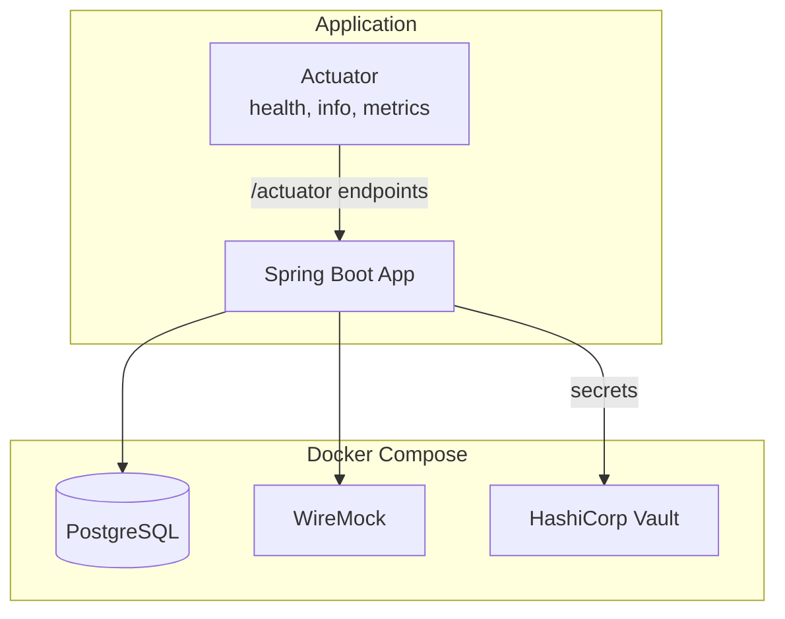
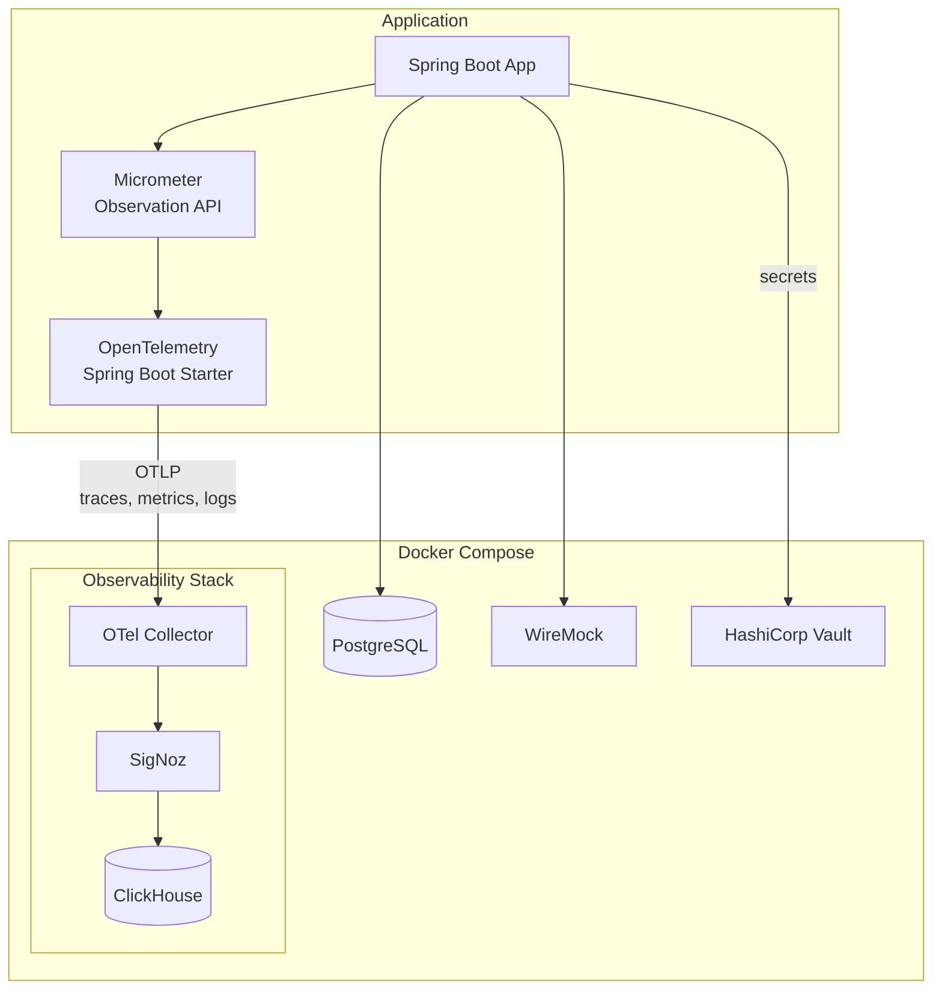
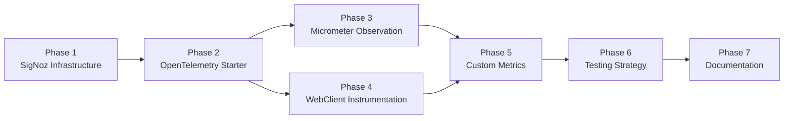

# Observability Integration: OpenTelemetry and SigNoz

## Status: ✅ COMPLETED

**Implementation Date:** December 2025

> **Note:** As of December 2025, the observability stack (SigNoz, ClickHouse, OTel Collector) starts by default with `docker compose up -d`. No separate profile is required.

## Overview

This document describes the implementation plan for integrating OpenTelemetry and SigNoz into the saga pattern spike application for comprehensive observability. This integration provides distributed tracing, metrics collection, and log correlation across the application and its external service interactions.

### Implementation Notes

The implementation uses **Spring Boot 4.0's native OpenTelemetry support** via `spring-boot-starter-opentelemetry` instead of the OpenTelemetry instrumentation library (`opentelemetry-spring-boot-starter`). This provides:

- Native integration with Micrometer's Observation API
- Automatic OTLP export configuration via `management.otlp.*` properties
- Seamless WebClient instrumentation

## Goals

- **Distributed Tracing** - Trace requests across saga orchestration steps and external service calls
- **Metrics Collection** - Collect application metrics including JVM stats, HTTP server/client metrics, and custom business metrics
- **Log Correlation** - Correlate logs with trace context for easier debugging
- **Unified Visualization** - Use SigNoz as the observability backend for traces, metrics, and logs
- **Saga-Specific Observability** - Track saga execution, compensation flows, and service interactions

## Architecture

### Current State



### Target State



## Telemetry Signals

### Three Pillars of Observability

| Signal | Description | Use Case |
|--------|-------------|----------|
| **Traces** | Distributed request flows across services | Debug saga execution, identify latency bottlenecks |
| **Metrics** | Quantitative measurements over time | Monitor performance, alert on anomalies |
| **Logs** | Contextual events with trace correlation | Debug issues, audit saga operations |

### Saga-Specific Telemetry

| Telemetry | Description | Implementation |
|-----------|-------------|----------------|
| Saga execution trace | Complete flow from initiation to completion/compensation | Parent span for saga with child spans per step |
| Step duration metrics | Time spent in each saga step | Histogram metrics per step |
| Compensation tracking | When and why compensations occur | Trace events + log correlation |
| External service calls | Latency and success rate of inventory/payment/shipping calls | HTTP client instrumentation |

## Technology Stack

### OpenTelemetry Components

| Component | Version | Purpose |
|-----------|---------|---------|
| OpenTelemetry Instrumentation BOM | 2.22.0+ | Dependency version management |
| OpenTelemetry Spring Boot Starter | (via BOM) | Auto-instrumentation for Spring |
| Micrometer Tracing | (via Spring Boot) | Observation API bridge |
| OTLP Exporter | (via starter) | Export telemetry via OTLP protocol |

### SigNoz Components

| Component | Purpose | Port |
|-----------|---------|------|
| SigNoz OTel Collector | Receive and process telemetry | 4317 (gRPC), 4318 (HTTP) |
| SigNoz Query Service | API and UI | 8080 |
| ClickHouse | Time-series storage | Internal |
| ZooKeeper | Coordination | Internal |

## Implementation Phases

### Phase 1: SigNoz Infrastructure Setup

Add SigNoz and OpenTelemetry Collector to Docker Compose for local development.

#### 1.1 Update docker-compose.yml

Add SigNoz services using their official Docker Compose configuration:

```yaml
services:
  # ... existing services ...

  # SigNoz OpenTelemetry Collector
  otel-collector:
    image: signoz/signoz-otel-collector:0.111.10
    container_name: saga-otel-collector
    command:
      - "--config=/etc/otel-collector-config.yaml"
    ports:
      - "4317:4317"   # OTLP gRPC
      - "4318:4318"   # OTLP HTTP
    volumes:
      - ./docker/otel-collector/otel-collector-config.yaml:/etc/otel-collector-config.yaml
    depends_on:
      clickhouse:
        condition: service_healthy
    healthcheck:
      test: ["CMD", "wget", "--spider", "-q", "http://localhost:13133/"]
      interval: 10s
      timeout: 5s
      retries: 5

  clickhouse:
    image: clickhouse/clickhouse-server:24.1.2-alpine
    container_name: saga-clickhouse
    ports:
      - "9000:9000"   # Native protocol
      - "8123:8123"   # HTTP interface
    volumes:
      - clickhouse_data:/var/lib/clickhouse
      - ./docker/clickhouse/config.xml:/etc/clickhouse-server/config.d/config.xml
      - ./docker/clickhouse/users.xml:/etc/clickhouse-server/users.d/users.xml
    healthcheck:
      test: ["CMD", "wget", "--spider", "-q", "http://localhost:8123/ping"]
      interval: 10s
      timeout: 5s
      retries: 5

  signoz-query-service:
    image: signoz/query-service:0.51.2
    container_name: saga-signoz-query
    ports:
      - "8080:8080"
    environment:
      - ClickHouseUrl=tcp://clickhouse:9000
      - STORAGE=clickhouse
      - GODEBUG=netdns=go
    depends_on:
      clickhouse:
        condition: service_healthy
      otel-collector:
        condition: service_healthy
    healthcheck:
      test: ["CMD", "wget", "--spider", "-q", "http://localhost:8080/api/v1/health"]
      interval: 10s
      timeout: 5s
      retries: 5

  signoz-frontend:
    image: signoz/frontend:0.51.2
    container_name: saga-signoz-frontend
    ports:
      - "3301:3301"
    depends_on:
      signoz-query-service:
        condition: service_healthy

volumes:
  clickhouse_data:
```

#### 1.2 Create OTel Collector Configuration

Create `docker/otel-collector/otel-collector-config.yaml`:

```yaml
receivers:
  otlp:
    protocols:
      grpc:
        endpoint: 0.0.0.0:4317
      http:
        endpoint: 0.0.0.0:4318

processors:
  batch:
    timeout: 10s

  # Add resource detection for container info
  resourcedetection:
    detectors:
      - env
      - system
    override: false

  # Memory limiter to prevent OOM
  memory_limiter:
    check_interval: 5s
    limit_mib: 512
    spike_limit_mib: 128

exporters:
  clickhousetraces:
    datasource: tcp://clickhouse:9000/signoz_traces
    low_cardinal_exception_grouping: true

  clickhousemetricswrite:
    endpoint: tcp://clickhouse:9000/signoz_metrics

  clickhouselogsexporter:
    dsn: tcp://clickhouse:9000/signoz_logs

service:
  pipelines:
    traces:
      receivers: [otlp]
      processors: [memory_limiter, batch, resourcedetection]
      exporters: [clickhousetraces]

    metrics:
      receivers: [otlp]
      processors: [memory_limiter, batch]
      exporters: [clickhousemetricswrite]

    logs:
      receivers: [otlp]
      processors: [memory_limiter, batch]
      exporters: [clickhouselogsexporter]

extensions:
  health_check:
    endpoint: 0.0.0.0:13133
```

#### 1.3 Create ClickHouse Configuration

Create `docker/clickhouse/config.xml`:

```xml
<?xml version="1.0"?>
<clickhouse>
    <logger>
        <level>warning</level>
        <console>true</console>
    </logger>

    <http_port>8123</http_port>
    <tcp_port>9000</tcp_port>

    <max_connections>4096</max_connections>
    <keep_alive_timeout>3</keep_alive_timeout>

    <max_concurrent_queries>100</max_concurrent_queries>

    <path>/var/lib/clickhouse/</path>
    <tmp_path>/var/lib/clickhouse/tmp/</tmp_path>
</clickhouse>
```

Create `docker/clickhouse/users.xml`:

```xml
<?xml version="1.0"?>
<clickhouse>
    <users>
        <default>
            <password></password>
            <networks>
                <ip>::/0</ip>
            </networks>
            <profile>default</profile>
            <quota>default</quota>
            <access_management>1</access_management>
        </default>
    </users>
</clickhouse>
```

#### 1.4 Tasks

| Task | Description | Files |
|------|-------------|-------|
| 1.1.1 | Add SigNoz services to docker-compose.yml | `docker-compose.yml` |
| 1.2.1 | Create OTel Collector config directory | `docker/otel-collector/` |
| 1.2.2 | Create OTel Collector configuration | `docker/otel-collector/otel-collector-config.yaml` |
| 1.3.1 | Create ClickHouse config directory | `docker/clickhouse/` |
| 1.3.2 | Create ClickHouse server configuration | `docker/clickhouse/config.xml` |
| 1.3.3 | Create ClickHouse users configuration | `docker/clickhouse/users.xml` |
| 1.4.1 | Test SigNoz stack starts correctly | Manual verification |
| 1.4.2 | Verify OTel Collector health endpoint | `curl http://localhost:13133/` |
| 1.4.3 | Access SigNoz UI | `http://localhost:3301` |

### Phase 2: OpenTelemetry Spring Boot Integration

Add OpenTelemetry dependencies and configuration to the Spring Boot application.

#### 2.1 Update build.gradle.kts

```kotlin
// Add OpenTelemetry BOM
val openTelemetryVersion = "2.22.0"

dependencies {
    // ... existing dependencies ...

    // OpenTelemetry Spring Boot Starter
    implementation(platform("io.opentelemetry.instrumentation:opentelemetry-instrumentation-bom:$openTelemetryVersion"))
    implementation("io.opentelemetry.instrumentation:opentelemetry-spring-boot-starter")

    // Additional instrumentation for reactive support
    implementation("io.opentelemetry.instrumentation:opentelemetry-reactor-3.1")

    // Logback appender for log export via OTLP
    implementation("io.opentelemetry.instrumentation:opentelemetry-logback-appender-1.0")
}
```

#### 2.2 Update application.yaml

```yaml
spring:
  application:
    name: sagapattern
  # ... existing config ...

# OpenTelemetry Configuration
otel:
  sdk:
    disabled: false
  service:
    name: sagapattern
  resource:
    attributes:
      deployment.environment: ${DEPLOYMENT_ENV:development}
      service.namespace: saga-spike
      service.version: ${APP_VERSION:0.0.1-SNAPSHOT}
  exporter:
    otlp:
      endpoint: http://localhost:4317
      protocol: grpc
  traces:
    exporter: otlp
  metrics:
    exporter: otlp
  logs:
    exporter: otlp
  propagators:
    - tracecontext
    - baggage

# Update management endpoints
management:
  endpoints:
    web:
      exposure:
        include: health,info,metrics,prometheus
  tracing:
    enabled: true
    sampling:
      probability: 1.0  # 100% for development
  otlp:
    tracing:
      endpoint: http://localhost:4318/v1/traces
    metrics:
      export:
        enabled: true
        step: 10s
```

#### 2.3 Create Production Profile

Create `src/main/resources/application-prod.yaml`:

```yaml
otel:
  exporter:
    otlp:
      endpoint: ${OTEL_EXPORTER_OTLP_ENDPOINT}
      headers: ${OTEL_EXPORTER_OTLP_HEADERS:}
  traces:
    sampler:
      arg: 0.1  # 10% sampling in production

management:
  tracing:
    sampling:
      probability: 0.1
```

#### 2.4 Configure Logback for OTLP Export

Create `src/main/resources/logback-spring.xml`:

```xml
<?xml version="1.0" encoding="UTF-8"?>
<configuration>
    <include resource="org/springframework/boot/logging/logback/defaults.xml"/>
    <include resource="org/springframework/boot/logging/logback/console-appender.xml"/>

    <!-- OpenTelemetry Logback Appender -->
    <appender name="OTEL" class="io.opentelemetry.instrumentation.logback.appender.v1_0.OpenTelemetryAppender">
        <captureExperimentalAttributes>true</captureExperimentalAttributes>
        <captureCodeAttributes>true</captureCodeAttributes>
    </appender>

    <root level="INFO">
        <appender-ref ref="CONSOLE"/>
        <appender-ref ref="OTEL"/>
    </root>

    <!-- Saga-specific logging -->
    <logger name="com.pintailconsultingllc.sagapattern" level="DEBUG"/>
</configuration>
```

#### 2.5 Tasks

| Task | Description | Files |
|------|-------------|-------|
| 2.1.1 | Add OpenTelemetry BOM to build.gradle.kts | `build.gradle.kts` |
| 2.1.2 | Add OpenTelemetry Spring Boot starter | `build.gradle.kts` |
| 2.1.3 | Add Reactor instrumentation | `build.gradle.kts` |
| 2.1.4 | Add Logback OTLP appender | `build.gradle.kts` |
| 2.2.1 | Configure OpenTelemetry in application.yaml | `application.yaml` |
| 2.2.2 | Update management endpoints | `application.yaml` |
| 2.3.1 | Create production profile | `application-prod.yaml` |
| 2.4.1 | Create Logback configuration | `logback-spring.xml` |
| 2.5.1 | Build and verify dependencies resolve | `./gradlew build` |

### Phase 3: Micrometer Observation API Integration

Configure Micrometer's Observation API for custom instrumentation.

#### 3.1 Create Observation Configuration

Create `src/main/kotlin/com/pintailconsultingllc/sagapattern/config/ObservabilityConfig.kt`:

```kotlin
package com.pintailconsultingllc.sagapattern.config

import io.micrometer.observation.ObservationRegistry
import io.micrometer.observation.aop.ObservedAspect
import org.springframework.boot.actuate.autoconfigure.observation.ObservationAutoConfiguration
import org.springframework.context.annotation.Bean
import org.springframework.context.annotation.Configuration

@Configuration
class ObservabilityConfig {

    /**
     * Enable @Observed annotation support for automatic observation creation.
     * This allows methods to be instrumented with just an annotation.
     */
    @Bean
    fun observedAspect(observationRegistry: ObservationRegistry): ObservedAspect {
        return ObservedAspect(observationRegistry)
    }
}
```

#### 3.2 Example Saga Orchestrator with Observations

```kotlin
package com.pintailconsultingllc.sagapattern.saga

import io.micrometer.observation.Observation
import io.micrometer.observation.ObservationRegistry
import io.micrometer.observation.annotation.Observed
import kotlinx.coroutines.reactor.awaitSingle
import org.springframework.stereotype.Service

@Service
class OrderSagaOrchestrator(
    private val observationRegistry: ObservationRegistry,
    private val inventoryService: InventoryService,
    private val paymentService: PaymentService,
    private val shippingService: ShippingService
) {

    @Observed(
        name = "saga.order.execute",
        contextualName = "execute-order-saga",
        lowCardinalityKeyValues = ["saga.type", "order"]
    )
    suspend fun executeSaga(orderId: String): SagaResult {
        return try {
            // Step 1: Reserve Inventory
            executeStep("reserve-inventory") {
                inventoryService.reserve(orderId)
            }

            // Step 2: Process Payment
            executeStep("process-payment") {
                paymentService.process(orderId)
            }

            // Step 3: Arrange Shipping
            executeStep("arrange-shipping") {
                shippingService.arrange(orderId)
            }

            SagaResult.Success(orderId)
        } catch (e: SagaStepException) {
            compensate(orderId, e.failedStep)
            SagaResult.Compensated(orderId, e.failedStep, e.message)
        }
    }

    private suspend fun <T> executeStep(stepName: String, block: suspend () -> T): T {
        return Observation.createNotStarted("saga.step", observationRegistry)
            .lowCardinalityKeyValue("saga.step.name", stepName)
            .observe {
                block()
            }
    }

    private suspend fun compensate(orderId: String, failedStep: String) {
        Observation.createNotStarted("saga.compensation", observationRegistry)
            .lowCardinalityKeyValue("saga.failed.step", failedStep)
            .observe {
                // Execute compensation steps in reverse order
                when (failedStep) {
                    "arrange-shipping" -> {
                        paymentService.refund(orderId)
                        inventoryService.release(orderId)
                    }
                    "process-payment" -> {
                        inventoryService.release(orderId)
                    }
                }
            }
    }
}
```

#### 3.3 Tasks

| Task | Description | Files |
|------|-------------|-------|
| 3.1.1 | Create ObservabilityConfig | `ObservabilityConfig.kt` |
| 3.1.2 | Add AspectJ dependency for @Observed | `build.gradle.kts` |
| 3.2.1 | Instrument saga orchestrator (when implemented) | Saga files |
| 3.3.1 | Verify traces appear in SigNoz | Manual verification |

### Phase 4: WebClient Instrumentation

Ensure outgoing HTTP calls to external services are traced.

#### 4.1 Configure Traced WebClient

Create `src/main/kotlin/com/pintailconsultingllc/sagapattern/config/WebClientConfig.kt`:

```kotlin
package com.pintailconsultingllc.sagapattern.config

import io.micrometer.observation.ObservationRegistry
import org.springframework.context.annotation.Bean
import org.springframework.context.annotation.Configuration
import org.springframework.web.reactive.function.client.WebClient

@Configuration
class WebClientConfig {

    /**
     * Creates a WebClient with observation support for automatic trace propagation.
     * The OpenTelemetry starter automatically instruments WebClient when the
     * ObservationRegistry is available.
     */
    @Bean
    fun webClient(
        webClientBuilder: WebClient.Builder,
        observationRegistry: ObservationRegistry
    ): WebClient {
        return webClientBuilder
            .observationRegistry(observationRegistry)
            .build()
    }

    /**
     * Inventory service client with base URL from configuration.
     */
    @Bean
    fun inventoryWebClient(
        webClientBuilder: WebClient.Builder,
        observationRegistry: ObservationRegistry,
        sagaServicesConfig: SagaServicesConfig
    ): WebClient {
        return webClientBuilder
            .baseUrl(sagaServicesConfig.inventory.baseUrl)
            .observationRegistry(observationRegistry)
            .build()
    }

    /**
     * Payment service client with base URL from configuration.
     */
    @Bean
    fun paymentWebClient(
        webClientBuilder: WebClient.Builder,
        observationRegistry: ObservationRegistry,
        sagaServicesConfig: SagaServicesConfig
    ): WebClient {
        return webClientBuilder
            .baseUrl(sagaServicesConfig.payment.baseUrl)
            .observationRegistry(observationRegistry)
            .build()
    }

    /**
     * Shipping service client with base URL from configuration.
     */
    @Bean
    fun shippingWebClient(
        webClientBuilder: WebClient.Builder,
        observationRegistry: ObservationRegistry,
        sagaServicesConfig: SagaServicesConfig
    ): WebClient {
        return webClientBuilder
            .baseUrl(sagaServicesConfig.shipping.baseUrl)
            .observationRegistry(observationRegistry)
            .build()
    }
}
```

#### 4.2 Tasks

| Task | Description | Files |
|------|-------------|-------|
| 4.1.1 | Create WebClientConfig with observation | `WebClientConfig.kt` |
| 4.2.1 | Verify HTTP client traces in SigNoz | Manual verification |

### Phase 5: Custom Metrics

Add custom metrics for saga-specific monitoring.

#### 5.1 Create Saga Metrics

Create `src/main/kotlin/com/pintailconsultingllc/sagapattern/metrics/SagaMetrics.kt`:

```kotlin
package com.pintailconsultingllc.sagapattern.metrics

import io.micrometer.core.instrument.Counter
import io.micrometer.core.instrument.MeterRegistry
import io.micrometer.core.instrument.Timer
import org.springframework.stereotype.Component
import java.time.Duration

@Component
class SagaMetrics(private val meterRegistry: MeterRegistry) {

    // Counters
    private val sagaStartedCounter = Counter.builder("saga.started")
        .description("Number of sagas started")
        .register(meterRegistry)

    private val sagaCompletedCounter = Counter.builder("saga.completed")
        .description("Number of sagas completed successfully")
        .register(meterRegistry)

    private val sagaCompensatedCounter = Counter.builder("saga.compensated")
        .description("Number of sagas that required compensation")
        .register(meterRegistry)

    // Timers
    private val sagaDurationTimer = Timer.builder("saga.duration")
        .description("Time taken to complete a saga")
        .register(meterRegistry)

    // Methods
    fun sagaStarted() = sagaStartedCounter.increment()

    fun sagaCompleted() = sagaCompletedCounter.increment()

    fun sagaCompensated(failedStep: String) {
        sagaCompensatedCounter.increment()
        Counter.builder("saga.step.failed")
            .tag("step", failedStep)
            .register(meterRegistry)
            .increment()
    }

    fun recordSagaDuration(duration: Duration) {
        sagaDurationTimer.record(duration)
    }

    fun <T> timeStep(stepName: String, block: () -> T): T {
        return Timer.builder("saga.step.duration")
            .tag("step", stepName)
            .register(meterRegistry)
            .recordCallable(block)!!
    }
}
```

#### 5.2 Tasks

| Task | Description | Files |
|------|-------------|-------|
| 5.1.1 | Create SagaMetrics component | `SagaMetrics.kt` |
| 5.2.1 | Integrate metrics into saga orchestrator | Saga files |
| 5.3.1 | Verify custom metrics in SigNoz | Manual verification |

### Phase 6: Testing Strategy

Configure testing to work with and without observability infrastructure.

#### 6.1 Test Configuration

Update `src/test/resources/application-test.yaml`:

```yaml
spring:
  application:
    name: sagapattern-test
  cloud:
    vault:
      enabled: false
  r2dbc:
    username: saga_user
    password: saga_password

# Disable OpenTelemetry for unit tests
otel:
  sdk:
    disabled: true

management:
  tracing:
    enabled: false
```

#### 6.2 Integration Test Configuration

Create `src/test/resources/application-integration.yaml`:

```yaml
spring:
  application:
    name: sagapattern-integration

# Enable observability for integration tests
otel:
  sdk:
    disabled: false
  exporter:
    otlp:
      endpoint: http://localhost:4317

management:
  tracing:
    enabled: true
    sampling:
      probability: 1.0
```

#### 6.3 Tasks

| Task | Description | Files |
|------|-------------|-------|
| 6.1.1 | Update test configuration with OTel disabled | `application-test.yaml` |
| 6.2.1 | Create integration test profile | `application-integration.yaml` |
| 6.3.1 | Verify existing tests pass | `./gradlew test` |

### Phase 7: Documentation and Verification

#### 7.1 Verification Checklist

| Verification | Command/URL | Expected Result |
|--------------|-------------|-----------------|
| SigNoz UI accessible | `http://localhost:3301` | Dashboard loads |
| OTel Collector healthy | `curl http://localhost:13133/` | Health status OK |
| Application starts | `./gradlew bootRun` | No errors |
| Traces visible | SigNoz > Traces | Application traces appear |
| Metrics visible | SigNoz > Metrics | JVM and custom metrics |
| Logs visible | SigNoz > Logs | Application logs with trace context |
| Tests pass | `./gradlew test` | All tests green |

#### 7.2 Tasks

| Task | Description | Files |
|------|-------------|-------|
| 7.1.1 | Run verification checklist | Manual |
| 7.2.1 | Update CLAUDE.md with observability commands | `CLAUDE.md` |

## Implementation Summary

### Phase Dependency Graph



### Files to Create/Modify

| Action | File | Phase |
|--------|------|-------|
| Modify | `docker-compose.yml` | 1 |
| Create | `docker/otel-collector/otel-collector-config.yaml` | 1 |
| Create | `docker/clickhouse/config.xml` | 1 |
| Create | `docker/clickhouse/users.xml` | 1 |
| Modify | `build.gradle.kts` | 2, 3 |
| Modify | `src/main/resources/application.yaml` | 2 |
| Create | `src/main/resources/application-prod.yaml` | 2 (update existing) |
| Create | `src/main/resources/logback-spring.xml` | 2 |
| Create | `src/main/kotlin/.../config/ObservabilityConfig.kt` | 3 |
| Create | `src/main/kotlin/.../config/WebClientConfig.kt` | 4 |
| Create | `src/main/kotlin/.../metrics/SagaMetrics.kt` | 5 |
| Modify | `src/test/resources/application-test.yaml` | 6 |
| Create | `src/test/resources/application-integration.yaml` | 6 |
| Modify | `CLAUDE.md` | 7 |

### Port Mapping Summary

| Service | Port | Purpose |
|---------|------|---------|
| Application | 8080 | Spring Boot application |
| SigNoz Frontend | 3301 | Observability UI |
| OTel Collector (gRPC) | 4317 | OTLP gRPC receiver |
| OTel Collector (HTTP) | 4318 | OTLP HTTP receiver |
| OTel Collector Health | 13133 | Health check endpoint |
| ClickHouse HTTP | 8123 | ClickHouse HTTP interface |
| ClickHouse Native | 9000 | ClickHouse native protocol |

### Environment Variables

| Variable | Description | Default |
|----------|-------------|---------|
| `OTEL_EXPORTER_OTLP_ENDPOINT` | OTLP collector endpoint | `http://localhost:4317` |
| `OTEL_EXPORTER_OTLP_HEADERS` | Additional headers (for SigNoz Cloud) | - |
| `DEPLOYMENT_ENV` | Deployment environment tag | `development` |
| `APP_VERSION` | Application version tag | `0.0.1-SNAPSHOT` |

### Rollback Plan

If OpenTelemetry integration causes issues:

1. Set `otel.sdk.disabled=true` in application configuration
2. Set `management.tracing.enabled=false`
3. Remove SigNoz services from docker-compose.yml
4. Revert dependency changes in build.gradle.kts

## References

- [OpenTelemetry Spring Boot Starter](https://opentelemetry.io/docs/zero-code/java/spring-boot-starter/)
- [OpenTelemetry with Spring Boot (Official Blog)](https://spring.io/blog/2025/11/18/opentelemetry-with-spring-boot/)
- [Micrometer Observation API](https://micrometer.io/docs/observation)
- [SigNoz Documentation](https://signoz.io/docs/)
- [SigNoz Docker Installation](https://signoz.io/docs/install/docker/)
- [OpenTelemetry Java Instrumentation](https://github.com/open-telemetry/opentelemetry-java-instrumentation)
- [Spring Boot Actuator](https://docs.spring.io/spring-boot/reference/actuator/)
