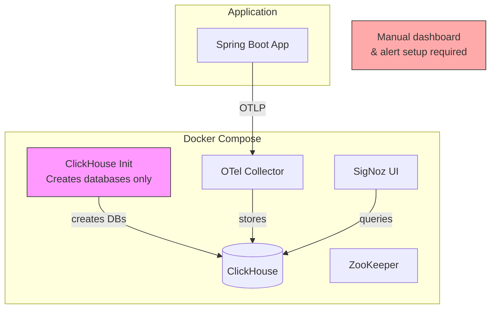
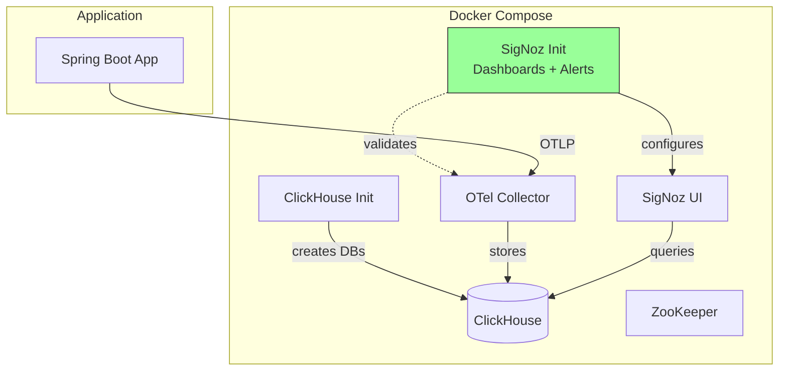
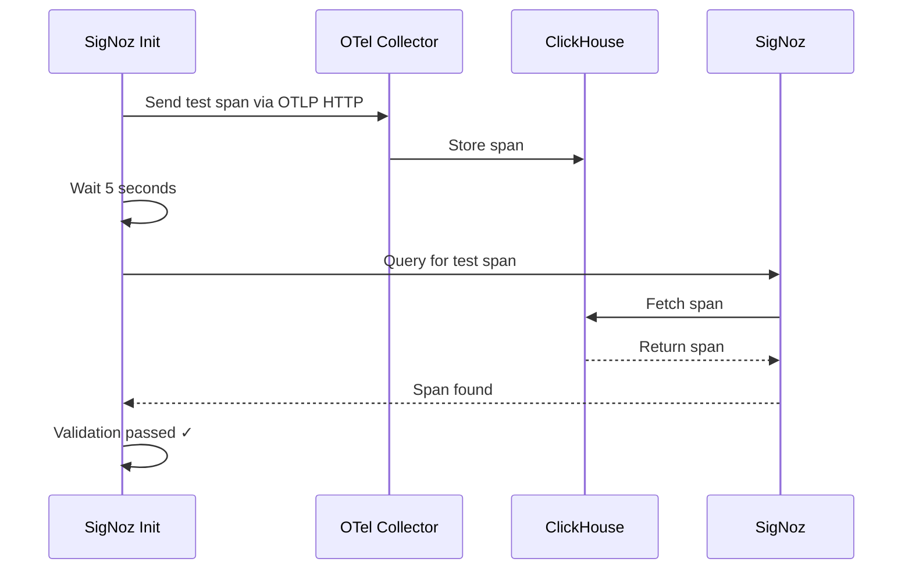
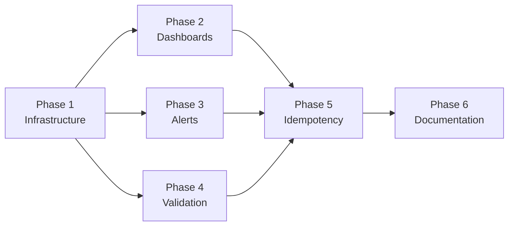

# Observability Platform Bootstrap

## Status: ✅ COMPLETED

**Implementation Date:** December 2025
**PR:** #96

## Overview

This document describes the implementation plan for bootstrapping the SigNoz observability platform with a one-time initialization container for local development. The init container configures default dashboards, alert rules, and validates the telemetry pipeline on startup.

## Goals

- **Automate observability setup** - Eliminate manual dashboard and alert configuration
- **Provide pre-built dashboards** - Import saga pattern-specific dashboards automatically
- **Configure alert rules** - Set up default alerts for saga failures and performance thresholds
- **Validate telemetry pipeline** - Verify traces, metrics, and logs flow correctly
- **Idempotent initialization** - Safe to re-run without duplicating configuration
- **Development parity** - Mirror production observability configuration locally

## Architecture

### Current State



### Target State



## Initialization Scope

### What the Init Container Configures

| Component | Configuration | Purpose |
|-----------|---------------|---------|
| Dashboards | Saga Pattern Dashboard | Visualize saga execution, step latency, failure rates |
| Dashboards | Infrastructure Dashboard | Monitor OTel collector, ClickHouse health |
| Alerts | Saga Failure Rate | Alert when compensation rate exceeds threshold |
| Alerts | Step Latency | Alert when saga steps exceed latency SLO |
| Alerts | Pipeline Health | Alert when telemetry stops flowing |
| Validation | Test Telemetry | Send test spans/metrics to verify pipeline |

### What Remains Manual

| Component | Reason |
|-----------|--------|
| Notification Channels | Requires external credentials (Slack, PagerDuty) |
| Custom Dashboards | Application-specific visualizations |
| Production Thresholds | Environment-specific tuning |

## Implementation Phases

### Phase 1: Init Container Infrastructure

Add a SigNoz initialization container to docker-compose.yml.

#### 1.1 Create Docker Directory Structure

```
docker/
└── signoz/
    ├── init.sh                    # Main initialization script
    ├── dashboards/
    │   └── saga-pattern.json      # Pre-built saga dashboard
    └── alerts/
        └── saga-alerts.json       # Pre-built alert rules
```

#### 1.2 Update docker-compose.yml

Add the signoz-init service after the signoz service:

```yaml
signoz-init:
  image: curlimages/curl:8.5.0
  container_name: saga-signoz-init
  volumes:
    - ./docker/signoz:/signoz/scripts
  entrypoint: /bin/sh
  command: /signoz/scripts/init.sh
  depends_on:
    signoz:
      condition: service_healthy
    otel-collector:
      condition: service_healthy
```

#### 1.3 Tasks

| Task | Description | Files | Status |
|------|-------------|-------|--------|
| 1.1.1 | Create docker/signoz directory | `docker/signoz/` | ⬜ |
| 1.1.2 | Create init.sh script | `docker/signoz/init.sh` | ⬜ |
| 1.1.3 | Add signoz-init service to docker-compose | `docker-compose.yml` | ⬜ |
| 1.1.4 | Test init container starts after SigNoz | Manual verification | ⬜ |

### Phase 2: Dashboard Configuration

Create and import pre-built dashboards for saga pattern monitoring.

#### 2.1 Saga Pattern Dashboard

The dashboard includes panels for:

| Panel | Metric/Query | Visualization |
|-------|--------------|---------------|
| Saga Throughput | `saga.started`, `saga.completed`, `saga.compensated` | Time series |
| Success Rate | `saga.completed / saga.started * 100` | Gauge |
| Compensation Rate | `saga.compensated / saga.started * 100` | Gauge |
| Saga Duration | `saga.duration` histogram | Histogram |
| Step Latency | `saga.step.duration` by step name | Time series |
| Failed Steps | `saga.step.failed` by step name | Bar chart |
| Active Traces | Service traces filtered by `sagapattern` | Table |

#### 2.2 Dashboard JSON Structure

```json
{
  "title": "Saga Pattern Monitoring",
  "description": "Dashboard for monitoring saga execution, step latency, and failure rates",
  "tags": ["saga", "observability"],
  "layout": [...],
  "variables": [],
  "widgets": [...]
}
```

#### 2.3 Import Process

The init script uses SigNoz's internal API:

```bash
# Check if dashboard already exists (idempotency)
EXISTING=$(curl -s "http://signoz:8080/api/v1/dashboards" | grep -c "Saga Pattern")

if [ "$EXISTING" -eq 0 ]; then
  curl -X POST "http://signoz:8080/api/v1/dashboards" \
    -H "Content-Type: application/json" \
    -d @/signoz/scripts/dashboards/saga-pattern.json
fi
```

#### 2.4 Tasks

| Task | Description | Files | Status |
|------|-------------|-------|--------|
| 2.1.1 | Create saga-pattern.json dashboard | `docker/signoz/dashboards/saga-pattern.json` | ⬜ |
| 2.2.1 | Add dashboard import logic to init.sh | `docker/signoz/init.sh` | ⬜ |
| 2.3.1 | Test dashboard appears in SigNoz UI | Manual verification | ⬜ |

### Phase 3: Alert Rule Configuration

Set up default alert rules for saga pattern monitoring.

#### 3.1 Alert Definitions

| Alert Name | Condition | Severity | Description |
|------------|-----------|----------|-------------|
| High Compensation Rate | `saga.compensated / saga.started > 0.1` | Warning | More than 10% of sagas requiring compensation |
| Saga Step Timeout | `saga.step.duration > 5s` | Warning | Saga step taking longer than 5 seconds |
| Pipeline Health | No metrics for 5 minutes | Critical | Telemetry pipeline may be down |

#### 3.2 Alert JSON Structure

```json
{
  "alert": "HighCompensationRate",
  "expr": "sum(rate(saga_compensated_total[5m])) / sum(rate(saga_started_total[5m])) > 0.1",
  "for": "2m",
  "labels": {
    "severity": "warning"
  },
  "annotations": {
    "summary": "High saga compensation rate detected",
    "description": "More than 10% of sagas are being compensated"
  }
}
```

#### 3.3 Tasks

| Task | Description | Files | Status |
|------|-------------|-------|--------|
| 3.1.1 | Create saga-alerts.json | `docker/signoz/alerts/saga-alerts.json` | ⬜ |
| 3.2.1 | Add alert import logic to init.sh | `docker/signoz/init.sh` | ⬜ |
| 3.3.1 | Test alerts appear in SigNoz | Manual verification | ⬜ |

### Phase 4: Pipeline Validation

Validate the telemetry pipeline is working end-to-end.

#### 4.1 Validation Steps



#### 4.2 Test Telemetry Payload

```bash
# Send a test span to verify the pipeline
curl -X POST "http://otel-collector:4318/v1/traces" \
  -H "Content-Type: application/json" \
  -d '{
    "resourceSpans": [{
      "resource": {
        "attributes": [{
          "key": "service.name",
          "value": {"stringValue": "signoz-init-test"}
        }]
      },
      "scopeSpans": [{
        "spans": [{
          "traceId": "test-trace-id-bootstrap",
          "spanId": "test-span-id",
          "name": "bootstrap-validation",
          "startTimeUnixNano": "1234567890000000000",
          "endTimeUnixNano": "1234567891000000000"
        }]
      }]
    }]
  }'
```

#### 4.3 Tasks

| Task | Description | Files | Status |
|------|-------------|-------|--------|
| 4.1.1 | Add test span send to init.sh | `docker/signoz/init.sh` | ⬜ |
| 4.2.1 | Add validation query to init.sh | `docker/signoz/init.sh` | ⬜ |
| 4.3.1 | Add status reporting output | `docker/signoz/init.sh` | ⬜ |

### Phase 5: Idempotency & Error Handling

Ensure the init script can be safely re-run.

#### 5.1 Idempotency Checks

| Resource | Check | Action if Exists |
|----------|-------|------------------|
| Dashboard | Query by title | Skip import |
| Alert | Query by name | Skip creation |
| Test Span | N/A | Always send (harmless) |

#### 5.2 Error Handling Strategy

```bash
# Exit on first error
set -e

# Retry logic for transient failures
retry_count=0
max_retries=3

while [ $retry_count -lt $max_retries ]; do
  if curl -s http://signoz:8080/api/v1/health | grep -q "ok"; then
    break
  fi
  retry_count=$((retry_count + 1))
  sleep 5
done
```

#### 5.3 Tasks

| Task | Description | Files | Status |
|------|-------------|-------|--------|
| 5.1.1 | Add idempotency checks for dashboards | `docker/signoz/init.sh` | ⬜ |
| 5.1.2 | Add idempotency checks for alerts | `docker/signoz/init.sh` | ⬜ |
| 5.2.1 | Add retry logic for API calls | `docker/signoz/init.sh` | ⬜ |
| 5.3.1 | Add comprehensive status output | `docker/signoz/init.sh` | ⬜ |

### Phase 6: Documentation

Update project documentation to reflect the new initialization process.

#### 6.1 Documentation Updates

| Document | Section | Content |
|----------|---------|---------|
| CLAUDE.md | Observability section | Add init container commands |
| README.md | Getting Started | Update docker compose instructions |
| INFRA-004 | Cross-reference | Link to this document |

#### 6.2 Tasks

| Task | Description | Files | Status |
|------|-------------|-------|--------|
| 6.1.1 | Update CLAUDE.md with init commands | `CLAUDE.md` | ⬜ |
| 6.2.1 | Update README observability section | `README.md` | ⬜ |

## Implementation Summary

### Phase Dependency Graph



### Files to Create/Modify

| Action | File | Phase |
|--------|------|-------|
| Create | `docker/signoz/init.sh` | 1, 2, 3, 4, 5 |
| Create | `docker/signoz/dashboards/saga-pattern.json` | 2 |
| Create | `docker/signoz/alerts/saga-alerts.json` | 3 |
| Modify | `docker-compose.yml` | 1 |
| Modify | `CLAUDE.md` | 6 |
| Modify | `README.md` | 6 |

### Verification Checklist

```bash
# Start all services
docker compose up -d

# Wait for initialization
docker compose logs -f saga-signoz-init

# Verify dashboard was created
curl http://localhost:3301/api/v1/dashboards | jq '.[] | select(.title | contains("Saga"))'

# Verify alerts were created
curl http://localhost:3301/api/v1/rules | jq '.[] | select(.name | contains("saga"))'

# Check initialization logs
docker logs saga-signoz-init 2>&1 | grep "complete"
```

### Rollback Plan

If the init container causes issues:

1. Remove signoz-init service from docker-compose.yml
2. Manually delete imported dashboards in SigNoz UI
3. Manually delete alert rules in SigNoz UI
4. Re-run `docker compose up -d`

## References

- [SigNoz Dashboard Management](https://signoz.io/docs/userguide/manage-dashboards/)
- [SigNoz Dashboard Templates](https://github.com/SigNoz/dashboards)
- [SigNoz Alerts Documentation](https://signoz.io/docs/userguide/alerts-management/)
- [SigNoz Terraform Provider](https://signoz.io/docs/dashboards/terraform-provider-signoz/)
- [OpenTelemetry OTLP Specification](https://opentelemetry.io/docs/specs/otlp/)
