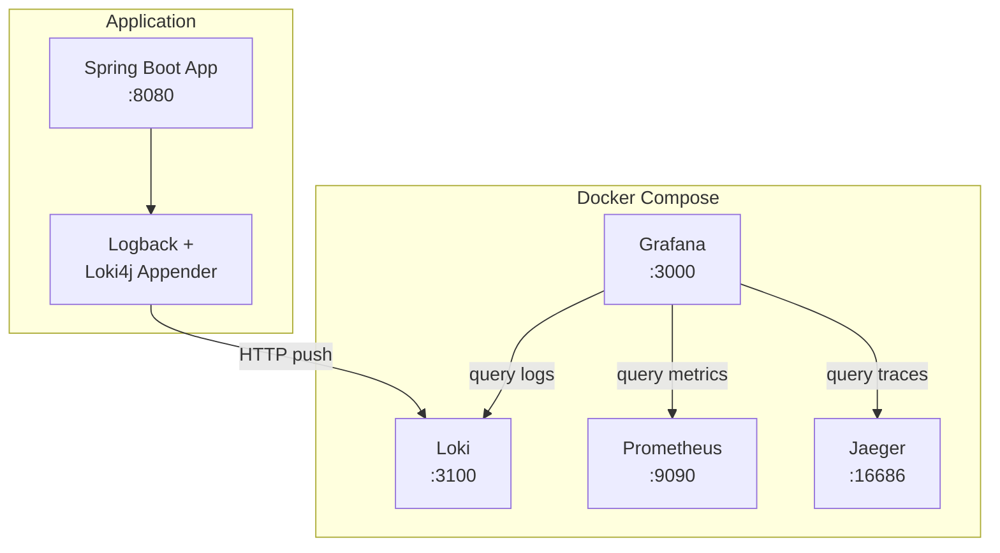

# Log Aggregation: Loki and Grafana

## Status: IN PROGRESS

**Created:** December 2025

## Overview

This document describes the implementation of centralized log aggregation using Grafana Loki for the saga pattern spike application. This completes the observability stack by adding logs alongside existing traces (Jaeger) and metrics (Prometheus/Grafana).

## Goals

- **Centralized Logging** - Aggregate all Spring Boot logs in Loki
- **Trace Correlation** - Link logs to distributed traces via traceId
- **Unified Dashboard** - View logs, metrics, and traces in Grafana
- **Structured Labels** - Enable efficient log queries with application, level, and logger labels

## Architecture



## Log Collection Approach

### Loki4j Logback Appender

We use [Loki4j](https://loki4j.github.io/loki-logback-appender/) to push logs directly from the Spring Boot application to Loki. This approach:

- Works when running `./gradlew bootRun` (app outside Docker)
- Works when running app in Docker
- No additional log collection agent needed
- Supports structured labels from MDC (including trace context)

### Alternative Approaches Considered

| Approach | Pros | Cons |
|----------|------|------|
| **Loki4j (chosen)** | Direct push, no agents, trace correlation | Requires app dependency |
| Promtail | Standard Loki agent | Requires log files or Docker config |
| Docker Loki Driver | No app changes | Only works for containerized apps |
| Grafana Alloy | Full OTLP support | More complex setup |

## Implementation Phases

### Phase 1: Loki Infrastructure

Add Loki service to `docker-compose.yml`:

```yaml
loki:
  image: grafana/loki:3.0.0
  container_name: saga-loki
  ports:
    - "3100:3100"
  command: -config.file=/etc/loki/local-config.yaml
  volumes:
    - ./docker/loki/loki-config.yaml:/etc/loki/local-config.yaml
    - loki_data:/loki
  healthcheck:
    test: ["CMD", "wget", "--spider", "-q", "http://localhost:3100/ready"]
    interval: 10s
    timeout: 5s
    retries: 5
```

Create `docker/loki/loki-config.yaml`:

```yaml
auth_enabled: false

server:
  http_listen_port: 3100

common:
  path_prefix: /loki
  storage:
    filesystem:
      chunks_directory: /loki/chunks
      rules_directory: /loki/rules
  replication_factor: 1
  ring:
    kvstore:
      store: inmemory

schema_config:
  configs:
    - from: 2020-10-24
      store: tsdb
      object_store: filesystem
      schema: v13
      index:
        prefix: index_
        period: 24h

limits_config:
  allow_structured_metadata: true

query_range:
  results_cache:
    cache:
      embedded_cache:
        enabled: true
        max_size_mb: 100
```

### Phase 2: Application Dependencies

Add Loki4j to `build.gradle.kts`:

```kotlin
dependencies {
    // Loki4j for log aggregation
    implementation("com.github.loki4j:loki-logback-appender:1.5.2")
}
```

### Phase 3: Logback Configuration

Update `src/main/resources/logback-spring.xml`:

```xml
<?xml version="1.0" encoding="UTF-8"?>
<configuration>
    <include resource="org/springframework/boot/logging/logback/defaults.xml"/>
    <include resource="org/springframework/boot/logging/logback/console-appender.xml"/>

    <!-- Loki Appender -->
    <springProfile name="!test">
        <appender name="LOKI" class="com.github.loki4j.logback.Loki4jAppender">
            <http>
                <url>${LOKI_URL:-http://localhost:3100}/loki/api/v1/push</url>
            </http>
            <format>
                <label>
                    <pattern>application=${APP_NAME:-sagapattern},host=${HOSTNAME},level=%level,logger=%logger{20}</pattern>
                    <readMarkers>true</readMarkers>
                </label>
                <message>
                    <pattern>%d{yyyy-MM-dd HH:mm:ss.SSS} [%thread] %-5level %logger{36} - %msg%n</pattern>
                </message>
                <sortByTime>true</sortByTime>
            </format>
        </appender>
    </springProfile>

    <root level="INFO">
        <appender-ref ref="CONSOLE"/>
        <springProfile name="!test">
            <appender-ref ref="LOKI"/>
        </springProfile>
    </root>

    <!-- Saga-specific logging -->
    <logger name="com.pintailconsultingllc.sagapattern" level="DEBUG"/>

    <!-- Reduce noise from Spring Cloud Vault -->
    <logger name="org.springframework.vault" level="WARN"/>
    <logger name="org.springframework.cloud.vault" level="WARN"/>

    <!-- Reduce noise from OpenTelemetry internals -->
    <logger name="io.opentelemetry" level="INFO"/>
</configuration>
```

### Phase 4: Trace Correlation

Spring Boot 4.0 with OpenTelemetry automatically adds trace context to MDC. Update the Loki label pattern to include trace IDs:

```xml
<label>
    <pattern>application=${APP_NAME:-sagapattern},host=${HOSTNAME},level=%level,logger=%logger{20},traceId=%X{traceId:-none},spanId=%X{spanId:-none}</pattern>
</label>
```

This enables:
- Filtering logs by traceId in Grafana
- Linking from logs to Jaeger traces
- Correlation across saga execution steps

### Phase 5: Grafana Datasource

Update `docker/grafana/provisioning/datasources/datasources.yml`:

```yaml
datasources:
  - name: Loki
    type: loki
    uid: loki
    access: proxy
    url: http://loki:3100
    editable: false
    jsonData:
      derivedFields:
        - datasourceUid: jaeger
          matcherRegex: "traceId=(\\w+)"
          name: TraceID
          url: "$${__value.raw}"
```

The `derivedFields` configuration creates clickable links from logs to Jaeger traces.

### Phase 6: Logs Dashboard

Create `docker/grafana/provisioning/dashboards/json/logs-dashboard.json` with:

- Log volume over time
- Log level distribution
- Recent logs table with filtering
- Trace correlation links

## Log Labels

| Label | Description | Example |
|-------|-------------|---------|
| `application` | Application name | `sagapattern` |
| `host` | Hostname | `localhost` |
| `level` | Log level | `INFO`, `ERROR`, `DEBUG` |
| `logger` | Logger name | `c.p.s.saga.OrderSagaOrchestrator` |
| `traceId` | OpenTelemetry trace ID | `abc123def456...` |
| `spanId` | OpenTelemetry span ID | `123abc...` |

## Infrastructure Ports

| Service | Port | Purpose |
|---------|------|---------|
| Loki | 3100 | Log ingestion and query API |
| Grafana | 3000 | Visualization (logs, metrics, traces) |

## Usage

### Start Infrastructure

```bash
docker compose up -d
```

### View Logs in Grafana

1. Open Grafana: http://localhost:3000
2. Go to Explore
3. Select "Loki" datasource
4. Query logs:
   ```logql
   {application="sagapattern"} |= "saga"
   ```

### Example LogQL Queries

```logql
# All logs from application
{application="sagapattern"}

# Filter by log level
{application="sagapattern", level="ERROR"}

# Filter by logger
{application="sagapattern", logger=~".*saga.*"}

# Search for text
{application="sagapattern"} |= "order"

# Filter by trace ID
{application="sagapattern", traceId="abc123"}

# Logs with JSON parsing
{application="sagapattern"} | json | line_format "{{.message}}"
```

### Correlate Logs with Traces

1. Find a log entry with a traceId
2. Click the "TraceID" link to open in Jaeger
3. Or copy traceId and search in Jaeger UI

## Environment Variables

| Variable | Description | Default |
|----------|-------------|---------|
| `LOKI_URL` | Loki server URL | `http://localhost:3100` |
| `APP_NAME` | Application name label | `sagapattern` |

## Testing Checklist

- [ ] Loki starts and shows ready status
- [ ] Loki datasource appears in Grafana
- [ ] Spring Boot logs appear in Loki
- [ ] Log labels are correctly applied
- [ ] Trace IDs appear in log labels
- [ ] TraceID links navigate to Jaeger
- [ ] Logs dashboard displays correctly

## References

- [Loki4j Logback Appender](https://loki4j.github.io/loki-logback-appender/)
- [Grafana Loki Documentation](https://grafana.com/docs/loki/latest/)
- [LogQL Query Language](https://grafana.com/docs/loki/latest/query/)
- [Install Loki with Docker](https://grafana.com/docs/loki/latest/setup/install/docker/)
